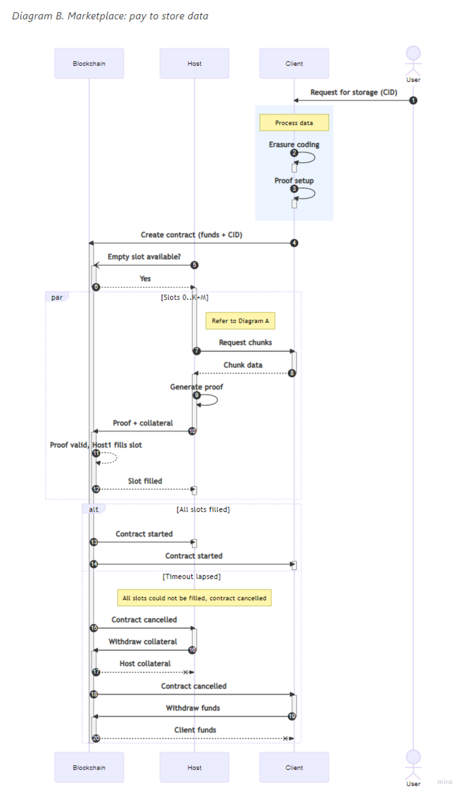

## Abstract

Codex Marketplace and its interactions are defined by a smart contract deployed on an EVM-compatible blockchain. 
This specification describes these interactions for all the different roles in the network. 

The specification is meant for a Codex client implementor. 
The goal is to create a storage marketplace that promotes durability.

## Motivation
The Codex network aims to create a peer-to-peer storage engine with strong data durability, 
data persistence guarantees and node storage incentives.
Support for resource restricted devices, like mobile devices should also be embraced.
The protocol should remove complexity to allow for a simple implementation and 
simplify incentive mechanisms.

## Semantics 

The key words “MUST”, “MUST NOT”, “REQUIRED”, “SHALL”, “SHALL NOT”, “SHOULD”, “SHOULD NOT”, “RECOMMENDED”, “MAY”, and “OPTIONAL” in this document are to be interpreted as described in [2119](https://www.ietf.org/rfc/rfc2119.txt).

### Definitions

| Terminology  | Description |
| --------------- | --------- |
| storage providers | A Codex node that provides storage services to the marketplace. |
| validator nodes | A Codex node that checks for missing storage proofs and triggers for a reward. |
| client nodes | The most common Codex node that interacts with other nodes to store, locate and retrieve data. |
| slots | Created by client nodes when a new dataset is requested to be stored. Discussed further in the [slots section](#slots).  |

### Storage Request

Client nodes can create storage requests on the Codex network via the Codex marketplace.
The marketplace handles storage requests, the storage slot state, 
storage provider rewards, storage provider collaterals, and storage proof state. 

To create a request to store a dataset on the Codex network,
client nodes MUST split the dataset into data chunks, $(c_1, c_2, c_3, \ldots, c_{n})$.
Using an erasure coding technique, 
the data chunks are encoded and placed into separate slots.
The erasure coding technique SHOULD be the [Reed-Soloman algorithm](https://hackmd.io/FB58eZQoTNm-dnhu0Y1XnA).

When the client node is prompted by the user to create a storage request, 
it MUST submit a transaction with the desired request parameters.
The requester MUST provide a `duration` value for the storage request along with the appropriate `reward`,
payment for request. 
Once a request is created via the transaction, 
all slots MUST be filled by storage providers before the request is officially started.
If the request does not attract enough storage providers after a time defined by `expiry` runs out, 
the request is `canceled`.
If canceled, the storage provider SHOULD initiate a transaction call in order to receive its `collateral` along with a portion of the `reward`. 
The remaining `reward` is returned to the requester.
The requester MAY create a new request with different values to restart the process.

In order to submit the new storage request with the transaction, 
the following parameters MUST be specified in the transaction call:

```solidity

  // the Codex node requesting storage
  address client;

  // content identifier
  string cid;

  // merkle root of the dataset, used to verify storage proofs
  byte32 merkleRoot;

  // amount of token from the requester to reward storage providers
  uint256 reward;

  // amount of tokens required for collateral by storage providers
  uint256 collateral;

  // frequency that proofs are checked by validator nodes
  uint256 proofProbability;

  // amount of desired time for stoage request
  uint256 duration;

  // the number of requested slots
  uint64 slots;

  // amount of storage per slot
  uint256 slotSize;

  // Amount of time before request expires
  uint256 expiry;

  // random value to differentiate from other requests
  byte32 nonce;

```

`cid` 

An identifier used to locate the dataset
- MUST be a [CIDv1](https://github.com/multiformats/cid#cidv1) with sha-256 based [multihash](https://github.com/multiformats/multihash)
- MUST be generated by the client node

`reward`

- it is an REQUIRED amount to be included in the transaction for a storage request.
- it SHOULD be amount of tokens offered per byte per second
- it MUST be a token known to the network.
After tokens are recevied by the Codex Marketplace,
it MUST released to storage providers who successfully fill slots and the storage request is complete.

`collateral`

All storage providers MUST provide token collateral before being able to fill a storage slot.
The following is related to storage provider who has offered `collateral`.

If a storage provider, filling a slot,
fails to provide enough proofs of storage, the `collateral` MUST be forfeited.
This MAY be managed by updating a smart contract object that tracks the number of missed proofs,
percentage of `collateral` already slashed, or number of slashed `collateral` for slot to be freed.
The storage provider MAY be able to fill the same failed slot,
but MUST replace any `collateral` that was already forfeited.

A portion of the `collateral` MUST be offered as a reward to validator nodes,
and a portion SHOULD be offered as a reward to other storage providers that repair freed [slots](#slots).

`proofProbability`

Determines the inverse probability that a proof is required in a period.
The probability MUST be:

$\frac{1}{proofProbability}$

- Storage providers are REQUIRED to provide proofs of storage per period that are submited to the marketplace smart contract and verified by validator nodes.
- The requester SHOULD provide the value for the frequency of proofs provided by storage providers.

`duration`

- it SHOULD be in seconds
- Once the `reward` has depleted from periodic storage provider payments,
the storage request SHOULD end.
The requester MAY renew the storage request by creating a new request with the same `cid` value.
Different storage providers MAY fulfill the request.
- Data MAY be considered lost during contract `duration` when no other storage providers decide to fill empty slots.

### Fulfilling Requests
In order for a storage request to start,
storage providers MUST enter a storage contract with the requester via the marketplace smart contract.

When storage providers are selected to fill a slot for the request,
storage providers MUST NOT abandon the slot, unless the slot state is `cancelled`, `complete` or `failed`.
If too many slots are abandoned, the slot state SHOULD be changed to `failed`.

Below is the smart contract lifecycle for a storage request:



### Slots
Slots is a method used by the Codex network to distribute data chucks amongst storage providers.
Data chucks, created by clients nodes, MUST use a method of distributing the dataset for data resiliency.
- Client nodes SHOULD decide how many nodes should fill the slots of a storage contract.
- Storage providers MUST be selected before filling a slot,

Each slot represents a chunk of a dataset provided during the storage request.
The first state of a slot is `free`, meaning that the slot is waiting to be reserved by a storage provider.
The Codex marketplace using a slot dispersal mechanism to decide what storage providers can reserve a slot, 
see [dispersal section below](#dispersal).

After a slot reservation is secured, the storage provider MUST:
- provide token collateral and proof of storage to fill the slot
- provide proofs of storage periodically
Once filled, the slot state SHOULD be changed from `reserved` to `filled`.

The `reward` payout SHOULD be calculated as periodic payments until the request `duration` is complete.
Once complete, the slot state SHOULD be changed to `finished` and payout occurs.

A slot MUST become empty after the storage provider fails to provide proofs of storage to the marketplace.
The state of the slot SHOULD change from `filled` to `free` when validator nodes see the slot is missing proofs.

The storage provider assigned to that slot MUST forfeit its `collateral`.
Other storage providers can earn a small portion of the forfeited `collateral` by providing a new proof of storage and `collateral`,
this is referred to as repairing the empty slot.

The slot lifecycle of a storage provider that has filled a slot is demonstrated below:

-----------

        proof &                                           proof &
      collateral   reserved    proof       missed      collateral                 missed
            |        |          |            |               |                      |
            v        v          v            v               v                      v
            -------------------------------------------------------------------------
     slot:  |///////////////////////////////|               |///////////////////////|
            ------------------------------------------------------------------------
                                            |                                       |
                                            v                                       v
                                        Update                          Check maxNumOfSlash 
                                    slashCriterion                 is reached -  Lost Collateral
                                (number of proofs missed)           


            ---------------- time ---------------->

#### Slot Dispersal

Storage providers compete with one another to store data from storage requests. 
Before a storage provider can download the data, they MUST obtain a reseversation for a slot.
The Codex network uses an expanding window based on the Kademlia distance function to select storage providers that are allowed to reserve a slot.

This starts with a random source address hash function that can be contructed as:

    hash(blockHash, requestId, slotIndex, reservationIndex);

`blockHash`: unique identifier for a specific EVM-compatible block

`requestId`: unique identifier for storage request

`slotIndex`: index of current empty slot

`reservationIndex`: index of current slot reservation

The unique source address, along with the storage provider's blockchain address, 
is used to calculate the expanding window.
The distance between the two addresses can be defined by:

$$ XOR(A,A_0) $$

The allowed distance over time $t_1$, can be defined as $2^{256} * F(t_1)$.
When the storage provider's distance is greater than the allowed distance,
the storage provider SHOULD be eligible to to obtain a slot reservation.

- Note after eligiblity, the storage provider MUST provide `collateral` and
storage proofs to make slot state change `reserved` to `filled`.

### Filling the Slot

When the value of the allowed distance increases,
more storage providers SHOULD be elgiblable to participate in reserving a slot.
The Codex network allows a storage provider is allowed to fill a slot after calculating the storage provider's Kademlia distance is less than the allowed distance.
The total value storage providers MUST obtain can be defined as:

$$ XOR(A,A_0) < 2^{256} * F(t_1) $$
- XOR(A,A_0) represents Kademlia distance function
- 2^{256} represents the total number of 256-bit addresses in the address space 
- F(t_1) represents the expansion function over time
Eligible storage providers represented below:

                             start point
                                  |           Kademlia distance
            t=3    t=2    t=1     v
      <------(------(------(------·------)------)------)------>
                      ^                            ^
                      |                            |
                 this provider is               this provider is
                  allowed at t=2                 allowed at t=3

## Copyright

Copyright and related rights waived via [CC0](https://creativecommons.org/publicdomain/zero/1.0/).

## References 

1. [Reed-Soloman algorithm](https://hackmd.io/FB58eZQoTNm-dnhu0Y1XnA)
2. [CIDv1](https://github.com/multiformats/cid#cidv1)
3. [multihash](https://github.com/multiformats/multihash)
4. [Proof-of-Data-Possession](https://hackmd.io/2uRBltuIT7yX0CyczJevYg?view)
5. [Codex market implementation](https://github.com/codex-storage/nim-codex/blob/master/codex/market.nim)


