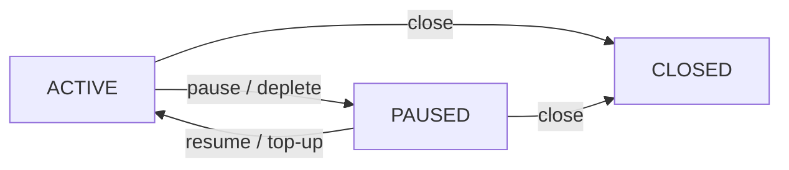
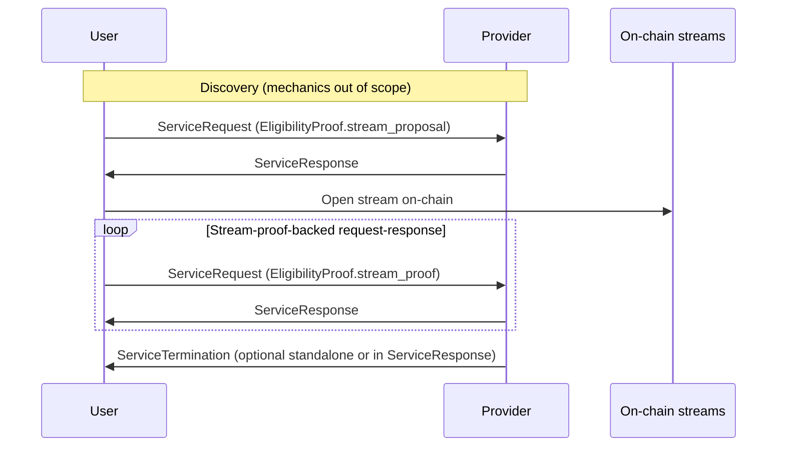

# PAYMENT-STREAMS

| Field | Value |
| --- | --- |
| Name | Payment Streams Protocol for Logos Services |
| Slug | 155 |
| Status | raw |
| Category | Standards Track |
| Editor | Sergei Tikhomirov <sergei@status.im> |
| Contributors | Akhil Peddireddy <akhil@status.im> |

<!-- timeline:start -->

## Timeline

- **2026-05-11** — [`1ac7689`](https://github.com/logos-co/logos-lips/blob/1ac7689ee3fe1665d5d5d1bf9c180ed951cc660d/docs/anoncomms/raw/payment-streams.md) — chore: split ift ts specs (#334)
- **2026-03-18** — [`e07c655`](https://github.com/logos-co/logos-lips/blob/e07c655a1fb86b46c99c3dd164a29438ab093b49/docs/ift-ts/raw/payment-streams.md) — Chore: move and fix header for payment streams spec (#295)
- **2026-02-24** — [`14fd5c0`](https://github.com/logos-co/logos-lips/blob/14fd5c09ccb76cb36ebb6a4b6c8082850172d330/vac/raw/payment-streams.md) — docs: add payment streams raw spec (#224)

<!-- timeline:end -->

## Abstract

This document specifies a payment streams protocol in three layers:
on-chain payment streams,
stream-backed eligibility for request-response services,
and the LEZ and Logos Delivery profile.

The on-chain payment streams protocol defines generic vault and stream semantics.
Vaults hold deposits.
Streams accrue funds to providers over time.
The chain enforces allocation accounting and lazy accrual
(computing accrued balances when a stream is touched by an on-chain operation)
using a chain-supplied timestamp.

Stream-backed eligibility for request-response services extends the
[incentivization specification](../../messaging/core/raw/incentivization.md)
with the `VaultProof`, `StreamProposal`, and `StreamProof` types.
Eligibility is the authorization to receive service.
This specification uses payment stream status as the eligibility criterion.
Providers advertise policy, negotiate parameters, and verify proofs against
on-chain state from the on-chain payment streams protocol.

The LEZ and Logos Delivery profile binds the protocol to the Logos Execution Zone (LEZ)
and the Logos Delivery Store query profile.
It maps abstract quantities to LEZ accounts and programs.
It records privacy tiers and wallet responsibilities.
It points to [Implementation Considerations](#implementation-considerations) for demo signing bytes.

Security and privacy properties are analyzed in a dedicated section.
Optional extensions are listed separately.

## Language

The key words "MUST", "MUST NOT", "REQUIRED", "SHALL", "SHALL NOT",
"SHOULD", "SHOULD NOT", "RECOMMENDED", "MAY", and "OPTIONAL"
in this document are to be interpreted as described in
[RFC 2119](http://tools.ietf.org/html/rfc2119).

## Change Process

This document is governed by the [1/COSS](../../research/draft/1/coss.md) (COSS).

## Motivation

Logos is a privacy-focused tech stack that includes
Logos Messaging, Logos Blockchain, and Logos Storage.

Logos Messaging comprises a suite of communication protocols
with both P2P and request-response structures.
The backbone P2P protocols use tit-for-tat mechanisms.
Incentivization is introduced
for auxiliary request-response protocols
with well-defined user and provider roles.
One such protocol is Store,
which allows users to query historical messages
from Logos Messaging relay nodes.

Logos Blockchain includes the Logos Execution Zone (LEZ),
which enables both transparent and shielded execution.

We target the following requirements for the payment protocol:

- Performance: Low latency and fees.
- Security: Limited loss exposure.
- Privacy: On-chain deposit identity unlinkable to off-chain service requests.
- Extendability: Simple initial design with room for enhancements.

Payment streams enable unidirectional time-based fund flows.
Streams map well to our use case.
Unlike alternatives (payment channels, e-cash),
payment streams avoid storing old states or initiating disputes,
and do not rely on a centralized mint.

The rest of this document is structured as follows.
First, we introduce an on-chain payment streams protocol.
Second, we define how it can be integrated
in a generic off-chain request-response protocol.
Third, we describe in more details the reference implementation
based on the LEZ (part of the Logos Blockchain)
and Store (part of Logos Messaging).
(TODO: UPDATE WITH REFERENCES for final structure)


## On-Chain Payment Streams Protocol

This section defines a chain-agnostic payment streams protocol.
This document refers to payment streams as streams.

### Roles

The protocol has two roles:

- User: the party paying for services.
- Provider: the party delivering services and receiving payment.

### Vaults and streams

The protocol uses a two-level architecture
of vaults and streams.

A vault holds a user's deposit in the vault's token
(the chain native token in the base streams protocol).
A user MAY have multiple vaults.
One vault MAY back multiple streams, possibly to different providers.

A stream represents an individual flow of funds from a vault to one provider.
Each stream MUST belong to exactly one vault.
Each stream MUST record a provider identifier in a chain-specific form.
That identifier MUST designate the party authorized to claim accrued funds.
Each stream MUST specify an accrual rate in the vault's token per time unit.
This specification does not fix the time unit.
Each chain integration MUST define the time unit used by rates and accrual.

To start using the protocol,
the user MUST deposit the vault's token into a vault.
The funds deposited into a vault are initially `unallocated`.
When creating a stream,
the user MUST allocate a portion of `unallocated` vault funds to that stream.
For each stream, `allocation` is the portion of vault funds reserved for that stream.

Let `balance` be the vault balance.
Let `total_allocated` be the sum of all `allocation` values for streams in a vault.
For each stream, funds within `allocation` accrue from the user to the provider.
Thus each `allocation` is divided into `accrued` and `unaccrued`.

The following identities MUST hold:

```text
balance = total_allocated + unallocated
allocation = accrued + unaccrued
```

Vault operations include:

- Initialize: create an empty vault.
- Deposit: increase `balance` and `unallocated`.
- Withdraw: decrease `balance` by at most `unallocated`.

The user MAY withdraw unallocated funds at any time.
Vault operations MUST NOT modify allocated funds.

Any change to a stream's `allocation` MUST be funded only from that vault's
`unallocated` balance.
An increase to `allocation` MUST decrease `unallocated` by the same amount,
increase `total_allocated` by the same amount,
and MUST NOT change vault `balance`.
An operation that increases `allocation` MUST fail when `unallocated` is
insufficient.

### Stream lifecycle

At any point in time, a stream MUST be in one of the following states:
`ACTIVE`, `PAUSED`, `CLOSED`.

A stream is depleted when `unaccrued = 0`.

State transition diagram:



Stream operations include:

- Create: bind a provider, set rate and initial `allocation`.
- Pause: stop accrual when the stream is `ACTIVE`.
- Resume: resume accrual when the stream is `PAUSED` and not depleted.
- Top-up: increase the stream's `allocation`.
- Close: release remaining `unaccrued` to vault `unallocated` and mark the stream `CLOSED`.
- Claim: transfer all `accrued` funds to the provider; set `accrued` to zero and
  decrease `allocation` and the vault's `total_allocated` by the claimed amount.

The user MAY create a stream if the vault has `unallocated` funds.
A newly created stream MUST be `ACTIVE`.
Funds MUST accrue only while the stream is `ACTIVE`.

The user MAY pause a stream while the stream is `ACTIVE`.
The stream also transitions from `ACTIVE` to `PAUSED` automatically
when the stream becomes depleted.

The user MAY resume a stream while the stream is `PAUSED`.
Resume MUST fail if the stream is depleted.

The user MAY top-up a stream.
Top-up MUST increase `allocation` and the vault's `total_allocated` by the same amount.
Top-up MUST transition the stream to `ACTIVE`.
To add funds and keep the stream `PAUSED`,
the user MUST pause the stream after top-up.

Either user or provider MAY close the stream from any non-`CLOSED` state.
Unaccrued funds of a `CLOSED` stream MUST be immediately transferred to the vault's `unallocated` balance.
A `CLOSED` stream MUST NOT transition to any other state.
Accrued funds of a `CLOSED` stream remain available for the provider to claim.

The provider MAY claim accrued funds from a stream in any state.
A claim MUST transfer the full accrued funds to the provider.
Close on a `CLOSED` stream MUST fail.

### Lazy accrual and folding

A chain integration MUST expose a monotonic system timestamp.
The integration MUST define which accounts or system values supply that timestamp.
Accrual MUST be computed relative to the timestamp.

As stream state is a pure function of stored on-chain fields,
stream parameters, lifecycle state, and the timestamp at fold time,
any party can compute the effective stream state locally.
On-chain state remains the source of truth for protocol operations.
Lifecycle and balances can change with passing time,
but stored on-chain fields can only be updated as a result of a transaction.

Stored `accrued`, stored `unaccrued`,
and a depletion-driven transition to `PAUSED` MAY lag behind the effective
state at the current timestamp.
To fold a stream means to advance on-chain fields to match a fold timestamp.
Any stream operation MUST fold the stream before executing its logic.

Each stream MUST record an accrual anchor:
the stored timestamp through which the stored `accrued` value has been computed.
When folding at timestamp `t`, let `Δt` be `t` minus the accrual anchor.
If the stream is not `ACTIVE`,
folding MUST leave `accrued` and the accrual anchor unchanged.
Otherwise the fold MUST set:

```text
accrued := min(allocation, accrued + rate × Δt)
```

If after folding the stream is depleted,
the accrual anchor MUST be set to the timestamp at which depletion occurred
(MAY be earlier than `t`).
Otherwise the accrual anchor MUST be set to `t`.

### Protocol Extensions for Payment Streams

This section describes optional modifications
to the streams protocol.

#### Auto-Pause

In the base streams protocol,
the user SHOULD pause or close a stream when the provider stops delivering service.
If the user is offline,
a stream that is `ACTIVE` MAY keep accruing until the stream is depleted,
which increases loss exposure while service is unavailable.

The auto-pause extension limits offline exposure by time,
in addition to the funds cap from `allocation`.
When creating a stream,
the user MAY specify an auto-pause duration.
When that duration elapses since stream creation or since the last resume,
the stream MUST automatically transition to `PAUSED`.
The user MAY resume the stream.
Each resume MUST restart the auto-pause duration from the time of that resume.

#### Automatic Claim on Closure

In the base streams protocol,
close does not pay the provider.
Accrued funds remain on a `CLOSED` stream until the provider claims them.

The automatic claim on closure extension merges close and claim.
When creating a stream,
the user MAY enable auto-claim.
When auto-claim is enabled,
close MUST transfer all accrued funds to the provider in the same operation,
so the closed stream holds no funds afterward.

This removes the need for the provider to track or claim balances on closed streams.
Trade-offs include:

- The provider can no longer batch claims across streams.
- Close and payout happen in one transaction,
  which can increase timing correlation for observers.
- When the user initiates close on a fee-charging chain,
  the same transaction runs the provider payout logic,
  so the user pays transaction fees for that logic,
  instead of the provider paying via a separate claim.
- If the payout fails,
  close fails atomically and the stream does not transition to the `CLOSED` state.

#### Activation Fee

In the base streams protocol,
accrual runs only while the stream is `ACTIVE`.
The user MAY pause at any time and MAY resume while the stream is `PAUSED`
and not depleted.
A user can leave the stream `PAUSED` for long periods,
resume briefly to obtain service,
and pay only for the short intervals while the stream is `ACTIVE`.

The activation fee extension charges a fee when accrual starts.
When creating a stream,
the user MAY specify an activation fee.
Whenever an operation transitions the stream to `ACTIVE`,
a fixed amount MUST be accrued in addition to regular time-based accrual.
The fee SHOULD reflect the provider's minimum acceptable payment for a service session.
If `unaccrued` is less than the activation fee,
activation MUST fail.

Providers MAY also mitigate pause-and-resume attacks through off-chain policy.

#### Multi-Token Vaults

In the base streams protocol,
the vault's token is the chain native token
and needs no on-chain identity field.

The multi-token vaults extension allows settling in other assets.
When enabled,
each vault MUST record exactly one token identity in chain-specific form.
Every stream in that vault MUST denominate
rate, `allocation`, `accrued`, and claims in that vault's token.
A vault MUST NOT mix multiple token types.

#### Delivery Receipts

In the base streams protocol,
funds accrue based purely on on-chain stream state.
The provider does not submit off-chain proof that service was delivered.

The delivery receipts extension ties claim to user acknowledgment.
When creating a stream,
the user MAY require delivery receipts for claim.
When receipts are required,
claim MUST include valid receipts.

A delivery receipt is an off-chain message signed by the user.
It MUST include the on-chain stream identifier
(as assigned at stream creation, in chain-specific encoding),
service delivery details covered by the claim,
and a signature over those fields.

Integrations choose how many deliveries each receipt covers.
Trade-offs include:

- Per-message receipts let the user approve each delivery separately
  but increase signing and coordination overhead.
- Batched receipts reduce signing overhead
  but require the user to approve multiple deliveries in one step.

## Stream-Backed Eligibility for Request-Response Services

This section defines how streams back service eligibility
in the incentivization request-response framework,
where each request carries an eligibility proof and each response carries
an eligibility status.
It extends the generic `ServiceRequest`, `ServiceResponse`,
`EligibilityProof`, and `EligibilityStatus` envelope from the
[incentivization specification](../../messaging/core/raw/incentivization.md)
with stream-backed proof types.

Off-chain messages coordinate stream lifecycle and service delivery.
On-chain [Vaults and streams](#vaults-and-streams) and [Stream lifecycle](#stream-lifecycle)
semantics are the source of truth for fund allocation, accrual, and stream state.

This section builds on the user and provider roles and stream accounting from the
[On-Chain Payment Streams Protocol](#on-chain-payment-streams-protocol).

### Protocol overview

The protocol consists of the following stages:

- Discovery.
  Providers advertise `StreamProviderPolicy`.
  Discovery mechanics are out of scope for this specification.
- Initial request-response exchange.
  The user sends a `StreamProposal` in the first `ServiceRequest`;
  the provider MAY accept and serve the first unit.
- Stream-proof-backed request-response.
  Each further `ServiceRequest` carries a `StreamProof`.
- Termination.
  The provider ends service with `ServiceTermination`
  (standalone or inside `ServiceResponse.eligibility_status`).



### Cryptographic commitments

Cryptographic commitments (`VaultProof.owner_signature`, `StreamProof.signature`)
MUST use a chain-specific canonical form.
A chain integration MUST define how signed material covers the required fields.

The `owner_public_key` field identifies the key used to verify `owner_signature`.
Chain-specific integrations MUST define how `owner_public_key`
maps or binds to the user identifier (the vault owner) stored on-chain.

The `owner_signature` field proves that the user authorizes
the proposed stream session.
It MUST cover at least the `VaultProof` fields
other than `owner_signature`,
the accompanying `StreamParams`,
and the `StreamProposal.public_key`.
This prevents a valid vault proof from being recombined
with different stream parameters or a different session key.

The exact owner-signature scheme,
public-key encoding,
and canonical signed payload are chain-specific details.
They MUST be deterministic and covered by test vectors.

Chain-specific integrations MUST define how `provider_id`
maps or binds to the on-chain provider identifier used by that chain.

`StreamProof.signature` follows the same encoding and signing rules as
`VaultProof.owner_signature`.

### Message structure

The message structure is as follows.

Request path:

```text
ServiceRequest
├── request_data
└── eligibility_proof: EligibilityProof
    └── exactly one of:
        ├── stream_proposal: StreamProposal
        │   ├── vault_proof: VaultProof
        │   ├── stream_params: StreamParams
        │   └── public_key
        └── stream_proof: StreamProof
            ├── stream_id
            └── signature
```

Response path:

```text
ServiceResponse
├── eligibility_status (status_code, status_desc; MAY carry termination fields)
└── response_data (if the request is served)

ServiceTermination (standalone or equivalent fields in eligibility_status)
```

#### `ServiceRequest`

A `ServiceRequest` has the fields shown in the request path.

#### `ServiceResponse`

A `ServiceResponse` MUST include:

- `eligibility_status`: an `EligibilityStatus` with:
  - `status_code`: indicating acceptance,
    parameter rejection, proof invalidity, etc.
  - `status_desc`: human-readable description
    (RECOMMENDED to include actionable guidance
    on parameter rejection)
- `response_data`: service-specific payload
  (included if and only if the request is served)

Stream-backed eligibility uses the following `EligibilityStatus.status_code` values:

| `status_code` | Name | Meaning |
| --- | --- | --- |
| 0 | `OK` | Request served. |
| 1 | `PARAMS_REJECTED` | Stream or policy parameters unacceptable. User MAY retry with adjusted parameters. |
| 2 | `PROOF_INVALID` | Malformed proof, failed signature, or failed cryptographic verification. |
| 3 | `STREAM_NOT_ACTIVE` | Referenced stream is missing, not active on-chain, or otherwise unavailable for service. |

#### `EligibilityProof`

```protobuf
message EligibilityProof {
  optional bytes proof_of_payment = 1; // unused in stream-backed mode
  optional bytes stream_proposal = 2;
  optional bytes stream_proof = 3;
}
```
The user MUST NOT set `proof_of_payment` or other non-stream incentivization
fields when using stream-backed eligibility.
Exactly one of `stream_proposal` or `stream_proof` MUST be present.
If both are absent, or both are present, the provider MUST treat the proof as
malformed and respond with `PROOF_INVALID`.

#### `StreamProposal`

```protobuf
message StreamProposal {
  VaultProof vault_proof = 1;
  StreamParams stream_params = 2;
  bytes public_key = 3; // session key for signing subsequent service requests
}
```

The user signs each `StreamProof` with the private key for `public_key`.

#### `StreamProof`

A `StreamProof` links a request to an active stream.

```protobuf
message StreamProof {
  bytes stream_id = 1; // on-chain identifier of the stream
  bytes signature = 2; // signature over request_data using committed public_key
}
```

#### `VaultProof`

A `VaultProof` proves that the user controls a vault
with sufficient unallocated funds
to back the proposed stream.

```protobuf
message VaultProof {
  bytes vault_id = 1; // on-chain identifier of the vault
  bytes provider_id = 2; // target provider (prevents replay)
  bytes owner_public_key = 3; // key used to verify owner_signature
  bytes owner_signature = 4; // signature over the proposal
}
```

The `provider_id` field is the provider identity used by this protocol.
It prevents replaying a `VaultProof` between providers.
For example, a chain integration MAY bind `provider_id`
to a long-lived service identity,
and separately bind that service identity
to the chain account that receives stream claims.

#### `StreamParams`

```protobuf
message StreamParams {
  bytes service_id = 1; // identifier of the requested service
  uint64 stream_rate = 2; // proposed accrual rate (tokens per time unit)
  uint64 allocation = 3; // proposed initial allocation
  uint64 create_stream_deadline = 4; // latest create_stream time (absolute timestamp)
}
```

`StreamParams` holds the proposed stream fields for one `StreamProposal`.
`service_id` identifies the request-response service for the stream session.

#### `StreamProviderPolicy`

The provider advertises its policy in the following message:

```protobuf
message StreamProviderPolicy {
  uint64 min_rate = 1;
  uint64 min_allocation = 2;
  uint64 max_create_stream_deadline_delay = 3;
  uint64 vault_proof_max_response_bytes = 4;
}
```

#### `ServiceTermination`

```protobuf
message ServiceTermination {
  enum TerminationType {
    TEMPORARY = 0;
    PERMANENT = 1;
  }
  TerminationType termination_type = 1;
  uint64 resume_after = 2;
}
```

For `PERMANENT` termination, `resume_after` MUST be zero.
For `TEMPORARY` termination, `resume_after` MUST be a chain timestamp
after which service MAY resume.

### Protocol Flow

#### Discovery

Parties MUST agree on stream parameters before stream creation.
A separate discovery protocol SHOULD enable providers to advertise their policies.

The provider SHOULD also announce accepted eligibility proof types.
If a provider accepts stream-backed eligibility roofs,
its advertisement MUST include a `StreamProviderPolicy`.
If the provider accepts more than one asset,
the advertisement MUST also state which assets are accepted.

New `StreamProviderPolicy` advertisements apply only to new proposals.
The user SHOULD read the advertised policy before building a `StreamProposal`.
The provider MUST reject a proposal that does not conform to its current policy.

#### Initial request-response exchange

The initial request MUST carry a stream proposal.
The provider MUST verify the vault proof and proposal parameters against
on-chain vault state and against its current policy,
verify the owner signature with the declared public key over the
canonical proposal payload,
and confirm that public key matches the vault owner on-chain for
the vault named in the proof.
The provider MUST reject the proposal when proposed allocation exceeds
unallocated funds.
The user MUST ensure that pending proposals from a vault do not commit more
allocation than the vault's unallocated balance.
A user MUST NOT send a new `StreamProposal` to the same vault-provider
pair while another is pending.

A policy defines a maximum time interval
from proposal verification
until the stream MUST be open on-chain
(RECOMMENDED default: 300 seconds).
At proposal verification time `t`,
the provider MUST verify that the deadline is
between `t` and `t` plus the policy-defined interval.
The user MUST set the deadline within these bounds in the stream proposal.
If chain time passes the deadline without acceptance,
negotiation for that proposal MUST be treated as failed.
The provider MUST NOT accept that proposal afterward.
The user MAY withdraw unallocated funds, fund other streams, and
MAY send a new proposal to any provider.

If the proof is invalid, the provider MUST respond with
`PROOF_INVALID`.
If parameters fail policy, the provider MUST respond with
`PARAMS_REJECTED`.
The user MAY send a new proposal with adjusted parameters.
The provider SHOULD limit parameter-rejection retries
to a RECOMMENDED maximum of 5 per vault
within a RECOMMENDED time window of 600 seconds.

A service session is the provider's off-chain record for delivering
service under one accepted `StreamProposal`.
When the provider accepts a proposal,
it MUST respond with `OK` and a response payload.
The provider MUST record service session state for the accepted
proposal.
Session state includes accepted `StreamParams`,
session public key,
the agreed-upon `StreamProviderPolicy`,
`VaultProof` fields used for verification
(`vault_id`, `provider_id`, `owner_public_key`),
and `stream_id` after the first valid stream proof.
Later stream-proof verification MUST use the pinned policy.
The provider SHOULD limit the first vault-proof-backed response to
`vault_proof_max_response_bytes` from policy
(RECOMMENDED default: 65536 bytes).

After the provider accepts the proposal,
the user MUST open the stream on-chain before the deadline
from the accepted `StreamParams`.
On-chain rate and stored allocation commitment MUST be at least the signed
proposal terms.
Until the stream exists on-chain or the deadline passes without a compliant
stream, the user MUST keep unallocated at least the accepted allocation.
If creation fails for insufficient unallocated after the service session begins, the user has
breached that obligation.
The provider SHOULD send `PERMANENT` `ServiceTermination`.
The user MUST complete on-chain stream creation before sending another
`StreamProposal` to that provider after the provider accepts the proposal.

#### Stream-proof-backed request-response

Until a compliant stream exists on-chain,
the user MUST NOT send `EligibilityProof.stream_proof`.
If the provider receives a stream proof before a compliant stream exists,
it MUST respond with `STREAM_NOT_ACTIVE` or `PROOF_INVALID`.
After a compliant stream exists on-chain,
each further `ServiceRequest` MUST carry `StreamProof` in `EligibilityProof.stream_proof`.

The provider MUST fold the stream state before verifying compliance.
On every stream-proof request, the provider MUST verify
the stream proof signature over `request_data`,
that the stream is `ACTIVE`,
that the stream identified by `stream_id` complies with the accepted policy,
and that the request corresponds to the accepted `StreamParams.service_id`
according to the service integration.
`service_id` is fixed for that service session.
Changing `service_id` requires a new signed proposal.

When the stream proof signature fails or the proof is malformed,
the provider MUST respond with `PROOF_INVALID`.
If the stream is not `ACTIVE`, or the stream account is missing,
the provider MUST respond with `STREAM_NOT_ACTIVE`.
When the stream does not comply with the accepted proposal or agreed-upon
`StreamProviderPolicy`, the provider MUST respond with `PARAMS_REJECTED`.

The provider MAY retain session state across user pause.
After resume, the user MAY send further stream proofs under the same
service session.

If the first stream-proof request arrives after `create_stream_deadline`,
the provider MUST reject with `PARAMS_REJECTED`.
If `create_stream_deadline` passes with no compliant stream,
the provider MAY drop session or pending-proposal state.
The proposal failure semantics from the pending state MUST apply.

#### Termination

A service session ends when the provider sends `ServiceTermination`
or drops session state.

The provider SHOULD send a `ServiceTermination` message before stopping service.
The message MAY be sent at any point,
including before a stream is established on-chain.
It MUST use the `ServiceTermination` wire message,
or equivalent fields carried inside `EligibilityStatus` on a `ServiceResponse`
on transports that do not use a standalone termination message.
Termination fields are separate from stream-backed `EligibilityStatus.status_code`
values.
A `ServiceResponse` MAY include both service outcome status and termination metadata.

When the provider has ended service or the user stops requesting service,
the user MAY pause or close the on-chain stream and MAY stop sending stream-proof requests.

For `TEMPORARY` termination,
the user MAY pause the stream until the `resume_after` time.
After `TEMPORARY` `ServiceTermination`,
the provider MAY resume service under the same service session once `resume_after` has passed.

After `PERMANENT` `ServiceTermination`,
the user SHOULD close the stream promptly.
The provider SHOULD treat that service session as closed.
Further service requires a newly accepted `StreamProposal`.

### Protocol Extensions for Request-Response Protocol

This section describes optional extensions
to the request-response protocol with streams-backed eligibility.

#### Load Cap

In the base request-response protocol,
`StreamProviderPolicy` includes `vault_proof_max_response_bytes`,
which limits the size of one vault-proof-backed response
before a stream exists on-chain.
It does not cap cumulative resource use across a service session.

The load cap extension adds a cumulative limit per stream per time window
(e.g. total bytes or requests per minute).
The provider  if using this extension.

When this extension is used,
the provider MUST advertise a load cap via discovery.
The provider MAY refuse to serve requests that would exceed the cap.

When sustained load requires a higher cap,
the user SHOULD open multiple streams to the same provider.
Note that the user MAY request work without knowing response size in advance
(such as message history over a time range).

#### Multi-round Stream Parameter Negotiation

In the base request-response protocol,
`PARAMS_REJECTED` does not carry provider counter-proposals.
A future extension MAY allow counter-proposed parameters in a
`PARAMS_REJECTED` response,
enabling iterative negotiation before the first request is served.

-------------------------------------------------------------------------

## LEZ and Logos Delivery Profile

This section maps the [On-Chain Payment Streams Protocol](#on-chain-payment-streams-protocol)
and [Stream-Backed Eligibility for Request-Response Services](#stream-backed-eligibility-for-request-response-services)
onto the Logos Execution Zone.

In this document, we focus on the Logos Execution Zone (LEZ),
part of the Logos Blockchain.
LEZ satisfies the [timestamp](#lazy-accrual-and-folding) requirements
via caller-supplied system clock accounts (see Implementation Considerations).

LEZ hosts vault and stream accounts,
the payment-streams guest program,
and platform programs including clock and authenticated transfer.

LEZ-specific clock account identifiers and off-chain signing byte layouts are
recorded under Implementation Considerations.

### Accounts and identities

#### Account types

The program stores state in three account types:
`VaultConfig`, `VaultHolding`, and `StreamConfig`.

`VaultConfig` stores vault metadata and the authorization anchor.
Its `owner` field is the authorization anchor for user-gated instructions.
For `PseudonymousFunder`-tier vaults,
`owner` MUST be an identifier derived from a nullifier public key,
distinct from the user's key associated with their public on-chain activity.

`VaultHolding` holds all vault funds
and stores only a version byte in its application data.

`StreamConfig` stores per-stream parameters and lazy accrual state.

The following mapping applies:

| On-chain quantity | LEZ representation |
| --- | --- |
| Vault `balance` | `VaultHolding` platform-native balance |
| `total_allocated` | `VaultConfig.total_allocated` |
| Per-stream allocation and accrual | Fields in `StreamConfig` |

Instructions update `VaultConfig.total_allocated`
whenever any stream's `allocation` changes.

#### PDA derivation

Vault and stream accounts are program-derived addresses (PDAs):
their identifiers are derived deterministically from canonical seeds.
Any party can compute a vault or stream address locally
given the owner identifier, vault identifier, and stream identifier.

`VaultConfig` seeds include the owner account identifier
and a user-chosen vault identifier.
`VaultHolding` is derived from the `VaultConfig` address.
`StreamConfig` is derived from the `VaultConfig` address
and a stream identifier assigned sequentially by the program on stream creation.
Provider identity is stored as a field in `StreamConfig`
rather than encoded in the PDA seeds,
so a vault may back multiple streams to the same provider.

#### Privacy tiers

LEZ supports two execution modes:
transparent (public account visibility)
and shielded (hidden via zero-knowledge proofs).

A privacy tier is stored in `VaultConfig` and is immutable for the vault's lifetime.

- `Public`: the vault MAY be operated via transparent or shielded transactions.
  Funder unlinkability is not provided.
- `PseudonymousFunder`: the vault is intended for shielded-only operation.
  Funder unlinkability is provided under a conforming wallet.

See Security and Privacy Considerations for analysis.

#### Programs and interactions

On LEZ, the following programs and roles interact:

- Payment-streams guest program: owns vault and stream PDAs.
  It enforces allocation accounting, lazy accrual, lifecycle transitions, and
  authorization predicates described in the streams protocol and this section.
- Platform authenticated-transfer program: moves native balance from the
  user's account into `VaultHolding` on deposit.
  The guest validates that the user controls the vault and amount,
  then chains a transfer call to the program id supplied in the instruction.
- System clock accounts: supply monotonic timestamps for stream folding and
  for comparing against off-chain `create_stream_deadline`.
- Wallet / submitter: chooses transparent versus shielded execution,
  constructs account lists, and enforces client-side privacy policy.

### LEZ authorization

All but two instructions require authorization by the user.
`CloseStream` is authorized by either the user or the provider.
`Claim` is authorized by the provider.
Both `CloseStream` and `Claim` include the user
as an explicit non-signing account,
checked for equality with `VaultConfig.owner`.

#### Operation correspondence

The table maps streams operations to the reference guest instruction
names.
Effects summarize changes to `VaultHolding` balance (B), per-stream
`allocation`, and `VaultConfig.total_allocated` after a successful instruction.
Stream-touching instructions fold accrual to the supplied clock time first.

| On-chain operation | Reference instruction | Authorizer | B / allocation / total_allocated effect |
| --- | --- | --- | --- |
| Initialize vault | `InitializeVault` | Vault owner | Creates empty vault accounts. No balance change. |
| Deposit | `Deposit` | Vault owner | B increases by deposit amount. `total_allocated` unchanged. |
| Withdraw unallocated | `Withdraw` | Vault owner | B decreases by withdraw amount. `total_allocated` unchanged. |
| Create stream | `CreateStream` | Vault owner | Stream `allocation` set. `total_allocated` increases by same amount. |
| Pause stream | `PauseStream` | Vault owner | Accrual stops. Allocation fields unchanged. |
| Resume stream | `ResumeStream` | Vault owner | Accrual resumes. Allocation fields unchanged. |
| Top-up stream | `TopUpStream` | Vault owner | Stream `allocation` and `total_allocated` increase by top-up amount. MAY transition to `ACTIVE`. |
| Close stream | `CloseStream` | Vault owner or stream provider | Unaccrued returned to vault (B unchanged). Stream `allocation` and `total_allocated` decrease by released unaccrued. Accrued MAY remain until claim. |
| Claim accrued | `Claim` | Stream provider | B decreases by payout. Provider balance increases. Stream `allocation` and `total_allocated` decrease by payout. |

### LEZ proof bindings

For LEZ integrations, a LEZ integration derives the public account identifier
from `VaultProof.owner_public_key`
and compares it with `VaultConfig.owner`.

For LEZ public-vault integrations,
the expected owner-signature scheme is the Schnorr signature scheme.
Both `VaultProof.owner_signature` and `StreamProof.signature` sign a 32-byte digest.
Signed material covers canonical field bytes only.
Protobuf field numbers stay out of scope for signing.
`provider_id` is the 32-byte stream provider `AccountId`.
The LEZ provider identifier checks compare it to `StreamConfig.provider`
with octet equality.


## Security and Privacy Considerations

This section describes the privacy properties of the protocol,
what they provide, and their limits.

### Privacy Goals

In this section, funder means the user in the role of funding a vault on chain.

The primary privacy goal is funder unlinkability:
preventing an observer from linking the user's primary public key
to on-chain vault and stream activity.

A secondary goal is provider privacy:
enabling a provider to receive funds
without revealing their real receiving addresses.
Observers still see stream payment terms on-chain in `StreamConfig`
(rate, allocation, provider identifier).
`StreamParams.service_id` remains off-chain in the service session.
Providers bind each request to the signed value for that service session.

### Execution Modes and Linkability

The same program logic executes in both transparent and shielded transactions.
Business logic — accrual math, lifecycle transitions, authorization predicates —
is identical across modes.
What differs is account visibility
and what linkage an observer can infer from on-chain artifacts.

Vault and stream PDAs are public accounts regardless of execution mode.
An observer can reconstruct the vault-to-stream graph from public account identifiers.
Shielded execution can hide the identity behind private signing accounts
and the destinations of private transfers,
while the existence of a stream,
its accrual state,
and the association between a vault and its streams remain visible.

### Stream Lifetime and Funder Unlinkability

If a stream is created in a transparent transaction,
it is permanently linked to the user on-chain.
No subsequent shielded execution can undo this linkage.
To achieve funder unlinkability,
a stream must be created and operated entirely via shielded transactions.

The protocol captures this through two tiers assigned at vault creation time.

A `Public`-tier vault may use transparent and shielded transactions.
Shielded execution provides selective confidentiality on individual operations
but does not provide funder unlinkability
if the vault has ever appeared on a transparent path.

A `PseudonymousFunder`-tier vault is intended to operate entirely via shielded transactions.
The same program logic runs in both transparent and shielded transactions
and leaves execution mode outside guest visibility.
Shielded-only enforcement is therefore wallet responsibility.
A future consensus-level hook could extend this enforcement
to arbitrary submitters,
but that is out of scope for this implementation.

`VaultConfig` is a public account even for `PseudonymousFunder`-tier vaults.
Its `owner` field is a persistent plaintext pseudonym visible to observers.
For `PseudonymousFunder` vaults,
that field is the nullifier-public-key-derived identifier described under
Account types.
The unlinkability target is separation of the primary public key from that pseudonym
rather than hiding the pseudonym itself.

### Wallet responsibilities and limits

The guest cannot observe whether execution was transparent or shielded.
Arbitrary submitters can still construct transparent transactions
against public vault and stream accounts.

The guest enforces authorization and accounting given the accounts supplied
in a transaction.
Transparent versus shielded execution mode is outside guest visibility.

It is possible to deposit funds into a `VaultHolding` directly.
Such deposits increase `VaultHolding` balance and therefore unallocated funds.
Solvency invariants remain satisfied.
However, a direct deposits establish an on-chain link between a vault and its funder.
Therefore, wallets MUST NOT make direct transfers into `PseudonymousFunder` vaults.
Wallets SHOULD avoid linking a user's primary
public key to vault activity when unlinkability is intended.

### Verifiability

On-chain state of a stream is verifiable by both parties regardless of privacy tier.
`StreamConfig` is a public account.
A provider who knows the stream identifier can derive the account address locally
and read its accrual state from the chain at any time,
without knowing the user's real-world identity.

### Provider Privacy

`StreamConfig` stores the provider identifier in plaintext.
The association between a stream and its provider identifier is always visible on-chain.

A provider who wants to conceal their real receiving addresses
SHOULD use a long-term public-facing provider identifier
alongside one or more shielded receiving addresses,
and claim funds to those addresses via shielded transactions.
An observer then sees that a provider claimed from a stream
without learning where the funds were transferred.
Each transparent claim permanently links the stream to the receiving address for that claim.
Shielded claims to different addresses are independently unlinkable,
regardless of prior transparent claims.

### Service and payment risks

Streams bound user exposure through allocation,
while service quality remains outside the payment proof.
Users remain responsible for monitoring service delivery
and pausing or closing streams when providers stop serving.

Providers rely on policy checks and stream state
to decide whether each request should be served.
Providers may stop serving users who resume for only short windows,
pause and resume excessively,
or request bursts of service.

### Achieving Unlinkability

Shielded transactions alone do not guarantee unlinkability.
To achieve funder unlinkability on a `PseudonymousFunder`-tier vault,
the user MUST use shielded transactions for all vault and stream operations
and MUST pre-shield funds before depositing,
so no transparent transaction links the primary public key to the vault.
To achieve provider-address unlinkability,
the provider MUST use shielded claims directed to addresses
unlinked to their primary identity.


---------------------------------------------------------------------------------------------------------

## Implementation Considerations

This section records LEZ-specific identifiers and canonical signing bytes
for interoperability with the LEZ payment-streams code and its conformance
tests.

### Integration and implementation boundary

Normative MUSTs in this specification apply to user-side and provider-side
software and to the payment-streams guest program on LEZ.
Where this specification omits guest wire layout or error codes,
those details are implementation details of the payment-streams
codebase (guest, core, FFI, Logos modules).

Clock account ids and domain prefix strings in this section are pinned to demo testnet
fixtures in the `lez-payment-streams` reference repository
and MAY change when the network genesis changes.
Implementations MUST follow the deployed network genesis and published
test vectors in that repository when they differ from this section.

### System clock accounts (LEZ demo)

Stream folding and deadline checks use timestamps read from a caller-supplied
system clock account.
The guest accepts exactly three clock program account identifiers
(fixed at network genesis):

| Clock account id (UTF-8 prefix string) | Typical update cadence |
| --- | --- |
| `/LEZ/ClockProgramAccount/0000001` | Highest frequency (finest folding granularity) |
| `/LEZ/ClockProgramAccount/0000010` | Medium frequency |
| `/LEZ/ClockProgramAccount/0000050` | Coarsest frequency |

Each account stores Borsh `ClockAccountData { timestamp }`.
The guest rejects unknown clock account ids and malformed payloads.

Demo tooling MAY default to a specific clock account (for example the
medium-frequency id) for operator convenience.
Any id in the table is valid when its timestamp is monotonic for the
transaction.

The payment-streams guest reads time from a system clock account supplied by the caller.
Three platform clock accounts exist on LEZ, updated at different frequencies.
The caller selects which one to use per instruction.
Finer-granularity clocks give more precise accrual folds.
Coarser clocks reduce the frequency of visible timestamp changes.
In shielded execution, coarser clocks also limit timing correlations visible to observers.

### Canonical signing bytes (LEZ demo)

Generic signing requirements for all chain integrations appear under
[Cryptographic commitments](#cryptographic-commitments)
in [Message structure](#message-structure).

Both signature roles use Schnorr over a 32-byte digest:

```text
digest = SHA-256(domain_prefix || canonical_body_bytes)
```

`domain_prefix` is a fixed 32-byte ASCII string padded with NUL bytes.
`canonical_body_bytes` is defined per signature role in the subsections that follow.
Implementations MUST match the reference test vectors in the
`lez-payment-streams` repository (including cross-language Store parity).

#### Vault owner authorization (`VaultProof.owner_signature`)

Domain prefix (32 bytes):

```text
b"/LEZ/v0.1/VaultOwnerAuth/\x00\x00\x00\x00\x00\x00\x00"
```

`canonical_body_bytes` is Borsh serialization of the following fields in order:

| Field | Borsh type |
| --- | --- |
| `vault_id` | `u64` LE |
| `provider_id` | 32 raw bytes (LEZ `AccountId`) |
| `owner_public_key` | 32 raw bytes (x-only secp256k1 public key) |
| `service_id` | Borsh `string` (4-byte LE length + UTF-8) |
| `rate` | `u64` LE |
| `allocation` | `u128` LE |
| `create_stream_deadline` | `u64` LE |
| `session_public_key` (`StreamProposal.public_key`) | 32 raw bytes |

The signed material MUST cover the accepted `StreamParams`, the session
`StreamProposal.public_key`, and the `VaultProof` identity fields in the table,
matching the vault-proof field requirements in this specification.

#### Store eligibility (`StreamProof.signature`)

Domain prefix (32 bytes):

```text
b"/LEZ/v0.1/StoreEligibility/\x00\x00\x00\x00\x00"
```

`canonical_body_bytes` is Borsh serialization of `CanonicalStoreRequest`
with field order and optional-field encoding matching the Store query request
without eligibility fields (presence-byte optional encoding, Borsh strings,
message hash array, pagination fields).
The demo integration uses the same logical Store query fields as
Logos Delivery `StoreQueryRequest`.

The full wire form used by demo tooling is:

```text
wire = domain_prefix || canonical_body_bytes
digest = SHA-256(wire)
```

`StreamProof.signature` signs `digest`.
Providers recomputing eligibility MUST derive the digest from the same
`wire` bytes as demo tooling, using protobuf `request_data` only for
service payload decoding.

Reference fixture length for the pinned cross-language test vector is
138 bytes for `wire` (32-byte prefix plus Borsh body) for the demo Store
query fields in N8 (`/lez-payment-streams/1/e2e-eligibility/proto`,
empty `messageHashes`). Other queries produce different wire lengths under
the same encoding rules.

#### Amounts and time

`StreamParams` rate, allocation, and deadline match the scales of
on-chain `StreamConfig` and the folding clock.
Protobuf encodes all three as `uint64`.
LEZ vault-owner signing and on-chain allocation store allocation as
`u128`, zero-extending the protobuf value.

### LEZ off-chain integration

This subsection defines the LEZ demo binding for `bytes` fields in the
off-chain protobuf messages.

#### Identifier encodings

| Field | Encoding |
| --- | --- |
| `VaultProof.vault_id` | Exactly 8 octets, little-endian `VaultId` (`u64`). |
| `StreamProof.stream_id` | Exactly 8 octets, little-endian `StreamId` (`u64`). |
| `VaultProof.provider_id` | Exactly 32 octets, LEZ `AccountId` of the stream provider. MUST equal `StreamConfig.provider` (identity mapping). |
| `VaultProof.owner_public_key` | Exactly 32 octets, x-only secp256k1 public key. |
| `VaultProof.owner_signature` | Exactly 64 octets, Schnorr signature over the LEZ vault-proof prehash. |
| `StreamProposal.public_key` | Exactly 32 octets, session key for `StreamProof.signature`. |
| `StreamProof.signature` | Exactly 64 octets, Schnorr signature over the LEZ Store eligibility prehash. |
| `StreamParams.service_id` | UTF-8 service identifier, no NUL terminator. Max length 128. Demo: `/vac/waku/store-query/3.0.0`. |

Decoders MUST reject wrong lengths for fixed-width fields.

#### Logos Delivery Store query profile

For stream-backed Logos Delivery Store query service,
the service integration MUST verify that `request_data` corresponds to the
accepted `StreamParams.service_id`.
The demo integration uses `/vac/waku/store-query/3.0.0` as `service_id`
and verifies Store query payloads using the Store eligibility encoding
under Store eligibility (`StreamProof.signature`).

Vault accounts are resolved by deriving vault PDAs
from the user (from `owner_public_key`)
and `VaultProof.vault_id`.


## References

### Normative

- [Incentivization for Waku Light Protocols](../../messaging/core/raw/incentivization.md)

### Informative

#### Related Work

- [Off-Chain Payment Protocols: Classification and Architectural Choice](https://forum.vac.dev/t/off-chain-payment-protocols-classification-and-architectural-choice/596)
- [Logos Execution Zone](https://github.com/logos-blockchain/logos-execution-zone)

#### Payment Streaming Protocols

Existing payment streaming protocols target EVM-like architectures.
Protocols vary in duration
(fixed-duration in Sablier Lockup or open-ended in Sablier Flow)
and in deposit architectures
(stream-level deposits in Sablier or multi-stream vaults in LlamaPay V2).

- [Sablier Flow](https://github.com/sablier-labs/flow)
- [Sablier Lockup](https://github.com/sablier-labs/lockup)
- [LlamaPay V2](https://github.com/LlamaPay/llamapay-v2)
- [Superfluid Protocol](https://github.com/superfluid-org/protocol-monorepo)

## Appendix A: Illustrative EVM Implementation

This appendix provides an illustrative EVM-based implementation outline.
The actual implementation will target LEZ.

### A.1 Contract Structure

```solidity
contract PaymentVault {
    enum StreamState { ACTIVE, PAUSED, CLOSED }

    struct Stream {
        address token;
        address provider;
        uint128 ratePerSecond;
        uint128 allocation;
        uint64  lastUpdatedAt;
        uint128 accruedBalance;
        StreamState state;
    }

    address public user;
    mapping(address token => uint256) public vaultBalance;
    uint256 public nextStreamId;
    mapping(uint256 => Stream) public streams;
}
```

### A.2 Vault Operations

```solidity
event Deposited(address indexed token, uint256 amount);
event Withdrawn(address indexed token, uint256 amount, address indexed to);

function deposit(address token, uint256 amount) external;
function withdraw(address token, uint256 amount, address to) external;
```

### A.3 Stream Lifecycle

```solidity
event StreamCreated(
    uint256 indexed streamId,
    address indexed provider,
    address indexed token,
    uint128 ratePerSecond,
    uint128 allocation
);
event StreamPaused(uint256 indexed streamId);
event StreamResumed(uint256 indexed streamId);
event StreamToppedUp(uint256 indexed streamId, uint128 additionalAllocation);
event StreamClosed(uint256 indexed streamId, uint128 refundedToVault);
event Claimed(uint256 indexed streamId, address indexed provider, uint128 amount);

/// @notice Create a new stream in ACTIVE state (user only)
/// @dev MUST revert if allocation exceeds available vault balance
function createStream(
    address provider,
    address token,
    uint128 ratePerSecond,
    uint128 allocation
) external returns (uint256 streamId);

/// @notice Pause an ACTIVE stream (user only)
function pauseStream(uint256 streamId) external;

/// @notice Resume a PAUSED stream (user only)
/// @dev MUST revert if remaining allocation (allocation - accruedBalance) is zero
function resumeStream(uint256 streamId) external;

/// @notice Add funds to stream allocation; transitions to ACTIVE (user only)
/// @dev MUST revert if additionalAllocation exceeds available vault balance
function topUpStream(uint256 streamId, uint128 additionalAllocation) external;

/// @notice Close stream permanently
/// @dev Callable by user or provider. Unaccrued funds (allocation - accruedBalance)
///      MUST be returned to vaultBalance. Accrued funds remain claimable by provider.
function closeStream(uint256 streamId) external;

/// @notice Provider claims accrued funds from a stream
/// @dev Callable in any state (ACTIVE, PAUSED, or CLOSED).
///      Transfers full accruedBalance to provider and resets it to zero.
function claim(uint256 streamId) external;
```

### A.4 Internal Accrual

```solidity
/// @notice Update accruedBalance based on elapsed time since lastUpdatedAt
/// @dev Called by pauseStream, resumeStream, topUpStream, closeStream, and claim
///      before modifying stream state. Caps accrual at allocation and
///      transitions to PAUSED when depleted (lazy evaluation:
///      state updates on next interaction, not at exact depletion time).
function _accrue(uint256 streamId) internal;
```

## Copyright

Copyright and related rights waived via [CC0](https://creativecommons.org/publicdomain/zero/1.0/).
