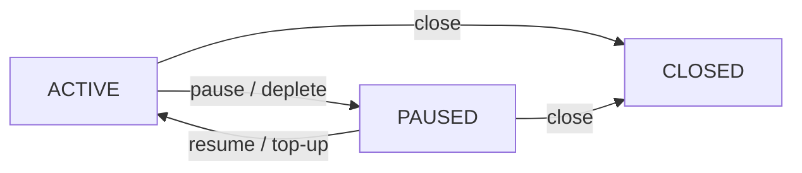
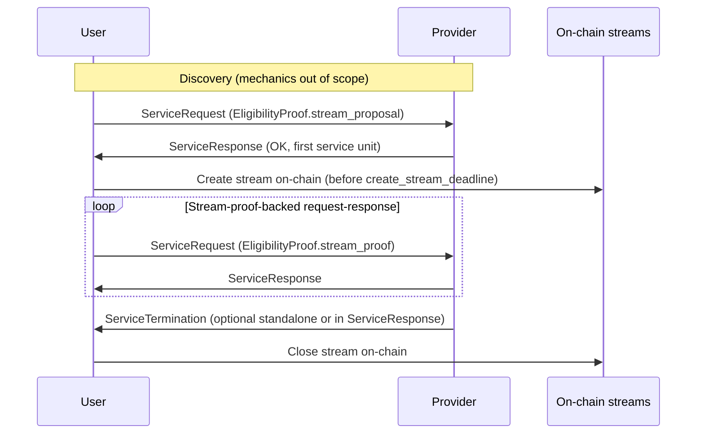

# Payment Streams

| Field | Value |
| --- | --- |
| Name | Payment Streams Protocol for Logos Services |
| Slug | 155 |
| Status | raw |
| Category | Standards Track |
| Editor | Sergei Tikhomirov <sergei@status.im> |
| Contributors | Akhil Peddireddy <akhil@status.im> |

<!-- timeline:start -->

## Timeline

- **2026-05-11** — [`1ac7689`](https://github.com/logos-co/logos-lips/blob/1ac7689ee3fe1665d5d5d1bf9c180ed951cc660d/docs/anoncomms/raw/payment-streams.md) — chore: split ift ts specs (#334)
- **2026-03-18** — [`e07c655`](https://github.com/logos-co/logos-lips/blob/e07c655a1fb86b46c99c3dd164a29438ab093b49/docs/ift-ts/raw/payment-streams.md) — Chore: move and fix header for payment streams spec (#295)
- **2026-02-24** — [`14fd5c0`](https://github.com/logos-co/logos-lips/blob/14fd5c09ccb76cb36ebb6a4b6c8082850172d330/vac/raw/payment-streams.md) — docs: add payment streams raw spec (#224)

<!-- timeline:end -->

## Abstract

This specification defines payment streams for incentivized Logos request-response services.
Users pay providers over time from vault deposits instead of settling each request on chain,
while `allocation` caps how much funds may accrue to a provider.

On chain, users deposit funds into vaults
and allocate streams from which funds accrue to providers at a configured rate.
The chain enforces allocation accounting and lazy accrual on each stream operation
using a monotonic timestamp.
Stream lifecycle covers create, pause, resume, top-up, close, and claim.

Off chain, the protocol extends the incentivization request-response envelope with
`VaultProof`, `StreamProposal`, and `StreamProof`.
Providers advertise a policy,
verify proofs against vault and stream state,
and grant service when a signed proposal satisfies that policy
and an on-chain stream matching the accepted `StreamParams` backs the session.

The document specifies generic on-chain and off-chain requirements,
a reference integration with the Logos Execution Zone and Logos Delivery Store queries,
security and privacy considerations,
and optional protocol extensions.
On LEZ, users and providers MAY obtain
user unlinkability and provider unlinkability
via private accounts and shielded transactions.

## Language

The key words "MUST", "MUST NOT", "REQUIRED", "SHALL", "SHALL NOT",
"SHOULD", "SHOULD NOT", "RECOMMENDED", "MAY", and "OPTIONAL"
in this document are to be interpreted as described in
[RFC 2119](http://tools.ietf.org/html/rfc2119).

Protobuf `uint64` timestamp fields use the chain integration time unit
defined for on-chain accrual, unless stated otherwise.

## Change Process

This document is governed by the [1/COSS](../../research/draft/1/coss.md) (COSS).

## Motivation

Logos is a privacy-focused tech stack that includes
Logos Messaging, Logos Blockchain, and Logos Storage.

Logos Messaging comprises a suite of communication protocols
with both P2P and request-response structures.
The backbone P2P protocols use tit-for-tat mechanisms.
Incentivization is introduced
for auxiliary request-response protocols
with well-defined user and provider roles.
One such protocol is Store,
which allows users to query historical messages
from Logos Messaging relay nodes.

Logos Blockchain includes the Logos Execution Zone (LEZ),
which enables both transparent and shielded transactions.

We target the following design goals:

- Performance: Low latency and fees without settling each service request on chain.
- Security: Limited loss exposure when service stops or the user is offline.
- Privacy: optional user unlinkability and provider unlinkability
  (each party's primary public key unlinkable from its on-chain
  funding or claiming activity).
- Extendability: A simple base protocol with room for optional extensions.

Payment streams enable unidirectional time-based fund flows.
Streams map well to this use case.
Unlike alternatives (payment channels, e-cash),
payment streams avoid storing old states or initiating disputes,
and do not rely on a centralized mint.

The document proceeds from on-chain streams,
to stream-backed request-response eligibility,
to the LEZ and Logos Delivery reference integration,
and then security and privacy considerations.


## On-Chain Payment Streams Protocol

This specification refers to payment streams as streams.

### Roles

The protocol has two roles:

- User: the party paying for services.
- Provider: the party delivering services and receiving payment.

On chain, the user authorized to operate a vault is the vault owner
(for example `VaultConfig.owner` on LEZ).
The vault owner and the stream provider MAY each be a public account or a private account,
as defined by the chain integration
(see [Security and privacy considerations](#security-and-privacy-considerations)).
A private account is identified by a nullifier public key, or NPK.

### Vaults and streams

The protocol uses a two-level architecture
of vaults and streams.

A vault holds a user's deposit.
The user is designated as the vault's owner.
A user MAY own multiple vaults.
One vault MAY back multiple streams, possibly to different providers.

Each vault uses exactly one token (the vault token)
for its balance and for every stream it backs.
Rate, `allocation`, `accrued`, and claims
MUST use the vault token.
The vault token MAY be the chain native token
or a non-native fungible token.
At initialization the vault MUST record
the vault token identity in chain-specific encoding.
Each chain integration MUST define the encoding of the chain native token.
Later operations MUST NOT change that identity.

A stream represents an individual flow of funds from a vault to one provider.
Each stream MUST belong to exactly one vault.

Each stream MUST record `provider_id`,
a byte string designating the party authorized to claim accrued funds.
Each chain integration MUST define that encoding
and how it is stored as the on-chain claim account.
On LEZ, `StreamConfig.provider` holds that `provider_id`.

Each stream MUST specify a positive accrual rate per time unit.
Each chain integration MUST define the time unit used by rates and accrual.

To start using the protocol,
the user MUST deposit funds into a vault.
The funds deposited into a vault are initially `unallocated`.

When creating a stream,
the user MUST allocate a portion of `unallocated` vault funds to that stream.
For each stream, funds within its `allocation` accrue from the user to the provider.
Thus each `allocation` is divided into `accrued` and `unaccrued`.
A stream is depleted when `unaccrued = 0`.

Let `balance` be the vault balance.
Let `total_allocated` be the sum of all `allocation` values for streams in a vault.
The following identities MUST hold:

```text
balance = total_allocated + unallocated
allocation = accrued + unaccrued
```

Vault operations include:

- Initialize: create an empty vault and record the vault token identity.
  Chain integrations MAY set other metadata at initialization.
- Deposit: increase `balance` and `unallocated`.
- Withdraw: decrease `balance` by at most `unallocated`.

The user MAY withdraw unallocated funds at any time.
Vault operations MUST NOT modify allocated funds.

Any change to a stream's `allocation` MUST be funded only from that vault's
`unallocated` balance.
An increase to `allocation` MUST decrease `unallocated` by the same amount,
increase `total_allocated` by the same amount,
and MUST NOT change vault `balance`.
An operation that increases `allocation` MUST fail when `unallocated` is
insufficient.

### Stream lifecycle

At any point in time, a stream MUST be in one of the following states:
`ACTIVE`, `PAUSED`, `CLOSED`.

State transition diagram:



Stream operations include:

- Create: assign a provider, set rate and initial `allocation`.
- Pause: stop fund accrual on an `ACTIVE` stream.
- Resume: resume fund accrual on a non-depleted `PAUSED` stream.
- Top-up: increase the stream's `allocation`.
- Close: release remaining `unaccrued` to vault `unallocated` and mark the stream `CLOSED`.
- Claim: transfer all `accrued` funds to the provider.
  Set `accrued` to zero and
  decrease `allocation` and the vault's `total_allocated` by the claimed amount.

The user MAY create a stream if the vault has `unallocated` funds.
Stream creation MUST assign a stable `stream_id` in chain-specific encoding.
A newly created stream MUST be `ACTIVE`.
Funds MUST accrue only on `ACTIVE` streams.
Each stream MUST store `accrued_as_of`, the fold timestamp through which stored `accrued` has been computed
(see [Lazy accrual and folding](#lazy-accrual-and-folding)).

The user MAY pause an `ACTIVE` stream.
An `ACTIVE` stream MUST also transition to `PAUSED` automatically upon depletion.

The user MAY resume a `PAUSED` stream.
Resume of a depleted stream MUST fail.

The user MAY top-up a stream.
Top-up MUST increase the stream's `allocation` under the allocation increase rules above.
Top-up MUST transition the stream to `ACTIVE`.
To add funds and keep the stream `PAUSED`,
the user MUST pause the stream after top-up.

Either user or provider MAY close the stream from any non-`CLOSED` state.
Unaccrued funds of a `CLOSED` stream MUST be immediately transferred to the vault's `unallocated` balance.
A `CLOSED` stream MUST NOT transition to any other state.
Accrued funds of a `CLOSED` stream remain available for the provider to claim.

The provider MAY claim accrued funds from a stream in any state.
A claim MUST transfer all accrued funds from this stream to the provider.

### Lazy accrual and folding

To fold a stream means to apply accrual and lifecycle updates through a fold timestamp `t`.
A fold timestamp is monotonic chain time up to which the fold applies accrual.

Each stream MUST record `accrued_as_of`, the latest fold timestamp.
Let `Δt` be `t` minus `accrued_as_of`.
Folding a non-`ACTIVE` stream MUST leave `accrued` and `accrued_as_of` unchanged.
Otherwise the fold MUST set:

```text
accrued := min(allocation, accrued + rate × Δt)
```

When folding results in a depleted stream,
`accrued_as_of` MUST be set to the fold timestamp at which depletion occurred
(MAY be earlier than `t`).
Otherwise `accrued_as_of` MUST be set to `t`.

Any stream operation MUST fold the stream before executing its logic.

A chain integration MUST expose a monotonic system timestamp.
The integration MUST define which accounts supply the system timestamp.
Accrual MUST be computed relative to the system timestamp.
Stored on-chain fields MAY lag behind effective state at the current system timestamp
until a transaction folds the stream.

### On-chain protocol extensions

This section describes optional modifications to the streams protocol.
The user MAY enable an extension when creating a vault or stream,
as specified in that extension.

#### Auto-Pause

In the base streams protocol,
the user SHOULD pause or close a stream when the provider stops delivering service.
If the user is offline,
funds on an `ACTIVE` stream MAY keep accruing until depletion,
which increases loss exposure while service is unavailable.

The auto-pause extension limits offline exposure by time,
in addition to the funds cap from `allocation`.
The stream records an auto-pause duration in the chain integration time unit.
When that duration has elapsed in chain time since stream creation
or since the last resume,
an `ACTIVE` stream MUST automatically transition to `PAUSED` at fold time.
For an already-`PAUSED` stream, that transition has no further effect.
The user MAY resume the stream.
Each resume MUST restart the auto-pause duration from the time of that resume.

#### Automatic Claim on Closure

In the base streams protocol,
close does not pay the provider.
Accrued funds remain on a `CLOSED` stream until the provider claims them.

The automatic claim on closure extension merges close and claim.
Close MUST transfer all accrued funds to the provider in the same operation,
so that the closed stream holds no funds afterward.

This removes the need for the provider to track or claim balances on closed streams.
Trade-offs include:

- The provider can no longer batch claims across streams.
- Close and payout happen in one transaction,
  which can increase timing correlation for observers.
- When the user initiates close on a fee-charging chain,
  the same transaction runs the provider payout logic,
  so the user pays transaction fees for that logic,
  instead of the provider paying via a separate claim.
- If the payout fails,
  close fails atomically and the stream does not transition to the `CLOSED` state.

#### Activation Fee

In the base streams protocol,
funds accrue only on `ACTIVE` streams.
The user MAY pause at any time and MAY resume a non-depleted `PAUSED` stream.
A user can leave a stream `PAUSED` for long periods,
resume briefly to obtain service,
and pay only during brief `ACTIVE` intervals.

The activation fee extension charges a fixed fee when fund accrual starts.
Only the operation that transitions the stream to `ACTIVE` MUST charge the activation fee.
The fee SHOULD reflect the provider's minimum acceptable payment for a service session.
If `unaccrued` is less than the activation fee,
the activation MUST fail.

Providers MAY also mitigate pause-and-resume attacks through off-chain policy.

#### Delivery Receipts

In the base streams protocol,
funds accrue based purely on on-chain stream state.
The provider does not submit off-chain proof that service was delivered.

The delivery receipts extension ties claim to user acknowledgment.
Claim MUST include valid receipts.

A delivery receipt is an off-chain message signed by the user.
It MUST include the on-chain stream identifier
(as assigned at stream creation, in chain-specific encoding),
the service delivery details covered by the claim,
and a signature over those fields.

Integrations choose how many deliveries each receipt covers:
per-message receipts increase signing and coordination overhead,
while batched receipts reduce overhead but bundle user approval.

#### Deferred first stream proof

In the base streams protocol paired with stream-backed eligibility,
the user MUST send the first stream-proof-backed `ServiceRequest`
by `create_stream_deadline`.
That request proves a matching on-chain stream was open by naming it in
`StreamProof` and supplying a valid session signature.

With this extension,
the user MUST still create an on-chain stream that matches the accepted
`StreamParams` before `create_stream_deadline`,
but MAY send the first stream-proof-backed request later.
The provider MAY scan on-chain streams for the vault to verify that a matching
stream existed by `create_stream_deadline`.
The provider SHOULD advertise support for this extension via discovery.

## Stream-Backed Eligibility for Request-Response Services

This section specifies how stream-backed eligibility
is integrated into a request-response protocol.
It extends the `ServiceRequest`, `ServiceResponse`,
`EligibilityProof`, and `EligibilityStatus` envelopes
from the [incentivization specification](../../messaging/core/raw/incentivization.md)
with stream-specific proposal, proof, and termination messages.
Off-chain messages coordinate proposal, ongoing proof, and termination.
On-chain state remains authoritative for funds accrual and stream lifecycle.

### Protocol overview

The protocol consists of the following stages:

- Discovery.
  Providers advertise a policy (`StreamProviderPolicy`)
  that proposals MUST satisfy before acceptance.
  Discovery mechanics are out of scope for this specification.
- Initial request-response exchange.
  The user sends a `StreamProposal` in the first `ServiceRequest`.
  The provider MAY accept and serve the first unit.
- Stream-proof-backed request-response.
  Each further `ServiceRequest` carries a `StreamProof`.
- Termination.
  The provider ends service with `ServiceTermination`
  (standalone or inside `ServiceResponse.eligibility_status`).



### Message structure


#### `ServiceRequest`

A `ServiceRequest` has the following fields:

```text
ServiceRequest
├── request_data
└── eligibility_proof: EligibilityProof
    └── exactly one of:
        ├── stream_proposal: StreamProposal
        │   ├── vault_proof: VaultProof
        │   ├── stream_params: StreamParams
        │   └── public_key
        └── stream_proof: StreamProof
            ├── stream_id
            └── signature
```

Protobuf excerpts below are normative wire shapes.
The ASCII tree is illustrative.

#### `ServiceResponse`

A `ServiceResponse` MUST include:

- `eligibility_status`: an `EligibilityStatus` with:
  - `status_code`: indicating acceptance,
    parameter rejection, proof invalidity, etc.
  - `status_desc`: human-readable description
    (RECOMMENDED to include actionable guidance
    on parameter rejection)
- `response_data`: service-specific payload
  (included if and only if the request is served)

Stream-backed eligibility uses the following `EligibilityStatus.status_code` values:

| `status_code` | Name | Meaning |
| --- | --- | --- |
| 0 | `OK` | Request served. |
| 1 | `PARAMS_REJECTED` | Proposal fails a policy check (including vault token acceptance), the on-chain stream fails to match accepted `StreamParams`, or `create_stream_deadline` obligations were missed. User MAY retry with adjusted parameters. |
| 2 | `PROOF_INVALID` | Malformed proof, failed signature, failed cryptographic verification, or `VaultProof.token_id` mismatch. |
| 3 | `STREAM_NOT_ACTIVE` | No on-chain stream for `stream_id`, or stream lifecycle state is not `ACTIVE`. |

#### `EligibilityProof`

```protobuf
message EligibilityProof {
  optional bytes proof_of_payment = 1;
  optional bytes stream_proposal = 2;
  optional bytes stream_proof = 3;
}
```

The user MUST NOT set `proof_of_payment` or other non-stream incentivization fields.
Exactly one of `stream_proposal` or `stream_proof` MUST be present.

#### `StreamProposal`

```protobuf
message StreamProposal {
  VaultProof vault_proof = 1;
  StreamParams stream_params = 2;
  bytes public_key = 3;
}
```

`public_key` commits the session key pair used for `StreamProof` signatures.
The user signs each `StreamProof` with the session key private key.

#### `StreamProof`

A `StreamProof` links a request to an active stream.

```protobuf
message StreamProof {
  bytes stream_id = 1;
  bytes signature = 2;
}
```

`stream_id` is the on-chain identifier of the stream.
`signature` proves eligibility for this request.
It MUST be over `request_data` using the committed session key.
It MUST use the same signature scheme and encoding
as `VaultProof.owner_signature` for the integration,
with a domain prefix and `canonical_body_bytes` defined for the service request
(for example [Store eligibility signature](#store-eligibility-signature) on LEZ).
`request_data` is the service-specific payload in the enclosing `ServiceRequest`,
as defined by the service integration building on the
[incentivization specification](../../messaging/core/raw/incentivization.md).

#### `VaultProof`

A `VaultProof` proves that the user controls a vault
with sufficient unallocated funds
to back the proposed stream.
For a `StreamProposal`, the vault account for `vault_id` MUST exist on-chain.
Proposed `allocation` MUST be at most that vault's `unallocated` balance.
`owner_public_key` MUST match the on-chain vault owner for that vault.

```protobuf
message VaultProof {
  bytes vault_id = 1;
  bytes provider_id = 2;
  bytes owner_public_key = 3;
  bytes owner_signature = 4;
  bytes token_id = 5;
}
```

`vault_id` is the on-chain identifier of the vault.
`provider_id` is the provider identity for this protocol session.
It pins the proposal to one provider and prevents replay across providers.
It MUST match the stream `provider_id`
(see [Vaults and streams](#vaults-and-streams)).
A chain integration MAY map `provider_id` to a long-lived service identity
and separately map that identity to the chain account that receives stream claims.
`owner_public_key` is the key used to verify `owner_signature`.
Chain integrations MUST define how `owner_public_key`
cryptographically binds to the vault owner stored on-chain.
`token_id` is REQUIRED.
It MUST equal the on-chain vault token identity
in chain-specific encoding.
`owner_signature` authorizes the proposed stream session.
It MUST cover the other `VaultProof` fields,
the accompanying `StreamParams`,
and `StreamProposal.public_key`.
Chain integrations MUST document the canonical signed payload.
LEZ defines vault-owner authorization under Off-chain bytes below.

#### `StreamParams`

```protobuf
message StreamParams {
  bytes service_id = 1;
  uint64 stream_rate = 2;
  uint64 allocation = 3;
  uint64 create_stream_deadline = 4;
}
```

`StreamParams` holds the proposed stream fields for one `StreamProposal`.
`service_id` is an opaque byte string that identifies the request-response service for the stream session.
The provider assigns or advertises acceptable `service_id` values via discovery.
The user MUST set `service_id` to a value the provider accepts for that session.
`create_stream_deadline` is the latest chain time by which the stream MUST exist on-chain.

For a service session, an on-chain stream matches accepted `StreamParams`
when the chain integration reports exact equality on every comparable field.

#### `StreamProviderPolicy`

The provider advertises a policy as the following message.

```protobuf
message TokenStreamPolicy {
  bytes token_id = 1;
  uint64 min_rate = 2;
  uint64 min_allocation = 3;
}

message StreamProviderPolicy {
  uint64 max_create_stream_deadline_delay = 1;
  uint64 vault_proof_max_response_bytes = 2;
  repeated TokenStreamPolicy accepted_tokens = 3;
}
```

`accepted_tokens` MUST contain at least one entry
and MUST NOT contain duplicate `token_id` values.
Each `TokenStreamPolicy` entry sets thresholds for one vault token
in that token's base units.
`TokenStreamPolicy.token_id` uses the same encoding as `VaultProof.token_id`.
The RECOMMENDED maximum length of `accepted_tokens` is 16.

Allocation caps on-chain payment exposure.
Providers MAY adjust serving policy when users abuse pause, resume, or request patterns.

Let `T` be `VaultProof.token_id`
after the on-chain equality check.
A `StreamProposal` satisfies a policy at verification time `t` when:

- The policy MUST contain a `TokenStreamPolicy` whose `token_id` equals `T`.
- `stream_params.stream_rate` MUST be greater than or equal to that entry's `min_rate`.
- `stream_params.allocation` MUST be greater than or equal to that entry's `min_allocation`.
- `stream_params.create_stream_deadline` MUST be greater than or equal to `t`
  and MUST be less than or equal to `t` plus `max_create_stream_deadline_delay`

RECOMMENDED default for `max_create_stream_deadline_delay`: 300 seconds.

`vault_proof_max_response_bytes` sets the per-response byte limit for `response_data`
when the provider serves the initial vault-proof-backed request.
Deadline and byte-cap fields are policy-global.

#### `ServiceTermination`

```protobuf
message ServiceTermination {
  enum TerminationType {
    TEMPORARY = 0;
    PERMANENT = 1;
  }
  TerminationType termination_type = 1;
  uint64 resume_after = 2;
}
```

For `PERMANENT` termination, `resume_after` MUST be zero.
For `TEMPORARY` termination, `resume_after` MUST be a chain timestamp
after which service MAY resume.

### Cryptographic commitments

Off-chain proofs use vault-owner authorization on `StreamProposal`
and per-request eligibility on `StreamProof`.
Each signature role MUST use a chain-specific canonical form
and its own domain separation prefix.
A chain integration MUST define signed payload coverage for each role
and document the canonical bytes.

### Protocol Flow

#### Discovery

A discovery protocol (out of scope for this specification)
SHOULD enable providers to announce which eligibility proof types they accept.
Advertisements for stream-backed eligibility MUST include `StreamProviderPolicy`.
Updated policy advertisements apply only to new proposals.

#### Initial request-response exchange

The first `ServiceRequest` MUST carry a `StreamProposal`.
The `StreamProposal` MUST satisfy the provider's policy at verification time `t`.
`owner_signature` MUST verify under `owner_public_key` over the canonical proposal payload.
The user MUST NOT send another `StreamProposal` for the same vault-provider pair
while a proposal is pending.

Before serving the request,
the provider MUST confirm that the proposal satisfies the policy,
the `VaultProof` requirements,
and `owner_signature` validity.
On success it MUST return `EligibilityStatus.status_code` `OK` with `response_data`.
The provider SHOULD keep `response_data` within
`vault_proof_max_response_bytes` from policy
(RECOMMENDED default: 65536 bytes).
The provider SHOULD cap parameter-adjustment attempts at 5 per vault
within 600 seconds (RECOMMENDED).

A service session is the provider's off-chain state for one accepted proposal.
On acceptance the provider MUST record accepted `StreamParams`,
the policy pinned at acceptance,
`StreamProposal.public_key` as the session key,
and `vault_id`, `provider_id`, `owner_public_key`, and `token_id` from the vault proof.
Later stream-proof verification MUST use that pinned policy and session record.

After acceptance the user MUST create an on-chain stream that matches the
accepted `StreamParams` before `create_stream_deadline`.
Until an on-chain stream matching those params exists or the deadline passes,
vault `unallocated` MUST remain at least the accepted allocation,
and the user MUST NOT send another `StreamProposal` to the same provider.
If `unallocated` falls below the accepted allocation after acceptance,
the provider SHOULD send `PERMANENT` `ServiceTermination`.

#### Stream-proof-backed request-response

Stream-proof-backed `ServiceRequest` messages apply only after an on-chain stream
matching the accepted `StreamParams` exists for the service session.
Each such request MUST carry `EligibilityProof.stream_proof` only.

The first stream-proof-backed `ServiceRequest` MUST arrive by `create_stream_deadline`.
That request proves a matching on-chain stream was open by the deadline.

The provider learns `stream_id` from each `StreamProof`.
For verification it MUST read that stream's on-chain account state
for the session `vault_id` under the chain integration,
and then fold that state to the current chain time.

Each `StreamProof` MUST name the on-chain stream that matches the accepted
`StreamParams` for the service session,
and MUST carry a valid signature over `request_data` with the session key.
The referenced stream MUST be `ACTIVE`.
On the first valid stream-proof request,
the provider MUST record `stream_id` in session state if not already set.

The provider MAY retain session state across on-chain pause and resume.
After resume, the user MAY continue stream-proof-backed requests under the same session.

#### Termination

The session ends when the provider sends `ServiceTermination`
with `PERMANENT` `termination_type`,
or when `create_stream_deadline` passes
without the first stream-proof-backed `ServiceRequest`
corresponding to an on-chain stream that matches the accepted `StreamParams`.

The provider MUST send `ServiceTermination` before stopping service
for an accepted service session.
The provider MUST NOT cease serving under that session without `ServiceTermination`,
except when the session ends due to a missed `create_stream_deadline`.
`ServiceTermination` MAY be sent standalone or inside `ServiceResponse`,
including before any on-chain stream exists.

When service ends, the user MAY pause or close the on-chain stream
and MAY stop sending stream proofs.

For `TEMPORARY` termination, the user MAY pause the stream until `resume_after`.
The provider MAY resume the same service session after `resume_after`.

For `PERMANENT` termination, the user SHOULD close the on-chain stream promptly.
Further service requires a newly accepted `StreamProposal`.

### Request-response protocol extensions

This section describes optional extensions
to the request-response protocol with stream-backed eligibility.

#### Load Cap

The base protocol bounds one vault-proof-backed response through
`vault_proof_max_response_bytes` in policy.
The load cap extension adds a cumulative limit per stream per time window
(for example, total bytes or requests per minute).
When this extension is used,
the provider MUST advertise a load cap via discovery.
The provider MAY refuse to serve requests that would exceed the cap.

When sustained load requires a higher cap,
the user SHOULD open multiple streams to the same provider.
Note that the user MAY request work without knowing the response size in advance
(such as message history over a time range).

#### Multi-round Stream Parameter Negotiation

In the base request-response protocol,
`PARAMS_REJECTED` does not carry provider counter-proposals.
A future extension MAY allow counter-proposed parameters in a
`PARAMS_REJECTED` response,
enabling iterative negotiation before the first request is served.

## LEZ and Logos Delivery Integration

This section maps the [On-Chain Payment Streams Protocol](#on-chain-payment-streams-protocol)
and [Stream-Backed Eligibility for Request-Response Services](#stream-backed-eligibility-for-request-response-services)
onto LEZ account layout, guest instructions, and reference off-chain bytes.

### Scope and normative boundary

Clock account ids, domain prefixes, and other demo fixtures
are pinned in the reference integration and MAY change when the network is redeployed.
Instruction wire layout and error codes are defined only there.
Implementations MUST follow the deployed network
and the reference integration when they differ from this section
on demo-only fields.
Account layout, authorization, and privacy-tier rules here are normative
and are not overridden by the reference integration.

### On-chain mapping

The payment-streams guest program maps vault and stream state to
`VaultConfig`, `VaultHolding`, and `StreamConfig` accounts.

#### Account types

`VaultConfig` holds `owner`,
privacy tier (`Public` or `PseudonymousFunder`),
and `token_id`,
fixed at initialization,
and `total_allocated`,
updated by stream operations.

The privacy tier records vault-owner privacy intent for that vault.
`Public` means a public vault owner.
`PseudonymousFunder` means user unlinkability is intended for that vault.
For `PseudonymousFunder` vaults,
`owner` MUST be a private account.

`token_id` is the LEZ encoding of the vault token.
It is exactly 32 octets.
All-zeroes denotes the LEZ native token.
Any other value MUST be a fungible Token program definition `AccountId`.

Per-stream state is stored in `StreamConfig`.
`StreamConfig.provider` holds the stream `provider_id`
(the account authorized to claim accrued funds).
That account MAY be a public account or a private account.
Vault privacy tier and provider account kind are independent choices.
A `Public` vault MAY stream to a private provider.
A `PseudonymousFunder` vault MAY stream to a public provider.
Provider unlinkability has no vault-style privacy tier.
It is chosen per stream by using a private account as `provider_id`.

The vault holding PDA carries vault liquidity.
For a native vault, that is native `Account.balance` on the PDA.
For a non-native vault,
the PDA is a Token program holding for `token_id`,
and liquidity is `TokenHolding.balance` in account data.
The guest MUST reject instructions when version bytes across
`VaultConfig`, vault holding application data, and `StreamConfig`
for a vault are unequal.
The reference guest uses version `1` on the demo network.

#### PDA derivation

`VaultConfig` is a PDA from the owner account identifier
and a user-chosen vault identifier.
`VaultHolding` is a PDA from the `VaultConfig` address and `token_id`
(32 raw octets, all-zeroes for native).
`StreamConfig` is a PDA from the `VaultConfig` address
and the stream identifier assigned sequentially on stream creation.
`StreamConfig.provider` is stored in account data, not in the stream PDA seeds.

Off-chain vault resolution derives the same `VaultConfig` PDA from
`VaultProof.vault_id` and the LEZ account identifier for
`VaultProof.owner_public_key`.

#### Deposit and claim asset paths

Deposit, withdraw, and claim move vault funds
by composing with the platform program for the vault token:
authenticated-transfer for native,
Token program for non-native.

For `PseudonymousFunder` vaults,
`Deposit` MUST debit the vault owner private account.
Wallets MUST NOT transfer directly into a `VaultHolding` for `PseudonymousFunder` vaults.

### Guest instructions

Reference instruction names and authorizers.
The authorizer is the payment-streams role whose account MUST authorize the
instruction.
On LEZ that account is a signing account.

| On-chain operation | Reference instruction | Authorizer |
| --- | --- | --- |
| Initialize vault | `InitializeVault` | Vault owner |
| Deposit | `Deposit` | Vault owner |
| Withdraw unallocated | `Withdraw` | Vault owner |
| Create stream | `CreateStream` | Vault owner |
| Pause stream | `PauseStream` | Vault owner |
| Resume stream | `ResumeStream` | Vault owner |
| Top-up stream | `TopUpStream` | Vault owner |
| Close stream | `CloseStream` | Vault owner or stream provider |
| Claim accrued | `Claim` | Stream provider |

`CloseStream` and `Claim` MUST pass `VaultConfig.owner` as an explicit
non-signing account equal to the vault owner.

When a private account is included in a transaction
as a signing account or as a required non-signing account,
LEZ requires a shielded transaction.
Payment streams inherit that platform rule
whenever a private `VaultConfig.owner` or `StreamConfig.provider`
is included in the transaction.

### System clock accounts

Guest instructions that fold streams read time from a caller-supplied
clock account.
The guest accepts exactly three clock program account identifiers.
Each id is a UTF-8 string of seven decimal digits, zero-padded
(for example `0000010` is decimal ten, not octal):

| Clock account id (UTF-8 prefix string) | Typical update cadence |
| --- | --- |
| `/LEZ/ClockProgramAccount/0000001` | Highest frequency (finest folding granularity) |
| `/LEZ/ClockProgramAccount/0000010` | Medium frequency |
| `/LEZ/ClockProgramAccount/0000050` | Coarsest frequency |

Each account stores Borsh `ClockAccountData { timestamp }`.
The guest rejects unknown clock account ids and malformed payloads.
The caller passes one clock account per instruction.
Any id in the table is valid when its timestamp is monotonic for the
transaction.

### Off-chain bytes

#### Identifier encodings

| Field | Encoding |
| --- | --- |
| `VaultProof.vault_id` | Exactly 8 octets, little-endian `VaultId` (`u64`). |
| `StreamProof.stream_id` | Exactly 8 octets, little-endian `StreamId` (`u64`). |
| `VaultProof.provider_id` | Exactly 32 octets, LEZ `AccountId` of the stream provider. |
| `VaultProof.owner_public_key` | Exactly 32 octets, x-only secp256k1 public key. |
| `VaultProof.owner_signature` | Exactly 64 octets, Schnorr signature over the vault-owner digest. |
| `VaultProof.token_id` | Exactly 32 octets. All-zeroes for native. Otherwise Token definition `AccountId`. |
| `TokenStreamPolicy.token_id` | Same as `VaultProof.token_id`. |
| `StreamProposal.public_key` | Exactly 32 octets, session key for `StreamProof.signature`. |
| `StreamProof.signature` | Exactly 64 octets, Schnorr signature over the Store eligibility digest. |
| `StreamParams.service_id` | UTF-8, no NUL terminator. Max length 128. |

Decoders MUST reject wrong lengths for fixed-width fields.

On-chain stream `allocation` and the vault-owner Borsh body use `u128`,
zero-extending `StreamParams.allocation` from protobuf `uint64`.

#### Canonical signing bytes

LEZ satisfies [Cryptographic commitments](#cryptographic-commitments)
with Schnorr signatures over
`SHA-256(domain_prefix || canonical_body_bytes)`.
Each role below defines a 32-byte ASCII `domain_prefix` (NUL-padded)
and `canonical_body_bytes`.

#### Vault owner authorization (`VaultProof.owner_signature`)

Domain prefix (32 bytes):

```text
/LEZ/v0.1/VaultOwnerAuth/ followed by seven NUL bytes (32 bytes total)
```

`canonical_body_bytes` is Borsh serialization of the following fields in order:

| Field | Borsh type |
| --- | --- |
| `vault_id` | `u64` LE |
| `provider_id` | 32 raw bytes (LEZ `AccountId`) |
| `owner_public_key` | 32 raw bytes (x-only secp256k1 public key) |
| `service_id` | Borsh `string` (4-byte LE length + UTF-8) |
| `token_id` | 32 raw bytes (all-zeroes for native, else Token definition `AccountId`) |
| `rate` | `u64` LE |
| `allocation` | `u128` LE |
| `create_stream_deadline` | `u64` LE |
| `session_public_key` (`StreamProposal.public_key`) | 32 raw bytes |

`VaultProof.owner_public_key` MUST bind to `VaultConfig.owner`
via the LEZ account-identifier derivation in the reference implementation.
For a private vault owner, that binding uses NPK derivation
and the owner signature is produced with the corresponding nullifier secret key (NSK).

#### Store eligibility signature

Domain prefix (32 bytes):

```text
/LEZ/v0.1/StoreEligibility/ followed by five NUL bytes (32 bytes total)
```

`canonical_body_bytes` is Borsh serialization of `CanonicalStoreRequest`
with field order and optional-field encoding matching Logos Delivery
`StoreQueryRequest` without eligibility fields
(presence-byte optional encoding, Borsh strings,
message hash array, pagination fields).

Providers derive `digest` by decoding the Store query from `request_data`
and applying the encoding rules above.

#### Logos Delivery Store query integration

The reference Store integration sets `StreamParams.service_id` to
`/vac/waku/store-query/3.0.0` and signs `request_data` with
[Store eligibility signature](#store-eligibility-signature).

## Security and privacy considerations

### Privacy goals

We define two independent, optional privacy goals:
user unlinkability and provider unlinkability.
The base protocol is not private by default.

User unlinkability separates the user's (vault owner's) primary public key
from their on-chain vault and stream activity.
Provider unlinkability separates the provider's primary public key
from their on-chain claims.
A primary public key is the party's long-lived public identity
outside the in-protocol vault-owner or `provider_id` account.

A user MAY pursue user unlinkability per vault.
On LEZ that requires a `PseudonymousFunder` vault
(see [Account types](#account-types)).
A provider MAY choose provider unlinkability independently for each stream.

### Achieving the privacy goals on LEZ

Payment streams leverage LEZ private accounts and shielded transactions
to achieve user unlinkability and provider unlinkability.
Under the LEZ architecture, guest logic remains the same
for transparent and shielded transactions.
The guest does not enforce whether transactions are transparent or shielded.

#### User unlinkability

To obtain user unlinkability, the user MUST
use a private account as `VaultConfig.owner`,
initialize the vault with privacy tier `PseudonymousFunder`
(see [Account types](#account-types)),
pre-shield funds into that private account before deposit,
and run all vault and stream operations through shielded transactions.

The user SHOULD NOT reuse the same vault owner identity
across vaults intended to remain unlinked.

#### Provider unlinkability

To obtain provider unlinkability for a stream,
the provider MUST use a private account as `provider_id`
and claim through shielded transactions.

The provider SHOULD NOT reuse the same `provider_id`
across streams intended to remain unlinked.

### Limits of unlinkability and future work

The following issues MAY motivate future research:

- Vault and stream accounts are public, including stream terms, accrual state,
  the vault-to-stream graph, and deposit and claim amounts on `VaultHolding`.
- Observers can match amounts or timing between pre-shield and vault deposit,
  and between claim and a later deshield.
- Vault owner and `provider_id` identities remain linkable
  across vaults and streams that reuse those identifiers.

Coarser [system clock accounts](#system-clock-accounts) reveal less precise activity timing to observers.
The [Automatic Claim on Closure](#automatic-claim-on-closure) extension
strengthens timing correlation by merging close and payout.

## References

### Normative

- [Incentivization for Waku Light Protocols](../../messaging/core/raw/incentivization.md)

### Informative

#### Related Work

- [Off-Chain Payment Protocols: Classification and Architectural Choice](https://forum.vac.dev/t/off-chain-payment-protocols-classification-and-architectural-choice/596)
- [Logos Execution Zone](https://github.com/logos-blockchain/logos-execution-zone)

#### Payment Streaming Protocols

Existing payment streaming protocols target EVM-like architectures.
Protocols vary in duration
(fixed-duration in Sablier Lockup or open-ended in Sablier Flow)
and in deposit architectures
(stream-level deposits in Sablier or multi-stream vaults in LlamaPay V2).

- [Sablier Flow](https://github.com/sablier-labs/flow)
- [Sablier Lockup](https://github.com/sablier-labs/lockup)
- [LlamaPay V2](https://github.com/LlamaPay/llamapay-v2)
- [Superfluid Protocol](https://github.com/superfluid-org/protocol-monorepo)

## Appendix A: Illustrative EVM Implementation

This appendix provides an illustrative EVM-based implementation outline.
The actual implementation will target LEZ.
The sketch uses one vault per contract and one vault token,
and omits multi-vault support from the main protocol.

### A.1 Contract Structure

```solidity
contract PaymentVault {
    enum StreamState { ACTIVE, PAUSED, CLOSED }

    struct Stream {
        address provider;
        uint128 ratePerSecond;
        uint128 allocation;
        uint64  lastUpdatedAt;
        uint128 accruedBalance;
        StreamState state;
    }

    address public user;
    address public token;
    uint256 public vaultBalance;
    uint256 public nextStreamId;
    mapping(uint256 => Stream) public streams;
}
```

### A.2 Vault Operations

```solidity
event Deposited(uint256 amount);
event Withdrawn(uint256 amount, address indexed to);

function deposit(uint256 amount) external;
function withdraw(uint256 amount, address to) external;
```

### A.3 Stream Lifecycle

```solidity
event StreamCreated(
    uint256 indexed streamId,
    address indexed provider,
    uint128 ratePerSecond,
    uint128 allocation
);
event StreamPaused(uint256 indexed streamId);
event StreamResumed(uint256 indexed streamId);
event StreamToppedUp(uint256 indexed streamId, uint128 additionalAllocation);
event StreamClosed(uint256 indexed streamId, uint128 refundedToVault);
event Claimed(uint256 indexed streamId, address indexed provider, uint128 amount);

/// @notice Create a new stream in ACTIVE state (user only)
/// @dev MUST revert if allocation exceeds available vault balance
function createStream(
    address provider,
    uint128 ratePerSecond,
    uint128 allocation
) external returns (uint256 streamId);

/// @notice Pause an ACTIVE stream (user only)
function pauseStream(uint256 streamId) external;

/// @notice Resume a PAUSED stream (user only)
/// @dev MUST revert if remaining allocation (allocation - accruedBalance) is zero
function resumeStream(uint256 streamId) external;

/// @notice Add funds to stream allocation; transitions to ACTIVE (user only)
/// @dev MUST revert if additionalAllocation exceeds available vault balance
function topUpStream(uint256 streamId, uint128 additionalAllocation) external;

/// @notice Close stream permanently
/// @dev Callable by user or provider. Unaccrued funds (allocation - accruedBalance)
///      MUST be returned to vaultBalance. Accrued funds remain claimable by provider.
function closeStream(uint256 streamId) external;

/// @notice Provider claims accrued funds from a stream
/// @dev Callable in any state (ACTIVE, PAUSED, or CLOSED).
///      Transfers full accruedBalance to provider and resets it to zero.
function claim(uint256 streamId) external;
```

### A.4 Internal Accrual

```solidity
/// @notice Update accruedBalance based on elapsed time since lastUpdatedAt
/// @dev Called by createStream, pauseStream, resumeStream, topUpStream, closeStream, and claim
///      before modifying stream state. Caps accrual at allocation and
///      transitions to PAUSED when depleted (lazy evaluation:
///      state updates on next interaction, not at exact depletion time).
function _accrue(uint256 streamId) internal;
```

## Copyright

Copyright and related rights waived via [CC0](https://creativecommons.org/publicdomain/zero/1.0/).
