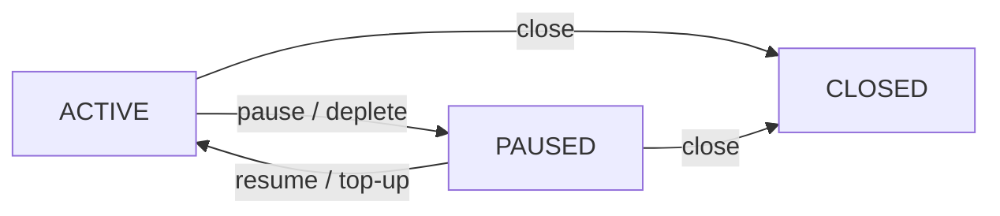

# PAYMENT-STREAMS

| Field | Value |
| --- | --- |
| Name | Payment Streams Protocol for Logos Services |
| Slug | 155 |
| Status | raw |
| Category | Standards Track |
| Editor | Sergei Tikhomirov <sergei@status.im> |
| Contributors | Akhil Peddireddy <akhil@status.im> |

<!-- timeline:start -->

## Timeline

- **2026-05-11** — [`1ac7689`](https://github.com/logos-co/logos-lips/blob/1ac7689ee3fe1665d5d5d1bf9c180ed951cc660d/docs/anoncomms/raw/payment-streams.md) — chore: split ift ts specs (#334)
- **2026-03-18** — [`e07c655`](https://github.com/logos-co/logos-lips/blob/e07c655a1fb86b46c99c3dd164a29438ab093b49/docs/ift-ts/raw/payment-streams.md) — Chore: move and fix header for payment streams spec (#295)
- **2026-02-24** — [`14fd5c0`](https://github.com/logos-co/logos-lips/blob/14fd5c09ccb76cb36ebb6a4b6c8082850172d330/vac/raw/payment-streams.md) — docs: add payment streams raw spec (#224)

<!-- timeline:end -->

## Abstract

This document provides a functional specification
for a payment streams protocol for Logos services.

A payment stream is an off-chain protocol
where a payer's deposit releases gradually to a payee.
The blockchain determines fund accrual based on elapsed time.

This specification defines stream-backed eligibility proof types
for the incentivization framework
(see [References](#references)).
The incentivization specification is defined
in the context of Logos Messaging request-response protocols.
This specification can be extended to non-Messaging services.

The protocol targets Logos blockchain,
which includes the Logos Execution Zone (LEZ).
This document clarifies MVP requirements
and facilitates discussion with Logos blockchain and LEZ developers
on implementation feasibility and challenges.

## Language

The key words "MUST", "MUST NOT", "REQUIRED", "SHALL", "SHALL NOT",
"SHOULD", "SHOULD NOT", "RECOMMENDED", "MAY", and "OPTIONAL"
in this document are to be interpreted as described in
[RFC 2119](http://tools.ietf.org/html/rfc2119).

## Change Process

This document is governed by the [1/COSS](../../research/draft/1/coss.md) (COSS).

## Motivation

Logos is a privacy-focused tech stack that includes
Logos Messaging, Logos Blockchain, and Logos Storage.

Logos Messaging comprises a suite of communication protocols
with both P2P and request-response structures.
The backbone P2P protocols use tit-for-tat mechanisms.
Incentivization is introduced
for auxiliary request-response protocols
with well-defined user and provider roles.
One such protocol is Store,
which allows users to query historical messages
from Logos Messaging relay nodes.

This specification introduces a payment streams protocol
for Store and other request-response protocols.
The protocol targets the following requirements:

- Performance: Efficient payments with low latency and fees.
- Security: Limited loss exposure through spending controls.
- Privacy: On-chain deposit identity unlinkable to off-chain service requests.
- Extendability: Simple initial design with room for enhancements.

After reviewing prior work on payment channels, streams,
e-cash, and tickets,
payment streams were selected as the most suitable mechanism.

Payment streams enable unidirectional time-based fund flows
from payer to payee.
Streams are simpler than alternatives
and map well to use cases with distinct roles.
Parties need not store old states or initiate disputes
as required in payment channel protocols.
Streams avoid relying on a centralized mint entity,
typical for e-cash and ticket protocols,
improving resilience and privacy.

Different service patterns suit different payment mechanisms.
Ongoing services align well with streams
that provide time-based automatic fund accrual.
One-time or on-demand services suit
payment channels with one-off payments.

This specification targets streams
for services with steady usage patterns.
Addressing burst services with one-off payments
remains future work.

Logos blockchain uses the Logos Execution Zone (LEZ),
which enables both transparent and shielded execution.
LEZ is a natural fit
for the on-chain component of the payment protocol.

This document facilitates discussion with Logos developers on
whether the required functionality can be implemented,
which parts are most challenging and how to simplify them,
and other implementation considerations.

## Theory and Semantics

### Architecture Overview

The protocol has two roles:

- User: the party paying for services (payer).
- Provider: the party delivering services and receiving payment (payee).

The protocol uses a two-level architecture
of vaults and streams.

A vault holds a user's deposit and backs multiple streams.
A user MAY have multiple vaults.
One vault MAY back streams to different providers.
To start using the protocol,
the user MUST deposit funds into a vault.
The user MAY withdraw unallocated funds from the vault at any time.
Vault withdrawals send funds to addresses,
which MAY be external addresses or other vaults.
Allocating funds from a vault to a stream
is not considered a withdrawal,
as the funds remain within the protocol.

A stream is an individual payment flow from a vault to one provider.
When creating a stream,
the user MUST allocate a portion of vault funds to that stream.
Each stream MUST belong to exactly one vault.
Each stream MUST specify an accrual rate (tokens per time unit).
An allocation is the portion of vault funds committed to a stream.
The sum of all stream allocations MUST NOT exceed the vault balance.

A claim is the operation
where the provider retrieves accrued funds from a stream.
Claim semantics are defined in the [Stream Lifecycle](#stream-lifecycle) section below.

### Stream Lifecycle

Stream states:

- ACTIVE: Funds accrue to the provider at the agreed rate.
- PAUSED: Accrual is stopped.
  The stream transitions to PAUSED by user action
  or automatically when the stream's allocation is depleted.
  The user MAY resume the stream.
- CLOSED: Stream is permanently terminated.
  The stream MUST NOT transition to any other state.

Stream state transitions:

- Create: User creates a stream in ACTIVE state
  by allocating funds from the vault.
- Pause: User pauses an ACTIVE stream, stopping accrual.
  The stream also transitions automatically from ACTIVE to PAUSED
  when allocated funds are fully accrued.
- Resume: User resumes a PAUSED stream, restarting accrual.
  Resume MUST fail if unaccrued balance is zero.
- Top-Up: User MAY add funds to stream allocation.
  Top-up MUST transition the stream to ACTIVE state.
  If the user wants to add funds without resuming,
  the user MUST pause the stream after top-up.
- Close: Either user or provider MAY close the stream
  from any non-CLOSED state.
  When a stream is closed,
  unaccrued funds MUST automatically return to the user's vault.
  Accrued funds remain available for the provider to claim.
- Claim: Provider MAY claim accrued funds from a stream in any state.
  A claim MUST transfer the full accrued balance to the provider
  and MUST reduce the stream's allocation by the payout amount;
  partial claims are not supported.
  A claim operation does not change stream state.

### Stream State Transition Diagram



### Assumptions

Parties MUST agree on stream parameters before creation.
A separate discovery protocol SHOULD enable
providers to advertise services and payment-stream policy.

The provider SHOULD announce
accepted eligibility proof types, accepted assets,
and a `StreamProviderPolicy`
(see [StreamProviderPolicy](#streamproviderpolicy))
via the discovery protocol.
The user MUST read the provider's current discovery advertisement
immediately before building each `StreamProposal`
(see [StreamProposal](#streamproposal)).
That advertisement includes `StreamProviderPolicy`,
accepted eligibility proof types, and accepted assets.
The provider MUST verify each proposal against its own
currently published `StreamProviderPolicy`.
This specification does not require a policy version or hash
inside `StreamProposal`.
Until discovery defines such a commitment,
the provider cannot know which past advertisement the user used.
If the user built a proposal from a stale advertisement,
the provider MAY reject it under the current policy.

#### Protocol phases

Verification is split into proposal, stream creation, and service.
Details appear under [Protocol Flow](#protocol-flow) and proof types below.
Parameter negotiation and `PARAMS_REJECTED` retries are part of the
proposal phase, not stream creation.

- Proposal — A vault-proof-backed `ServiceRequest` carries a
  `StreamProposal`.
  No stream exists on-chain yet.
- Stream creation — The user submits on-chain `create_stream`.
- Service — Later `ServiceRequest`s carry `StreamProof`.

#### Service session

A service session is the provider's off-chain record for delivering
service under one accepted `StreamProposal`.
Session state includes accepted `StreamParams`, `VaultProof` fields
used for verification (`vault_id`, `provider_id`, `owner_public_key`),
`StreamProposal.public_key`, and `stream_id` after the first valid
`StreamProof`.
Implementations hold this state off-chain only.

The session begins when the provider accepts the proposal.
`PARAMS_REJECTED` exchanges before acceptance do not start a session.
The on-chain stream follows [Stream Lifecycle](#stream-lifecycle)
from `create_stream`.
`ServiceTermination` or dropped session state ends provider service
under that acceptance.
An on-chain stream MAY stay `ACTIVE` and accrue after service ends.
If the provider has ended service, the user SHOULD pause or close the
stream promptly.

Per-request eligibility is defined under
[StreamProof](#streamproof).
The provider MAY retain session state across user pause.
After resume, the user MAY send further `StreamProof`s under the same
acceptance.

The provider MAY send `ServiceTermination`.
The provider MAY drop session state.
The user MAY pause, close, or stop sending `StreamProof` requests.
After `PERMANENT` `ServiceTermination`, the user SHOULD close the
stream.
The provider SHOULD treat that acceptance as closed.
Further service requires a newly accepted `StreamProposal`.
After `TEMPORARY` `ServiceTermination`, the provider MAY resume under
the same acceptance once `resume_after` has passed
(see [ServiceTermination](#servicetermination)).


#### StreamProviderPolicy

`StreamProviderPolicy` is the set of conditions the provider
advertises for proposing and operating a stream.

Implementations SHOULD expose:

- `proposal_satisfies_policy` in the proposal phase
- `stream_satisfies_policy` on every service request
- `new_stream_satisfies_proposal` on the first `StreamProof` for a
  service session (required then; not required on later service requests)

The discovery specification defines how policy is advertised.
This specification defines fields and checks.
Pending negotiation is defined under
[Pending proposals](#pending-proposals).

| Field | Role |
| --- | --- |
| `min_stream_rate` | The provider MUST reject proposals whose `stream_rate` is lower |
| `min_stream_allocation` | The provider MUST reject proposals whose `stream_allocation` is lower |
| `max_create_stream_deadline_delay` | Maximum seconds from proposal verification time until `create_stream_deadline` (see below) |
| `vault_proof_max_response_bytes` | The provider SHOULD limit the first vault-proof-backed `response_data` to this size (RECOMMENDED default: 65536) |

Create-stream deadline pairing.
`StreamParams.create_stream_deadline` is an absolute chain timestamp.
It is the latest time the user commits to complete on-chain stream creation.
`StreamProviderPolicy.max_create_stream_deadline_delay` is the maximum allowed
delay in seconds from verification time until that deadline.
At proposal verification time `t`, the provider MUST require
`t < create_stream_deadline` and
`create_stream_deadline <= t + max_create_stream_deadline_delay`.
The user MUST choose `create_stream_deadline` within that bound.
RECOMMENDED default for `max_create_stream_deadline_delay`: 300 seconds.

For LEZ, `create_stream_deadline` and proposal verification time `t`
use the same timestamp domain as stream folding
(the clock account timestamp supplied to payment-stream instructions;
see [Lazy Accrual](#lazy-accrual)).

The provider SHOULD also advertise accepted eligibility proof types
and accepted assets.
The user indicates which asset applies by choosing `VaultProof.vault_id`
in the `StreamProposal` on the first vault-proof-backed `ServiceRequest`.
Vaults are single-asset.
If the provider accepts more than one asset,
the user picks the vault whose asset matches.

New `StreamProviderPolicy` advertisements apply only to new proposals.
After the provider accepts a proposal,
it MUST apply the same `StreamProviderPolicy` fields it used at
acceptance for that service session until the session ends.
The provider MAY end service with
`ServiceTermination` (see [ServiceTermination](#servicetermination)).
A future discovery extension MAY let a `StreamProposal` carry a
commitment to a specific published policy revision.

Users SHOULD monitor service delivery
and take action when providers stop delivering service.
Since users are typically online to receive service,
monitoring quality and pausing or closing streams
is a reasonable expectation.

Providers SHOULD monitor the stream on-chain
and SHOULD stop providing service when a stream is not `ACTIVE`.

## Off-Chain Protocol

This section describes off-chain communication
for stream creation, service delivery, and termination.

### Design Rationale

On-chain state is the source of truth for fund allocation and accrual.
Off-chain communication coordinates lifecycle events
and enables service delivery.

This specification does not redefine the service provision protocol.
The incentivization specification (see [References](#references))
defines the generic request-response framework
with `EligibilityProof` and `EligibilityStatus`.
This specification extends `EligibilityProof`
with two new types for stream-backed service provision,
defined in the following subsection.

### Wire encoding and canonical signing

Off-chain messages in this section use protobuf for interchange
between clients, providers, and Delivery.

Cryptographic commitments (`VaultProof.owner_signature`,
`StreamProof.signature`) MUST use a chain-specific canonical form.
Implementations MUST NOT sign raw protobuf-serialized message bytes unless
a chain integration explicitly specifies that scheme.

Each chain integration MUST define deterministic signed material for every
signature field this protocol uses and MUST publish test vectors for those
payloads.
Integrations MUST define how signed material covers the fields required by
[VaultProof](#vaultproof) and [StreamProof](#streamproof).

For LEZ, fixed-width identifier encodings appear under
[LEZ off-chain integration](#lez-off-chain-integration).
LEZ preimage byte layouts appear under
[Implementation Considerations](#implementation-considerations).

### Eligibility Proof Types

The incentivization specification's `EligibilityProof`
is extended with two new optional fields:
`stream_proposal` and `stream_proof`.
These fields are mutually exclusive.
The first `ServiceRequest` MUST use `stream_proposal`;
its semantics: "I want to open a stream to you
with these parameters;
here is proof I have a vault to back it;
here is my first request."
All subsequent requests MUST use `stream_proof`.

```protobuf
message EligibilityProof {
  // existing, from incentivization specification
  optional bytes proof_of_payment = 1;
  // new, for stream-backed service provision
  optional bytes stream_proposal = 2;
  optional bytes stream_proof = 3;
}
```

#### StreamProposal

```protobuf
message StreamProposal {
  VaultProof vault_proof = 1;
  StreamParams stream_params = 2;
  bytes public_key = 3;  // session key for signing subsequent service requests
}
```

#### VaultProof

A `VaultProof` proves that the user controls a vault
with sufficient unallocated funds
to back the proposed stream.

```protobuf
message VaultProof {
  bytes vault_id = 1;           // on-chain identifier of the vault
  bytes provider_id = 2;        // target provider (prevents replay)
  bytes owner_public_key = 3;   // key used to verify owner_signature
  bytes owner_signature = 4;    // vault-owner signature over the proposal
}
```

The `owner_public_key` field identifies the key used to verify
`owner_signature`.
Chain-specific integrations MUST define how `owner_public_key`
maps or binds to the vault owner identifier stored on-chain.
For example,
a LEZ integration can derive the public account identifier
from the owner public key
and compare it with `VaultConfig.owner`.

The `owner_signature` field proves that the vault owner authorizes
the proposed stream session.
It MUST cover at least the `VaultProof` fields
other than `owner_signature`,
the accompanying `StreamParams`,
and the `StreamProposal.public_key`.
This prevents a valid vault proof from being recombined
with different stream parameters or a different session key.

The exact owner-signature scheme,
public-key encoding,
and canonical signed payload are chain-specific integration details.
They MUST be deterministic and covered by test vectors.
For LEZ public-vault integrations,
the expected scheme is the NSSA public-account signature scheme.

The `provider_id` field is the provider identity used by this protocol.
It prevents replaying a `VaultProof` intended for one provider
against another provider.
It does not have to be the same value
as a chain-specific payee or account identifier.

Chain-specific integrations MUST define how `provider_id`
maps or binds to the on-chain payee identifier used by that chain.
For example, a chain integration MAY bind `provider_id`
to a long-lived service identity,
and separately bind that service identity
to the chain account that receives stream claims.
The binding mechanism is part of the chain-specific integration,
not this generic off-chain proof format.

For LEZ integrations, `provider_id` is the 32-byte stream payee
`AccountId`.
Predicates compare it to `StreamConfig.provider` with octet equality
(see [LEZ off-chain integration](#lez-off-chain-integration)).

In the proposal phase the provider MUST read on-chain
`VaultHolding` and `VaultConfig` for `VaultProof.vault_id`.
Unallocated is `VaultHolding` balance minus
`VaultConfig.total_allocated`
(see [Balance Accounting](#balance-accounting)).
The provider MUST reject the proposal if
`StreamParams.stream_allocation > unallocated`.
The provider MUST reject the proposal if
`StreamParams.stream_allocation < StreamProviderPolicy.min_stream_allocation`.
The provider SHOULD use `vault_proof_max_response_bytes` to
limit work on the first vault-proof-backed request.

The user MAY issue `VaultProof`s to multiple providers.
The user MUST ensure that issuing a new `VaultProof`
does not cause the total of all promised `VaultProof` allocations
from this vault
to exceed the vault's unallocated balance.

#### StreamParams

`StreamParams` holds the proposed stream fields for one
`StreamProposal`.
`VaultProof.owner_signature` covers these fields.

```protobuf
message StreamParams {
  bytes service_id = 1;              // identifier of the requested service
  uint64 stream_rate = 2;           // proposed accrual rate (tokens per time unit)
  uint64 stream_allocation = 3;     // proposed initial allocation
  uint64 create_stream_deadline = 4;   // latest create_stream time (absolute timestamp)
}
```

`create_stream_deadline` is the latest chain time for `create_stream`
in `StreamParams`.
The user MUST set it within `max_create_stream_deadline_delay`.
See create-stream deadline pairing under
[StreamProviderPolicy](#streamproviderpolicy).

#### StreamProof

A `StreamProof` links a request to an active on-chain stream.
It is signed by the session private key corresponding to
the `StreamProposal.public_key` accepted for that stream.

```protobuf
message StreamProof {
  bytes stream_id = 1;    // on-chain identifier of the stream
  bytes signature = 2;    // signature over request_data using committed public_key
}
```

For each `StreamProof` the provider MUST read the `StreamConfig`
for `stream_id` on-chain.
The provider MUST verify the `StreamProof` signature against the
session `public_key` from the accepted proposal.

On the first `StreamProof` for a service session the provider learns
`stream_id`.
The provider MUST run `new_stream_satisfies_proposal` on that
first request.
This predicate compares on-chain `StreamConfig` to the accepted
`StreamParams` after folding to verification time `t`.
On-chain `rate` and the stored `allocation` field MUST be greater than
or equal to the accepted `StreamParams`.
The comparison uses the stored allocation commitment, not unaccrued
balance (accrual reduces unaccrued without lowering `allocation` until
a claim).
If on-chain values are lower than proposed, the provider MUST
reject the request.
The provider MAY accept on-chain values higher than proposed.
The provider identifier stored in `StreamConfig` MUST match this
session's `VaultProof.provider_id` from the accepted proposal,
using the chain-specific mapping for `provider_id`
(see [VaultProof](#vaultproof)).

`stream_satisfies_policy` covers each `StreamProof`, including the
first.
The stream MUST be `ACTIVE`.
On-chain rate MUST be at least `min_stream_rate` from policy.
The provider identifier in `StreamConfig` MUST correspond to
`VaultProof.provider_id` for the acceptance (see [VaultProof](#vaultproof)).

Later `StreamProof` requests for the same service session need not run
`new_stream_satisfies_proposal`.
The provider MAY run it again; that is redundant when the first run
succeeded and does not replace `stream_satisfies_policy` or signature
verification.
The provider MUST still run `stream_satisfies_policy` and
signature verification on each request.

The provider MUST ensure the request is for the service identified by
`service_id` in the accepted `StreamParams`.
`service_id` is fixed for that acceptance; the user cannot change it
without a new signed proposal.
For application protocols that do not carry `service_id` in
`request_data`, the provider binds via the eligibility handler
(for example, only Store queries use the paid Store `service_id`).

### Message Types

The off-chain protocol uses three message types:
`ServiceRequest`, `ServiceResponse`, and `ServiceTermination`.

#### ServiceRequest

A `ServiceRequest` has two top-level fields,
consistent with the incentivization specification pattern:

- `request_data`: service-specific payload
- `eligibility_proof`: an `EligibilityProof`
  containing either a `stream_proposal` or a `stream_proof`
  (see [Eligibility Proof Types](#eligibility-proof-types))

#### ServiceResponse

A `ServiceResponse` MUST include:

- `eligibility_status`: an `EligibilityStatus`
  (from the incentivization specification) with:
  - `status_code`: indicating acceptance,
    parameter rejection, proof invalidity, etc.
  - `status_desc`: human-readable description
    (RECOMMENDED to include actionable guidance
    on parameter rejection)
- `response_data`: service-specific payload
  (included if and only if the request is served)

Status codes specific to this specification:

- `OK`: request served
- `PARAMS_REJECTED`: stream parameters unacceptable;
  `VaultProof` NOT marked as spent;
  user MAY retry with adjusted parameters
- `PROOF_INVALID`: `VaultProof` or `StreamProof` verification failed
- `STREAM_NOT_ACTIVE`: referenced stream
  is no longer active on-chain

The provider SHOULD limit parameter-rejection retries
to a RECOMMENDED maximum of 5 per vault
within a RECOMMENDED time window of 600 seconds.

#### ServiceTermination

The provider SHOULD send a `ServiceTermination` message
before stopping service.
This message MAY be sent at any point,
including before a stream is established on-chain.

This message MUST include:

- `termination_type`: `TEMPORARY` or `PERMANENT`
- `resume_after`: timestamp after which service MAY resume
  (REQUIRED for `TEMPORARY`, empty for `PERMANENT`)

For temporary termination,
the user MAY pause the stream until the `resume_after` time.
For permanent termination,
the user SHOULD close the stream to recover unaccrued funds.

#### Termination Semantics and Implementation

From a protocol semantics perspective,
`ServiceTermination` is a provider message indicating service will stop.
In implementation,
termination MAY be embedded in `EligibilityStatus` within a `ServiceResponse`
rather than as a separate unsolicited message.

This suits request-response protocols where the provider cannot push messages.

Future versions MAY define a separate channel for negotiation
supporting heartbeats, parameter renegotiation, and proactive termination.
For now, no such channel exists;
all initiative comes from the user via `ServiceRequest`.

### Protocol Flow

1. The user discovers a provider.
   The provider's advertisement MUST include `StreamProviderPolicy`.

2. The user sends the first `ServiceRequest` with a
   `StreamProposal` and `request_data`.

3. The provider MUST verify `VaultProof` on-chain.
   The provider MUST run `proposal_satisfies_policy`.
   The provider MUST verify `VaultProof.owner_signature` with
   `VaultProof.owner_public_key` over the canonical proposal payload
   (see [VaultProof](#vaultproof)).
   The provider MUST confirm that `owner_public_key` matches the
   vault owner for `VaultProof.vault_id` on-chain.
   If parameters fail policy, the provider MUST respond with
   `PARAMS_REJECTED`.
   The provider MUST NOT treat the `VaultProof` as spent.
   The user MAY send a new proposal with adjusted `StreamParams`.
   If the proof is invalid, the provider MUST respond with
   `PROOF_INVALID`.
   If the provider accepts, it MUST respond with `OK` and
   `response_data`.
   The provider MUST record service session state for the accepted
   proposal.
   The provider SHOULD keep `response_data` within
   `vault_proof_max_response_bytes`.

4. The user MUST submit on-chain stream creation before
   `create_stream_deadline`.
   On-chain `rate` and `allocation` MUST be at least the signed
   `StreamParams`.

5. The user sends `ServiceRequest`s with `StreamProof`.
   On the first `StreamProof` for that service session the provider
   MUST load the stream on-chain using `stream_id` and MUST run
   `new_stream_satisfies_proposal` (see [StreamProof](#streamproof)).
   The provider MUST run `stream_satisfies_policy` before serving every
   service request.
   The provider MUST verify each `StreamProof.signature` over
   `request_data` using the session `public_key` from the accepted
   proposal (see [StreamProof](#streamproof)).
   Later `StreamProof`s for the same service session need not run
   `new_stream_satisfies_proposal`.

6. If the first `StreamProof` arrives after `create_stream_deadline`,
   the provider MUST reject or stop service.
   If on-chain parameters are below the accepted proposal,
   the provider MUST reject.
   The provider SHOULD use eligibility status codes in
   `ServiceResponse` (see [ServiceResponse](#serviceresponse)).
   If `create_stream_deadline` passes with no compliant stream,
   the provider MAY drop session or pending-proposal state.
   Negotiation for that proposal MUST be treated as failed
   (see [Pending proposals](#pending-proposals)).

### Pending proposals

A pending proposal is a `StreamProposal` awaiting provider acceptance.
A user MUST NOT send a new `StreamProposal` to the same vault-provider
pair while another is pending.
The user MUST complete on-chain `create_stream` before sending another
`StreamProposal` to that provider after acceptance.

The user chooses `StreamParams.create_stream_deadline` in each
proposal.
If chain time passes `create_stream_deadline` without acceptance,
negotiation for that proposal MUST be treated as failed.
The user MAY then withdraw unallocated funds, fund other streams, and
MAY send a new `StreamProposal` to any provider.
The provider MUST NOT accept that proposal after
`create_stream_deadline`.
The provider MUST NOT treat its `VaultProof` as spent for that
proposal.

From acceptance until `create_stream` succeeds or
`create_stream_deadline` passes without a compliant stream,
the user MUST keep unallocated at least the accepted `stream_allocation`
(see proposal-phase vault checks under [VaultProof](#vaultproof)).
If creation fails for insufficient unallocated after acceptance, the
user has breached that obligation.
The provider SHOULD send `PERMANENT` `ServiceTermination`.

### LEZ off-chain integration

This subsection defines the LEZ demo binding for `bytes` fields in the
protobuf messages above.

#### Identifier encodings

| Field | Encoding |
| --- | --- |
| `VaultProof.vault_id` | Exactly 8 octets, little-endian `VaultId` (`u64`). |
| `StreamProof.stream_id` | Exactly 8 octets, little-endian `StreamId` (`u64`). |
| `VaultProof.provider_id` | Exactly 32 octets, LEZ `AccountId` of the stream payee. MUST equal `StreamConfig.provider` (identity mapping). |
| `VaultProof.owner_public_key` | Exactly 32 octets, NSSA x-only secp256k1 public key. |
| `VaultProof.owner_signature` | Exactly 64 octets, NSSA Schnorr over the LEZ vault-proof prehash. |
| `StreamProposal.public_key` | Exactly 32 octets, session key for `StreamProof.signature`. |
| `StreamProof.signature` | Exactly 64 octets, NSSA Schnorr over the LEZ Store eligibility prehash. |
| `StreamParams.service_id` | UTF-8 service identifier, no NUL terminator. Max length 128. Demo: `/vac/waku/store-query/3.0.0`. |

Decoders MUST reject wrong lengths for fixed-width fields.

Vault accounts are resolved by deriving vault PDAs from the vault owner
(from `owner_public_key`) and `VaultProof.vault_id`.

#### Amounts and time

`StreamParams.stream_rate`, `stream_allocation`, and
`create_stream_deadline` use the same integer types and scales as
on-chain `StreamConfig.rate`, allocation bookkeeping, and the clock
account timestamp used for stream folding.

#### Canonical signing (LEZ)

LEZ integrations sign a 32-byte canonical payload digest using NSSA Schnorr.
Each digest is `SHA-256(domain_prefix ‖ canonical_body_bytes)`,
where `domain_prefix` is a fixed 32-byte string and `canonical_body_bytes`
is a deterministic Borsh serialization defined for that signature role.
Protobuf field numbers are not part of the signed material.

Vault-proof and Store eligibility preimages for the LEZ demo are specified
under [Implementation Considerations](#implementation-considerations).

#### Eligibility envelope (Store)

The Store `eligibility_proof` field carries a protobuf
`EligibilityProof`.
`stream_proposal` and `stream_proof` hold the serialized
`StreamProposal` or `StreamProof` messages respectively.

## On-Chain Protocol

This section maps payment-stream notions from
[Theory and Semantics](#theory-and-semantics) onto a concrete on-chain
execution environment.
Chain-agnostic lifecycle rules and solvency invariants remain in Theory;
this chapter states what the chain must provide (notably a time signal for
[Lazy Accrual](#lazy-accrual)) and how the reference LEZ binding satisfies
those requirements.

The reference implementation is a single LEZ guest program plus platform
programs invoked for fund movement.
This section is not a guest transcript: wire layouts, error codes, and exact
PDA seed literals live in the reference codebase.
LEZ-specific clock account identifiers and off-chain signing byte layouts
live in [Implementation Considerations](#implementation-considerations).

### Account Types

The program stores state in three account types:
`VaultConfig`, `VaultHolding`, and `StreamConfig`.

`VaultConfig` stores vault metadata and the authorization anchor.
Its `owner` field is the authorization anchor for owner-gated instructions.
For `PseudonymousFunder`-tier vaults,
`owner` MUST be an identifier derived from a nullifier public key,
distinct from the user's key associated with their public on-chain activity.

`VaultHolding` is a dedicated account; its platform-native balance is the vault's total funds.
`VaultHolding` stores only a version byte in its application data.

`StreamConfig` stores per-stream parameters and lazy accrual state.

### PDA Derivation

Vault and stream accounts are program-derived addresses (PDAs):
their identifiers are derived deterministically from a canonical set of seeds.
Any party can compute a vault or stream address locally
without querying the chain,
given the owner identifier, vault identifier, and stream identifier.

`VaultConfig` seeds include the owner account identifier
and a user-chosen vault identifier,
binding each vault to its authorization anchor at derivation time.
`VaultHolding` is derived from the `VaultConfig` address,
keeping the two vault accounts co-located.
`StreamConfig` is derived from the `VaultConfig` address
and a stream identifier assigned sequentially by the program on stream creation.
Provider identity is stored as a field in `StreamConfig`
rather than encoded in the PDA seeds,
so a vault may back multiple streams to the same provider.

### Balance Accounting

All vault funds reside in `VaultHolding`; let B denote its balance.

Only B and stored account fields exist on-chain; the following quantities are derived from them:

- Unallocated: B − total_allocated.
  Bounds withdrawals and new stream allocations.
- Allocation (per stream): the vault's current commitment to that stream,
  equal to accrued + unaccrued.
  Allocation decreases as the provider claims accrued funds.
- Unaccrued (per stream): allocation − accrued.

Two solvency invariants MUST hold after every mutating instruction:

1. vault_holding.balance ≥ vault_config.total_allocated
2. total_allocated = Σ stream.allocation across all streams for this vault,
   including closed streams with residual accrued balance.

Instructions maintain the second invariant by applying the same delta to `total_allocated`
whenever any stream's `allocation` changes.

### Close and claim accounting

Closing and claiming are distinct operations with different effects on
`VaultHolding`, stream `allocation`, and `total_allocated`.

Close (vault owner or stream provider) folds accrual, transitions the stream
to `CLOSED`, and returns the unaccrued remainder from stream allocation back
to the vault's unallocated pool.
Close MUST reduce stream `allocation` by the released unaccrued amount and MUST
reduce `total_allocated` by the same amount.
Accrued funds that were already folded into the stream's accrued balance
MAY remain on the closed stream until the provider claims them.

Claim (stream provider only) folds accrual, pays the full accrued balance from
`VaultHolding` to the provider, and MUST reduce stream `allocation` by the
payout amount.
Claim MUST reduce `total_allocated` by the same payout amount.
Claim does not change stream lifecycle state beyond accrual folding.
Partial claims are not supported.

### Lazy Accrual

Stream state is a pure function of stored `StreamConfig` fields and the current timestamp.
Any party can compute the effective stream state —
including whether a stream has auto-paused on depletion —
by reading `StreamConfig` and a clock account locally,
without submitting a write transaction.

Computing elapsed accrual up to the current timestamp and applying any resulting state
transitions is called folding the stream.
Every instruction that touches a stream folds accrual first, then applies its own transition.
The time window `[accrued_as_of, t]` over which a fold accumulates accrual is the accrual interval.

Accrual runs only while the stream is `ACTIVE`.
A paused or closed stream does not accrue over elapsed time.
When a stream depletes, it transitions to `PAUSED` at the computed depletion instant,
which may precede `t` if depletion occurred within the accrual interval.

The program reads time from a system clock account supplied by the caller.
Three platform clock accounts exist, updated at different frequencies.
The caller selects which to use per instruction;
the program validates the provided account identifier against the set of system clock accounts.
Finer-granularity clocks give more precise accrual folds;
coarser clocks reduce metadata churn.
In shielded execution, coarser clocks also limit timing correlations visible to observers.
See Security and Privacy Considerations.

### Authorization

Authorization means a cryptographic signature in transparent transactions
and proof of account control in shielded transactions.

Most instructions require authorization by the vault owner.
Two instructions are exceptions.

`CloseStream` accepts authorization by either the vault owner or the stream provider,
allowing the provider to initiate closure without requiring the owner's cooperation.
`Claim` is authorized by the provider.

Both `CloseStream` and `Claim` include the vault owner
as an explicit non-signing account,
checked for equality with `VaultConfig.owner`.
This binding is defense in depth alongside PDA derivation,
which already ties the vault config to the owner identifier.

Closing an already-closed stream is an error.

### Privacy Tiers

`VaultPrivacyTier` is stored in `VaultConfig` and is immutable for the vault's lifetime.

- `Public`: the vault may be operated via transparent or shielded transactions.
  No owner-funding unlinkability guarantee.
- `PseudonymousFunder`: the vault is intended for shielded-only operation
  under our wallet.
  The goal is to prevent linking the vault owner's primary public key
  to vault and stream activity on-chain.
  See [Security and Privacy Considerations](#security-and-privacy-considerations).

### Programs and interactions (LEZ reference binding)

The reference LEZ demo composes the following participants:

- Payment-streams guest program: owns vault and stream PDAs; enforces
  allocation accounting, lazy accrual, lifecycle transitions, and
  authorization predicates described in this section.
- Platform authenticated-transfer program: moves native balance from the
  vault owner's account into `VaultHolding` on `deposit`.
  The guest validates vault ownership and amount, then chains a transfer call
  to the platform program id supplied in the instruction.
- System clock accounts: supply monotonic timestamps for stream folding and
  for comparing against off-chain `create_stream_deadline`
  (see [Lazy Accrual](#lazy-accrual)).
- Wallet / submitter: chooses transparent versus shielded execution,
  constructs account lists, and enforces client-side privacy policy
  (see [Wallet responsibilities](#wallet-responsibilities)).

Privacy-preserving `deposit` MAY require the payment-streams program to appear
in a multi-program proof so the chained authenticated transfer and guest
logic execute under one privacy-preserving transaction.
The LIP does not normatively specify that proof layout.

Direct transfers into `VaultHolding` without calling `deposit` increase
`VaultHolding` balance and therefore unallocated funds.
They do not break solvency invariants; wallets SHOULD account for linkability
when using that path on `PseudonymousFunder` vaults.

### Operation correspondence (LEZ reference guest)

The table maps Theory-level operations to the reference guest instruction
names.
Effects summarize changes to `VaultHolding` balance (B), per-stream
`allocation`, and vault `total_allocated` after a successful instruction.
Stream-touching instructions fold accrual to the supplied clock time first.

| Theory operation | Reference instruction | Authorizer | B / allocation / total_allocated effect |
| --- | --- | --- | --- |
| Initialize vault | `InitializeVault` | Vault owner | Creates empty vault accounts; no balance change |
| Deposit | `Deposit` | Vault owner | B increases by deposit amount; `total_allocated` unchanged |
| Withdraw unallocated | `Withdraw` | Vault owner | B decreases by withdraw amount; `total_allocated` unchanged |
| Create stream | `CreateStream` | Vault owner | Stream `allocation` set; `total_allocated` increases by same amount |
| Pause stream | `PauseStream` | Vault owner | Accrual stops; allocation fields unchanged |
| Resume stream | `ResumeStream` | Vault owner | Accrual resumes; allocation fields unchanged |
| Top-up stream | `TopUpStream` | Vault owner | Stream `allocation` and `total_allocated` increase by top-up amount; MAY transition to `ACTIVE` |
| Close stream | `CloseStream` | Vault owner or stream provider | Unaccrued returned to vault (B unchanged); stream `allocation` and `total_allocated` decrease by released unaccrued; accrued MAY remain until claim |
| Claim accrued | `Claim` | Stream provider | B decreases by payout; provider balance increases; stream `allocation` and `total_allocated` decrease by payout |

Off-chain stream creation deadlines and provider policy checks use the same
timestamp domain as folding
(see [StreamProviderPolicy](#streamproviderpolicy) and
[LEZ off-chain integration](#lez-off-chain-integration)).

### Wallet responsibilities

The guest enforces authorization and accounting given the accounts supplied
in a transaction.
It cannot detect whether execution was transparent or shielded.

Wallets that support `PseudonymousFunder` vaults MUST refuse to submit
transparent transactions that touch those vaults or their streams.
Wallets SHOULD reject transparent funding paths that link a user's primary
public key to vault activity when unlinkability is intended.

Detailed privacy limits, pre-shielding guidance, and provider claim
linkability appear under
[Security and Privacy Considerations](#security-and-privacy-considerations).

## Security and Privacy Considerations

This section describes the privacy properties of the protocol,
what they provide, and their limits.

### Privacy Goals

The primary privacy goal is funder unlinkability:
preventing an observer from linking the vault owner's primary public key
to on-chain vault and stream activity.

A secondary goal is provider privacy:
enabling a provider to receive funds
without revealing their real receiving addresses.
Observers still see stream payment terms on-chain in `StreamConfig`
(rate, allocation, provider identifier).
`StreamParams.service_id` remains off-chain in the service session;
providers bind each request to the signed value for that acceptance.

### Execution Modes and Linkability

The same program logic executes in both transparent and shielded transactions.
Business logic — accrual math, lifecycle transitions, authorization predicates —
is identical across modes.
What differs is account visibility
and what linkage an observer can infer from on-chain artifacts.

Vault and stream PDAs are public accounts regardless of execution mode.
An observer can reconstruct the vault-to-stream graph from public account identifiers.
Shielded execution can hide the identity behind private signing accounts
and the destinations of private transfers,
but it does not hide the existence of a stream,
its accrual state,
or the association between a vault and its streams.

### Stream Lifetime and Funder Unlinkability

If a stream is created in a transparent transaction,
it is permanently linked to its vault owner on-chain.
No subsequent shielded execution can undo this linkage.
To achieve funder unlinkability,
a stream must be created and operated entirely via shielded transactions.

The protocol captures this through two tiers assigned at vault creation time.

A `Public`-tier vault may use transparent and shielded transactions.
Shielded execution provides selective confidentiality on individual operations
but does not provide funder unlinkability
if the vault has ever appeared on a transparent path.

A `PseudonymousFunder`-tier vault is intended to operate entirely via shielded transactions.
The wallet enforces this
by refusing to submit transparent transactions that touch these vaults.
The same program logic runs in both transparent and shielded transactions
and cannot determine which mode triggered it;
shielded-only enforcement is therefore wallet responsibility.
A future consensus-level hook could extend this enforcement
to arbitrary submitters,
but that is out of scope for this implementation.

For a `PseudonymousFunder`-tier vault to provide meaningful unlinkability,
the owner's spendable balance SHOULD be pre-shielded before vault funding.
A transparent transfer from a primary public key into a private persona
creates a traceable hop on-chain;
subsequent shielded operations may not add further edges
from that public key to the vault,
but they do not erase the first hop.

`VaultConfig` is a public account even for `PseudonymousFunder`-tier vaults.
Its `owner` field is a persistent plaintext pseudonym visible to observers;
for `PseudonymousFunder` vaults it MUST be a nullifier-public-key-derived identifier
distinct from the user's primary public key linked to public on-chain activity.
The unlinkability target is separation of the primary public key from that pseudonym,
not hiding the pseudonym itself.

### Verifiability

On-chain state of a stream is verifiable by both parties regardless of privacy tier.
`StreamConfig` is a public account.
A provider who knows the stream identifier can derive the account address locally
and read its accrual state from the chain at any time,
without knowing the vault owner's real-world identity.

### Provider Privacy

`StreamConfig` stores the provider identifier in plaintext.
The association between a stream and its provider identifier is always visible on-chain.

A provider who wants to conceal their real receiving addresses
SHOULD use a long-term public-facing provider identifier
alongside one or more shielded receiving addresses,
and claim funds to those addresses via shielded transactions.
An observer then sees that a provider claimed from a stream
but not where the funds were transferred.
Each transparent claim permanently links the stream to the receiving address for that claim.
Shielded claims to different addresses are independently unlinkable,
regardless of prior transparent claims.

### Achieving Unlinkability

Shielded transactions alone do not guarantee unlinkability.
To achieve funder unlinkability on a `PseudonymousFunder`-tier vault,
the vault owner MUST use shielded transactions for all vault and stream operations
and MUST pre-shield funds before depositing,
so no transparent transaction links the primary public key to the vault.
To achieve provider-address unlinkability,
the provider MUST use shielded claims directed to addresses
not otherwise linked to their primary identity.

## Protocol Extensions

This section describes optional modifications
that MAY be applied to the base protocol.
Each extension is independent.

### Off-Chain Extensions

#### Load Cap

This extension is not part of `StreamProviderPolicy` in the base protocol.

A load cap is cumulative resource use per stream per time window
(e.g. total bytes or requests per minute).
It applies to the whole session, not a single response.
The provider SHOULD advertise a load cap via discovery when using
this extension.

`vault_proof_max_response_bytes` stays in base `StreamProviderPolicy`.
It limits one vault-proof-backed response before an on-chain stream exists.

The provider MUST meter cumulative load per stream in the window.
The provider MUST NOT complete service that would exceed the cap.
The provider SHOULD reject or bound work and SHOULD tell the user when
a request cannot be served within the cap.
A user MAY request work without knowing response size in advance
(for example history over a time range).
Oversize outcomes are enforced by the provider, not charged as a user
protocol breach.

When sustained load requires a higher cap,
the user SHOULD open multiple streams to the same provider.
The provider MAY terminate service when the cap is reached or
consistently exceeded.

#### Multi-round Stream Parameter Negotiation

A future extension MAY allow the provider
to include counter-proposed parameters
in a `PARAMS_REJECTED` response,
enabling iterative negotiation
before the first request is served.

### On-Chain Extensions

#### Auto-Pause

The user MAY specify an auto-pause duration when creating a stream.
When the specified duration elapses since stream creation or last resume,
the stream MUST automatically transition to PAUSED state.
The user MAY resume the stream, resetting the auto-pause timer.

Auto-pause limits loss if service stops and the user is offline.
Per-stream allocation already bounds total risk;
auto-pause adds periodic check-ins for long-running streams.

#### Automatic Claim on Closure

This extension adds an optional auto-claim flag.
When auto-claim is enabled,
closing the stream MUST automatically claim accrued funds for the provider.

Auto-claim simplifies the protocol
by ensuring closed streams hold no funds,
eliminating the need to track balances in closed streams.

However, auto-claim has potential issues:

- Prevents provider from batching claims.
- May create timing correlations that leak privacy.
- Requires user to pay for provider's claim operation.
- May cause the entire close operation to fail if claim fails.

Assessing these trade-offs requires clarity on LEZ,
particularly gas model, batching techniques, and timing privacy.

#### Activation Fee

A user can exploit the pause/resume mechanism
by keeping a stream paused
and resuming briefly only when querying a service.
This results in minimal payment for actual service usage.

The activation fee addresses this attack.
When the activation fee is enabled,
a fixed amount MUST be transferred to the provider
immediately upon the stream becoming `ACTIVE`.
The activation fee SHOULD reflect
the minimum acceptable payment for a service session.
The activation fee applies to stream creation, resume, and top-up operations,
as only user actions transition a stream to `ACTIVE` state.
If stream allocation is lower than activation fee,
stream activation MUST fail.

Providers MAY alternatively address this attack via off-chain policy
by refusing service to users who pause and resume excessively.

#### Delivery Receipts

The claim operation MAY require delivery receipts as proof of service.
A delivery receipt is an off-chain user-signed message that MUST include
stream identifier, service delivery details, and signature.
If a stream has delivery receipts enabled,
the protocol MUST only allow claims with valid receipts.

Receipt granularity presents a trade-off.
Per-message receipts allow the user to approve each message individually
but require signing each receipt, increasing interaction overhead.
Batched receipts reduce signing overhead
but require the user to approve multiple messages at once.


## Implementation Considerations

This section records LEZ-specific identifiers and canonical signing bytes
for the reference demo integration.
It is informative for interoperability with the demo stack.
LEZ testnet revisions MAY change clock account identifiers or domain prefix
strings; implementations MUST follow the deployed network genesis and published
test vectors rather than treating this section as immutable.

On-chain binding narrative and privacy policy appear under
[On-Chain Protocol](#on-chain-protocol) and
[Security and Privacy Considerations](#security-and-privacy-considerations).
Chain-agnostic signing requirements appear under
[Off-Chain Protocol](#off-chain-protocol).

### System clock accounts (LEZ demo)

Stream folding and deadline checks use timestamps read from a caller-supplied
system clock account.
The guest accepts exactly three clock program account identifiers
(fixed at network genesis):

| Clock account id (UTF-8 prefix string) | Typical update cadence |
| --- | --- |
| `/LEZ/ClockProgramAccount/0000001` | Highest frequency (finest folding granularity) |
| `/LEZ/ClockProgramAccount/0000010` | Medium frequency |
| `/LEZ/ClockProgramAccount/0000050` | Coarsest frequency |

Each account stores Borsh `ClockAccountData { block_id, timestamp }`.
The guest rejects unknown clock account ids and malformed payloads.

Demo tooling MAY default to a specific clock account (for example the
medium-frequency id) for operator convenience.
Any id in the table is valid when its timestamp is monotonic for the
transaction.

### Canonical signing bytes (LEZ demo)

Both signature roles use NSSA Schnorr over a 32-byte digest:

```text
digest = SHA-256(domain_prefix || canonical_body_bytes)
```

`domain_prefix` is a fixed 32-byte ASCII string padded with NUL bytes.
`canonical_body_bytes` is defined per role below.
Implementations MUST match the reference test vectors in the
`lez-payment-streams` repository (including cross-language Store parity).

#### Vault owner authorization (`VaultProof.owner_signature`)

Domain prefix (32 bytes):

```text
b"/LEZ/v0.1/VaultOwnerAuth/\x00\x00\x00\x00\x00\x00\x00"
```

`canonical_body_bytes` is Borsh serialization of the following fields in order:

| Field | Borsh type |
| --- | --- |
| `vault_id` | `u64` LE |
| `provider_id` | 32 raw bytes (LEZ `AccountId`) |
| `owner_public_key` | 32 raw bytes (NSSA x-only key) |
| `service_id` | Borsh `string` (4-byte LE length + UTF-8) |
| `rate` | `u64` LE |
| `allocation` | `u128` LE |
| `create_stream_deadline` | `u64` LE |
| `session_public_key` | 32 raw bytes |

The signed material MUST cover the accepted `StreamParams`, the session
`StreamProposal.public_key`, and the `VaultProof` identity fields listed above,
matching the requirements in [VaultProof](#vaultproof).

#### Store eligibility (`StreamProof.signature`)

Domain prefix (32 bytes):

```text
b"/LEZ/v0.1/StoreEligibility/\x00\x00\x00\x00\x00"
```

`canonical_body_bytes` is Borsh serialization of `CanonicalStoreRequest`
with field order and optional-field encoding matching the Store query request
without eligibility fields (presence-byte optional encoding, Borsh strings,
message hash array, pagination fields).
The demo integration uses the same logical Store query fields as
Logos Delivery `StoreQueryRequest`.

The full wire form logged as `canonicalRequestBytes` in demo tooling is:

```text
wire = domain_prefix || canonical_body_bytes
digest = SHA-256(wire)
```

`StreamProof.signature` signs `digest`.
Providers recomputing eligibility MUST use the same `wire` bytes, not
protobuf `request_data`.

Reference fixture length for the pinned cross-language test vector is
177 bytes for `wire` (32-byte prefix plus Borsh body).
Byte-level equality between Nim and Rust serializers is required for
demo conformance.


## References

### Normative

- [Incentivization for Waku Light Protocols](../../messaging/core/raw/incentivization.md)

### Informative

#### Related Work

- [Off-Chain Payment Protocols: Classification and Architectural Choice](https://forum.vac.dev/t/off-chain-payment-protocols-classification-and-architectural-choice/596)
- [Logos Execution Zone](https://github.com/logos-blockchain/logos-execution-zone)

#### Payment Streaming Protocols

Existing payment streaming protocols
(Sablier Flow, Sablier Lockup, LlamaPay V2, Superfluid)
target EVM-like state architectures.
They use time-based accrual with ERC-20 tokens.
Protocols differ in stream duration.
Some support fixed-duration streams (Sablier Lockup),
while others allow open-ended streams (Sablier Flow).
Deposit architecture also varies.
Singleton managers (Sablier Flow, Sablier Lockup)
require separate deposits per stream.
Per-payer vaults (LlamaPay V2)
allow one deposit to back multiple streams.

- [Sablier Flow](https://github.com/sablier-labs/flow)
- [Sablier Lockup](https://github.com/sablier-labs/lockup)
- [LlamaPay V2](https://github.com/LlamaPay/llamapay-v2)
- [Superfluid Protocol](https://github.com/superfluid-org/protocol-monorepo)

## Appendix A: Illustrative EVM Implementation

This appendix provides an illustrative EVM-based implementation outline.
The actual implementation will target LEZ.

### A.1 Contract Structure

```solidity
contract PaymentVault {
    enum StreamState { ACTIVE, PAUSED, CLOSED }

    struct Stream {
        address token;
        address provider;
        uint128 ratePerSecond;
        uint128 allocation;
        uint64  lastUpdatedAt;
        uint128 accruedBalance;
        StreamState state;
    }

    address public user;
    mapping(address token => uint256) public vaultBalance;
    uint256 public nextStreamId;
    mapping(uint256 => Stream) public streams;
}
```

### A.2 Vault Operations

```solidity
event Deposited(address indexed token, uint256 amount);
event Withdrawn(address indexed token, uint256 amount, address indexed to);

function deposit(address token, uint256 amount) external;
function withdraw(address token, uint256 amount, address to) external;
```

### A.3 Stream Lifecycle

```solidity
event StreamCreated(
    uint256 indexed streamId,
    address indexed provider,
    address indexed token,
    uint128 ratePerSecond,
    uint128 allocation
);
event StreamPaused(uint256 indexed streamId);
event StreamResumed(uint256 indexed streamId);
event StreamToppedUp(uint256 indexed streamId, uint128 additionalAllocation);
event StreamClosed(uint256 indexed streamId, uint128 refundedToVault);
event Claimed(uint256 indexed streamId, address indexed provider, uint128 amount);

/// @notice Create a new stream in ACTIVE state (user only)
/// @dev MUST revert if allocation exceeds available vault balance
function createStream(
    address provider,
    address token,
    uint128 ratePerSecond,
    uint128 allocation
) external returns (uint256 streamId);

/// @notice Pause an ACTIVE stream (user only)
function pauseStream(uint256 streamId) external;

/// @notice Resume a PAUSED stream (user only)
/// @dev MUST revert if remaining allocation (allocation - accruedBalance) is zero
function resumeStream(uint256 streamId) external;

/// @notice Add funds to stream allocation; transitions to ACTIVE (user only)
/// @dev MUST revert if additionalAllocation exceeds available vault balance
function topUpStream(uint256 streamId, uint128 additionalAllocation) external;

/// @notice Close stream permanently
/// @dev Callable by user or provider. Unaccrued funds (allocation - accruedBalance)
///      MUST be returned to vaultBalance. Accrued funds remain claimable by provider.
function closeStream(uint256 streamId) external;

/// @notice Provider claims accrued funds from a stream
/// @dev Callable in any state (ACTIVE, PAUSED, or CLOSED).
///      Transfers full accruedBalance to provider and resets it to zero.
function claim(uint256 streamId) external;
```

### A.4 Internal Accrual

```solidity
/// @notice Update accruedBalance based on elapsed time since lastUpdatedAt
/// @dev Called by pauseStream, resumeStream, topUpStream, closeStream, and claim
///      before modifying stream state. Caps accrual at allocation and
///      transitions to PAUSED when fully accrued (lazy evaluation:
///      state updates on next interaction, not at exact depletion time).
function _accrue(uint256 streamId) internal;
```

## Copyright

Copyright and related rights waived via [CC0](https://creativecommons.org/publicdomain/zero/1.0/).
