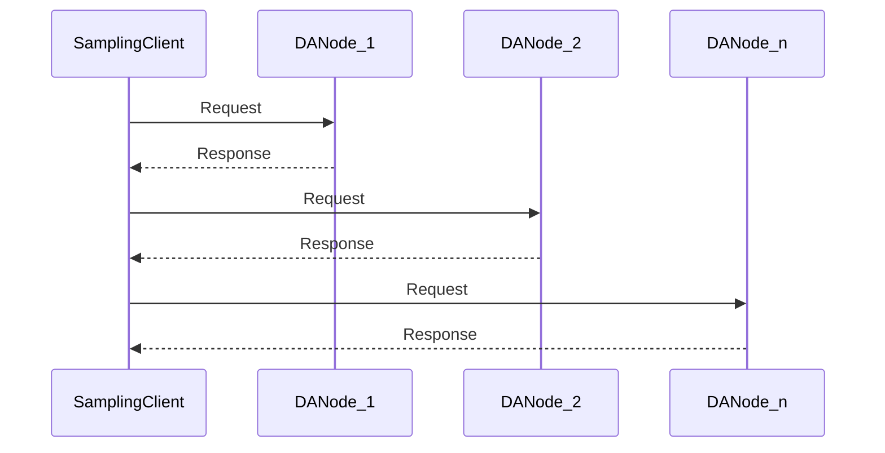
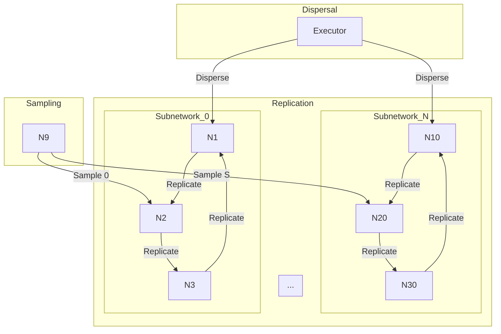

# DA-NETWORK

| Field | Value |
| --- | --- |
| Name | DA Network |
| Slug | 136 |
| Status | deprecated |
| Type | RFC |
| Category | Standards Track |
| Editor | Daniel Sanchez Quiros <danielsq@logos.co> |
| Contributors | Álvaro Castro-Castilla <alvaro@logos.co>, Daniel Kashepava <danielkashepava@logos.co>, Gusto Bacvinka <augustinas@logos.co>, Filip Dimitrijevic <filip@logos.co> |

<!-- timeline:start -->

## Timeline

- **2026-05-27** — [`b7602ed`](https://github.com/logos-co/logos-lips/blob/b7602ed8a225d41ca0bfaaa432524dc84d2ded7e/docs/blockchain/deprecated/da-network.md) — chore: move blockchain specs from notion to github
- **2026-05-18** — [`58b5698`](https://github.com/logos-co/logos-lips/blob/58b56988429f4d69a9e10a9fc118725e229e37c5/docs/blockchain/deprecated/da-network.md) — chore(blockchain): migrate contributor emails to @logos.co (#338)
- **2026-02-09** — [`afd94c8`](https://github.com/logos-co/logos-lips/blob/afd94c8bc1420376ae9af7e14a4feb246f2ed621/docs/blockchain/deprecated/da-network.md) — chore: add math support (#287)
- **2026-01-19** — [`f24e567`](https://github.com/logos-co/logos-lips/blob/f24e567d0b1e10c178bfa0c133495fe83b969b76/docs/blockchain/deprecated/da-network.md) — Chore/updates mdbook (#262)
- **2026-01-16** — [`89f2ea8`](https://github.com/logos-co/logos-lips/blob/89f2ea89fc1d69ab238b63c7e6fb9e4203fd8529/docs/blockchain/deprecated/da-network.md) — Chore/mdbook updates (#258)
- **2025-12-22** — [`0f1855e`](https://github.com/logos-co/logos-lips/blob/0f1855edcf68ef982c4ce478b67d660809aa9830/docs/blockchain/deprecated/da-network.md) — Chore/fix headers (#239)
- **2025-12-22** — [`b1a5783`](https://github.com/logos-co/logos-lips/blob/b1a578393edf8487ccc97a5f25b25af9bf41efb3/docs/blockchain/deprecated/da-network.md) — Chore/mdbook updates (#237)
- **2025-12-18** — [`d03e699`](https://github.com/logos-co/logos-lips/blob/d03e699084774ebecef9c6d4662498907c5e2080/docs/blockchain/deprecated/da-network.md) — ci: add mdBook configuration (#233)
- **2025-09-25** — [`51ef4cd`](https://github.com/logos-co/logos-lips/blob/51ef4cd533d8824291d9e2884bb467235b32a450/blockchain/deprecated/da-network.md) — added blockchain/deprecated/da-network.md (#160)

<!-- timeline:end -->

## Introduction

DA Network is the scalability solution protocol for data availability within the Logos Blockchain network.
This document delineates the protocol's structure at the network level,
identifies participants,
and describes the interactions among its components.  
Please note that this document does not delve into the cryptographic aspects of the design.
For comprehensive details on the cryptographic operations,
a detailed specification is a work in progress.

## Objectives

DA Network was created to ensure that data from Logos Blockchain Zones is distributed, verifiable, immutable, and accessible.
At the same time, it is optimised for the following properties:

- **Decentralization**: DA Network’s data availability guarantees must be achieved with minimal trust assumptions
and centralised actors. Therefore,
permissioned DA schemes involving a Data Availability Committee (DAC) had to be avoided in the design.
Schemes that require some nodes to download the entire blob data were also off the list
due to the disproportionate role played by these “supernodes”.

- **Scalability**: DA Network is intended to be a bandwidth-scalable protocol, ensuring that its functions are maintained as the Logos Blockchain network grows. Therefore, DA Network was designed to minimise the amount of data sent to participants, reducing the communication bottleneck and allowing more parties to participate in the DA process.

To achieve the above properties, DA Network splits up zone data and
distributes it among network participants,
with cryptographic properties used to verify the data’s integrity.
A major feature of this design is that parties who wish to receive an assurance of data availability
can do so very quickly and with minimal hardware requirements.
However, this comes at the cost of additional complexity and resources required by more integral participants.

## Requirements

In order to ensure that the above objectives are met,
the DA network requires a group of participants
that undertake a greater burden in terms of active involvement in the protocol.
Recognising that not all node operators can do so,
DA Network assigns different roles to different kinds of participants,
depending on their ability and willingness to contribute more computing power
and bandwidth to the protocol.
It was therefore necessary for DA Network to be implemented as an opt-in Service Network.

Because the DA network has an arbitrary amount of participants,
and the data is split into a fixed number of portions (see the [Encoding & Verification Specification](da-cryptographic-protocol.md)),
it was necessary to define exactly how each portion is assigned to a participant who will receive and verify it.
This assignment algorithm must also be flexible enough to ensure smooth operation in a variety of scenarios,
including where there are more or fewer participants than the number of portions.

## Overview

### Network Participants

The DA network includes three categories of participants:

- **Executors**: Tasked with the encoding and dispersal of data blobs.  
- **DA Nodes**: Receive and verify the encoded data,
subsequently temporarily storing it for further network validation through sampling.  
- **Light Nodes**: Employ sampling to ascertain data availability.

### Network Distribution

The DA network is segmented into `num_subnets` subnetworks.
These subnetworks represent subsets of peers from the overarching network,
each responsible for a distinct portion of the distributed encoded data.
Peers in the network may engage in one or multiple subnetworks,
contingent upon network size and participant count.

### Sub-protocols

The DA Network protocol consists of the following sub-protocols:

- **Dispersal**: Describes how executors distribute encoded data blobs to subnetworks.
[DA Network Dispersal](da-network.md#dispersal)
- **Replication**: Defines how DA nodes distribute encoded data blobs within subnetworks.
[DA Network Subnetwork Replication](da-network.md#replication)
- **Sampling**: Used by sampling clients (e.g., light clients) to verify the availability of previously dispersed
and replicated data.
[DA Network Sampling](da-network.md#sampling)
- **Reconstruction**: Describes gathering and decoding dispersed data back into its original form.
[DA Network Reconstruction](da-network.md)
- **Indexing**: Tracks and exposes blob metadata on-chain.
[DA Network Indexing](da-network.md)

## Construction

### DA Network Registration

Entities wishing to participate in DA Network must declare their role via [SDP](bedrock-service-declaration-protocol.md) (Service Declaration Protocol).
Once declared, they're accounted for in the subnetwork construction.

This enables participation in:

- Dispersal (as executor)
- Replication & sampling (as DA node)
- Sampling (as light node)

### Subnetwork Assignment

The DA network comprises `num_subnets` subnetworks,
which are virtual in nature.
A subnetwork is a subset of peers grouped together so nodes know who they should connect with,
serving as groupings of peers tasked with executing the dispersal and replication sub-protocols.
In each subnetwork, participants establish a fully connected overlay,
ensuring all nodes maintain permanent connections for the lifetime of the SDP set
with peers within the same subnetwork.
Nodes refer to nodes in the Data Availability SDP set to ascertain their connectivity requirements across subnetworks.

#### Assignment Algorithm

The concrete distribution algorithm is described in the following specification:
[DA Subnetwork Assignation](da-network.md#subnetwork-assignment)

## Executor Connections

Each executor maintains a connection with one peer per subnetwork,
necessitating at least num_subnets stable and healthy connections.
Executors are expected to allocate adequate resources to sustain these connections.
An example algorithm for peer selection would be:

```python
def select_peers(
    subnetworks: Sequence[Set[PeerId]],
    filtered_subnetworks: Set[int],
    filtered_peers: Set[PeerId]
) -> Set[PeerId]:
    result = set()
    for i, subnetwork in enumerate(subnetworks):
        available_peers = subnetwork - filtered_peers
        if i not in filtered_subnetworks and available_peers:
            result.add(next(iter(available_peers)))
    return result
```

## DA Network Protocol Steps

### Dispersal

1. The DA Network protocol is initiated by executors
who perform data encoding as outlined in the [Encoding Specification](da-cryptographic-protocol.md).
2. Executors prepare and distribute each encoded data portion
to its designated subnetwork (from `0` to `num_subnets - 1` ).
3. Executors might opt to perform sampling to confirm successful dispersal.
4. Post-dispersal, executors publish the dispersed `blob_id` and metadata to the mempool. <!-- TODO: add link to dispersal document-->

### Replication

DA nodes receive columns from dispersal or replication
and validate the data encoding.
Upon successful validation,
they replicate the validated column to connected peers within their subnetwork.
Replication occurs once per blob; subsequent validations of the same blob are discarded.

### Sampling

1. Sampling is [invoked based on the node's current role](da-network.md#sampling).
2. The node selects `sample_size` random subnetworks
and queries each for the availability of the corresponding column for the sampled blob. Sampling is deemed successful only if all queried subnetworks respond affirmatively.

- If `num_subnets` is 2048, `sample_size` is [20 as per the sampling research](analysis-resilience-and-anonymity/appendices/analysis-of-rewarding-in-data-availability-network.md)



### Network Schematics

The overall network and protocol interactions is represented by the following diagram



## Details

### Network specifics

The DA network is engineered for connection efficiency.
Executors manage numerous open connections,
utilizing their resource capabilities.
DA nodes, with their resource constraints,
are designed to maximize connection reuse.

DA Network uses [multiplexed](https://docs.libp2p.io/concepts/transports/quic/#quic-native-multiplexing) streams over [QUIC](https://docs.libp2p.io/concepts/transports/quic/) connections.
For each sub-protocol, a stream protocol ID is defined to negotiate the protocol,
triggering the specific protocol once established:

- Dispersal: /blockchain/da/{version}/dispersal
- Replication: /blockchain/da/{version}/replication
- Sampling: /blockchain/da/{version}/sampling

Through these multiplexed streams,
DA nodes can utilize the same connection for all sub-protocols.
This, combined with virtual subnetworks (membership sets),
ensures the overlay node distribution is scalable for networks of any size.

## References

- [Encoding Specification](da-cryptographic-protocol.md)
- [Encoding & Verification Specification](da-cryptographic-protocol.md)
- [DA Network Dispersal](da-network.md#dispersal)
- [DA Network Subnetwork Replication](da-network.md#replication)
- [DA Subnetwork Assignation](da-network.md#subnetwork-assignment)
- [DA Network Sampling](da-network.md#sampling)
- [DA Network Reconstruction](da-network.md)
- [DA Network Indexing](da-network.md)
- [SDP](bedrock-service-declaration-protocol.md)
- [invoked based on the node's current role](da-network.md#sampling)
- [20 as per the sampling research](analysis-resilience-and-anonymity/appendices/analysis-of-rewarding-in-data-availability-network.md)
- [multiplexed](https://docs.libp2p.io/concepts/transports/quic/#quic-native-multiplexing)
- [QUIC](https://docs.libp2p.io/concepts/transports/quic/)

## Copyright

Copyright and related rights waived via [CC0](https://creativecommons.org/publicdomain/zero/1.0/).
