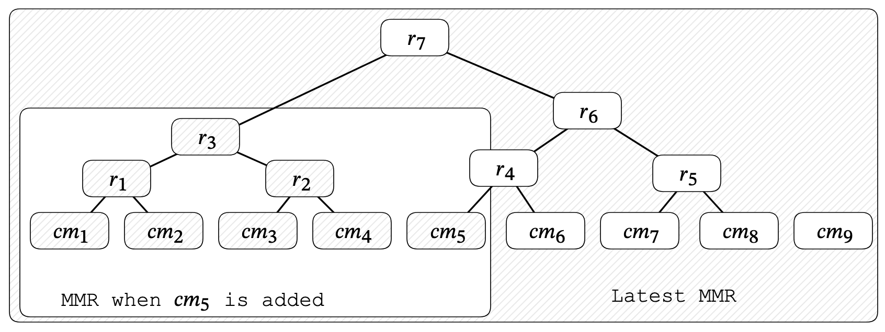
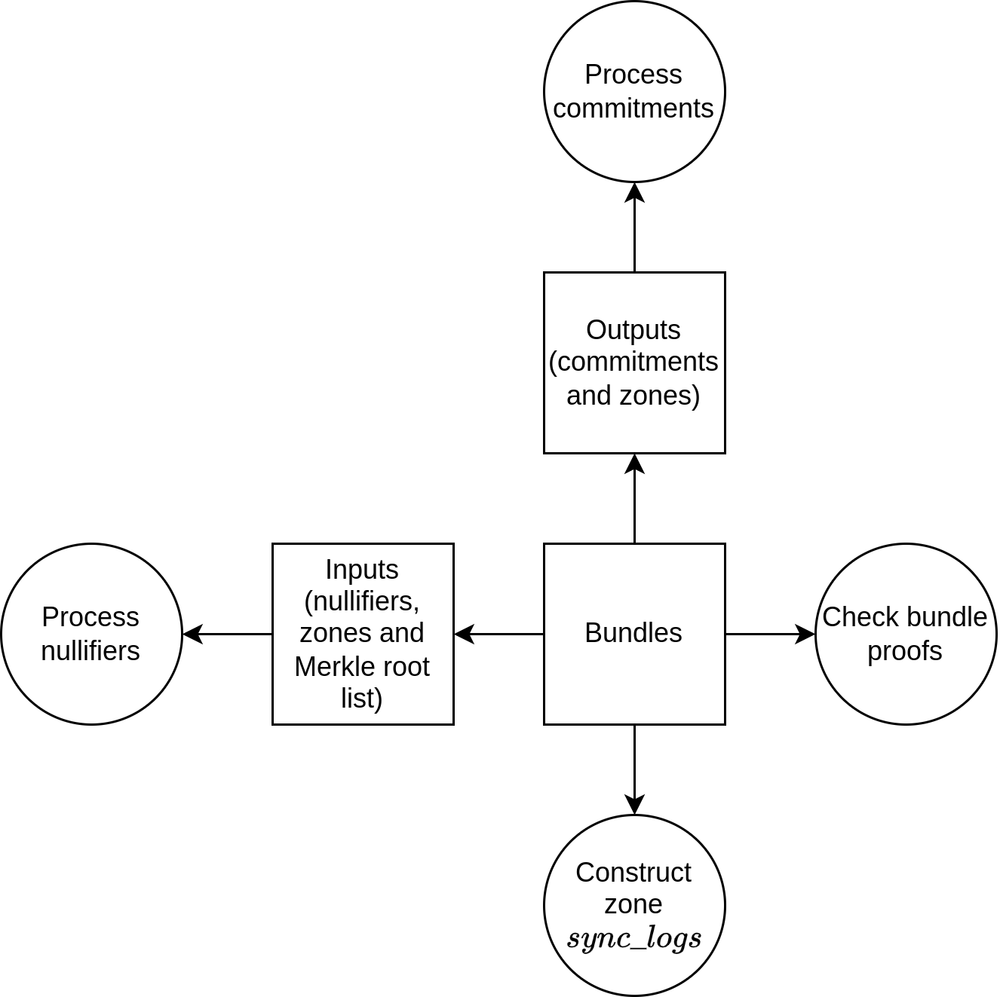
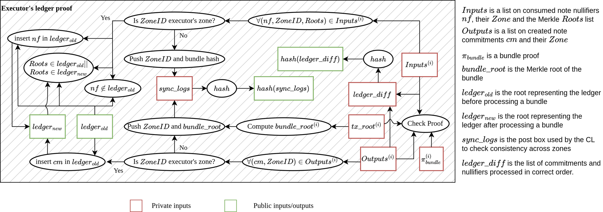

# Common Ledger Specification

**Owners:** Thomas Lavaur David Rusu
**Reviewers:**  Giacomo Pasini Mehmet Álvaro Castro-Castilla
## Introduction

Unlike a typical blockchain, where a single ledger would track all notes, Logos Blockchain partitions the ledger across zones. The partitioned ledgers will be maintained locally by Native zones, but enforced globally as a common format to enable certain properties and functionalities otherwise not possible (such as PACTs, see  ). Each Native zone manages its own ledger partition and defines its own application. Despite this separation, global ledger rules ensure zones can confidently process notes originating from other ledger partitions. The common ledger is also directly used by the Mantle through the Mantle ledger. The Mantle ledger enforces additional constraints and restrains interactions on its partition of the ledger, favoring efficiency while keeping the model described in this document.
### References

The following documents provide the necessary background for related topics:
1. What a note is.
  Notes

2. How the update requests of the ledger are built.
  Transactions

3. How we chose the representation of the ledger.
  - Preliminary Research: Ledger Representation

  - Preliminary Research: Mutator Sets and their Application to Scalable Privacy

4. How Ledger updates are verified and coordinated by Logos Blockchain Bedrock.
  Preliminary Research: Bedrock Mantle Specification (Native Zones)

## Overview

The Zone Ledger is composed of two sets, the commitment set and the nullifier set. The commitment set holds every note that has been created in a zone, and the nullifier set maintains a record of every note that has been spent in a zone. Bundles are used to update the Zone Ledger and the rules governing these updates are enforced in The Ledger proof.
The **Commitment Set** is represented as an MMR (see Merkle Mountain Ranges (MMR)). This representation is used to achieve state compression.
- Wallets must track changes to the MMR to maintain proofs of membership as new notes are added.
- Executors are only required to store the Frontier Nodes (see Frontier Nodes) of the MMR.
The **Nullifier Set** is represented as an Indexed Merkle Tree (IMT, see Preliminary Research: Sparse Merkle Tree vs Indexed Merkle Tree).
- Wallets reveal nullifiers to prove a note is consumed. This nullifier on its own cannot be linked to the note commitments.
- Executors must retain the full nullifier list in order to update the IMT.
The **Ledger proof** governs the evolution of these two sets by applying bundles to the ledger state. The newly created commitments from each bundle are added to the commitment set and the spent nullifiers are inserted into the nullifier set after verifying their non-membership.
## Commitment Set

The set of commitments is stored in the zone ledger and represents the entire history of notes that have been created and included within the zone ledger. By proving a note’s membership in a commitment set, a note owner can show that a note is not counterfeit.

  For more information on notes and transactions, the reader is referred to Execution Model Specification.

Commitments coming from Bundles will be continuously added to an ever-growing list. To avoid linear state growth here, the list is compressed using an MMR so that at any moment, no entity is required to store the entire list of commitments to carry out zone operations.
A new note commitment follows a lifecycle of 3 phases:
1. Wallets
2. Executors
3. Bedrock Mantle
### 1. Wallets

A wallet must maintain the Merkle paths to the notes it holds. These Merkle paths are used to build proofs of membership when a note is spent in a transaction. These membership proofs do not disclose the commitment, therefore making it impossible to link together the old transaction that created the note and this new transaction consuming this note. These Merkle paths can become outdated as the commitment set evolves, since each new commitment modifies the set’s Merkle root. Therefore, a wallet must follow the activity of all zones in which it holds notes in and update the Merkle paths of those notes accordingly.
An additional complication is that, transactions must prove the membership of input notes w.r.t. the *latest* commitment root. This raises the issue that since the commitment root is changing frequently, membership proofs will become outdated rapidly if they are not immediately included on chain.
To resolve this, we divide commitment membership proofing into two stages:
1. The wallet proves commitment membership w.r.t. the frontier nodes of the most recent MMR it had seen.
2. The executor then extends this proof by proving that these frontier nodes are nodes in the latest commitment Merkle tree.
The intuition behind why this works is that since the commitment set MMR is append-only, an old state of an MMR will always be a subset of the latest MMR:


> <sub>The MMR when $`cm_5`$ was added is a subset of the latest MMR, we can prove that the frontier nodes of the old MMR $`\{r_3, cm_5\}`$ are members of the latest MMR by providing paths up to $`r_7`$</sub>

This works insofar as executors maintain a far enough history of MMR states. If a wallet membership proof is too old, an executor may not have kept MMR states so far back and so he won’t be able to extend the membership proof to the latest root. In this case, the wallet must sync with the zone to update its membership proof to proceed (see Membership Proof Updates).
#### Compression of the Commitment Set

The commitment set is compressed using an MMR. This state compression means that it is enough for executors to hold only the frontier nodes of the MMR to continue processing new commitments. The Frontier Root (Frontier Root) of the MMR is the commitment set root and its evolution is proved through the Ledger proof.
Wallets are only required to follow the updates of the MMR to prevent excessive work.
- To emit transactions, wallets can retrieve one valid list of frontier nodes which includes their commitment.
- Provide a proof of membership according to the frontier nodes.
- The executor would complete the proof, proving that the frontier nodes are in the latest commitment set according to the Merkle root.
#### Proof of Membership

**The first generation of the commitment Merkle proof**
When a wallet wants to store a new note, because it's waiting to receive a note or because it scanned the network and detected a new note under its ownership, the wallet must construct an initial Merkle proof, proving the membership of the note commitment in the zone ledger. In order to construct this first proof of membership, the receiver doesn’t need help from the issuer.

  For the detection of new notes by wallets, see
  - Wallet scanning the network for the notes

The wallet can build this proof of membership w.r.t. some frontier nodes $`F`$ by providing the witness $`(cm,path)`$ where
- $`cm`$ is the commitment we are proving membership for.
- $`path`$ is the Merkle path provided by the note owner.
The membership proof attests to the statement:
- $`\textbf{merkle\_path\_root}(cm, path) \in F`$.
By proving membership against the frontier nodes, we do not leak temporal information about which mountain a commitment is part of in the MMR.
**Membership Proof Updates**
To ensure transaction unlinkability, it is essential that an observer cannot determine which commitment is used in the proof of membership.
- Ideally, when there are $`n`$ commitments in the set, the probability $`p`$ that an observer can identify whether a particular commitment is being used should satisfy $`|p-\frac{1}{n}|\leq 2^{-128}`$ for 128 bits of security.
- This means that a wallet cannot simply use the frontier nodes of the commitment set from when it was initially created. Doing so would allow an observer to infer that the proven commitment is more likely to be one of the recently added ones
Therefore, it is essential for wallets to update this list of frontier nodes representing the commitment set regularly.
1. The wallets main maintenance task is centred around maintaining the one frontier node in which his note is a member of.
  - The moments when the Merkle path of this frontier node needs to be updated by wallets are easily predictable because they occur when the frontier node is merged with another one.
    - When two frontier nodes have the same height, they are merged according to Merkle Mountain Ranges (MMR).

  - The merging process of two frontier nodes can be anticipated.
    - If a commitment is the $`i^{th}`$ commitment added to the set (starting from 0), the folding happens every time a new commitment added is the $`j^{th}`$ commitment and $`j`$ has a binary representation that changes a 0 to a 1 in $`i`$’s binary representation from right to left.
    - For example, if a commitment is the n°54 (counting the first commitment as commitment 0), 54 in binary is 110110.
    - Its tree will be merged after the inclusion of the 110111, 111111, 1111111, etc. commitment, or whenever another leading 1 is added to the binary representation.
    - In other words, the Merkle path should be updated when commitments 55, 63, 127, 255, and so on are added.
    - As time passes, this situation occurs less frequently (logarithmically)

  - This update process is efficient because it only requires adding the root of the other merged node to the end of the current Merkle proof.

2. The remaining frontier nodes represent the rest of the commitment set for a maximal transaction unlinkability. This part does not need to be maintained over time if communicated by the executor.
When the wallet generates a transaction, it recovers the remaining frontier nodes that don’t contain the note commitment from the executor and updates its Merkle path according to what was described before.
**Recommendation**
To maximize unlinkability between transactions and minimize the storage required by executors, we recommend that wallets update the following as frequently as possible:
- Merkle paths for each note they hold as frontier node folds are observed
- Maintain their list of frontier nodes, as described in Merkle Mountain Ranges (MMR).
### 2. Executors

Executors must provide all the necessary information for wallets to update their membership proofs. This includes newly added commitments. Executors could optionally share the list of frontier nodes to reduce how often wallets need to update their membership proofs.
They are also responsible for maintaining the state of the commitment set and proving the correct insertion of new commitments from bundles in the ledger proof. When the executor processes bundles, the executor must recursively prove that the bundles are valid according to the requirements shared by all native zones. The ledger proof will demonstrate:
1. The bundle is valid using the bundle proof.
2. For each frontier node used for membership proofs in the bundle, we have a Merkle path up to the latest frontier (the executor being the one providing the remaining Merkle path).
3. The new commitments have been appended to the commitment MMR.
4. The new commitment root is derived as the Frontier Root of the MMR. (Frontier Root).
To make all necessary information available to other executors, the executor must provably make available all commitments added in the latest ledger update. To facilitate wallet’s proof of membership update, they could optionally communicate off-chain to wallets the merged MMR roots and the frontier nodes after each update, see:
- Executor dispersal to wallets

## Nullifier Set

The set of nullifiers in a zone represents the entire history of all notes that have been consumed within the zone. This set allows someone who knows the nullifier to prove that the note was never consumed.
Nullifiers will be continuously added to an ever-growing list maintained by Executors:
- New nullifiers are added from bundles being applied to the ledger.
- Before a nullifier is added to the list, the ledger proof first verifies its non-membership to protect against double spends
- This is done using an Indexed Merkle tree compression scheme that enables proof of non-membership (presented in Indexed Merkle Tree (IMT) ).
Just like commitments, nullifiers also experience different representations depending on which phase of their lifecycle they are on:
1. Wallets
2. Executors
3. Bedrock Mantle
### 1. Wallets

Note owners must derive nullifiers for any notes they wish to spend. The difficult work of proving non-membership against the nullifier set is delegated to executors.
### 2. Executors

Executors are responsible for processing nullifiers derived from valid bundles. To do that, the Ledger proof must show that nullifiers aren’t already included in the set, preventing notes from being used twice. They must also publish the necessary information to allow other executors to rebuild the ledger of the native zone and take over the executor's role. This includes:
- All nullifiers added in the latest ledger update.
- All commitments added in the latest ledger update.
As already presented in 2. Executors, zones are responsible for the verification of bundles. For this, bundles must only consume notes that aren’t already consumed as described in .
## Ledger Updates

In this section, there are some components that are described in detail in Execution Model Specification and Preliminary Research: Bedrock Mantle Specification (Native Zones). Here we will just provide a brief intuition of what they do, and kindly refer the reader to the original documents for further detail:
- **Bundle**: A bundle is an aggregation of one or several valid transactions that are balancing each other.
- Zone **Sync Logs**: This is a list of the form $`(bundle\_root, Zone1,Zone2,\dots)`$ used to verify the correct coordination between zones.
- Zone **Update** is what will land on the Bedrock Mantle for posting about a zone update, which  includes the update of its ledger. This update processes several valid bundles and updates the ledger of a zone accordingly.
### **Proof overview**

In order to prove the correct update of the ledger to the Bedrock, zones will produce ledger proofs to:
1. Validate bundle proofs according to Bundles.
2. Prove nullifiers are not already in the nullifier set of the ledger.
3. Prove the inclusion of the nullifiers in the nullifier set.
4. Verify the commitment proof of membership against the commitment set.
5. Output updated ledger state.
6. Output the hash of the ledger diff to check its availability on-chain.
7. Output cross-zone zone sync logs to communicate to Bedrock and guarantee validity of bundles even for those involving several zones according to Consistency between zones.
### **Proof design**



1. The executor will bring $`i`$ bundles, of input $`Inputs^{(i)}`$, $`Outputs^{(i)}`$ and of root $`bundle\_root`$, to apply an update on the ledger of its zone. The ledger proof checks that each bundle has a valid bundle proof:
  - Proving that each of them is balanced.
  - Proving that inputs and outputs are valid notes that can be included in the zone ledger on the condition that the frontier nodes used for proof of membership are nodes included in the ledger state of the zone.

2. For each different bundle $`i`$, $`\forall (nf,ZoneID,Roots) \in Inputs^{(i)}`$, If $`ZoneID`$ is the executor’s zone, the ledger proof guarantees that nullifiers are not already in the set and include them afterward.
1. To finalize the proof of membership, the executor must prove that there exists a Merkle path from each node in $`Roots`$ to one of the latest frontier nodes.
2. The nullifier is checked to be indeed not present in the last known nullifier set of the zone.
    - For that, the executor is providing a Merkle path demonstrating that there is a different nullifier $`nf_{inf}`$ in the nullifier set Merkle tree.
    - That $`nf_{inf}`$ is strictly lower than $`nf`$
    - That the leaf of $`nf_{inf}`$ is pointing to another nullifier $`nf_{supp}`$.
    - That $`nf_{supp}`$ is strictly greater than $`nf`$.

3. Integrate $`nf`$ in the nullifier set of the zone:
    - Integrate a new leaf which includes the new nullifier $`nf`$ pointing to the greater nullifier $`nf_{supp}`$.
    - Change the pointer of $`nf_{inf}`$ to $`nf`$ using the Merkle path of $`nf_{inf}`$.
    - This ensures that each leaf is still pointing to the next nullifier, conserving the ordered property of the list.

3. For each different bundle $`i`$,  $`\forall (cm,ZoneID) \in Outputs^{(i)}`$, if $`ZoneID`$ is the executor’s zone, the ledger proof appends the commitment in the commitment set MMR of the zone.
4. The ledger proof then constructs the Merkle root of the bundle $`bundle\_root`$, representing uniquely the bundle. This is achieved by constructing a Merkle tree over the transaction roots.
5. The ledger proof constructs the zone $`sync\_logs`$ that is used by validators to ensure correct coordination between zones for cross-zone bundles. This takes the form of one tuple per cross-zone bundle (with the $`bundle\_root`$ followed by every zone involved in the bundle).
6. Output updated ledger state $`ledger_{new}`$, the hash of cross-zone $`sync\_logs`$ and **the hash of the nullifiers and commitments included in the ledger in correct order**.
The following diagram summarizes the executor’s ledger proof:


## Annexes

### Merkle Mountain Ranges (MMR)

From the [original presentation of MMR on github:](https://github.com/opentimestamps/opentimestamps-server/blob/master/doc/merkle-mountain-range.md)
As digests are accumulated we hash them into trees, building up the largest perfect binary trees possible as we go. At least one tree will always exist, with $`2^k`$ digests at the base, and $`2^{k+1}-1`$ total elements. If the total number of digests doesn't divide up into one perfect tree, more than one tree will exist. This data structure we call a Merkle Mountain Range, for obvious reasons:
```text
graph BT
    %% Leaves (elements)
    %% Internal Nodes
    node0[N0] --> Hash01[N0-1]
    node1[N1] --> Hash01

    node2[N2] --> Hash23[N2-3]
    node3[N3] --> Hash23

    node4[N4] --> Hash45[N4-5]
    node5[N5] --> Hash45

    node6[N6]

    %% Next level of parents
    Hash01 --> Hash0-3[N0-3]
    Hash23 --> Hash0-3
```

Since the trees are strictly append only, we can easily build, and store them, on disk in the standard breadth first tree storage. In this array we can define a height for each digest, and that height is equal to $`log_2(n)`$ where n is the number of digests in the base of the tree. The following shows the contents of that array as it is progressively extended with new digests:
```text
0
00
001 <- indexes 0 and 1 are hashed to form index 2
0010
0010012 <- another tree, which leads to the two subtrees being merged (height 2)
00100120
0010012001 <- now we have two trees, one of height 2, one of height 1
```

Now we have two trees, or mountains, and the result looks like the following:
```text
graph BT
    %% Leaves (elements)
    %% Internal Nodes
    node0[N0] --> Hash01[N0-1]
    node1[N1] --> Hash01

    node2[N2] --> Hash23[N2-3]
    node3[N3] --> Hash23

    node4[N4] --> Hash45[N4-5]
    node5[N5] --> Hash45

    %% Next level of parents
    Hash01 --> Hash0-3[N0-3]
    Hash23 --> Hash0-3
```

This range has six digests at the base. Another four digests, or ten in total, would result in the first mountain range, shown above. Next we need to create a single digest linked to every mountain in the range, and in turn every digest submitted. For that, we pad the the tree with empty nodes at the base until it reach a power of two in order to have a full Merkle tree:
```text
graph BT
    %% Leaves (elements)
    %% Internal Nodes
    node0[N0] --> Hash01[N0-1]
    node1[N1] --> Hash01

    node2[N2] --> Hash23[N2-3]
    node3[N3] --> Hash23

    node4[N4] --> Hash45[N4-5]
    node5[N5] --> Hash45
    
    node6[empty] --> Hash67[N6-7]
    node7[empty] --> Hash67

    %% Next level of parents
    Hash01 --> Hash0-3[N0-3]
    Hash23 --> Hash0-3
    
    Hash45 --> N4-7
    Hash67 --> N4-7
    
    Hash0-3 --> root
    N4-7 --> root
```

The process can be completely deterministic, producing the exact same digest every time provided you have every base digest and their order. By knowing the number of digests in a given mountain range you can always efficiently reproduce the peak enclosing the mountain whole range at that point in time. The storage cost for all the intermediate hashes is $`n-1`$.
Moreover, knowing Merkle roots of different depth Merkle tree filled with empty leaves able the computation of the Merkle root logarithmically without needing to really pad the tree.
