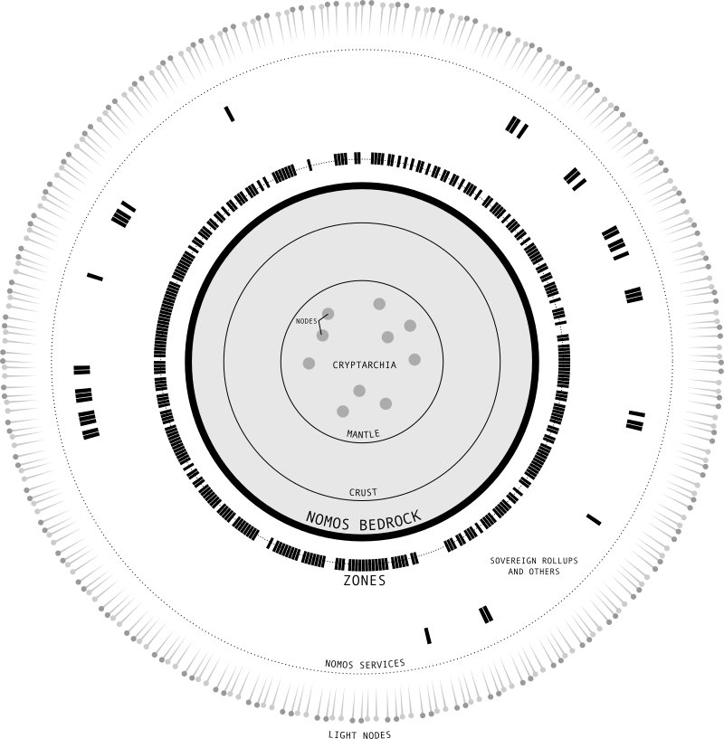
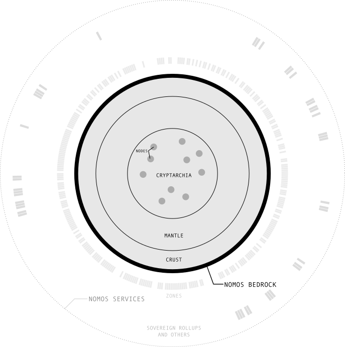
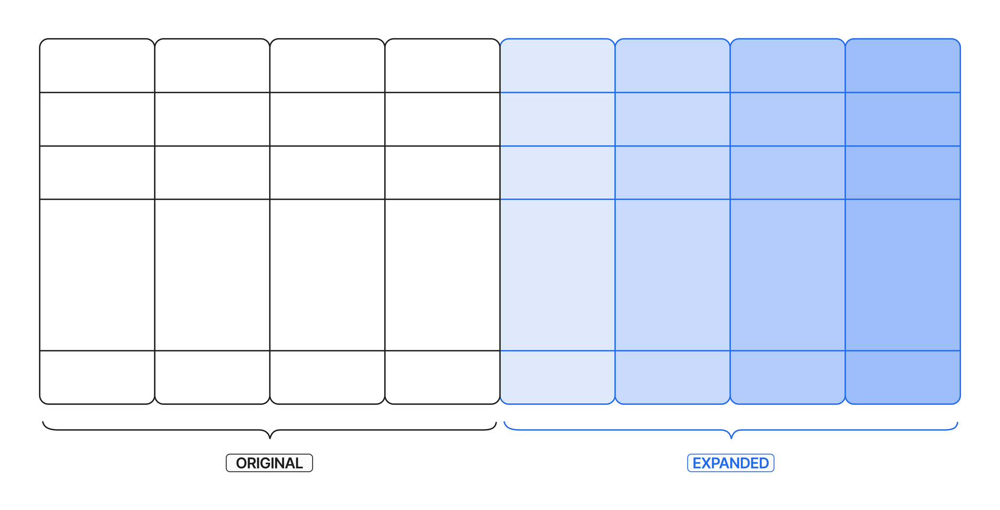
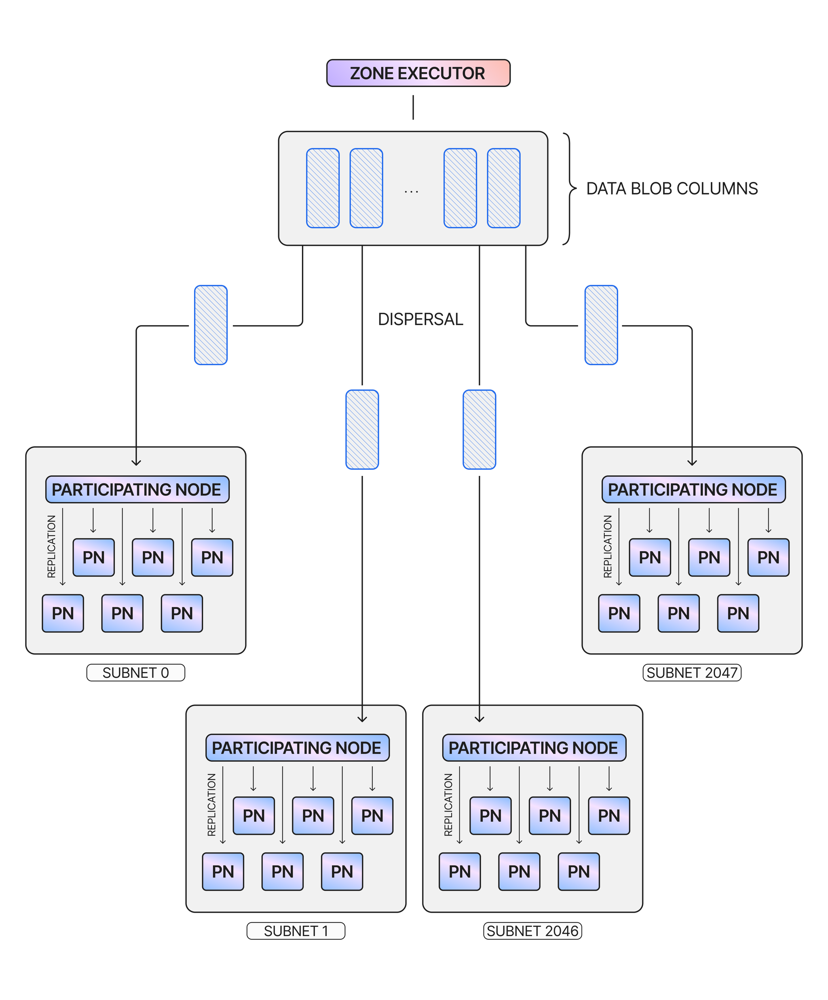
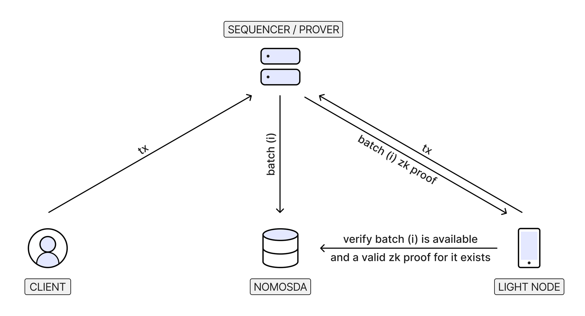

# The Logos Blockchain Whitepaper

**Owner:** Álvaro Castro-Castilla Daniel Kashepava

  The information here is up-to-date, but note that the whitepaper is still in active development.

## Introduction

Once again, the world stands at a crossroads. For as long as humanity has lived together, there have been individuals seeking to control others, and individuals seeking freedom from that control. As history marched onward, technologies emerged that shifted this struggle toward one side or the other. From writing, to gunpowder, to the printing press, to the revolver – inventions would periodically arise and upset the balance of forces in unpredictable ways. In recent times, the internet – initially hailed as a bastion for free speech and free association – has become a tool for mass surveillance and control.
The ideological experiments of the 19th and 20th centuries have made it clear that political action alone will not bring lasting freedoms to the human race. Recognising this, the cypherpunk movement sought to proactively create technologies to ensure that civil liberties become inviolable by design. Among their most influential creations was Bitcoin which, along with the blockchain protocols it inspired, built the foundation for a financial system independent from state power and elite control. However, as the public nature of these blockchains exposed their participants to government scrutiny and regulation, that original vision was gradually replaced with arcane financial instruments and predatory speculation.
The [**Logos movement**](https://logos.co/) was founded as a revival of the cypherpunk ideal that has been all but forgotten over the past several decades. Logos has dedicated itself to the creation of decentralised technologies that would enable people to engage in social collaboration on their own terms – without being worried about censorship or coercion. These voluntary associations and institutions that function with an emergent order and are resistant to corruption are referred to as **network states**, in contrast to traditional states that rely on threats of violence to maintain control. Only with a technology stack that facilitates private and permissionless consensus, data storage, and communication can this vision be made a reality.
**Logos Blockchain** was created by Logos to be the infrastructure facilitating the creation of network states and enabling people to easily interact with them. Using Logos Blockchain, network states are implemented as lightweight blockchains known as Zones, with an underlying chain providing consensus, security, and interoperability. Importantly, network states implemented on Logos Blockchain allow for social order to emerge and govern their operations, all while preserving critical properties that guarantee individual freedoms for all participants. These include privacy for users and infrastructure providers, censorship resistance, resilience against attacks, and credible neutrality. In essence, Logos Blockchain is the platform that will produce the conditions for true improvements over millennia-old cooperation techniques based on trust and control.
The world stands at a crossroads. The greatest minds of this generation are working tirelessly to build the technology that will determine the future of civil rights for centuries to come – both on the side of coercion, and on the side of freedom. Your decisions now will determine which side emerges victorious.
## Overview

Logos Blockchain is a blockchain infrastructure designed for network states and other decentralised applications that require high levels of privacy, decentralisation, and resilience. It facilitates the creation and operation of these applications, provides a common context for their interaction, and gives users the ability to freely use any application they desire. Despite the diverse variety of apps that can be built on Logos Blockchain, it provides guarantees that they will operate correctly, securely, and without corruption. To accomplish this, Logos Blockchain is implemented as two blockchain layers. Applications can be implemented as lightweight, permissionless blockchains known as **Zones**, which are built on top of a solid Layer 1 foundation known as **Bedrock**. Logos Blockchain’s Bedrock together with its Zones is known as the **Logos Blockchain network**. The entire Logos Blockchain architecture can be visualised as in the diagram in Figure 1.

> Figure 1. The Logos Blockchain architecture diagram.

Bedrock is the foundational layer of Logos Blockchain, which provides consensus and lightweight verification to Logos Blockchain Zones. This consensus mechanism provides privacy for block proposers and is highly scalable, resilient, and supports dynamic participation by Logos Blockchain nodes. It also verifies proofs sent to it by Zones to ensure their correct operation. Bedrock is a decentralised network in which anyone can easily participate, where serving as a validator should ideally be as simple as running the Logos Blockchain Node application on a laptop. Validators contribute to the security, consensus, and interoperability of the Logos Blockchain network.
The basic functionality of Bedrock is expanded and improved by a variety of Logos Blockchain Bedrock Services. Bedrock uses these Services to provide data scalability, network-level privacy for consensus, and **executors** that maintain Zone liveness by updating their ledger and state. While these Services are important for ensuring that Logos Blockchain can operate under the most adversarial conditions, Logos Blockchain' Bedrock can still operate without them. This may occur under adversarial conditions, or if a Service fails for some other reason. Validators who choose to participate in providing any number of Bedrock Services are expected to have increased hardware requirements compared to the minimal ones necessary for Bedrock validation.
Bedrock and Bedrock Services are used to create very lightweight and interoperable blockchains for applications known as Logos Blockchain Zones. Users have two options for interacting with these applications:
1. A user could run a simple**client**, which relies solely on a direct connection to the relevant Zone, with Bedrock abstracted from view. The Zone, in turn, interacts with Bedrock in order to interact with other Zones and to obtain guarantees of security and data availability.
2. Additionally, a user may choose to run a **light node**, which would connect to Bedrock for lightweight verification. Running a light node allows the user to fully verify the state of the Zone they care about, without relying on any trusted entity.
Logos Blockchain is primarily designed for applications on **Zones**, which together form the **Native Execution Space**. Zones rely on Bedrock to the fullest extent, thereby benefiting from the collective security of the entire Logos Blockchain network. From a user’s perspective, Zones are deeply interconnected environments that require minimal setup and maintenance, as a result of their common structure and strong interoperability. They are also totally permissionless, with any Logos Blockchain validator - or user, if no validators are available - having the ability to keep a Zone live by serving as its executor. Despite this, Zones are resistant to censorship due to specific mechanisms guaranteeing transaction inclusion. This also means that users of a Zone will always have the option to exit that Zone if they so desire.
Despite the advantages of Zones, they are not suitable for all applications and remain a work in progress. Therefore, Logos Blockchain also provides support and unique features for [**Sovereign Rollups**](https://blog.celestia.org/sovereign-rollup-chains/). These rollups are fully independent, without any constraints on their state imposed by Bedrock. This sovereign model provides greater freedom and customisability in creating a chain, allowing creators to maximise properties like performance. To achieve this, Sovereign Rollups must sacrifice native features such as the interoperability available between Zones as well as their censorship resistance guarantees.
### The Three Lines of Defence

The Logos Blockchain network described above is designed to be resilient against a variety of adversaries while remaining decentralised and permissionless. In order to mount a defense against threats, Logos Blockchain relies on a **three-tiered strategy to ensure the longevity and resilience of its applications**. Given that an application on Logos Blockchain is implemented as a Zone or a set of Zones, each layer of the Logos Blockchain architecture will contribute to safeguarding its survival and correct operation. Whenever one layer fails and the defence strategy proceeds to the next stage, there is greater decentralisation and less concentrated trust assumptions to prevent further failure. At the same time, these secondary layers come with tradeoffs on properties such as latency and user experience, which is why they are only used as a last resort. The three lines of defence are:
1. **As a first line of defence, we have the Zone(s).** Zones are executed in a permissionless fashion by executors, with the Executor Network providing incentives for doing so correctly. An executor may choose to provide [preconfirmations](https://www.longhash.vc/post/preconfirmations-credible-promise-of-future-execution) to users, giving various degrees of confidence that a transaction will be included. Once an executor has made Zone data available and generated ZK proofs for the correctness of its transitions, Bedrock provides assurances of correct execution.
2. In case an executor acts maliciously, Bedrock**provides broad cryptoeconomic security and emergency recovery**. At this stage, the user relies on the Logos Blockchain validator set to protect against two types of attacks by a Zone:
1. If the Zone is deleting or withholding data from its users, any party can use Bedrock to reconstruct the entire Zone data up to a certain time window. This time window is sufficient for third-party protocols to take over in assuring the long-term availability of the data. For long-term storage, the only guarantee that we need for correct data recovery is that a single honest entity in the entire world has the original data - and is willing to share it. Additionally, Zone data can be both stored and recovered independently of all the other Zones, which makes it easy for any interested party to store the history of specific Zones.
2. If the Zone is attempting to include incorrect ZK proofs, they will be rejected. Zones submit proofs to ensure the correctness of their state transitions. Bedrock also enables synchronous composability by enforcing cross-Zone transaction correctness, discarding the entire operation if any part of it cannot be verified.

3. Finally, a user can rely on light nodes or better yet, run one themselves to collectively detect Logos Blockchain Bedrock misbehaviour. This misbehaviour can manifest itself in the realms of data availability, consensus, or by wrongfully accepting incorrect ZK proofs from the Zones. In these situations, light nodes have two options:
1. Light nodes can choose to follow a valid minority fork of Bedrock, if it exists. This is possible because Logos Blockchain uses a consensus protocol that favors liveness over finality, which allows an honest minority to keep building a minority fork while the majority is misbehaving. Following a minority fork can occur without an explicit removal of the dishonest majority.
2. In the event where there is no valid minority fork, light nodes can initiate a collaborative protocol for data reconstruction and/or a mass exit from the Logos Blockchain network. Their goal, at the very least, will be to ensure that the last valid state can be recovered and reactivated by a new, healthy network. This type of process can be bootstrapped with less strict constraints than a full consensus protocol.

## Logos Blockchain Bedrock

Logos Blockchain' Bedrock is the basis on top of which the broader Logos Blockchain network is built, operating as a large and decentralised peer-to-peer blockchain network. Its purpose is to provide consensus and a common context for Zone correctness and interoperability, while safeguarding participants’ privacy and remaining neutral and permissionless. Bedrock simultaneously preserves the autonomy of Logos Blockchain Zones and the applications that run on them, as well as every user’s rights and access to their digital property and identity. While the average user will rarely interact with Bedrock directly (only doing so to forcibly include Zone user transactions due to censorship, or if they have to act as an executor under extraordinary circumstances), its presence in the background ensures that decentralised applications “just work” the way they should, without falling to corruption or malicious behaviour.
### Design Principles

Logos Blockchain' Bedrock was designed with several guiding principles that are critical to the Logos Blockchain vision. Chief among these is **privacy**, Logos Blockchain’s most important feature. This privacy must protect information associated with all participants, regardless of their role in the protocol. On the infrastructure level, validators participating in Bedrock must be confident that their block proposals have a sufficiently low probability of being traced. From an outsider’s perspective, the network looks like a large mass of indistinguishable nodes, producing noise to avoid any detectable patterns. This privacy guarantee allows validators to support all Zones autonomously and neutrally, with the confidence that their contribution to the progress of the chain appears no different to that of any other node. This mitigates the risk of self-censorship, ensuring that no Zone update is actively excluded due to concerns about its content or source. For Logos Blockchain developers, Bedrock makes private applications not just easy to build, but ensures that privacy is available by default.
Ensuring that Bedrock remains operational and protects privacy in spite of attacks requires a high level of **resilience**. Due to Logos Blockchain’s decentralised nature, more validators participating in Bedrock results in fewer individual points of failure and thus a better resistance to attacks. To enable this, it was necessary to create a network characterised by **low entry barriers** to attract as many validators as possible. A basic Bedrock node must therefore be easy to run - with a simple interface and requiring only typical consumer hardware. As a result of these requirements, validator nodes only participate in consensus, with more advanced functionality available on an opt-in basis. Validators can participate with any amount of stake, reducing economic barriers to participation. Accommodating this large network of nodes is accomplished by using a very scalable consensus protocol that prioritises liveness. This results in a network that continues operating even in unstable or extremely adversarial conditions, with any fork producing a simultaneously-operating chain. In the latter scenario, a fork can be resolved in favour of one chain in case the recovery process can be completed within the finality period. However, if two chains operate independently for longer than this period, both forks are considered valid and independent, and further decisions are subject to social consensus.
While Logos Blockchain Zones have considerable autonomy, this autonomy cannot come at the user’s expense. Bedrock therefore provides protection to users by guaranteeing **censorship resistance** - that is, an assurance that every correct transaction on Zones will eventually be added to the blockchain. In the optimistic default scenario where Zone executors act honestly, users’ transactions get processed by Zone executors quickly and inexpensively. However, in the event that a Zone attempts to censor a user by excluding their transactions, Bedrock provides a fallback path for the transaction to be included. This path is slower and more expensive, but is only expected to be used in a small minority of cases. The mere existence of the fallback path serves as deterrent to prevent executors from engaging in censorship.
Finally, Bedrock block proposers provide an assurance of **credible neutrality** to users**.** This means that block proposers operate neutrally and include transactions in their blocks based only on simple criteria. At the time of writing, the Logos Blockchain Team is considering implementing different methods, such as distributed block building, that would reduce the impact proposers have on blocks.
### Bedrock Components Overview

Bedrock is organised into several key components, which can be visualised as a series of concentric circles (see Figure 2). The most basic of these is the peer-to-peer network that allows Logos Blockchain nodes to communicate with each other in a decentralised way. On top of this network sits **Cryptarchia**, the consensus protocol used to reach an agreement about the state of the blockchain. As a Private Proof of Stake (PPoS) protocol, Cryptarchia gives all participants a proportional chance to propose a block, while ensuring that blocks cannot be linked to their proposers both before and after the proposal.

> Figure 2. The components of Logos Blockchain' Bedrock.

**Mantle**, a Bedrock component that serves as the operating system of Logos Blockchain, provides a minimal shared execution environment for Logos Blockchain Zones that allows them to interact with Bedrock and Bedrock Services. This includes operations like writing data to the blockchain, as well as a restricted ledger of notes to support payments and staking. Mantle also defines Zone updates and coordination between Zone executors.
Finally, Bedrock**Crust** defines the high-level functionality shared primarily by Zones. This includes common standards such as a Common Ledger and execution model that enable Zones to have strong interoperability while facilitating private transactions. Crust
also includes support for the delegation of execution rights for Zones in the form of execution tickets, giving ticket owners the exclusive privilege to act as Zone executors for a defined range of blocks. It is important to note that Crust remains in a state of active research at the time of writing. All these components work together to create a resilient, functional Bedrock that the rest of the Logos Blockchain network can safely rely on.
### Consensus: Cryptarchia

Cryptarchia, Logos Blockchain' Bedrock’s consensus protocol, ensures that the Logos Blockchain network reaches an agreement on the correct state of the blockchain. Cryptarchia’s use of a Private Proof of Stake (PPoS) mechanism ensures that validators cannot be linked to blocks they propose, thereby ensuring that the proposer’s relative stake cannot be deduced based on their activity. This separation reinforces the neutrality of the network, since validators cannot be linked to any specific activity on the network. At the same time, Cryptarchia has no stake barrier for participating in consensus, fostering further decentralisation.

  Cryptarchia provides PPoS consensus with privacy guarantees that are stronger than merely using a secret leadership election. Such an election mechanism only hides the identity of the leader before they propose a block. After the leader does so, it is [trivial to link them](https://eprint.iacr.org/2021/409.pdf) to their proposed block without additional privacy measures in place. **Cryptarchia, by contrast, hides the identity of the leader both before and after a proposal.** This property creates a much more powerful layer of privacy, resilience and neutrality.

#### Safety vs Liveness

In designing a resilient consensus protocol to use for Logos Blockchain, it was deemed necessary to choose between the properties of [safety or liveness](https://eprint.iacr.org/2016/889.pdf), in terms of which is prioritised by the protocol during a catastrophic failure. If safety is deemed a priority, the chain can never fork in order to ensure that the blockchain is always agreed-upon - even if activity has to halt while the network recovers. Protocols that provide such safety guarantees generally rely on quorum-based consensus, which requires a permissioned set of participants with extensive communication and a low fault tolerance. These requirements introduce high barriers to entry that are antithetical to Logos Blockchain’s vision.
Prioritising liveness means that block production will continue during a failure, but competing forks will be created before the network settles on one honest chain. These protocols involve participants systematically making local choices about which fork to follow, with no need for a permissioned network or for extensive communication. Accordingly, Cryptarchia was designed with this principle in mind.
#### Overview of Cryptarchia

Following the [Ouroboros](https://www.drwx.org/papers/crypsinous.pdf) model, Cryptarchia divides time into basic units called slots that are grouped into larger units called epochs. Each slot allows for the addition of at most one block to a given chain, while each new epoch refreshes the leadership election parameters and eligibility set. The fork choice rule involves selecting the longest chain when a node is already online and the densest chain when bootstrapping a node to ensure that honest parties can join or rejoin the protocol without trust assumptions.
Cryptarchia uses Logos Blockchain notes - fungible assets with data attached - to select block proposers. Each note that is sufficiently old is eligible to win the Cryptarchia slot lottery. The owner of a winning note can then propose a block. Notes from anywhere, including Mantle and Zones, can be used for consensus - potentially allowing for powerful forms of restaking. Notes are discussed in more detail in the [Crust section](the-logos-blockchain-whitepaper.md).
Each slot presents an opportunity for a block proposer to add a block to the chain, so long as they win the leadership election for that slot. The leadership election is run locally for each individual eligible note using information obtained from the previous epoch. Whether a particular note wins the leadership election for a given slot is determined by comparing a threshold derived from the note’s relative stake to a random value cryptographically derived from Cryptarchia’s lottery randomness and the note data. Due to the privacy properties of Cryptarchia, this relative stake relies on an estimate of the total participating stake derived from the block production rate.
The owner of a note that won an election can submit a block proposal, which will contain a Proof of Leadership (PoL). Most slots will have no leader to allow parties to synchronise, while some will have one or even several leaders. A [key deletion protocol](https://www.drwx.org/papers/crypsinous.pdf) used in the maintenance of the note’s secret key ensures that an adaptive adversary who corrupts an honest participant will not be able to generate proofs of leadership for past slots.
### Bedrock Mantle

Mantle is a Bedrock component that serves as the operating system of Logos Blockchain. It provides essential functionality that allows nodes to participate in Bedrock Services, as well as providing minimal operations to enable anybody to interact with Bedrock.
Mantle maintains a restricted ledger that provides a very limited execution environment and operations to support [Logos Blockchain Bedrock Services](the-logos-blockchain-whitepaper.md), and is primarily concerned with fee payment for Mantle operations (see below). This ledger keeps track of fungible assets known as notes, which are bound to their owners. Note transfer transactions are based on the UTXO model where a sender spends their note and creates an equivalent new note belonging to the recipient. A spent note can never be spent again.
Mantle notes keep their information public, and are stored in a Merkle tree of unique note identifiers. Mantle notes are necessary for the Mantle Ledger’s slashing mechanism, and each Zone provides operations to convert Zone notes (that is, notes in their respective Zone state partition) to Mantle notes (notes in the global Mantle ledger). Unlike ledger transitions in Zones, the Mantle Ledger does not use ZK proofs to compress the ledger state - instead, validators execute all ledger transitions, functioning like validators in a traditional blockchain.
Mantle also serves as a censorship resistant message delivery mechanism for Zones, allowing Zone executors to send information either to be recorded on the blockchain permanently, or only for temporary storage in the form of a blob. Bedrock can therefore be seen as a resilient and decentralized message passing infrastructure for Zones, either on-ledger (inscriptions) or through a cheap DA protocol (blobs) for large amounts of data. Blobs are discussed in more detail in the [Data Availability section](the-logos-blockchain-whitepaper.md).
#### Mantle Operations

Mantle operations are the way Logos Blockchain nodes and Zone executors interact with Mantle. These are submitted to Mantle in the form of a transaction, paid for by notes stored in Mantle. Zone executors use operations to post blob data from their Zone to [DA Network](the-logos-blockchain-whitepaper.md), and to inscribe data permanently onto a Bedrock block. Zones submit their own state transition proofs to Bedrock via similar Mantle operations.
Logos Blockchain nodes use Mantle operations to indicate their participation in Bedrock Services, with Mantle providing a locking mechanism used to incentivise correct behaviour by Service participants. The operations supported by Mantle
include staking notes for participation in Bedrock Services, paying rewards to compensate participants, and unstaking notes.
Mantle operations also allow for Zones to be created and updated. An update to the Zone state must be accompanied by a proof that the ledger was updated according to the Common Ledger rules, and another proof that the Zone data was updated in accordance with that Zone’s state transition function. The availability of the Zone data must also be verified so it can be recovered in case an executor or rollup operator attempts to withhold it.
### Bedrock Crust

Bedrock Crust is a Bedrock component built on top of Mantle that provides specific functionality for Zones. This functionality includes providing the necessary common structures and coordination mechanisms to ensure privacy and advanced interoperability between Zones. Importantly, it provides a mechanism to keep track of a Zone’s executors in the form of execution tickets.
#### Common Ledger & Execution Model

Logos Blockchain Zones each have a ledger that adheres to a common set of rules to facilitate interoperability between Zones. As a result, they can be thought of as partitions of a single Common Ledger spanning all Zones. This ledger keeps track of shielded notes, where the information is private by default. Notes are bound to their owners and the Zone they are in, and only the owner can spend a note.
Like notes on Mantle, note transfer transactions are based on the UTXO model, where notes belonging to the sender are spent and new notes belonging to the recipient are created with the same total value. These notes each have their own secret key for spending, and a corresponding public key for receiving new notes. Zone Notes may also have associated rules, known as covenants, that govern spending notes and creating or destroying note value. The Common Ledger represents unspent notes in the form of commitments, and spent notes in the form of nullifiers. It keeps track of spent and unspent notes by maintaining Merkle trees over commitments and nullifiers in each Zone.
When a transaction to spend a note is submitted by its owner, the transaction must be processed by the Zone executor and validators on Bedrock before it can be accepted as valid. This process involves generating and verifying proofs to ensure that the transaction is correct and that the resulting state transition follows the rules of the Zone and the Common Ledger. A valid transaction results in the updated Zone state and ledger being published to [DA Network](the-logos-blockchain-whitepaper.md).
#### Zone Representation and Updates

Bedrock Crust defines a common framework for Logos Blockchain Zones and allows for the coordination of communications between them. Every such Zone has a unique ID and state, which are maintained by Crust
in the form of a map between IDs and Zone states for every existing Zone. For Zones, the Zone state consists of the following three fields:
1. **Ledger**: A partition of the Common Ledger that is controlled by this Zone.
2. **Data**: A commitment to internal Zone data not governed by the Common Ledger rules.
3. **State Transition Function (STF)**: The custom rules a Zone enforces on its data.
#### Executor Coordination and Execution Tickets

Crust provides a protocol for coordination between Zone executors to coordinate activities executed across Zones. When a transaction spans multiple zones, the note owner must submit it in every affected Zone. The executors of these Zones must coordinate to build compatible transaction bundles and execute them to produce the resulting ledger update. Special sync logs, produced by executors, are used by validators to verify the bundle is valid and that every part of the bundle was executed in every Zone.
Cross-Zone transactions proceed optimistically, with the coordinated effort going to waste if even one Zone executor does not cooperate. There are several ways to mitigate this risk, including separating cross-Zone transactions from local ones and splitting cross-Zone transactions into chunks based on a “risk score” determined by each executor’s known history of successful collaboration. The executor coordination protocol remains a work in progress at the time of writing.
**Execution tickets** were designed to resolve the tension between the fact that a Zone can only be sequenced by one party at any given time, and the desire to make this valuable role available to a large variety of participants. By defining a common timeline for Zones in the form of discrete block ranges, execution tickets are used to give [exclusive execution rights](https://ethresear.ch/t/execution-tickets/17944) for a Zone during the specified block range. As a result, the benefits of Zone execution are distributed between different executors who obtain these tickets in advance. Additionally, execution tickets provide advance knowledge of who will execute a given Zone, facilitating executor coordination for cross-Zone transactions and improving user experience.
Zones can distribute execution tickets in any way they see fit, with Logos Blockchain providing optional templates for how this can be done. Some possibilities include selling execution tickets in an auction, random assignation, or distributing them round robin to a permissioned set of executors. Crust only specifies the minimum interface required for validators to be able to reject Zone updates submitted by an executor without a ticket to the relevant block range. It is ultimately the role of Logos Blockchain validators to enforce the ticketing mechanism on Zone executors.
Crust also provides the fallback mechanism used to trigger the “anarchy” state, where anyone (including users) can execute a Zone. This state is invoked when an executor has missed their submission window, or if no executor has obtained an execution ticket for some timeslot.
## Logos Blockchain Bedrock Services

While Logos Blockchain' Bedrock relies on a broad base of participants to provide the most essential functionality to the Logos Blockchain network, this functionality is extended by a variety of specialised **Logos Blockchain Bedrock Services**. These Services give Logos Blockchain more privacy and scalability, and allow it to be more resilient and serve its Zones more efficiently. Participation in a Logos Blockchain Service requires more resources than participating in Bedrock alone, and therefore is not incumbent upon a node unless it opts in. Opt-ins are used for tracking Service participation - important information due to Cryptarchia’s permissionless nature, under which nodes are not required to maintain a list of Bedrock validators. For the more complex Services, there is a need to maintain full agreement on Service participation sets, without dynamic membership like in consensus.
### Common Functionality

Despite the differences between the various Services extending Bedrock, they all make use of some common protocols. For example, Logos Blockchain nodes that choose to participate in a Logos Blockchain Service explicitly declare their intent by using the **Service Declaration Protocol (SDP)**. The goal of the SDP is to create a single repository of identifiers to determine which nodes have opted into which Services at a given time.
To submit a Service declaration, a node must prove that it owns a note with a certain minimum stake value, which depends on the Service they choose to participate in. This stake requirement makes Service declarations sufficiently expensive to avoid spamming or Sybil attacks. Nodes participating in Services are assigned addresses (known as locators) based on some addressing scheme, allowing them to communicate securely while engaging in a Service. A locator consists of a public key and the network identifier of the validator.
Bedrock Services rely on a common framework to enable staking and reward distribution. The basic token mechanics are defined by the Mantle, but each Service defines its own parameters for these operations - including a lock period for staking after which a node participating in a Service can request rewards for its contributions. The reward mechanism that handles the logic of reward distribution and slashing is also defined by each Service. Nodes participating in Bedrock Services send activity messages, which are used by the SDP to determine whether a node is active, how much to reward nodes for their activity, and to remove inactive nodes from a Service.
### Current Services Overview

Logos Blockchain currently supports three Bedrock Services that extend and enhance the basic functionality of Bedrock. They may also overlap with each other, since validators can choose to participate in several Services at a time. Much of the functionality for these Services is used by components found in Bedrock.
The **Data Availability** Service provides additional scalability by sharding Zone data to reduce the data processed by each node. At the same time, the service ensures that the data remain publicly available for enough time to allow it to be replicated by any interested party, and can be downloaded if desired by any participant in the network. This is accomplished by encoding Zone data with error-correcting codes and distributing shares of that data between groups of DA nodes. Parties who wish to verify the data’s availability can do so very quickly using sampling and cryptographic techniques and with minimal hardware requirements.
The **Blend Protocol** Service enhances Logos Blockchain’s privacy guarantees by virtually eliminating the likelihood of linking the proposer of a block to the block they propose. It does this by encrypting the proposal message several times and selecting a random path of Blend nodes that can decrypt it at each stage. The final node in the path will then broadcast the transaction to the network, obscuring its origin. As a result, the Blend Protocol Service improves the Private Proof of Stake of Cryptarchia by making it harder to learn a node’s relative stake from its proposal frequency by analysing network patterns.
The **Executor Network** Service allows any participating validator to serve as a state transition executor for any Zone. Using execution tickets to create a schedule of validators with exclusive execution rights for predetermined timeslots makes Zone execution simpler and allows for smoother executor handover in the optimistic case. The permissionless execution facilitated by the Executor Network effectively makes Zones into virtual blockchains run by a decentralized network of readily-available executors. Knowing in advance who will execute a given zone within a particular block range allows for the executor coordination required for cross-Zone transactions. The Executor Network Service remains a work in progress at the time of writing.
### Data Availability: DA Network

The data availability (DA) Service used by Logos Blockchain' Bedrock is also known as **DA Network**. DA Network is a scalability protocol that ensures that data from Zones and other architectures built on Logos Blockchain - known as blobs - are public and can be downloaded if desired by any participant in the network. While data availability can be easily achieved by having each node keep copies of entire blobs, this naive solution introduces serious limitations on scaling and data throughput.
The primary motivation for using DA Network, therefore, is to allow for the network to scale while ensuring that blob data remains available. DA Network achieves scalability by minimising the amount of data sent to each node and the bandwidth that the node must support, while maximising the data throughput supported by the network at large. Additionally, Logos Blockchain’s decentralised ethos requires that data availability guarantees be achieved without reliance on trust assumptions and centralised actors - including “supernodes” and special DA roles.
DA Network therefore involves splitting up blob data and distributing it among network participants, with cryptographic properties used to verify the data’s integrity. A major feature of this design is that parties who wish to receive an assurance of data availability can do so very quickly and with minimal bandwidth requirements. This lightweight process is known as [Data Availability Sampling (DAS)](https://arxiv.org/pdf/1809.09044).
However, lightweight DAS requires participants to be more stable and devote more bandwidth than Bedrock nodes. These participants, known as DA nodes, are required to temporarily store portions of blob data and maintain open connections with several other DA nodes to maximise connection efficiency. In exchange for their efforts, DA nodes are compensated via a rewarding mechanism.
#### Protocol Overview

The DA Network protocol typically involves three distinct stages: encoding, dispersal, and sampling. Additionally, reconstruction can be invoked as a fourth stage in the scenario where some of the data cannot be directly obtained through other means.
In the encoding stage, the encoder takes the padded blob data and creates an initial matrix of data chunks. They proceed to expand the blob data using Reed-Solomon erasure coding, doubling the size of the rows in the blob matrix. In this expanded matrix, the original data remains intact alongside the new data added via expansion. The executor will also calculate various cryptographic commitments and proofs to enable DA nodes to verify the data’s integrity. The expanded blob is shown in Figure 3.

> Figure 3. A blob expanded with DA Network.

DA Network then proceeds with the dispersal phase, in which the encoder splits up their encoded blob and sends each column to a node in a group of DA nodes known as a subnet. This node replicates the column data it received to the other nodes in its subnet, and all the nodes use the published commitments and proofs to verify that their column was correctly encoded. This dispersal process is depicted in Figure 4.

> Figure 4. The process of dispersing blob columns to nodes in different subnets.

Once dispersed, the data can be sampled by anybody with Data Availability Sampling (DAS). Choosing a random set of columns, a sampling client sends requests to the corresponding nodes hosting those columns. These samples, combined with the relevant commitments and proofs pulled from the chain, are used to obtain a local opinion on whether the data is available or not.
Reconstruction is an option available to clients that choose to download an entire blob. Such a client can use the error-correcting properties of Reed-Solomon codes to reconstruct the blob data, so long as at least 50% of every row is intact.
### Blend Protocol

The Logos Blockchain Blend Protocol is a peer-to-peer anonymous broadcasting protocol with cryptographic and timing obfuscation capabilities. **Its main objective is to reduce the probability of linking a block proposal with its proposer, which also translates to increasing the difficulty of learning the proposer’s relative stake**. At the same time, the Blend Protocol was designed to minimise bandwidth usage on the network compared to general-use mixnets, and to maximise decentralisation by involving all nodes in the obfuscation process. By doing so, the Blend Network increases the cost of attacking the network to deanonymise a block proposal without straining the network with high bandwidth usage.
The Blend Network supports the privacy of the Logos Blockchain network as a whole, by providing additional anonymity to block proposers, protecting against [adversaries](https://gwern.net/doc/cs/security/2009-syverson.pdf) with both a complete (global) and partial (local) view of the Logos Blockchain network. The anonymity provided by the Blend Network also substantially improves the privacy guarantees of Cryptarchia by making it even harder to learn a proposer’s relative stake - which would allow an attacker to estimate the likelihood of that node winning the leadership election.
Like other Logos Blockchain Bedrock Services, participation in the Blend Network requires staking and declaration using the SDP. Participating nodes must maintain a minimum number of connections with other nodes, and must ensure that these connections remain compliant with the protocol. There is also a limit to the frequency of messages sent from any given node, putting an upper bound on bandwidth usage.
#### Protocol Overview

The Blend Protocol underlying the Blend Network makes it difficult to link a proposer to their proposal by having the message travel between several nodes before being revealed. A proposer selects the Blend nodes that will form this path, encrypts their data message several times, and disseminates the encrypted message across the Blend Network. Once the first node in the intended path receives the message, it decrypts one layer and disseminates the result for the second node to decrypt, and so on. Timing delays and artificial traffic are added to make it even more difficult to link a received message with the decrypted message. When the message reaches the last node in the path which finally decodes the message, this Blend node broadcasts the unlinked block proposal to the whole Logos Blockchain network of validators, including nodes not participating in the Blend Protocol.
The Blend Protocol consists of four components, all of which work together to enhance the anonymity of block proposers. These are:
- **Message Blending**: Cryptographically decrypts messages and randomly delays their propagation to reduce the likelihood of linking incoming and outgoing messages based on their content or sending time. This addresses the problem of anonymity failure with a local observer, where we take into account corrupted nodes that are part of the protocol.
- **Cover Traffic**: Introduces artificial “cover messages” that are encrypted and transmitted along a path in the same way as true data messages, mimicking real traffic. This makes identifying a data message a probabilistic game for local observers.
- **Economic Incentives**: Provides a privacy-preserving participation measurement mechanism in order to reward nodes based on their contribution to the Blend Protocol. It addresses the problem of node incentivisation, providing motivation for the generation of cover traffic and active participation in the network through economic means.
- **Reliable Communication**: Introduces a level of redundancy of communication through message replication and erasure coding. This module is meant to decrease the probability of a communication failure by adding resilience to the Blend Network.
As a result of these four modules, the Blend Network provides strong anonymity guarantees to block proposers and ensures incentives are aligned. To learn the identity of a proposer under this model, the adversary must control all the nodes on a transmission path in order to trace the message to its origin. In addition, because all messages are broadcast to the network, this adversary must also control a portion of the proposer node’s neighbourhood to be able to break its anonymity.
### Executor Network

The Executor Network Service supports Zone liveness by allowing Logos Blockchain validators to act as Zone executors. Executors service all Zones on an equal footing, ordering transactions and executing their state and ledger transitions. They also produce ZK proofs for Zone updates and send Zone data as blobs using DA Network. Due to the heavy workload undertaken by executors, they are required to have powerful machines with GPUs that are capable of quick ZK proving. The Executor Network Service remains a work in progress at the time of writing.
#### Description

Once a Logos Blockchain node decides to participate in the Executor Network and is registered with the SDP, it can begin to acquire execution tickets. The execution ticket mechanism, described in the [Bedrock Crust section](the-logos-blockchain-whitepaper.md), defines a common timeline for Zones and allows executors to obtain exclusive execution rights for a Zone during a specified block range. Each Zone can distribute execution tickets in any way it sees fit. In the case where nobody owns an execution ticket for a given time period, any party can serve as a Zone executor in what is known as the “[anarchy](https://vitalik.eth.limo/general/2021/01/05/rollup.html)” scenario. This scenario, intended only as a fallback option, could involve any executor - or even users acting as executors not registered with the [SDP](the-logos-blockchain-whitepaper.md) - maintaining Zone liveness. These unregistered executors provide somewhat limited functionality since they are not able to submit Zone data to DA Network, and would need to inscribe it instead.
An executor produces a ledger update for the Zone it is executing by processing transactions sent by Zone users. Each Zone receives transactions from users of that Zone, which are processed by the Zone executor. This processing includes verifying transaction correctness, determining the resulting ledger state, and ensuring that the Zone ledger adheres to global rules after effecting the update. The Zone ledger update process is described in the [Common Ledger section](the-logos-blockchain-whitepaper.md). In addition, the Zone executor is responsible for updating the Zone’s internal state by running its state transition function.
## Light Nodes

In decentralised networks, full nodes engage in consensus, but light nodes’ limited resources only allow for much more intermittent participation, suitable for browsers and small devices. To foster true decentralisation, light nodes require mechanisms enabling them to directly assess the network's integrity, without relying on third parties. By letting light nodes independently and affordably audit the system state, Logos Blockchain gives them an equal seat in validating the network. The collective of light nodes is what allows Logos Blockchain to be verified by large numbers of actors. This in turn helps realise the decentralization vision of open access and peer-to-peer cooperative dynamics between participants, regardless of their resources.
The idea of using a Light Node Network is integral for [ensuring network scalability](https://arxiv.org/pdf/1809.09044) and user accessibility. Logos Blockchain's Light Nodes are designed to be run by the users of the network and capable of functioning on minimal-resource hardware. Light nodes perform the following tasks:
1. **Consensus verification.** Light nodes verify the consensus process engaged in by full nodes. This is accomplished by downloading block headers and minimal block data, without actually participating in the mempool as a full node would. Following the network allows light nodes to make independent choices about the correct fork to follow.
2. **Data Availability Sampling (DAS).** An important function of these light nodes is independently verifying Zone data availability via [DA Network](the-logos-blockchain-whitepaper.md). Leveraging probabilistic methods, they can asses whether this data is available without needing to access the full data, a method that significantly reduces the workload for light nodes while maintaining network integrity.
3. **Selective ZK proof verification.** Light nodes in Logos Blockchain can selectively verify Zone proofs on Bedrock relevant to their interests, such as from one or several Zones. This verification allows light nodes to engage in state verification in a selective manner, by verifying only the Zones they care about.
In addition to the above, Logos Blockchain light nodes aim to provide strong security with minimal hardware requirements. Both Data Availability Sampling  and ZK proof verification processes are lightweight and are intended to be run from a phone, a browser wallet and potentially even more limited devices. Making verification so cheap strengthens the security of the network by the sheer number of entities collaboratively verifying the work of the Logos Blockchain validators.
### Light Node Coordination

The network of light nodes ultimately helps protect the most important actors in the system: the users of Logos Blockchain Zones. It is important to note that all these light node mechanisms are opt-in, altruistic and are not enforced by any cryptoeconomic incentives. Every light node, as a client of the network, is free to participate (or not) in altruistic data replication, and/or collaborating in collective action in the face of a massive disruption or misbehaviour on the Logos Blockchain network.
#### **Last Resort Data Reconstruction via Altruistic Replication**

Bedrock provides a probabilistic guarantee of availability for Zone data. However, strictly speaking this guarantee can only be proven in an instant in time - when a client engages in DAS and obtains an assurance of the data’s integrity. After this point, there is no way to guarantee the continued availability of this data without engaging in DAS again. This is because data loss cannot be punished by slashing (since lack of data availability is [unattributable](https://arxiv.org/pdf/1809.09044)), and because nodes can stop participating in DA Network or exhibit any kind of Byzantine behaviour.
Even beyond this limitation, DA nodes are only expected to host their shares of blob data for a short period of time. After this point, it is expected that at least one entity among the network participants - such as an archival node, Zone executor, or an interested user or collective - will have copied the data and will make it available. To aid in this process, light nodes can contribute with an altruistic, decentralized replication protocol of sharing data they have sampled among themselves. With enough participation, this replication allow them to not rely on any third party to make the data available. Hence, this mechanism exists solely as a last-resort system to reconstruct the blockchain and potentially fork it following a mass-exit and/or user-activated fork protocol.
#### **Mass-Exiting the Logos Blockchain network**

Exiting the Logos Blockchain network may occur as the last stage of protection for users, when the Zone and Bedrock fail to act correctly. Exiting is based on the premise of light nodes being capable of
verifying the entire network. This requires both verifying Zone state and verifying data availability. The former is done via ZK proofs, and the latter via Data Availability Sampling.
When misbehaviour is detected, a light node operator can choose to follow an honest minority fork of the chain, if it exists. However, the scenario where all available forks are dishonest remains an open problem. At the time of writing, the Logos Blockchain Team is exploring protocols to coordinate light node-activated forks and similar processes via the [Waku](https://waku.org/) P2P messaging network - a component of the Logos stack.
## Building on Logos Blockchain

Logos Blockchain is built to support lightweight, interconnected blockchains - known as Zones - that rely on Bedrock and Bedrock Services to run private, secure applications. Zones adhere completely to the [Common Ledger specifications](the-logos-blockchain-whitepaper.md), enabling cross-Zone interoperability and censorship resistance guarantees. These totally permissionless Zones inherit their security properties from Bedrock, but are constrained by ZK performance limitations. **Decentralization for Zone execution is achieved as a result of the permissionless and censorship-resistant properties of Zones.**
Users of applications on Logos Blockchain almost always interact directly with these Zones, with Bedrock and Services supporting the Zone in the background. In some rare cases, such as when a Zone misbehaves or there are no executors for that Zone, a user will fall back to using Bedrock to enable them to execute transactions. The primary motivation for Zones is to allow scaling by partitioning  their global state, compressing updates, and drastically reducing the effort to verify - all while maintaining a good level of interoperability, privacy, and coordination.
### Native Execution Space: Zones

Zones are turnkey application environments that make dApp deployment simple, while fully embracing Logos Blockchain’s core values of privacy, censorship resistance, and decentralisation. Their adherence to the Common Ledger specifications gives Zones strong interoperability with each other, enabling atomic cross-Zone transactions and allowing them to work as one coherent Native Execution Space. Transactions and state updates on Zones are private by default, with Bedrock ensuring their security by validating ZK proofs. Due to these restrictions, Zones allow for less freedom in their implementation, and are constrained by ZK performance limitations.
Zones adhere to a set of standards that regulate their state and ensure security and compatibility with other Zones. This state can be divided into two parts: the Zone’s partition of the Common Ledger, and an internal Zone state. The ledger partition allows Zones to keep track of notes in their Zone and facilitates note spending within and across Zones. The data fields and owner of a Zone note are hidden from observers, with the Common Ledger providing a mechanism for transferring note value in a private way. This system is described in detail in the [Common Ledger section](the-logos-blockchain-whitepaper.md).
Zones maintain an internal state together with the aforementioned ledger partition. This state is only governed by the Zone’s state transition function (STF), which is set when the Zone is created. While the internal state may contain any assortment of assets and data without regard for their compatibility with those on other Zones, the Zone must ensure that any state update adheres to its STF. Just like ledger updates, state updates are verified by Logos Blockchain validators via ZK proofs posted on Bedrock, ensuring the security and correctness of the Zone state.
A key advantage of Zones is their permissionless nature, allowing anyone to participate in ensuring that a Zone remains live. Transactions on Zones are processed by executors, who update the Zone state and generate proofs that are verified by Bedrock validators. Executors are not linked to a particular Zone - rather, they are assigned by the [Executor Network Service](the-logos-blockchain-whitepaper.md) for fixed block ranges based on a [ticketing system](the-logos-blockchain-whitepaper.md). In the event that no executors are available to service some Zone, any Logos Blockchain node can step in and process Zone updates.
#### Zone Interoperability

The Native Execution Space allows users to engage in cross-Zone activities that are executed simultaneously across all affected Zones, as if all Zones share one execution space. Zone executors [coordinate](the-logos-blockchain-whitepaper.md) to create transaction bundles spanning their Zones for verification by Logos Blockchain validators. This functionality is referred to as synchronous composability, which means that functions in one Zone can call functions in another and use their output as input. Together with privacy guarantees for notes and transactions, synchronous composability opens up a realm of possibilities for private, seamless operations throughout the Native Execution Space. These may include the following, all executed within one block:
- Transferring a note of unit A to another Zone, performing a swap to obtain a note of unit B, and transferring it back to the first Zone.
- Taking out a flash loan, performing swaps in several Zones with optimal swapping routes, and paying back the loan.
- Creating transactions with cross-Zone [intents](https://anoma.net/blog/an-introduction-to-intents-and-intent-centric-architectures) included in the notes’ spending [covenants](the-logos-blockchain-whitepaper.md).
The first full implementation of limited synchronous composability on Logos Blockchain is known as a PACT - Private Atomic Cross-Zone Transaction. PACTs are used to “teleport” note value between Zones with full privacy and atomic inclusion guarantees - either the state is updated correctly across all affected Zones within the same block, or no update occurs. This protocol operates on an optimistic basis, assuming good faith cooperation among executors but including fallback options in case of misbehaviour. In such a scenario, the transaction and all its associated updates are deemed invalid immediately and will not be included in the block.
At the time of writing, the full array of possibilities introduced by synchronous composability remains complex, to be a focus of research in later stages of the project.
#### Use Cases

Zones are ideal for developers who want to launch a private, decentralised application that inherits the security of Bedrock with minimal setup required. A Zone only needs to define its state and STF, and the problem of bootstrapping sequencers is solved since Logos Blockchain executors permissionlessly maintain the Zone. The default toolkit is built with [Risc0](https://risczero.com/), allowing developers to write Zone applications directly in Rust and any other Risc0-compatible language. Bridging and cross-Zone communication are built-in to Zones, making them great for applications that accept assets from different Zones. Zones’ private notes and permissionless execution are well-suited for applications where user privacy, infrastructure resilience, and neutrality are paramount.
### Other Ways to Build on Logos Blockchain

Zones represent only the most common and well-supported way to make use of the Logos Blockchain network. Logos Blockchain also supports other kinds of application platforms with some favourable properties. As one such solution, Sovereign Rollups have complete freedom to define their own state, only using Logos Blockchain to ensure consensus and the availability of rollup data. This design allows applications built on Sovereign Rollups to have low fees and maximise scalability, but with reduced interoperability and no censorship resistance enforced by Bedrock.
Sovereign Rollups can implement almost anything, ranging from applications to virtual machines that are home to many different applications. They are best suited for applications that require high performance and do not need strong interoperability. This could include gaming applications whose state changes quickly but is largely isolated from other blockchain applications, DeFi platforms focusing on high-frequency transactions of internally-issued assets, and a great variety of web applications not often implemented on-chain due to performance requirements.
Although Logos Blockchain provides support for Sovereign Rollups, almost any combination of Logos Blockchain’s [modular components](https://arxiv.org/pdf/1905.09274) and independent architectures is technically possible. One possibility is to create validiums - independent blockchains that use their own Data Availability Committee (DAC) instead of DA Network, while still posting ZK proofs to Bedrock for validation by Logos Blockchain full and light nodes. Another option could be to use Zone infrastructure to prove state transitions with SNARKs in custom ways, without regard to the methods employed by Logos Blockchain Zones. Ultimately, Logos Blockchain provides a robust infrastructure for decentralised applications, complete with preferred solutions, while giving developers the freedom to use this infrastructure however they wish.
#### Interoperability

Despite lacking the interoperability of Zones, other application environments built on Logos Blockchain still have the ability to communicate with each other. This form of trustless communication only happens asynchronously via message-passing, unlike the atomic cross-Zone transactions available between Zones. DA Network is used as the message buffer for communication between rollups.
Communication is crucial for enabling dependency relationships between applications located in different Logos Blockchain-based environments. One application may choose to define a function based on the state of another application hosted elsewhere, but cannot force the second application to depend on its own state. Mantle has a specific mechanism to encode these dependencies to provide a faster communication channel between environments that read the state of others.
#### Sovereign Rollups

Sovereign Rollups represent the most customisable, performant solutions for applications built on Logos Blockchain. They function as independent modular blockchains, only relying on Bedrock and its Services for consensus and data availability. State validity and execution, by contrast, are solely determined by the Sovereign Rollup.
The idea behind Sovereign Rollups is to make performant applications with the freedom to define an execution environment to suit their needs, with the Logos Blockchain network providing economic security and data availability guarantees that the rollup alone could not provide, helping to bootstrap rollups’ economic security. To ensure the correctness of the rollup state, Sovereign Rollups are left to their own devices instead of relying on a smart contract on the L1 as with [Ethereum](https://ethereum.org/en/) L2s. This could be done in any number of ways - including publishing ZK validity proofs to be verified by its validators, providing a challenge window for fraud proofs, or by requiring rollup nodes to re-execute the state transition function.
Bedrock does not attempt to interpret rollup data, only providing operations via Mantle to allow rollups to temporarily post data in the form of a DA Network blob. This blob is distributed among DA nodes, allowing all Logos Blockchain light clients to verify its availability. The blob commitments are written on-chain, ensuring that the rollup state enjoys the benefits of Cryptarchia consensus.
One possible implementation of a Sovereign Rollup that uses validity proofs is illustrated in Figure 5.

> Figure 5. One example of a Sovereign Rollup that uses validity proofs to verify its state.

This example rollup’s sequencer processes transactions from clients and sends the batched state data to DA Network, while simultaneously creating ZK proofs for its state updates and distributing them off-chain. Rollup light nodes can then verify the proofs received from the sequencer and check the availability of the data via data availability sampling.
## Annex

### References

Agarwal, R. (2024). *Preconfirmations: Credible Promise of Future Execution*. [online] Longhash.vc. Available at: [https://www.longhash.vc/post/preconfirmations-credible-promise-of-future-execution](https://www.longhash.vc/post/preconfirmations-credible-promise-of-future-execution) [Accessed 21 May 2025].
Al-Bassam, M. (2019). LazyLedger: A Distributed Data Availability Ledger With Client-Side Smart Contracts. *arXiv (Cornell University)*. doi:[https://doi.org/10.48550/arxiv.1905.09274](https://doi.org/10.48550/arxiv.1905.09274).
Al-Bassam, M., Sonnino, A. and Buterin, V. (2018). Fraud and Data Availability Proofs: Maximising Light Client Security and Scaling Blockchains with Dishonest Majorities. *arXiv (Cornell University)*. doi:[https://doi.org/10.48550/arXiv.1809.09044](https://doi.org/10.48550/arXiv.1809.09044).
Al-Bassam, M., Tas, E.N. and Nima Vaziri (2022). *Rollups as Sovereign Chains*. [online] Celestia Blog. Available at: [https://blog.celestia.org/sovereign-rollup-chains/](https://blog.celestia.org/sovereign-rollup-chains/) [Accessed 21 May 2025].
Buterin, V. (2021). *An Incomplete Guide to Rollups*. [online] vitalik.eth.limo. Available at: [https://vitalik.eth.limo/general/2021/01/05/rollup.html](https://vitalik.eth.limo/general/2021/01/05/rollup.html).
Ethereum Foundation (2019). *Home | Ethereum*. [online] ethereum.org. Available at: [https://ethereum.org/](https://ethereum.org/).
Kerber, T., Kiayias, A., Kohlweiss, M. and Zikas, V. (2019). *Ouroboros Crypsinous: Privacy-Preserving Proof-of-Stake*. [online] IEEE Xplore. doi:[https://doi.org/10.1109/SP.2019.00063](https://doi.org/10.1109/SP.2019.00063).
Kiayias, A., Russell, A., David, B. and Oliynykov, R. (2016). *Ouroboros: A Provably Secure Proof-of-Stake Blockchain Protocol*. [online] Cryptology ePrint Archive. Available at: [https://eprint.iacr.org/2016/889](https://eprint.iacr.org/2016/889) [Accessed 21 May 2025].
Kohlweiss, M., Madathil, V., Nayak, K. and Scafuro, A. (2021). On the Anonymity Guarantees of Anonymous Proof-of-Stake Protocols. *Edinburgh Research Explorer (University of Edinburgh)*. doi:[https://doi.org/10.1109/sp40001.2021.00107](https://doi.org/10.1109/sp40001.2021.00107).
Logos.co. (2025). *Logos - A Declaration of Independence in Cyberspace | Logos Network*. [online] Available at: [https://logos.co/](https://logos.co/) [Accessed 21 May 2025].
Neuder, M. and Drake, J. (2023). *Execution Tickets*. [online] Ethereum Research. Available at: [https://ethresear.ch/t/execution-tickets/17944](https://ethresear.ch/t/execution-tickets/17944) [Accessed 21 May 2025].
RISC Zero. (2025). *RISC Zero*. [online] Available at: [https://www.risc0.com/](https://www.risc0.com/) [Accessed 21 May 2025].
Sun Yin, A. (2023). *An Introduction to Intents and Intent-centric Architectures | Research - Anoma*. [online] Anoma.net. Available at: [https://anoma.net/blog/an-introduction-to-intents-and-intent-centric-architectures](https://anoma.net/blog/an-introduction-to-intents-and-intent-centric-architectures) [Accessed 21 May 2025].
Syverson, P. (2009). *Why I’m Not an Entropist*. [online] *<https://gwern.net/doc/cs/security/2009-syverson.pdf>*. Available at: [https://gwern.net/doc/cs/security/2009-syverson.pdf](https://gwern.net/doc/cs/security/2009-syverson.pdf) [Accessed 20 May 2025].
Waku.org. (2024). *Waku is Uncompromising Web3 Communication at Scale | Waku*. [online] Available at: [https://waku.org/](https://waku.org/) [Accessed 21 May 2025].
