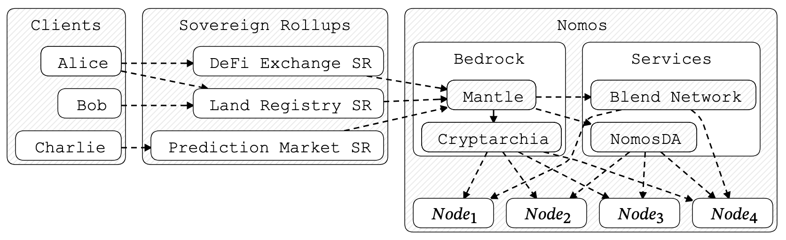
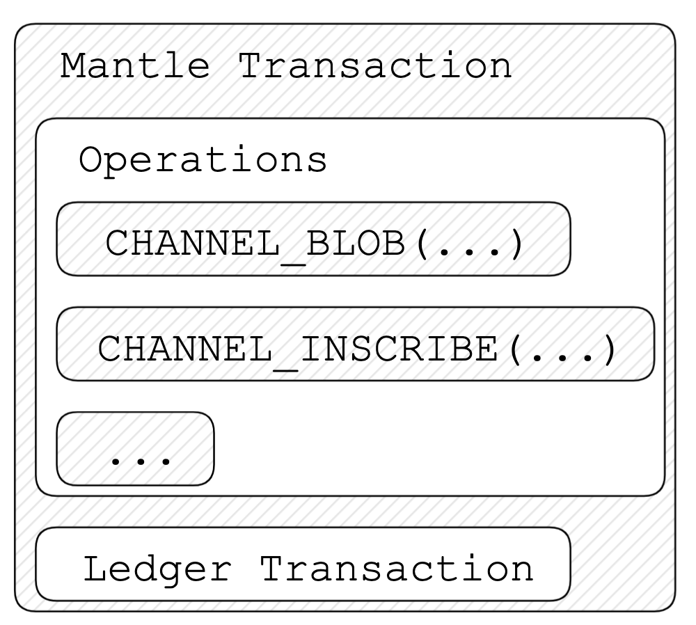
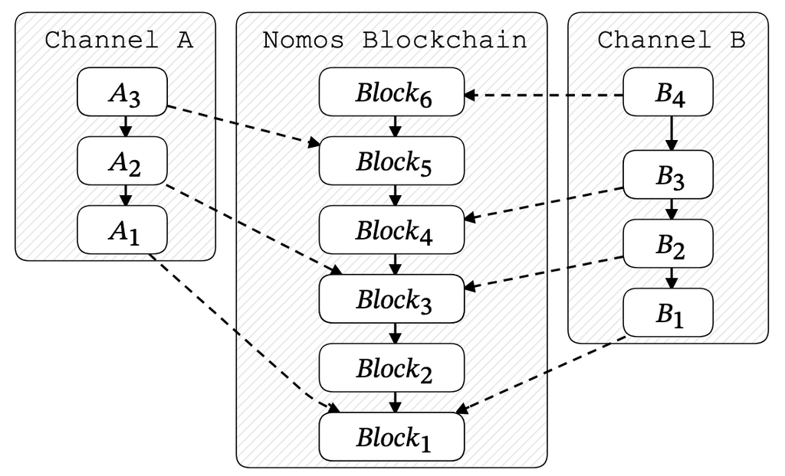
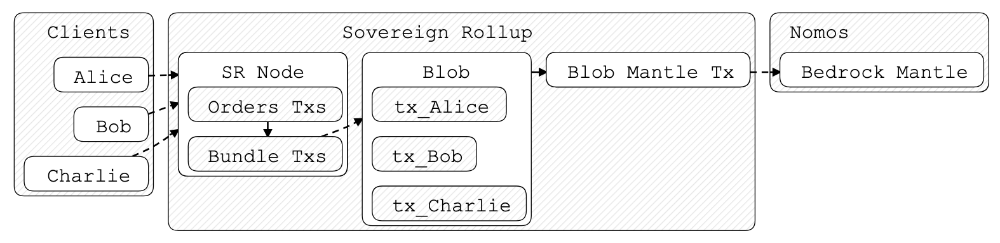

# V1.0.0-BEDROCK-ARCHITECTURE-OVERVIEW

| Field | Value |
| --- | --- |
| Name | [Overview] Bedrock Architecture |
| Slug | 210 |
| Status | deprecated |
| Type | RFC |
| Category | Informational |
| Editor | David Rusu <davidrusu@logos.co> |
| Contributors | Filip Dimitrijevic <filip@logos.co> |

<!-- timeline:start -->

## Timeline

- **2026-05-27** — [`b7602ed`](https://github.com/logos-co/logos-lips/blob/b7602ed8a225d41ca0bfaaa432524dc84d2ded7e/docs/blockchain/deprecated/v1.0.0-bedrock-architecture-overview.md) — chore: move blockchain specs from notion to github

<!-- timeline:end -->

Owners: @David Rusu

Reviewers: @lvaro Castro-Castilla @Daniel Kashepava

# Revision History

| Version | Changes | Date |
| --- | --- | --- |
| 1.0.0 | Initial revision. | 2025-08-22 |

# Introduction

Bedrock enables high-performance Sovereign Rollups to leverage the security guarantees of Logos Blockchain. Sovereign Rollups build on Logos Blockchain through Bedrock Mantle, Bedrocks minimal execution layer which in turn runs on Cryptarchia, the Logos Blockchain consensus protocol. Taken together, Bedrock provides a private, highly scalable and resilient substrate for high-performance decentralized applications.

# Overview

Bedrock is composed of Cryptarchia and Bedrock Mantle. Bedrock is in turn supported by the Bedrock Services: Blend Network and DA Network. Together they provide an interface for building high performance Sovereign Rollups that leverage the security and resilience of Logos Blockchain.



## Bedrock Mantle

Mantle forms the minimal execution layer of Logos Blockchain. Mantle Transactions consist of a sequence of Operations together with a Ledger Transaction used for paying fees and transferring funds.

Sovereign Rollups make use of Mantle Transactions when posting their updates to Logos Blockchain. This is done through the use of Mantle Channels and Channel Operations.



### Mantle Channels

Mantle Channels are lightweight virtual chains overlaid on top of the Logos Blockchain. Sovereign Rollups are built on top of these channels, allowing them to outsource the hard parts of running a decentralized service to Logos Blockchain, namely ordering and replicating state updates.

Channels are permissioned, ordered logs of messages. These messages are signed by the Channel owner and come in two types: Inscriptions or Blobs. Inscriptions store the message data permanently in-ledger, while Blobs store only a commitment to the message data permanently. The actual message data is stored temporarily in DA Network, just long enough for interested parties to fetch a copy for themselves.



> <sub>Channels A and B form virtual chains on top of the Logos Blockchain. Channel messages are included in blocks on the Logos Blockchain in such a way that they respect the ordering of channel messages e.g. $`B_4`$ must come after $`B_3`$ in the Logos Blockchain.</sub>

### A Note on Transient Blobs

The fact that Blobs are stored only temporarily in DA Network allows Logos Blockchain to provide cheap, temporary storage for Sovereign Rollups without incurring long-term scalability concerns. The network can serve a large amount of data without the risk of bloating with obsolete data after years of operations.

At the same time, the transient nature of Blobs shifts the burden of long-term replication from the Logos Blockchain network to the parties interested in that Blob data - that is, the Sovereign Rollup operators, their clients, and other interested parties (archival nodes, block explorers, etc.). So long as at least one party holds a copy of a Blob and is willing to provide it to the network, the SR can continue to be verified by checking provided Blobs against their corresponding on-chain Blob commitments, which are stored permanently on the Logos Blockchain.

## Cryptarchia

Bedrock Mantle is powered by [Cryptarchia](../raw/cryptarchia-v1-protocol.md), a highly scalable, permisionless consensus protocol optimized for privacy and resilience. Cryptarchia is a Private Proof of Stake (PPoS) consensus protocol with properties very similar to Bitcoin. Just like in Bitcoin, where a miners hashing power is not revealed when they win a block, we ensure privacy for block proposers by breaking the link between a proposal and its proposer. Unlike Bitcoin, Logos Blockchain extends block proposer confidentiality to the network layer by routing proposals through the Blend Network, making network analysis attacks prohibitively expensive.

## Sovereign Rollups

Sovereign Rollups bridge the gap between traditional server-based applications and decentralized, permissionless applications.

Sovereign Rollups alleviate the contention caused by decentralized applications competing for the limited resources of a single threaded VM (e.g. EVM in Ethereum) while still remaining auditable and fault tolerant. This is achieved through shifting transaction ordering and execution off of the main chain into SR nodes, with SR nodes posting only a state diff or batch of transactions to Logos Blockchain as an opaque data Blob.



```text
Typical end-to-end flow for clients interacting with a Sovereign Rollup, which in turn interacts with Bedrock. Clients send transactions to Sovereign Rollups who order and bundle them into Blobs, which are stored on Logos Blockchain. Clients can get finality guarantees by observing the Logos Blockchain and watching for the inclusion of their transactions.
```

Sovereign Rollups form a virtual chain overlaid on top of the Logos Blockchain. This architecture allows application developers to easily spin up high performance applications while taking advantage of the security of Logos Blockchain to distribute the application state widely for auditing and resilience purposes.
