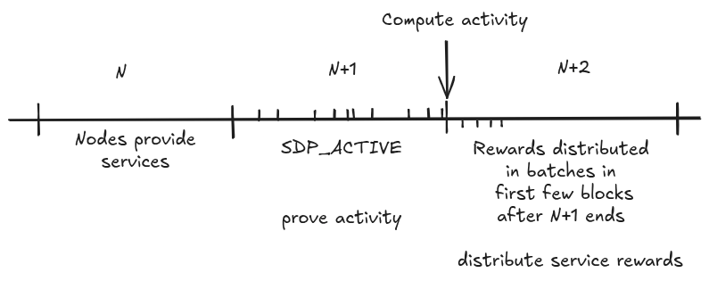

# V1.0.0-BEDROCK-SERVICE-REWARD-DISTRIBUTION

| Field | Value |
| --- | --- |
| Name | Service Reward Distribution Protocol |
| Slug | 213 |
| Status | deprecated |
| Type | RFC |
| Category | Standards Track |
| Editor | Thomas Lavaur <thomaslavaur@logos.co> |
| Contributors | Filip Dimitrijevic <filip@logos.co> |

<!-- timeline:start -->

## Timeline

- **2026-05-27** — [`b7602ed`](https://github.com/logos-co/logos-lips/blob/b7602ed8a225d41ca0bfaaa432524dc84d2ded7e/docs/blockchain/deprecated/v1.0.0-bedrock-service-reward-distribution.md) — chore: move blockchain specs from notion to github

<!-- timeline:end -->

Owner: @Thomas Lavaur

Reviewers: @David Rusu @Mehmet @lvaro Castro-Castilla @Marcin Pawlowski @Frederico Teixeira

# Revision History

| Version | Changes | Date |
| --- | --- | --- |
| 1.0.0 | Initial revision. | 2025-11-03 |

# Introduction

Logos Blockchain relies on multiple services, including the Data Availability and Blend Network - each operated by independent validator sets. For sustainability and fairness, these services must compensate service validators based on their participation. Validators first declare their participation through [Service Declaration Protocol](../raw/bedrock-service-declaration-protocol.md). The Service Reward Distribution Protocol enables deterministic, efficient, and verifiable reward distribution to validators based on their activity within each service.

Each service defines a session, a fixed number of blocks during which its validator set remains unchanged. For every session, the service specifies:

- A validator activity rule that distinguishes between active and inactive validators.
- A reward formula for distributing the sessions rewards at the end of the session.

This document describes the protocol's logic for deterministically distributing rewards through Mantle Transactions for services.

# Overview

The protocol unfolds over three key phases, aligned with validator sessions:

1. Service Activity Tracking (Session N+1): Service validators submit signed activity messages to attest to their participation of session N through a Mantle Transaction, including an activity message (see [Mantle - SDP_ACTIVE](v1.0.0-mantle.md#sdp_active)).
1. Service Reward Derivation (End of Session N+1): Nodes compute each validators reward based on validated activity messages and the different service reward policies.
1. Service Reward Distribution (Post-Session N+1): Rewards are distributed to validators marked as active for the service over several blocks. This is done through a single Mantle Transaction per block, potentially distributing for all services if the sessions coincide.



Core Properties:

- Service rewards are distributed to the zk_id from validator [SDP declarations](../raw/bedrock-service-declaration-protocol.md).
- Deterministic Validator Reward Schedule: A verifiable pseudo-random process ensures fair order of distribution and prevents manipulation.
- Minimal Block Overhead: Each block accommodates 1 reward transaction.
- Transparent Transfers: Service rewards are distributed using standard Mantle Transactions (but with a negative balance).

# Protocol

## Sessions

Each service defines its own session length (e.g., 10000 blocks), during which:

- The service validator set remains static.
- Activity criteria and reward policy are fixed.

## Activity tracking

Throughout session N+1, the block proposers integrate Mantle Transactions containing [SDP_ACTIVE Operations](v1.0.0-mantle.md). These transactions originate from service validators and are used to [derive their activity according to the service provided policy](../raw/bedrock-service-declaration-protocol.md). The protocol does not prescribe a unique activity rule: each service defines what qualifies as valid participation, enabling flexibility across different services.

Each node maintains the activity state of service validators for the sessions. These activity records can be discarded after the reward distribution process ends. The distribution process is considered complete when:

- All active validators entitled to rewards for this session have received them.
- The last distributed reward is in a finalized block, ensuring rewards can always be computed in case of forks.

```python
class ServiceActivities:
    service: ServiceType
    session: int
    activities: dict[DeclarationId, float] # activity of each validator
    funds: int # rewards for this service during the session
```

Service validators are economically incentivized to participate actively since only active validators will be rewarded. Moreover, by decoupling activity submission from reward calculation, the system remains robust to network latency.

This generalized mechanism accommodates a wide range of services without requiring specialized infrastructure. It enables services to evolve their own activity rules independently while preserving a shared framework for reward distribution.

## Service Reward Calculation

At the end of session N+1, service rewards for the validator n for the session N are computed by the different services taking as input the rewards of the session:

$$
Rewards^n := serviceReward(n,Rewards\_Session)
$$

Where $Rewards\_Session$ are the total rewards of session N. The $Rewards\_Session$ is determined by the service, which calculates how much each service receives based on fees burnt during session N and the blockchain's state. $Rewards^n$ is stored as an array that maps each validator's zk_id to their allocated reward.

## Service Reward Distribution

Starting immediately after session N+1, service rewards are distributed gradually. Each block includes one Mantle Transaction distributing the rewards of every service up to 4 validators per service. The Mantle Transaction only contains one Ledger Transaction without Operations, creating new notes with their value representing the correct amount of rewards. The Ledger Transaction of this Mantle Transaction should be executed without checking that the transaction is balanced, other validations are checked, e.g. output note values are positive and smaller than the maximum allowed value.

- The reward transaction must be the first Mantle Transaction included by the leader in the block. This enables nodes to verify service rewards distribution easily.
- The validators receiving the rewards must be chosen deterministically and uniformly randomly according to [Deterministic Validator Reward Schedule](v1.0.0-bedrock-service-reward-distribution.md#deterministic-validator-reward-schedule) among the validators marked as active by the related service (with a pending reward greater than 0).
- The reward transaction must:
    - Transfer the correct reward amount according to [Service Reward Calculation](v1.0.0-bedrock-service-reward-distribution.md#service-reward-calculation).
    - Be sent to the public key zk_id of the validator registered during [declaration of the service](../raw/bedrock-service-declaration-protocol.md).

To ensure that all active validators of a service can be rewarded within a single session, a maximum threshold is imposed on the number of validators per service. For example, if a session lasts only 10,000 blocks, the number of active validators must not exceed 40,000 per service. This constraint guarantees that no reward distribution needs to span multiple sessions. Consequently, the number of reward transactions per block remains capped at one reward transaction distributing the funds for all Logos Blockchain services.

# Details

## Deterministic Validator Reward Schedule

The validator reward schedule is derived deterministically. The validator set of the session being rewarded is ordered by the declaration IDs. The selection takes as input the service being rewarded, the remaining number of validators to be rewarded and Cryptarchia randomness of the epoch taken at the start of the session.

```python
def select_validators_to_rewards(service, session, cryptarchia_epoch_nonce, remaining_validators):
    """
    service: ServiceType # the service that is being rewarded
    session: int # the session that is being rewarded
    cryptarchia_epoch_nonce: bytes #  the epoch nonce at the start of the session
    """
    rewarded_this_block = []
    for i in range(4):
        n = len(remaining_validators)
        validator_idx =
        hash(b"SERVICE_REWARD_V1", service, session, cryptarchia_epoch_nonce, n) % n
        rewarded_this_block += remaining_validators[validator_idx]
        del remaining_validators[validator_idx]
    return rewarded_this_block
```

This approach ensures fairness and prevents favoritism.

$$
Giacomo Pasini10/21/2025this is in contradiction with DA Rewarding - Calculate the reward for the node $n$ based on the node acti since the reward at the end of a session is not simply a function of this session rewards
$$

- nit: this is now a special field in the block structure
