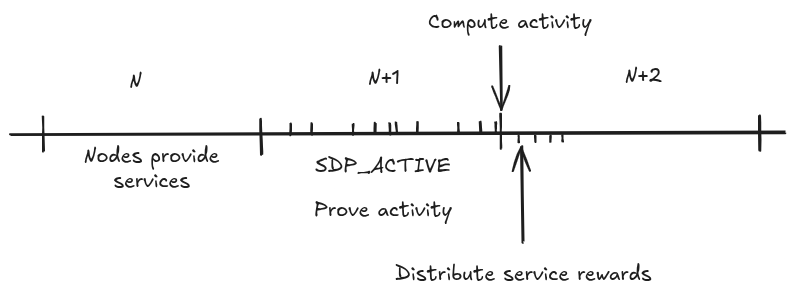

# V1.1.0-BEDROCK-SERVICE-REWARD-DISTRIBUTION

| Field | Value |
| --- | --- |
| Name | Service Reward Distribution Protocol |
| Slug | 223 |
| Status | deprecated |
| Type | RFC |
| Category | Standards Track |
| Editor | Thomas Lavaur <thomaslavaur@logos.co> |
| Contributors | Filip Dimitrijevic <filip@logos.co> |

<!-- timeline:start -->

## Timeline

- **2026-05-27** — [`b7602ed`](https://github.com/logos-co/logos-lips/blob/b7602ed8a225d41ca0bfaaa432524dc84d2ded7e/docs/blockchain/deprecated/v1.1.0-bedrock-service-reward-distribution.md) — chore: move blockchain specs from notion to github

<!-- timeline:end -->

# Revision History

| Version | Changes | Date |
| --- | --- | --- |
| 1.0.0 | Initial revision. | 2025-11-03 |
| 1.1.0 | Removed references to DA Replaced references to Nomos with Logos Blockchain | 2026-04-17 |

# Introduction

The Logos Blockchain relies on multiple services, including the Blend Network - each operated by independent validator sets. For sustainability and fairness, these services must compensate service validators based on their participation. Validators first declare their participation through [Service Declaration Protocol](../raw/bedrock-service-declaration-protocol.md). The Service Reward Distribution Protocol enables deterministic, efficient, and verifiable reward distribution to validators based on their activity within each service.

Each service defines:

- The session length, a fixed number of blocks during which its validator set remains unchanged.
- The validator activity rule that distinguishes between active and inactive validators.
- The reward formula for distributing the sessions rewards at the end of the session.

This document describes the protocol's logic for deterministically distributing rewards through Mantle Transactions for services.

# Overview

The protocol unfolds over three key phases, aligned with validator sessions:

1. Service Activity Tracking (Session N+1): Service validators submit signed activity messages to attest to their participation of session N through a Mantle Transaction, including an activity message (see [Mantle - SDP_ACTIVE](v1.3.0-mantle.md#sdp_active)).
1. Service Reward Derivation (End of Session N+1): Nodes compute each validators reward based on validated activity messages and the different service reward policies.
1. Service Reward Distribution (First block of session N+2): Rewards are distributed to validators marked as active for the service. This is done by inserting new notes in the ledger corresponding to the reward amount for each active validator.

Core Properties:

- Service rewards are distributed to the zk_id from validator [Service Declaration Protocol - Declaration Message](../raw/bedrock-service-declaration-protocol.md#declaration-message)s.
- Minimal Block Overhead: rewards are directly added to the ledger without involving Mantle Transactions.

# Protocol

## Sessions

Each service defines its own session length (e.g., 10000 blocks), during which:

- The service validator set remains static.
- Activity criteria and reward policy are fixed.

## Activity tracking

Throughout session N+1, the block proposers integrate Mantle Transactions containing [Mantle - SDP_ACTIVE](v1.3.0-mantle.md#sdp_active) Operations. These transactions originate from service validators and are used to derive their activity according to the service provided policy (see [Service Declaration Protocol - Active](../raw/bedrock-service-declaration-protocol.md#active)). The protocol does not prescribe a unique activity rule: each service defines what qualifies as valid participation, enabling flexibility across different services.

Service validators are economically incentivized to participate actively since only active validators will be rewarded. Moreover, by decoupling activity submission from reward calculation, the system remains robust to network latency.

This generalized mechanism accommodates a wide range of services without requiring specialized infrastructure. It enables services to evolve their own activity rules independently while preserving a shared framework for reward distribution.

## Service Reward Calculation

At the end of session N+1, service rewards for the validator n for the session N are computed by the different services taking as input the rewards of the session:

$$
Rewards^n := serviceReward(n,Rewards\_Session)
$$

Where $Rewards\_Session$ are the total rewards of session N. The $Rewards\_Session$ is determined by the service, which calculates how much each service receives based on fees burnt during session N and the blockchain's state. $Rewards^n$ is stored as an array that maps each validator's zk_id to their allocated reward.

## Service Reward Distribution

Starting immediately after session N+1, service rewards are distributed in the first block of session N+2. The rewards are inserted directly in the ledger without triggering any Mantle validation. The note Id is computed using the result of zkhash(FiniteField(ServiceType, byte_order="little", modulus= p) || session_number) as the transaction hash. The output number corresponds to the position of the zk_id when sorted in ascending order.

The reward must:

- Transfer the correct reward amount according to [Service Reward Calculation](v1.1.0-bedrock-service-reward-distribution.md#service-reward-calculation).2
- Be sent to the public key zk_id of the validator registered during declaration of the service (see [Service Declaration Protocol - Declaration Message](../raw/bedrock-service-declaration-protocol.md#declaration-message)).
- Be distributed into a single note if several rewards share the same zk_id.
- Be executed identically by every node processing the first block of session N+2. This happens by inserting notes in the ledger in ascending order of zk_id.
Nodes indirectly verify the correct inclusion of rewards because all consensus-validating nodes must maintain the same ledger view to derive the latest ledger root, which serves as input for verifying the [Proof of Leadership](../raw/cryptarchia-proof-of-leadership.md).
