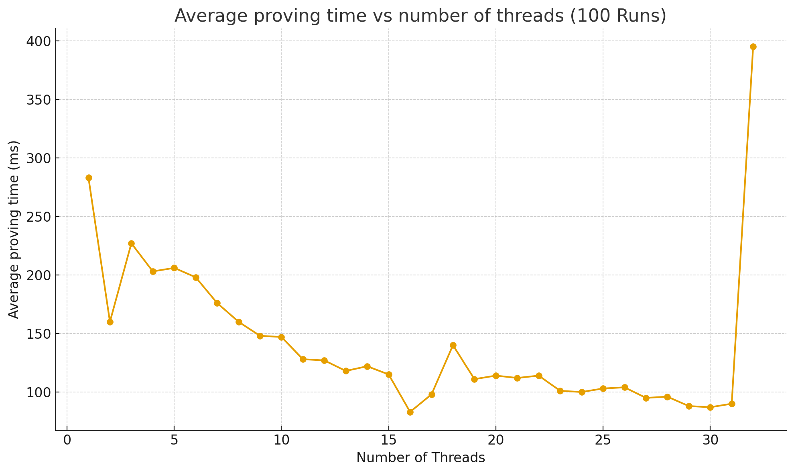
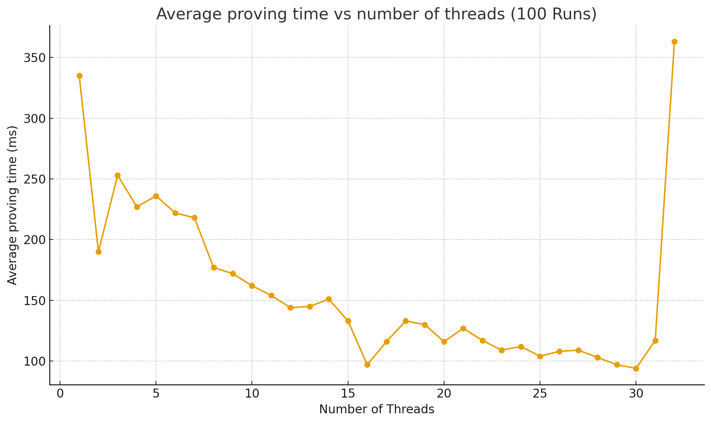

# V1.1.0-MANTLE

| Field | Value |
| --- | --- |
| Name | [1.1.0] Mantle |
| Slug | 225 |
| Status | deprecated |
| Type | RFC |
| Category | Standards Track |
| Editor | Thomas Lavaur <thomaslavaur@logos.co> |
| Contributors | Filip Dimitrijevic <filip@logos.co> |

<!-- timeline:start -->

## Timeline

- **2026-05-27** — [`b7602ed`](https://github.com/logos-co/logos-lips/blob/b7602ed8a225d41ca0bfaaa432524dc84d2ded7e/docs/blockchain/deprecated/v1.1.0-mantle.md) — chore: move blockchain specs from notion to github

<!-- timeline:end -->

Owner: @Thomas Lavaur @David Rusu

Reviewers: @Giacomo Pasini @Mehmet @lvaro Castro-Castilla @Marcin Pawlowski @Daniel Sanchez Quiros @Gusto Bacvinka @Youngjoon Lee

# Revision History

| Version | Changes | Date |
| --- | --- | --- |
| 1.0.0 | Initial revision. | 2025-11-17 |
| 1.1.0 | ? | 2026-02-06 |

# Introduction

Mantle is a foundational element of Bedrock, designed to provide a minimal and efficient execution layer that connects together Logos Blockchain Services in order to provide the necessary functionality for Sovereign Rollups. It can be viewed as the system call interface of Bedrock, exposing a safe and constrained set of Operations to interact with lower-level Bedrock services, similar to syscalls in an operating system.

Mantle Transactions provide Operations for interacting with Logos Blockchain Services. For example, a Sovereign Rollup node posting an update to Bedrock, or a node operator declaring its participation in the Blend Network, would be done through the corresponding Operations within a Mantle Transaction.

Mantle manages assets using a Note-based ledger that follows an UTXO model. Each Mantle Transaction includes a Ledger Transaction, and any excess balance serves as the fee payment.

# Overview

## Mantle Transaction

The features of Logos Blockchain are exposed through Mantle Transactions. Each transaction can contain zero or more Operations and one Ledger Transaction. Mantle Transactions enable users to execute multiple Operations atomically. The Ledger Transaction serves two purposes: it can pays the transaction fee and allows users to issue transfers.

## Mantle Operations

Logos Blockchain features are exposed through Mantle Operations, which can be combined and executed together in a single Mantle Transaction. These Operations enable functions such as on-chain data posting, SDP interaction, and leader reward claims.

## Mantle Ledger

The Mantle Ledger enables asset transfers using a transparent UTXO model. While a Ledger Transactions can consume more NMO than it creates, the Mantle Transaction excess balance must exactly pay for the fees.

## Transaction Fees

Mantle Transaction fees are derived from a gas model. Logos Blockchain has three different Gas markets, accounting for permanent data storage, ephemeral data storage through DA, and execution costs. Permanent data storage is paid at the Mantle Transaction level, while ephemeral data storage is paid at the Blob Operation level. Each Operation and Ledger Transaction has an associated Execution Gas cost. Users can specify their Gas prices in their Mantle Transactions or in the Blob Operation to incentivize the network to include their transaction.

| Gas Market | Charged On | Pricing Basis |
| --- | --- | --- |
| Execution Gas | Ledger Transaction and Operations | Fixed per Operation |
| Permanent Storage Gas | Signed Mantle Transaction | Proportional to encoded size |
| DA Storage Gas | Blob Operation | Proportional to blob size |

# Mantle Transaction

Mantle Transactions form the core of Mantle, enabling users to combine multiple Operations to access different Logos Blockchain functions. Each transaction contains zero or more Operations plus a Ledger Transaction. The system executes all Operations atomically, while using the Mantle Transaction's excess balancecalculated as the difference between consumed and created value as the fee payment.

```python
class MantleTx:
      ops: list[Op]
      ledger_tx: LedgerTx                   # excess balance is used for fee payment
      permanent_storage_gas_price: int # 8 bytes
      execution_gas_price: int # 8 bytes
class Op:
      opcode: byte
      payload: bytes
def mantle_txhash(tx: MantleTx) -> ZkHash:
    tx_bytes = encode(tx)

    h = Hasher()
    h.update(FiniteField(b"LOGOS_MANTLE_TXHASH_V1", byte_order="little", modulus=p))
for i in range((len(tx_bytes)+30)//31):
        chunk = tx_bytes[i*31:(i+1)*31]
        fr = FiniteField(chunk, byte_order="little", modulus=p)
        h.update(fr)
return h.digest()
```

The [hash function used](../raw/common-cryptographic-components.md), as well as other cryptographic primitives like ZK proofs and signature schemes, are described in [\[1.0.2\] Common Cryptographic Components](../raw/common-cryptographic-components.md).

A Mantle Transaction must include all relevant signatures and proofs for each Operation, as well as for the Ledger Transaction.

```python
class SignedMantleTx:
  tx: MantleTx
  op_proofs: list[OpProof | None] # each Op has at most 1 associated proof
  ledger_tx_proof: ZkSignature # ZK proof of ownership of the spent notes
```

Each proof (op proof and signature) must be cryptographically bound to the MantleTx through the mantle_txhash to prevent replay attacks. This binding is achieved by including the MantleTx hash as a public input in every ZK proof.

The transaction fee is a sum of two components: the multiplication of the total Execution Gas by the execution_gas_price, and the total size of the encoded signed Mantle Transaction multiplied by the permanent_storage_gas_price. If the Mantle Transaction contains a Blob Operations, the fee also accounts for ephemeral data storage. In this case, the blob_size of each blob is multiplied by the DA_storage_gas_price stored in the Blob Operation and added to the previous amounts to determine the final fee.

```python
def gas_fees(signed_tx: SignedMantleTx) -> int:
    mantle_tx = signed_tx.tx
        permanent_storage_fees = len(encode(signed_mantle_tx)) * mantle_tx.permanent_storage_gas_price
        execution_fees = execution_gas(mantle_tx.ledger_tx)
* mantle_tx.execution_gas_price
        da_storage_fees = 0
for op in mantle_tx.ops:
if op.opcode == CHANNEL_BLOB:
                    blob = decode_blob(op.payload)
                        da_storage_fees += blob.da_storage_gas_price * blob.blob_size
                
                # Compute the execution gas of this operation as defined
# in the gas cost determination specification.
                execution_fees += execution_gas(op) * mantle_tx.execution_gas_price

        return execution_fees + da_storage_fees + permanent_storage_fees
```

## Validation

Given

```python
signed_tx = SignedMantleTx(
    tx=MantleTx(ops, permanent_storage_gas_price, execution_gas_price, ledger_tx),
    op_proofs,
    ledger_tx_proof
)
```

Mantle validators will ensure the following:

1. The ledger transaction is valid according to [Ledger Validation](v1.1.0-mantle.md#ledger-validation).
    ```text
    validate_ledger_tx(ledger_tx, ledger_tx_proof, mantle_txhash(tx))
    ```
1. We have a proof or a None value for each operation.
    ```python
    assert len(op_proofs) == len(ops)
    ```
1. Each Operation is valid.
    ```python
    for op, op_proof in zip(ops, op_proofs):
    assert op.opcode in MANTLE_OPCODES
        validate_mantle_op(mantle_txhash(tx), op.opcode, op.payload, op_proof)
    def validate_mantle_op(txhash, opcode, payload, op_proof):
    if opcode == INSCRIBE:
            validate_inscribe(txhash, payload, op_proof)
     # elif opcode == ...
    #    ...
    ```
1. The Mantle Transaction excess balance pays for the transaction fees.
    ```python
    tx_fee = get_fees(signed_tx)
    assert tx_fee == get_transaction_balance(signed_tx)
    def get_transaction_balance(signed_tx):
            balance = 0
    for op in signed_tx.tx.ops:
    if op.opcode == LEADER_CLAIM:
                            balance += get_leader_reward()
    for inp in signed_tx.tx.ledger_tx.inputs:
                    balance += get_value_from_note_id(inp)
    for out in signed_tx.tx.ledger_tx.outputs:
                    balance -= out.value
    ```

## Execution

Given

```python
SignedMantleTx(
    tx=MantleTx(ops, permanent_storage_gas_price, execution_gas_price, ledger_tx),
    op_proofs,
    ledger_tx_proof
)
```

Mantle Validators execute the following:

1. Execute the Ledger Transaction as described in [Ledger Execution](v1.1.0-mantle.md#ledger-execution).
1. Execute sequentially each Operation in ops according to its opcode.

# Operations

## Opcodes

| Operation | Opcode | Description |
| --- | --- | --- |
| CHANNEL_INSCRIBE | 0x00 | Write a message permanently onto Mantle. |
| CHANNEL_BLOB | 0x01 | Store a blob in DA. |
| CHANNEL_SET_KEYS | 0x02 | Manage the list of keys accredited to post to a channel. |
| RESERVED | 0x03 - 0x1F |  |
| SDP_DECLARE | 0x20 | Declare intention to participate as a node in a Logos Blockchain Service, locking funds as collateral. |
| SDP_WITHDRAW | 0x21 | Withdraw participation from a Logos Blockchain Service, unlocking your funds in the process. |
| SDP_ACTIVE | 0x22 | Signal that you are still an active participant of a Logos Blockchain Service. |
| RESERVED | 0x23 - 0x2F |  |
| LEADER_CLAIM | 0x30 | Claim leader reward anonymously. |
| RESERVED | 0x31 - 0xFF |  |

Full nodes will track and process every Operation. In contrast, nodes focused on a specific rollup will also track all Operations but will only fully process blobs that target their own rollup referenced by a channel ID.

## Channel Operations

Channels allow Rollups to post their updates on chain. Channels form virtual chains that overlay on top of the Cryptarchia blockchain. Clients and dependents of Rollups can watch the Rollups channels to learn the state of that Rollup.

### Channel Sequencing

These channels form virtual chains by having each message reference its parent message. The order of messages in these channels is enforced by the sequencer by building a hash chain of messages, i.e. new messages reference the previous messages through a parent hash. Given that Cryptarchia has long finality times, these message parent references allow the Rollup sequencers to continue to post new updates to channels without having to wait for finality. No matter how Cryptarchia forks and reorgs, the channel messages will eventually be re-included in a way that satisfies the virtual chain order.

The first time a message is sent to an unclaimed channel, the message signing key that signs the initial message becomes both the administrator and an accredited key. The administrator can update the list of accredited keys who are authorized to write messages to that channel.

Validators must keep the following state for processing channel Operations:

```python
channels: dict[ChannelId, ChannelState]
class ChannelState:
    tip: hash
    accredited_keys: list[Ed25519PublicKey]
```

### CHANNEL_INSCRIBE

Write a message to a channel with the message data being permanently stored on the Logos Blockchain.

Payload

```python
class Inscribe:
    channel: ChannelID       # Channel being written to
        inscription: bytes # Message to be written on the blockchain
        parent: hash # Previous message in the channel
        signer: Ed25519PublicKey # Identity of message sender
```

Proof

```text
Ed25519Signature
```

Execution Gas

Channel Inscribe Operations have a fixed Execution Gas cost of EXECUTION_CHANNEL_INSCRIBE_GAS. See [\[1.0.0\] \[Analysis\] Gas Cost Determination](v1.0.0-analysis-gas-cost-determination.md) for the Execution Gas values.

Validation

Given

```python
txhash: zkhash
msg: Inscribe
sig: Ed25519Signature

channels: dict[ChannelID, ChannelState]
```

Validate

```python
# Ensure the msg signer signature
assert Ed25519_verify(msg.signer, txhash, sig)
if msg.channel in channels:
    chan = channels[msg.channel]
# Ensure signer is authorized to write to the channel
assert msg.signer is in chan.accredited_keys

    # Ensure message is continuing the channel sequence
assert msg.parent == chan.tip
else:
# Channel will be created automatically upon execution
# Ensure that this message is the genesis message (parent==ZERO)
assert msg.parent == ZERO
```

Execution

Given

```python
msg: Inscribe
sig: Ed25519Signature

channels: dict[ChannelId, ChannelState]
```

Execute

1. If the channel does not exist, create it just-in-time.
    ```python
    if msg.channel is not in channels
        channels[msg.channel] = ChannelState(
            tip=ZERO
            accredited_keys=[msg.signer]
    )
    ```
1. Update the channel tip.
    ```python
    chan = channels[msg.channel]
    chan.tip = hash(encode(msg))
    ```
Example

```python
# Build the inscription
greeting = Inscription(
    channel=CHANNEL_EARTH,
    inscription=b"Live long and prosper",
    parent=ZERO
    signer=spock_pk
)
# Wrap it in a transaction
tx = MantleTx(
    ops=[Op(opcode=INSCRIBE, payload=encode(greeting))],
 permanent_storage_gas_price=150,
    execution_gas_price=70,
    ledger_tx=LedgerTx(inputs=[<spocks_note_id>], outputs=[<change_note>]),
)
# Sign the transaction
signed_tx = SignedMantleTx(
    tx=tx,
    op_proofs=[Ed25519_sign(mantle_txhash(tx), spock_sk)]
    ledger_tx_proof=tx.ledger_tx.prove(spock_sk)
)
# Send the transaction to the mempool
mempool.push(signed_tx)
```

### CHANNEL_BLOB

Write a message to a channel where the message data is stored temporarily in DA Network. Data stored in DA Network will eventually expire but its commitment (BlobID) remains permanently on chain. Anyone with access to the original data can confirm that it matches this commitment.

Payload

```python
class Blob:
    channel: ChannelID             # Channel we are writing this message to
    session: SessionNumber         # Session during which dispersal happened
    blob: BlobID                   # Blob commitment
    blob_size: int # Size of blob before encoding in bytes
 da_storage_gas_price: int # 8 bytes
    parent: hash # Previous message written to the channel
    signer: Ed25519PublicKey       # Identity of the message sender
```

Proof

```text
Ed25519Signature
```

Execution Gas

The Execution Gas consumed by a Blob Operation is proportional to the size of the sample verified by the nodes. The bigger the sample, the harder it is to verify it. The size of this sample is:

```python
NUMBER_OF_DA_COLUMNS = 1024 # before RS encoding
ELEMENT_SIZE = 31 # in bytes
SAMPLE_SIZE = blob_size/(NUMBER_OF_DA_COLUMNS * ELEMENT_SIZE)
```

Channel Blob Operations have an Execution Gas cost proportional to the blob size:

```text
EXECUTION_CHANNEL_BLOB_BASE_GAS
        + EXECUTION_CHANNEL_BLOB_SIZED_GAS * SAMPLE_SIZE
```

See [\[1.0.0\] \[Analysis\] Gas Cost Determination](v1.0.0-analysis-gas-cost-determination.md) for the Execution Gas values.

DA Storage Gas

Channel Blob Operations have a DA Storage Gas consumption proportional to Blob size:

```text
CHANNEL_BLOB_DA_STORAGE_GAS = blob_size * da_storage_gas_price
```

Validation

Validators will perform DA sampling to ensure availability. From these samples, we can determine the Blob size and check that it matches what is written in the Blob payload.

Given

```python
txhash: zkhash
msg: Blob
sig: Ed25519Signature
block_slot: int

channels: dict[ChannelID, ChannelState]
```

Validate

```python
# Verify the msg signature
assert Ed25519_verify(msg.signer, txhash, sig)
if msg.channel in channels:
    chan = channels[msg.channel]
# Ensure signer is authorized to write to the channel
assert msg.signer is in chan.accredited_keys

    # Ensure message is continuing the channel sequence
assert msg.parent == chan.tip
else:
# Channel will be created automatically upon execution
# Ensure that this message is the Genesis message
assert msg.parent == ZERO

if DA Network.should_validate_block_availability(block_slot):
# Validate Blobs that are still held in DA
assert DA Network.validate_availability(msg.session, msg.blob)
# Derive Blob size from DA sample
    actual_blob_size = DA Network.derive_blob_size(msg.blob)
assert msg.blob_size == actual_blob_size
```

Execution

Given

```python
msg: Blob
sig: Ed25519Signature
channels: dict[ChannelId, ChannelState]
```

Execute

```python
# If the channel does not exist, create it JIT
if msg.channel is not in channels
    channels[msg.channel] = ChannelState(
        tip=ZERO
        accredited_keys=[msg.signer]
)

chan = channels[msg.channel]
chan.tip = hash(encode(msg))
```

Example

Suppose a sequencer for Rollup A wants to post a Rollup update. They would first build the Blob payload:

```python
# Given a rollup update and the previous txhash
rollup_update: bytes = encode([tx1, tx2, tx3])
last_channel_msg_hash: hash
# The sequencer encodes the rollup update and builds the blob payload
blob_id, blob_size = DA Network.upload_blob(rollup_update)

msg = Blob(
  channel=ROLLUP_A,
  current_session=current_session,
  blob=blob_id,
  blob_size=blob_size,
  da_storage_gas_price=10,
  parent=last_channel_msg_hash,
  signer=sequencer_pk,
)

tx = MantleTx(
    ops=[Op(opcode=BLOB, payload=encode(msg))],
    permanent_storage_gas_price=150,
    execution_gas_price=70,
    ledger_tx=LedgerTx(inputs=[sequencer_funds], outputs=[<change_note>])
)

signed_tx = SignedMantleTx(
    tx=tx,
        op_proofs=[sequencer_sk.sign(mantle_txhash(tx))]
    ledger_tx_proof=[tx.ledger_tx.prove(sequencer_sk)]
)
```

The Signed Mantle Transaction is then sent to DA nodes for dispersal and added to the mempool for inclusion in a block (see [DA Network Dispersal](da-network.md#dispersal) ).

### CHANNEL_SET_KEYS

Overwrite the list of accredited keys to post Blobs to a channel

Payload

```python
class ChannelSetKeys:
    channel: ChannelID
    keys: list[Ed25519PublicKey]
```

Proof

```text
Ed25519Signature # signature from `administrator` over the Mantle tx hash.
```

Execution Gas

Channel Set Keys Operations have a fixed Execution Gas cost of EXECUTION_CHANNEL_SET_KEYS. See [\[1.0.0\] \[Analysis\] Gas Cost Determination](v1.0.0-analysis-gas-cost-determination.md) for the Execution Gas values.

Validation

Given

```python
txhash: zkhash
setkeys: ChannelSetKeys
sig: Ed25519Signature

channels: dict[ChannelID, ChannelState] 
```

Validate

```python
# Ensure at least one key
assert len(setkeys.keys) > 0
if setkeys.channel in channels:
    chan = channels[setkeys.channel]
    admin_pk = chan.accredited_keys[0]
assert Ed25519_verify(txhash, admin_pk, sig)
```

Execution

Given

```python
setkeys: ChannelSetKeys

channels: dict[ChannelID, ChannelState] 
```

Execute

```python
# Create the channel if it does not exist
if setkeys.channel not in channels:
    channels[setkeys.channel] = ChannelState(
        tip=CHANNEL_GENESIS,
        accredited_keys=[],
)
# Update the set of accredited keys
channels[setkeys.channel].accredited_keys = setkeys.keys
```

Example

Suppose the administrator of Rollup A wants to add a key to the list of accredited keys:

```python
# Given a key to add
sequencer_pk: Ed25519PublicKey

# The adminsitrator encodes the update and builds the payload
setkeys = ChannelSetKeys(
  channel=ROLLUP_A,
  keys=[admin_pk, sequencer_pk],
)

tx = MantleTx(
ops=[Op(opcode=CHANNEL_SET_KEYS, payload=encode(setkeys))],
    permanent_storage_gas_price=150,
    execution_gas_price=70,
    ledger_tx=LedgerTx(inputs=[admin_funds], outputs=[<change note>])
)

signed_tx = SignedMantleTx(
    tx=tx,
        op_proofs=[Ed25519_sign(mantle_txhash(tx), admin_sk)]
    ledger_tx_proof=tx.ledger_tx.prove(admin_sk),
)
```

## Service Declaration Protocol (SDP) Operations

These Operations implement the [\[1.0.0\] Service Declaration Protocol](../raw/bedrock-service-declaration-protocol.md).

Validators must keep the following state when implementing SDP Operations:

```python
locked_notes: dict[NoteID, LockedNote]
declarations: dict[DeclarationID, DeclarationInfo]
class LockedNote:
    declarations: set[DeclarationID]
    locked_until: BlockNumber
```

### Common SDP Structures

```python
class ServiceType(Enum):
    BN="BN" # Blend Network
    DA="DA" # Data Availability
class Locator(str):
def validate(self):
assert len(self) <= 329
assert validate_multiaddr(self)
class MinStake:
    stake_threshold: int # stake value
    timestamp: int # block number
class ServiceParameters:
      lock_period: int # number of blocks
    inactivity_period: int # number of blocks
    retention_period: int # number of blocks
    timestamp: int # block number
class DeclarationInfo:
    service: ServiceType
    locators: list[Locator]
    provider_id: Ed25519PublicKey
    zk_id: ZkPublicKey
    locked_note_id: NoteId
    created: BlockNumber
    active: BlockNumber
    withdrawn: BlockNumber
    # SDP ops updating a declaration must use monotonically increasing nonces
    nonce: int
```

### SDP_DECLARE

The service registration follows the definition given in [\[1.0.0\] Service Declaration Protocol - Declaration Message](../raw/bedrock-service-declaration-protocol.md#declaration-message):

Payload

```python
class DeclarationMessage:
    service_type: ServiceType
    locators: list[Locator]
    provider_id: Ed25519PublicKey
    zk_id: ZkPublicKey
    locked_note_id: NoteId
```

Locked notes are introduced in [Locked notes](v1.1.0-mantle.md#locked-notes) and serve as Service collaterals. They cannot be spent before the owner withdraw its participation from the declared service(s).

Proof

```python
class DeclarationProof:
zk_sig: ZkSignature             # signature proving ownership over
# locked note and zk_id
    provider_sig: Ed25519Signature  # signature proving ownership of provider key
```

see: [Zero Knowledge Signature Scheme (ZkSignature)](v1.1.0-mantle.md#zero-knowledge-signature-scheme-zksignature).

Execution Gas

SDP Declare Operations have a fixed Execution Gas cost of EXECUTION_SDP_DECLARE_GAS. See [\[1.0.0\] \[Analysis\] Gas Cost Determination](v1.0.0-analysis-gas-cost-determination.md) for the Execution Gas values.

Validation

Given

```python
txhash: zkhash                  # the txhash of the transaction we are validating
declaration: DeclarationMessage # the declaration we are validating
proof: DeclarationProof

min_stake: MinStake      # the (global) minimum stake setting
ledger: Ledger           # the set of unspent notes
locked_notes: dict[NoteId, LockedNote]
declarations: dict[NoteId, DeclarationInfo]
```

Validate

The declaration is verified according to [\[1.0.0\] Service Declaration Protocol - Declare](../raw/bedrock-service-declaration-protocol.md#declare).

1. Ensure ownership over the locked note, zk_id and provider_id.
    ```python
    assert ZkSignature_verify(
      txhash, proof.zk_sig, [note.public_key, declaration.zk_id]
    )
    assert Ed25519_verify(txhash, proof.provider_sig, provider_id)
    ```
1. Ensure declaration does not already exist.
    ```python
    assert declaration_id(declaration) not in declarations
    ```
1. Ensure it has no more than 8 locators.
    ```python
    assert len(declaration.locators) <= 8
    ```
1. Ensure locked note exists and value of locked note is sufficient for joining the service.
    ```python
    assert ledger.is_unspent(declaration.locked_note_id)
    note = ledger.get_note(declaration.locked_note_id)
    assert note.value >= min_stake.stake_threshold
    ```
1. Ensure the note has not already been locked for this service.
    ```python
    if declaration.locked_note in locked_notes:
        locked_note = locked_notes[declaration.locked_note]
        services = [declarations[declare_id] for declare_id in locked_note.declarations]
    assert declaration.service_type not in services
    ```
Execution

Given

```python
declaration: DeclarationMessage # the declaration we are executing
service_parameters: dict[ServiceType, ServiceParameters]
current_block_height: int
locked_notes : dict[NoteId, LockedNote]
```

Execute

1. Create the locked note state if it doesn't already exist.
    ```python
    if declaration.locked_note not in locked_notes:
        locked_notes[declaration.locked_note_id] = \
            LockedNote(declarations=set(), locked_until=0)

    locked_note = locked_notes[declaration.locked_note_id]
    ```
1. Update the locked notes timeout using this services lock period.
    ```python
    lock_period = service_parameters[declaration.service_type].lock_period
    service_lock = current_block_height + lock_period
    locked_note.locked_until = max(service_lock, locked_note.locked_until)
    ```
1. Add this declaration to the locked note.
    ```python
    declare_id = declaration_id(declaration)
    locked_note.declarations.add(declare_id)
    ```
1. Store the declaration as explained in [\[1.0.0\] Service Declaration Protocol - Declaration Storage](../raw/bedrock-service-declaration-protocol.md#declaration-storage).
    ```python
    declarations[declare_id] = DeclarationInfo(
        service: declaration.service
        locators: declaration.locators
        provider_id: declaration.provider_id
        zk_id: declaration.zk_id
        locked_note_id: declaration.locked_note_id
        declaration,
        created=current_block_height,
        active=current_block_height,
        withdrawn=0
        nonce=0
    )
    ```
Notice that locked notes cannot refresh their keys to update their slot secrets required for Proof of Leadership participation (see [\[1.0.0\] Proof of Leadership - Protection Against Adaptive Adversaries](v1.0.0-cryptarchia-proof-of-leadership.md#protection-against-adaptive-adversaries)). It's recommended to refresh the note before locking it, which guarantees a key life of more than a year. After this period, the note cannot be used in PoL until its private key is refreshed (see [leader key setup](v1.0.0-cryptarchia-proof-of-leadership.md)).

Example

```python
# Assume `alice_note` is in the ledger:
alice_note = Utxo(
    txhash=0x2948904F2F0F479B8F8197694B30184B0D2ED1C1CD2A1EC0FB85D299A192A447,
    output_number=3,
    note=Note(value=500, public_key=alice_pk_1),
)
# Alice wishes to lock it to join the DA network
declaration=DeclarationMessage(
    service_type=ServiceType.DA,
    locators=["/ip4/203.0.113.10/tcp/4001/p2p"],
    provider_id=alice_provider_pk,
    zk_id=alice_pk_2,
    locked_note_id=alice_note.id()
)

tx = MantleTx(
    ops=[Op(opcode=SDP_DECLARE, payload=encode(declaration))],
    permanent_storage_gas_price=150,
    execution_gas_price=70,
    ledger_tx=LedgerTx(inputs=[fee_note_id], outputs=[]),
)
txhash = mantle_txhash(tx)

declaration_proof = DeclarationProof(
# proof of ownership of the staked note and zk_id
    zk_sig=ZkSignature([alice_sk_1, alice_sk_2], txhash),
# proof of ownership of the provider id
    provider_sig=Ed25519Signature(alice_provider_sk, txhash),
)

SignedMantleTx(
    tx=tx,
    ledger_tx_proof=LedgerTxProof,
    op_proofs=[declaration_proof],
    ledger_proof=prove_ledger_tx(tx.ledger_tx, [alice_sk_1]),
)
```

### SDP_WITHDRAW

The service withdrawal follows the definition given in [\[1.0.0\] Service Declaration Protocol - Withdraw Message](../raw/bedrock-service-declaration-protocol.md#withdraw-message).

Payload

```python
class WithdrawMessage:
    declaration: DeclarationID
    locked_note_id: NoteId
    nonce: int
```

Proof

A signature from the zk_id and the locked note pk attached to the declaration is required for withdrawing from a service, (see [Zero Knowledge Signature Scheme (ZkSignature)](v1.1.0-mantle.md#zero-knowledge-signature-scheme-zksignature)).

```text
ZkSignature
```

Execution Gas

SDP Withdraw Operations have a fixed Execution Gas cost of EXECUTION_SDP_WITHDRAW_GAS. See [\[1.0.0\] \[Analysis\] Gas Cost Determination](v1.0.0-analysis-gas-cost-determination.md) for the Execution Gas values.

Validation

Given

```python
txhash: zkhash # Mantle transaction hash of the tx containing this operation
withdraw: WithdrawMessage
signature: ZkSignature

block_height: int # block height of the current block
ledger: Ledger
locked_notes: dict[NoteId, LockedNote]
declarations: dict[DeclarationID, DeclarationInfo]
```

Validate

1. Ensure that the locked note exists, is locked and bound to this declaration.
    ```python
    assert ledger.is_unspent(withdraw.locked_note_id)
    assert withdraw.locked_note_id in locked_notes

    locked_note = locked_notes[withdraw.locked_note_id]
    assert withdraw.declaration in locked_note.declarations
    ```
1. Ensure that the locked note has expired.
    ```python
    assert locked_note.locked_until <= block_height
    ```
1. Validate SDP withdrawal according to [\[1.0.0\] Service Declaration Protocol - Withdraw](../raw/bedrock-service-declaration-protocol.md#withdraw).
    1. Ensure declaration exists.
        ```python
        assert withdraw.declaration in declarations
        declare_info = declarations[withdraw.declaration]
        ```
    1.
    1. Ensure locked note pk and zk_id attached to this declaration authorized this Operation.
        ```python
        locked_note = ledger[withdraw.locked_note_id]
        assert ZkSignature_verify(txhash, signature, [locked_note.pk, declare_info.zk_id])
        ```
    1. Ensure the declaration has not already been withdrawn.
        ```python
        assert declare_info.withdrawn == 0
        ```
    1. Ensure that the nonce is greater than the previous one.
        ```python
        assert withdraw.nonce > declare_info.nonce
        ```
Execution

Given

```python
withdraw: WithdrawMessage
signature: ZkSignature

block_height: int # block height of the current block
ledger: Ledger
locked_notes: dict[NoteId, LockedNote]
declarations: dict[DeclarationID, DeclarationInfo]
```

Execute

Executes the withdrawal protocol [\[1.0.0\] Service Declaration Protocol - Withdraw](../raw/bedrock-service-declaration-protocol.md#withdraw).

1. Update declaration info with nonce and withdrawn timestamp.
    ```text
    declare_info = declarations[withdraw.declaration]
    declare_info.nonce = withdraw.nonce
    declare_info.withdrawn = block_height
    ```
1. Remove this declaration from the locked note.
    ```text
    locked_note = locked_notes[withdraw.locked_note_id]
    locked_note.declarations.remove(withdraw.declaration)
    ```
1. Remove the locked note if it is no longer bound to any declarations.
    ```python
    if len(locked_note.declarations) == 0:
    del locked_notes[withdraw.locked_note_id)
    ```
Example

```python
withdraw=Withdraw(
        declaration=alice_declaration_id,
        locked_note_id=alices_locked_note_id
    nonce=1579532
)

tx = MantleTx(
    ops=[Op(opcode=SDP_WITHDRAW, payload=encode(withdraw))],
    permanent_storage_gas_price=150,
    execution_gas_price=70,
    ledger_tx=LedgerTx(
        inputs=[alices_locked_note_id],
        outputs=[Note(100, alice_note_pk)]
),
)

SignedMantleTx(
    tx=tx,
    ledger_tx_proof= tx.ledger_tx.prove(alice_sk),
# proof ownership of the withdrawn note and zk id
    op_proofs=[ZkSignature_sign([alice_note_sk, alice_sk], mantle_txhash(tx))]
)
```

### SDP_ACTIVE

The service active action follows the definition given in [\[1.0.0\] Service Declaration Protocol - Active Message](../raw/bedrock-service-declaration-protocol.md#active-message).

Payload

```python
class Active:
  declaration: DeclarationID
    nonce: int
    metadata: bytes # a service-specific node activeness metadata
```

Proof

```text
ZkSignature
```

Execution Gas

SDP Active Operations have a fixed Execution Gas cost of EXECUTION_SDP_ACTIVE_GAS. See [\[1.0.0\] \[Analysis\] Gas Cost Determination](v1.0.0-analysis-gas-cost-determination.md) for the Execution Gas values.

Validation

Given

```python
txhash: zkhash # Mantle transaction hash of the tx containing this operation
active: Active
signature: ZkSignature

declarations: dict[DeclarationId, DeclarationInfo]
```

Validate

```python
assert active.declaration in declarations
declaration_info = declarations[active.declaration]
assert active.nonce > declaration_info.nonce

assert ZkSignature_verify(txhash, signature, declaration_info.zk_id)
```

Execution

Executes the active protocol [\[1.0.0\] Service Declaration Protocol - Active](../raw/bedrock-service-declaration-protocol.md#active). The activation, i.e. setting the declaration.active, is handled by the service-specific logic.

Example

```python
active=Active(
        declaration=alice_declaration_id,
    nonce=1579532,
    metadata=b"Look, I am still doing my job"
)

tx = MantleTx(
    ops=[Op(opcode=SDP_ACTIVE, payload=encode(active))],
    permanent_storage_gas_price=150,
    execution_gas_price=70,
    ledger_tx=LedgerTx(inputs=[fee_note_id], outputs=[]),
)
txhash = mantle_txhash(tx)

SignedMantleTx(
    tx=tx,
    ledger_tx_proof=tx.ledger_tx.prove(fee_note_sk),
    op_proofs=[Ed25519_sign(txhash, validator_sk)]
)
```

## Leader Operations

### LEADER_CLAIM

This Operation claims the leader's block reward anonymously.

Payload

```python
class ClaimRequest:
    rewards_root: zkhash # Merkle root used in the proof for voucher membership
    voucher_nf: zkhash
```

Proof

The provider proves that they have won a proof of Leadership before the start of the current epoch, i.e., their reward voucher is indeed in the voucher set: [Proof of Claim](v1.1.0-mantle.md#proof-of-claim).

Execution gas

Leader Claim Operations have a fixed Execution Gas cost of EXECUTION_LEADER_CLAIM_GAS. See [\[1.0.0\] \[Analysis\] Gas Cost Determination](v1.0.0-analysis-gas-cost-determination.md) for the Execution Gas values.

Validation

```python
# Given
mantle_txhash: zkhash
claim : ClaimRequest
last_voucher_root: zkhash # The last root of the voucher Merkle tree
# at the start of the epoch
voucher_nullifier_set: set[zkhash]
proof: ProofOfClaim

# Validate
assert claim.voucher_nf not in voucher_nullifier_set
assert claim.rewards_root == last_voucher_root 
validate_proof(claim, proof, mantle_txhash)
```

Execution

1. Add claim.voucher_nf to the voucher_nullifier_set .
1. Increase the balance of the Mantle Transaction by the leader reward amount according to [\[1.0.0\] Anonymous Leaders Reward Protocol - Leaders Reward](../raw/bedrock-anonymous-leaders-reward.md#leaders-reward).
1. Reduce the leaders reward leaders_rewards value by the same amount (without ZK proof).
Example

```python
secret_voucher = 0xDEADBEAF;
reward_voucher = leader_claim_voucher(secret_voucher)
voucher_nullifier = leader_claim_nullifier(secret_voucher)

claim=ClaimRequest(
    rewards_root=REWARDS_MERKLE_TREE.root(),
    voucher_nf=voucher_nullifier,
)

tx = MantleTx(
    ops=[Op(opcode=LEADER_CLAIM, payload=encode(claim))],
    permanent_storage_gas_price=150,
    execution_gas_price=70,
    ledger_tx=LedgerTx(inputs=[<fee_note>], outputs=[<change_note>]),
)

claim_proof = claim.prove(
    secret_voucher,
    REWARDS_MERKLE_TREE.path(leaf=reward_voucher),
    mantle_txhash(tx)
)

SignedMantleTx(
    tx=tx,
    ledger_tx_proof=tx.ledger_tx.prove(fee_note_sk),
    op_proofs=[claim_proof]
)
```

# Mantle Ledger

## Notes

Notes are composed of two fields representing their value and their owner:

```python
class Note:
    value: int # 8 bytes
    public_key: ZkPublicKey # 32 bytes
```

### Note Id

Any note can be uniquely identified by the Ledger Transaction that created it and its output number: (txhash, output_number). However, it is often useful to have a commitment to the note fields for use in ZK proofs (e.g., for PoL), so we include the note in the note identifier derivation.

```python
def derive_note_id(txhash: zkhash, output_number: int, note: Note) -> NoteId:
return zkhash(
              FiniteField(b"LOGOS_NOTE_ID_V1", byte_order="little", modulus= p)
        txhash,
        FiniteField(output_number, byte_order="little", modulus= p)
        FiniteField(note.value, byte_order="little", modulus= p)
        note.public_key
    )
```

These note identifiers uniquely define notes in the system and cannot be chosen by the user. Nodes maintain the set of notes through a dictionary mapping the NoteId to the note.

### Locked notes

Locked notes are special notes in Mantle that serve as collateral for Service Declarations. A note can become locked after executing a Declare Operation, preventing it from being spent until explicitly released through a Withdraw Operation. The system maintains a mapping of locked note IDs to their supporting declarations. Though locked, these notes remain in the Ledger and can still participate in Proof of Stake. When service providers withdraw all their declarations, the associated note(s) become unlocked and available for spending again.

## Ledger Transactions

Transactions must prove the ownership of spent notes. In classical blockchains, this is done through a signature. To stay compatible with our architecture, the signature is done by a ZK proof (see [Zero Knowledge Signature Scheme (ZkSignature)](v1.1.0-mantle.md#zero-knowledge-signature-scheme-zksignature)), proving the knowledge of the secret key associated with the public key.

Transactions allow complete transaction linkability and the public key spending the note is not hidden.

Structure

```python
class LedgerTx:
      inputs: list[NoteId] # the list of consumed note identifiers
      outputs: list[Note]
```

Proof

A transaction proves the ownership of the consumed notes using a [Zero Knowledge Signature Scheme (ZkSignature)](v1.1.0-mantle.md#zero-knowledge-signature-scheme-zksignature)

```text
ZkSignature
```

Execution Gas

Ledger Transactions have a fixed Execution Gas cost of EXECUTION_LEDGER_TX_GAS. See [\[1.0.0\] \[Analysis\] Gas Cost Determination](v1.0.0-analysis-gas-cost-determination.md) for the Execution Gas values.

### Ledger Transaction Hash

```python
def ledger_txhash(tx: LedgerTx) -> ZkHash:
    tx_bytes = encode(tx)
    
    h = Hasher()
    h.update(FiniteField(b"LOGOS_LEDGER_TXHASH_V1", byte_order="little", modulus=p))
for i in range((len(tx_bytes)+30)//31):
        chunk = tx_bytes[i*31:(i+1)*31]
        fr = FiniteField(chunk, byte_order="little", modulus=p)
        h.update(fr)
return h.digest()
```

### Ledger Validation

Given

```python
mantle_txhash: ZkHash # ZkHash of mantle tx containing this ledger tx
ledger_tx: LedgerTx
ledger_tx_proof: ZkSignature

ledger: Ledger
locked_notes: dict[NoteId, LockedNote]
```

Validate

1. Ensure all inputs are unspent.
    ```python
    assert all(ledger.is_unspent(note_id) for note_id in ledger_tx.inputs)
    ```
1. Validate ledger proof to show ownership over input notes.
    ```python
    input_notes = [ledger[input_note_id] for input_note_id in ledger_tx.inputs]
    input_pks = [note.public_key for note in input_notes]
    assert ZkSignature_verify(mantle_txhash, ledger_tx_proof, input_pks)
    ```
1. Ensure inputs are not locked.
    ```python
    # Ensure inputs are not locked
    for note_id in ledger_tx.inputs:
    assert note_id not in locked_notes
    ```
1. Ensure outputs are valid.
    ```python
    for output in ledger_tx.outputs:
    assert output.value > 0
    assert output.value < 2**64
    ```
### Ledger Execution

Given

```text
ledger_tx: LedgerTx
ledger_tx_proof: ZkSignature

ledger: Ledger
```

Execution

1. Remove inputs from the ledger.
    ```python
    for note_id in ledger_tx.inputs:
    # updates the merkle tree to zero out the leaf for this entry
    # and adds that leaf index to the list of unused leaves
        ledger.remove(note_id)
    ```
1. Add outputs to the ledger.
    ```python
    txhash = ledger_txhash(ledger_tx)
    for (output_number, output_note) in enumerate(tx.outputs):
        output_note_id = derive_note_id(txhash, output_number, output_note)
        ledger.add(output_note_id)
    ```
Ledger Example

```python
alice_note_id = ... # assume Alice holds a note worth 501 NMO
bob_note=Note(
        value=500
        public_key=bob_pk,
)

ledger_tx = LedgerTx(
        inputs=[alice_note_id],
        outputs=[bob_note],
)
```

# Appendix

## Gas Determination

From the [\[1.0.0\] \[Analysis\] Gas Cost Determination](v1.0.0-analysis-gas-cost-determination.md), we get the table below:

| Variable | Value |
| --- | --- |
| EXECUTION_LEDGER_TX_GAS | 590 |
| EXECUTION_CHANNEL_INSCRIBE_GAS | 56 |
| EXECUTION_CHANNEL_BLOB_BASE_GAS | 6356 |
| EXECUTION_CHANNEL_BLOB_SIZED_GAS | 1600 |
| EXECUTION_CHANNEL_SET_KEYS | 56 |
| EXECUTION_SDP_DECLARE_GAS | 646 |
| EXECUTION_SDP_WITHDRAW_GAS | 590 |
| EXECUTION_SDP_ACTIVE_GAS | 590 |
| EXECUTION_LEADER_CLAIM_GAS | 580 |

## Zero Knowledge Signature Scheme (ZkSignature)

A proof attesting that for the following public values:

```python
class ZkSignaturePublic:
    public_keys: list[ZkPublicKey] # public keys signing the message (len = 32)
    msg: zkhash # zkhash of the message
```

The prover knows a witness:

```python
class ZkSignatureWitness:
# The list of secret keys used to signed the message
    secret_keys: list[ZkSecretKey] # (len = 32)
```

Such that the following constraints hold:

- The number of secret keys is equal to the number of public keys.
    ```python
    assert len(secret_keys) == len(public_keys)
    ```
- Each public key is derived from the corresponding secret key.
    ```python
    assert all(
      notes[i].public_key == zkhash(
              FiniteField(b"LOGOS_KDF", byte_order="little", modulus= p),
              secret_keys[i])
    for i in range(len(public_keys)
    )
    ```
- The proof is bound to msg (its the mantle_tx_hash in case of transactions).

> For implementation, the ZkSignature circuit will take a maximum of 32 public keys as inputs. To prove ownership of fewer keys, the remaining inputs will be padded with the public key corresponding to the secret key 0 and ignored during execution. The outputs have no size limit since they are included in the hashed message.

### Benchmark

The material used for the benchmarks is the following:

- CPU       : 13th Gen Intel(R) Core(TM) i9-13980HX (24 cores / 32 threads)
- RAM       : 32GB - Speed: 5600 MT/s
- Motherboard: Micro-Star International Co., Ltd. MS-17S1
- OS        : Ubuntu 22.04.5 LTS
- Kernel    : 6.8.0-59-generic



## Proof of Claim

A proof attesting that given these public values:

```python
class ProofOfClaimPublic:
    voucher_root: zkhash # Merkle root of the reward_voucher maintained by everyone
    voucher_nullifier: zkhash
    mantle_tx_hash: zkhash # attached hash
```

The prover knows the following witness:

```python
class ProofOfClaimWitness:
    secret_voucher: zkhash
    voucher_merkle_path: list[zkhash]
    voucher_merkle_path_selectors: list[bool]
```

such that the following constraints hold:

- The reward voucher is derived from the secret voucher.
    ```python
    assert reward_voucher == zkhash(
            FiniteField(b"REWARD_VOUCHER", byte_order="little", modulus= p),
            secret_voucher)
    ```
- There exists a valid Merkle path from the reward voucher as a leaf to the Merkle root.
    ```python
    assert voucher_root == path_root(leaf=reward_voucher,
            path=voucher_merkle_path,
            selectors=voucher_merkle_path_selectors)
    ```
- The voucher nullifier is derived from the secret voucher correctly.
    ```python
    assert voucher_nullifer == zkhash(
            FiniteField(b"VOUCHER_NF", byte_order="little", modulus= p),
            secret_voucher)
    ```
- The proof is bound to the mantle_tx_hash.

### Benchmark

The material used for the benchmarks is the following:

- CPU       : 13th Gen Intel(R) Core(TM) i9-13980HX (24 cores / 32 threads)
- RAM       : 32GB - Speed: 5600 MT/s
- Motherboard: Micro-Star International Co., Ltd. MS-17S1
- OS        : Ubuntu 22.04.5 LTS
- Kernel    : 6.8.0-59-generic


