# ANALYSIS-ANONYMITY

| Field | Value |
| --- | --- |
| Name | [Analysis] Anonymity |
| Slug | 208 |
| Status | raw |
| Category | Informational |
| Editor |  |
| Contributors | Alexander Mozeika <alexander.mozeika@logos.co>, Filip Dimitrijevic <filip@logos.co> |

<!-- timeline:start -->

## Timeline

- **2026-05-27** — [`b7602ed`](https://github.com/logos-co/logos-lips/blob/b7602ed8a225d41ca0bfaaa432524dc84d2ded7e/docs/blockchain/raw/analysis-anonymity.md) — chore: move blockchain specs from notion to github

<!-- timeline:end -->

# Revision History

| Version | Changes | Date |
| --- | --- | --- |
| 1.0.0 | Initial revision. | 2025-09-08 |

# Introduction

In this document we consider anonymity properties of a network constructed from mix nodes. We assume that [queueing systems](analysis-queuing-system-in-the-mix-node.md) of nodes in the network delay messages. This delay is a random variable from the Geometric distribution. Furthermore, we assume that an adversary is able to observe communication links, but can not distinguish between message. Also a fraction of nodes can be corrupted by adversary but in a [static and passive manner](#bibliography).

First, we consider a single (uncorrupted) node observed by an adversary. For this scenario we show that the _temporal order_ of two messages which arrived at the node is _preserved_, with some probability, when they leave the node. We show that the probability $`1/2`$ is achieved for a large (average) delay per message and a small difference between the arrival times of messages. For prob. $`1/2`$ the temporal order of outgoing messages is unbiased and random, and hence adversary does not have advantage over the random guessing.

Second, we consider two (uncorrupted) nodes sending messages, through the path of (uncorrupted) mix nodes, to the receiver node which is _corrupted_ by adversary. We also assume that the adversary is able to observe _only_ communication links connecting sender nodes to the first mix node. Here in this more complicated set up, we show that the probability of preserving temporal order of messages can be $`1/2`$, i.e adversary does not have advantage over random guessing.

# Analysis

## Single node

- Let us assume that messages $`1`$ and $`2`$ arrived, respectively, at a node at the time $`t_1^{in}`$ and $`t_2^{in}`$, where $`t_2^{in} \gt t_1^{in}`$. Assuming that the message $`\mu\in\{1,2\}`$ was delayed by $`r_\mu\Delta`$, where $`r_\mu`$ is random variable from the Geometric distribution $`\mathrm{P}_q(r)`$, we have message $`\mu`$ leaving the node at time $`t^{out}_\mu =  t^{in}_\mu +r_\mu\Delta`$.

- We are interested in the probability $`\mathrm{P}(t^{out}_2 \gt t^{out}_1\vert t^{in}_2 \gt t^{in}_1)`$, i.e. the probability that the order of two messages arrived at the node is preserved. The latter, for the (rescaled) time-difference $`\Delta_{12}=\frac{t_2^{in} - t_1^{in}}{\Delta}`$, is given by

$$
\begin{aligned}
&\mathrm{P}(t^{out}_2>t^{out}_1\vert t^{in}_2>t^{in}_1)%=\left[1-\frac{q}{1-(1-q)^2}\right]\mathbb{1}\left[\Delta_{12}=0\right] \\
&=\left[1-\frac{q(1-q)^{\Delta_{12}}}{1-(1-q)^2}\right]\mathbb{1}\left[\Delta_{12}>0\right]\mathbb{1}\left[\Delta_{12}\in\mathbb{N}\right] \\
&+\left[1-\frac{q(1-q)^{\lfloor\Delta_{12}\rfloor+1 }}{1-(1-q)^2}\right]\mathbb{1}\left[\Delta_{12}>0\right]\mathbb{1}\left[\Delta_{12}\in\mathbb{R}^+\setminus\mathbb{N}\right]
\end{aligned}
$$

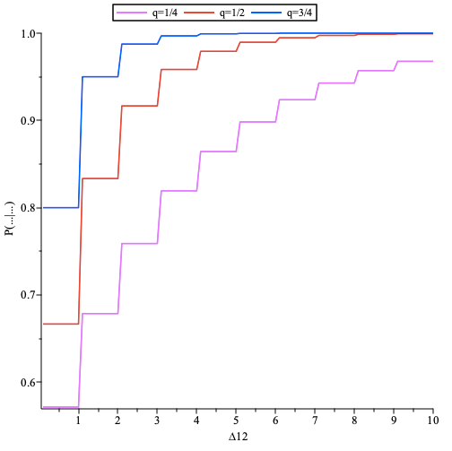

> The probability $`\mathrm{P}(t^{out}_2 \gt t^{out}_1\vert t^{in}_2 \gt t^{in}_1)`$ as function of the (rescaled) time-difference $`\Delta_{12}=\frac{t_2^{in} - t_1^{in}}{\Delta}`$, where $`t_2^{in} \gt t_1^{in}`$, plotted for $`q\in\{1/4,1/2,3/4\}`$.

## Two senders and a single path of mixes scenario: analysis of the FIFO attack

- A detailed description of the FIFO attack is provided in the [Appendix](analysis-anonymity/appendices/literature-review.md). Here we develop analysis of the FIFO attack for mix nodes with a queuing system.

- We assume that messages are removed from the out-queue with probability $`q`$.

- We assume that nodes $`1`$ and $`2`$ send messages via the same path going through $`k`$ nodes.

- We assume that each node sends a message to the node $`3`$ at time $`0`$. A message in the node $`\mu\in\{1,2\}`$ is delayed by (at most) $`r_\mu\Delta_\mu`$, where $`r_\mu`$ is random variable from the Geometric distribution with parameter $`q`$, and it is delayed in the link to the node 3 by $`d_{\mu 3}`$. Hence a message from node $`\mu`$ arrives to node 3 at the time $`t_\mu^{in}=r_\mu\Delta_\mu + d_{\mu3}`$.

- A message from node $`\mu\in\{1,2\}`$ is delayed by $`\sum_{i=3}^{k+2}r^\mu_i\Delta_i+ \sum_{i=3}^{k+1}d_{ii+1}`$, where $`r^\mu_i`$ is random variable from the Geometric distribution with parameter $`q`$, while travelling through the $`k`$ nodes. Thus a message from node $`\mu`$ exits the last node $`k+2`$ at the time

$$
t_\mu^{out}=t_\mu^{in} +\sum_{i=3}^{k+2}r^\mu_i\Delta_i+ \sum_{i=3}^{k+1}d_{ii+1}.
$$

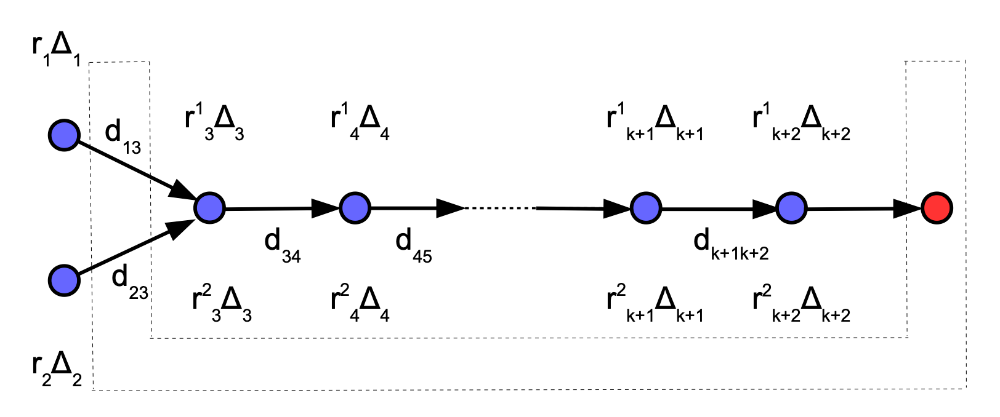

> At time $`0`$ the nodes $`1`$ and $`2`$ send messages, via $`k`$ nodes, to the receiver node (red filled circle). The latter is *controlled* by an adversary which is also *observing* sender nodes.

- The events $`E_{2 \gt 1}: (t_2^{out} \gt t_1^{out}) \land (t_2^{in} \gt t_1^{in})`$ and $`E_{2\leq1}: (t_2^{out}\leq t_1^{out}) \land  (t_2^{in}\leq t_1^{in})`$, i.e. the temporal order of two messages is preserved. These events are _mutually exclusive,_ and hence the probability $`\mathrm{P}(E_{2 \gt 1} \cup E_{2\leq1})`$ the at least one of these event will happen is equal to $`\mathrm{P}(E_{2 \gt 1})+\mathrm{P}(E_{2\leq1})`$.

- The probability $`\mathrm{P}(E_{2 \gt 1} \cup E_{2\leq1})=\mathrm{P}(E_{2 \gt 1})+\mathrm{P}(E_{2\leq1})`$, i.e. the probability that _temporal order_ of incoming and ougoing messages is _preserved_, is the probability of success of the FIFO attack.

- Assuming $`\Delta_i=\Delta`$ we have $`t_\mu^{out}=t_\mu^{in} +b_\mu\Delta+ \sum_{i=3}^{k+1}d_{ii+1}`$, where $`b_\mu`$ is random variable from the [negative binomial distribution](https://en.wikipedia.org/wiki/Negative_binomial_distribution#Waiting_time_in_a_Bernoulli_process) with parameters $`k`$ and $`q`$. Furthermore, for $`d_{13}=d_1`$ and $`d_{23}=d_2`$ the probability

$$
\begin{aligned}
&\mathrm{P}(E_{2>1})=\sum_{r_1\geq1} \mathrm{P}_q(r_1)\sum_{r_2\geq1} \mathrm{P}_q(r_2) \sum_{b_1\geq k} \mathrm{P}_{k,q}(b_1)\sum_{b_2\geq k} \mathrm{P}_{k,q}(b_2) \\
&\times\mathbb{1}\left[r_2-r_1+\frac{d_2-d_1}{\Delta}>0\right] \\
&\times\mathbb{1}\left[r_2-r_1+\frac{d_2-d_1}{\Delta}+b_2-b_1>0\right].
\end{aligned}
$$

- We note that in above the random variables $`t^{in}_1=r_1\Delta+d_1`$ and $`t^{in}_2=r_2\Delta+d_2`$, where $`r_\mu`$ is a random variable from the prob. distr. $`\mathrm{P}_q(r_\mu)`$, models the arrival times of two messages to the first mix node and the first indicator function ensures that only the event $`t_2^{in} \gt t_1^{in}`$ contributes to the probability $`\mathrm{P}(E_{2 \gt 1})`$. Furthermore, the random variables $`t_1^{out}=t_1^{in} +b_1\Delta+ \sum_{i=3}^{k+1}d_{ii+1}`$ and $`t_2^{out}=t_2^{in} +b_2\Delta+ \sum_{i=3}^{k+1}d_{ii+1}`$, where $`b_\mu`$ is a random variable from the prob. distr. $`\mathrm{P}_{k,q}(b_\mu)`$, model arrival times of two messages to the last (receiver) node and the second indicator function ensures that only the event $`t_2^{out} \gt t_1^{out}`$ contributes to the probability $`\mathrm{P}(E_{2 \gt 1})`$.

- In a similar manner, we obtain the probability

$$
\begin{aligned}
&\mathrm{P}(E_{2\leq1})=\sum_{r_1\geq1} \mathrm{P}_q(r_1)\sum_{r_2\geq1} \mathrm{P}_q(r_2) \sum_{b_1\geq k} \mathrm{P}_{k,q}(b_1)\sum_{b_2\geq k} \mathrm{P}_{k,q}(b_2) \\
&\times\mathbb{1}\left[r_1-r_2+\frac{d_1-d_2}{\Delta}\geq0\right] \\
&\times\mathbb{1}\left[r_1-r_2+\frac{d_1-d_2}{\Delta}+b_1-b_2\geq0\right].
\end{aligned}
$$

- The probability $`\mathrm{P}(E_{2 \gt 1})`$ can be approximated by generating a large population of independent random variables $`\{r_2(i), r_1(i),b_2(i), b_1(i):i\in[\mathcal{N}]\}`$ sampled from the prob. distributions $`\mathrm{P}_q(r_1),  \mathrm{P}_q(r_2), \mathrm{P}_{k,q}(b_1)`$ and $`\mathrm{P}_{k,q}(b_2)`$, and computing the (empirical) probability

$$
\begin{aligned}
&\mathrm{P}_{\mathcal{N}}(E_{2>1})=\frac{1}{\mathcal{N}}\sum_{i=1}^\mathcal{N} \,\mathbb{1}\left[r_2(i)-r_1(i)+\frac{d_2-d_1}{\Delta}>0\right] \\
&\times\mathbb{1}\left[r_2(i)-r_1(i)+\frac{d_2-d_1}{\Delta}+b_2(i)-b_1(i)>0\right].
\end{aligned}
$$

- In a similar manner we define $`\mathrm{P}_{\mathcal{N}}(E_{2\leq1})`$.

- We expect that $`\lim_{\mathcal{N}\rightarrow\infty}\mathrm{P}_{\mathcal{N}}(E_{2 \gt 1})=\mathrm{P}(E_{2 \gt 1})`$ by the law of large numbers.

- The (empirical) prob. $`\mathrm{P}_{\mathcal{N}}(E_{2 \gt 1} \cup E_{2\leq1})=\mathrm{P}_{\mathcal{N}}(E_{2 \gt 1})+\mathrm{P}_{\mathcal{N}}(E_{2\leq1})`$ allows us to estimate the probability of success of FIFO attack $`\mathrm{P}(E_{2 \gt 1} \cup E_{2\leq1})`$.

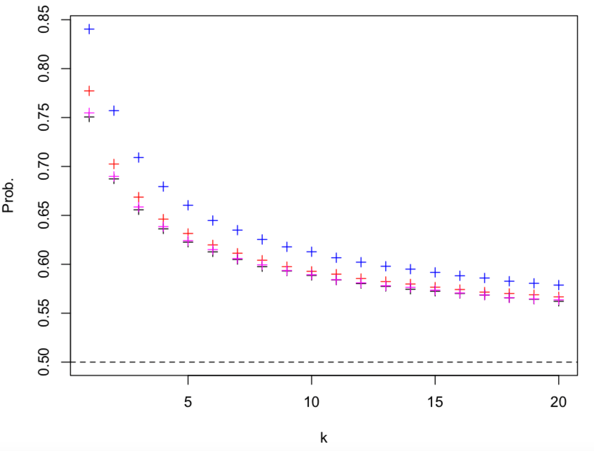

> The probability $`\mathrm{P}_{\mathcal{N}}(E_{2 \gt 1})+\mathrm{P}_{\mathcal{N}}(E_{2\leq1})`$, i.e. the probability of success of FIFO attack, as a function of $`k`$ plotted for $`q\in\{1/10, 1/4,1/2,3/4\}`$ (black, magenta, red, blue) and $`\frac{d_2-d_1}{\Delta}=0`$. The population size is equal to $`\mathcal{N}=10^6`$.

- We note that the above result, i.e. the probability of success of FIFO attack is a monotonic decreasing function of $`k`$, is very similar to the result for continuous [mixes](analysis-anonymity/appendices/literature-review.md) when $`\frac{d_2-d_1}{\Delta}=0`$, i.e. the connections 1-3 and 2-3 have the same latency. However, when the latter is not true the prob. $`\mathrm{P}(E_{2 \gt 1})+\mathrm{P}(E_{2\leq1})`$ can be much higher as can be seen in the plot below.

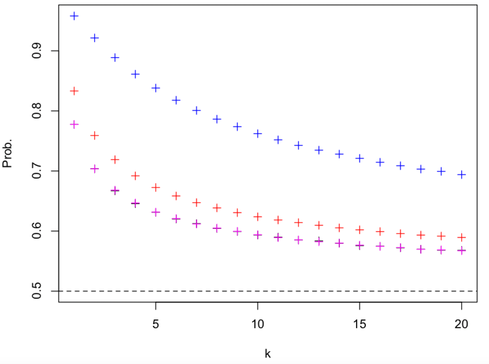

> The probability $`\mathrm{P}_{\mathcal{N}}(E_{2 \gt 1})+\mathrm{P}_{\mathcal{N}}(E_{2\leq1})`$ as a function of $`k`$ plotted for $`q=1/2`$ and $`\frac{d_2-d_1}{\Delta}\in\{0, 0.99,1.1,5\}`$ (black, magenta, red, blue). The population size is equal to $`\mathcal{N}=10^6`$.

- Let us assume that in our [setup](analysis-queuing-system-in-the-mix-node.md) the random variables $`r_1`$ and $`r_2`$ are sampled from the Geometric distribution with parameter $`q_S`$, and for $`i\in\{3,\ldots,k+2\}`$ the random variable $`r^\mu_i`$ is sampled from the Geometric distribution with parameter $`q_M`$. Thus parameters of _delays_ of the _sender_ and _mix_ nodes are _different_. The latter can be used to reduce the probability of success, $`\mathrm{P}(E_{2 \gt 1})+\mathrm{P}(E_{2\leq1})`$, of the FIFO attack as can be seen in the plot below.

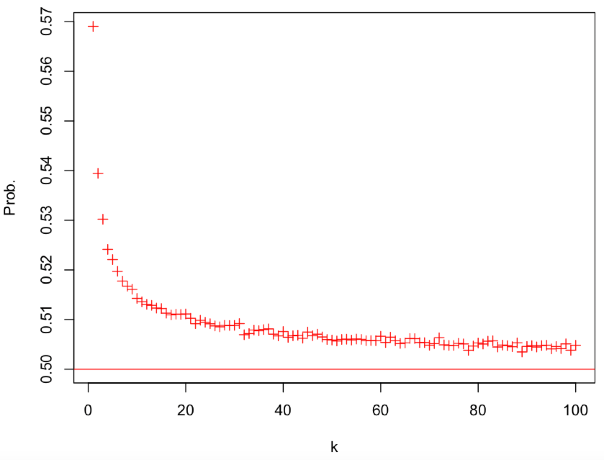

> The probability $`\mathrm{P}_{\mathcal{N}}(E_{2 \gt 1})+\mathrm{P}_{\mathcal{N}}(E_{2\leq1})`$ as a function of $`k`$ plotted for $`q_S=1/2`$, $`q_M=1/10`$ and $`\frac{d_2-d_1}{\Delta}=0`$. The population size is equal to $`\mathcal{N}=10^6`$.

- We note that a message is delayed by the sender node by $`1/q_S`$ (on average) and by the mix node by $`1/q_M`$ (on average). We note that a similar setup is used in [continuous mixes](analysis-anonymity/appendices/literature-review.md) where the ratio $`\rho=q_S/q_M`$ plays important role.

- The probability of success of FIFO attack , $`\mathrm{P}(E_{2 \gt 1})+\mathrm{P}(E_{2\leq1})`$, is _decreasing_ with _increasing_ $`\rho`$ as can be seen in the plots below.

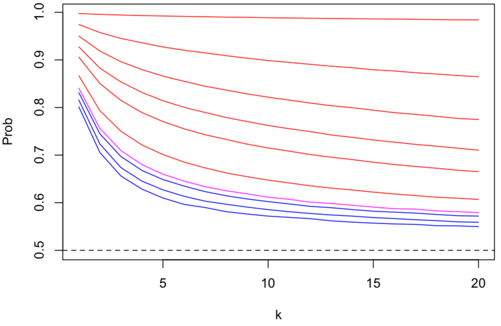

> The probability $`\mathrm{P}_{\mathcal{N}}(E_{2 \gt 1})+\mathrm{P}_{\mathcal{N}}(E_{2\leq1})`$ as a function of $`k`$ plotted for $`q_M=3/4`$, $`q_S=\{0.01,0.1,0.2,0.3,0.4, 0.5, 0.6, 3/4,0.8,0.9,0.99\}`$ (top to bottom), i.e. $`\rho\in\{0.013(3),0.13(3), \ldots,1.32\}`$, and $`\frac{d_2-d_1}{\Delta}=0`$. The $`q_M=q_S`$ case is plotted in magenta colour, and $`q_M \gt q_S`$ ($`\rho \gt 1`$) and $`q_M \lt q_S`$ ($`\rho \lt 1`$) cases are, respectively, plotted in red and blue colours. The population size is equal to $`\mathcal{N}=10^6`$.

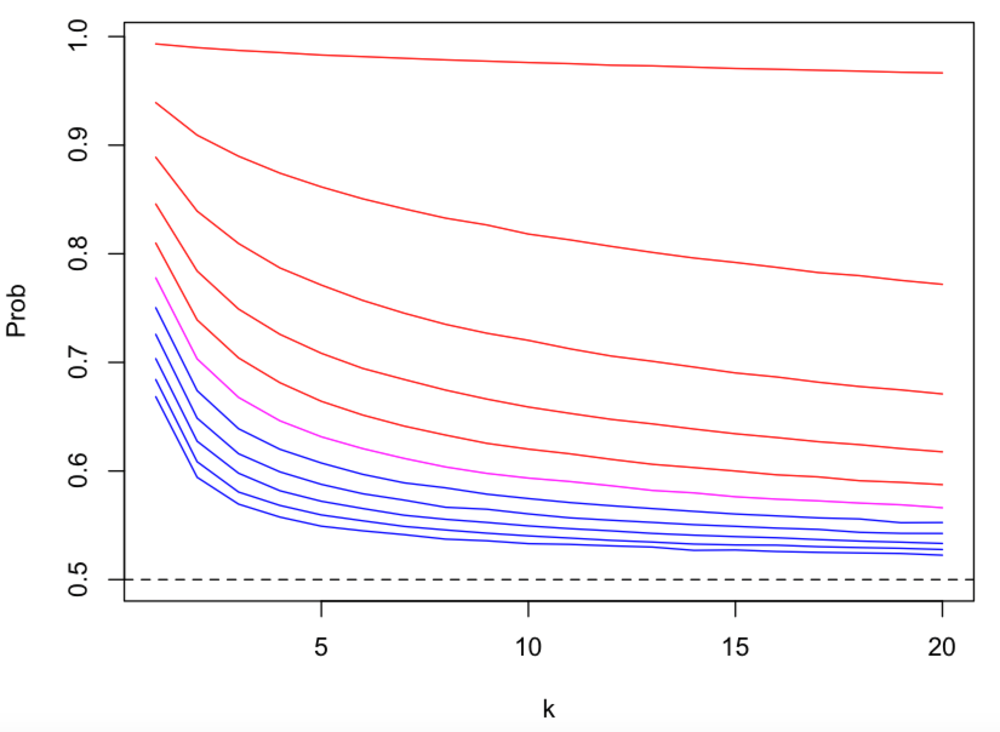

> The probability $`\mathrm{P}_{\mathcal{N}}(E_{2 \gt 1})+\mathrm{P}_{\mathcal{N}}(E_{2\leq1})`$ as a function of $`k`$ plotted for $`q_M=1/2`$, $`q_S=\{0.01,0.1,0.2,0.3,0.4, 1/2, 0.6, 0.7,0.8,0.9,0.99\}`$ (top to bottom), i.e. $`\rho\in\{0.02,0.2, \ldots,2\}`$, and $`\frac{d_2-d_1}{\Delta}=0`$. The $`q_M=q_S`$ case is plotted in magenta colour, and $`q_M \gt q_S`$ ($`\rho \gt 1`$) and $`q_M \lt q_S`$ ($`\rho \lt 1`$) cases are, respectively, plotted in red and blue colours. The population size is equal to $`\mathcal{N}=10^6`$.

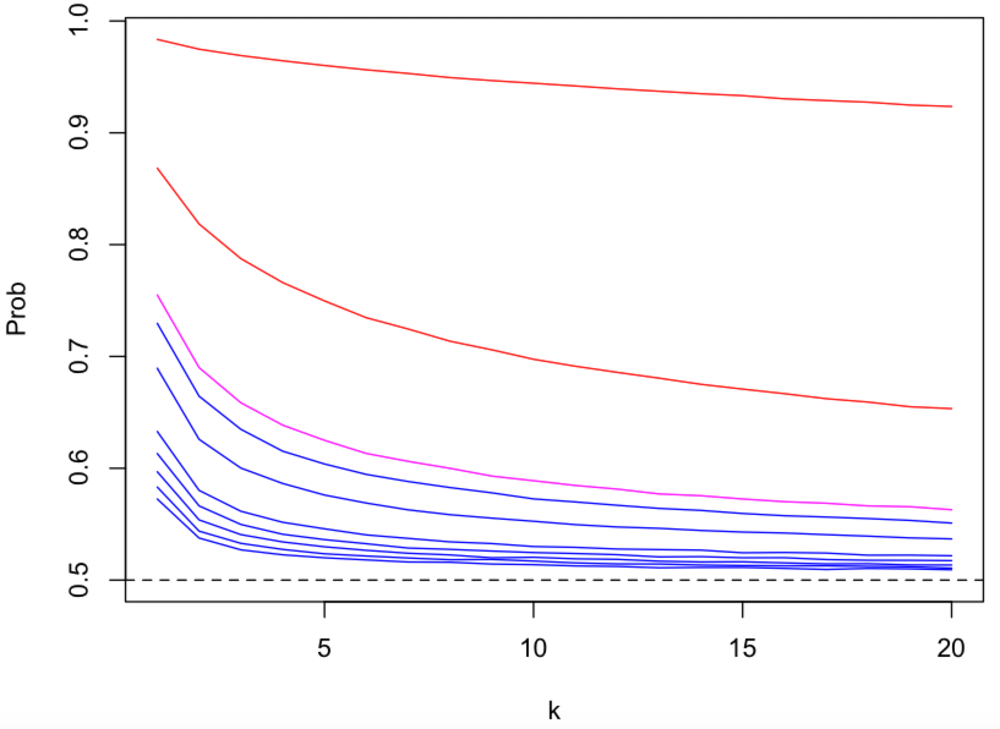

> The probability $`\mathrm{P}_{\mathcal{N}}(E_{2 \gt 1})+\mathrm{P}_{\mathcal{N}}(E_{2\leq1})`$ as a function of $`k`$ plotted for $`q_M=1/4`$, $`q_S=\{0.01,0.1,1/4,0.3,0.4, 0.5, 0.6, 0.7,0.8,0.9,0.99\}`$ (top to bottom), i.e. $`\rho\in\{0.04,0.4,1, \ldots,4\}`$, and $`\frac{d_2-d_1}{\Delta}=0`$. The $`q_M=q_S`$ case is plotted in magenta colour, and $`q_M \gt q_S`$ ($`\rho \gt 1`$) and $`q_M \lt q_S`$ ($`\rho \lt 1`$) cases are, respectively, plotted in red and blue colours. The population size is equal to $`\mathcal{N}=10^6`$.

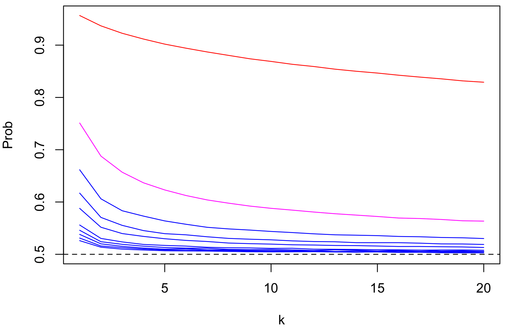

> The probability $`\mathrm{P}_{\mathcal{N}}(E_{2 \gt 1})+\mathrm{P}_{\mathcal{N}}(E_{2\leq1})`$ as a function of $`k`$ plotted for $`q_M=1/10`$, $`q_S=\{0.01,0.1,0.2,0.3,0.4, 0.5, 0.6, 0.7,0.8,0.9,0.99\}`$ (top to bottom), i.e. $`\rho\in\{0.1, 1, \ldots,9.9\}`$, and $`\frac{d_2-d_1}{\Delta}=0`$. The $`q_M=q_S`$ case is plotted in magenta colour, and $`q_M \gt q_S`$ ($`\rho \gt 1`$) and $`q_M \lt q_S`$ ($`\rho \lt 1`$) cases are, respectively, plotted in red and blue colours. The population size is equal to $`\mathcal{N}=10^6`$.

- Above plots suggest that the probability of success of FIFO attack, $`\mathrm{P}(E_{2 \gt 1})+\mathrm{P}(E_{2\leq1})`$, approaches $`1/2`$, i.e. an adversary has no advantage over the case of random guessing, as $`k\rightarrow\infty`$. Furthermore, the speed of convergence (in $`k`$) to $`1/2`$ is monotonic increasing function of the ratio $`\rho=q_S/q_M`$.

- The probability of success of FIFO attack , $`\mathrm{P}(E_{2 \gt 1})+\mathrm{P}(E_{2\leq1})`$, is _increasing_ with _increasing_ $`\frac{d_2-d_1}{\Delta} \gt 0`$, i.e. [the sender connections 1-3 and 2-3](analysis-anonymity.md) have _different_ latency, as can be seen by comparing the [figure](analysis-anonymity.md) with the plots below.

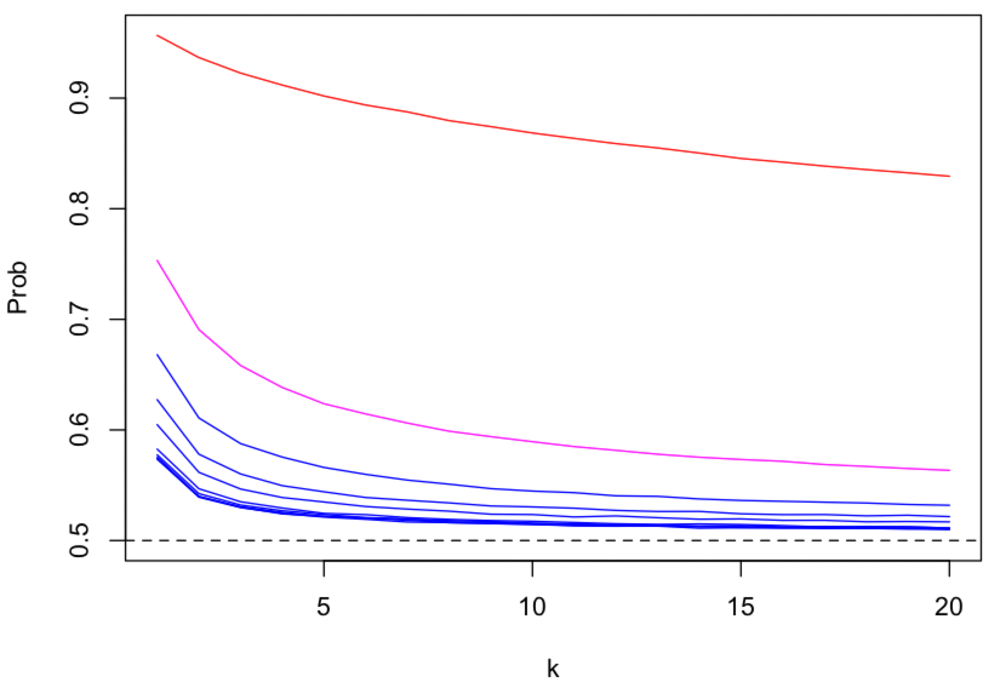

> The probability $`\mathrm{P}_{\mathcal{N}}(E_{2 \gt 1})+\mathrm{P}_{\mathcal{N}}(E_{2\leq1})`$ as a function of $`k`$ plotted for $`q_M=1/10`$, $`q_S=\{0.01,0.1,0.2,0.3,0.4, 0.5, 0.6, 0.7,0.8,0.9,0.99\}`$ (top to bottom), i.e. $`\rho\in\{0.1, 1, \ldots,9.9\}`$, and $`\frac{d_2-d_1}{\Delta}=2`$. The $`q_M=q_S`$ case is plotted in magenta colour, and $`q_M \gt q_S`$ ($`\rho \gt 1`$) and $`q_M \lt q_S`$ ($`\rho \lt 1`$) cases are, respectively, plotted in red and blue colours. The population size is equal to $`\mathcal{N}=10^6`$.

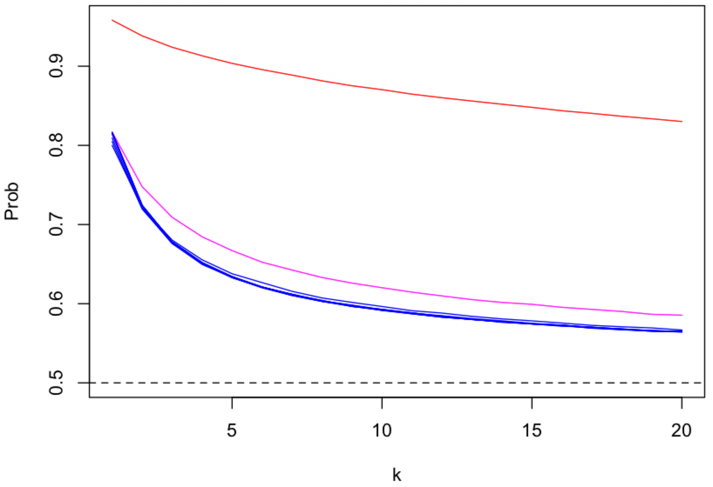

> The probability $`\mathrm{P}_{\mathcal{N}}(E_{2 \gt 1})+\mathrm{P}_{\mathcal{N}}(E_{2\leq1})`$ as a function of $`k`$ plotted for $`q_M=1/10`$, $`q_S=\{0.01,0.1,0.2,0.3,0.4, 0.5, 0.6, 0.7,0.8,0.9,0.99\}`$ (top to bottom), i.e. $`\rho\in\{0.1, 1, \ldots,9.9\}`$, and $`\frac{d_2-d_1}{\Delta}=10`$. The $`q_M=q_S`$ case is plotted in magenta colour, and $`q_M \gt q_S`$ ($`\rho \gt 1`$) and $`q_M \lt q_S`$ ($`\rho \lt 1`$) cases are, respectively, plotted in red and blue colours. The population size is equal to $`\mathcal{N}=10^6`$.

- Furthermore, the probability of success of FIFO attack , $`\mathrm{P}(E_{2 \gt 1})+\mathrm{P}(E_{2\leq1})`$, is not dependent on the (rescaled) difference of latencies $`\frac{d_2-d_1}{\Delta}`$ when $`0\leq\frac{d_2-d_1}{\Delta}\leq1`$ and is _increasing_ with _increasing_ $`\frac{d_2-d_1}{\Delta}`$ when $`\frac{d_2-d_1}{\Delta} \gt 1`$ as can be seen in the figure below.

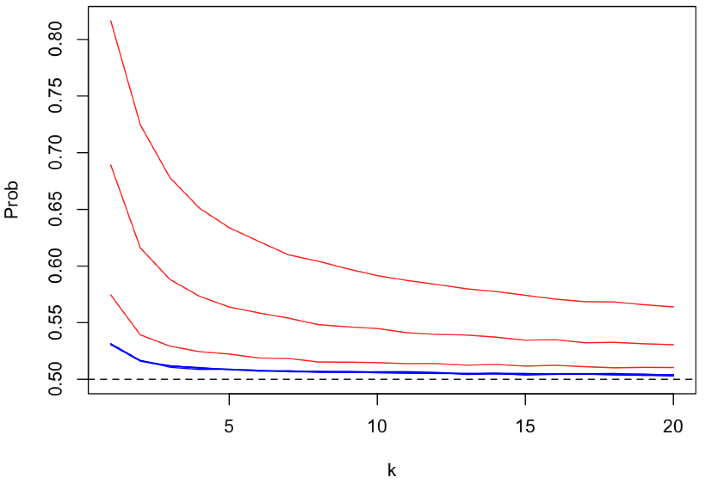

> The probability $`\mathrm{P}_{\mathcal{N}}(E_{2 \gt 1})+\mathrm{P}_{\mathcal{N}}(E_{2\leq1})`$ as a function of $`k`$ plotted for $`q_M=1/10`$, $`q_S=0.9`$ , i.e. $`\rho=9`$, and $`\frac{d_2-d_1}{\Delta}=\{0, 0.1,0.5, 0.9, 1.0, 1.1, 5, 10\}`$ (bottom to top). The $`0\leq\frac{d_2-d_1}{\Delta}\leq1`$ cases are plotted in blue colour and $`\frac{d_2-d_1}{\Delta} \gt 1`$ cases are plotted in red colour. The population size is equal to $`\mathcal{N}=10^6`$.

- For $`\frac{d_2-d_1}{\Delta} \lt 0`$ the probability $`\mathrm{P}(E_{2 \gt 1})+\mathrm{P}(E_{2\leq1})`$ behaves in a similar way as when $`\frac{d_2-d_1}{\Delta}\geq 0`$ as can be seen by comparing above figure with the figure below.

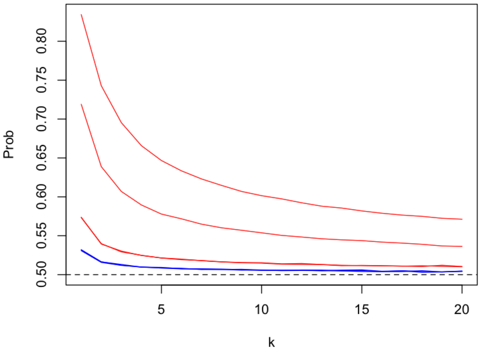

> The probability $`\mathrm{P}_{\mathcal{N}}(E_{2 \gt 1})+\mathrm{P}_{\mathcal{N}}(E_{2\leq1})`$ as a function of $`k`$ plotted for $`q_M=1/10`$, $`q_S=0.9`$ , i.e. $`\rho=9`$, and $`\frac{d_2-d_1}{\Delta}=\{-10, -5, -1.1, -1, -0.9, -0.5, -0.1, 0\}`$ (top to bottom). The $`\frac{d_2-d_1}{\Delta} \gt -1`$ cases are plotted in blue colour and $`\frac{d_2-d_1}{\Delta}\leq -1`$ cases are plotted in red colour. The population size is equal to $`\mathcal{N}=10^6`$.

- However, the $`\frac{d_2-d_1}{\Delta}=-1`$ and $`\frac{d_2-d_1}{\Delta}=1`$ cases are _different_ as can be seen in the figure below.

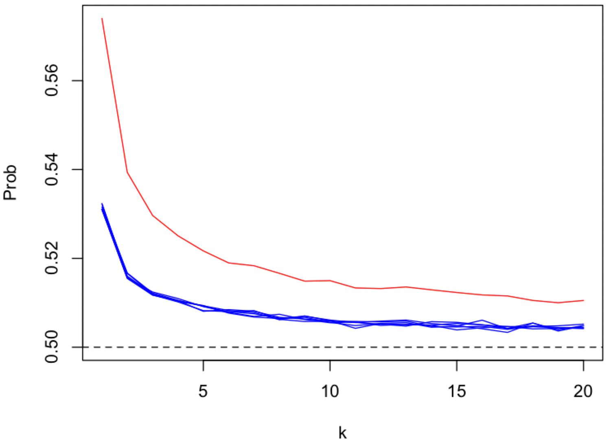

> The probability $`\mathrm{P}_{\mathcal{N}}(E_{2 \gt 1})+\mathrm{P}_{\mathcal{N}}(E_{2\leq1})`$ as a function of $`k`$ plotted for $`q_M=1/10`$, $`q_S=0.9`$ , i.e. $`\rho=9`$, and $`\frac{d_2-d_1}{\Delta}=\{-1, -0.9, -0.5, -0.1, 0, 0.1, 0.5, 0.9, 1\}`$ (top to bottom). The $`\frac{d_2-d_1}{\Delta}=-1`$ case is plotted in red colour. The population size is equal to $`\mathcal{N}=10^6`$.

### Summary of FIFO attack analysis

From above analysis, it follows that the probability of success of FIFO attack is reduced by:

- Increasing the number of mix nodes $`k`$.

- Increasing the ratio $`\rho=q_S/q_M`$, where a message is delayed by the sender node by $`1/q_S`$ (on average) and by the mix node by $`1/q_M`$ (on average).

- Decreasing differences between latencies of communication links.

# Bibliography

Das, D., Diaz, C., Kiayias, A., & Zacharias, T. (2024). Are continuous stop-and-go mixnets provably secure?. _Proceedings on Privacy Enhancing Technologies_. [https://doi.org/10.56553/popets-2024-0136](https://doi.org/10.56553/popets-2024-0136)

# Appendix

- [Literature review](analysis-anonymity/appendices/literature-review.md)
