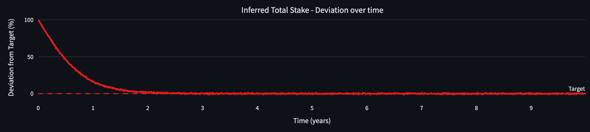
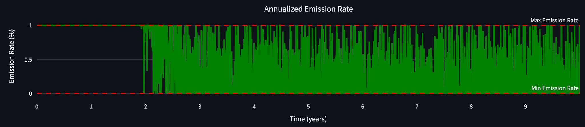
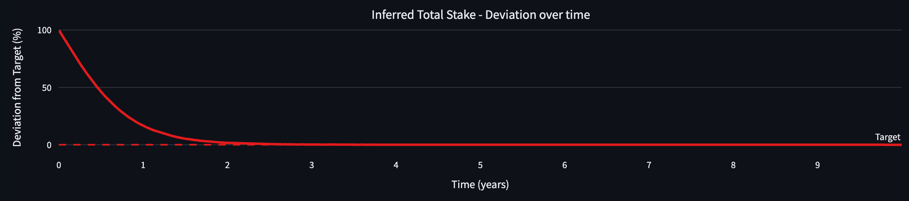
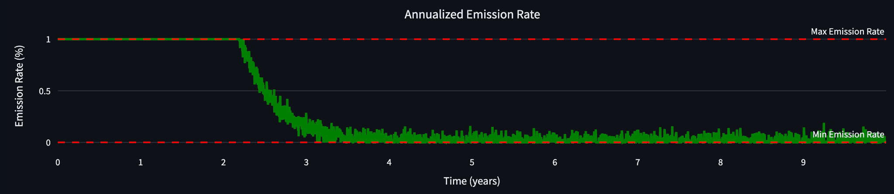
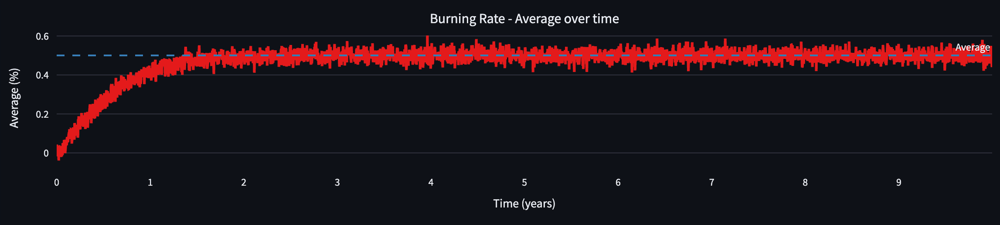
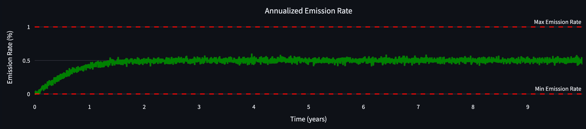
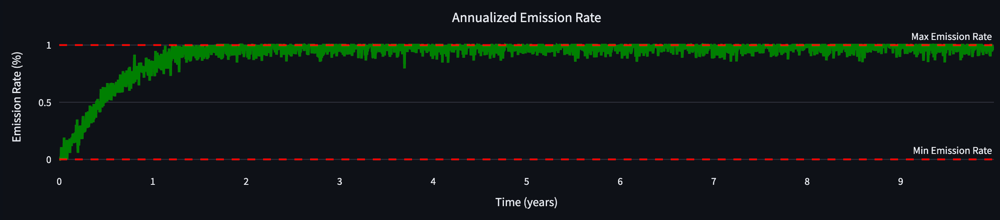

# ANALYSIS-BLOCK-REWARD-PARAMETER-CALIBRATION

| Field | Value |
| --- | --- |
| Name | [Analysis] Block Reward Parameter Calibration |
| Slug | 184 |
| Status | raw |
| Category | Informational |
| Editor | Frederico Teixeira <frederico@logos.co> |
| Contributors | Filip Dimitrijevic <filip@logos.co> |

<!-- timeline:start -->

## Timeline

- **2026-05-27** — [`b7602ed`](https://github.com/logos-co/logos-lips/blob/b7602ed8a225d41ca0bfaaa432524dc84d2ded7e/docs/blockchain/raw/analysis-block-reward-parameter-calibration.md) — chore: move blockchain specs from notion to github

<!-- timeline:end -->

# Revisions History

| Version | Changes | Date |
| --- | --- | --- |
| 1.0.0 | Initial revision. | 2026-04-24 |

> Disclaimer:
> This material, including any linked pages or documents, is provided for informational purposes only. It does not constitute investment advice, a solicitation, or an offer to buy or sell any securities, tokens, or other financial instruments, nor should it be construed as legal, financial, or tax advice.
>
> All information regarding project details, token design, distribution mechanisms, technical parameters, and any forward-looking statements is preliminary and subject to change without notice. No representations or warranties are made as to the completeness or accuracy of the information herein. 
>
> Nothing in this material should be relied upon for investment or business decisions. Recipients of this information assume all risks associated with its use and are responsible for seeking independent professional advice regarding any actions based on it.

# Introduction

This document explains the rationale behind the parameter values proposed in [Block Rewards](block-rewards.md).

The block reward mechanism adjusts the protocol’s token emission rate based on on-chain signals such as the deviation of the inferred total stake from its target and the moving average of the fee-burning rate. The parameters calibrated here control how strongly the emission rate reacts to those signals, how quickly it transitions between regimes, and the bounds it must respect.

The goal of this calibration is to make incentives predictable and robust: provide sufficient security while the chain is below its target staking level, and converge toward a more stable long-run regime in which issuance is primarily constrained by fee burns rather than persistent inflation.

# The Parameter $\alpha_d$​

The normalized deviation from target, namely $\delta_t$, is measured in percentage units.

The parameter $\alpha_d$, defined [here](block-rewards.md), can be described as the “unit of emission rate per unit of target deviation”. This parameter should be defined based on the expected variance of the KPI with respect to the target.

For the sake of an example, let's set $\alpha_d = 1$, $\alpha_a=0$, $I_{min}=0\%$, and $I_{max}=1\%$.

The figure below shows a KPI whose deviation around the target has a standard deviation $1$.

> Figure 2

As a consequence, the emission rate $I_t$ frequently reaches the maximum value.

> Figure 3

Let's now consider a scenario where the volatility of the KPI deviation decreases to $0.1$. The figure below shows an example (the difference in the signal oscillation with respect to Figure 2 is very subtle).

> Figure 4

As a consequence, all else equal, the annualized token emission rate becomes considerably less volatile.

> Figure 5

The parameter $\alpha_d$ also controls the sensitivity of the normalized deviation from target ($\delta_t$) in the [emission rate factor function](block-rewards.md#emission-rate-factor-function) ($A_t$):

- If $\alpha_d$ is too high, for example $\alpha_d \gt 1$, a small value of $\delta_t$ turns $A_t$ to 1, so that the system stays in the maximum inflationary regime driven by $I_{max}$, see equation [(1)](block-rewards.md#block-rewards).
- If $\alpha_d$ is too low, for example $\alpha_d = 0.01$, the system needs to be too much off-target to stay in the maximum inflationary regime driven by $I_{max}$.

The parameter $\alpha_d$ therefore allows for a smooth transition from the maximum inflationary regime (driven by $I_{max}$) to the stable regime (driven by the averaged burned fees).

The value $\alpha_d=1/6$ is chosen so that when the total inferred stake is off target by $16.6\%$ (i.e. $\delta_t=16.6\%$), the system starts moving from the maximum inflationary regime to the regime driven by the burned fees. If $D_{0,target}=30\%$, this means that this happens when the security level reaches $25\%$.

## The Parameter $\alpha_a$​

The weighted average metric, namely $\gamma_t$, is measured in percentage units.

The parameter $\alpha_a$, defined [here](block-rewards.md), can be described as the "unit of emission rate per unit of averaged KPI." This parameter should be defined based on the expected magnitude of the KPI.

For the sake of an example, let's set $\alpha_d = 0$, $\alpha_a=1$, $I_{min}=0\%$, and $I_{max}=1\%$.

The figure below shows a KPI whose deviation around the target has a standard deviation of $100\%.$​

> Figure 6

As a consequence of the parametrization, specifically $\alpha_a=1$, the emission rate $I_t$ never reaches the maximum value.

> Figure 7

If we set $\alpha_a=2$, then the emission rate $I_t$ reaches the maximum value, but never surpasses it.

> Figure 8

## The Inferred Total Stake ($D_{0,target}$)

This section explains the rationale for defining the target $\text{Security Level}$ as $30\%$ of the TGE supply.

The TGE supply of the LGO token has to account for:

- The tokens disbursed as rewards to team, investors, ecosystem, etc. (subject to different vesting schemes),
- The security of the blockchain.
- Access to the blockchain utility.

The first allocation is fixed. The second and third should be balanced to ensure sufficient security while facilitating access to the blockchain utility.

Assuming a constant growth rate of the inferred total stake:

- if $\text{Security Level}$ is too high, the inferred total stake will take longer to achieve the predefined target → resulting in more token inflation before the regime stabilizes around the burning rate.
- if $\text{Security Level}$ is too low, the inferred total stake will take less time to achieve the predefined target → resulting in less token inflation before the regime stabilizes around the burning rate.

There is no closed formula for defining the appropriate $\text{Security Level}$. Our rationale was guided by observations from existing blockchains.

This [website](https://www.stakingrewards.com/assets/proof-of-stake?sort=real_reward_rate&timeframe=7d&order=asc&byChange=false&columns=staking_ratio%2Creal_reward_rate%2Ctotal_roi_365d%2Cinflation_rate) shows the PoS participation ratio of several blockchains. When examining chains that haven't defined a $\text{Security Level}$ upfront, we observe a negative correlation between utility in the chain and staked amount (at the time of writing). This means that for Logos Blockchain, which aims to become a chain with utility, data suggests that a very high $\text{Security Level}$ (e.g., $\gt 50\%$) is not recommended.

On the other hand, data also shows that many blockchains have their $\text{Security Level}$ in the range of $30\%-50\%$. Given that the proposed token emission mechanism is pegged to the deviation from the $\text{Security Level}$ target, the decision to peg the system behavior to the lower end of this range is meant to stop token inflation sooner.

## The Burning Rate Average Factor ($D_{1,target}$)

As already described above, $D_{1,target}$ is taken to be equal to $S_{tge}$ so that $\gamma_t$ evaluates the annualized average burning rate with respect to the TGE supply. This makes the equation [above](block-rewards.md#emission-rate-factor-function) consistent.

## Maximum Emission Rate ($I_{max}$)

The maximum emission rate $I_{max}$ caps only the number of tokens that will be minted per year by the block reward protocol. It is unrelated to the tokens that will be burned over the same period. The following information is available:

- The net inflation/deflation rate is the difference between the actual emission rate and the actual burning rate. By thinking in terms of $I_{max}$, we consider the worst-case minting scenario.
- Various sources indicate that gold's inflation rate, defined as the total increase in supply compared to existing stock, ranges from $1\% - 2\%$ per year.
- $I_{max}$ is the main variable that impacts the nodes' APY, while the inferred total stake is below the target security level.
- Analysis of other blockchain networks indicates that an $8\%$ emission rate is excessively high.
- A burning rate between $1\%-2\%$ is feasible for chains with very high demand.

If Logos Blockchain features similar issuance behavior as gold, when operating under an (net) inflationary regime, then the following conclusions can be reached:

- $I_{max} \lt 1\%$ is too conservative. There is insufficient evidence to support such a recommendation.
- $I_{max} = 1\% - 3\%$ per year is moderate. Although spikes in the burn rate may make the system too deflationary and unpredictable, these are not expected to be common.
- $I_{max}=3\% - 5\%$ per year is moderate, but risks overpaying for security. Logos Blockchain would need an average $2\%$ burning rate to achieve a reasonable net inflation rate (similar to gold). However, given the target security level of $30\%$, this range would distribute $10\%$ to $16.6\%$ APY to nodes (see [Table 1](block-rewards.md) below), which would currently place Logos Blockchain in the top $10\%$ (see Real Reward Rate [here](https://www.stakingrewards.com/assets/proof-of-stake?sort=real_reward_rate&timeframe=7d&order=desc&byChange=false&columns=staking_ratio%2Creal_reward_rate%2Ctotal_roi_365d%2Cinflation_rate)).
- $I_{max} \gt 5\%$ per year is aggressive. Values above $5\%$ should be justified by very high expected usage of the blockchain, which would cause high burning rates. Given the cyclical behavior of economic activity, this may trigger hyperinflation.

Constraining $I_{max}$ to the range $[1\%, 3\%]$, the decision for $I_{max} = 1\%$ is taken so that the rewards APY stabilizes around $3.34\%$ (see [Table 1](block-rewards.md)) as the inferred total stake approaches the target security level.

## Minimum Emission Rate ($I_{min}$)

The recommendation is $I_{min} = 0$. While $I_{min} \gt 0$ has a slight inflationary bias and $I_{min} \lt 0$ a slight deflationary bias, both need a strong argument to be defined. There is currently no evidence for $I_{min} \neq 0$.

