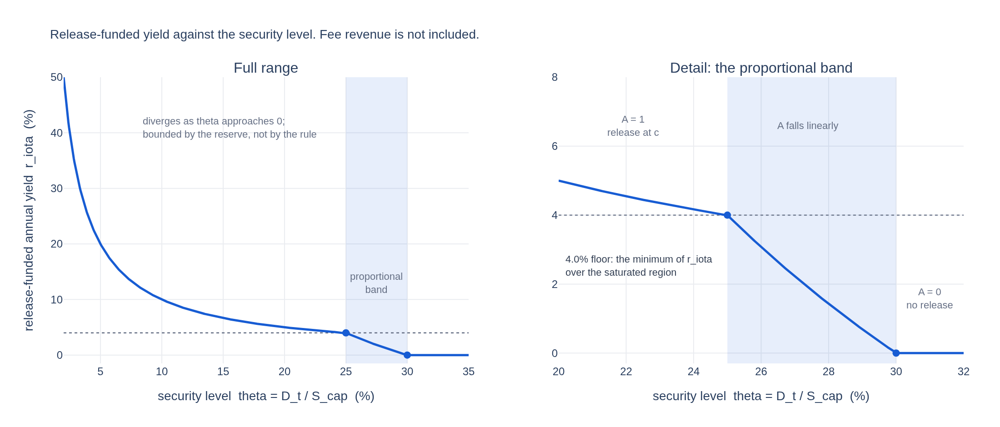
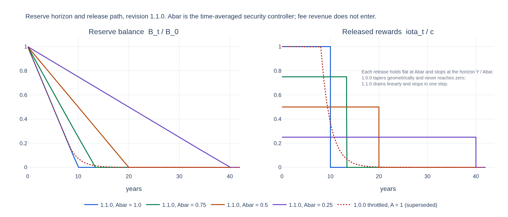

# ANALYSIS-BLOCK-REWARDS

| Field | Value |
| --- | --- |
| Name | [Analysis] Block Rewards |
| Slug | TBD |
| Status | raw |
| Category | Informational |
| Editor | Frederico Teixeira <frederico@logos.co> |
| Contributors | Filip Dimitrijevic <filip@logos.co> |

## Timeline

- **2026-05-27** — [`b7602ed`](https://github.com/logos-co/logos-lips/blob/b7602ed8a225d41ca0bfaaa432524dc84d2ded7e/docs/blockchain/raw/analysis-block-rewards.md) — chore: move blockchain specs from notion to github

<!-- timeline:end -->

# Revisions History

| Version | Changes | Date |
| --- | --- | --- |
| 1.0.0 | Initial revision. | 2026-04-24 |
| 1.0.1 | Initial revision. | 2026-08-12 |
| 1.0.2 | Re-derived against the new block reward formula $`R_t = R^{\text{block}}_t + A_t c`$ | 2026-09-02 |

> Disclaimer:
> This material, including any linked pages or documents, is provided for informational purposes only. It does not constitute investment advice, a solicitation, or an offer to buy or sell any securities, tokens, or other financial instruments, nor should it be construed as legal, financial, or tax advice.
>
> All information regarding project details, token design, distribution mechanisms, technical parameters, and any forward-looking statements is preliminary and subject to change without notice. No representations or warranties are made as to the completeness or accuracy of the information herein.
>
> Nothing in this material should be relied upon for investment or business decisions. Recipients of this information assume all risks associated with its use and are responsible for seeking independent professional advice regarding any actions based on it.

# Scope

This document analyses the mechanism specified in [Block Rewards](block-rewards.md). It derives the properties that mechanism satisfies, evaluates it across the range of its state variables, examines the incentives it creates, identifies the conditions under which it fails, and states the trade-offs taken.

It defines no mechanism of its own. Every symbol, equation, and parameter used here is defined in [Block Rewards](block-rewards.md).

Labels of the form R1 to R9 refer to the numbered rows of [Design Requirements](block-rewards.md#requirements). Results established here are labelled P for derived properties, S for scenarios, I for incentive results, and F for failure modes, and are referenced by those labels from the specification.

# Derived Properties

## P1. Conservation

Let $`S^{tot}_t = S_t + P_t + B_t`$. At a block that is not an epoch boundary,

$$
\Delta S_t + \Delta P_t + \Delta B_t = \underbrace{(- R^{\text{block}}_t)}_{\text{circulation}} + \underbrace{(R^{\text{block}}_t + \iota_t)}_{\text{rewards pool}} + \underbrace{(- \iota_t)}_{\text{reserve pool}} = 0 .
$$

Every term cancels against another, and neither of the two flows appears in only one stock.

At the boundary $`t = T_e`$ the settlement adds $`+ \Pi_e`$ to $`\Delta S_t`$ and $`- \Pi_e`$ to $`\Delta P_t`$, which cancel. So

$$
S^{tot}_t = S^{tot}_0 \qquad \text{for every } t .
$$

Every flow is a transfer between the three stocks: 
* the block's fees move tokens out of circulation, 
* a release moves them from the reserve pool to the rewards pool, and 
* a settlement moves them from the rewards pool back into circulation. 

The mechanism never mints. This discharges R1.

Conservation holds at every block, not only at boundaries. What holds only at boundaries is the reduction to two stocks, stated next.

## P2. The rewards pool accrues within an epoch and discharges at the boundary

Within epoch $`e`$ the rewards pool is the running sum of accrued block rewards,

$$
P_t = \sum_{\tau = T_{e-1}+1}^{t} R_\tau , \qquad T_{e-1} < t \le T_e ,
$$

which is non-decreasing in $`t`$ and reaches $`\Pi_e`$ at the last block. Settlement then sets $`P_{T_e} = 0`$. This implies

$$
P_{T_e} = 0 \quad \text{for every } e, \qquad \text{and} \qquad \Delta S_t = - \Delta B_t \ \text{ over any whole number of epochs} .
$$

The rewards pool holds no balance across epochs, which discharges R9. It is a claim on block rewards already earned. It has no inflow other than $`R_t`$ and no outflow other than settlement, and in particular it never transfers to the reserve pool.

The balance decomposes into a fee-funded and a reserve-funded part,

$$
0 \;\le\; P_t \;=\; \underbrace{\sum_\tau R^{\text{block}}_\tau}_{\text{unbounded by the protocol}} \; + \; \underbrace{\sum_\tau \iota_\tau}_{\le \, L c} ,
$$

where the second sum is at most $`L c = 2.055 \cdot 10^6`$ LGO, or $`0.02\%`$ of $`S_{cap}`$, by [P3](#p3-block-reward-bounds-and-monotonicity). The first is bounded only by conservation, $`P_t \le S^{tot}_0`$. Implementations must size the accumulator against the conservation bound, not against the reserve-funded part.

R6 is discharged jointly by the two accounts and is close to vacuous. The rewards pool is emptied at every boundary, and the reserve pool has no inflow, so no stock can accumulate a balance without a release rule because no stock accumulates at all.

## P3. Block reward bounds and monotonicity

$$
R^{\text{block}}_t \;\le\; R_t \;\le\; R^{\text{block}}_t + c , \qquad 0 \;\le\; \iota_t \;\le\; c , \qquad \frac{\partial R_t}{\partial A_t} = \begin{cases} c, & A_t c < B_{t-1} \\ 0, & A_t c > B_{t-1} . \end{cases}
$$

The lower bound follows from $`\iota_t \ge 0`$, the upper from $`A_t \le 1`$ and the clamp. The block reward is non-decreasing in the controller, so raising the release never reduces the amount paid.

The sensitivity to the controller is the constant $`c`$. Monotonicity therefore needs no condition on the fee level: because the two components are additively separable, per [P4](#p4-the-two-components-are-additively-separable), no fee flow can drive the derivative to change sign, and no cap on the fee term is required to keep it non-negative.

The block reward has no upper bound. $`R_t`$ grows without limit with the fee flow, and downstream protocols must not assume any ceiling on it. What is bounded is the released component: $`\iota_t \le c`$ holds unconditionally, in every state and at any fee level, as a direct consequence of $`A_t \le 1`$, so gross emission into circulation is at most $`c`$ per block, that is $`I_{max} S_{cap}`$ per year. This discharges R5.

R3 follows for the released component: $`\iota_t > 0`$ whenever $`A_t > 0`$ and $`B_{t-1} > 0`$. The second condition is not automatic, and [P7](#p7-the-reserve-reaches-zero-in-finite-time) is what scopes it.

### Corollary: the release-funded yield profile

Annualizing $`\iota_t`$ against the staked base gives the yield the release alone delivers, before fees:

$$
r^{\iota}(D_t) = \frac{A_t \, I_{max} S_{cap}}{D_t} = \begin{cases}
\dfrac{I_{max} S_{cap}}{D_t} , & D_t \le D_{target} - \Lambda \\[2ex]
\dfrac{I_{max} S_{cap}}{\Lambda} \cdot \dfrac{D_{target} - D_t}{D_t} , & D_{target} - \Lambda < D_t < D_{target} \\[2ex]
0 , & D_t \ge D_{target} .
\end{cases}
$$

$`r^{\iota}`$ is strictly decreasing in $`D_t`$ on $`(0, D_{target})`$ and continuous at both breakpoints. Three readings follow, and the middle one is the calibration statement for $`c`$.

- As $`D_t \rightarrow 0`$ the yield diverges. This is the bootstrap incentive, and it is bounded only by the reserve, not by the rule.
- The reference base for a full release is the saturation boundary $`D_{target} - \Lambda`$, not the target. There the release is still at $`c`$ and the yield takes its minimum over the saturated region, $`I_{max} S_{cap} / (D_{target} - \Lambda)`$, which is $`4.0\%`$ on a base of $`2.5 \cdot 10^9`$ LGO at the adopted parameters. Quoting the release yield at $`D_{target}`$ instead is misleading: at the target $`A_t = 0`$, the release is zero, and the block reward is pure fee recycling. Quoting it against $`\Lambda`$ is also wrong, since $`\Lambda`$ is a shortfall rather than a staked base, and $`I_{max} S_{cap} / \Lambda = 20\%`$ is the yield on a base of a $`5\%`$ security level, which is not a distinguished point of the mechanism.
- Across the proportional band the yield falls from $`4.0\%`$ to zero, so the band is where the subsidy is withdrawn rather than where it is delivered.

> Figure 2. The release-funded yield $`r^{\iota}`$ against the security level $`\theta = D_t / S_{cap}`$. The left panel covers the full range, the right panel resolves the proportional band. Fee revenue is not included.

$`r^{\iota}`$ is also the quantity that vanishes at reserve exhaustion. The cliff is the whole of $`r^{\iota}(D_t)`$ lost in one block, and the $`4.00\%`$ row of that table is this corollary evaluated at the saturation boundary.

## P4. The two components are additively separable

$$
R_t = \underbrace{R^{\text{block}}_t}_{\text{fee pass-through}} \; + \; \underbrace{\min \lbrace A_t c, \, B_{t-1} \rbrace}_{\text{function of } (D_t, B_{t-1}) \text{ alone}} , \qquad \frac{\partial^2 R_t}{\partial R^{\text{block}}_t \, \partial A_t} = 0 .
$$

The block reward is a sum of one term in the fee flow and one term in the security and reserve state, with no interaction. Fees and released rewards are independent.

Four consequences run through the rest of this document.

- **Emission does not fall with adoption.** The reserve drains at $`A_t c`$ whether the chain is empty or saturated. See [I2](#i2-staking-response-to-fee-revenue) for the magnitude and [P8](#p8-reserve-horizon) for the effect on the horizon.
- **The controller does not damp fee variance.** See [P9](#p9-block-reward-variance-equals-fee-variance).
- **Fee manipulation cannot move the release.** An attacker who inflates $`R^{\text{block}}_t`$ changes $`\iota_t`$ by nothing. See [I1](#i1-inflating-fees-is-not-profitable-but-its-effect-is-unbounded).
- **The reward is linear in the fee.** The amount reaching recipients depends on the mean of the fee distribution and not on its dispersion, so the calibration needs no dispersion input.

## P5. Closed form for the stock dynamics

The reserve pool has one flow, so $`\Delta B_t = -\iota_t`$. Writing $`\mathcal{A}_t = \sum_{s \le t} A_s`$ for the cumulative controller,

$$
B_t = \max \lbrace 0, \; B_0 - c \, \mathcal{A}_t \rbrace .
$$

The recursion is additive, which is what [P7](#p7-the-reserve-reaches-zero-in-finite-time) turns on.

Circulating supply is the mirror image, but only in epoch aggregate. Within an epoch $`\Delta S_t = -R^{\text{block}}_t`$, so $`S_t`$ falls monotonically while block rewards accrue in the rewards pool, then rises by $`\Pi_e`$ at the boundary. Netting the two over a whole epoch, the fee term cancels:

$$
S_{T_e} - S_{T_{e-1}} = \sum_{t \in e} \iota_t \;\ge\; 0 .
$$

Circulating supply is non-decreasing epoch over epoch and strictly increasing whenever any block in the epoch carries a positive release. Total net emission over the life of the chain is

$$
\sum_{t} \iota_t \;\le\; B_0 \;=\; I_{max} S_{cap} Y \;=\; 10^9 \text{ LGO} ,
$$

that is $`10\%`$ of $`S_{cap}`$, reached exactly when the shortfall persists for the full horizon. The intra-epoch sawtooth has amplitude $`\Pi_e`$, which is fee-dependent and unbounded by the protocol, per [P2](#p2-the-rewards-pool-accrues-within-an-epoch-and-discharges-at-the-boundary).

## P6. The reserve pool covers every released reward

Released rewards are the only debit from the reserve pool, since the fees never enter it. The clamp gives the bound directly:

$$
\iota_t = \min \lbrace A_t c, \; B_{t-1} \rbrace \;\le\; B_{t-1} \qquad \Longrightarrow \qquad B_t \ge 0 \ \text{ for every } t .
$$

Three consequences follow.
* The clamp is load-bearing and cannot be dropped. Nothing else bounds $`A_t c`$ against $`B_{t-1}`$: the unclamped release would exceed the balance for every block with $`B_{t-1} < A_t c`$, which is reached with certainty under a persistent shortfall. Without the clamp the mechanism would debit tokens it does not hold and R1 would fail. The consensus rule therefore contains a branch on the reserve balance.
* R4 holds. $`\min`$ of two continuous functions is continuous, so $`R_t`$ is continuous in $`D_t`$, in $`R^{\text{block}}_t`$ and in $`B_{t-1}`$, and no threshold produces a jump in the amount paid as a function of the state. What is not continuous is the realized time path, treated in [P7](#p7-the-reserve-reaches-zero-in-finite-time).
* Flow order remains free. The fee flow does not touch $`B_t`$, and $`\iota_t`$ is computed from $`B_{t-1}`$, so the two block flows commute and a node may apply them in any order.

## P7. The reserve reaches zero in finite time

Assume the controller is bounded away from zero, $`A_t \ge \underline{A} > 0`$ for all $`t`$. Then $`\mathcal{A}_t \ge \underline{A} \, t`$, and by [P5](#p5-closed-form-for-the-stock-dynamics)

$$
B_t = 0 \qquad \text{for every } t \ge \frac{B_0}{c \, \underline{A}} ,
$$

a finite block height. Finite-time exhaustion is a direct consequence of the additive recursion: each block subtracts at least $`\underline{A} c`$ from a fixed balance, and no sequence of such subtractions is asymptotic.

The state $`B_t = 0`$ is absorbing. The release is zero, so $`\Delta B_t = 0`$, and the reserve pool has no inflow that could restore it. R3 therefore holds only for $`t < T_{ex}`$, where $`T_{ex} = \min \lbrace t : \mathcal{A}_t \ge B_0 / c \rbrace`$.

The realized path terminates abruptly even though the rule is continuous in the state. Let $`t^\dagger`$ be the last block at which $`B_{t-1} > 0`$. The release sequence is

$$
\ldots, \; A c, \; A c, \; \underbrace{B_{t^\dagger - 1}}_{< \, A c}, \; 0, \; 0, \; \ldots
$$

so the per-block release falls from $`Ac`$ to zero across two consecutive blocks, a drop of up to $`c`$. The consequence for the staking yield is [F1](#f1-terminal-reserve-exhaustion-and-the-yield-cliff).

## P8. Reserve horizon

Under a time-averaged controller $`\bar{A}`$ the exhaustion time of [P7](#p7-the-reserve-reaches-zero-in-finite-time) is

$$
T_{ex}(\bar{A}) = \frac{Y}{\bar{A}} \ \text{ years} .
$$

| $`\bar{A}`$ | annual drain | horizon | blocks |
| --- | --- | --- | --- |
| $`1.00`$ | $`1.0 \cdot 10^8`$ LGO | $`10.0`$ yr | $`1.05 \cdot 10^7`$ |
| $`0.75`$ | $`7.5 \cdot 10^7`$ LGO | $`13.3`$ yr | $`1.40 \cdot 10^7`$ |
| $`0.50`$ | $`5.0 \cdot 10^7`$ LGO | $`20.0`$ yr | $`2.10 \cdot 10^7`$ |
| $`0.25`$ | $`2.5 \cdot 10^7`$ LGO | $`40.0`$ yr | $`4.20 \cdot 10^7`$ |
| $`0.10`$ | $`1.0 \cdot 10^7`$ LGO | $`100.0`$ yr | $`1.05 \cdot 10^8`$ |

> Figure 3. Reserve balance and released rewards for several values of the time-averaged controller. Fee revenue does not enter either panel.

Fee revenue does not move the horizon. Only the security state does, through $`\bar{A}`$.

One conservation property is worth stating. Because $`A_t = 0`$ whenever $`D_t \ge D_{target}`$, the reserve is frozen rather than drained in every state where the security target is met. The mechanism spends the reserve only in the states that call for it, so a chain that reaches its target early conserves the balance indefinitely.

## P9. Block reward variance equals fee variance

Conditional on the state, the release is deterministic, so

$$
\operatorname{Var} \left( R_t \mid D_t, B_{t-1} \right) = \operatorname{Var} \left( R^{\text{block}}_t \right) ,
$$

in every regime. The block reward carries the full variance of the fee flow, including during bootstrap.

The absolute magnitude of that variance is small where the release dominates. Fee revenue is small in absolute terms in the deep-shortfall state, which is the state in which $`A_t`$ sits at one, so the variance the reward inherits there is small even though it is undamped.

The reserve drawdown path remains fully predictable, since $`\iota_t`$ is a deterministic function of $`D_t`$ and $`B_{t-1}`$. It is the amount paid, not the amount emitted, that inherits the fee variance.

# Scenario Analysis

The state space is $`(\theta, B)`$. Fee coverage $`u = R^{\text{block}}_t / c`$ is used only as a convenient unit for the fee flow; by [P4](#p4-the-two-components-are-additively-separable) it selects no regime and enters every reward additively.

## S1. Bootstrap

State: $`\theta_t \rightarrow 0`$, $`B \approx B_0`$, $`u`$ small.

$`A_t = 1`$, so $`\iota_t = c`$ and $`R_t = R^{\text{block}}_t + c`$. The release is at its maximum, against a small staked base, so the yield is high and the incentive to stake is maximal. The reserve drains at the full rate and the horizon is $`Y = 10`$ years if the state persists.

The reward is not deterministic since it carries the block's fees, per [P9](#p9-block-reward-variance-equals-fee-variance).

## S2. Target reached, no usage

State: $`\theta_t \ge 30\%`$, $`u = 0`$.

$`A_t = 0`$, so $`\iota_t = 0`$ and $`R_t = 0`$. The mechanism pays nothing: there are no fees to recycle and no security shortfall to justify a release. The reserve is stationary.

Stake then falls, $`A_t`$ rises, and the release resumes. The loop is self-correcting for as long as the reserve lasts. Its equilibrium is treated in [F2](#f2-persistent-under-funding-is-a-solvency-constraint-not-a-mechanism-defect).

## S3. Proportional band

State: $`\theta_t = 27.5\%`$.

$`\delta_t = 1/12`$ and $`\delta^\ast = 1/6`$, so $`A_t = 0.5`$ and $`R_t = R^{\text{block}}_t + 0.5 c`$. The annualized release is $`5 \cdot 10^7`$ LGO and the horizon is $`20`$ years, per [P8](#p8-reserve-horizon). This is the regime the mechanism is designed to spend most of its life in, and it is the only one in which the controller is doing proportional work.

## S4. High adoption

State: $`u = 3`$, $`\theta_t \ge 30\%`$.

$`A_t = 0`$, so $`\iota_t = 0`$ and $`R_t = 3c`$. The whole fee flow reaches recipients, the reserve is untouched, and circulating supply is unchanged over each epoch.

| Over 40 years at $`u = 3`$ | Amount |
| --- | --- |
| Paid to recipients | $`1.2 \cdot 10^{10}`$ LGO |
| Removed from circulation | $`0`$ |
| Reserve at the end | $`B_0`$ |

Fee revenue above the security budget is income to be distributed.

Assume the security level later falls. Then $`A_t > 0`$ and the release resumes, against a balance of at most $`B_0`$. There is no counter-cyclical buffer: the reserve cannot grow during high usage, so no value accumulated in the good states is available when security has to be repurchased.

## S5. Depleted reserve, security below target

State: $`B = 0`$, $`\theta_t < 25\%`$, $`u = 0.5`$.

$`A_t = 1`$ but $`\iota_t = 0`$, so $`R_t = R^{\text{block}}_t`$. The controller is saturated and the mechanism is inert: it is calling for the maximum release and has nothing to release.

The path into this state and the date of arrival are the subject of [F1](#f1-terminal-reserve-exhaustion-and-the-yield-cliff). The security level it settles at, as a function of fee coverage, is [F2](#f2-persistent-under-funding-is-a-solvency-constraint-not-a-mechanism-defect).

## S6. Fee volatility

By [P9](#p9-block-reward-variance-equals-fee-variance) the block reward inherits the fee variance in full, in every regime, and the band $`[R^{\text{block}}_t, R^{\text{block}}_t + c]`$ has constant width $`c`$ in the controller rather than a width that closes as the network matures.

Dispersion does not matter. Because the reward is linear in the fee, the mean reward over $`N`$ blocks depends only on the mean fee, so no Jensen gap arises and the calibration takes no dispersion input.

# Incentive Analysis

## I1. Inflating fees is not profitable, but its effect is unbounded

Assume a participant submits transactions solely to raise $`R^{\text{block}}_t`$ and pays the full fee $`F`$. By [P4](#p4-the-two-components-are-additively-separable) the block reward rises by exactly $`F`$ and the release is unchanged. Let $`\kappa \in [0,1]`$ be the participant's combined share of the leader and Blend distributions. The net position is

$$
\kappa F - F = -(1 - \kappa) F \;\le\; 0 ,
$$

with equality only at $`\kappa = 1`$. The strategy is a strict loss for every participant who does not capture the entire settlement, which discharges R7.

Two qualifications bound the strength of the result:
* The favourable-case bound is zero, not negative. At $`\kappa = 1`$ the strategy is exactly break-even, so the guarantee rests on $`\kappa < 1`$. Unlinkability and epoch settlement across a recipient class supply that condition: the leader leg is $`40\%`$ of the settlement and the Blend leg $`60\%`$, so $`\kappa = 0.4 s_{leader} + 0.6 s_{blend}`$, and a staker holding $`20\%`$ of stake and no Blend share has $`\kappa = 0.08`$ and loses $`0.92 F`$. The protection is structural rather than mechanical: it comes from the distribution architecture, not from the reward rule.
* Magnitude is not bounded. Recovery is $`\kappa F`$, linear in the spend and unbounded, and so is the settled amount it inflates. Profitability is excluded; effect is not. See [F5](#f5-the-settled-reward-is-not-a-bounded-signal).

The attack triggers no emission, since $`\iota_t`$ is independent of fees. Fee concentration is therefore not available as a griefing strategy against the rewards of others.

## I2. Staking response to fee revenue

$`\partial R_t / \partial R^{\text{block}}_t = 1`$. Fee revenue passes to stakers in full, so it raises the yield, attracts stake, and reduces the shortfall. This indirect channel is the only route by which fee revenue conserves the reserve.

There is no direct channel. Fee revenue does not displace the release within the block, so at $`A_t = 1`$ the reserve drains at $`c`$ per block at every fee level, from $`u = 0`$ upward.

Whether this is the right behaviour depends on a judgement the mechanism does not encode. The case for it is that fee revenue does not itself buy security; stake does, and the reward must be large enough to attract stake regardless of where the reward comes from. The case against is visible at $`u = 1`$ and $`\theta = 25\%`$: the annual fee flow is $`10^8`$ LGO against a staked base of $`2.5 \cdot 10^9`$, a fee yield of $`4.0\%`$, already above the $`3.33\%`$ reservation yield. Stake is rising on fees alone, and the mechanism nonetheless releases at the full rate and doubles the yield to $`8\%`$.

The waste is transient, because the stake it attracts drives $`A_t`$ to zero and stops the release. It is bounded by the length of the transition rather than by any parameter, and it is drawn from a reserve that [P7](#p7-the-reserve-reaches-zero-in-finite-time) shows to be finite.

## I3. Under-reporting the stake KPI

Assume $`D_t`$ can be biased downward. This implies a higher $`A_t`$ and a larger release. The gain per block is $`c \, \Delta A_t \le c`$, flat and independent of the fee level, so the attack pays as much on a mature fee-rich chain as on a young one.

The cumulative magnitude is still bounded by $`B_0`$, and the attack cannot create tokens: it transfers reserve value forward in time.

The attack carries no marginal cost signal. The release stays at $`A_t c`$ until the reserve is empty, at which point it stops entirely, so the only feedback is terminal. What the attack brings forward is the cliff of [F1](#f1-terminal-reserve-exhaustion-and-the-yield-cliff).

# Failure Modes

## F1. Terminal reserve exhaustion and the yield cliff

Assume the shortfall persists to $`T_{ex}`$. By [P7](#p7-the-reserve-reaches-zero-in-finite-time) the reserve reaches zero at a finite block, the state is absorbing, and the release drops from $`A_t c`$ to zero across two consecutive blocks. Annualized, the staking yield loses $`I_{max} S_{cap} A_t / D_t`$ at that instant.

| $`\theta`$ at exhaustion | $`D`$ | released APY lost in one block, $`A = 1`$ |
| --- | --- | --- |
| $`25\%`$ | $`2.5 \cdot 10^9`$ LGO | $`4.00\%`$ |
| $`20\%`$ | $`2.0 \cdot 10^9`$ LGO | $`5.00\%`$ |
| $`15\%`$ | $`1.5 \cdot 10^9`$ LGO | $`6.67\%`$ |
| $`10\%`$ | $`1.0 \cdot 10^9`$ LGO | $`10.00\%`$ |
| $`5\%`$ | $`5.0 \cdot 10^8`$ LGO | $`20.00\%`$ |

The cliff is largest exactly where the chain is weakest, because the lost yield is $`I_{max} S_{cap} / D`$ and $`D`$ is small in the states where exhaustion is reached. This is the destabilizing configuration: exhaustion removes a double-digit yield, stake leaves in response, $`D`$ falls further, $`A_t`$ pins at one, and the controller is left calling for a maximum release against an empty account. The mechanism has no instrument in that state and no path back.

There are four possible mitigations: 
* A refill edge into $`B_t`$ would let the reserve recover, and is the only one that addresses the absorbing character of the state. 
* A throttle scaling the release by the reserve balance converts exhaustion into an asymptote and is the only one that removes the cliff rather than moving it. 
* A hard floor $`B_{min}`$ below which the release stops does not help: it converts one cliff into an earlier and smaller cliff plus a permanently stranded balance. 
* A governance top-up moves the problem outside the mechanism.

## F2. Persistent under-funding is a solvency constraint, not a mechanism defect

Assume the reserve is empty and the annual fee flow is $`\Phi_{fee} = u \cdot I_{max} S_{cap}`$. The block reward is $`R^{\text{block}}_t`$. Let $`r_{req}`$ be the reservation yield of a marginal staker. The equilibrium stake solves $`\Phi_{fee} / D^\ast = r_{req}`$, hence

$$
\frac{D^\ast}{S_{cap}} = \frac{u \cdot I_{max}}{r_{req}} .
$$

| $`u`$ | $`D^\ast/S_{cap}`$ |
| --- | --- |
| $`0.01`$ | $`0.3\%`$ |
| $`0.05`$ | $`1.5\%`$ |
| $`0.10`$ | $`3.0\%`$ |
| $`0.25`$ | $`7.5\%`$ |
| $`0.50`$ | $`15.0\%`$ |
| $`1.00`$ | $`30.0\%`$ |
| $`1.50`$ | $`45.0\%`$ |
| $`2.00`$ | $`60.0\%`$ |

at $`r_{req} = 3.33\%`$.

The reachable equilibrium security level is proportional to fee coverage, and no reallocation of payout weights changes this, because the mechanism cannot distribute tokens it does not hold.

The equilibrium is not capped at the target. Since the fee term enters the reward uncapped, a chain with fee revenue at twice the security budget sustains a $`60\%`$ security level rather than stalling at $`\theta_{target}`$.

The unsaturated form should not be read far past $`u \approx 1.5`$. The specification's own rationale for $`D_{target}`$ notes that chains with utility exhibit a negative relation between usage and staking ratio, so a high-$`u`$ chain is unlikely to sustain a high $`D^\ast/S_{cap}`$ in practice, and the table's upper rows are an upper bound.

## F3. Sensitivity to the saturation shortfall

$`\Lambda`$ sets the width of the proportional band and is the only parameter shaping the emission path.

| $`\Lambda / S_{cap}`$ | $`\delta^\ast`$ | taper begins at $`\theta`$ |
| --- | --- | --- |
| $`1.2\%`$ | $`0.040`$ | $`28.8\%`$ |
| $`3.0\%`$ | $`0.100`$ | $`27.0\%`$ |
| $`5.0\%`$ | $`0.167`$ | $`25.0\%`$ |
| $`9.0\%`$ | $`0.300`$ | $`21.0\%`$ |

The band runs from the taper point to $`\theta_{target} = 30\%`$, so its width in $`\theta`$ is exactly $`\Lambda / S_{cap}`$, the first column.

A small $`\Lambda`$ holds $`A_t = 1`$ across nearly the whole approach to target, which maximizes both the bootstrap incentive and $`\bar{A}`$, and therefore minimizes the horizon of [P8](#p8-reserve-horizon). A large $`\Lambda`$ starts the taper early, lowers $`\bar{A}`$ and lengthens the horizon, at the cost of a weaker bootstrap incentive.

The calibration is not about sensitivity. Through $`\bar{A}`$ and $`T_{ex} = Y / \bar{A}`$, $`\Lambda`$ sets the date of an absorbing failure.

## F4. No fee capture, and a monotone supply path

The reserve has no inflow, so circulating supply is non-decreasing at every epoch boundary, per [P5](#p5-closed-form-for-the-stock-dynamics). Value accrual through fee capture is not a property of this mechanism.

Total net emission over the chain's life is bounded by $`B_0`$, that is $`10\%`$ of $`S_{cap}`$, and reaches that bound exactly when the shortfall persists for the full horizon. A chain that meets its security target early emits less and strands the remainder in the reserve permanently, since no rule releases a balance under a satisfied target and no rule returns it to circulation.

F4 and [F1](#f1-terminal-reserve-exhaustion-and-the-yield-cliff) are the supply-side and security-side consequences of the same decision. Whether the absence of capture is acceptable is a question about the value of a contracting supply against the value of paying the whole fee flow to stakers, and the answer is not derivable from the mechanism.

## F5. The settled reward is not a bounded signal

The settlement amount $`\Pi_e`$ is bounded only by conservation, per [P2](#p2-the-rewards-pool-accrues-within-an-epoch-and-discharges-at-the-boundary). No protocol constant bounds it, and it scales with fee revenue without limit.

By [I1](#i1-inflating-fees-is-not-profitable-but-its-effect-is-unbounded) a participant can raise $`\Pi_e`$ without limit at a cost of $`(1 - \kappa)`$ per unit raised. Any downstream protocol that reads the settled amount, or a staking yield derived from it, as evidence of organic demand can therefore be driven arbitrarily by an agent willing to burn value at a known rate. This is not an attack on the block reward mechanism, which remains solvent and unmanipulated in its emission, but it is an obligation on anything that consumes its output.

# Trade-offs

| Element | Buys | Costs |
| --- | --- | --- |
| Release decoupled from the fee flow, $`\iota_t = A_t c`$ | Additive separability [P4](#p4-the-two-components-are-additively-separable); monotonicity in the controller with no cap required [P3](#p3-block-reward-bounds-and-monotonicity); no dispersion or Jensen effect; fee manipulation cannot suppress the release [I1](#i1-inflating-fees-is-not-profitable-but-its-effect-is-unbounded) | The reserve drains at the full rate regardless of fee revenue [I2](#i2-staking-response-to-fee-revenue); adoption does not extend the horizon [P8](#p8-reserve-horizon) |
| No fee cap and no excess capture | The reward responds to demand without a ceiling; the equilibrium security level is not capped at $`\theta_{target}`$ [F2](#f2-persistent-under-funding-is-a-solvency-constraint-not-a-mechanism-defect); the whole fee flow reaches recipients [S4](#s4-high-adoption) | No value accrual, and supply is monotone non-decreasing [F4](#f4-no-fee-capture-and-a-monotone-supply-path); the reserve is unrefillable, which is what makes [F1](#f1-terminal-reserve-exhaustion-and-the-yield-cliff) absorbing; the settled amount is unbounded as a signal [F5](#f5-the-settled-reward-is-not-a-bounded-signal); the manipulation bound is proportional to $`(1-\kappa)`$ and bounds profitability without bounding magnitude [I1](#i1-inflating-fees-is-not-profitable-but-its-effect-is-unbounded) |
| Solvency clamp on the release | One floor division and one $`\min`$ in the consensus rule; the closed form for the reserve is exact and additive [P5](#p5-closed-form-for-the-stock-dynamics) | The reserve reaches zero in finite time [P7](#p7-the-reserve-reaches-zero-in-finite-time); a yield cliff of up to $`20\%`$ APY at exhaustion [F1](#f1-terminal-reserve-exhaustion-and-the-yield-cliff); the consensus rule carries a branch on the reserve balance [P6](#p6-the-reserve-pool-covers-every-released-reward); under-reporting the KPI carries no marginal cost signal [I3](#i3-under-reporting-the-stake-kpi) |
| Controller driven by the security indicator alone | One interpretation per term, no double counting of the fee signal | Fee revenue affects the release only through the stake response [I2](#i2-staking-response-to-fee-revenue) |
| Per-block fee pass-through | No window in consensus state; the manipulation bound holds block by block | The block reward carries the full fee variance in every regime, including bootstrap [P9](#p9-block-reward-variance-equals-fee-variance) |
| Epoch settlement of $`\Pi_e`$ | Compatible with unlinkable distribution; one truncation per epoch instead of per block | A settlement float is owed but unpaid, fee-dependent and unbounded by the protocol [P2](#p2-the-rewards-pool-accrues-within-an-epoch-and-discharges-at-the-boundary); circulating supply follows a sawtooth rather than a smooth path |
