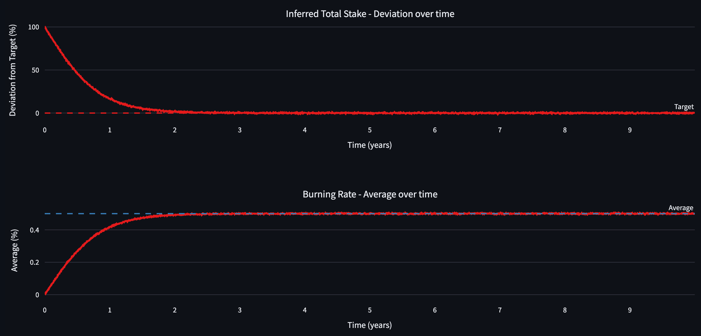
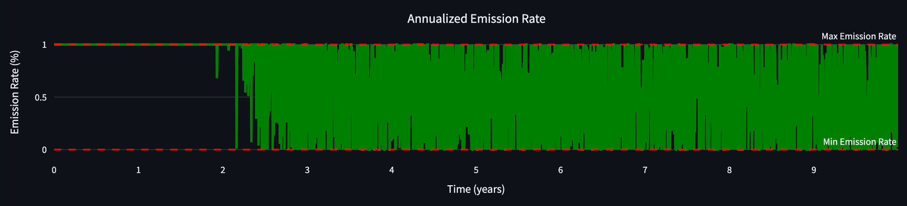
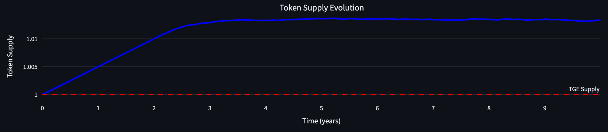
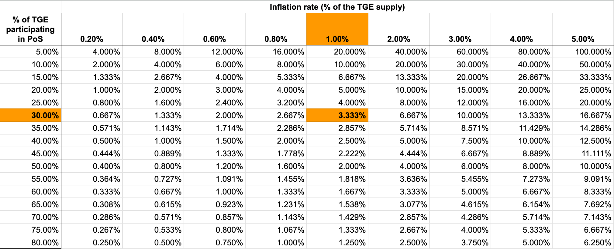
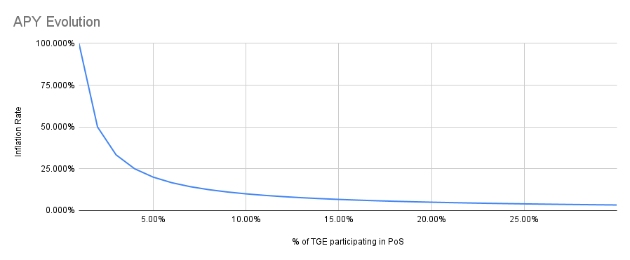

# ANALYSIS-BLOCK-REWARDS

| Field | Value |
| --- | --- |
| Name | [Analysis] Block Rewards |
| Slug | 185 |
| Status | raw |
| Category | Informational |
| Editor | Frederico Teixeira <frederico@logos.co> |
| Contributors | Filip Dimitrijevic <filip@logos.co> |

<!-- timeline:start -->

## Timeline

- **2026-05-27** — [`b7602ed`](https://github.com/logos-co/logos-lips/blob/b7602ed8a225d41ca0bfaaa432524dc84d2ded7e/docs/blockchain/raw/analysis-block-rewards.md) — chore: move blockchain specs from notion to github

<!-- timeline:end -->

# Revisions History

| Version | Changes | Date |
| --- | --- | --- |
| 1.0.0 | Initial revision. | 2026-04-24 |

> Disclaimer:
> This material, including any linked pages or documents, is provided for informational purposes only. It does not constitute investment advice, a solicitation, or an offer to buy or sell any securities, tokens, or other financial instruments, nor should it be construed as legal, financial, or tax advice.
>
> All information regarding project details, token design, distribution mechanisms, technical parameters, and any forward-looking statements is preliminary and subject to change without notice. No representations or warranties are made as to the completeness or accuracy of the information herein. 
>
> Nothing in this material should be relied upon for investment or business decisions. Recipients of this information assume all risks associated with its use and are responsible for seeking independent professional advice regarding any actions based on it.

# Introduction

This document presents an analysis of Logos Blockchain's block rewards mechanism, with the goal of evaluating its sustainability, security guarantees, and long-term economic effects. Block rewards are a cornerstone of the protocols incentive model, ensuring that validators and service providers are compensated while the token supply remains predictable and stable.

## Objectives

The analysis seeks to:

- Model how a KPI-based emission system behaves under different assumptions.
- Quantify the long-term supply curve and inflation path for LGO.
- Assess how quickly the system converges to equilibrium once network participation and fee burning stabilize.
- Identify risks related to delayed convergence, volatility, or adversarial manipulation of inputs.

### Requirements & Rationale

The Logos Blockchain architecture introduces specific requirements that shape this analysis:

- All transaction fees are burned rather than distributed directly to block proposers.
- Rewards are based on global KPIs (inferred total stake, average burning rate) rather than local signals like per-block transactions, which are subject to manipulation.
- Privacy-preserving unlinkability between block proposers and reward recipients requires careful separation of reward timing and allocation.

By anchoring rewards to KPIs that reflect both security (stake) and demand (burning), the mechanism is designed to self-regulate issuance while preserving decentralization and censorship resistance.

### Key Findings

Our simulations under baseline parameters indicate:

- The system begins with a maximum issuance of 1% annually, incentivizing early staking participation.
- As participation and burn rates converge to targets, issuance declines naturally, stabilizing the supply.
- Under baseline assumptions, total long-term inflation is ~1.33% over 10 years, a level broadly comparable to hard money benchmarks like gold.
- The design is robust to short-term volatility due to moving averages and bounded control functions, though delayed convergence of KPIs can temporarily maximize issuance.

# Analysis

# Supply Evolution

The token supply $`S_t`$ evolves according to:

$$
S_{t} = \min \lbrace S_{cap},  S_{tge} \times (1 + \sum_{\tau=1}^t A_\tau \cdot I_{max} \cdot \Delta_\tau) \rbrace.
$$

where:

- $`S_{tge}`$ denotes the token supply at Token Generation Event (TGE).
- $`S_{cap}`$ denotes the maximum allowable token supply (hard cap), if any.
- $`A_t`$ is the emission rate factor on a per year basis.
- $`I_{max}`$ is the maximum emission rate per year.
- $`\Delta_t`$ denotes the fraction of year in one time step per e.g., epoch, block, or day

It is assumed here that $`S_{t-1}`$ already accounts for the burned tokens. This equation implies that the supply evolution does not compound over time, meaning the amount of tokens minted at time $t$ is not proportional to $`S_{t-1}`$.

## Token Supply Curve (Baseline Simulation)

Assume the following parameters for the model:

- $`S_{tge}=1`$ LGO (this allows us to understand the system behavior in $\%$ terms)
- $`S_{cap} = \infty`$
- $`\Delta_t = 1/365`$ (1 day)
- $f=2880$ (the number of 30 seconds intervals in 1 day)
- $`I_{min} = 0\%`$
- $`I_{max}=1\%`$
- $`\alpha_d = 1`$
- $`\alpha_a = 1`$
- $T=0$ days (moving average is ignored)

In addition, we assume the following behavior of the system:

- The simulation runs for $10$ years.
- The volatility of the inferred total stake deviation is $10\%$.
- The deviation between the inferred total stake and the target takes $2$ years to stabilize within $`(\delta_{t} - I_{max}, \delta_{t} + I_{max})`$. Note that this differs from the intrinsic convergence property of the inferred total stake algorithm that needs only one epoch to approximate the true value of the stake (see [\[Analysis\] Total Stake Inference](analysis-total-stake-inference.md) for further details).
- The burn rate converges to $0.5\%$ after $2$ years, with volatility $10\%$.

The figure below shows the evolution of the inferred total stake deviation and the burn rate, given the parametrization above.

> Figure 9: The convergence of the inferred total stake shown in this Figure regards the **true value** reaching the **predefined target**. This only happens when stakers increase their stake or more stakers join. This is a behavioral assumption.

The following figure shows the evolution of the annualized issuance rate:

> Figure 10

Finally, the figure below displays the token supply evolution.

> Figure 11

The final normalized token supply yielded by this specific parametrization is $1.0133$, which implies a total inflation of $1.33\%$ after $10$ years.

There are two strong assumptions in these results:

- It is assumed that both inferred total stake and average burn rate take $2$ years to converge to their respective target and expected values. The longer the time to convergence, the longer the emission rate is maximized, and the more tokens are minted.
- No shocks happen after the system enters the stable regime. Sudden changes in both of the KPIs might trigger token issuances near the boundaries of the interval $`[I_{min}, I_{max}]`$.

## Rewards APY Curve

Block rewards incentivize block production and Blend service. Nodes participation in PoS (leaders) set aside some form of stake and expect compensation for giving up the opportunity cost of participating. The block reward APY, compared against the size of the stake, is in theory the decisive factor in starting or continuing to provide the block proposal service.

In Logos Blockchain, the APY depends on the deviation from the inferred total stake if the target was not reached yet, and on the burning rate if the target was reached. Only the former can be calculated, as the latter depends on the utilization of the blockchain. Therefore, this section only evaluates the APY within the range $`[0,D_{0,target}]`$.

The table below shows the average APY per level of total stake for each choice of $`I_{max}`$ and $`D_{0,target}`$ (expressed in terms of the $`\text{Security Level}`$). The proposed parametrization is highlighted in orange.

> Table 1: Assuming $`\text{Security Level}=30\%`$ and $`I_{max}=1\%`$, the average APY decreases from $`20\%`$ to $`3.33\%`$ as the % of TGE supply participating in PoS increases from $`5\%`$ to $`30\%`$.

Each entry of the table above is computed by:

$$
\text{APY} = \dfrac{I_{max} \times S_{tge}}{D_{0,target}} = \dfrac{I_{max} \times S_{tge}}{\text{Security Level} \times S_{tge}} = \dfrac{I_{max}}{\text{Security Level}}
$$

The figure below zooms in on APY evolution of the proposed parametrization, as the inferred total stake approaches the target.

> Figure 12:

The block reward APY starts at $100\%$ when only $1\%$ of the TGE supply participates in PoS. As more validators participate in PoS, the inferred total stake increases and the average APY decreases.

This APY dynamics achieves the following: the APY is high enough in the beginning to attract new validators, but quickly decreases to a sustainable level that can be maintained in the long term. If only $15\%$ of the TGE participates in PoS (half of the proposed target), the average $6.67\%$ is well within the value observed in other blockchains (source: [Staking Rewards](https://www.stakingrewards.com/assets/proof-of-stake?sort=real_reward_rate&timeframe=7d&order=asc&byChange=false&columns=staking_ratio%2Creal_reward_rate%2Ctotal_roi_365d%2Cinflation_rate)).

The issuance pegged to the inferred total stake incentivizes validators to participate until the rewards APY is small enough to become unattractive for newcomers. This dynamic creates a natural discovery processes, in which the APY is just enough for most validators. Logos Blockchain doesnt overpay or underpay.

This token issuance design should not impact stake variability, given that the token issuance rate is inversely proportional to the total stake. The reward per validator is proportional to the size of the validator's stake with respect to the total stake. The aggregation of validators into pools should more likely be a consequence of infrastructure requirements to run the blockchain rather than a consequence of the token issuance design.

# Risk Considerations

The KPI-based emission rate depends on the KPI not being manipulated. Two actions can mitigate risks:

- Using a moving average value of the KPI, instead of its spot value  this mitigates both true shocks and intentional gamification in the short term.
- Bounding all functions to prevent runaway inflation/deflation  $`I_t`$ is capped, so that the worst case scenario ($`I_t=I_{max}`$) is controllable.

# The Expected Outcome of Combining KPIs

According to the Equation [(1)](block-rewards.md#block-rewards) and KPIs definitions, $`\alpha_d`$ controls the responsiveness of the emission rate to the deviation with respect to a target inferred total stake, while $`\alpha_a`$ converts from annualized burn rate to annualized token emission rates.

For the sake of the following analysis, assume that $`\alpha_d = \alpha_a = 1`$. This allows to directly convert from KPIs to token emission rates.

The beginning of the blockchain has the following features:

- The burning rate, expressed by expected utilization of the blockchain, is expected to be well below $`I_{max}`$.
- The deviation from the target inferred total stake is expected to be far above $`I_{max}`$.

These two aspects imply that, at the beginning of the system, tokens are expected to be minted as block rewards at a rate of $`I_{max}`$ per year. The actual rate will be slightly below $`I_{max}`$ because some tokens will still be burned.

Given that:

- The burning rate can only approach $`I_{max}`$ from below (that is, it increases from $0$ to $`I_{max}`$).
- The current inferred total stake can only approach $`I_{max}`$ from above (that is, it decreases from $100\%$ to $`I_{max}`$),

The expected token issuance of $`I_{max}`$ per year should last at least until the inferred total stake deviates less than $`I_{max} \%`$ from the target.

As the inferred total stake deviation from the target approaches $0\%$, the token issuance rate becomes driven by the annualized burning rate of Execution base fees and Permanent Storage fees.

At this stage, by the definition of the burning rate KPI, the total token supply is expected to stabilize, as the amount of burned tokens is expected to be minted again at a similar rate.

> After certain level of usage, service providers are being overloaded but do not receive payment at the 1:1 ratio. This is done for a few reasons:
>
> - This is equivalent to being paid in two different methods: actual LGO tokens (until $`I_{max}`$ is fulfilled) plus larger stake of the supply (which is decreased more than it is increased).
> - In the beginning, when the network usage is very small and not many nodes participate in PoS, nodes are also paid at the maximum rate of $`I_{max}`$.

If adoption grows and the burning rate exceeds $`I_{max}`$, then the token supply becomes deflationary because the burning rate will be greater than the maximum allowed minting rate.

# References

[HackMDMinimum Viable Issuance - HackMD](https://notes.ethereum.org/@anderselowsson/MinimumViableIssuance)

[Titania ResearchExploring Minimum Viable Issuance (MVI)](https://notes.ethereum.org/@anderselowsson/MinimumViableIssuance)

[HackMDProperties of issuance level (part 1) - HackMD](https://notes.ethereum.org/@anderselowsson/HyUIqjo_6)

[Ethereum ResearchProperties of issuance level: consensus incentives and varia](https://ethresear.ch/t/properties-of-issuance-level-consensus-incentives-and-variability-across-potential-reward-curves/18448)

[Ethereum ResearchPractical endgame on issuance policy](https://ethresear.ch/t/practical-endgame-on-issuance-policy/20747)

[Staking RewardsTop Proof of Stake Tokens | Staking Rewards](https://www.stakingrewards.com/assets/proof-of-stake?sort=real_reward_rate&timeframe=7d&order=asc&byChange=false&columns=staking_ratio%2Creal_reward_rate%2Ctotal_roi_365d%2Cinflation_rate)
