# ANALYSIS-BLOCK-TIMES-BLEND-NETWORK

| Field | Value |
| --- | --- |
| Name | [Analysis] Block Times & Blend Network |
| Slug | 186 |
| Status | raw |
| Category | Informational |
| Editor | David Rusu <davidrusu@logos.co> |
| Contributors | Filip Dimitrijevic <filip@logos.co> |

<!-- timeline:start -->

## Timeline

- **2026-05-27** — [`b7602ed`](https://github.com/logos-co/logos-lips/blob/b7602ed8a225d41ca0bfaaa432524dc84d2ded7e/docs/blockchain/raw/analysis-block-times-blend-network.md) — chore: move blockchain specs from notion to github

<!-- timeline:end -->

# Revision History

| Version | Changes | Date |
| --- | --- | --- |
| 1.0.0 | Initial revision. | 2025-08-20 |

# Introduction

We are interested in finalizing the Cryptarchia and Blend Network parameters. There are some competing requirements here: the Blend Network would like to have longer block times in order to provide better privacy, while Cryptarchia wants shorter block times in order to provide faster finality.

We need to find the right balance that would give us good enough privacy while not sacrificing finality times too much.

# Overview

## Adversary Model

The analysis centres on the block-witholding attack where an adversary does not participate in the main chain, instead building a secret side-chain and releasing it on the network in an attempt to trigger the honest chain to reorg.

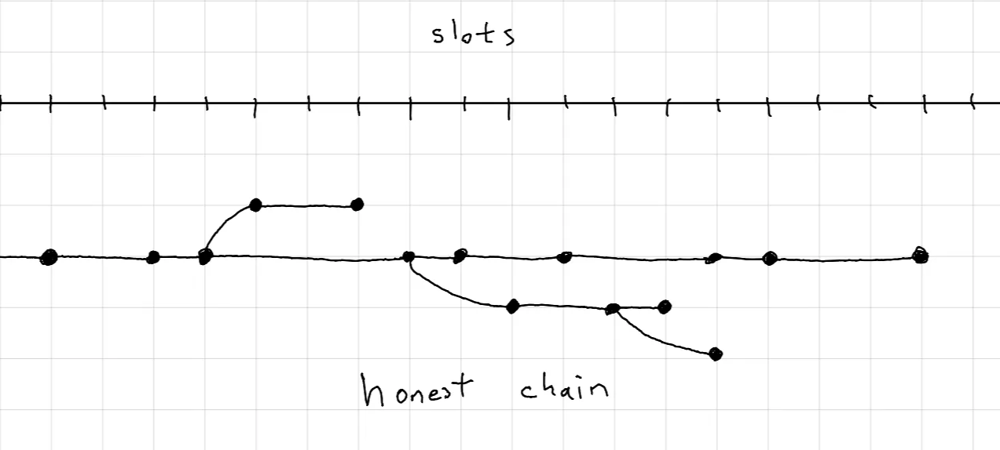

> <sub>We first simulate the honest network to build out a block tree.</sub>

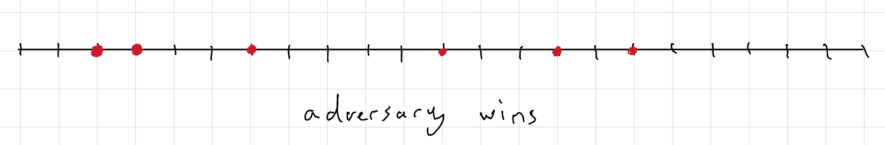

> <sub>We then simulate the adversary slot wins.</sub>

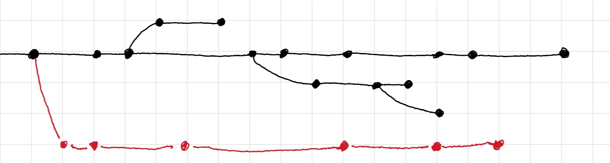

> <sub>We also consider the effect of extending from the honest block tree at each block to see how many reorgs the adversary can induce.</sub>

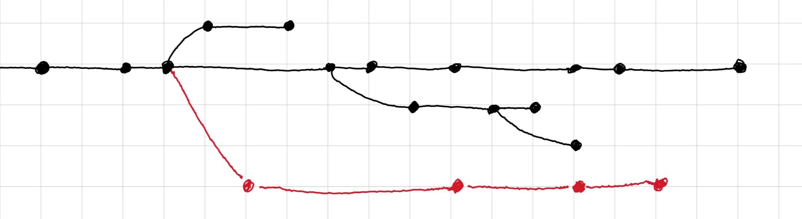

> <sub>This is repeated, with the adversary branch forking off of each block.</sub>

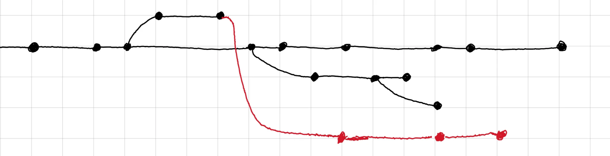

> <sub>The adversary can even boost his attack by continuing abandoned branches.</sub>

### Network Model

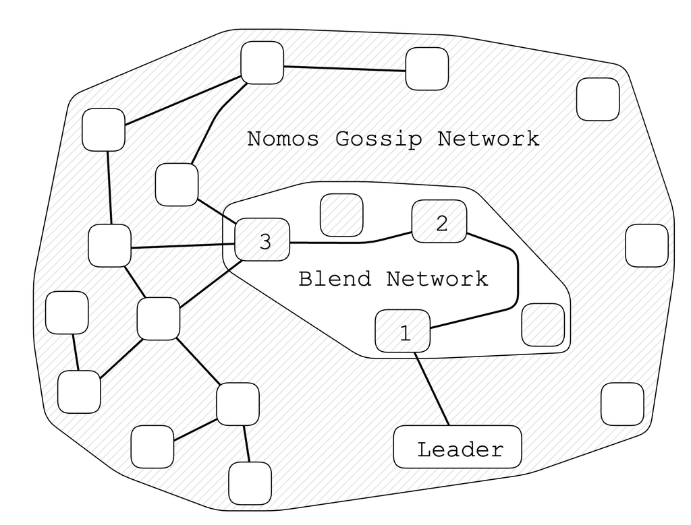

> <sub>Leader proposing a block through the Blend Network.</sub>

```python
blend_network = NetworkParams(
    broadcast_delay_mean=0.5, # seconds
    pol_proof_time=1, # 1 second PoL delay
    blending_delay=3, # seconds spent in each Blend node
    desimenation_delay_mean=0.5, # seconds to disseminate message within Blend
    blend_hops=3, # hops within Blend
)
no_blend_net = replace(blend_net, blend_hops=0)
```

The block delay distribution from the network model looks like this:

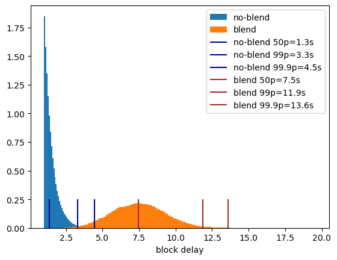

# Choosing a Block Time

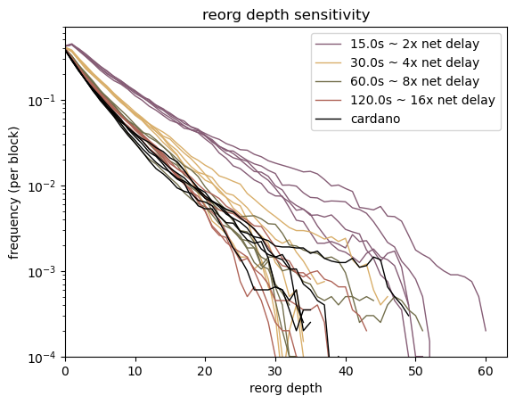

> <sub>30% Adversary</sub>

```python
PATHS = 5
target_block_num = 20000
np.random.seed(0)
stake = np.random.pareto(10, 1000)
network = blend_net
sim_params = Params(
    SLOTS=0,
    f=0.05,
    adversary_control = 0.30,
    honest_stake = stake
)
np.random.seed(1)
sims = [Sim(
    params=replace(
        sim_params,
        SLOTS=int(target_block_num * block_time),
        f=1/block_time
    ),
    network=network
) for block_time in np.array([15, 30, 60, 120]).repeat(PATHS)]
```

# Choosing Blend Parameters

There are two parameters that are of concern here: Number of Hops and the Blending Delay.

The number of hops tells us how many times the block proposal needs to be processed by the network before the proposal is broadcast to the wider network.

The Blending delay tells us the maximum time each message is processed at each hop.

## Number of Hops

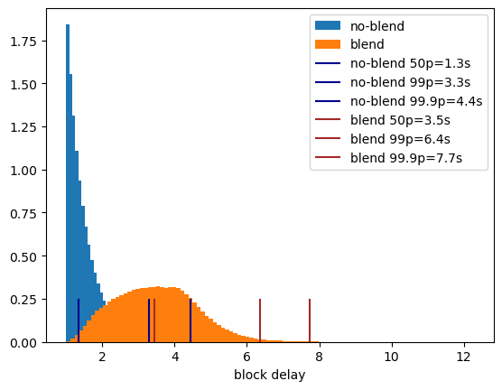

> <sub>1 hop</sub>

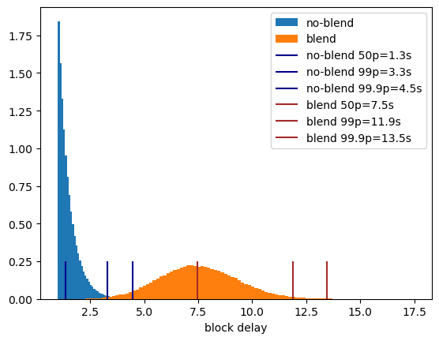

> <sub>3 hops</sub>

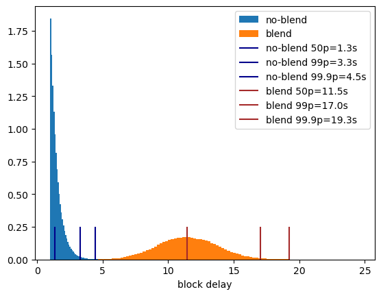

> <sub>5 hops</sub>

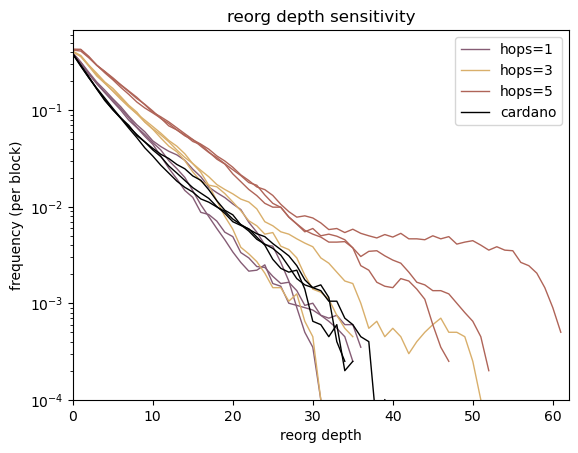

```python
PATHS = 3
target_block_num = 20000
np.random.seed(0)
stake = np.random.pareto(10, 1000)
block_time = 30
sim_params = Params(
    SLOTS=int(target_block_num * block_time),
    f=1/block_time,
    adversary_control = 0.30,
    honest_stake = stake
)
np.random.seed(1)
sims = [Sim(
    params=sim_params,
    network=replace(blend_net, blend_hops=hops)
) for hops in np.array([1, 2, 3]).repeat(PATHS)]
```

From these plots we can see that going above 3 hops begins to induce too many reorgs.

## Blending Delay

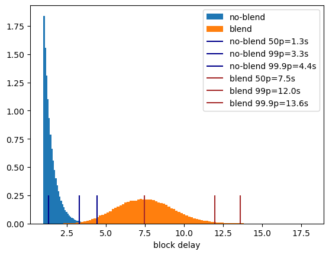

> <sub>3 second Blend delay</sub>

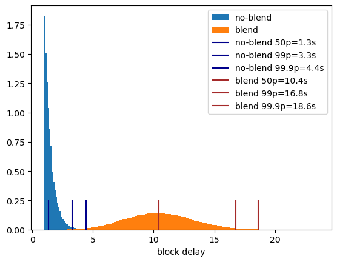

> <sub>5 second Blend delay</sub>

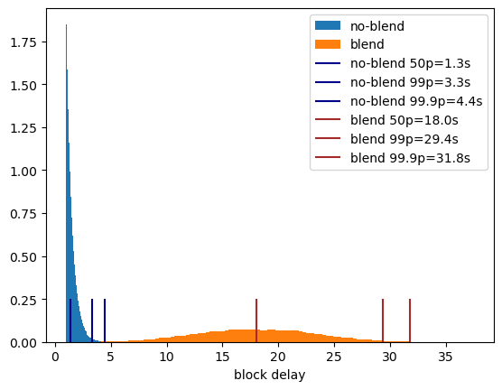

> <sub>10 second Blend delay</sub>

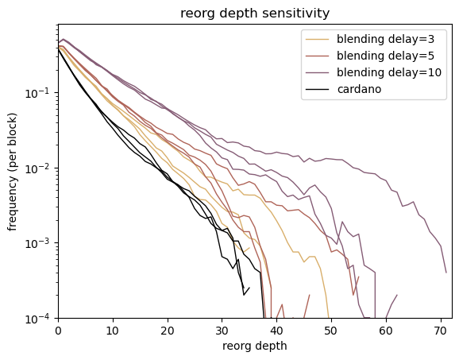

```python
PATHS = 3
target_block_num = 20000
np.random.seed(0)
stake = np.random.pareto(10, 1000)
block_time = 30
sim_params = Params(
    SLOTS=int(target_block_num * block_time),
    f=1/block_time,
    adversary_control = 0.30,
    honest_stake = stake
)
np.random.seed(1)
sims = [Sim(
    params=sim_params,
    network=replace(blend_net, blending_delay=delay)
) for delay in np.array([3, 5, 10]).repeat(PATHS)]
```

A blending delay above 3 seconds induces too many reorgs.

## Impact of Combinations of Hops and Delays

Checking parameters in combinations shows that again, going above 3 hops or above a 3 second delay leads to divergence from the Cardano baseline.

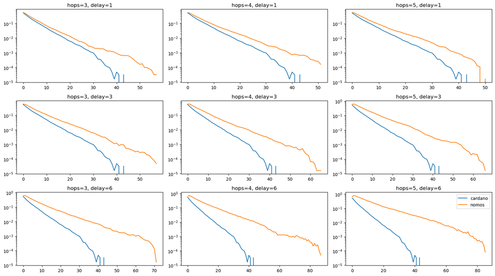

> <sub>25 second block times</sub>

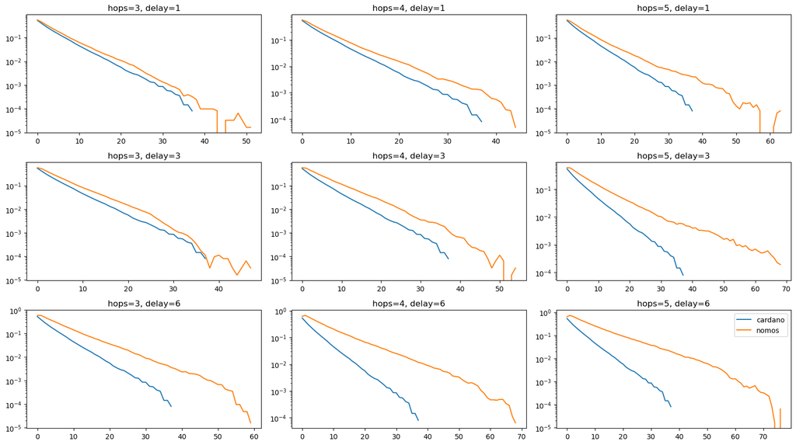

> <sub>30 second block times</sub>

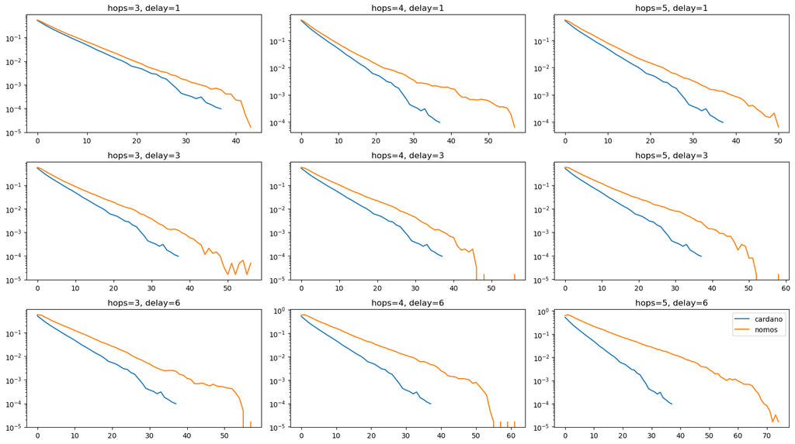

> <sub>35 second block times</sub>

# Powerful Adversaries

With 3 hops and 3 second delays, it’s interesting too look at how the network would behave under different strength adversaries.

## 10% Adversary

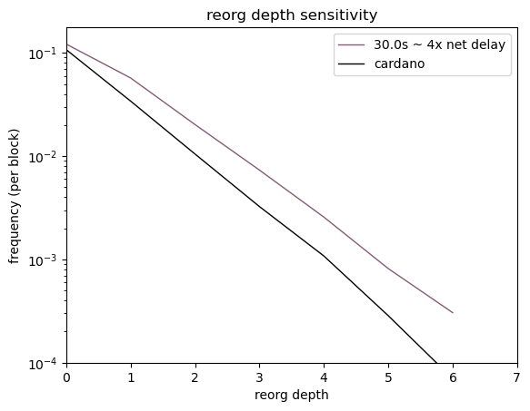

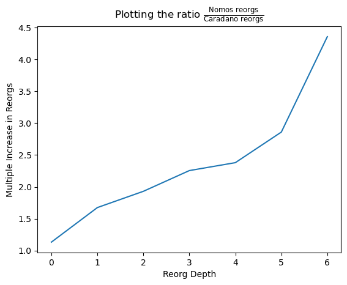

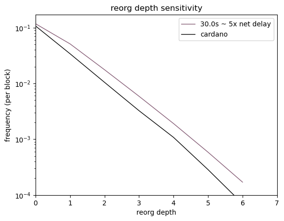

> <sub>2s blending delay</sub>

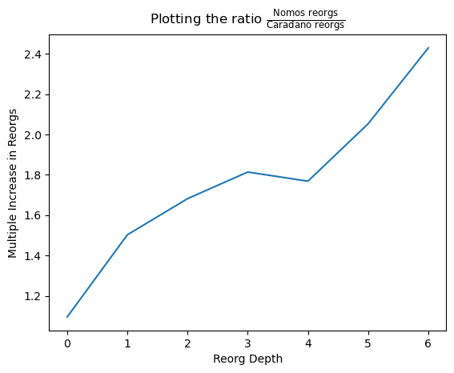

> <sub>2s blending delay</sub>

<details>
<summary>Params</summary>

```python
PATHS = 3
target_block_num = 20000
np.random.seed(0)
stake = np.random.pareto(10, 1000)
network = blend_net
sim_params = Params(
    SLOTS=0,
    f=0.05,
    adversary_control = 0.10,
    honest_stake = stake
)
np.random.seed(1)
sims = [Sim(
    params=replace(
        sim_params,
        SLOTS=int(target_block_num * block_time),
        f=1/block_time
    ),
    network=network
) for block_time in np.array([30]).repeat(PATHS)]
```

</details>

## 30% Adversary

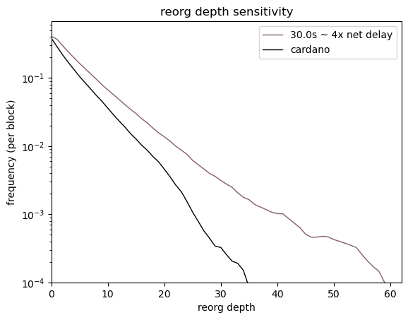

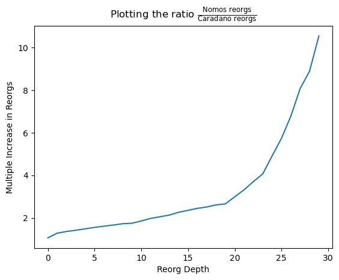


> <sub>2s blending delay</sub>

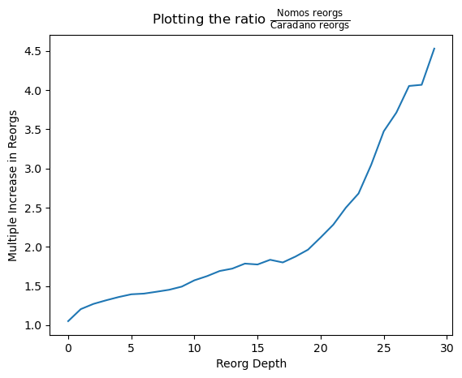

> <sub>2s blending delay</sub>

### 35s block times, 3s blending delay

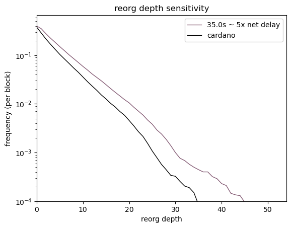

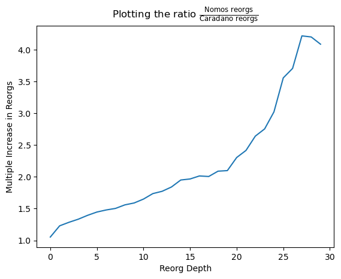

<details>
<summary>Params</summary>

```python
PATHS = 1
target_block_num = 200000
np.random.seed(0)
stake = np.random.pareto(10, 100)
network = blend_net
sim_params = Params(
    SLOTS=0,
    f=0.05,
    adversary_control = 0.3,
    honest_stake = stake
)
np.random.seed(1)
sims = [Sim(
    params=replace(
        sim_params,
        SLOTS=int(target_block_num * block_time),
        f=1/block_time
    ),
    network=network
) for block_time in np.array([30]).repeat(PATHS)]
for i, sim in enumerate(sims):
print(f"simulating {i+1}/{len(sims)}")
    sim.run(seed=i)
print("finished simulation, starting analysis")
advs = [sim.adverserial_analysis() for sim in sims]
print("cardano parameters")
cardano_block_time = 20
cardano_sims = [Sim(
    params=replace(
        sim_params,
        SLOTS=int(target_block_num * cardano_block_time),
        f=1/cardano_block_time,
),
    network=replace(network, blend_hops=0)
) for _ in range(PATHS)]
for i, sim in enumerate(cardano_sims):
print(f"simulating {i+1}/{len(cardano_sims)}")
    sim.run(seed=i)

cardano_advs = [sim.adverserial_analysis() for sim in cardano_sims]
# -------

PATHS = 3
target_block_num = 20000
np.random.seed(0)
stake = np.random.pareto(10, 1000)
network = blend_net
sim_params = Params(
    SLOTS=0,
    f=0.05,
    adversary_control = 0.30,
    honest_stake = stake
)
np.random.seed(1)
sims = [Sim(
    params=replace(
        sim_params,
        SLOTS=int(target_block_num * block_time),
        f=1/block_time
    ),
    network=network
) for block_time in np.array([30]).repeat(PATHS)]
```

</details>

## 40% Adversary

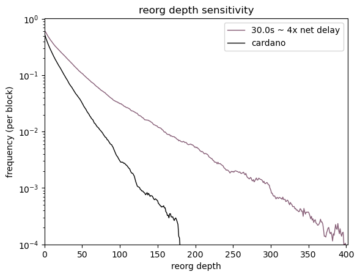

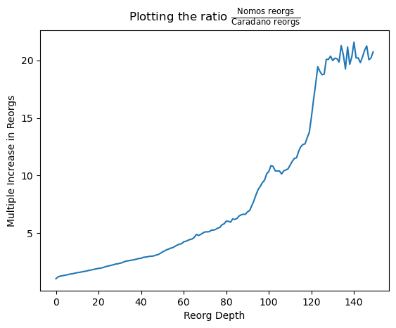

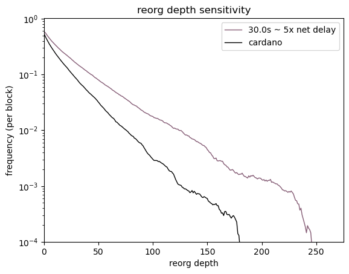

> <sub>2s blending delay</sub>

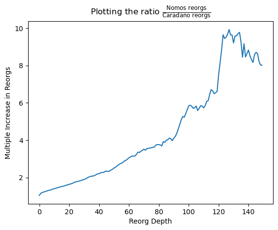

> <sub>2s blend delay</sub>

<details>
<summary>Params</summary>

```python
PATHS = 5
target_block_num = 40000
np.random.seed(0)
stake = np.random.pareto(10, 1000)
network = blend_net
sim_params = Params(
    SLOTS=0,
    f=0.05,
    adversary_control = 0.40,
    honest_stake = stake
)
np.random.seed(1)
sims = [Sim(
    params=replace(
        sim_params,
        SLOTS=int(target_block_num * block_time),
        f=1/block_time
    ),
    network=network
) for block_time in np.array([30]).repeat(PATHS)]
```

</details>

## 45% Adversary

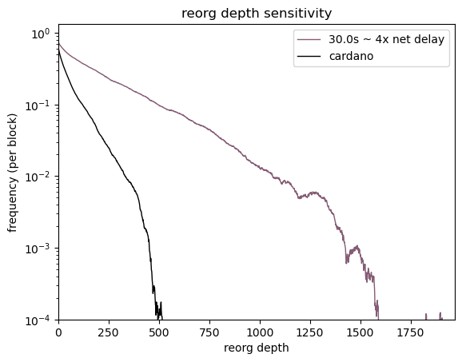

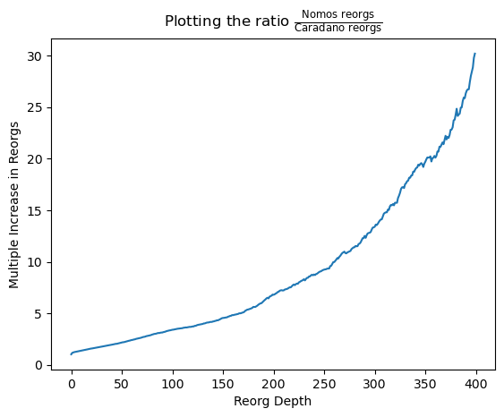

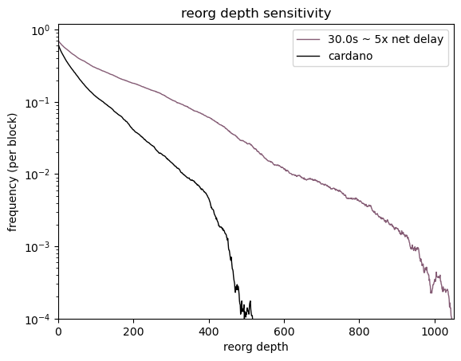

> <sub>2s blending delay</sub>

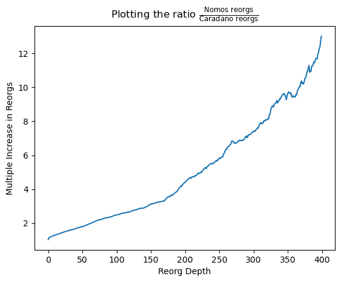

> <sub>2s blending delay</sub>

<details>
<summary>Params</summary>

```python
PATHS = 5
target_block_num = 40000
np.random.seed(0)
stake = np.random.pareto(10, 1000)
network = blend_net
sim_params = Params(
    SLOTS=0,
    f=0.05,
    adversary_control = 0.45,
    honest_stake = stake
)
np.random.seed(1)
sims = [Sim(
    params=replace(
        sim_params,
        SLOTS=int(target_block_num * block_time),
        f=1/block_time
    ),
    network=network
) for block_time in np.array([30]).repeat(PATHS)]
```

</details>

## 49% Adversary

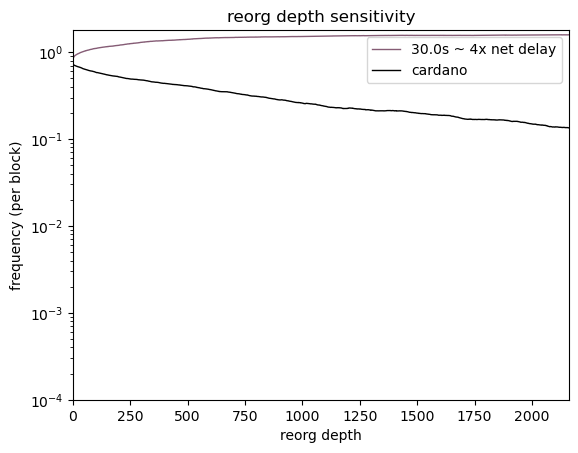

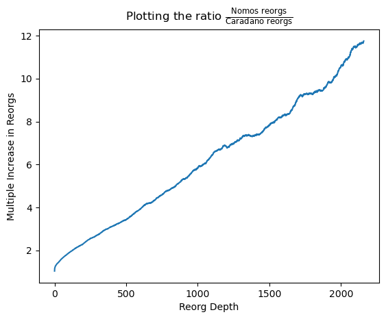


> <sub>2s blending delay</sub>

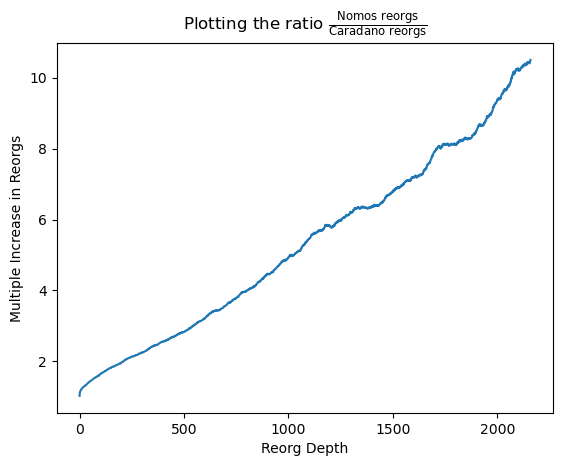

> <sub>2s blending delay</sub>

<details>
<summary>Params</summary>

```python
PATHS = 5
target_block_num = 30000
np.random.seed(0)
stake = np.random.pareto(10, 1000)
network = blend_net
sim_params = Params(
    SLOTS=0,
    f=0.05,
    adversary_control = 0.49,
    honest_stake = stake
)
np.random.seed(1)
sims = [Sim(
    params=replace(
        sim_params,
        SLOTS=int(target_block_num * block_time),
        f=1/block_time
    ),
    network=network
) for block_time in np.array([30]).repeat(PATHS)]
```

</details>

# Conclusion

Our conclusion is that 30s block times, 3 blend hops, 2s blending delay are safe and we propose we use this parameter set for Nomos.

# Annex

## Exploring Analytical Results from Praos

Praos provides the following theorem about the probability of violating the common prefix property:

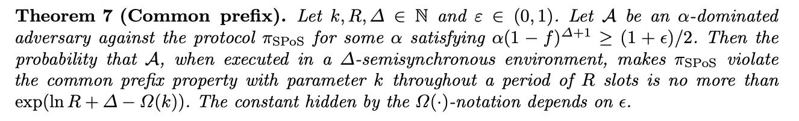

In addition to simulations, we could try to use this analytical results to determine the impact of changing block times and network assumptions.

### Theorem Condition

First we must satisfy the condition $\alpha (1-f)^{\Delta + 1} \ge \frac{1+\epsilon}{2}$ where

- $\alpha$ is the stake held by honest parties
- $f$ is the active slot coefficient
- $\Delta$ is the max network delay
- $\epsilon \gt 0$ is the advantage of the honest network over the adversarial network

We want to understand for a given parameter set, what is the required honest stake $\alpha$ to satisfy the safety condition:

$$
\begin{align}
\alpha (1-f)^{\Delta + 1} &\ge \frac{1+\epsilon}{2} \\

\alpha &\ge \frac{1 + \epsilon}{2(1-f)^{\Delta + 1}}
\end{align}
$$

We can then look at the minimum $\alpha$ that satisfies this condition for Cardano and Nomos.

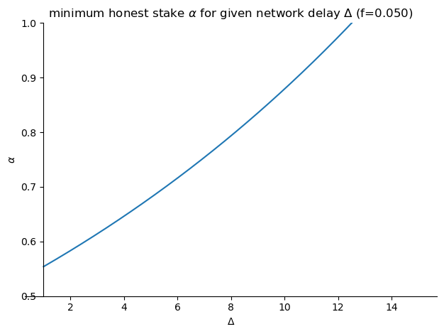

> <sub>Cardano’s parameter set $f=1/20,\epsilon=1e-6$</sub>

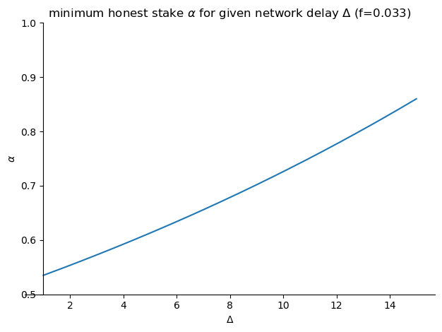

> <sub>Nomos’ parameter set $f=1/30,\epsilon=1e-6$</sub>

Surprisingly, at at 5s max network delay, we are already requiring ~70% of stake to be honest in Cardano.

On Nomos, based on the network modelling we had done, we had a ~14s max delay. This would require 83% of the network to be honest in order to satisfy this condition.


If we change our blending delay to 2s, then we have a ~11s max delay. This would require 75% of the network to be honest in order to satisfy this condition.

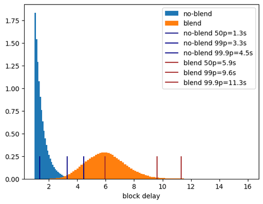

### Probability of Violating Common Prefix

The main result of the theorem states that the probability of violating common prefix is bounded above by $\exp(\ln(R)+\Delta - \Omega(k))$, where $\Omega(k)$ is asymptotic notation reflecting a term that grows at least as fast as $k$.

We can ask the question “how does the probability change if we change our parameters from Cardano’s to Nomos’?”

We don’t know the $\Omega(k)$ term, but we can get the relative change by dividing the Cardano probability by the Nomos probability, and cancel out the $\Omega(k)$ term:

$$
\begin{align}

\frac{\exp(ln(R) + \Delta_{cardano} - \Omega(k))}{\exp(ln(R) + \Delta_{nomos} - \Omega(k))} &= \frac{Re^{\Delta_{cardano}-\Omega(k)}}{Re^{\Delta_{nomos}-\Omega(k)}} \\
&= e^{\Delta_{cardano} - \Delta_{nomos}}
\end{align}
$$

So, we have the ratio $\frac{P(\text{violate common prefix in cardano})}{P(\text{violate common prefix in nomos}}=\exp(\Delta_{cardano} - \Delta_{nomos})$. Plotting this for $\Delta_{cardano}=5$ against different network delays in Nomos gives this plot:

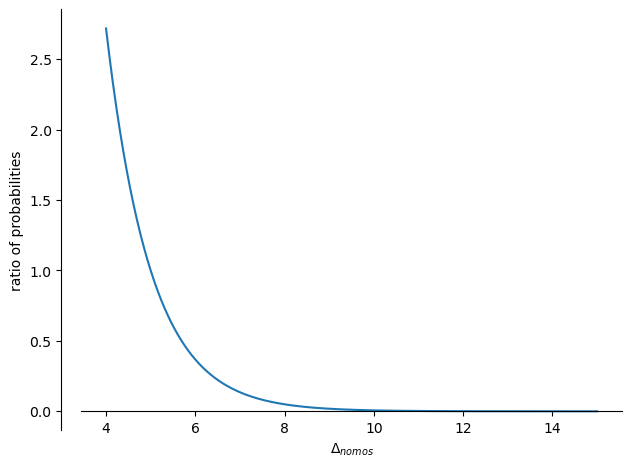

My interpretation of this result is that this probability $\exp(\ln(R)+\Delta - \Omega(k))$ is a very loose upper bound. e.g. reducing network delay by 1s leads to a ~2.7x lower probability, and adding 1 second of delay leads again to a 2.7x higher probability, it’s too sensitive to make useful interpretations.

