# ANALYSIS-COMMUNICATION-ON-TREES

| Field | Value |
| --- | --- |
| Name | [Analysis] Communication on Trees |
| Slug | 187 |
| Status | raw |
| Category | Informational |
| Editor | Alexander Mozeika <alexander.mozeika@logos.co> |
| Contributors | Filip Dimitrijevic <filip@logos.co> |

<!-- timeline:start -->

## Timeline

- **2026-05-27** — [`b7602ed`](https://github.com/logos-co/logos-lips/blob/b7602ed8a225d41ca0bfaaa432524dc84d2ded7e/docs/blockchain/raw/analysis-communication-on-trees.md) — chore: move blockchain specs from notion to github

<!-- timeline:end -->

# Revision History

| Version | Changes | Date |
| --- | --- | --- |
| 1.0.0 | Initial revision. | 2025-08-25 |

# Introduction

We would like to understand how to reduce probability of a communication failure, i.e. when a message sent by a node is “lost” somewhere in the network and not broadcasted. The latter is a main concern as a naive approach of retransmission increases the delay and bandwidth, and reduces anonymity. We have identified two approaches with a potential to reduce communication failure. In the first approach, the sender node uses multiple independent linear paths, i.e. linear trees, to send a message. However, initial analysis suggests that to reduce communication failure in the latter, one must increase the number of communication paths significantly which would have detrimental effect on the bandwidth of a sending node. In the second approach, where the sender node is root of a branching tree, bandwidth of a sending node is only weakly affected by the number communication paths.

First, we assume that a fraction of nodes in the network is adversarial and compute the probability of broadcast and anonymity failures for broadcasting on linear trees. We note that if each communication path has at least one adversarial node then this is considered to be a broadcasting failure and if there is at least one path where all nodes are adversarial then this considered to be anonymity failure. Probabilities are parametrised by the fraction of adversarial nodes, number of paths and number of nodes per path. Second, we compute failure probabilities for broadcasting on branching trees. Assuming the same number of paths, we compare results for linear and branching trees and we find that the linear tree design has better broadcast failure properties than the branching tree design, but worse anonymity failure properties. Finally, we assume that, in addition to adversarial nodes, we also have “faulty” nodes in the network. The latter are unable to relay a messages and their faultiness is a result of some “natural” process. Here we find only quantitative differences with the scenario when only adversarial nodes are considered, but we expect that the model which accounts for “natural” failures to be more realistic.

> Details of mathematical derivations, with references to literature, and additional numerical results are provided in the [Appendix](#details-of-derivations).

# Overview

This document investigates methods to reduce communication failures in network messaging by comparing two primary designs: linear trees and branching trees. The study focuses on minimizing broadcast failures (lost messages) and anonymity failures (privacy breaches) while considering bandwidth constraints.

The analysis uses probabilistic models and recursive equations to compute failure probabilities under adversarial and faulty node conditions. For linear trees, broadcast and anonymity failures are derived based on path length and the number of independent paths. For branching trees, recursive methods determine critical thresholds where failures become inevitable.

A two-variable model is introduced to separate natural faults from adversarial behavior, improving realism. Simulations validate theoretical results, showing trade-offs:

- Linear trees offer better broadcast reliability but worse anonymity and higher bandwidth costs.
- Branching trees reduce anonymity risks and bandwidth usage but are more vulnerable to shared-node failures.

The findings guide design choices based on network priorities (e.g., reliability vs. privacy) and constraints (e.g., node bandwidth). The appendix includes detailed derivations and simulation results.

# Analysis

## Communication on Linear Trees

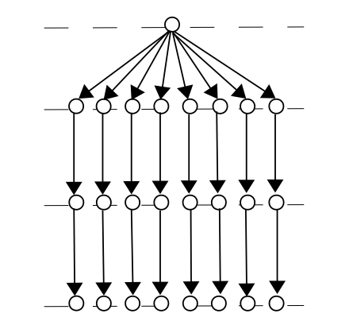

> Communication on Linear Trees. The node sends a message through $`K`$ communication paths where each path is a *linear* tree constructed from exactly $`L`$ nodes.

We assume that a node sends a message through $K$ communication paths where each path is a linear tree constructed from exactly $L$ nodes (see figure above). We assumed that $L\times K$ nodes were sampled (with replacement) from the population of $N$ nodes where $`N_F`$ nodes are “faulty”. If a path contains at least one faulty node then communication failure occurred. If all $K$ paths have communication failure then broadcast failure occurred.

If nodes in communication paths are sampled with replacement from the $N$ network nodes with $`N_F \lt N`$ faulty nodes then the probability that a node is faulty is $`q=N_F/N`$. The probability of broadcast failure is given by

$$
\mathrm{P}_b=\left[1-(1-q)^L\right]^{K}.
$$

We note that in the limit $L\rightarrow\infty$, such that $K/L\rightarrow0$, the probability of broadcast failure $`\mathrm{P}_b\rightarrow1`$ and in the limit $K\rightarrow\infty$, such that $L/K\rightarrow0$, the probability $`\mathrm{P}_b\rightarrow0`$.

Let us now assume that $q$ is the probability that a node is “curious”. Then the event "there is at least one path where all nodes are curious" is the anonymity failure. The probability of anonymity failure is given by

$$
\mathrm{P}_a=1-(1-q^L)^{K}.
$$

We note that in the limit $L\rightarrow\infty$, such that $K/L\rightarrow0$, the probability of anonymity failure $`\mathrm{P}_a\rightarrow0`$ and in the limit $K\rightarrow\infty$, such that $L/K\rightarrow0$, the probability $`\mathrm{P}_a\rightarrow1`$.

Above analytic expressions, derived for infinite number of random samples, for failure probabilities are in good agreement with probabilities computed from a finite number of samples obtained in simulations as can be seen in figures below

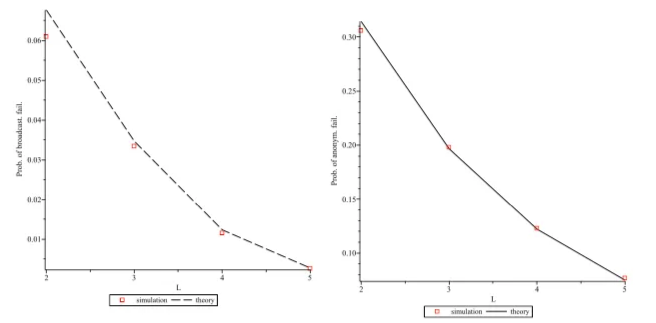

> Analysis  of failures in  $`2^L`$ linear trees with $`L`$ layers. Left: The probability of broadcast failure plotted as a function of number of layers $`L`$ for the fraction  $`q=0.3`$ of faulty nodes.  Right: The probability of anonymity failure plotted as a function of the number of layers $`L`$ for the fraction  $`q=0.3`$ of “curious” nodes. In simulation probabilities were computed from $`M=10^4`$ samples.

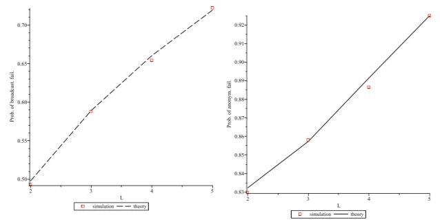

> Analysis of failures in $`2^L`$ linear trees with $`L`$ layers. Left: The probability of broadcast failure plotted as a function of number of layers $`L`$ for the fraction $`q=0.6`$ of faulty nodes. Right: The probability of anonymity failure plotted as a function of the number of layers $`L`$ for the fraction $`q=0.6`$ of “curious” nodes. In simulation probabilities were computed from $`M=10^4`$ samples.

We note that the number of samples $M$ in above figures is equivalent to the number of messages sent by a sender node.

## Communication on Branching Trees

### Assumptions

We consider broadcasting on a tree $`\mathcal{T}_L`$ with layers labeled, from leaf nodes to the root node, by the set $`\{0,1,\ldots,L\}`$ (see figure below). All nodes in a tree at the same distance from its root constitute a layer. We assume that the root node of $`\mathcal{T}_L`$ is sending a message to leaf nodes. A node inside $`\mathcal{T}_L`$ is relaying a message to $b$ nodes, i.e. $`\mathcal{T}_L`$ is $b$-ary tree.  The set of all leaf node is the “boundary” $`\partial\mathcal{T}_L`$ of the tree $`\mathcal{T}_L`$. $b$-ary tree $`\mathcal{T}_L`$ is balanced and complete if all distances from the root node to a leaf node are the same.

In this document we consider only balanced and complete $b$-ary trees. The number of leaf nodes $`\vert\partial\mathcal{T}_L\vert=b^L`$ is also the number of paths from the root node to leaf nodes. If all leaf nodes didn't receive a message sent from the root node then broadcast failure occurred. Let us now assume that $q$ is the probability that a node is “curious”. Then the event "there is at least one path where all nodes are curious" is the anonymity failure.

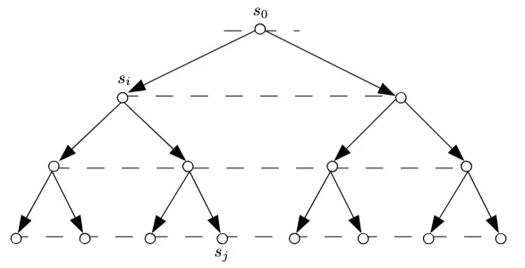

> Communication on a (balanced and complete) tree $`\mathcal{T}_L`$. The layers in the tree are labeled by the set $`\{0,1,\ldots,L\}`$ (bottom to top).  A message is sent from the root node (layer $`L`$)  to the leaf nodes (layer $`0`$). All leaf nodes of the tree $`\mathcal{T}_L`$ constitute its boundary $`\partial\mathcal{T}_L`$. Each node in the tree, but the root, has associated with it binary random variable.

### Analysis of communication failures

The prob. of broadcast failure $`B_{L}`$ in the tree with $L$ layers and branching parameter $b$ can be computed recursively (see the [Details of derivations](#details-of-derivations) section) via the following set of equations

$$
B_{L}=\mathrm{P}^b_{L-1}\\
\quad \mathrm{P}_{\ell+1}=1-(1-q)\left[1-\mathrm{P}^b_{\ell}\right]\\
\mathrm{P}_{0}=q
$$

Solving above equations gives the following results

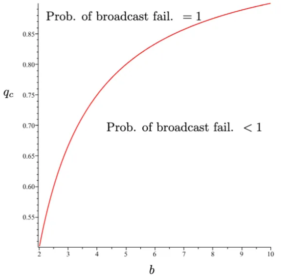

> The (critical) probability that a node is faulty,  $`q_c=(b-1)/b`$, as a function of tree branching factor $`b`$. For $`q \gt q_c`$ broadcast  on a tree is only possible for a small number of layers.  For $`q \lt q_c`$ broadcast is possible for *infinite* number of layers.

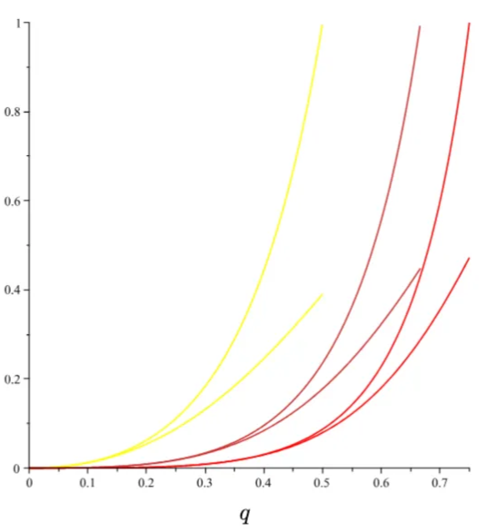

> The probability of broadcast failure (lower and upper bound) plotted as a function of probability that a node is faulty,  $`q`$, for the  values of tree branching factor $`b=\{2,3,4\}`$ (yellow, orange, red). Here $`q \lt q_c`$ and the lower bound corresponds to a branching tree with $`3`$ layers. The upper bound corresponds to a branching tree with an *infinite* number of  layers.

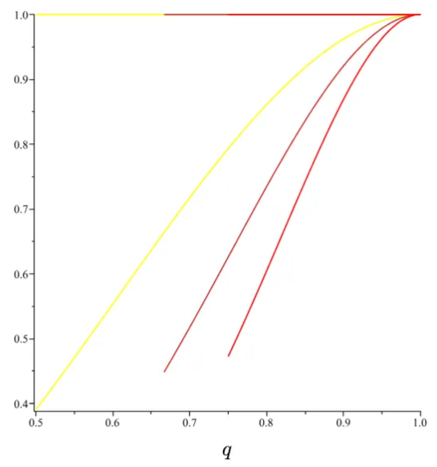

> The probability of broadcast failure (lower and upper bound) plotted as a function of probability that a node is faulty,  $`q`$, for the  values of tree branching factor $`b=\{2,3,4\}`$ (yellow, orange, red). Here $`q \gt q_c`$ and the lower bound corresponds to a branching tree with $`3`$ layers. The upper bound corresponds to a branching tree with an *infinite* number of  layers.

### Analysis of anonymity failure

The prob. of anonymity failure $`A_{L}`$ in the tree with $L$ layers and branching parameter $b$ can be computed recursively (see the [Details of derivations](#details-of-derivations) section) via the following set of equations

$$
A_{L}=1-\left[1-\mathrm{P}_{L-1}\right]^b\\
\mathrm{P}_{\ell+1}=q\left[1-\left[1-\mathrm{P}_{\ell}\right]^b\right]\nonumber\\
\mathrm{P}_{0}=q
$$

Solving above equations gives the following results

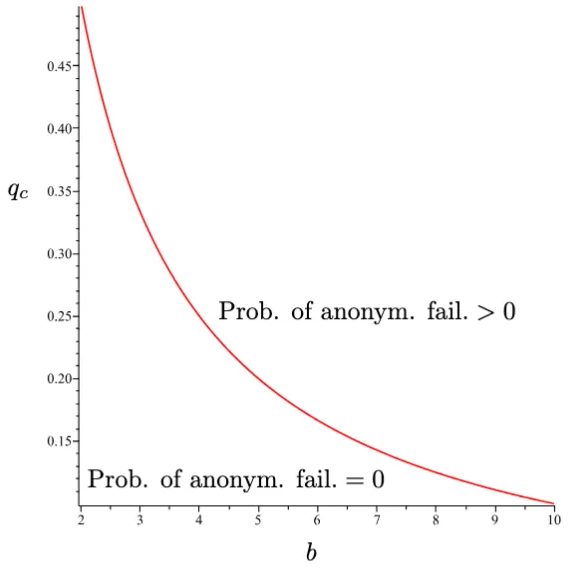

> The (critical) probability that a node is “curious”,  $`q_c=1/b`$, as a function of tree branching factor $`b`$.   For $`q_c \lt q \lt 1`$ the probability  of anonymity failure is bounded away from $`0`$ and $`1`$ for *infinite* number of layers, i.e. the probability  of anonymity failure is approaching a non-zero value with increasing number of layers in a tree.  For $`q \lt q_c`$ the probability  of anonymity failure is exactly $`0`$ for infinite number of layers.

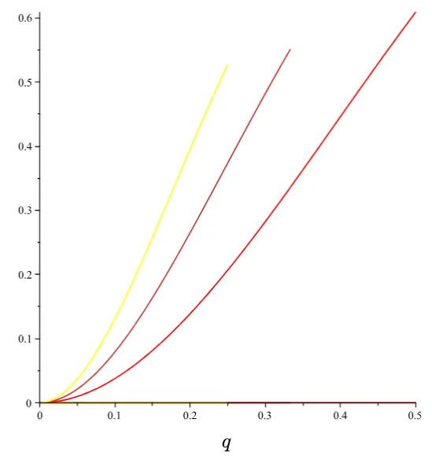

> The probability of anonymity failure (lower and upper bound) plotted as a function of probability that a node is “curious”,  $`q`$, for the  values of tree branching factor $`b=\{2,3,4\}`$ (red, orange, yellow). Here $`q \lt q_c=1/b`$ and the lower bound, given by $`0`$,  corresponds to a branching tree with an *infinite* number of layers. The upper bound corresponds to a branching tree with $`3`$ layers.

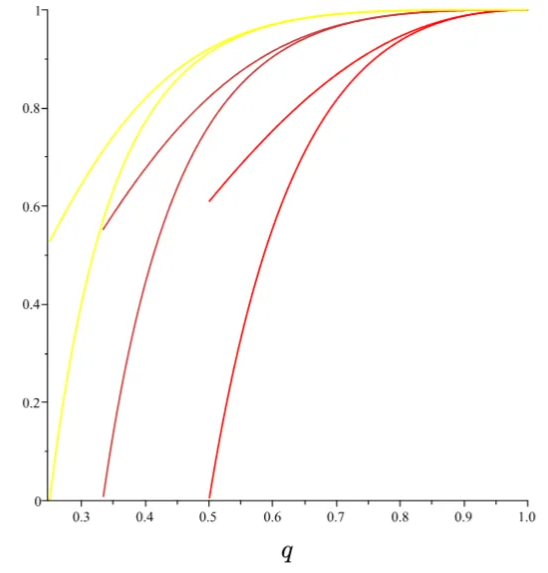

> The probability of anonymity failure (lower and upper bound) plotted as a function of probability that a node is “curious”,  $`q`$, for the  values of tree branching factor $`b=\{2,3,4\}`$ (red, orange, yellow). Here $`q \gt q_c=1/b`$ and the lower bound  corresponds to a branching tree with an *infinite* number of layers. The upper bound corresponds to a branching tree with $`3`$ layers.

### Results of simulations

Above analytic results, derived for infinite number of random samples, for failure probabilities are in good agreement with probabilities computed from a finite number of samples obtained in simulations as can be seen in figures below

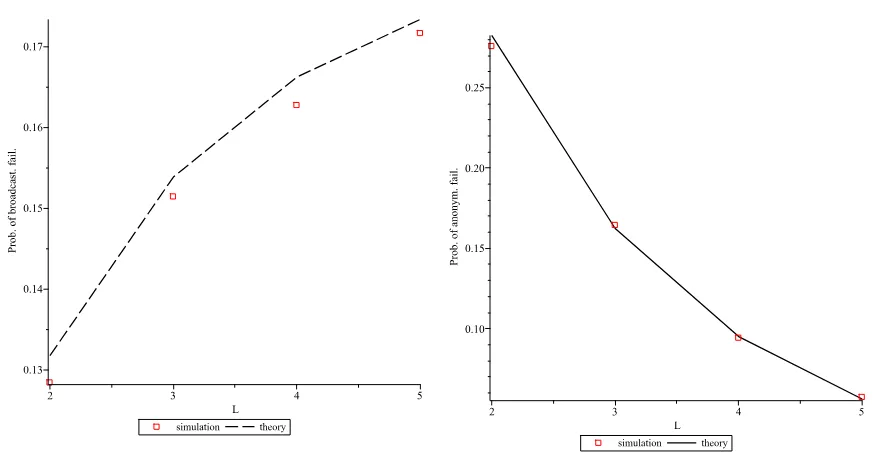

> Analysis of failures in branching trees with branching factor $`b=2`$ . Left: The probability of broadcast failure plotted as a function of number of layers $`L`$ for the fraction $`q=0.3`$ of faulty nodes.  Right: The probability of anonymity failure plotted as a function of the number of layers $`L`$ for the fraction  $`q=0.3`$ of “curious” nodes. In simulation probabilities were computed from $`M=10^4`$ samples.

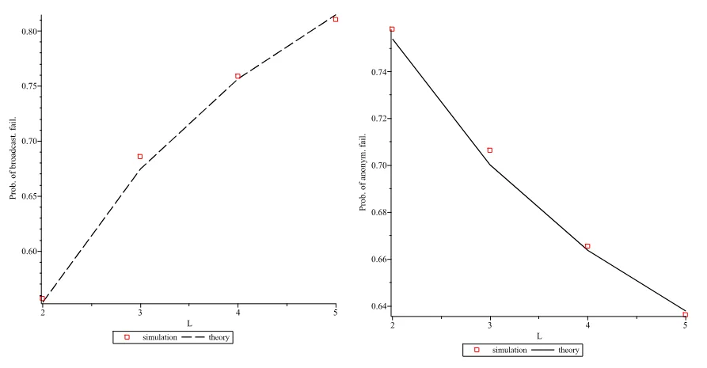

> Analysis of failures in branching trees with branching factor $`b=2`$. Left: The probability of broadcast failure plotted as a function of number of layers $`L`$ for the fraction $`q=0.6`$ of faulty nodes. Right: The probability of anonymity failure plotted as a function of the number of layers $`L`$ for the fraction $`q=0.6`$ of “curious” nodes. In simulation probabilities were computed from $`M=10^4`$ samples.

- We note that the number of samples $M$ in above figures is equivalent to the number of messages sent by a sender node.

### Discussion of results for linear and branching tree designs

Discussion of difference between designs

The number of leaf nodes in the branching tree is $`b^L`$ , where $b$ is the branching parameter and $L$ is the number of layers, which is also the number of communication paths. To compare the two designs we assume that both of them have the same number of communication paths. The latter implies that the total number of nodes used in linear tree design is $`1+L b^L`$ (the number of nodes in linear tree design is $1+KL$, where $K$ is the number of paths and $L$ is the number of nodes in a path without the sender node) and in branching tree design is $`1+b+b^2+\cdots+b^L`$. We note that the number of paths grows exponentially with the number of layers $L$ (and branching parameter $b$) as can be seen in the figure below

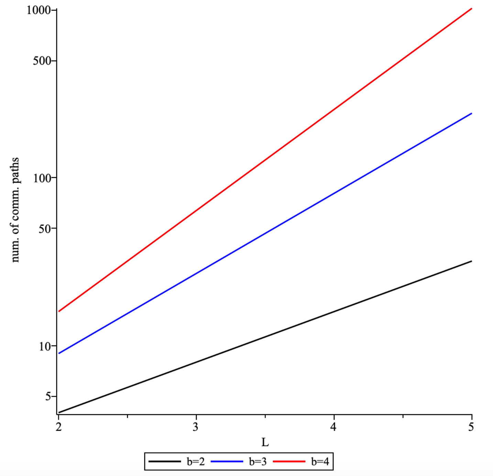

The consequences of having $`b^L`$ comm. paths in both designs is that the out-degree of a sender node in linear design is $`b^L`$ and in branching design is $b$. However, the out-degree is the number of messages sent by a node and hence the number of messages which have to be sent by a sender node grows exponentially in the linear design, but in the branching design it is a constant, i.e. $b$. This suggests that the out-degree of a sender node (in linear and branching designs) is constrained by bandwidth of a node.

The ratio $`\text{num. of nodes}/\text{num. of comm. paths} = L`$ in the linear design and in the branching design the $`\text{num. of nodes}/\text{num. of comm. paths} = \left(\frac{b^{L+1}-1}{b-1} -1\right)/b^L \leq b/(b-1)`$, i.e. the ratio is growing linearly with $L$ in the linear design and it is at most $b/(b-1)$, i.e. a constant, in the branching design.

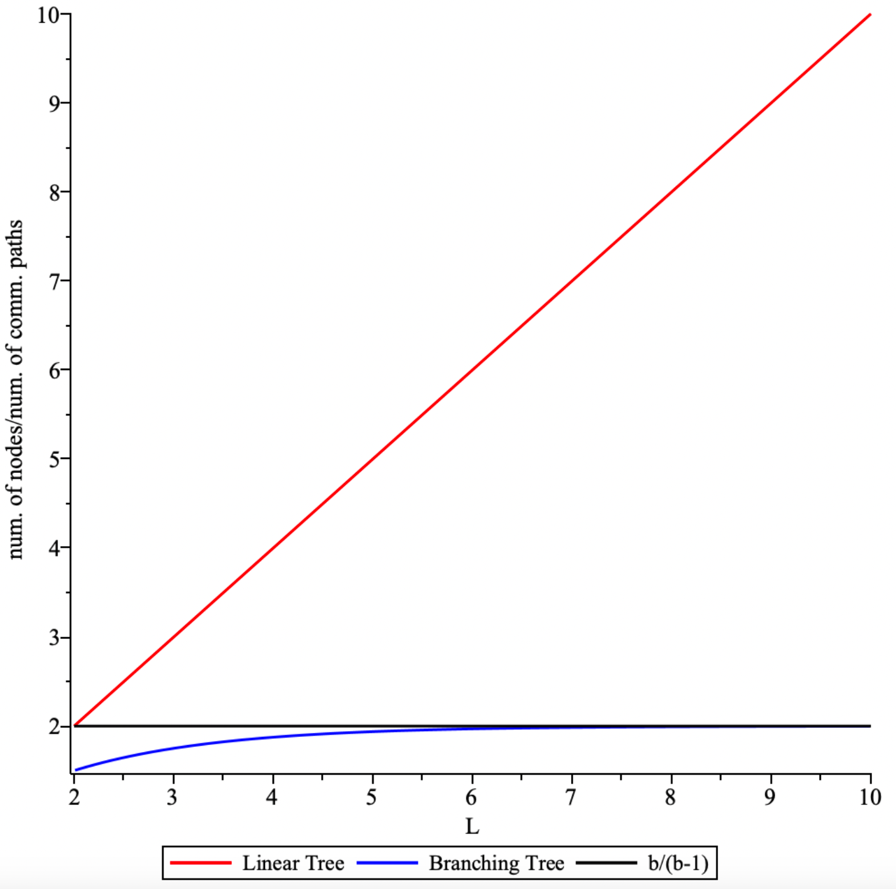

Given that the number of communication paths is the same in both designs, the bandwidth consumption "pattern" is very different between these two designs. In linear tree design the root node has to send $`b^L`$ messages to other nodes and other nodes, but leaf nodes, receive a single message and send a single message. In branching tree design the root node sends $b$ number of messages to other nodes and other nodes, but leaf nodes, receive a single message and send $b$ messages. For the branching tree design a node might need to send the same number of messages as in the linear tree design as we might not be able to [encode messages](blend-protocol.md) in a way that it will be able to use topology efficiently.

For now bandwidth optimisation is not a priority as it depends on possibility of efficient implementation of a communication design which is not investigated at the moment.  Assuming that branching tree design can be implemented efficiently, the root node in the linear case is more "chatty", where the number of messages sent is equal to the number of comm. paths, than in the branching case, where the number of messages sent is equal to the branching parameter and is independent from the number of comm. paths, which would make "anonymity" properties of the sender (root node) in these designs very different which has to be taken in to consideration when making decision on which design to choose.

Discussion of results for failures

We assume that the number of comm. paths in both designs is $`K=b^L`$ and consider communication and anonymity failures. For anonymity failure we will use the same statistical model as for communication failure, with "faulty" replaced by "curious", and the same probability $q$ that node is faulty or curious. The linear tree design has better communication failure properties than the branching tree design but worse anonymity failure properties as can be seen in two figures below

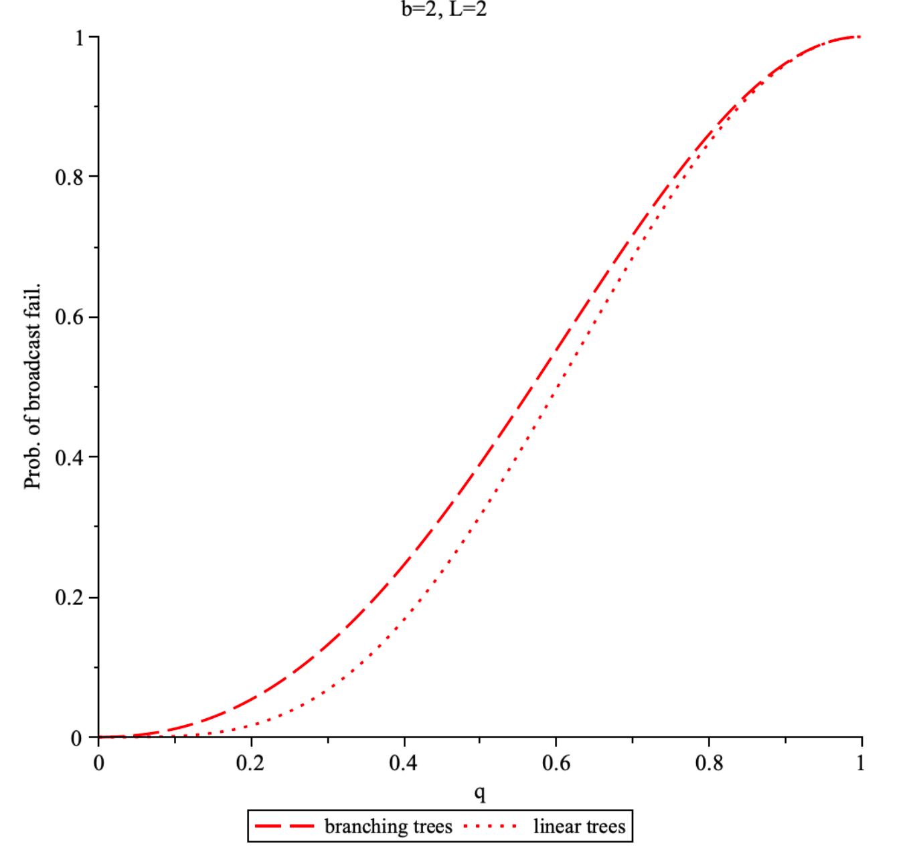

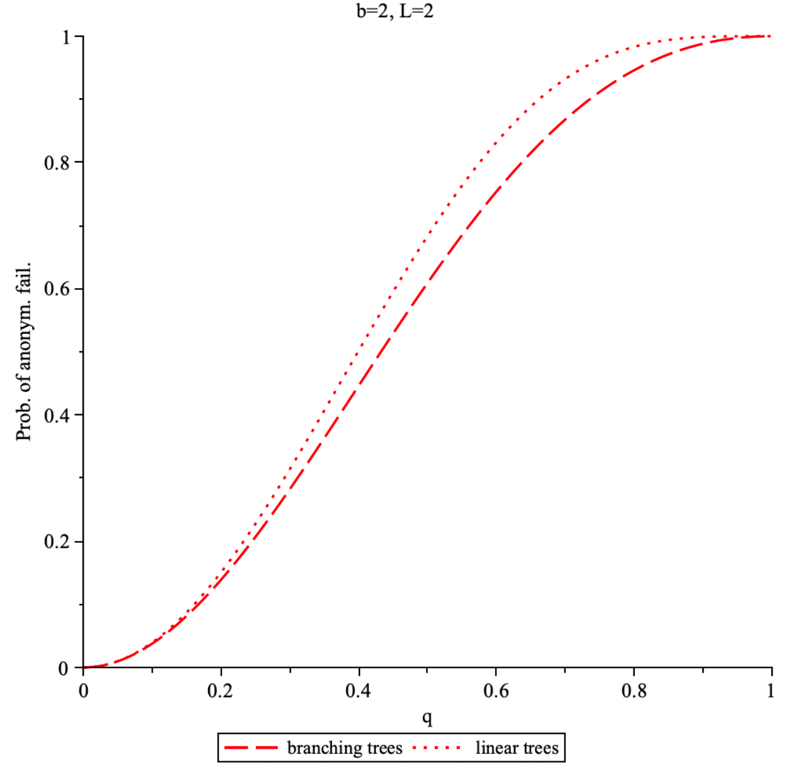

We want to find a solution that minimises both failure probabilities. Plotting one prob. against another gives us

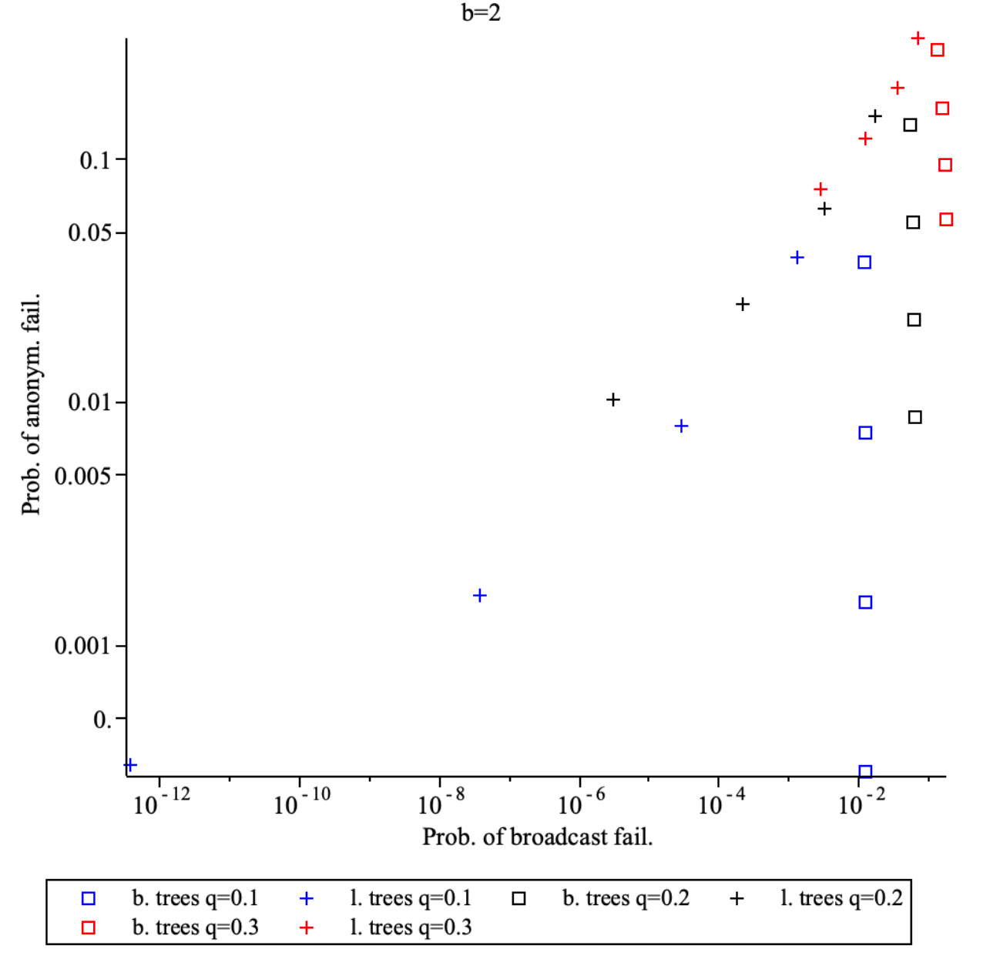

We note that $L$ in above is increasing from top to bottom. For linear tree design both probabilities are minimal for $L=5$, i.e. maximum number of layers. For branching tree design we can not minimise both probabilities , but the probability of anonymity failure is always less than in the linear tree design for any $L$.  Also, we note that linear trees design has better communication failure properties since it consists of $`b^L`$ independent paths. Paths in branching trees design share nodes which increases the ramifications of communication failure at an interior node. On the other hand, linear trees has worse anonymity properties since it consists of more nodes to form the $`b^L`$ paths.

Discussion of failure model

The current approach, where we label a node by a single binary (random) variable, can be used to model only communication failures or anonymity failures but not both.  When both communication and anonymity failures are modelled with a single binary variable then this can be interpreted as a scenario where an adversary controls some number of nodes in a tree. Then it uses these nodes to cause broadcast failure or anonymity failure. Hence here a probability of failure can interpreted as frequency of adversarial opportunities to cause failures.

We note that in above single-variable approach adversary is cause of both communication and anonymity failures, when both of these failures are considered together. However, in real world scenario communication failures can occur “naturally” and independently from adversarial behaviour. The latter can also cause communication failures, but natural failures can for e.g. interfere with adversary’s ability to cause anonymity failure which is not accounted for in the current single-variable model.

We note that an adversary can use communication failures to provoke node operators to increase number of communication paths, but the latter could increase chances of anonymity failure. Such adversarial strategy can be used in the linear design for example.

In order to separate “natural” communication failures from adversarial, we need to introduce two (random) binary variables which will be associated with a node. One variable to model natural communication failures of nodes and the other variable is an adversarial “label”, i.e. second variable labels a node as "adversarial" or "honest". The adversary will choose on how to use nodes it controls. It can use these nodes to cause communication failure, anonymity failure, etc. From analysis perspective a two-variable model is not much more complex than single-variable model, but will allow us to separate better adversarial failures from non-adversarial.

## Communication on Linear Trees: two-variable failure model

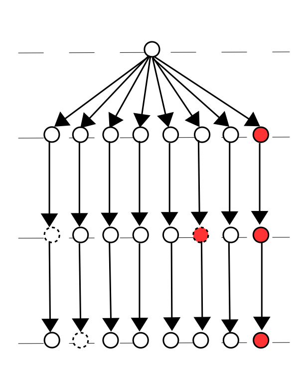

> Communication on Linear Trees. A message is sent from a node through $`K`$ communication paths where each path has $`L`$ nodes. A node could be faulty (circle with dashed boundary), or adversarial (red circle). Presence of faulty node leads to communication failures. Presence of adversarial nodes could lead to communication and anonymity failures.

We assume that a node sends a message through $K$ communication paths where each path contains exactly $L$ nodes. We assumed that $L\times K$ nodes were sampled with replacement from the population of $N$ nodes.

### Analysis of broadcast failure

We assume that $`M_F`$ nodes in the population are “faulty” (faulty node is unable to relay a message).  The probability that a node is faulty is $`q_F=M_F/N`$. If a path contains at least one faulty node then communication failure occurred. If all nodes in a communication path are non-faulty then this is a functioning communication path. If all $K$ paths have communication failure then broadcast failure occurred. The probability of broadcast failure is given by

$$
\mathrm{P}_b=\left[1-(1-q_F)^L\right]^{K}.
$$

We note that $`\mathrm{P}_b`$ is (monotonic) decreasing function of $K$ and (monotonic) increasing function of $L$.  Above result is intuitive as increasing number of communications paths (of fixed length) increases chances that at least one of these paths is functional.  Also increasing length of paths (for a fixed number of paths) increases chances that in each path at least one node is faulty.  For $K\rightarrow\infty$, with $L$ fixed, the prob. $`\mathrm{P}_b\rightarrow0`$ and for $L\rightarrow\infty$, with $K$ fixed, the prob. $`\mathrm{P}_b\rightarrow1`$.

We note that anonymity properties are improved for larger $L$ (see [Analysis of anonymity failure](#analysis-of-anonymity-failure-1)) and we would like to find a relation between $K$ and $L$ such that we have both good communication and anonymity properties. Let us assume that $K=f(L)$, where $`f(L)\in \mathbb{N}`$, and consider the prob. $`\mathrm{P}_b`$. For the latter we have the following inequality

$$
\mathrm{P}_b=\left[1-(1-q_F)^L\right]^{K}=\mathrm{e}^{f(L)\log\left(1-(1-q_F)^L\right)}\\\quad \leq \mathrm{e}^{-f(L)(1-q_F)^L},
$$

where in above we used $\log(x)\leq x-1$ to obtain inequality.  Hence for $K=f(L)$ we can have $`\mathrm{P}_b\rightarrow0`$ when $`f(L)(1-q_F)^L\rightarrow\infty`$ as $L\rightarrow\infty$.

We note that $`f(L)(1-q_F)^L=\mathrm{e}^{L[\log(1-q_F)+\frac{1}{L}\log f(L)]}`$ and hence for any $`\epsilon \gt 0`$ the following condition

$$
\frac{1}{L}\log f(L)= -\log(1-q_F)+\epsilon
$$

ensures that $`\mathrm{P}_b\rightarrow0`$ when $L\rightarrow\infty$. Above suggests

$$
f(L)= \mathrm{e}^{L[-\log(1-q_F)+\epsilon]}=\left(\frac{\alpha}{1-q_F}\right)^L,
$$

where $`\alpha=\mathrm{e}^\epsilon`$, i.e. the number of paths has to grow exponentially with $L$ to ensure that $`\mathrm{P}_b\rightarrow0`$ when $L\rightarrow\infty$.

### Analysis of anonymity failure

We assume that $`M_A`$ nodes in the population are “adversarial”;  adversarial nodes are controlled by an adversary which can make nodes faulty, use them for traffic analysis, etc. The probability that a node is adversarial is $`q_A=M_A/N`$. If there is at least one functioning communication paths where all nodes are adversarial, then adversary has opportunity to cause anonymity failure. The probability of anonymity failure is given by

$$
\mathrm{P}_a=1-\left[1-[(1-q_F)\, q_A]^L\right]^{K}.
$$

We note that $`\mathrm{P}_a`$ is (monotonic) increasing function of $K$ and (monotonic) decreasing function of $L$.  Also $`\mathrm{P}_a`$ is monotonic increasing function of $`(1-q_F)\, q_A`$ and hence monotonic decreasing function of $`q_F`$. For $K\rightarrow\infty$, with $L$ fixed, the prob. $`\mathrm{P}_a\rightarrow1`$ and for $L\rightarrow\infty$, with $K$ fixed, the prob. $`\mathrm{P}_a\rightarrow0`$.

Let us assume that $K=f(L)$, where $`f(L)\in \mathbb{N}`$, and consider the prob. $`\mathrm{P}_a`$. For the latter we have the following inequality

$$
\mathrm{P}_a=1-\left[1-(1-q_F)^L\, q_A^L\right]^{K}=1-\mathrm{e}^{f(L)\log\left(1-(1-q_F)^L\, q_A^L\right)}\\\quad \leq1-\mathrm{e}^{-f(L)\frac{(1-q_F)^L\, q_A^L}{1-(1-q_F)^L\, q_A^L}}
$$

Hence for $K=f(L)$ we can have $`\mathrm{P}_a\rightarrow0`$ when $`f(L)\frac{(1-q_F)^L\, q_A^L}{1-(1-q_F)^L\, q_A^L}\rightarrow0`$ as $L\rightarrow\infty$. We note that $`\frac{(1-q_F)^L\, q_A^L}{1-(1-q_F)^L\, q_A^L}=(1-q_F)^L\, q_A^L+O((1-q_F)^{2L}\, q_A^{2L})`$ when $L\rightarrow\infty$ and hence $`f(L)(1-q_F)^L\, q_A^L`$ is the dominant term in $`f(L)\frac{(1-q_F)^L\, q_A^L}{1-(1-q_F)^L\, q_A^L}\rightarrow0`$.  Thus $`\mathrm{P}_a\rightarrow0`$ when $`f(L)(1-q_F)^L\, q_A^L\rightarrow0`$ as $L\rightarrow\infty$.

Let us assume $`f(L)=\left(\frac{\alpha}{1-q_F}\right)^L`$ and consider

$$
f(L)\frac{(1-q_F)^L\, q_A^L}{1-(1-q_F)^L\, q_A^L}=\left(\frac{\alpha}{1-q_F}\right)^L\frac{(1-q_F)^L\, q_A^L}{1-(1-q_F)^L\, q_A^L}\\\quad =\frac{(\alpha q_A)^L}{1-(1-q_F)^L\, q_A^L}
$$

From above follows that $`\mathrm{P}_a\rightarrow0`$ as $L\rightarrow\infty$ when $`\alpha\,q_A \lt 1`$.  Hence, if $\alpha$ is such that $`1 \lt \alpha \lt 1/q_A`$ then the number of comm. paths $`f(L)=\left(\frac{\alpha}{1-q_F}\right)^L`$ ensures that $`\mathrm{P}_b\rightarrow0`$ and $`\mathrm{P}_a\rightarrow0`$ as $L\rightarrow\infty$.

### Analysis of adversarial broadcast-failure

If there is at least one adversarial node in each functioning communication paths then adversary has opportunity to cause broadcast failure. The probability of adversarial broadcast failure is given by

$$
\mathrm{P}_{ab}=\left[1-[(1- q_F)(1- q_A)]^L\right]^K-\left[1-(1- q_F)^L\right]^{K}.
$$

We note that $`\mathrm{P}_{ab}\leq\left[1-[(1- q_F)(1- q_A)]^L\right]^K`$ and hence $`\mathrm{P}_{ab}`$ is bounded from above by (monotonic) decreasing function of $K$ and (monotonic) increasing function of $L$. For $K\rightarrow\infty$, with $L$ fixed, the prob. $`\mathrm{P}_{ab}\rightarrow0`$ and for $L\rightarrow\infty$, with $K$ fixed, the prob. $`\mathrm{P}_{ab}\rightarrow1`$.

Let us assume $K=f(L)$ and consider

$$
\mathrm{P}_{ab}\leq\left[1-[(1- q_A)(1- q_F)]^L\right]^{f(L)}\\\quad =\mathrm{e}^{f(L)\log\left(1-[(1- q_A)(1-q_F)]^L\right)}\\\quad \leq \mathrm{e}^{-f[L]((1- q_A)(1-q_F))^L}
$$

Hence $`\mathrm{P}_{ab}\rightarrow0`$ when $`f(L)[(1-q_A)(1-q_F)]^L\rightarrow\infty`$ as $L\rightarrow\infty$. Furthermore, we can obtain the lower bound on $`\mathrm{P}_{ab}`$ as follows

$$
\quad \mathrm{P}_{ab}=\left[1-[(1- q_A)(1- q_F)]^L\right]^{f(L)}-\left[1-(1- q_F)^L\right]^{K}\\=\mathrm{e}^{f(L)\log\left(1-[(1- q_A)(1-q_F)]^L\right)}-\mathrm{e}^{f(L)\log\left(1-(1-q_F)^L\right)}\\\geq \mathrm{e}^{-f(L)\frac{[(1- q_A)(1-q_F)]^L}{1-[(1- q_A)(1-q_F)]^L}} -\mathrm{e}^{-f(L)(1-q_F)^L}\\\quad =\mathrm{e}^{-f(L)\left[(1- q_A)^L(1-q_F)^L+O((1- q_A)^{2L}(1-q_F)^{2L})\right]} -\mathrm{e}^{-f(L)(1-q_F)^L}
$$

We note that $`(1-q_A)^L(1-q_F)^L \leq (1-q_F)^L`$ and hence for $f(L)$ such that $`f(L)[(1-q_A)(1-q_F)]^L\rightarrow0`$, as $L\rightarrow\infty$, but $`f(L)(1-q_F)^L\rightarrow\infty`$ we have $`\mathrm{P}_{ab}\rightarrow1`$.

For $`f(L)=\left(\frac{\alpha}{1-q_F}\right)^L`$ we have

$$
f[L]((1-q_A)(1-q_F))^L=\left(\frac{\alpha}{1-q_F}\right)^L(1-q_A)^L(1-q_F)^L\\\quad =\alpha^L(1-q_A)^L
$$

From above, it follows that if $`\alpha\,(1-q_A) \gt 1`$, which is equivalent to $`\alpha \gt 1/(1-q_A)`$, then $`\mathrm{P}_{ab}\rightarrow0`$ when $L\rightarrow\infty$.  Thus to have $`\mathrm{P}_b\rightarrow0`$, $`\mathrm{P}_a\rightarrow0`$, and $`\mathrm{P}_{ab}\rightarrow0`$ as $L\rightarrow\infty$ we have to choose

$$
f(L)=\left(\frac{\alpha}{1-q_F}\right)^L
$$

for the number of paths $K$ with

$$
\frac{1}{1-q_A}<\alpha<\frac{1}{q_A}
$$

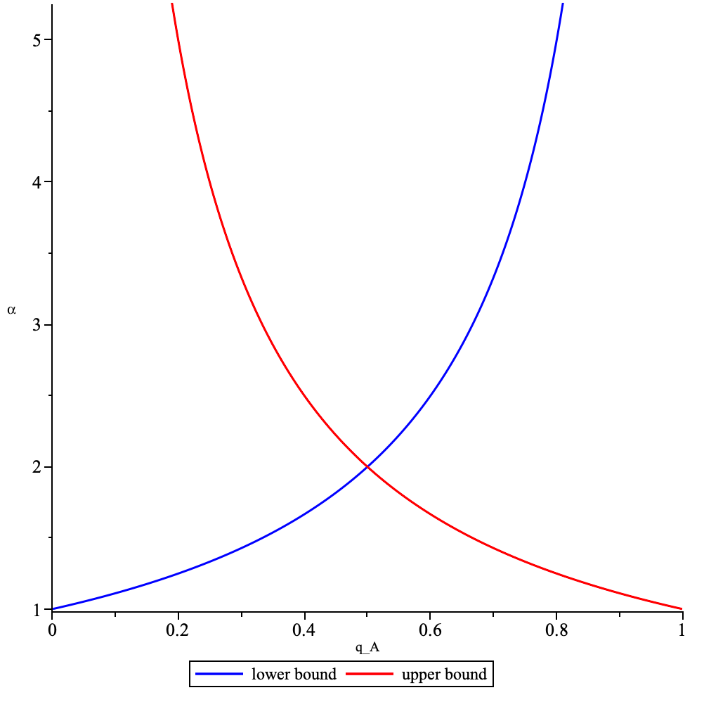

> The lower bound $`\frac{1}{1-q_A}`$ and upper bound $`\frac{1}{q_A}`$ on parameter $`\alpha`$ plotted as a function of $`q_A`$.

### Analysis of failures

Using the expression $`f(L)=\left(\frac{\alpha}{1-q_F}\right)^L`$, where $L$ is the number of nodes in a path and $\alpha$ parameter such that $`f(L)\in \mathbb{N}`$, for the number of paths in the upper bounds on failure probabilities $`\mathrm{P}_b`$, $`\mathrm{P}_a`$, and $`\mathrm{P}_{ab}`$ we obtain the following inequalities

$$
\mathrm{P}_b\leq \mathrm{e}^{-\alpha^L}\\ \quad \mathrm{P}_{ab}\leq \mathrm{e}^{-\alpha^L(1- q_A)^L}\\\quad \mathrm{P}_a\leq1-\mathrm{e}^{-\alpha^L\frac{ q_A^L}{1-(1-q_F)^L\, q_A^L}}.
$$

and for any $`\alpha\in \left(\frac{1}{1-q_A}, \frac{1}{q_A}\right)`$ all of the above are vanishing as $L\rightarrow\infty$.  From above follows that broadcast failure probabilities $`\mathrm{P}_b`$ and $`\mathrm{P}_{ab}`$ are tending to $0$ with increasing $L$ at a much higher rate for a larger values of $\alpha$, but the anonymity failure prob. $`\mathrm{P}_a`$ is tending to $0$ at a much higher rate for a smaller values of $\alpha$.

We note that the number of comm. paths $f(L)$ and the number of nodes involved in communication $L\times  f(L)$, which is bounded by the number of nodes in the network $N$, is growing slowly (with $L$) when $\alpha$ is small and very fast when $\alpha$ is large when we increase the number of nodes per path $L$. For values of $\alpha$ close to $`\frac{1}{1-q_A}`$ probabilities of broadcast failures are tending to $0$ with increasing $L$ at a much lower rate than the prob. of anonymity failure as can be seen in the figures below

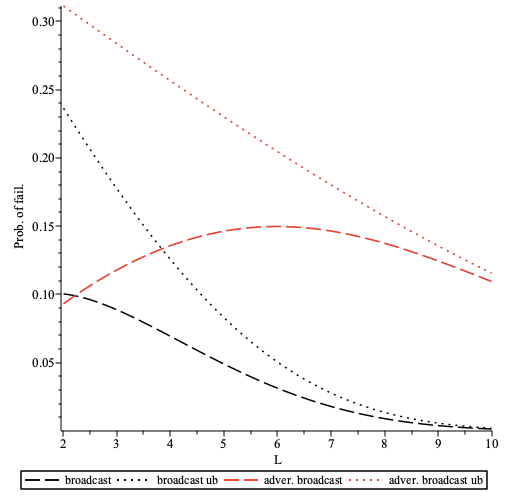

> Probability of comm. failure as a function of $`L`$ plotted for $`q_F=0.2`$ and $`q_A=0.1`$. The number of communication paths is given by $`f(L)=\left(\frac{\alpha}{1-q_F}\right)^L`$, where $`\alpha\in \left(\frac{1}{1-q_A}, \frac{1}{q_A}\right)`$. Here $`\alpha=1.2 \gt 1/(1-q_A)=1.111111`$.

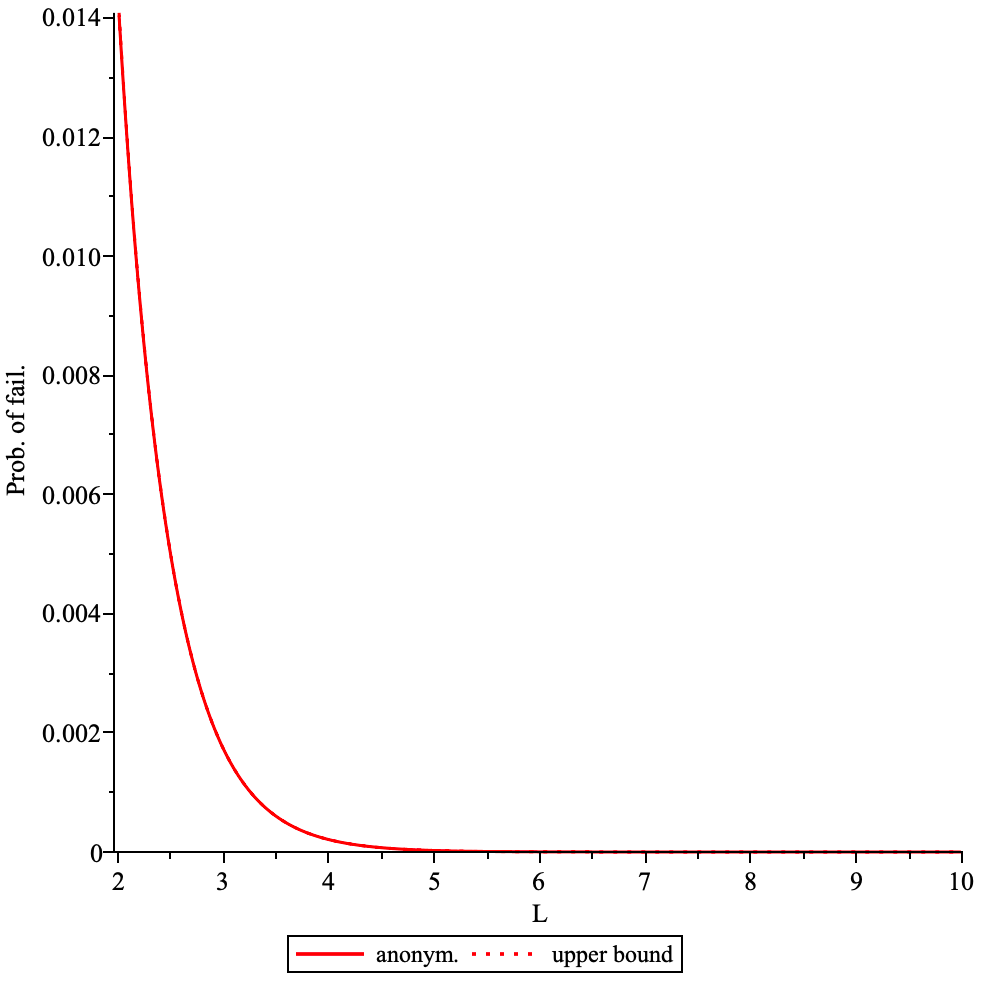

> Probability of anonymity failure as a function of $`L`$ plotted for $`q_F=0.2`$ and $`q_A=0.1`$. The number of communication paths is given by $`f(L)=\left(\frac{\alpha}{1-q_F}\right)^L`$, where $`\alpha\in \left(\frac{1}{1-q_A}, \frac{1}{q_A}\right)`$. Here $`\alpha=1.2 \gt 1/(1-q_A)=1.111111`$.

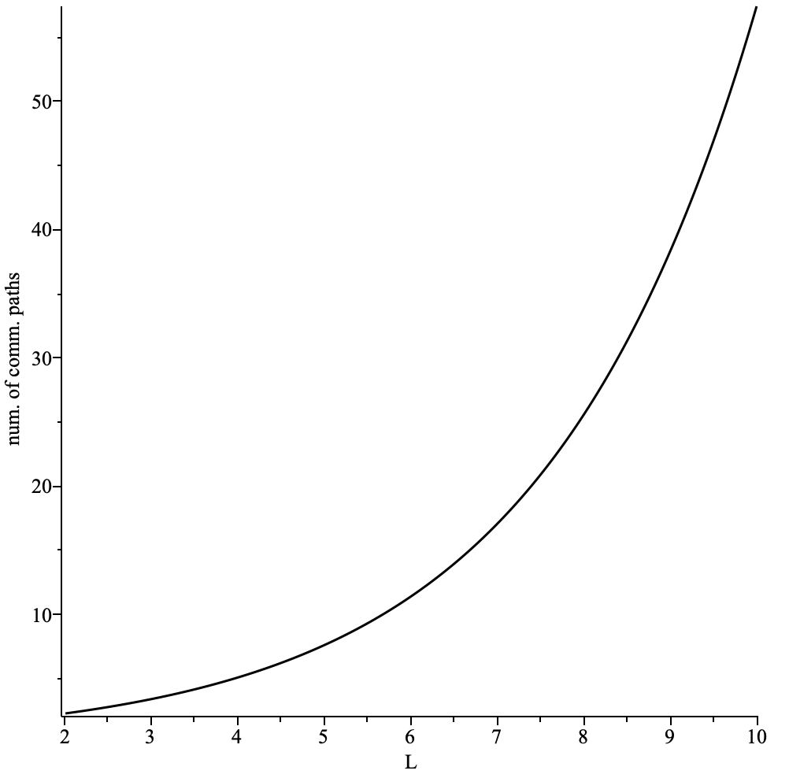

> The number of communication paths $`f(L)=\left(\frac{\alpha}{1-q_F}\right)^L`$ as a function of $`L`$ plotted for $`q_F=0.2`$ and $`\alpha=1.2`$.

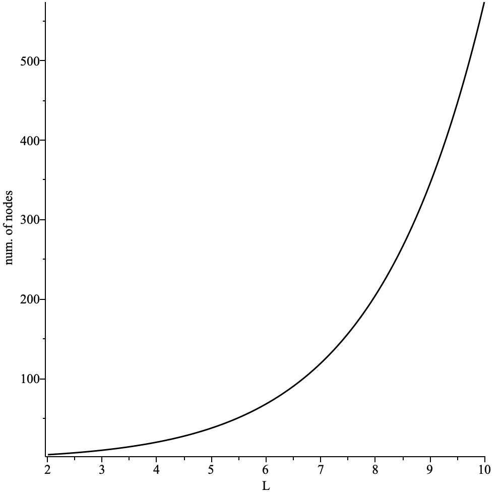

> The number of nodes in communication paths $`L\times f(L)`$ as a function of $`L`$ plotted for $`q_F=0.2`$ and $`\alpha=1.2`$.

For $\alpha$ values closer to $`1/q_A`$ probabilities of broadcast failures are tending to $0$ with increasing $L$ at a much higher rate than the prob. of anonymity failure as can be seen in the figures below

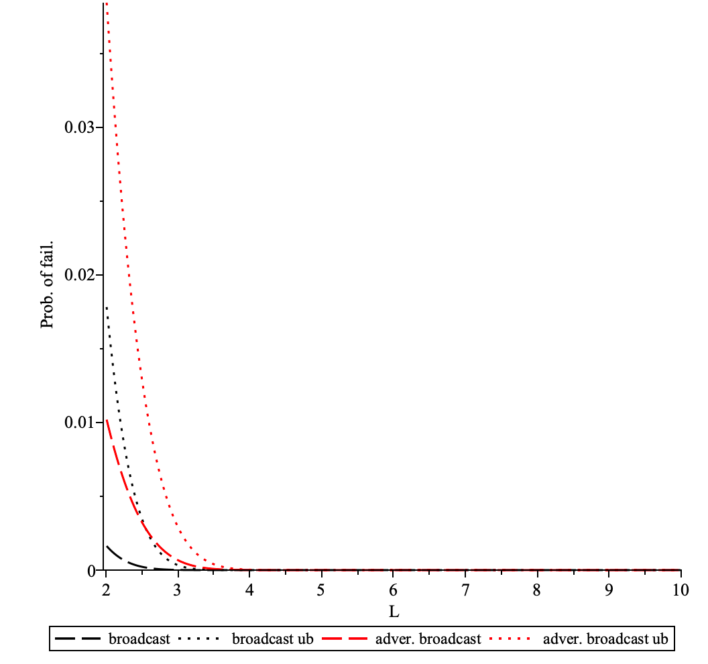

> Probability of comm. failure as a function of $`L`$ plotted for $`q_F=0.2`$ and $`q_A=0.1`$. The number of communication paths is given by $`f(L)=\left(\frac{\alpha}{1-q_F}\right)^L`$, where $`\alpha\in \left(\frac{1}{1-q_A}, \frac{1}{q_A}\right)`$. Here $`\alpha=2 \lt 1/q_A=10`$.

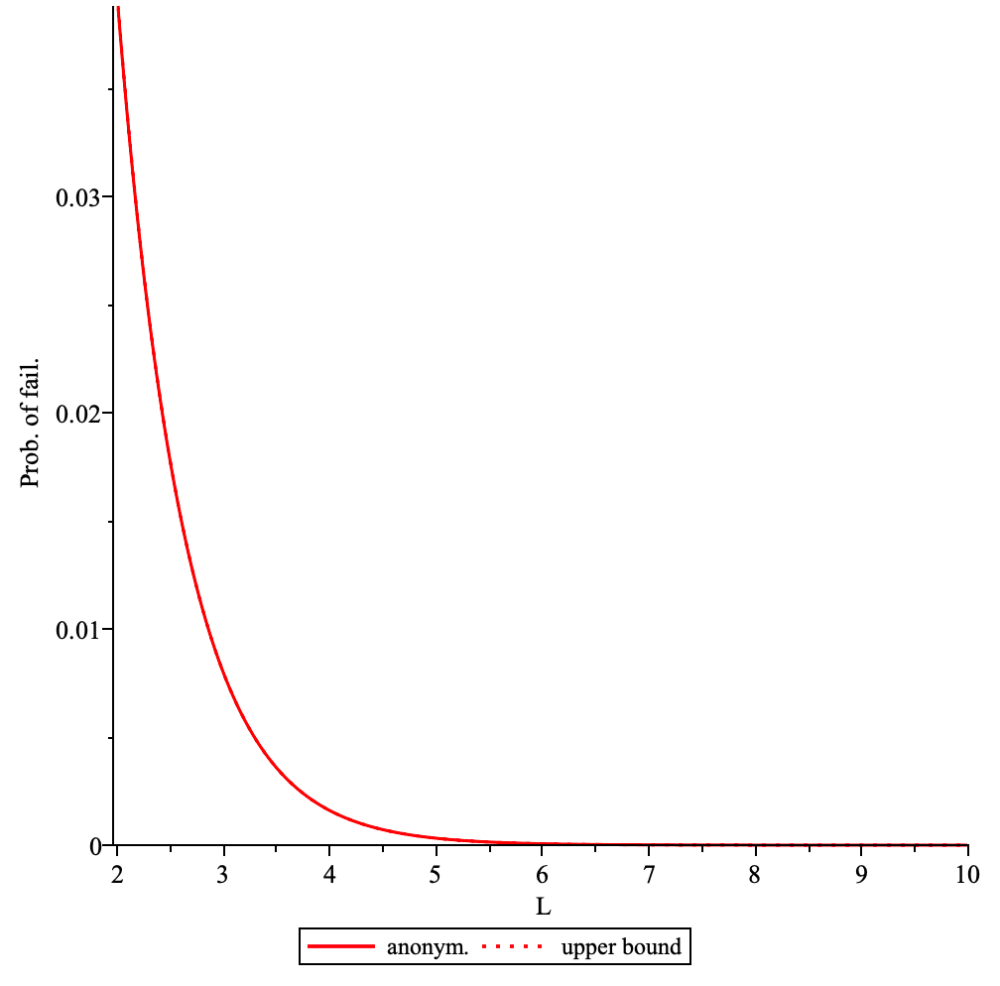

> Probability of anonymity failure as a function of $`L`$ plotted for $`q_F=0.2`$ and $`q_A=0.1`$. The number of communication paths is given by $`f(L)=\left(\frac{\alpha}{1-q_F}\right)^L`$, where $`\alpha\in \left(\frac{1}{1-q_A}, \frac{1}{q_A}\right)`$. Here $`\alpha=2 \lt 1/q_A=10`$.

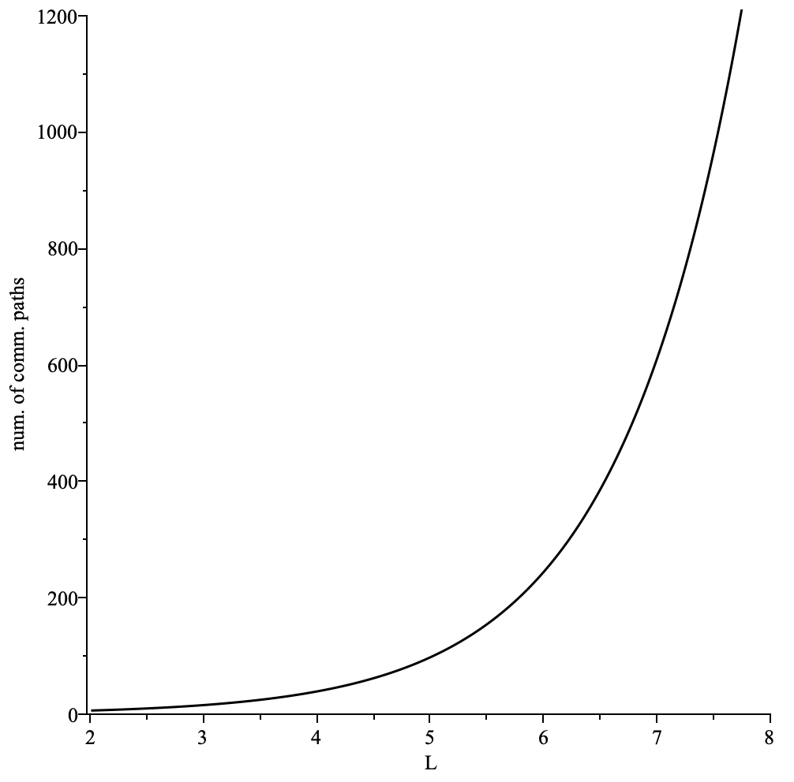

> The number of communication paths $`f(L)=\left(\frac{\alpha}{1-q_F}\right)^L`$ as a function of $`L`$ plotted for $`q_F=0.2`$ and $`\alpha=2`$.

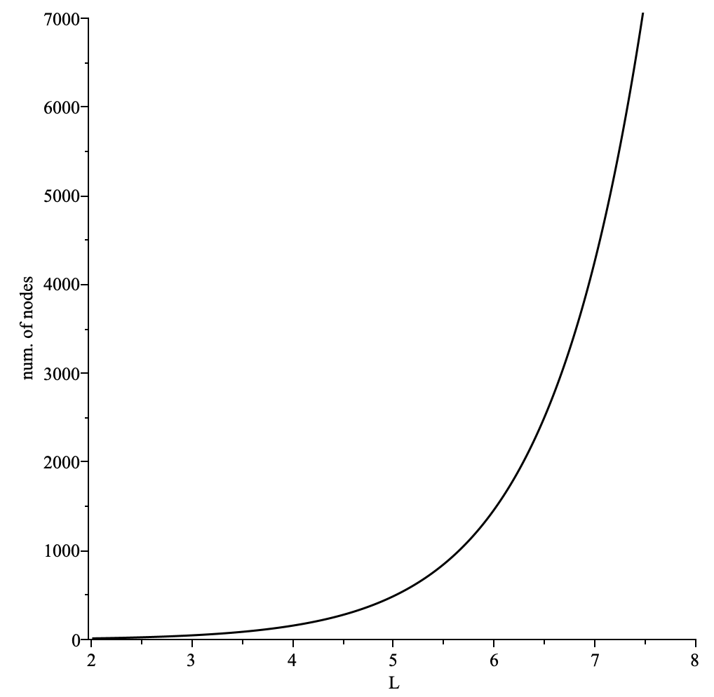

> The number of nodes in communication paths $`L\times f(L)`$ as a function of $`L`$ plotted for $`q_F=0.2`$ and $`\alpha=2`$.

For $\alpha$ outside of the interval $`\left(\frac{1}{1-q_A}, \frac{1}{q_A}\right)`$ we have that either the broadcast failure probabilities are increasing and anonymity failure prob. is decreasing with increasing $L$ when $`\alpha \lt \frac{1}{1-q_A}`$ or the broadcast failure probabilities are decreasing and anonymity failure prob. is increasing with increasing $L$ when $`\alpha \gt \frac{1}{q_A}`$.

We note that $`\mathrm{P}_{b}\leq \mathrm{e}^{-\alpha^L}`$, $`\mathrm{P}_{ab}\leq \mathrm{e}^{-\alpha^L(1- q_A)^L}`$§11, and $`\mathrm{e}^{-\alpha^L}\leq \mathrm{e}^{-\alpha^L(1- q_A)^L}`$. The latter implies that for finite $L$ the broadcast failure probabilities are reduced when we increase $\alpha$, i.e. when the number of communication paths is increased. However, for finite $L$ the probability of anonymity failure $`\mathrm{P}_a`$ is reduced when we decrease $\alpha$, i.e. when the number of communication paths is decreased. This behaviour of failure probabilities for finite $L$ can be seen in the plots below.

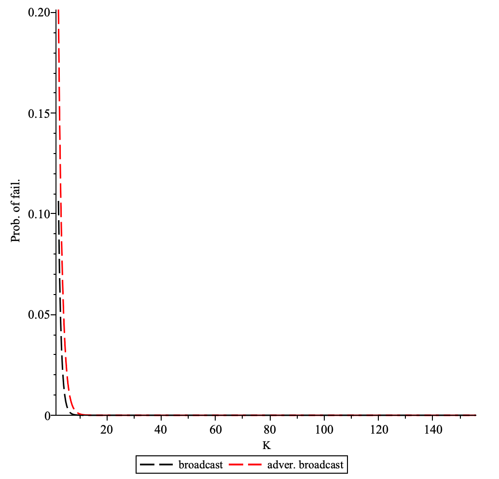

> Probability of comm. failure as a function of the number of communication paths $`K`$ plotted for $`q_F=0.2`$, $`q_A=0.1`$ and $`L=2`$. Here $`K=\left(\frac{\alpha}{1-q_F}\right)^L`$ is for $`\alpha\in \left(\frac{1}{1-q_A}, \frac{1}{q_A}\right)`$.

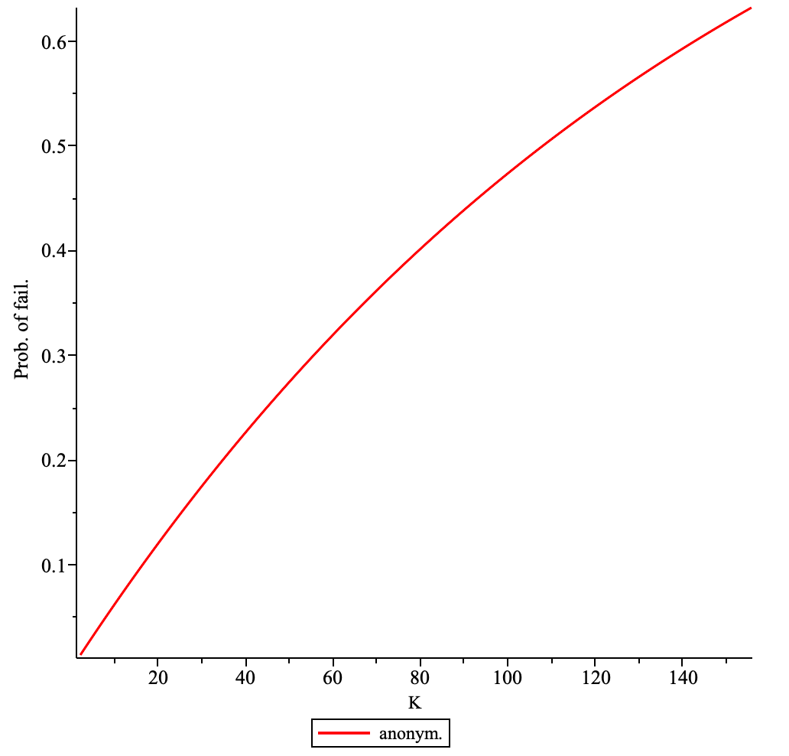

> Probability of anonymity failure as a function of the number of communication paths $`K`$ plotted for $`q_F=0.2`$, $`q_A=0.1`$ and $`L=2`$. Here $`K=\left(\frac{\alpha}{1-q_F}\right)^L`$ is for $`\alpha\in \left(\frac{1}{1-q_A}, \frac{1}{q_A}\right)`$.

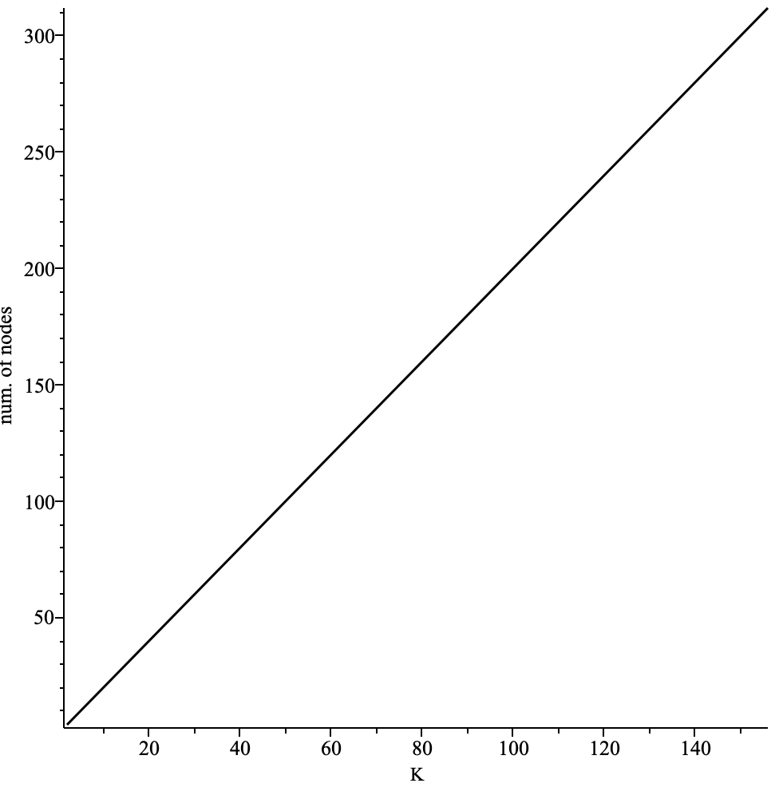

> The number of nodes involved in communication $`L\times K`$ as a function of the number of comm. paths $`K`$ plotted for $`L=2`$.

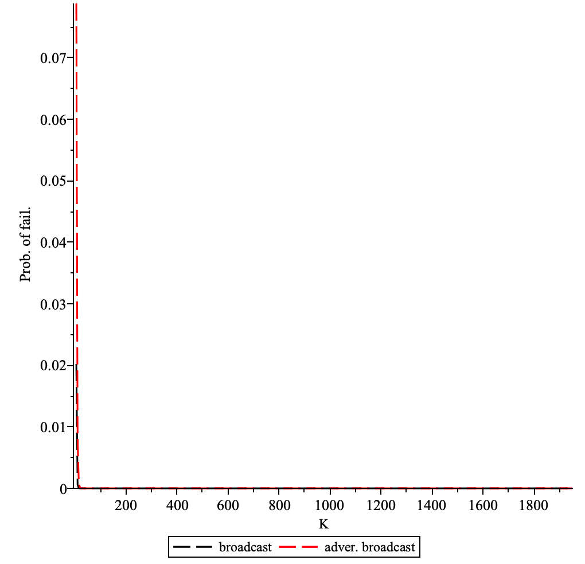

> Probability of comm. failure as a function of the number of communication paths $`K`$ plotted for $`q_F=0.2`$, $`q_A=0.1`$ and $`L=3`$. Here $`K=\left(\frac{\alpha}{1-q_F}\right)^L`$ is for $`\alpha\in \left(\frac{1}{1-q_A}, \frac{1}{q_A}\right)`$.

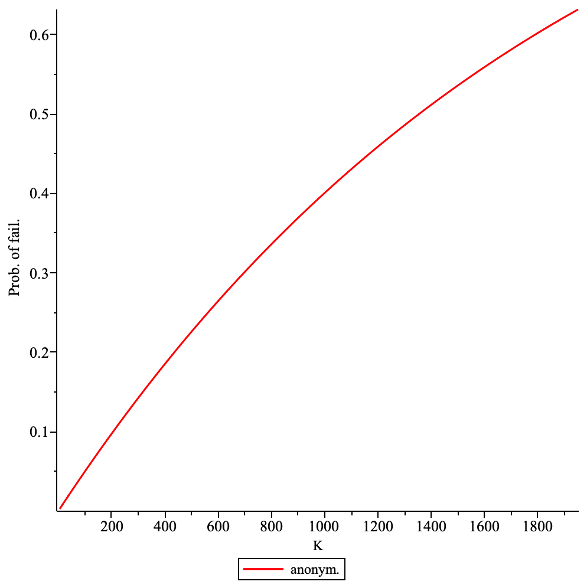

> Probability of anonymity failure as a function of the number of communication paths $`K`$ plotted for $`q_F=0.2`$, $`q_A=0.1`$ and $`L=3`$. Here $`K=\left(\frac{\alpha}{1-q_F}\right)^L`$ is for $`\alpha\in \left(\frac{1}{1-q_A}, \frac{1}{q_A}\right)`$.

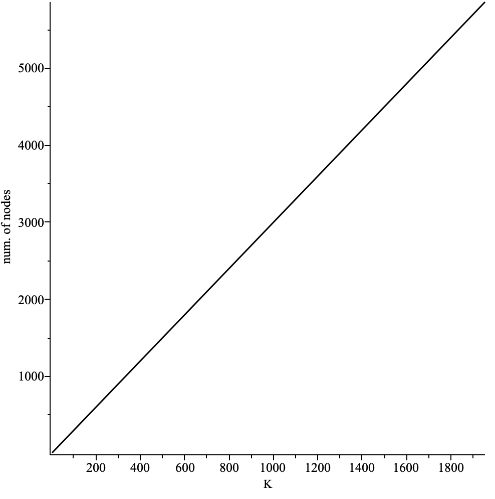

> The number of nodes involved in communication $`L\times K`$ as a function of the number of comm. paths $`K`$ plotted for $`L=3`$.

### Simulation results

Above analytic expressions, derived for infinite number of random samples, for failure probabilities are in good agreement with probabilities computed from a finite number of samples obtained in simulations as can be seen in figures below

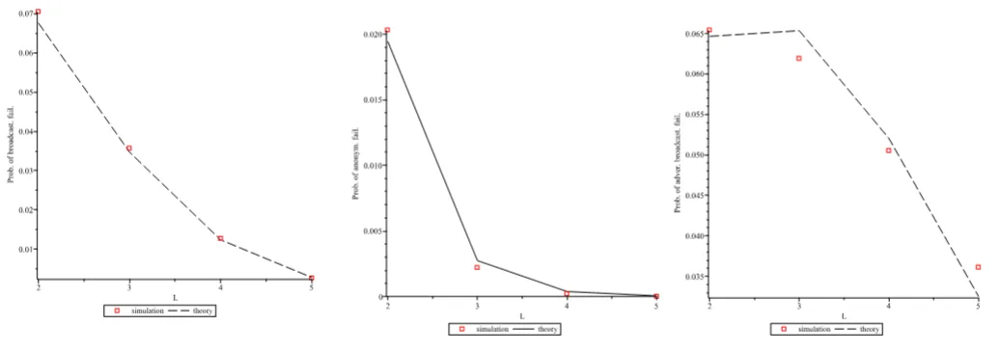

> Analysis of failures in $`2^L`$ linear trees with $`L`$ layers. Left: The probability of broadcast failure plotted as a function of number of layers $`L`$ for the (average) fraction  $`q_F=0.3`$ of faulty nodes.  Center: The probability of anonymity failure plotted as a function of the number of layers $`L`$ for the (average) fraction  $`q_A=0.1`$ of adversarial  nodes and $`q_F=0.3`$. Right: The probability of adversarial broadcast failure plotted as a function of the number of layers $`L`$ for $`q_F=0.3`$ and $`q_A=0.1`$. In simulation probabilities were computed from $`M=10^4`$ samples.

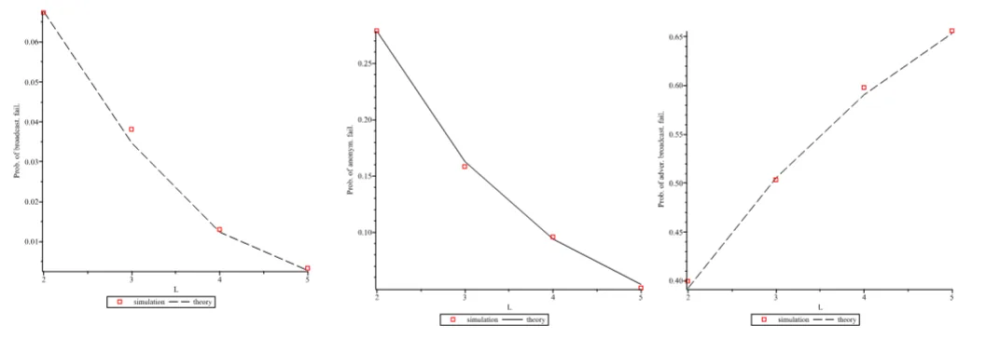

> Analysis of failures in $`2^L`$ linear trees with $`L`$ layers. Left: The probability of broadcast failure plotted as a function of number of layers $`L`$ for the (average) fraction  $`q_F=0.3`$ of faulty nodes.  Center: The probability of anonymity failure plotted as a function of the number of layers $`L`$ for the (average) fraction  $`q_A=0.4`$ of adversarial  nodes and $`q_F=0.3`$. Right: The probability of adversarial broadcast failure plotted as a function of the number of layers $`L`$ for $`q_F=0.3`$ and $`q_A=0.4`$. In simulation probabilities were computed from $`M=10^4`$ samples.

We note that the number of samples $M$ in above figures is equivalent to the number of messages sent by a sender node.

## Communication on Branching Trees: two-variable failure model

### Assumptions

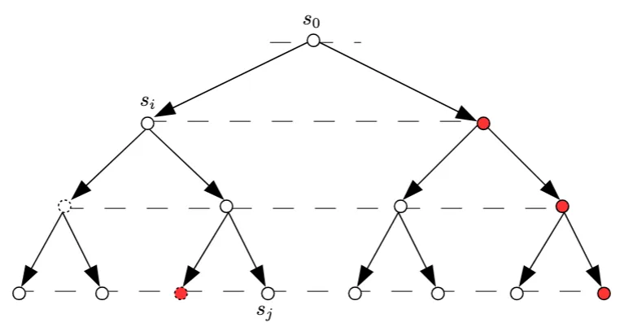

> Communication on a (balanced and complete) tree $`\mathcal{T}_L`$. The layers in  the tree are labeled by the set $`\{0,1,\ldots,L\}`$ (bottom to top).  A message is sent from the root node (layer $`L`$)  to the leaf nodes (layer $`0`$). All leaf nodes of the tree $`\mathcal{T}_L`$ constitute its boundary $`\partial\mathcal{T}_L`$. Each node in the tree, but the root, has associated with it binary random variable. A node could be faulty (circle with dashed boundary), or adversarial (red circle). Presence of faulty node leads to communication failures.  Presence of adversarial nodes could lead to communication and anonymity failures.

We consider broadcast on a tree $`\mathcal{T}_L`$ (see figure above) constructed from nodes sampled (with replacement) from the $N$ nodes of the network. We assume that $`M_F`$ nodes in the network are “faulty” (faulty node is unable to relay a message) and the probability that a sampled node is faulty is $`q_F=M_F/N`$. We assume that $`M_A`$ nodes in the network are “adversarial” (Adversarial nodes are controlled by an adversary which can make nodes faulty, use them for traffic analysis, etc.) and the probability that a sampled node is adversarial is $`q_A=M_A/N`$.

We assume that the root node of $`\mathcal{T}_L`$ sends a message to all leaf nodes. The root node is labeled by $0$ and all leaf nodes constitute the set $`\partial\mathcal{T}_L`$. We assume that each node can fail to relay the message with probability $`q_F`$ independently from other nodes. We assume that a node can be adversarial with probability $`q_A`$ independently from other nodes.

Let us define the binary variable $`\sigma_i\in\{0,1\}`$ for a node $i$ in some communication path. A node is faulty/not-faulty when $`\sigma_i=0/1`$ with probability $`q_F/(1-q_F)`$. If the sum of all $`\sigma_i`$ variables of nodes on the path from the root $0$ to some leaf node $j$, $`\sum_{k\in 0\rightarrow j\setminus0}\sigma_k`$, is less than $L$, i.e. then there is at least one faulty node in this path. Hence, node $j$ did not receive the message, i.e. communication failure occurred. If all nodes in a communication path are non-faulty then this is a functioning communication path. If $`\max_{j\in\partial\mathcal{T}_L}\sum_{k\in 0\rightarrow j\setminus0}\sigma_k \lt L`$, i.e. each comm. path contains at least one faulty node, then all leaf nodes didn't receive the message, i.e. broadcast failure occurred.

Also we define the binary variable $`s_i\in\{0,1\}`$. A node is “honest/adversarial” when $`s_i=0/1`$ with probability $`(1-q_A)/q_A`$. If $`\sum_{j\in\partial\mathcal{T}_L}\mathrm{1}[\sum_{k\in 0\rightarrow j\setminus0}\sigma_k=L]\,\mathrm{1}[\sum_{k\in 0\rightarrow j\setminus0}s_k\geq1]=\sum_{j\in\partial\mathcal{T}_L}\mathrm{1}[\sum_{k\in 0\rightarrow j\setminus0}\sigma_k=L]`$ and $`\sum_{j\in\partial\mathcal{T}_L}\mathrm{1}[\sum_{k\in 0\rightarrow j\setminus0}\sigma_k=L]\geq 1`$, i.e. all functioning communication paths have at least one adversarial node, then adversary has opportunity to cause broadcast failure. If $`\sum_{j\in\partial\mathcal{T}_L}\mathrm{1}[\sum_{k\in 0\rightarrow j\setminus0}\sigma_k=L]\,\mathrm{1}[\sum_{k\in 0\rightarrow j\setminus0}s_k=L]\geq1`$, i.e. there is at least one functioning communication paths where all nodes are adversarial, then adversary has opportunity to cause anonymity failure. We note that above definition of anonymity failure is equivalent to the event $`\max_{j\in\partial\mathcal{T}_L}\sum_{k\in 0\rightarrow j\setminus0}\sigma_ks_k=L`$. Here the $`\sum_{k\in 0\rightarrow j\setminus0}\sigma_ks_k`$ counts number of adversarial nodes on the path $0\rightarrow j$.

### Analysis of broadcast failure

The probability of broadcast failure is give by $`\mathrm{P}_b=\left[1-\mathrm{P}_{L-1}\right]^b`$, where the prob. $`\mathrm{P}_{L-1}`$ can be computed recursively (see the [Details of derivations](#details-of-derivations) section) as follows

$$
\quad \mathrm{P}_{\ell+1}=(1-q_F)\left[1-\left[1-\mathrm{P}_{\ell}\right]^b\right]\\\mathrm{P}_0=1-q_F
$$

The above equation has only one solution $`\mathrm{P}_{\ell}=0`$, which corresponds to prob. of broadcast failure being $1$, when $`1-q_F \lt 1/b`$. However, the fixed point $`\mathrm{P}_{\ell}=0`$ becomes unstable when $`1-q_F \gt 1/b`$ and a second (stable) solution $`\mathrm{P}_{\ell} \gt 0`$, which corresponds to prob. of broadcast failure being less than $1$, emerges.

### Analysis of anonymity failure

The probability of anonymity failure is give by $`\mathrm{P}_a=1-\left[1-\mathrm{P}_{L-1}\right]^b`$, where $`\mathrm{P}_{L-1}`$ can be computed recursively (see the [Details of derivations](#details-of-derivations) section) as follows

$$
\quad \quad \mathrm{P}_{\ell+1}=(1-q_F)\,q_A\left[1-\left[1-\mathrm{P}_{\ell}\right]^b\right]\\\mathrm{P}_0=(1-q_F)\,q_A
$$

The above equation has only one solution $`\mathrm{P}_{\ell}=0`$, which corresponds to prob. of anonymity failure being $0$, when $`(1-q_F)\,q_A \lt 1/b`$. However, the fixed point $`\mathrm{P}_{\ell}=0`$ becomes unstable when $`(1-q_F)\,q_A \gt 1/b`$ and a second (stable) solution $`\mathrm{P}_{\ell} \gt 0`$, which corresponds to prob. of anonymity failure being greater than $0$, emerges.

From above follows that we would like to have $`1-q_F \gt 1/b`$ and $`(1-q_F)\,q_A \lt 1/b`$ as it allows us to make failure prob. arbitrarily small by increasing the number of layers $L$ . The latter gives us conditions for this in the inequalities $`q_F \lt 1-\frac{1}{b}=q_F(b)`$ and $`q_A \lt \frac{1}{b(1-q_F)}=q_A(b,q_F)`$. The threshold $`q_F(b)`$ is increasing with the branching ratio $b$, i.e. $`\mathrm{P}_b\rightarrow0`$ when $L\rightarrow\infty$ for higher values of $`q_F`$, but the threshold $`q_A(b,q_F)`$ is decreasing with $b$, i.e. $`\mathrm{P}_a\rightarrow0`$ when $L\rightarrow\infty$ for lower values of $`q_F`$. Also $`q_A(b,q_F)`$ is increasing function of $`q_F`$.

### Analysis of adversarial broadcast-failure

We have exploited a recursive property of $\max$ on trees (see equation (48) in the [Details of derivations](#details-of-derivations)) to derive expressions for the prob. of broadcast and anonymity failures, however if such recursive approach is possible in analysis of adversarial broadcast-failure is not clear. In particular we don’t know how to estimate probability of the event

$$
\sum_{j\in\partial\mathcal{T}_L}\mathrm{1}\left[\sum_{k\in 0\rightarrow j\setminus0}\sigma_k=L\right]\,\mathrm{1}\left[\sum_{k\in 0\rightarrow j\setminus0}s_k\geq1\right]=\sum_{j\in\partial\mathcal{T}_L}\mathrm{1}\left[\sum_{k\in 0\rightarrow j\setminus0}\sigma_k=L\right] \text{ and} \sum_{j\in\partial\mathcal{T}_L}\mathrm{1}\left[\sum_{k\in 0\rightarrow j\setminus0}\sigma_k=L\right]\geq 1
$$

analytically. However for $`q_F=0`$, i.e. there are no faulty nodes, we know from our[earlier analysis](#analysis-of-communication-failures) that the probability of adversarial broadcast failure $`\mathrm{P}_{ab}`$ is strictly less than $1$ as $L\rightarrow\infty$ when $`q_A \lt 1-\frac{1}{b}`$.

### Simulation results

Above analytic expressions, derived for infinite number of random samples, for failure probabilities are in good agreement with probabilities computed from a finite number of samples obtained in simulations as can be seen in figures below

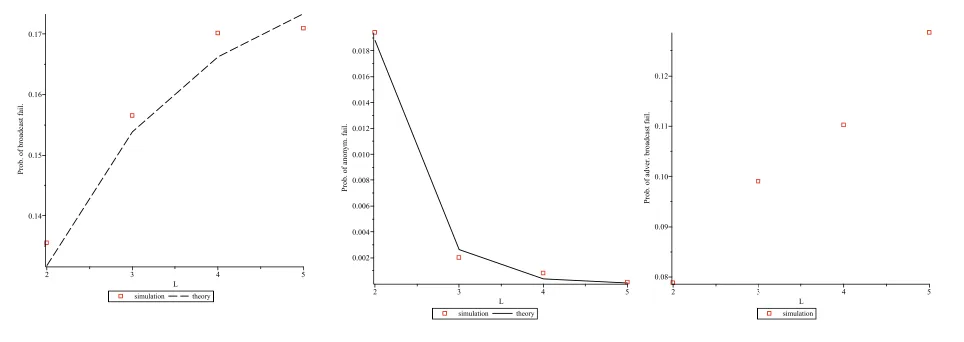

> Analysis  of failures in branching trees with branching factor $`b=2`$. Left: The probability of broadcast failure plotted as a function of number of layers $`L`$ for the (average) fraction  $`q_F=0.3`$ of faulty nodes.  Center: The probability of anonymity failure plotted as a function of the number of layers $`L`$ for the (average) fraction $`q_A=0.1`$ of adversarial  nodes and $`q_F=0.3`$. Right: The probability of adversarial broadcast failure plotted as a function of the number of layers $`L`$ for $`q_F=0.3`$ and $`q_A=0.1`$. In simulation probabilities were computed from $`M=10^4`$ samples.

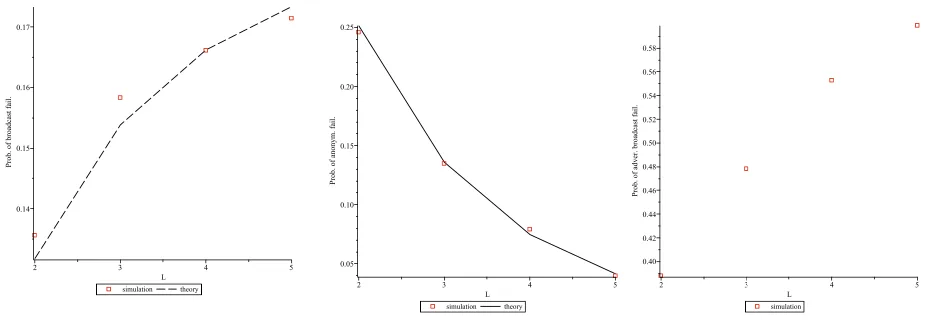

> Analysis of failures in branching trees with branching factor $`b=2`$. Left: The probability of broadcast failure plotted as a function of number of layers $`L`$ for the (average) fraction  $`q_F=0.3`$ of faulty nodes. Center: The probability of anonymity failure plotted as a function of the number of layers $`L`$ for the (average) fraction $`q_A=0.4`$ of adversarial  nodes and $`q_F=0.3`$. Right: The probability of adversarial broadcast failure plotted as a function of the number of layers $`L`$ for $`q_F=0.3`$ and $`q_A=0.4`$. In simulation probabilities were computed from $`M=10^4`$ samples.

### Discussion of results for linear and branching tree designs: two-variable failure model

To compare linear and branching tree designs we assume that both have the same number of paths $`b^L`$, where $b$ is branching parameter and $L$ is the number of layers (see diagram of [linear trees](#communication-on-linear-trees-two-variable-failure-model) and diagram of [branching tree](#assumptions-1)). The differences between designs when above assumption is used were discussed [above](analysis-communication-on-trees.md).

First, we consider the prob. of broadcast failure for values of $`q_F`$ below and above the threshold $`q_F(b)`$ plotted in the figure below.

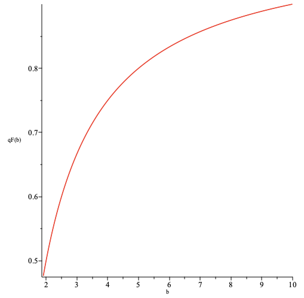

> The threshold $`q_F(b)=1-1/b`$ plotted as a function of branching ratio $`b`$. For $`q_F \lt q_F(b)`$ the prob. of broadcast failure $`\mathrm{P}_b`$ in branching trees is strictly less than $`1`$ even for infinite number of layers $`L`$. For $`q_F \gt q_F(b)`$ the prob. of broadcast failure $`\mathrm{P}_b`$ in branching trees is tending to $`1`$ with increasing number of layers $`L`$.

For the branching parameter $b=2$ the prob. of broadcast failure, $`\mathrm{P}_b`$, in linear trees is smaller than in the branching trees as can be seen in the figure below. We note that in linear trees the prob. $`\mathrm{P}_b\rightarrow0`$ as $L\rightarrow\infty$ when $`q_F \lt 1/2`$ and $`\mathrm{P}_b\rightarrow1`$ when $`q_F \gt 1/2`$. The threshold $1/2$ follows from the condition $`b(1-q_F) \gt 1`$, which ensures $`\mathrm{P}_b\rightarrow0`$, in the [linear trees analysis](#analysis-of-broadcast-failure).

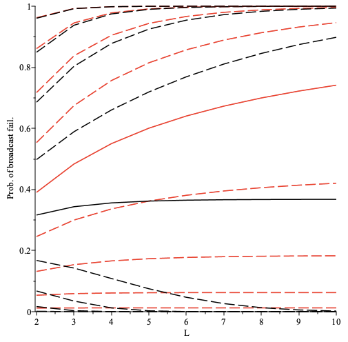

> The prob. of broadcast failure in linear (black lines) and branching (red lines) trees as a function of the number of layers $`L`$ plotted for fraction of faulty nodes $`q_F\in\{0.1,0.2,0.3,0.4,0.5,0.6,0.7,0.8,0.9\}`$ (bottom to top) and branching parameter $`b=2`$. Solid lines correspond to $`q_F=q_F(2)=1/2`$.

However, the number of nodes involved in communication grows much faster in linear trees as can be seen in the figure below.

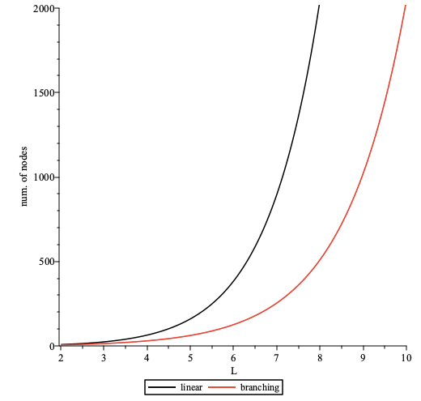

> The number of nodes involved in communication as function of number of layers $`L`$ plotted for the branching parameter $`b=2`$.

As we increase the branching parameter $b$ the probability of broadcast failure is reduced for each number of layers $L$ as can be seen in the figure below

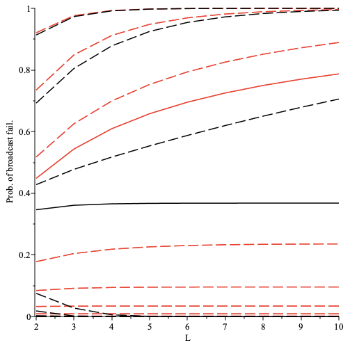

> The prob. of broadcast failure in linear (black lines) and branching (red lines) trees as a function of the number of layers $`L`$ plotted for fraction of faulty nodes $`q_F\in\{0.1,0.2,0.3,0.4,0.5,0.6,0.7,0.8,0.9\}`$ (bottom to top) and branching parameter $`b=3`$. Solid lines correspond to $`q_F=q_F(3)=2/3`$.

However, the number of nodes involved in communication is growing much faster with the number of layers $L$ for higher values of the branching parameter $b$ (cf. figure below and figure [above](#discussion-of-results-for-linear-and-branching-tree-designs-two-variable-failure-model))

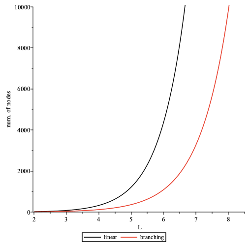

> The number of nodes involved in communication as function of number of layers $`L`$ plotted for the branching ratio $`b=3`$.

Second, we consider the prob. of anonymity failure for values of $`q_A`$ below and above the threshold $`q_A(b,q_F)`$ plotted in the figure below.

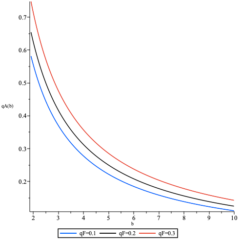

> The threshold $`q_A(b,q_F)=\frac{1}{b(1-q_F)}`$ as a function of branching parameter $`b`$. For $`q_A \lt q_A(b,q_F)`$ the prob. of anonymity failure $`\mathrm{P}_a\rightarrow0`$ in branching trees as the number of layers $`L\rightarrow\infty`$. For $`q_A \gt q_A(b,q_F)`$ the prob. of anonymity failure in branching trees is tending to some value $`\mathrm{P}_a \lt 1`$ as the number of layers $`L\rightarrow\infty`$.

For the branching parameter $b=2$ the prob. of anonymity failure, $`\mathrm{P}_a`$, in linear trees is higher than in the branching trees as can be seen in the figure below. We note that in linear trees the prob. $`\mathrm{P}_a\rightarrow0`$ as $L\rightarrow\infty$ when $`q_A \lt 1/1.8`$ and $`\mathrm{P}_a\rightarrow1`$ when $`q_A \gt 1/1.8`$. The threshold $1/1.8$ follows from the condition $`b(1-q_F)q_A \lt 1`$, which ensures $`\mathrm{P}_a\rightarrow0`$, in the [linear trees analysis](#analysis-of-anonymity-failure-1). For branching trees we have $`\mathrm{P}_a\rightarrow0`$ as $L\rightarrow\infty$ when $`q_A \lt 1/1.8`$ but $`\mathrm{P}_a \lt 1`$ when $`q_A \gt 1/1.8`$.

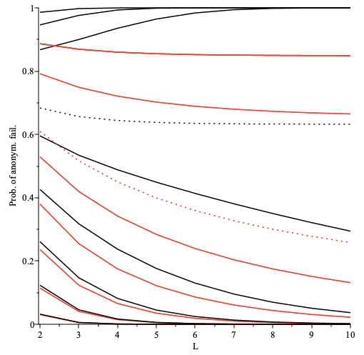

> The prob. of anonymity failure in linear (black lines) and branching (red lines) trees as a function of the number of layers $`L`$ plotted for fraction of adversarial nodes $`q_A\in\{0.1,0.2,0.3,0.4,0.5,0.6,0.7,0.8,0.9\}`$ (bottom to top), fraction of faulty nodes $`q_F=0.1`$ and branching parameter $`b=2`$. Dotted lines correspond to $`q_A=q_A(2,0.1)=1/1.8`$.

As we increase $`q_F`$ the probability of anonymity failure is reduced for each number of layers $L$ as can be seen in figures below

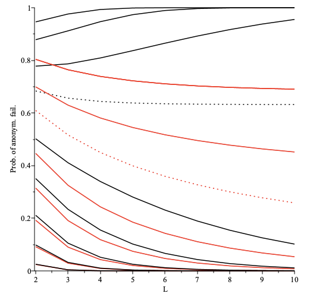

> The prob. of anonymity failure in linear (black lines) and branching (red lines) trees as a function of the number of layers $`L`$ plotted for fraction of adversarial nodes $`q_A\in\{0.1,0.2,0.3,0.4,0.5,0.6,0.7,0.8,0.9\}`$ (bottom to top), fraction of faulty nodes $`q_F=0.2`$ and branching parameter $`b=2`$. Dotted lines correspond to $`q_A=q_A(2,0.2)=1/1.6`$.

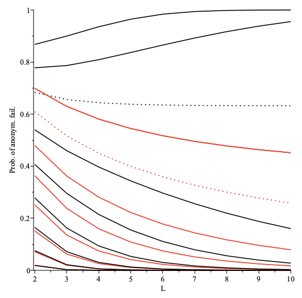

> The prob. of anonymity failure in linear (black lines) and branching (red lines) trees as a function of the number of layers $`L`$ plotted for fraction of adversarial nodes $`q_A\in\{0.1,0.2,0.3,0.4,0.5,0.6,0.7,0.8,0.9\}`$ (bottom to top), fraction of faulty nodes $`q_F=0.3`$ and branching parameter $`b=2`$. Dotted lines correspond to $`q_A=q_A(2,0.3)=1/1.4`$.

As we increase the branching parameter $b$ the probability of anonymity failure is increased for each number of layers $L$ as can be seen in figures below

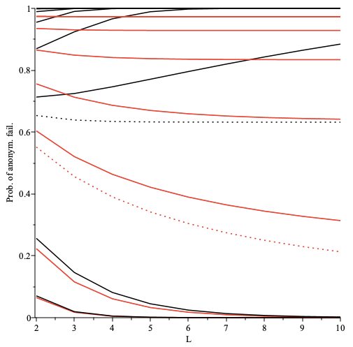

> The prob. of anonymity failure in linear (black lines) and branching (red lines) trees as a function of the number of layers $`L`$ plotted for fraction of adversarial nodes $`q_A\in\{0.1,0.2,0.3,0.4,0.5,0.6,0.7,0.8,0.9\}`$ (bottom to top), fraction of faulty nodes $`q_F=0.1`$ and branching parameter $`b=3`$. Dotted lines correspond to $`q_A=q_A(2,0.1)=1/2.7`$.

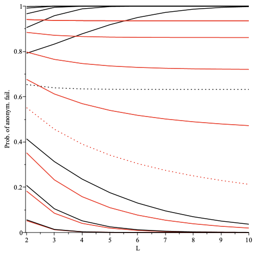

> The prob. of anonymity failure in linear (black lines) and branching (red lines) trees as a function of the number of layers $`L`$ plotted for fraction of adversarial nodes $`q_A\in\{0.1,0.2,0.3,0.4,0.5,0.6,0.7,0.8,0.9\}`$ (bottom to top), fraction of faulty nodes $`q_F=0.2`$ and branching parameter $`b=3`$. Dotted lines correspond to $`q_A=q_A(2,0.2)=1/2.4`$.

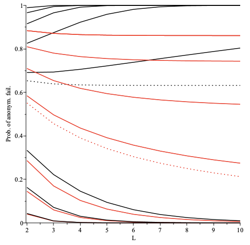

> The prob. of anonymity failure in linear (black lines) and branching (red lines) trees as a function of the number of layers $`L`$ plotted for fraction of adversarial nodes $`q_A\in\{0.1,0.2,0.3,0.4,0.5,0.6,0.7,0.8,0.9\}`$ (bottom to top), fraction of faulty nodes $`q_F=0.3`$ and branching parameter $`b=3`$. Dotted lines correspond to $`q_A=q_A(2,0.3)=1/2.1`$.

Finally, we consider the prob. of adversarial broadcast failure $`\mathrm{P}_{ab}`$. Here for branching trees we have only simulation results and we compare the latter with analytic results for linear trees. We note that in linear trees the prob. $`\mathrm{P}_{ab}\rightarrow0`$ as $L\rightarrow\infty$ when $`b\,(1-q_F)(1-q_A) \gt 1`$ and $`\mathrm{P}_{ab}\rightarrow1`$ when $`b\,(1-q_F)(1-q_A) \lt 1`$ and $`b\,(1-q_F) \gt 1`$ (see the [linear trees analysis](#analysis-of-adversarial-broadcast-failure)). The latter gives us $`q_F \lt 1-1/b`$, i.e. the condition for the prob. of broadcast failure $`\mathrm{P}_b\rightarrow0`$ in linear and branching trees. For the branching parameter $b=2$ the prob. of adversarial broadcast failure, $`\mathrm{P}_{ab}`$, in linear trees is higher than in the branching trees as can be seen in the figure below.

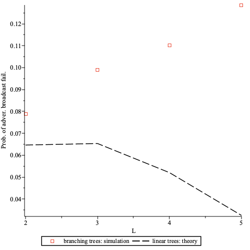

> The probability of adversarial broadcast failure as a function of $`L`$ plotted for $`b=2`$, $`q_F=0.3`$ and $`q_A=0.1`$. In simulation probabilities were computed from $`M=10^4`$ samples.

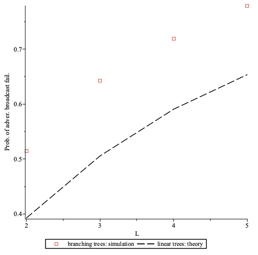

> The probability of adversarial broadcast failure as a function of $`L`$ plotted for $`b=2`$, $`q_F=0.3`$ and $`q_A=0.4`$. In simulation probabilities were computed from $`M=10^4`$ samples.

# Appendix

## Details of derivations

> **PDF attachment:** [Broadcasting_on_Trees.pdf](analysis-communication-on-trees/appendices/Broadcasting_on_Trees.pdf)
