# ANALYSIS-IMPACT-OF-THE-SERVICE-DECLARATION-PROTOCOL-ON-THE-STATISTICAL-INFERENCE-OF-RELATIVE-STAKE

| Field | Value |
| --- | --- |
| Name | [Analysis] Impact of the Service Declaration Protocol on the Statistical Inference of Relative Stake |
| Slug | 192 |
| Status | raw |
| Category | Informational |
| Editor | Alexander Mozeika <alexander.mozeika@logos.co> |
| Contributors | Filip Dimitrijevic <filip@logos.co> |

<!-- timeline:start -->

## Timeline

- **2026-05-27** — [`b7602ed`](https://github.com/logos-co/logos-lips/blob/b7602ed8a225d41ca0bfaaa432524dc84d2ded7e/docs/blockchain/raw/analysis-impact-of-the-service-declaration-protocol-on-the-statistical-inference-of-relative-stake.md) — chore: move blockchain specs from notion to github

<!-- timeline:end -->

# Revision History

| Version | Changes | Date |
| --- | --- | --- |
| 1.0.0 | Initial revision. | 2025-08-22 |

# Introduction

The Service Declaration Protocol (SDP) introduces a piece of a priori information: the knowledge that a node's relative stake cannot be less than a known threshold, $`\alpha_0`$. Our research investigates the significance of the impact of this information on the statistical inference of relative stake. We propose a new estimator which explicitly utilises $`\alpha_0`$ by setting any estimated stake below this threshold to $`\alpha_0`$.

Our new estimator works better because it fixes estimation errors at the lower end. When a node's true stake value ($`\alpha_i`$) is close to the minimum threshold ($`\alpha_0`$), the standard maximum likelihood (ML) estimator often produces values that are too low. By automatically adjusting these too-low estimates up to the minimum threshold ($`α_0`$), our new approach reduces errors. This improvement can be measured as a lower mean squared error (MSE) compared to the true stake value ($`\alpha_i`$). Thus any party, including potential adversaries, performing stake inference gains in accuracy by using the new estimator.

Numerical experiments demonstrate reduction in MSE of the new estimator compared to the ML estimator, particularly for stakes near $`α_0`$. For example, for $`\alpha_0=10^{-4}`$ used in experiments, a reduction of MSE by a (approx.) factor of at most $1/2$ was observed. Furthermore, the probability, measured in the same experiment, that the inferred stake falls within a desired accuracy interval is higher (by factor of (approx.) $3$ at least) when the new estimator is used. While the advantage diminishes for much higher stake values where both estimators converge, the heightened accuracy near the critical $`α_0`$ threshold presents a meaningful enhancement for any party performing stake inference, including potential adversaries.

## Key Findings

- Introduction of a priori information: The Service Declaration Protocol (SDP) introduces the knowledge that a node's relative stake cannot be less than a threshold ($α₀$), which impacts statistical inference of relative stake⁠⁠.
- New estimator proposed: The research introduces a new estimator that explicitly uses α₀ by setting any estimated stake below this threshold to $α₀$⁠⁠.
- Improved accuracy: The new estimator performs better because it corrects estimation errors at the lower end, particularly when a node's true stake value is close to the minimum threshold⁠⁠.
- Measurable improvements: Numerical experiments show:
    - Reduction in Mean Squared Error (MSE) of the new estimator compared to the ML estimator, particularly for stakes near $α₀$⁠⁠.
    - For $α₀=10⁻⁴$, MSE reduction by a factor of approximately $1/2$ was observed⁠⁠.
    - Higher probability (by a factor of approximately 3) that inferred stake falls within desired accuracy intervals⁠⁠.
- Statistical significance: The advantage diminishes for much higher stake values where both estimators converge, but the enhanced accuracy near the critical α₀ threshold presents a meaningful improvement for any party performing stake inference⁠⁠.
- Security implications: This improvement benefits anyone performing stake inference, including potential adversaries⁠⁠.

The research provides mathematical proof and numerical simulations to validate these findings, showing that the proposed estimator is both unbiased and consistent in the limit of large number of observations⁠⁠.

# Overview

This document examines the impact of minimum stake threshold, introduced in the SDP, on the statistical inference of relative stake along the following points:

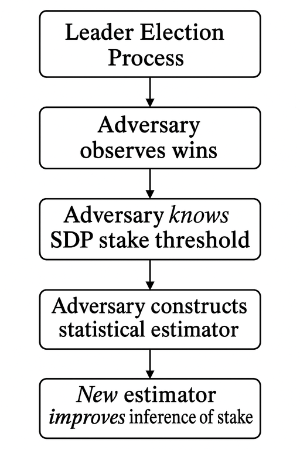

In particular:

1. We consider the Leader Election Process where nodes allowed to participate only if their relative stake is no less than some prescribed by SDP threshold.
1. We assume that the Adversary observes wins (and losses) of nodes and uses statistical inference to infer relative stake of nodes.
1. The Adversary knows the SDP stake threshold, and using this information, the Adversary constructs a statistical estimator.
1. This New estimator improves inference of stake when compared with an estimator which doesn’t use the SDP threshold. The simulation of adversarial inference shows that those most affected by this improvement are the nodes with values of relative stake close to the threshold.

# Analysis

## The Model

The relative stake of node $i$, $`\alpha_i`$, is computed via the formula $`\alpha_i=w_i/\sum_{j=1}^Nw_j`$, where $`w_i`$ is the stake of node $i$. We assume that the total stake $`\sum_{j=1}^Nw_j`$ can be inferred (with high accuracy) by using the [total stake inference](analysis-total-stake-inference.md) algorithm.  We note that for the set $`\{\alpha_1,\ldots,\alpha_N\}`$, i.e. relative stakes of all nodes, it is possible that $`\{\alpha_1,\ldots,\alpha_N\} = \{\alpha_i\,\vert\,\alpha_i \lt \alpha_0\}\cup\{\alpha_i\,\vert\,\alpha_i\geq\alpha_0\}`$. It is known, through the declaration of the [Service Declaration Protocol](bedrock-service-declaration-protocol.md) (SDP), that the relative stake of a node is at least $`\alpha_0`$.  For $`\alpha_i\in \{\alpha_i\,\vert\,\alpha_i\geq\alpha_0\}`$, the relative stake of a node $i$ can be written as $`\alpha_i=\beta_i+\alpha_0`$, where $`\beta_i\geq 0`$ is unknown. Intuitively, this suggests that if, relative to the $`\alpha_i`$, the minimum stake $`\alpha_0`$ is large, then then there is less “uncertainty” about the relative stake $`\alpha_i`$.

Node $i$ participates in the leader election and its probability of winning is given by the “lottery” function

$$
\phi(\alpha_i)=1-(1-f)^{\alpha_i},
$$

where $f\in(0,1)$ is the parameter of the [consensus](analysis-resilience-and-anonymity.md#leader-election-process). Since the lottery function $`\phi(\alpha_i)`$ is a monotonically increasing function of relative stake, for the relative stake $`\alpha_i=\beta_i+\alpha_0`$ we have $`\phi(\beta_i+\alpha_0)\geq \phi(\alpha_0)`$, i.e. the prob. of winning for nodes with relative stake greater than $`\alpha_0`$ is higher.

## Inference of relative stake

For the [fraction](#inference-of-probability)[of wins](#inference-of-probability) $`\hat{P}_i(1)`$ in the $`\sum_{t=1}^T\eta_i(t)\geq1`$ observations of the leader election process of a node the [(naive) statistical estimator](analysis-cryptarchia-de-anonymisation-of-relative-stake.md) of $\alpha$, $`\hat{\alpha}_i`$, is the solution of the equation $`\hat{P}_i(1)=\phi(\alpha_i)`$ given by

$$
\hat{\alpha}_i=\frac{\log\left(1-\hat{P}_i(1)\right)}{\log(1-f)}
$$

We note that for $`\hat{P}_i(1)=0`$ we have that $`\hat{\alpha}_i=0`$. The estimator $`\hat{\alpha}_i`$ is biased because

$$
\langle\hat{\alpha}_i\rangle=\left\langle\frac{\log\left(1-\hat{P}_i(1)\right)}{\log(1-f)}\right\rangle\neq\frac{\log\left(1-\phi(\alpha_i)\right)}{\log(1-f)}=\alpha_i
$$

where the average $`\langle\{\cdots\}\rangle`$ is defined in the [Appendix](#inference-of-probability). However, the [average](#inference-of-probability) $`\langle\hat{P}_i(1)\rangle=\phi(\alpha_i)`$ and the [variance](#inference-of-probability) $`\mathrm{Var}[\hat{P}_i(1)]\rightarrow0`$.  If $`\sum_{t=1}^T\eta_i(t)\rightarrow\infty`$ when $T\rightarrow\infty$ then in this (”large number of observations”) limit we have

$$
\hat{\alpha}_i\rightarrow\frac{\log\left(1-\phi(\alpha_i)\right)}{\log(1-f)}=\alpha_i
$$

i.e. $`\hat{\alpha}_i`$ is consistent estimator of the relative stake $`\alpha_i`$.

Similarly [to the estimator of](#inference-of-probability)$`\phi(\alpha_i)`$, we construct new estimator of relative stake

$$
A[\hat{\alpha}_i]=
\begin{cases}
\hat{\alpha}_i, & \hat{\alpha}_i>\alpha_0 \\
\alpha_0, & \hat{\alpha}_i\leq\alpha_0
\end{cases}
$$

The above can be written as follows

$$
\begin{aligned}
A[\hat{\alpha}_i]
&=\hat{\alpha}_i\mathbf{1}[\hat{\alpha}_i>\alpha_0]+\alpha_0\mathbf{1}[\hat{\alpha}_i\leq\alpha_0]\\
&=\hat{\alpha}_i+\mathbf{1}[\hat{\alpha}_i\leq\alpha_0]\lbrace\alpha_0-\hat{\alpha}_i\rbrace\\
&=\hat{\alpha}_i+\mathbf{1}[\hat{P}_i(1)\leq\phi(\alpha_0)]\lbrace\alpha_0-\hat{\alpha}_i\rbrace
\end{aligned}
$$

We note that $`A[\hat{\alpha}_i]\leq\hat{\alpha}_i+\alpha_0\mathbf{1}[\hat{P}_i(1)\leq\phi(\alpha_0)]`$ from which follows that

$$
\left\langle\hat{\alpha}_i\right\rangle\leq\left\langle A[\hat{\alpha}_i]\right\rangle\leq\left\langle\hat{\alpha}_i\right\rangle+\alpha_0\left\langle\mathbf{1}[\hat{P}_i(1)\leq\phi(\alpha_0)]\right\rangle
$$

but [we showed](#inference-of-probability) that $`\left\langle\mathbf{1}[\hat{P}_i(1)\leq\phi(\alpha_0)]\right\rangle\rightarrow0`$ for a large number of observations, and hence $`\left\langle A[\hat{\alpha}_i]\right\rangle\rightarrow\left\langle\hat{\alpha}_i\right\rangle`$ in this limit.

Let us consider the (squared) distance

$$
\begin{aligned}
\vert \alpha_i -A[\hat{\alpha}_i]\vert^2
&=\left(\alpha_i-\hat{\alpha}_i-\mathbf{1}[\hat{P}_i(1)\leq\phi(\alpha_0)]\lbrace\alpha_0-\hat{\alpha}_i\rbrace\right)^2\\
&=\left(\alpha_i-\hat{\alpha}_i\right)^2-2\,\mathbf{1}[\hat{P}_i(1)\leq\phi(\alpha_0)]\left(\alpha_i-\hat{\alpha}_i\right)\left(\alpha_0-\hat{\alpha}_i\right)\\
&\quad+\mathbf{1}[\hat{P}_i(1)\leq\phi(\alpha_0)]\left(\alpha_0-\hat{\alpha}_i\right)^2
\end{aligned}
$$

From the above follows the difference

$$
\langle\vert \alpha_i -A[\hat{\alpha}_i]\vert^2\rangle -\langle\vert \alpha_i -\hat{\alpha}_i\vert^2\rangle\quad =-2\,\left\langle\mathbf{1}[\hat{P}_i(1)\leq\phi(\alpha_0)]\left(\alpha_i-\hat{\alpha}_i\right)\left(\alpha_0-\hat{\alpha}_i\right)\right\rangle\\\quad +\left\langle\mathbf{1}[\hat{P}_i(1)\leq\phi(\alpha_0)]\left(\alpha_0-\hat{\alpha}_i\right)^2\right\rangle\\\quad =-2\,\left\langle\mathbf{1}[\hat{\alpha}_i\leq\alpha_0]\left(\alpha_i-\hat{\alpha}_i\right)\left(\alpha_0-\hat{\alpha}_i\right)\right\rangle\\\quad +\left\langle\mathbf{1}[\hat{\alpha}_i\leq\alpha_0]\left(\alpha_0-\hat{\alpha}_i\right)^2\right\rangle
$$

Now, because $`\hat{\alpha}_i \leq \alpha_0 \leq \alpha_i`$, we have the following inequality

$$
\left\langle\mathbf{1}[\hat{\alpha}_i\leq\alpha_0]\left(\alpha_i-\hat{\alpha}_i\right)\left(\alpha_0-\hat{\alpha}_i\right)\right\rangle\geq \left\langle\mathbf{1}[\hat{\alpha}_i\leq\alpha_0]\left(\alpha_0-\hat{\alpha}_i\right)^2\right\rangle
$$

and hence

$$
\langle\vert \alpha_i -A[\hat{\alpha}_i]\vert^2\rangle -\langle\vert \alpha_i -\hat{\alpha}_i\vert^2\rangle\leq0
$$

i.e. the [mean squared error](https://en.wikipedia.org/wiki/Mean_squared_error) (MSE) of the estimator $`\hat{\alpha}_i`$ is greater than the MSE of the estimator $`A[\hat{\alpha}_i]`$. Furthermore, for the MSE of $`\hat{\alpha}_i`$ we have

$$
\langle\vert \alpha_i -\hat{\alpha}_i\vert^2\rangle=\mathrm{Var}[\hat{\alpha}_i]+\vert \alpha_i -\langle\hat{\alpha}_i\rangle\vert^2
$$

Now $`\hat{\alpha}_i`$ is a consistent estimator of the relative stake $`\alpha_i`$ and hence $`\langle\vert \alpha_i -\hat{\alpha}_i\vert^2\rangle\rightarrow0`$ in the large number of observations limit, but $`\langle\vert \alpha_i -A[\hat{\alpha}_i]\vert^2\rangle \leq\langle\vert \alpha_i -\hat{\alpha}_i\vert^2\rangle`$, so $`A[\hat{\alpha}_i]`$ is also a consistent estimator of the relative stake $`\alpha_i`$.

Simulations confirm that MSE of the estimator $`\hat{\alpha}_i`$ is greater than the MSE of the new estimator $`A[\hat{\alpha}_i]`$, as can be seen in the figures below.

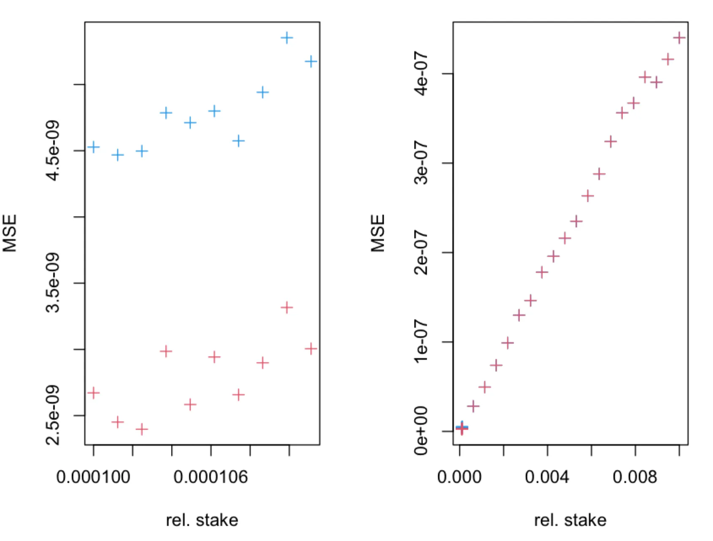

> The MSE of the estimator $`\hat{\alpha}_i`$ (blue + symbols) and $`A[\hat{\alpha}_i]`$ (red + symbols), obtained in $`M=10^3`$ simulations of leader election process, as a function of true relative stake $`\alpha_i=n\alpha_0`$, where $`\alpha_0=1/10^4`$. The leader election process, with parameter$`f=0.05`$, was simulated for $`T=432000`$ time-slots. The fraction of observed slots is $`q=1`$.

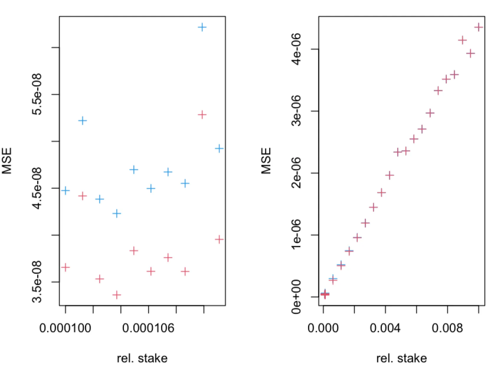

> The MSE of the estimator $`\hat{\alpha}_i`$ (blue + symbols) and $`A[\hat{\alpha}_i]`$ (red + symbols), obtained in $`M=10^3`$ simulations of leader election process, as a function of true relative stake $`\alpha_i=n\alpha_0`$, where $`\alpha_0=1/10^4`$. The leader election process, with parameter$`f=0.05`$, was simulated for $`T=432000`$ time-slots. The fraction of observed slots is $`q=1/10`$.

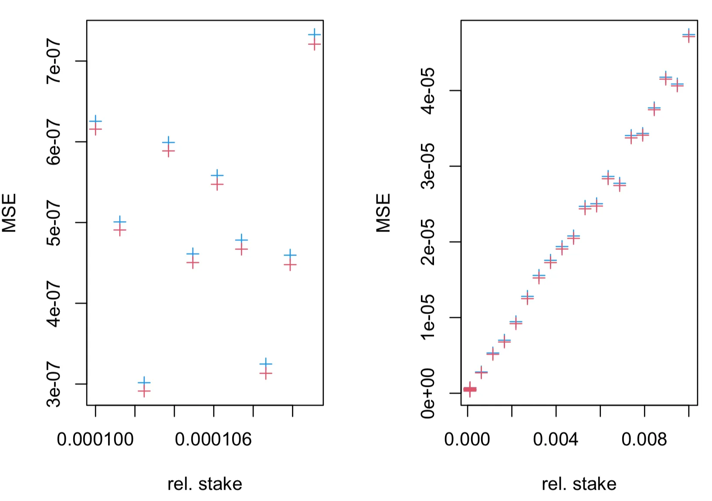

> The MSE of the estimator $`\hat{\alpha}_i`$ (blue + symbols) and $`A[\hat{\alpha}_i]`$ (red + symbols), obtained in $`M=10^3`$ simulations of leader election process, as a function of true relative stake $`\alpha_i=n\alpha_0`$, where $`\alpha_0=1/10^4`$. The leader election process, with parameter$`f=0.05`$, was simulated for $`T=432000`$ time-slots. The fraction of observed slots is $`q=1/100`$.

We are interested in the probability $`\mathrm{P}\left(A[\hat{\alpha}_i]\in[\alpha_i(1-\gamma), \alpha_i(1+\gamma)]\right)`$ which can be seen as [adversarial "confidence"](analysis-cryptarchia-de-anonymisation-of-relative-stake.md). Here $`0 \lt \gamma \lt 1`$ prescribes desired “accuracy” of the inference. We note that the probability $`\mathrm{P}\left(\hat{\alpha}_i\in[\alpha_i(1-\gamma), \alpha_i(1+\gamma)]\right)`$ can be [estimated analytically](analysis-cryptarchia-de-anonymisation-of-relative-stake.md) for large $T$. If for a given (accuracy) parameter $\gamma$ we have that $`\mathrm{P}\left(A[\hat{\alpha}_i]\in[\alpha_i(1-\gamma), \alpha_i(1+\gamma)]\right) \gt \mathrm{P}\left(\hat{\alpha}_i\in[\alpha_i(1-\gamma), \alpha_i(1+\gamma)]\right)`$ then the adversary has an advantage by using the new estimator, i.e. an adversary which knows that $`\alpha_i\geq\alpha_0`$ has a higher confidence than the adversary which doesn’t know the latter.

Recall that $`\alpha_0 \leq \alpha_i`$. We note that $`\alpha_0 \in [\alpha_i(1-\lambda), \alpha_i (1+\lambda)]`$, provided $`\alpha_i(1-\lambda) \leq \alpha_0`$. Let us assume (without loss of generality) that $`\alpha_i=n\,\alpha_0`$ for some $n\geq1$. Then, from $`\alpha_i(1-\gamma)\leq\alpha_0`$ follows that $`n\leq \frac{1}{1-\gamma}`$. Hence, if this inequality is satisfied, an adversary may have advantage. We compute the probabilities $`\mathrm{P}\left(A[\hat{\alpha}_i]\in[\alpha_i(1-\gamma), \alpha_i(1+\gamma)]\right)`$ and $`\mathrm{P}\left(\hat{\alpha}_i\in[\alpha_i(1-\gamma), \alpha_i(1+\gamma)]\right)`$ using simulation and find that the adversary has advantage for the relative stake $`\alpha_i\in[\alpha_0,\frac{\alpha_0}{1-\gamma}]`$, as can be seen in figures below.

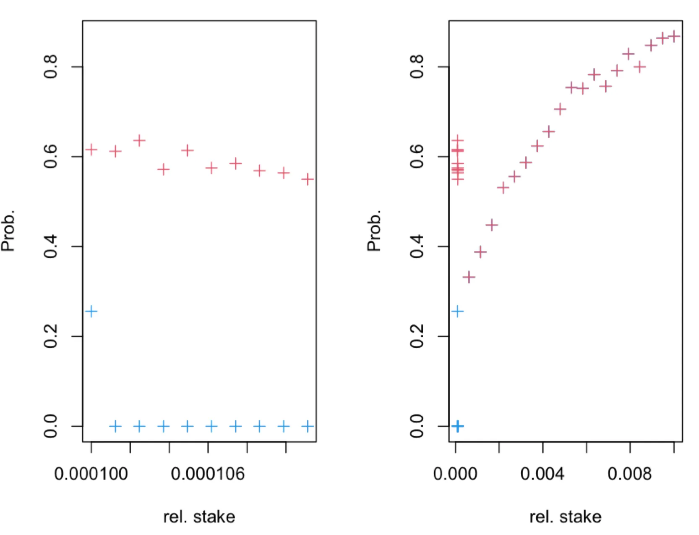

> The probability $`\mathrm{P}\left(\hat{\alpha}_i\in[\alpha_i(1-\gamma), \alpha_i(1+\gamma)]\right)`$ (blue + symbols) and $`\mathrm{P}\left(A[\hat{\alpha}_i]\in[\alpha_i(1-\gamma), \alpha_i(1+\gamma)]\right)`$ (red + symbols), obtained in $`M=10^3`$ simulations of leader election process for $`\gamma=1/10`$, as a function of true relative stake $`\alpha_i=n\alpha_0`$, where $`\alpha_0=1/10^4`$. The leader election process, with parameter$`f=0.05`$, was simulated for $`T=432000`$ time-slots. The fraction of observed slots is $`q=1`$.

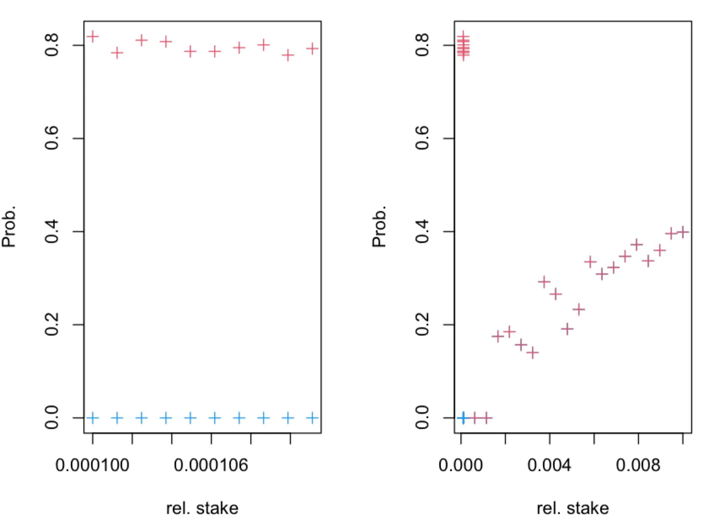

> The probability $`\mathrm{P}\left(\hat{\alpha}_i\in[\alpha_i(1-\gamma), \alpha_i(1+\gamma)]\right)`$ (blue + symbols) and $`\mathrm{P}\left(A[\hat{\alpha}_i]\in[\alpha_i(1-\gamma), \alpha_i(1+\gamma)]\right)`$ (red + symbols), obtained in $`M=10^3`$ simulations of leader election process for $`\gamma=1/10`$, as a function of true relative stake $`\alpha_i=n\alpha_0`$, where $`\alpha_0=1/10^4`$. The leader election process, with parameter$`f=0.05`$, was simulated for $`T=432000`$ time-slots. The fraction of observed slots is $`q=1/10`$.

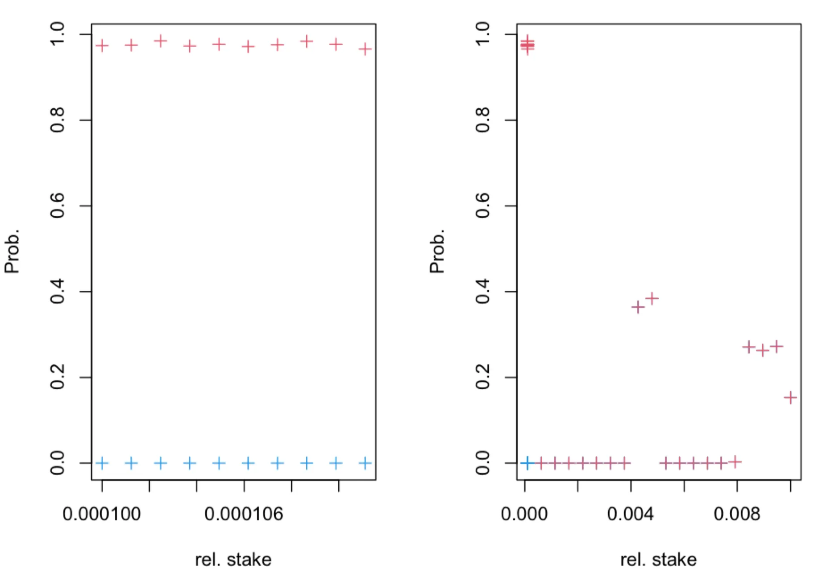

> The probability $`\mathrm{P}\left(\hat{\alpha}_i\in[\alpha_i(1-\gamma), \alpha_i(1+\gamma)]\right)`$ (blue + symbols) and $`\mathrm{P}\left(A[\hat{\alpha}_i]\in[\alpha_i(1-\gamma), \alpha_i(1+\gamma)]\right)`$ (red + symbols), obtained in $`M=10^3`$ simulations of leader election process for $`\gamma=1/10`$, as a function of true relative stake $`\alpha_i=n\alpha_0`$, where $`\alpha_0=1/10^4`$. The leader election process, with parameter$`f=0.05`$, was simulated for $`T=432000`$ time-slots. The fraction of observed slots is $`q=1/100`$.

## Numerical Experiments

In this section, we compare performance of the statistical estimators $`\hat{\alpha}_i`$ and $`A[\hat{\alpha}_i]`$ in a single run of a simulation. This can be seen as a scenario where two adversaries collect the same data from the leader election process, but one of the adversaries knows $`\alpha_0`$ and uses this in the statistical inference. To simulate the statistical inference of relative stake in one epoch ($T=432000$ time-slots) of the leader election process with parameter $f=0.05$, we sampled $`N=2\times10^3`$ random (stake) values from the [Pareto distribution](https://en.wikipedia.org/wiki/Pareto_distribution) with shape parameter $2.5$ and scale parameter $2$. The histogram of (relative) stake values is given below

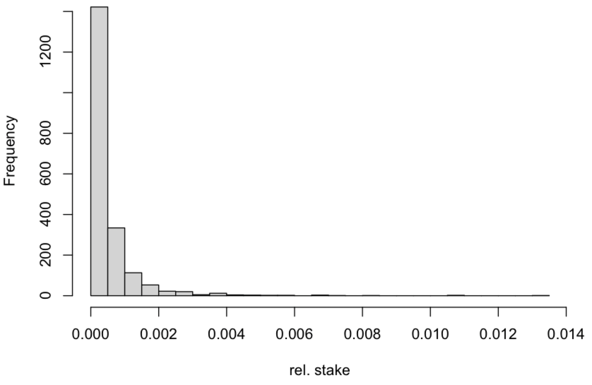

We consider inference only for $5$ nodes with the highest relative stake and for $5$ nodes with relative stake just above the threshold $`\alpha_0=1/10^4`$.  We consider a scenario where fraction $`q\in\{1/100,1/10,1\}`$ of time-slots of the leader election process are observed by adversary. Here we find differences between estimators only for nodes with relative stake close to $`\alpha_0`$ as can be seen in the figures below.

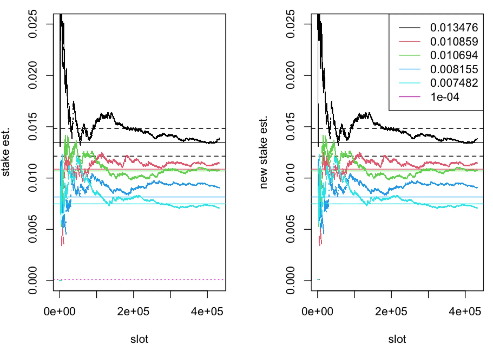

> The (relative) stake estimator $`\hat{\alpha}`$ (left panel) and $`A[\hat{\alpha}_i]`$ (right panel), computed in one epoch ($`T=432000`$ time-slots) of the leader election process with parameter $`f=0.05`$, plotted as a function of time-slots for five nodes with *true* (relative stake) $`\alpha\in\{0.007482,\ldots,0.013476\}`$, represented by solid horizontal lines. The boundaries of the interval $`[\alpha(1-\gamma), \alpha(1+\gamma)]`$ for $`\alpha=0.013476`$ and $`\gamma=1/10`$ are represented by dashed horizontal lines. The dotted horizontal line corresponds to $`\alpha_0=1/10^4`$. The fraction of observed slots is $`q=1`$.

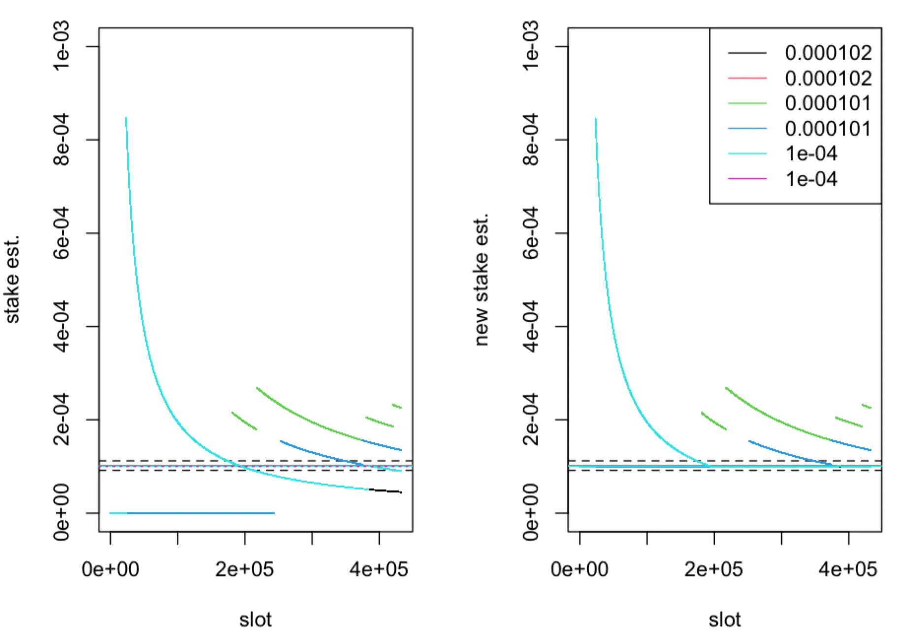

> The (relative) stake estimator $`\hat{\alpha}`$ (left panel) and $`A[\hat{\alpha}_i]`$ (right panel), computed in one epoch ($`T=432000`$ time-slots) of the leader election process with parameter $`f=0.05`$, plotted as a function of time-slots for five nodes with *true* (relative stake) $`\alpha\in\{0.0001004999,\ldots,0.0001018357\}`$, represented by solid horizontal lines. The boundaries of the interval $`[\alpha(1-\gamma), \alpha(1+\gamma)]`$ for $`\alpha=0.0001018357`$ and $`\gamma=1/10`$ are represented by dashed horizontal lines. The dotted horizontal line corresponds to $`\alpha_0=1/10^4`$. The fraction of observed slots is $`q=1`$.

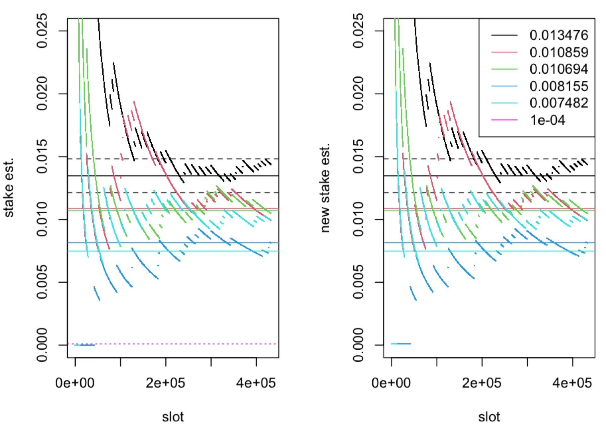

> The (relative) stake estimator $`\hat{\alpha}`$ (left panel) and $`A[\hat{\alpha}_i]`$ (right panel), computed in one epoch ($`T=432000`$ time-slots) of the leader election process with parameter $`f=0.05`$, plotted as a function of time-slots for five nodes with *true* (relative stake) $`\alpha\in\{0.007482,\ldots,0.013476\}`$, represented by solid horizontal lines. The boundaries of the interval $`[\alpha(1-\gamma), \alpha(1+\gamma)]`$ for $`\alpha=0.013476`$ and $`\gamma=1/10`$ are represented by dashed horizontal lines. The dotted horizontal line corresponds to $`\alpha_0=1/10^4`$. The fraction of observed slots is $`q=1/10`$.

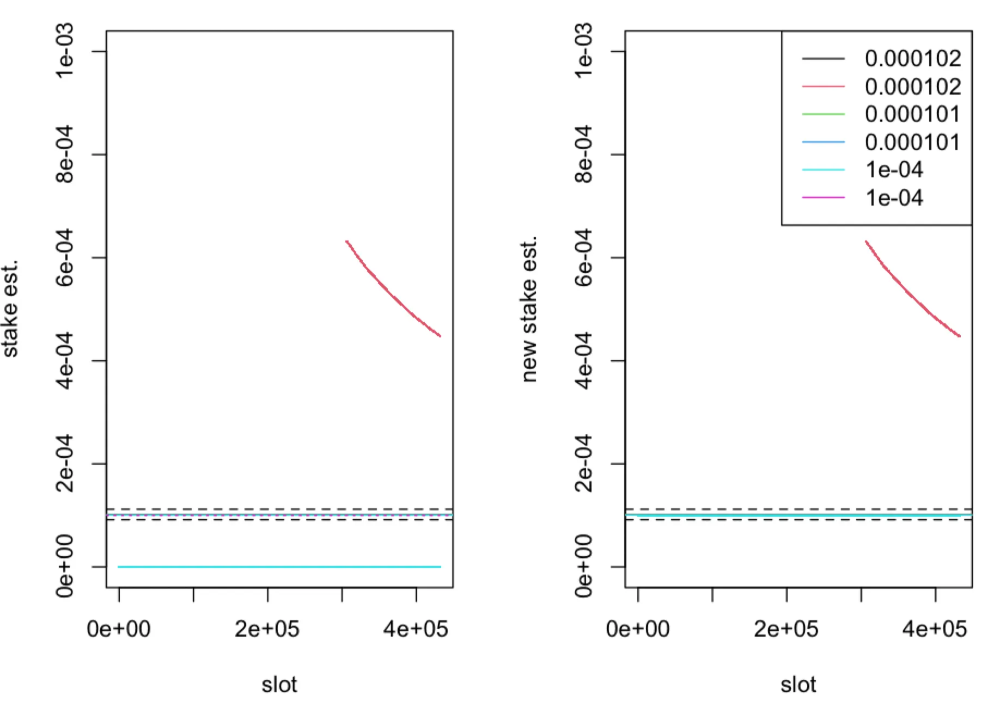

> The (relative) stake estimator $`\hat{\alpha}`$ (left panel) and $`A[\hat{\alpha}_i]`$ (right panel), computed in one epoch ($`T=432000`$ time-slots) of the leader election process with parameter $`f=0.05`$, plotted as a function of time-slots for five nodes with *true* (relative stake) $`\alpha\in\{0.0001004999,\ldots,0.0001018357\}`$, represented by solid horizontal lines. The boundaries of the interval $`[\alpha(1-\gamma), \alpha(1+\gamma)]`$ for $`\alpha=0.0001018357`$ and $`\gamma=1/10`$ are represented by dashed horizontal lines. The dotted horizontal line corresponds to $`\alpha_0=1/10^4`$. The fraction of observed slots is $`q=1/10`$.

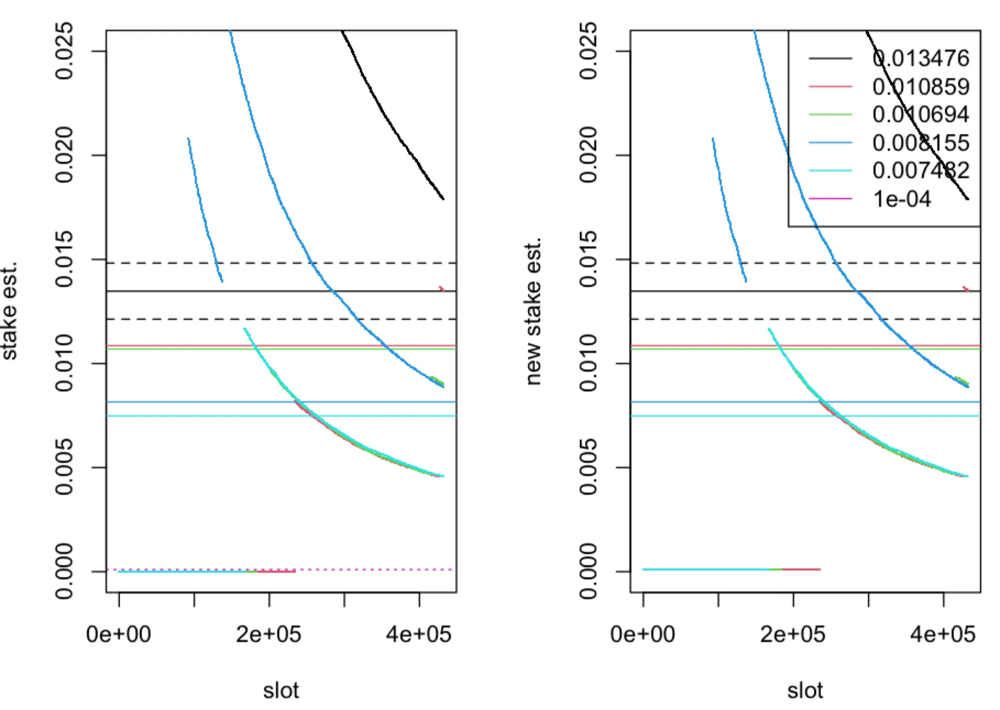

> The (relative) stake estimator $`\hat{\alpha}`$ (left panel) and $`A[\hat{\alpha}_i]`$ (right panel), computed in one epoch ($`T=432000`$ time-slots) of the leader election process with parameter $`f=0.05`$, plotted as a function of time-slots for five nodes with *true* (relative stake) $`\alpha\in\{0.007482,\ldots,0.013476\}`$, represented by solid horizontal lines. The boundaries of the interval $`[\alpha(1-\gamma), \alpha(1+\gamma)]`$ for $`\alpha=0.013476`$ and $`\gamma=1/10`$ are represented by dashed horizontal lines. The dotted horizontal line corresponds to $`\alpha_0=1/10^4`$. The fraction of observed slots is $`q=1/100`$.

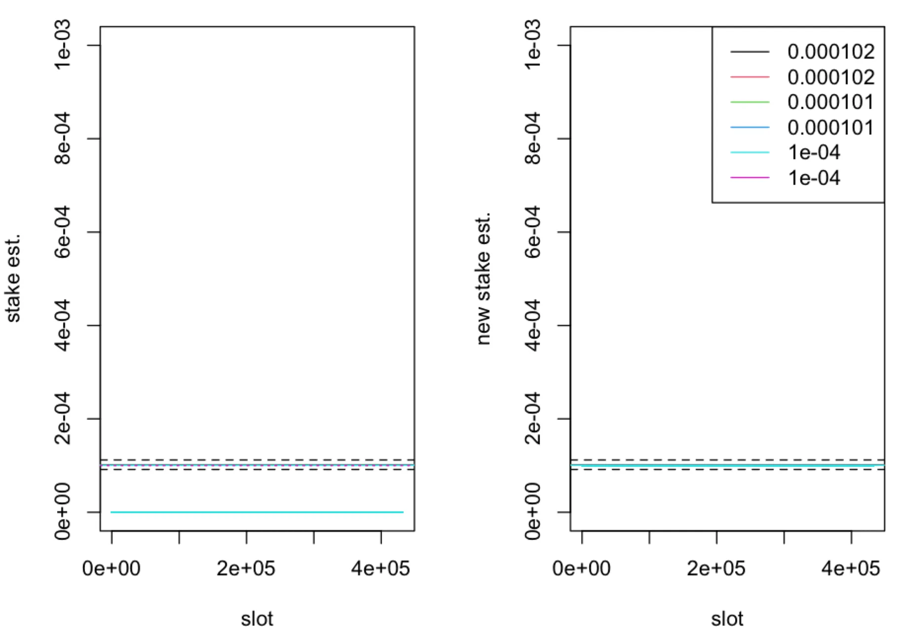

> The (relative) stake estimator $`\hat{\alpha}`$ (left panel) and $`A[\hat{\alpha}_i]`$ (right panel), computed in one epoch ($`T=432000`$ time-slots) of the leader election process with parameter $`f=0.05`$, plotted as a function of time-slots for five nodes with *true* (relative stake) $`\alpha\in\{0.0001004999,\ldots,0.0001018357\}`$, represented by solid horizontal lines. The boundaries of the interval $`[\alpha(1-\gamma), \alpha(1+\gamma)]`$ for $`\alpha=0.0001018357`$ and $`\gamma=1/10`$ are represented by dashed horizontal lines. The dotted horizontal line corresponds to $`\alpha_0=1/10^4`$. The fraction of observed slots is $`q=1/100`$.

# Appendix

## Inference of probability

The [leader election process](analysis-cryptarchia-de-anonymisation-of-relative-stake.md) is governed by the probability distribution

$$
\mathrm{P}(s_1(t),\ldots,s_N(t))=\prod_{i=1}^N\left[\phi(\alpha_i)\,\delta_{1;s_i(t)}+(1-\phi(\alpha_i))\,\delta_{0;s_i(t)}\right]
$$

of the outcome of election $`s_1(t),\ldots,s_N(t)`$, where $`s_i(t)\in\{0,1\}`$ models outcome ($0/1\equiv$ loss/win) for node $i$ in time-slot $t$. The fraction of observed wins of node $i$ in one epoch is

$$
\hat{P}_i(1)=\frac{1}{\sum_{t=1}^T\eta_i(t)}\sum_{t=1}^T\eta_i(t)\,\delta_{1;s_i(t)}
$$

where $`\sum_{t=1}^T\eta_i(t)\geq1`$, with $`\eta_i(t)\in\{0,1\}`$, is the total number of observations.

The average with respect to the [leader election process](analysis-cryptarchia-de-anonymisation-of-relative-stake.md) gives us

$$
\langle\hat{P}_i(1)\rangle=\frac{1}{\sum_{t=1}^T\eta_i(t)}\sum_{t=1}^T\eta_i(t)\,\langle\delta_{1;s_i(t)}\rangle=\phi(\alpha_i)
$$

i.e. $`\hat{P}_i(1)`$ is unbiased statistical estimator of prob. of winning $`\phi(\alpha_i)`$. In the above $`\langle\{\cdots\}\rangle`$ is the averaging “operator” defines as

$$
\langle\{\cdots\}\rangle=\lbrace\prod_{t=1}^T\prod_{i=1}^N \sum_{s_i(t)}\mathrm{P}(s_i(t))\rbrace \{\cdots\}
$$

where $`\mathrm{P}(s_i(t))=\phi(\alpha_i)\,\delta_{1;s_i(t)}+(1-\phi(\alpha_i))\,\delta_{0;s_i(t)}`$. Since $`\alpha_i=\beta_i+\alpha_0`$ and $`\phi(\beta_i+\alpha_0)\geq \phi(\alpha_0)`$, from above follows that $`\langle\hat{P}_i(1)\rangle\geq \phi(\alpha_0)`$.

The variance of $`\hat{P}_i(1)`$ is given by

$$
\mathrm{Var}[\hat{P}_i(1)]=\langle\hat{P}^2_i(1)\rangle-\langle\hat{P}_i(1)\rangle^2\\\quad =\frac{1}{\sum_{t=1}^T\eta_i(t)}\phi(\alpha_i)(1-\phi(\alpha_i))
$$

If $`\sum_{t=1}^T\eta_i(t)\rightarrow\infty`$ as $T\rightarrow\infty$, i.e. for a large number of observations, then $`\mathrm{Var}[\hat{P}_i(1)]\rightarrow0`$, i.e. $`\hat{P}_i(1)`$ is a consistent estimator of the prob. $`\phi(\alpha_i)`$.

Let us define the new estimator of $`\phi(\alpha_i)`$ as follows

$$
\begin{aligned}
\Phi[\hat{P}_i(1)]
&=\phi(\alpha_0)\,\mathbf{1}[\hat{P}_i(1)\leq\phi(\alpha_0)]+\hat{P}_i(1)\,\mathbf{1}[\hat{P}_i(1)>\phi(\alpha_0)]\\
&=\phi(\alpha_0)\,\mathbf{1}[\hat{P}_i(1)\leq\phi(\alpha_0)]+\hat{P}_i(1)\lbrace1-\mathbf{1}[\hat{P}_i(1)\leq\phi(\alpha_0)]\rbrace\\
&=\hat{P}_i(1)+\mathbf{1}[\hat{P}_i(1)\leq\phi(\alpha_0)]\lbrace\phi(\alpha_0)-\hat{P}_i(1)\rbrace
\end{aligned}
$$

The average with respect to leader election process gives us

$$
\langle\Phi[\hat{P}_i(1)]\rangle=\phi(\alpha_i)+\left\langle\mathbf{1}[\hat{P}_i(1)\leq\phi(\alpha_0)]\lbrace\phi(\alpha_0)-\hat{P}_i(1)\rbrace\right\rangle
$$

i.e. the estimator $`\Phi[\hat{P}_i(1)]`$ has (positive) bias. We expect that in the limit $`\sum_{t=1}^T\eta_i(t)\rightarrow\infty`$ as $T\rightarrow\infty$, i.e. for a large number of observations, the average $`\langle\Phi[\hat{P}_i(1)]\rangle\rightarrow\phi(\alpha_i)`$. We note that since $`\mathbf{1}[\hat{P}_i(1)\leq\phi(\alpha_0)]\{\phi(\alpha_0)-\hat{P}_i(1)\}\geq0`$, we have that

$$
\begin{aligned}
\langle\Phi[\hat{P}_i(1)]\rangle
&=\phi(\alpha_i)+\left\langle\mathbf{1}[\hat{P}_i(1)\leq\phi(\alpha_0)]\lbrace\phi(\alpha_0)-\hat{P}_i(1)\rbrace\right\rangle\\
&\leq \phi(\alpha_i)+\phi(\alpha_0)\left\langle\mathbf{1}[\hat{P}_i(1)\leq\phi(\alpha_0)]\right\rangle
\end{aligned}
$$

and

$$
\langle\Phi[\hat{P}_i(1)]\rangle\geq\phi(\alpha_i)
$$

Now, for $`\mathrm{Prob}(\hat{P}_i(1)\leq\phi(\alpha_0))=\left\langle\mathbf{1}[\hat{P}_i(1)\leq\phi(\alpha_0)]\right\rangle`$ by the Markov’s inequality we have

$$
\begin{aligned}
\mathrm{Prob}(\hat{P}_i(1)\leq\phi(\alpha_0))
&=\mathrm{Prob}\left(\sum_{t=1}^T\eta_i(t)\,\delta_{1;s_i(t)}\leq\phi(\alpha_0)\sum_{t=1}^T\eta_i(t)\right)\\
&=\mathrm{Prob}\left(\mathrm{e}^{-\lambda\sum_{t=1}^T\eta_i(t)\,\delta_{1;s_i(t)}}\geq\mathrm{e}^{-\lambda\phi(\alpha_0)\sum_{t=1}^T\eta_i(t)}\right)\\
&\leq\frac{\left\langle\mathrm{e}^{-\lambda\sum_{t=1}^T\eta_i(t)\,\delta_{1;s_i(t)}}\right\rangle}{\mathrm{e}^{-\lambda\phi(\alpha_0)\sum_{t=1}^T\eta_i(t)}}
\end{aligned}
$$

where $`\lambda \gt 0`$. Using the [definition](#inference-of-probability), the average on the RHS of the above can be computed as follows

$$
\begin{aligned}
\left\langle\mathrm{e}^{-\lambda\sum_{t=1}^T\eta_i(t)\,\delta_{1;s_i(t)}}\right\rangle
&=\lbrace\prod_{t=1}^T\prod_{j=1}^N \sum_{s_j(t)}\mathrm{P}(s_j(t))\rbrace\mathrm{e}^{-\lambda\sum_{t=1}^T\eta_i(t)\,\delta_{1;s_i(t)}}\\
&=\prod_{t=1}^T\sum_{s_i(t)}\mathrm{P}(s_i(t))\,\mathrm{e}^{-\lambda\eta_i(t)\,\delta_{1;s_i(t)}}\\
&=\prod_{t=1}^T\left(\phi(\alpha_i)\,\mathrm{e}^{-\lambda\eta_i(t)}+1-\phi(\alpha_i)\right)\\
&=\mathrm{e}^{\sum_{t=1}^T\log\left(\phi(\alpha_i)\,\mathrm{e}^{-\lambda\eta_i(t)}+1-\phi(\alpha_i)\right)}\\
&=\mathrm{e}^{\sum_{t=1}^T\eta_i(t)\log\left(\phi(\alpha_i)\,\mathrm{e}^{-\lambda}+1-\phi(\alpha_i)\right)}
\end{aligned}
$$

Using above result in the [inequality](#inference-of-probability) we obtain

$$
\mathrm{Prob}(\hat{P}_i(1)\leq\phi(\alpha_0))\leq\mathrm{e}^{\sum_{t=1}^T\eta_i(t)\left[\log\left(\phi(\alpha_i)\,\mathrm{e}^{-\lambda}+1-\phi(\alpha_i)\right)+\lambda\phi(\alpha_0)\right]}
$$

Furthermore, optimising the RHS in above with respect to $\lambda$ we obtain the inequality

$$
\mathrm{Prob}(\hat{P}_i(1)\leq\phi(\alpha_0))\leq \mathrm{e}^{\sum_{t=1}^T\eta_i(t)\left[\log \left(\frac{1-\phi(\alpha)}{1-\phi(\alpha_0) }\right)-\log \left(\frac{\phi(\alpha_0)}{\phi(\alpha)}\frac{ 1-\phi(\alpha)}{  1-\phi(\alpha_0) }\right) \phi(\alpha_0)\right]}
$$

We note that $`\log \left(\frac{1-\phi(\alpha)}{1-\phi(\alpha_0) }\right)-\log \left(\frac{\phi(\alpha_0)}{\phi(\alpha)}\frac{ 1-\phi(\alpha)}{ 1-\phi(\alpha_0) }\right) \phi(\alpha_0)`$ is monotonic decreasing function of $\phi(\alpha)$ which is exactly zero when $`\phi(\alpha)=\phi(\alpha_0)`$ and hence this function is negative for $`\phi(\alpha)\geq\phi(\alpha_0)`$. Hence we have the following inequality

$$
\mathrm{Prob}(\hat{P}_i(1)\leq\phi(\alpha_0))\leq \mathrm{e}^{-\sum_{t=1}^T\eta_i(t)\left[-\log \left(\frac{1-\phi(\alpha)}{1-\phi(\alpha_0) }\right)+\log \left(\frac{\phi(\alpha_0)}{\phi(\alpha)}\frac{ 1-\phi(\alpha)}{  1-\phi(\alpha_0) }\right) \phi(\alpha_0)\right]}
$$

where $`-\log \left(\frac{1-\phi(\alpha)}{1-\phi(\alpha_0) }\right)+\log \left(\frac{\phi(\alpha_0)}{\phi(\alpha)}\frac{ 1-\phi(\alpha)}{ 1-\phi(\alpha_0) }\right) \phi(\alpha_0) \gt 0`$ when $`\phi(\alpha) \gt \phi(\alpha_0)`$.

From above follows that $`\mathrm{Prob}(\hat{P}_i(1)\leq\phi(\alpha_0))\rightarrow0`$ in the limit $`\sum_{t=1}^T\eta_i(t)\rightarrow\infty`$ as $T\rightarrow\infty$, i.e. for a large number of observations. Using the latter in the [upper bound](#inference-of-probability) gives us that $`\langle\Phi[\hat{P}_i(1)]\rangle\rightarrow\phi(\alpha_i)`$ in this limit. If in the limit of large number of observations we also have that the $`\mathrm{Var}[\Phi[\hat{P}_i(1)]]\rightarrow0`$ then $`\Phi[\hat{P}_i(1)]`$ is a consistent estimator of the prob. $`\phi(\alpha_i)`$.

For $`\Phi[\hat{P}_i(1)]=\hat{P}_i(1)+\xi_i`$, where we defined $`\xi_i=\mathbf{1}[\hat{P}_i(1)\leq\phi(\alpha_0)]\lbrace\phi(\alpha_0)-\hat{P}_i(1)\rbrace`$, the $`\mathrm{Var}[\Phi[\hat{P}_i(1)]]`$ is given by

$$
\mathrm{Var}[\Phi[\hat{P}_i(1)]]=\mathrm{Var}[\hat{P}_i(1)+\xi_i]=\mathrm{Var}[\hat{P}_i(1)]+2\,\mathrm{Cov}[\hat{P}_i(1),\xi_i]+\mathrm{Var}[\xi_i].
$$

In the [Variance section](#variance-of-phihatpi1) we show that

$$
\mathrm{Var}[\Phi[\hat{P}_i(1)]]\leq\mathrm{Var}[\hat{P}_i(1)].
$$

Hence in the limit of large number of observations $`\mathrm{Var}[\Phi[\hat{P}_i(1)]]\rightarrow0`$.

Thus from above follows that

$$
\Phi[\hat{P}_i(1)]=\hat{P}_i(1)+\mathbf{1}[\hat{P}_i(1)\leq\phi(\alpha_0)]\lbrace\phi(\alpha_0)-\hat{P}_i(1)\rbrace
$$

is unbiased and consistent estimator of the prob. $`\phi(\alpha_i)`$ in the limit of large number of observations $`\sum_{t=1}^T\eta_i(t)\rightarrow\infty`$ as $T\rightarrow\infty$.

For $`\sum_{t=1}^T\eta_i(t)\geq1`$ the [mean squared error](https://en.wikipedia.org/wiki/Mean_squared_error) (MSE) of the estimator $`\hat{P}_i(1)`$ is given by

$$
\langle\vert \phi(\alpha_i) -\hat{P}_i(1)\vert^2\rangle =\mathrm{Var}[\hat{P}_i(1)]=\frac{1}{\sum_{t=1}^T\eta_i(t)}\phi(\alpha_i)(1-\phi(\alpha_i))
$$

Assuming that the $`\eta_i(t)`$ variables are exactly the same as in the above, the MSE of the estimator $`\Phi[\hat{P}_i(1)]`$ is given by

$$
\begin{aligned}
\langle\vert \phi(\alpha_i) -\Phi[\hat{P}_i(1)]\vert^2\rangle
&=\mathrm{Var}[\Phi[\hat{P}_i(1)]]+\left\vert\phi(\alpha_i)-\langle\Phi[\hat{P}_i(1)]\rangle\right\vert^2\\
&=\mathrm{Var}[\Phi[\hat{P}_i(1)]]\\
&\quad+\left\langle\mathbf{1}[\hat{P}_i(1)\leq\phi(\alpha_0)]\lbrace\phi(\alpha_0)-\hat{P}_i(1)\rbrace\right\rangle^2
\end{aligned}
$$

Consider the difference$`\langle\vert \phi(\alpha_i) -\Phi[\hat{P}_i(1)]\vert^2\rangle-\langle\vert \phi(\alpha_i) -\hat{P}_i(1)\vert^2\rangle`$ as follows

$$
\begin{aligned}
&\langle\vert \phi(\alpha_i) -\Phi[\hat{P}_i(1)]\vert^2\rangle-\langle\vert \phi(\alpha_i) -\hat{P}_i(1)\vert^2\rangle\\
&=\mathrm{Var}[\hat{P}_i(1)]+2\,\mathrm{Cov}[\hat{P}_i(1),\xi_i]+\mathrm{Var}[\xi_i]\\
&\quad+\left\langle\mathbf{1}[\hat{P}_i(1)\leq\phi(\alpha_0)]\lbrace\phi(\alpha_0)-\hat{P}_i(1)\rbrace\right\rangle^2-\mathrm{Var}[\hat{P}_i(1)]\\
&=2\,\mathrm{Cov}[\hat{P}_i(1),\xi_i]+\mathrm{Var}[\xi_i]+\left\langle\mathbf{1}[\hat{P}_i(1)\leq\phi(\alpha_0)]\lbrace\phi(\alpha_0)-\hat{P}_i(1)\rbrace\right\rangle^2\\
&=2\,\mathrm{Cov}[\hat{P}_i(1),\xi_i]+\left\langle\mathbf{1}[\hat{P}_i(1)\leq\phi(\alpha_0)]\lbrace\phi(\alpha_0)-\hat{P}_i(1)\rbrace^2\right\rangle
\end{aligned}
$$

Now the last line in the above can be bounded as follows

$$
2\,\mathrm{Cov}[\hat{P}_i(1),\xi_i]+\left\langle\mathbf{1}[\hat{P}_i(1)\leq\phi(\alpha_0)]\lbrace\phi(\alpha_0)-\hat{P}_i(1)\rbrace^2\right\rangle\\
%
\quad =-2\left\langle\mathbf{1}[\hat{P}_i(1)\leq\phi(\alpha_0)]\lbrace\phi(\alpha_i)-\hat{P}_i(1)\rbrace\lbrace\phi(\alpha_0)-\hat{P}_i(1)\rbrace\right\rangle\\
%
\quad +\left\langle\mathbf{1}[\hat{P}_i(1)\leq\phi(\alpha_0)]\lbrace\phi(\alpha_0)-\hat{P}_i(1)\rbrace^2\right\rangle\\
%
\quad \leq-2\left\langle\mathbf{1}[\hat{P}_i(1)\leq\phi(\alpha_0)]\lbrace\phi(\alpha_i)-\hat{P}_i(1)\rbrace\lbrace\phi(\alpha_0)-\hat{P}_i(1)\rbrace\right\rangle\\
%
\quad +\left\langle\mathbf{1}[\hat{P}_i(1)\leq\phi(\alpha_0)]\lbrace\phi(\alpha_i)-\hat{P}_i(1)\rbrace\lbrace\phi(\alpha_0)-\hat{P}_i(1)\rbrace\right\rangle\\
%
\quad =-\left\langle\mathbf{1}[\hat{P}_i(1)\leq\phi(\alpha_0)]\lbrace\phi(\alpha_i)-\hat{P}_i(1)\rbrace\lbrace\phi(\alpha_0)-\hat{P}_i(1)\rbrace\right\rangle
$$

Hence

$$
\langle\vert \phi(\alpha_i) -\Phi[\hat{P}_i(1)]\vert^2\rangle-\langle\vert \phi(\alpha_i) -\hat{P}_i(1)\vert^2\rangle\\
%
\quad \leq -\left\langle\mathbf{1}[\hat{P}_i(1)\leq\phi(\alpha_0)]\lbrace\phi(\alpha_i)-\hat{P}_i(1)\rbrace\lbrace\phi(\alpha_0)-\hat{P}_i(1)\rbrace\right\rangle
$$

Thus, the MSE of the unbiased estimator $`\hat{P}_i(1)`$ is greater that the MSE of the biased, but consistent, estimator $`\Phi[\hat{P}_i(1)]`$.

## Variance of $`\Phi[\hat{P}_i(1)]`$​

For $`\Phi[\hat{P}_i(1)]=\hat{P}_i(1)+\xi_i`$, where $`\xi_i=\mathbf{1}[\hat{P}_i(1)\leq\phi(\alpha_0)]\lbrace\phi(\alpha_0)-\hat{P}_i(1)\rbrace`$, we consider the variance

$$
\mathrm{Var}[\Phi[\hat{P}_i(1)]]=\mathrm{Var}[\hat{P}_i(1)+\xi_i]\\\quad =\mathrm{Var}[\hat{P}_i(1)]+2\,\mathrm{Cov}[\hat{P}_i(1),\xi_i]+\mathrm{Var}[\xi_i]
$$

First, we consider the covariance

$$
\begin{aligned}
\mathrm{Cov}[\hat{P}_i(1),\xi_i]
&=\langle\hat{P}_i(1)\,\xi_i\rangle-\langle\hat{P}_i(1)\rangle\langle\xi_i\rangle\\
&=\langle\hat{P}_i(1)\,\xi_i\rangle-\phi(\alpha_i)\langle\xi_i\rangle\\
&=\left\langle\hat{P}_i(1)\,\mathbf{1}[\hat{P}_i(1)\leq\phi(\alpha_0)]\lbrace\phi(\alpha_0)-\hat{P}_i(1)\rbrace\right\rangle\\
&\quad-\phi(\alpha_i)\left\langle\mathbf{1}[\hat{P}_i(1)\leq\phi(\alpha_0)]\lbrace\phi(\alpha_0)-\hat{P}_i(1)\rbrace\right\rangle\\
&=-\left\langle\mathbf{1}[\hat{P}_i(1)\leq\phi(\alpha_0)]\lbrace\phi(\alpha_i)-\hat{P}_i(1)\rbrace\lbrace\phi(\alpha_0)-\hat{P}_i(1)\rbrace\right\rangle
\end{aligned}
$$

Because of $`\phi(\alpha_0)\leq \phi(\alpha_i)`$, from the above it follows that $`\mathrm{Cov}[\hat{P}_i(1),\xi_i]\leq0`$.

Second, we consider the variance

$$
\mathrm{Var}[\xi_i]=\left\langle\mathbf{1}[\hat{P}_i(1)\leq\phi(\alpha_0)]^2\lbrace\phi(\alpha_0)-\hat{P}_i(1)\rbrace^2\right\rangle-\left\langle\xi_i\right\rangle^2\\
%
\quad =\left\langle\mathbf{1}[\hat{P}_i(1)\leq\phi(\alpha_0)]\lbrace\phi(\alpha_0)-\hat{P}_i(1)-\left\langle\xi_i\right\rangle\rbrace\lbrace\phi(\alpha_0)-\hat{P}_i(1)\rbrace\right\rangle\\
%
~=\left\langle\mathbf{1}[\hat{P}_i(1)\leq\phi(\alpha_0)]\lbrace\phi(\alpha_i)-\hat{P}_i(1)+\phi(\alpha_0)-\phi(\alpha_i)-\left\langle\xi_i\right\rangle\rbrace\lbrace\phi(\alpha_0)-\hat{P}_i(1)\rbrace\right\rangle\\
%
\quad \leq \left\langle\mathbf{1}[\hat{P}_i(1)\leq\phi(\alpha_0)]\lbrace\phi(\alpha_i)-\hat{P}_i(1)\rbrace\lbrace\phi(\alpha_0)-\hat{P}_i(1)\rbrace\right\rangle=-\mathrm{Cov}[\hat{P}_i(1),\xi_i]
$$

Thus, from the above it follows that $`\mathrm{Var}[\xi_i]\leq -\mathrm{Cov}[\hat{P}_i(1),\xi_i]`$. The latter with $`-\mathrm{Cov}[\hat{P}_i(1), \xi_i] \geq 0`$ implies $`\mathrm{Cov}[\hat{P}_i(1),\xi_i]\leq-\mathrm{Var}[\xi_i]/2`$ which using the [variance equation](#variance-of-phihatpi1) gives us that

$$
\mathrm{Var}[\Phi[\hat{P}_i(1)]]\leq\mathrm{Var}[\hat{P}_i(1)]
$$
