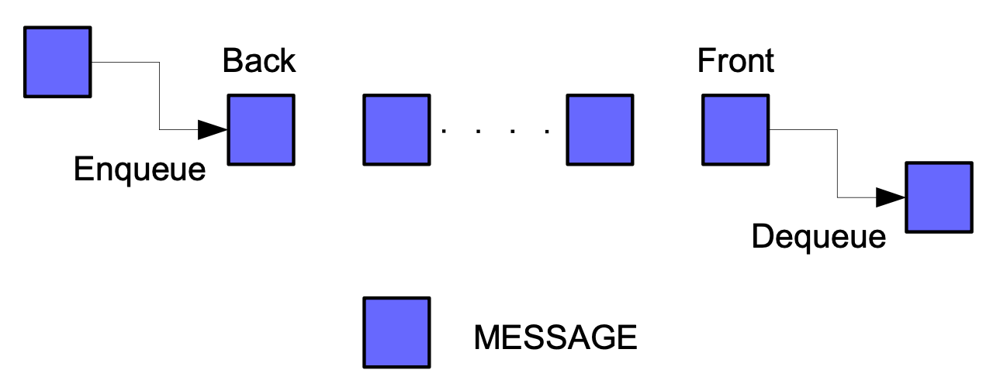
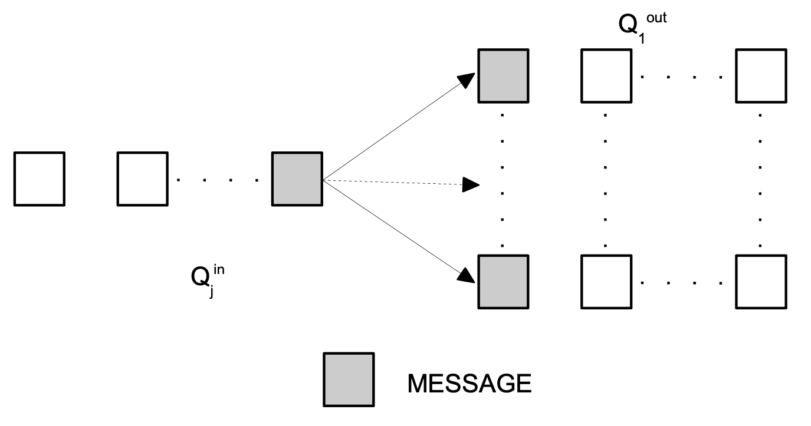
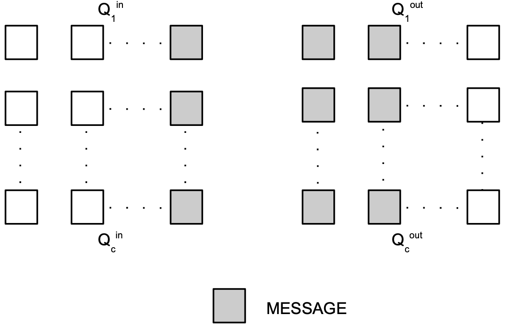
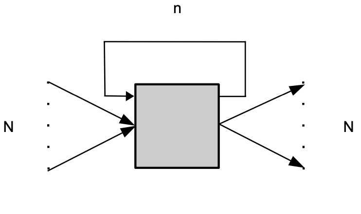
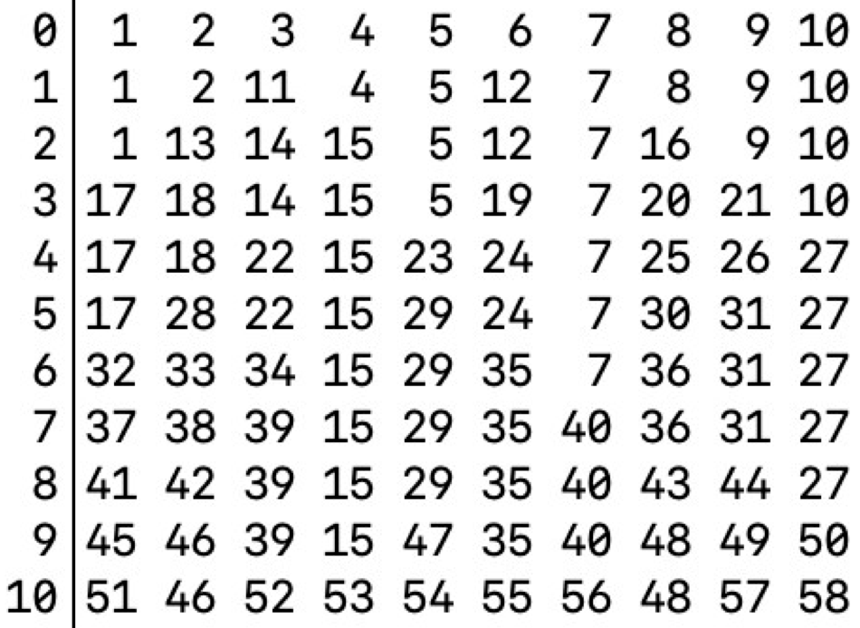
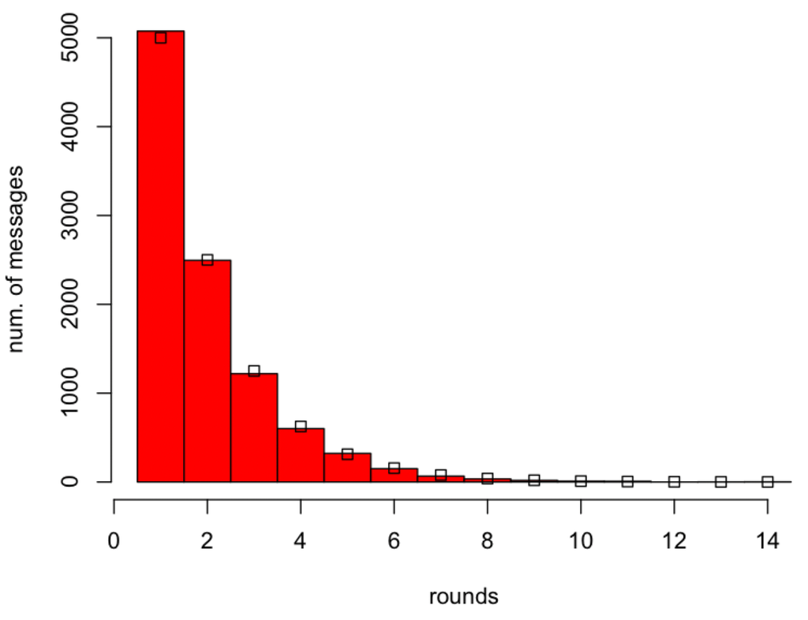
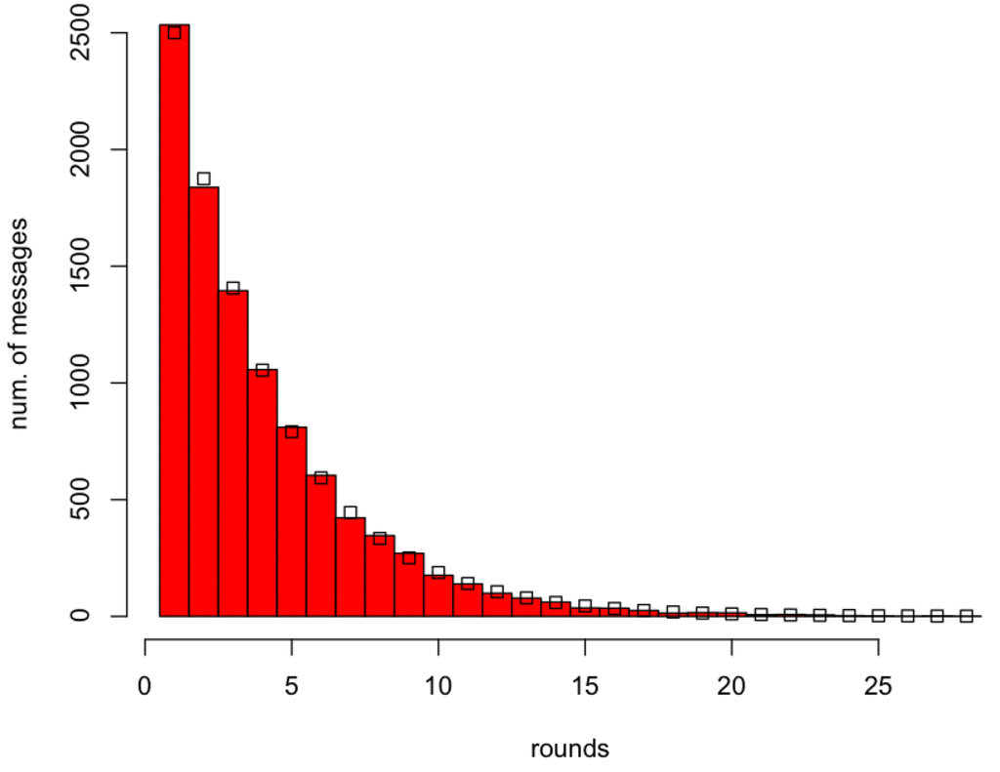
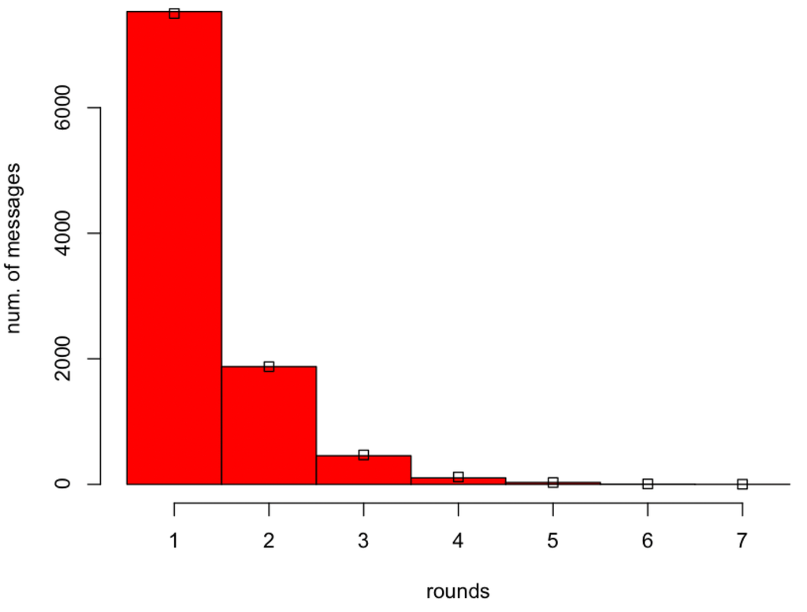
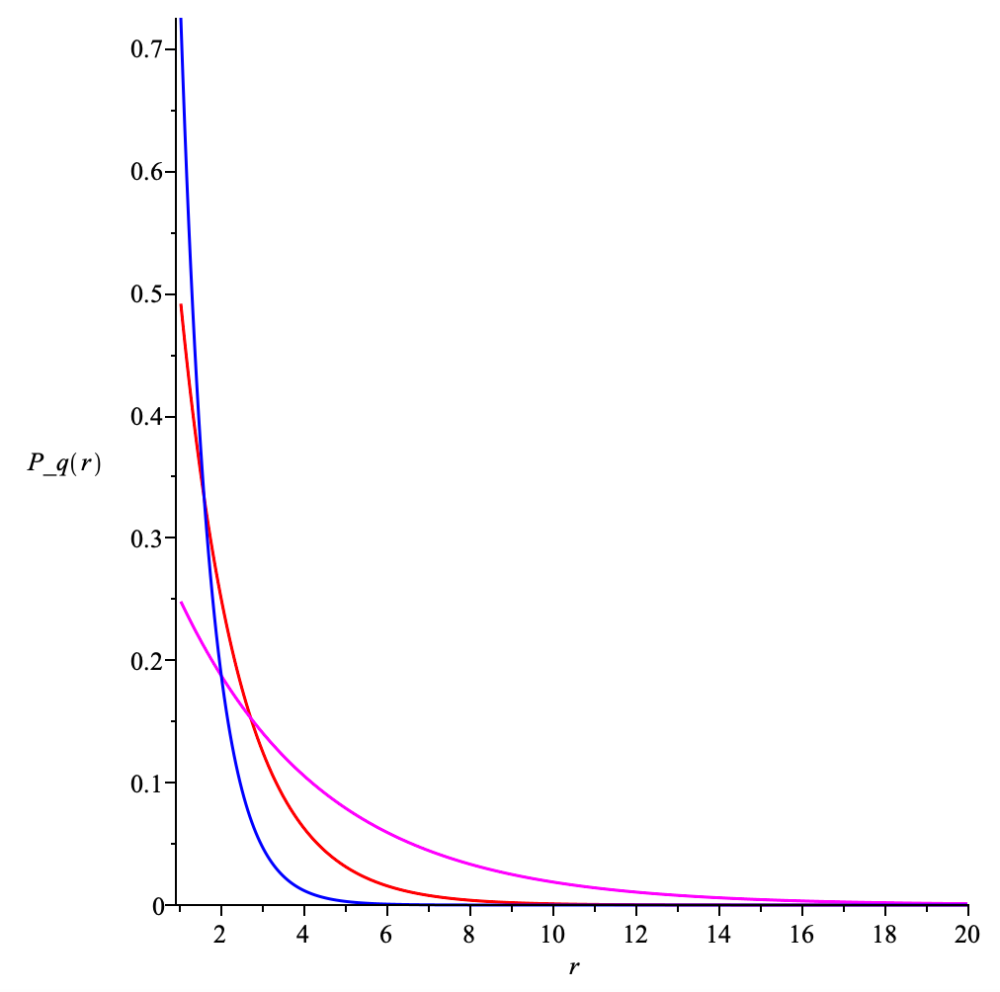

# ANALYSIS-QUEUING-SYSTEM-IN-THE-MIX-NODE

| Field | Value |
| --- | --- |
| Name | [Analysis] Queuing System in the Mix Node |
| Slug | 194 |
| Status | raw |
| Category | Informational |
| Editor | Alexander Mozeika <alexander.mozeika@logos.co> |
| Contributors | Filip Dimitrijevic <filip@logos.co> |

<!-- timeline:start -->

## Timeline

- **2026-05-27** — [`b7602ed`](https://github.com/logos-co/logos-lips/blob/b7602ed8a225d41ca0bfaaa432524dc84d2ded7e/docs/blockchain/raw/analysis-queuing-system-in-the-mix-node.md) — chore: move blockchain specs from notion to github

<!-- timeline:end -->

# Revision History

| Version | Changes | Date |
| --- | --- | --- |
| 1.0.0 | Initial revision. | 2025-09-08 |

# Introduction

We consider queuing system of a mix node where coin-flipping algorithm is used to remove messages. We show that the amount of time message spends in a queue is governed by the [Geometric distribution](https://en.wikipedia.org/wiki/Geometric_distribution). The consequence of the latter is [memorylessness](https://en.wikipedia.org/wiki/Memorylessness) property, i.e. the amount of time a message will spend in the queue is independent on how long it is already been in the queue, [which is important for anonymity of communication](#bibliography).

# Overview

This document analyses how a mix node—a privacy tool that hides message origins—manages delays using randomised queues. Key points:

1. Queue Design:
    - Each connection has an in-queue (FIFO order) and out-queue with randomised removal.
    - A "Relayer" forwards real messages to all out-queues except the sender’s, dropping dummies.
1. Randomised Delays:
    - Messages in the out-queue are shuffled, then each has probability $q$ (e.g., 50%) of being sent per round.
    - This follows a Geometric distribution: ~50% sent in Round 1, ~25% in Round 2, etc.
1. Anonymity Guarantee:
    - The system’s memorylessness ensures delays are independent of past wait times, preventing timing attacks.

Methods used:

- Geometric distribution models rounds until a message is sent.
- Simulations (e.g., sending 10,000 messages) validate the theory.
- Binomial distribution tracks messages removed per round.

Why It Matters:

- Balances privacy (unpredictable delays) with efficiency (tunable via $q$).
- Foundations for Tor-like systems and anonymous networks.

# Analysis

## Assumptions

We assume that node $i$ has $`c_i`$ connections to other nodes, labelled by the set $`[c_i]`$, and two queues (”in-queue” and “out-queue”), associated with each connection. Messages which arrive via the connection $`\ell\in [c_i]`$ are stored in the in-queue $`Q_\ell^{in}`$. Messages which are sent via the connection $`\ell\in [c_i]`$ are stored in the out-queue $`Q_\ell^{out}`$. Messages are added to the back and removed from the front of $`Q_\ell^{in}`$, i.e. the latter is [the FIFO queue](https://en.wikipedia.org/wiki/FIFO_(computing_and_electronics))

> Representation of a FIFO (first in, first out) queue.

We note that FIFO queue preserves temporal order of arriving messages.

The Relayer removes a message from the front of $`Q_\ell^{in}`$ and i) drops it if the message is a dummy or ii) adds the message to the back of all $`Q_k^{out}`$, where $`k\in[c_i]\setminus j`$, queues (i.e. all out-queues but $j$) if message is “real”.

Above operation is repeated by Relayer for all $`j\in [c_i]`$

## Analysis of a single out-queue

Let us consider, without loss of generality, the out-queue $`Q_1^{out}`$ and assume that the front of $`Q_1^{out}`$ holds $n$ messages which arrived at times $`t_1\leq t_2\leq\cdots\leq t_n`$.  Furthermore, we assume that messages which arrive at times after time $`t_n`$, $`t_i \gt t_n`$, are labelled by $`i\in \mathbb{N}\setminus [n]`$, i.e. we assume that messages are labelled by the set $`\mathbb{N}`$.

The above $n$ messages are shuffled, which is equivalent to random permutation, then each message is removed from the queue with probability $q$ and sent.  In above removal of a message which arrived at time $`t_i`$ can be modeled by the binary variable $`x_i\in\{0,1\}`$, where $0/1$ corresponds to not-removed/removed.  We note that number of removed messages in this process is the random variable from binomial distribution with parameters $n$ and $q$. Hence above process on average (and (approx.) typically) removes $q\, n$ messages from the queue $`Q_1^{out}`$. The above algorithm can be seen as a variant of the pool mix (see the [article](#bibliography))

> A pool mix.

However, in the pool mix model a fixed number (of randomly selected messages) is removed and sent, but in the algorithm this number is random.

Let us assume that messages are removed from the front of the out-queue $`Q_1^{out}`$ in rounds (or epochs) and if a message which arrived at time $`t_i`$, where $`i\in \mathbb{N}`$, was removed at round $r$ then $`x_i(r)=1`$ and $`x_i(k)=0`$ for $`1\leq k \lt r`$. We assume that after each round of removal the removed messages are replaced with new messages and the front $n$ messages in the queue are shuffled before the next round of removal.  We assume that round $`r\in\mathbb{N}`$ follows the [Geometric distributio](https://en.wikipedia.org/wiki/Geometric_distribution)n

$$
\mathrm{P}_q(r)=(1-q)^{r-1}q
$$

To test above hypothesis we consider the following random process.

> The message removal process in the out-queue $`Q_1^{out}`$. At round $`0`$ the front of the queue contained $`n=10`$ messages.  Here messages are  labelled by the set $`\mathbb{N}`$ (top row). In round $`1`$, and in subsequent rounds, each message is removed, with the prob. $`q=1/2`$, and replaced with a next message from the queue $`Q_1^{out}`$.

Computing the histogram of “the number of rounds a messages stays in the queue” random variable confirms that the latter follows the Geometric distribution.

> Histogram of the number of messages removed from the front of the queue $`Q_1^{out}`$ at round $`1`$, $`2`$, etc. of the random message removal process with $`q=1/2`$. At round $`0`$ the front of the queue contained $`n=10^4`$ messages. Here the simulation (red histogram bars) is compared with the prediction $`n\,\mathrm{P}_q(r)`$ of Geometric distribution (square boxes). We note that for $`q=1/2`$ on average $`n/2`$ messages were removed at round $`1`$, $`n/4`$ messages were removed at round $`2`$, etc.

Decreasing $q$ reduces number of messages removed per round as can be seen below.

> Histogram of the number of messages removed from the front of the queue $`Q_1^{out}`$ at round $`1`$, $`2`$, etc. of the random message removal process with $`q=1/4`$. At round $`0`$ the front of queue contained $`n=10^4`$ messages. Here the simulation (red histogram bars) is compared with the prediction $`n\,\mathrm{P}_q(r)`$ of Geometric distribution (square boxes). We note that for $`q=1/4`$ on average $`n/4`$ messages were removed at round $`1`$, $`(n-n/4)/4`$ messages were removed at round $`2`$, etc.

Increasing $q$ increases number of messages removed per round as can be seen below.

> Histogram of the number of messages removed from the front of the queue $`Q_1^{out}`$ at round $`1`$, $`2`$, etc. of the random message removal process with $`q=3/4`$. At round $`0`$ the front of queue contained $`n=10^4`$ messages. Here the simulation (red histogram bars) is compared with the prediction $`n\,\mathrm{P}_q(r)`$ of Geometric distribution (square boxes). We note that for $`q=3/4`$ on average $`3n/4`$ messages were removed at round $`1`$, $`3(n-3n/4)/4`$ messages were removed at round $`2`$, etc.

The Geometric distribution $`\mathrm{P}_q(r)`$ is increasing function of $q$ for $`1/q \gt r`$ and decreasing function of $q$ for $`1/q \lt r`$.

> The Geometric distribution $`\mathrm{P}_q(r)`$ plotted as the function of $`r\in\mathbb{N}`$ for $`q\in\{1/4,1/2,3/4\}`$ (magenta, red, blue).

Assuming that the duration of round $k$ is $`\Delta_k`$ the message which arrived at time $`t_i`$ will be removed from the queue at time $`t_i+\sum_{k=1}^r\Delta_k`$, where $r$ is random variable from the Geometric distribution $`\mathrm{P}_{q}(r)`$. We expect that $`\Delta_k`$ is a function of the number $`n_1(k)`$ of messages removed at round $k$, i.e. $`\Delta_k\equiv \Delta(n_1(k))`$. Here $`n_1(k)`$ is random number from the binomial distribution with parameters $n$ ( size of queue) and $q$ (prob. of dequeuing a message). We note that at most $n$ messages can be removed and $`\Delta(n_1(k))\leq \Delta(n)`$. The latter implies that $`t_i+\sum_{k=1}^r\Delta(n_1(k))\leq t_i+ r\Delta`$ , where we defined $\Delta=\Delta(n)$. Thus a message is delayed in the out-queue $`Q_1^{out}`$ by at most $r\Delta$, where $r$ is the random variable from the distribution $`\mathrm{P}_q(r)`$.

Furthermore, the probability $`\mathrm{P}(r\leq R-1)=1-(1-q)^{R-1}`$ for the random variable $r$ from the Geometric distribution $`\mathrm{P}_q(r)`$. Hence

$$
\mathrm{P}(r\geq R)=1-\mathrm{P}(r\leq R-1)= (1-q)^{R-1}.
$$

Thus a message is delayed by $r\Delta\geq R\Delta$ with the probability $`(1-q)^{R-1}`$. We note that for the random variable $r$ from the Geometric distribution $`\mathrm{P}_q(r)`$ we can show that $`\mathrm{P}(R \gt m+n\vert R \gt m)=\mathrm{P}(R \gt n)`$. The latter is memorylessness property of Geometric distribution and the consequence of the latter is that the amount of time a message will spend in the queue is independent on how long it is already been in the queue.

# Bibliography

Das D., Diaz C., Kiayias A., Zacharias T. (2024). Are continuous stop-and-go mixnets provably secure? Proceedings on Privacy Enhancing Technologies. [https://eprint.iacr.org/2023/1311](https://eprint.iacr.org/2023/1311)

Serjantov, A., Danezis, G. (2003). Towards an Information Theoretic Metric for Anonymity. In: Dingledine, R., Syverson, P. (eds) Privacy Enhancing Technologies. PET 2002. Lecture Notes in Computer Science, vol 2482. Springer, Berlin, Heidelberg. [https://doi.org/10.1007/3-540-36467-6_4](https://doi.org/10.1007/3-540-36467-6_4)

