# ANALYSIS-RESILIENCE-AND-ANONYMITY

| Field | Value |
| --- | --- |
| Name | [Analysis] Resilience and Anonymity |
| Slug | 195 |
| Status | raw |
| Category | Informational |
| Editor | Alexander Mozeika <alexander.mozeika@logos.co> |
| Contributors | Filip Dimitrijevic <filip@logos.co> |

<!-- timeline:start -->

## Timeline

- **2026-05-27** — [`b7602ed`](https://github.com/logos-co/logos-lips/blob/b7602ed8a225d41ca0bfaaa432524dc84d2ded7e/docs/blockchain/raw/analysis-resilience-and-anonymity.md) — chore: move blockchain specs from notion to github

<!-- timeline:end -->

# Revision History

| Version | Changes | Date |
| --- | --- | --- |
| 1.0.0 | Initial revision. | 2025-08-25 |

# Introduction

In order to guide a design of the [Blend Network](blend-protocol.md), this document summarises parameters (and results of analysis) of the [leader election process](analysis-cryptarchia-de-anonymisation-of-relative-stake.md), [communication on trees](analysis-communication-on-trees.md) and [inference of relative stake](analysis-cryptarchia-de-anonymisation-of-relative-stake.md). In addition to this, we considered sampling of linear trees and derived conditions under which results for communication on trees can be used. Also, we analysed the probability of linking a sender node to its message which allows us to quantify the “unlinkability of block proposer.” All these parameters (and results) were used to design (and implement) the “calculator” which can be used to quantify resilience and anonymity of communication in the Blend Network.

Finally, in this document we also analysed strategies which can be used to reduce anonymity failure and statistical properties of number of time-slots between two consecutive blocks in [Cryptarchia](cryptarchia-v1-protocol.md).

# Analysis

## Leader election process

The [leader election process](analysis-cryptarchia-de-anonymisation-of-relative-stake.md) is organised into epochs and each epoch is divided into $T$ time-slots.

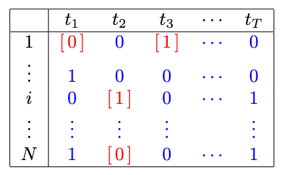

> <sub>One epoch of the leader election process. Node $`i`$ participates in the leader election at time-slots $`t_1,\ldots,t_T`$. The (binary) outcome of this lottery, where 0/1 corresponds to lost/won, is either *observed* (numbers in square brackets) or *unobserved*.</sub>

The leader election process has the following parameters

| Parameter | Description | Value/Range |
| --- | --- | --- |
| $N$ | Number of nodes | $`10^2\ldots10^4`$​ |
| $T$​ | Number of time-slots per epoch | $\approx 432,000$​ |
| $f$​ | Fraction of time-slots with at least one winner | $0.05$​ |
| $\Delta t$​ | The duration of a single time-slot | $1$ s |

## Sampling of Linear Trees

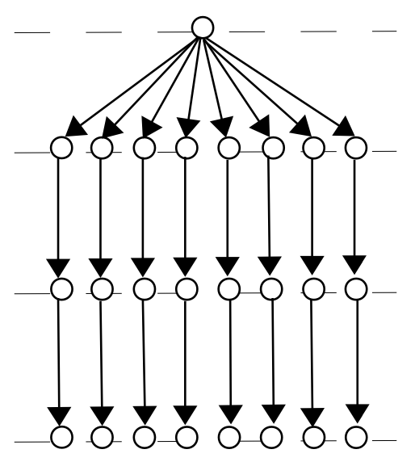

> <sub>Communication on Linear Trees. A message is sent from a root node through $`K`$ communication paths where each path has $`L`$ nodes.</sub>

The number of nodes in linear tree design is $1+KL$, where $K$ is the number of paths and $L$ is the number of nodes in each path excluding the sender node. In the linear tree design, one node is the sender node and the other $KL$ nodes are mix nodes.

We assume that in each epoch of the protocol there are $n$ sender nodes, labelled by the set $[n]$.  Each of the $n$ sender nodes sample $K \times L$ nodes from the population of $N$ nodes (labeled by the set $[N]$). The total number of nodes involved in communication is $n(1+KL)$.

We assume that each sender node samples $K\times L$ nodes, independently from other nodes, using sampling without replacement. A node among the $K\times L$ nodes sampled from $[N]$ just by chance can also appear in other $n-1$ random subsets of nodes.

The result of the sampling process described above can be represented by the following random factor-graph:

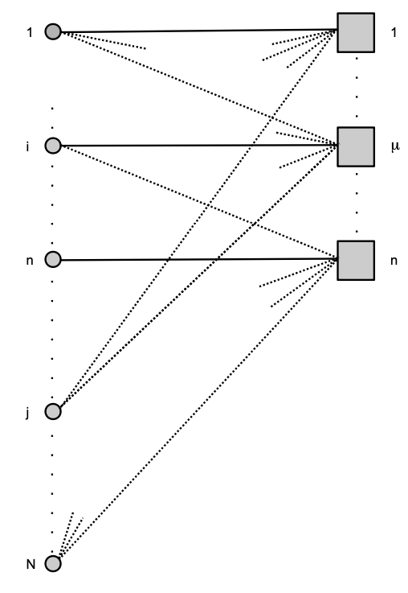

> <sub>The random factor-graph generated by sampling of $`n`$ subsets of $`K\times L`$ nodes, represented by factors (squares), from the set of all nodes $`[N]`$ represented by (filled) circles. If a node is a member of a subset then this is represented by an edge on this graph. Each node in the subset of $`[N]`$, $`[n]`$, is a member of at least $`1`$ of these subsets. Here $`K\times L=4`$.</sub>

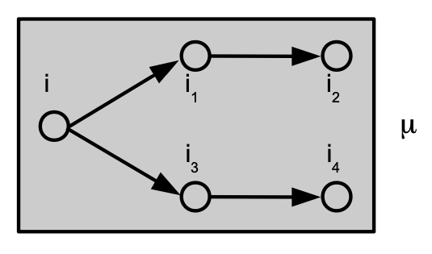

> <sub>Structure of a factor $`\mu`$ in the random factor graph associated with sampling of linear trees. Here $`K=L=2`$. Node $`i`$, associated with $`\mu`$, is a sending a message to nodes $`i_2`$ and $`i_4`$ via the mix nodes $`i_1`$ and $`i_3`$.</sub>

Connectivity of a node $i\in[N]$ is the number of random edges connecting this nodes to factors labelled by the set $[n]$. The connectivity of a node $i \in [N]$ is the number of linear trees that $i$ appears in. The connectivity is a [random number from the binomial distribution](analysis-resilience-and-anonymity/appendices/analysis-of-rewarding-in-data-availability-network.md)

$$
\mathrm{P}\left(c\vert n,\frac{KL}{N}\right)={n\choose c}\left(\frac{KL}{N}\right)^c\left(1-\frac{KL}{N}\right)^{n-c}
$$

with parameters $n$ and $`\frac{KL}{N}`$.

The probability that a node has more than one random connection $`\mathrm{P}\left(c \gt 1\vert n,\frac{KL}{N}\right)`$, i.e. the prob. that a mix node participates in more than one subset of mix nodes used in linear trees, for $n\geq2$ is given by the sum

$$
\mathrm{P}\left(c>1\vert n,\frac{KL}{N}\right)=\sum_{c=2}^n\mathrm{P}\left(c\vert n,\frac{KL}{N}\right)\\\quad =1-\sum_{c=0}^1\mathrm{P}\left(c\vert n,\frac{KL}{N}\right)\\\quad =1-\left(1-\frac{KL}{N}\right)^{n}\\\quad -n\left(\frac{KL}{N}\right)\left(1-\frac{KL}{N}\right)^{n-1}\\\quad =1-\left(1-\frac{KL}{N}\right)^{\alpha N}\\\quad -\alpha KL\left(1-\frac{KL}{N}\right)^{\alpha N-1}\\\quad \leq1-\left(1-\frac{KL}{N}\right)^{\alpha N}
$$

where $\alpha=n/N$ with $n\geq2$.

We note that $`\mathrm{P}\left(c \gt 1\vert 2,\frac{KL}{N}\right)=\left(\frac{KL}{N}\right)^2`$ and $`\mathrm{P}\left(c \gt 1\vert n+1,\frac{KL}{N}\right) \gt \mathrm{P}\left(c \gt 1\vert n,\frac{KL}{N}\right)`$ for $`KL \lt N`$, i.e. the probability $`\mathrm{P}\left(c \gt 1\vert n,\frac{KL}{N}\right)`$ is monotonic increasing function of $n$ for $`KL \lt N`$. Furthermore, the probability $`\mathrm{P}\left(c \gt 1\vert n,\frac{KL}{N}\right)`$ is monotonic increasing function of $`\frac{KL}{N}`$, i.e. increasing the number of nodes , $KL$, in the linear tree sampled by each sender node in $[n]$ increases probability that a node in $[N]$ has more than one random connection.

The probability $`\mathrm{P}\left(c \gt 1\vert n,\frac{KL}{N}\right)`$ is computed using the following parameters

| Parameter | Description | Value/Range |
| --- | --- | --- |
| $N$​ | Number of nodes | $`10^2\ldots10^4`$​ |
| $n$​ | Number of sender nodes | $2\ldots N$​ |
| $K\times L$​ | Number of nodes in a linear tree | $2\ldots N-1$​ |

## Communication on Linear Trees

We consider the following communication system


> <sub>Communication on Linear Trees. A message is sent from a node through $`K`$ communication paths where each path has $`L`$ nodes. A node could be faulty (circle with dashed boundary), or adversarial (red circle). The presence of faulty node leads to communication failures. The presence of adversarial nodes could lead to communication and anonymity failures.</sub>

We assume that $`M_F`$ nodes in the population are “faulty” (faulty node is unable to relay a message) and the probability that a node is faulty is $`q_F=M_F/N`$.

We assume that $`M_A`$ nodes in the population are “adversarial” (adversarial nodes are controlled by an adversary which can make nodes faulty, use them for traffic analysis, etc.) and the probability that a node is adversarial is $`q_A=M_A/N`$.

If a path contains at least one faulty node then communication failure occurred.

If a path does not have any faulty nodes then this path is functioning.

If all $K$ paths have a communication failure then broadcast failure occurred.

The probability of broadcast failure is given by

$$
\mathrm{P}_b(K,L,q_F)=\left[1-(1-q_F)^L\right]^{K}
$$

We note that $`q_F(C)=\frac{C-2}{C-1}`$ is the [site percolation threshold of random regular graph (RRG) with connectivity C](#bibliography), i.e. for $`q_F \gt q_F(C)`$ the RRG becomes disconnected with high probability as $N\rightarrow\infty$. The latter suggests if our model of the network is RRG then for the fraction of faulty nodes $`q_F \gt q_F(C)`$ the communication is not possible with high probability in $N\rightarrow\infty$.

If all nodes in a communication path are non-faulty then this is a functioning communication path.

If there is at least one functioning communication paths where all nodes are adversarial, then adversary has opportunity to cause anonymity failure.

The probability of anonymity failure is given by

$$
\mathrm{P}_a(K,L,q_F,q_A)=1-\left[1-[(1-q_F)\, q_A]^L\right]^{K}
$$

If there is at least one adversarial node in each functioning communication paths then the adversary has an opportunity to cause broadcast failure. The probability of adversarial broadcast failure is given by

$$
\mathrm{P}_{ab}(K,L,q_F,q_A)=\left[1-[(1- q_F)(1- q_A)]^L\right]^K-\left[1-(1- q_F)^L\right]^{K}
$$

The probabilities $`\mathrm{P}_a`$, $`\mathrm{P}_b`$ and $`\mathrm{P}_{ab}`$ are computed the following parameters

| Parameter | Description | Value/Range |  |
| --- | --- | --- | --- |
| $`q_F`$​ | Fraction of faulty nodes | $[0,1)$​ |  |
| $`q_A`$​ | Fraction of adversarial nodes | $[0,1)$​ |  |
| $K$​ | Number of communication paths | $1\ldots N-1$​ |  |
| $L$​ | Number of nodes in a communication path | $2\ldots N-1$​ |  |

The code which computes above probabilities is given below

```python
def Prob_b(K, L, qF):
    """
    Compute the probability of broadcast failure.
    Formula: (1 - (1 - qF)^L)^K
    """
    return (1 - (1 - qF) ** L) ** K

def Prob_ab(K, L, qF, qA):
    """
    Compute the probability of adversarial broadcast failure.
    Formula: (1 - ((1 - qF)^L * (1 - qA)^L))^K - (1 - (1 - qF)^L)^K
    """
    term1 = (1 - qF) ** L
    term2 = (1 - qA) ** L
    return (1 - (term1 * term2)) ** K - (1 - term1) ** K

def Prob_a(K, L, qF, qA):
    """
    Compute the probability of anonymity failure.
    Formula: 1 - (1 - ((1 - qF)^L * qA^L))^K
    """
    term1 = (1 - qF) ** L
    term2 = qA ** L
    return 1 - (1 - (term1 * term2)) ** K
```

## Inference of relative stake

The [adversary observes the leader election process](analysis-cryptarchia-de-anonymisation-of-relative-stake.md) of a node with the relative stake $\alpha$.

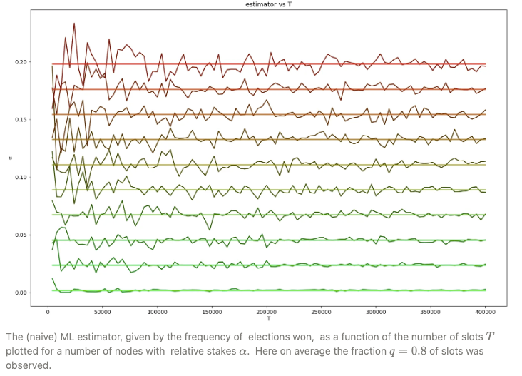

In $T$ time-slots, the adversary is able to observe fraction $v$ of wins in $m$ observations. The probability of observing the election outcome of a node is $q$. For $m\geq1$ adversary uses the “naive” estimator $`\hat{\alpha}=\frac{\log\left(1-v\right)}{\log(1-f)}`$ of the true relative stake $\alpha$. For large $T$, the probability that $`\alpha(1-\gamma)\leq\hat{\alpha}\leq\alpha(1+\gamma)`$ is [given by](analysis-cryptarchia-de-anonymisation-of-relative-stake.md#statistical-inference-of-relative-stake-1)

$$
\mathrm{P}\left(\hat{\alpha}\in[\alpha(1-\gamma), \alpha(1+\gamma)]\,\vert\, q\,T\right)=\frac{2 \,\mathrm{erf}\! \left(\frac{ \epsilon}{\sqrt{2\sigma^2(\alpha,q)}}\right)}{\mathrm{erf}\! \left(\frac{\phi(\alpha) }{ \sqrt{2\sigma^2(\alpha,q)}}\right)+\mathrm{erf}\! \left(\frac{ 1-\phi(\alpha)}{ \sqrt{2\sigma^2(\alpha,q)}}\right)}
$$

In the above, $`\phi(\alpha)=1-(1-f)^\alpha`$ is the lottery function with parameter $f$, $`\epsilon=\gamma\alpha\frac{\mathrm{d}}{\mathrm{d}\alpha}\phi(\alpha)`$ and $`\sigma^2(\alpha ,q)=\phi(\alpha)[1-\phi(\alpha)]/T q`$, where $q$ is the fraction of observed time-slots such that $Tq$ slots are observed on average.

The probability $`\mathrm{P}\left(\hat{\alpha}\in[\alpha(1-\gamma), \alpha(1+\gamma)]\,\vert\, q\,T\right)`$ can be interpreted as adversarial “confidence” and the parameter $\gamma$ as “accuracy”. An example of the above probability is given below

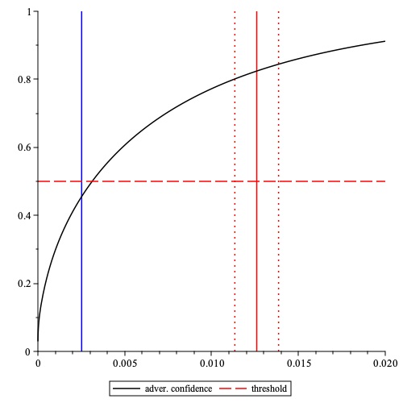

> <sub>The probability that inferred relative stake $`\hat{\alpha}\in[\alpha(1-\gamma), \alpha(1+\gamma)]`$, i.e. adversarial “confidence”, as a function of true relative stake $`\alpha`$ obtained in $`T=432000`$ time-slots (this value is used in Cardano) when the fraction $`q=0.657`$ of slots is observed. Here the probability that stake of a node with the true stake $`\alpha=0.0126`$ (the max. stake in the Bitcoin network), represented by a red vertical line, is inferred with an “accuracy” within the fraction $`\gamma=0.1`$ of relative stake $`\alpha`$, represented by $`\alpha(1\pm\gamma)`$ red vertical dotted lines, is approx. $`0.824`$. The red dashed horizontal line corresponds to the threshold $`\theta=0.5`$. The blue vertical line at $`\alpha=0.00252`$ is the result of dividing the stake $`\alpha=0.0126`$ among the $`5`$ nodes.</sub>

The probability $`\mathrm{P}\left(\hat{\alpha}\in[\alpha(1-\gamma), \alpha(1+\gamma)]\,\vert\, q\,T\right)`$, i.e. adversarial “confidence,” is computed using the following parameters:

| Parameter | Description | Value/Range |
| --- | --- | --- |
| $T$​ | Number of slots per epoch | $\approx 432,000$​ |
| $f$​ | Fraction of non-empty slots | $0.05$​ |
| $\alpha$​ | Relative stake of a node | $(0, 1)$​ |
| $\gamma$​ | “Accuracy” parameter | $(0, 1)$​ |
| $q$​ | Fraction of observed time-slots | $(0, 1]$​ |

The code which computes adversarial “confidence” is given below

```python
def phi(alpha, f):
    return 1 - (1 - f) ** alpha

def dphi(alpha, f):
    return -((1 - f) ** alpha) * log(1 - f)
def Prob2(alpha, epsilon, T, q):
    sqrt2 = sqrt(2.0)
    phi_alpha = phi(alpha, f)
    # Denominator term
    denominator = (
        erf((phi_alpha - 1) * sqrt2 / (2 * sqrt(phi_alpha * (1 - phi_alpha) / (T * q))))
        - erf(phi_alpha * sqrt2 / (2 * sqrt(phi_alpha * (1 - phi_alpha) / (T * q))))
    )
    # Numerator term
    numerator = -2.0 * erf(
        sqrt2 * epsilon / (2 * sqrt(phi_alpha * (1 - phi_alpha) / (T * q)))
    )
    # Final result
    return numerator / denominator

# Compute epsilon = dphi(alpha) * alpha * gamma
epsilon = dphi(alpha, f) * alpha * gamma

# Compute Prob2
Prob2_result = Prob2(alpha, epsilon, T, q)
```

The [probability](#inference-of-relative-stake) can also compute the (minimum) number of time-slots, $t$, such that $`\mathrm{P}\left(\hat{\alpha}\in[\alpha(1-\gamma), \alpha(1+\gamma)]\,\vert\, q\,t\right)\geq\delta`$, for some $\delta\in (0,1)$. Here $t$ is the time needed by an adversary to achieve “confidence” greater than $\delta$. The code which computes $t$ is given below

```python
T0 = T # One epoch
T1 = 730 * T # 10 years
dT = 10**3 # Step size
if Prob2_t < delta:
    # Increase T until Prob2_result >= delta
    t = T0
    while t <= T1 and Prob2_t < delta:
        Prob2_t = Prob2(alpha, epsilon, t, result3)
        t += dT

else:
    # Decrease T until Prob2_result <= delta
    t = T
    while t >= 100 and Prob2_t > delta:
        Prob2_t = Prob2(alpha, epsilon, t, result3)
        t -= dT
```

### Adversarial Confidence as a Measure of Statistical “Noise”

The probability $`\mathrm{P}\left(\hat{\alpha}\in[\alpha(1-\gamma), \alpha(1+\gamma)]\,\vert\, q\,T\right)`$, where $q\,T$ is the (average) number of time-slots observed by adversary in one epoch, can be seen as a measure of the magnitude of “noise” which prevents accurate measurements of the relative stake $\alpha$. One source of this noise is the actual (stochastic) leader election process and the other is the sampling (or “observation”), controlled by parameter $q$, of the latter by an adversary. For $q=1$, i.e. all time-slots are observed, and leader election process is the only source of noise. In this regime, for a given accuracy ($\gamma= 0.1$), the relative stake can be inferred with high confidence as can be seen in the figure below

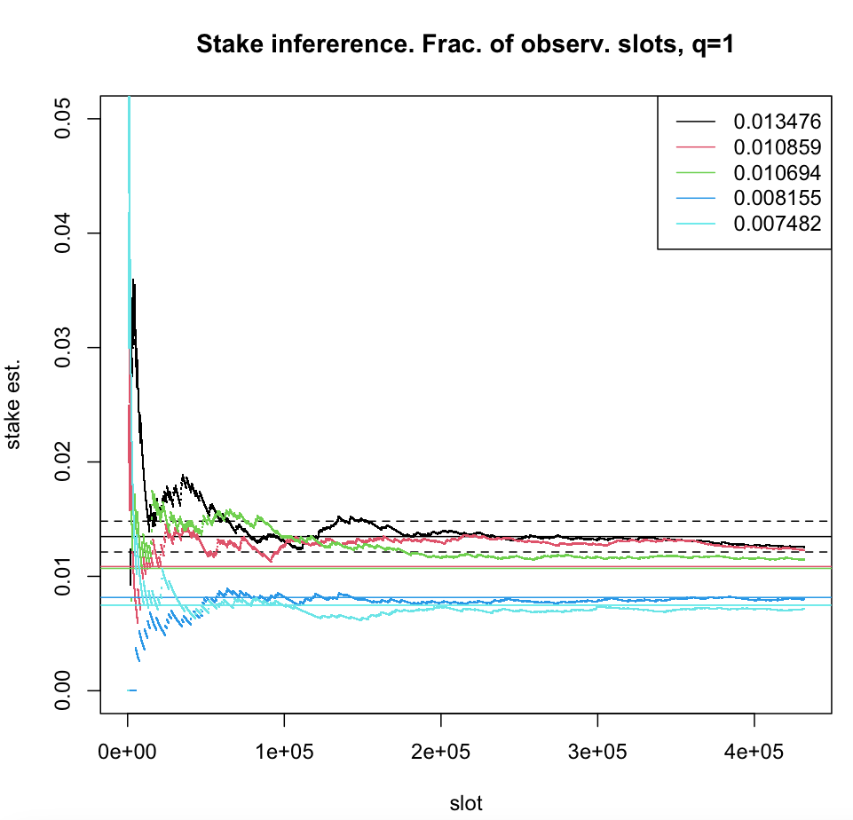

> <sub>The (relative) stake estimator $`\hat{\alpha}`$, computed in one epoch of leader election process, plotted as a function of time-slots for five nodes with *true* (relative stake) $`\alpha\in\{0.007482,\ldots,0.013476\}`$, represented by solid horizontal lines. For a node with the stake $`\alpha=0.013476`$ the prob. $`\mathrm{P}\left(\hat{\alpha}\in[\alpha(1-\gamma), \alpha(1+\gamma)]\,\vert\,q\,T\right)=0.915965`$, where $`\gamma=0.1`$, $`q=1`$ (fraction of observed time-slots) and $`T=432000`$ (number of time-slots in one epoch). The boundaries of the interval $`[\alpha(1-\gamma), \alpha(1+\gamma)]`$ for $`\alpha=0.013476`$ are represented by dashed horizontal lines.</sub>

For $`q \lt 1`$, sampling becomes an additional source of noise interfering with measurements done by adversary. Here, for a given accuracy, the confidence deteriorates as $q\rightarrow0$ (see figures below).

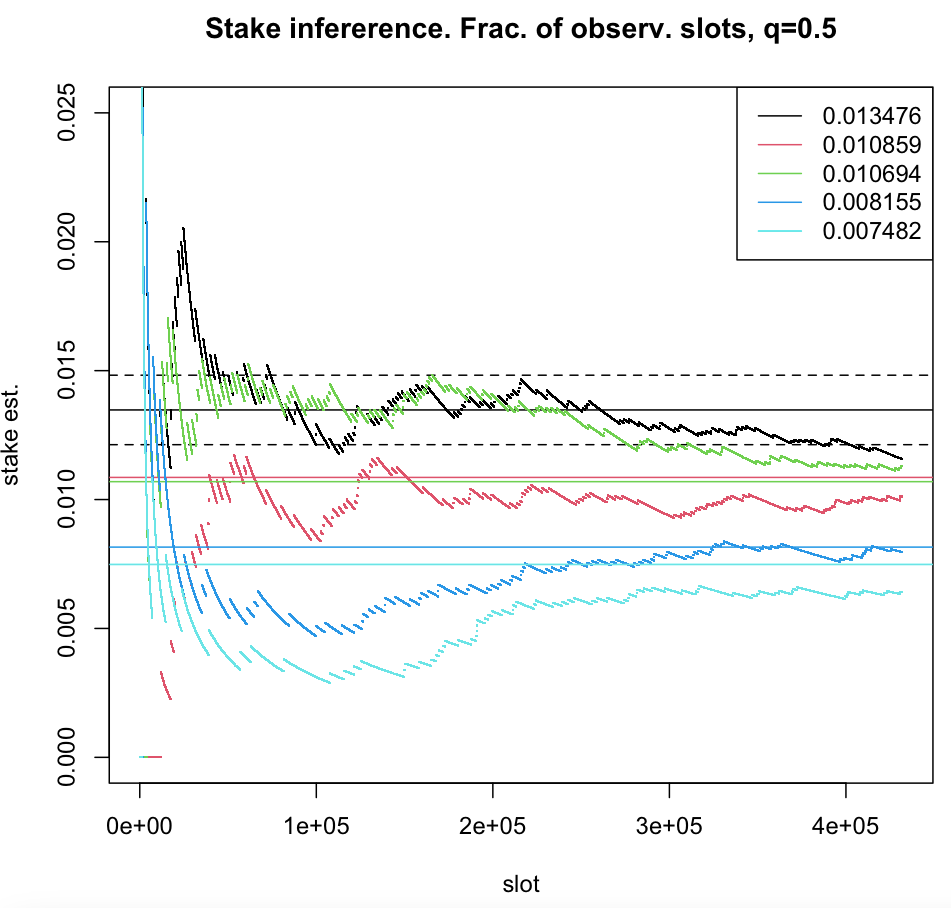

> <sub>The (relative) stake estimator $`\hat{\alpha}`$, computed in one epoch of the leader election process, plotted as a function of time-slots for five nodes with *true* (relative stake) $`\alpha\in\{0.007482,\ldots,0.013476\}`$, represented by solid horizontal lines. For a node with the stake $`\alpha=0.013476`$ the prob. $`\mathrm{P}\left(\hat{\alpha}\in[\alpha(1-\gamma), \alpha(1+\gamma)]\,\vert\,q\,T\right)=0.778177`$, where $`\gamma=0.1`$, $`q=0.5`$ (fraction of observed time-slots) and $`T=432000`$ (number of time-slots in one epoch). The boundaries of the interval $`[\alpha(1-\gamma), \alpha(1+\gamma)]`$ for $`\alpha=0.013476`$ are represented by dashed horizontal lines.</sub>

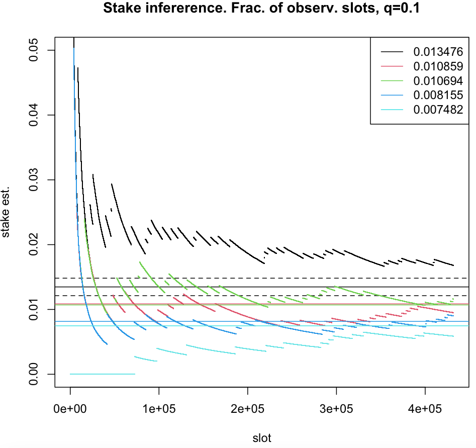

> <sub>The (relative) stake estimator $`\hat{\alpha}`$, computed in one epoch of leader election process, plotted as a function of time-slots for five nodes with *true* (relative stake) $`\alpha\in\{0.007482,\ldots,0.013476\}`$, represented by solid horizontal lines. For a node with the stake $`\alpha=0.013476`$ the prob. $`\mathrm{P}\left(\hat{\alpha}\in[\alpha(1-\gamma), \alpha(1+\gamma)]\,\vert\,q\,T\right)=0.415180`$, where $`\gamma=0.1`$, $`q=0.1`$ (fraction of observed time-slots) and $`T=432000`$ (number of time-slots in one epoch). The boundaries of the interval $`[\alpha(1-\gamma), \alpha(1+\gamma)]`$ for $`\alpha=0.013476`$ are represented by dashed horizontal lines.</sub>

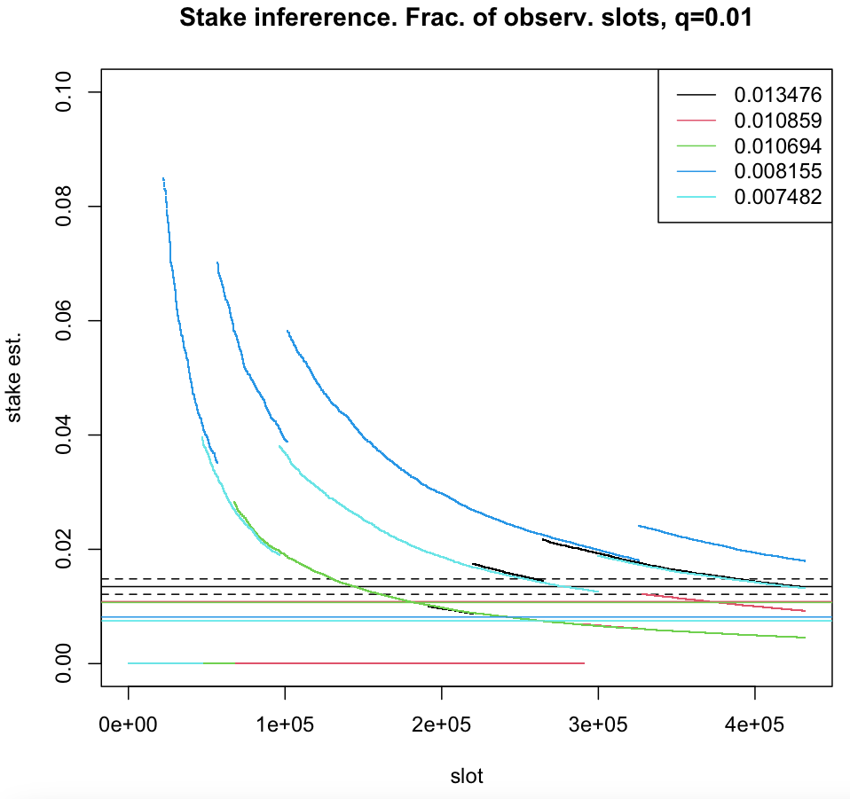

> <sub>The (relative) stake estimator $`\hat{\alpha}`$, computed in one epoch of leader election process, plotted as a function of time-slots for five nodes with *true* (relative stake) $`\alpha\in\{0.007482,\ldots,0.013476\}`$, represented by solid horizontal lines. For a node with the stake $`\alpha=0.013476`$ the prob. $`\mathrm{P}\left(\hat{\alpha}\in[\alpha(1-\gamma), \alpha(1+\gamma)]\,\vert\,q\,T\right)=0.1431790734`$, where $`\gamma=0.1`$, $`q=0.01`$ (fraction of observed time-slots) and $`T=432000`$ (number of time-slots in one epoch). The boundaries of the interval $`[\alpha(1-\gamma), \alpha(1+\gamma)]`$ for $`\alpha=0.013476`$ are represented by dashed horizontal lines.</sub>

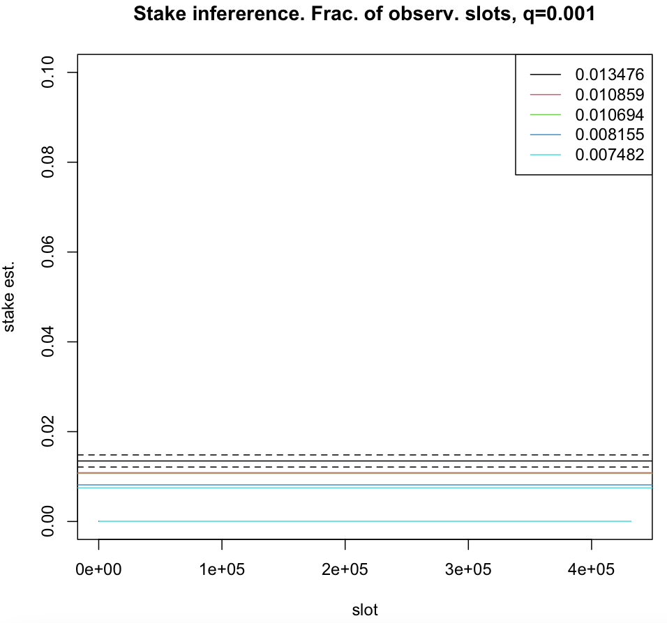

> <sub>The (relative) stake estimator $`\hat{\alpha}`$, computed in one epoch of leader election process, plotted as a function of time-slots for five nodes with *true* (relative stake) $`\alpha\in\{0.007482,\ldots,0.013476\}`$, represented by solid horizontal lines. For a node with the stake $`\alpha=0.013476`$ the prob. $`\mathrm{P}\left(\hat{\alpha}\in[\alpha(1-\gamma), \alpha(1+\gamma)]\,\vert\,q\,T\right)= 0.061572`$, where $`\gamma=0.1`$, $`q=0.001`$ (fraction of observed time-slots) and $`T=432000`$ (number of time-slots in one epoch). The boundaries of the interval $`[\alpha(1-\gamma), \alpha(1+\gamma)]`$ for $`\alpha=0.013476`$ are represented by dashed horizontal lines.</sub>

Let us define a function which compares properties of inference for $q=1$ and $q\in(0,1)$ as follows

$$
\log\left(\frac{\mathrm{P}\left(\hat{\alpha}\in[\alpha(1-\gamma), \alpha(1+\gamma)]\,\vert\, T\right)}{\mathrm{P}\left(\hat{\alpha}\in[\alpha(1-\gamma), \alpha(1+\gamma)]\,\vert\, q\,T\right)}\right)
$$

We note that above is $0$ when $q=1$, i.e. no sampling noise, and is growing when $q\rightarrow0$ (see figure below). Hence, above can be seen as “amplitude” of the sampling noise.

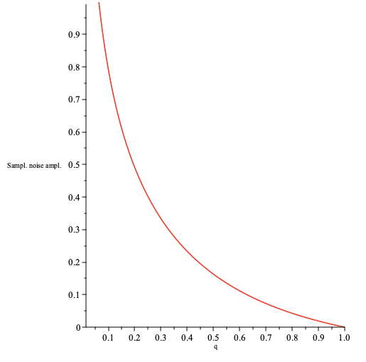

> <sub>$`\log\left(\frac{\mathrm{P}\left(\hat{\alpha}\in[\alpha(1-\gamma), \alpha(1+\gamma)]\,\vert\, T\right)}{\mathrm{P}\left(\hat{\alpha}\in[\alpha(1-\gamma), \alpha(1+\gamma)]\,\vert\, q\,T\right)}\right)`$ plotted as function of $`q`$ for $`\alpha=0.013476`$ and $`\gamma=0.1`$.</sub>

## The Unlinkability of Block Proposers

We assume that node $`\mathrm{S}`$ wins the [election](analysis-cryptarchia-de-anonymisation-of-relative-stake.md) and broadcasts message $`\mathrm{m}`$ to the network using [linear trees](#communication-on-linear-trees). We assume that in the network the sender node $`\mathrm{S}`$ has $C$ neighbouring nodes. Message $`\mathrm{m}`$ is first sent to the neighbouring nodes then, via the latter, to the rest of the network. A node in the neighbourhood $`\partial\mathrm{S}`$, where $`\vert\partial\mathrm{S}\vert=C`$, is adversarial with the prob. $`q_A`$. The prob. that at least one node in $`\partial\mathrm{S}`$ is adversarial is $`1-(1-q_A)^C`$.

If $`\mathrm{S}`$ has at least one adversarial neighbour and [anonymity failure](#communication-on-linear-trees) occurred then the message $`\mathrm{m}`$ can linked to the sender node $`\mathrm{S}`$. We note that just occurrence of the [anonymity failure](#communication-on-linear-trees) alone is not sufficient to link $`\mathrm{m}`$ to $`\mathrm{S}`$ and at least one compromised node is also needed in $`\partial\mathrm{S}`$. Furthermore, an adversary may need not one but at least $`n_A`$ compromised nodes in $`\partial\mathrm{S}`$. The probability of the latter is given by the binomial

$$
\mathrm{P}(n\geq n_A\vert C,q_A)=\sum_{n=n_A}^C{C\choose n}[1-q_A]^{C-n}q_A^n
$$

We note that the case one adversarial node in $`\partial\mathrm{S}`$ is recovered by setting $`n_A=1`$ in the above. The probability of above event, given that $`\mathrm{S}`$ won the election, is the product of two probabilities

$$
\mathrm{P}(n\geq n_A\vert C,q_A)\,\mathrm{P}_a(K,L,0,q_A)
$$

We note that in above we assumed that $`q_F=0`$, i.e. there are no faulty nodes in the network. The probability above is an upper bound for a scenario with faulty nodes. Since $`\mathrm{P}(n\geq n_A\vert C,q_A) \lt 1`$ for $`n_A\geq1`$, the prob. of anonymity failure $`\mathrm{P}_a(K,L,0,q_A)`$ is an upper bound on the above prob. If node $`\mathrm{S}`$ has (relative) stake $\alpha$ then the prob. of node $`\mathrm{S}`$ winning is $\phi(\alpha)$, where $\phi(\alpha)$ is the[lottery function](analysis-cryptarchia-de-anonymisation-of-relative-stake.md). Hence, the prob. that the message $`\mathrm{m}`$, sent by the winning node $`\mathrm{S}`$, can be linked to $`\mathrm{S}`$ is given by

$$
\phi(\alpha)\, \mathrm{P}(n\geq n_A\vert C,q_A)\,\mathrm{P}_a(K,L,0,q_A)
$$

The prob. that message $`\mathrm{m}`$ can not be linked to the sender $`\mathrm{S}`$ is

$$
1-\phi(\alpha)\, \mathrm{P}(n\geq n_A\vert C,q_A)\,\mathrm{P}_a(K,L,0,q_A)
$$

Hence the prob. that any message sent by node $`\mathrm{S}`$ can be linked to $`\mathrm{S}`$ in $t$ elections is given by

$$
1-\left[1-\phi(\alpha)\, \mathrm{P}(n\geq n_A\vert C,q_A)\,\mathrm{P}_a(K,L,0,q_A)\right]^t
$$

For the above prob. to be greater than some threshold $\theta$ (for example $\theta=1/2$) the number of elections $t$ has to satisfy the following inequality

$$
t>\left\lceil\frac{\log(1-\theta)}{\log(1-\phi(\alpha)\, \mathrm{P}(n\geq n_A\vert C,q_A)\,\mathrm{P}_a(K,L,0,q_A))}\right\rceil
$$

The minimum $t$ for which above inequality holds $t(\theta)$, which is the RHS of the above, is computed using the following parameters

| Parameter | Description | Value/Range |
| --- | --- | --- |
| $\theta$​ | Prob. threshold | $(0, 1)$​ |
| $f$​ | Fraction of non-empty slots | $0.05$​ |
| $\alpha$​ | Relative stake of a node | $(0, 1)$​ |
| $C$​ | Node neighbourhood size | $\geq 4$​ |
| $`n_A`$​ | Number of adver. nodes threshold | $\geq 1$​ |
| $`q_A`$​ | Fraction of adversarial nodes | $[0, 1)$​ |
| $K$​ | Number of communication paths | $1\ldots N-1$​ |
| $L$​ | Number of nodes per communication path | $2\ldots N-1$​ |

The code which computes $t(\theta)$ is given below

```python
def phi(alpha, f):
    return 1 - (1 - f) ** alpha

def calculate_t(qA, L, K, alpha, f, C, nA, theta):
    #compute prob. Pa
    x = 1 - pow(qA, L)
    Pa = (1 - pow(x, K))
    #compute prob. Pan
    p = 1 - qA
    Pan = 0
    for n in range(nA, C + 1):
        Pan += comb(C, n) * (p ** (C - n)) * (qA ** n)
    #compute prod. of prob.
    Prob = Pan * Pa

    #compute t
    numerator = log(1 - theta)
    denominator = log(1 - phi(alpha, f) * Prob)
    t = ceil(numerator / denominator)
    return t
```

## Design of the “Calculator”

Here we combine the results for leader election process, sampling of linear trees, broadcasting on linear trees and inference of relative stake to design a calculator which takes parameters of the latter and computes properties of a node related to the resilience and anonymity of communication. The calculator has the following modules:

> **PDF attachment:** [Modules.pdf](analysis-resilience-and-anonymity/appendices/Modules.pdf)

The dependencies between modules can be represented as the following diagram

> **PDF attachment:** [Flowchart.pdf](analysis-resilience-and-anonymity/appendices/Flowchart.pdf)

Using above diagram of dependencies a first and later versions of the calculator were implemented as an online app. The input and output of the most recent version is presented below. The app is available in the [repository.](https://github.com/AMozeika/Calculator)

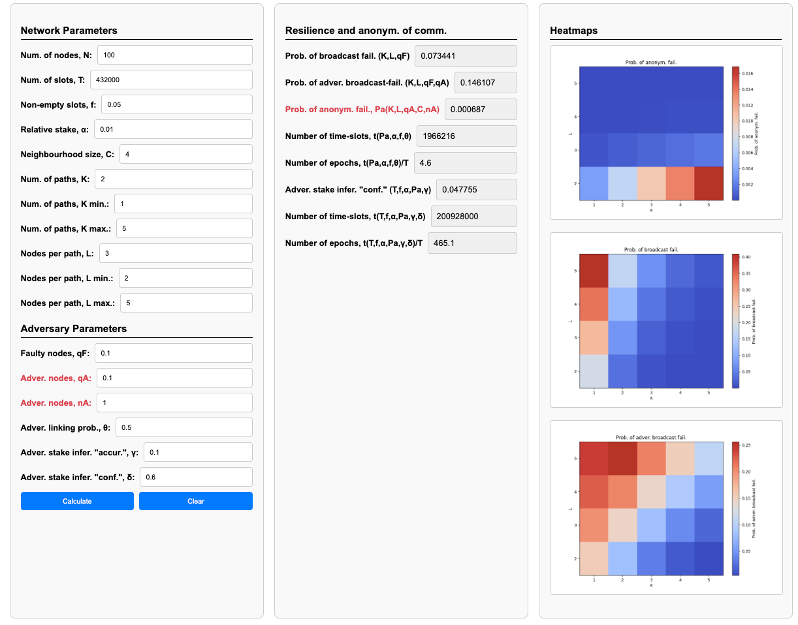

## Strategies to Reduce Anonymity Failure

Let us assume that a node won at time $t$ of the [election process](#leader-election-process) and it broadcasts a message to the network using [linear trees](#communication-on-linear-trees). Furthermore, assume that the neighbourhood of this node has at least one adversarial node. Conditioned that these two assumptions are true, the probability of anonymity failure is given by

$$
\mathrm{P}_a(K,L,q_F,q_A)=1-\left[1-(1-q_F)^L\, q_A^L\right]^{K}
$$

Above corresponds to a scenario when a node at time $t$ sends a message through $K$ paths of length $L$ (see [figure](#sampling-of-linear-trees)) constructed from nodes sampled (with replacement) from the set of network nodes $[N]$. Here $`q_F`$ and $`q_A`$ is, respectively, the fraction of faulty and adversarial nodes in the network.

For $K=1$, i.e. a message is sent through one path, the probability of anonymity failure is given by

$$
\mathrm{P}_a(1,L,q_F,q_A)=1-\left[1-[(1-q_F)\, q_A]^L\right]\\\quad =(1-q_F)^L\, q_A^L
$$

We note that in above $`(1-q_F)^L`$ is the prob. that path is functional and $`q_A^L`$ is the prob. that every single node on this path is adversarial. Hence $`1-(1-q_F)^L\, q_A^L`$ is the prob. that either the path is not functional or at least one node in the path is not adversarial.

Now let us assume that node sends the same message (or different messages) through different paths of length $L$ at times $`t_1 \lt t_2 \lt \cdots \lt t_K`$ (see figure below)

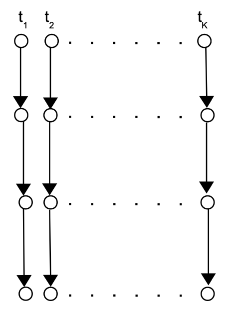

> <sub>Communication on Linear Trees. Node sends a message at times $`t_1, t_2,\ldots,t_K`$. Each time a different, sampled randomly (with replacement) from $`[N]`$, communication path of $`L`$ nodes is used.</sub>

After sending the first message at time $`t_1`$ the prob. of anonymity failure is $`\mathrm{P}_a(1,L,q_F,q_A)=(1-q_F)^L\, q_A^L`$, after sending the second message at time $`t_2`$ the prob. of anonymity failure is $`\mathrm{P}_a(2,L,q_F,q_A)=1-\left[1-[(1-q_F)\, q_A]^L\right]^2`$, etc. Thus after sending the last message at time $`t_K`$ the prob. anonymity failure is $`\mathrm{P}_a(K,L,q_F,q_A)`$, i.e. the same as [sending a message through](#sampling-of-linear-trees)$K$ paths simultaneously. We note that for fixed $L$ the prob. $`\mathrm{P}_a(K,L,q_F,q_A)`$ is [monotonic increasing function](analysis-communication-on-trees.md) of $K$ and hence $`\mathrm{P}_a(n_{m},L,q_F,q_A)`$ is monotonic increasing function of the number of sent messages $`n_{m}\in\{1,\ldots,K\}`$ as can be seen in the figure below.

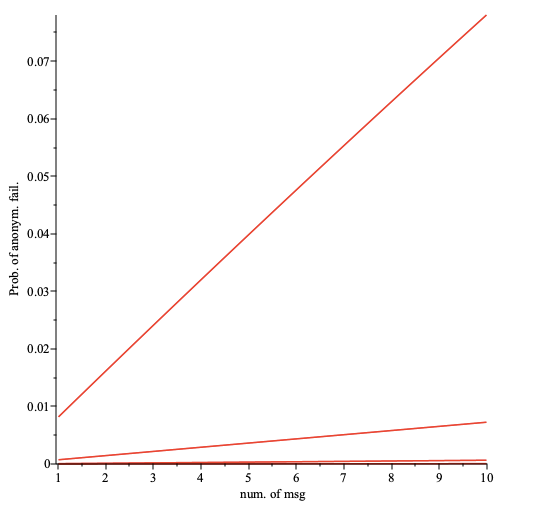

> <sub>The prob. of anonymity failure as a function of the number of sent messages plotted for the number of nodes per path $`L\in\{2,\ldots,5\}`$ (top to bottom). Here the fraction of faulty nodes is $`q_F=0.1`$ and the fraction of adversarial nodes is $`q_A=0.1`$.</sub>

Furthermore, the probability that no anonymity failure occurred after sending $`n_m`$ messages is given by

$$
1-\mathrm{P}_a(n_m,L,q_F,q_A)=\left[1-(1-q_F)^L\, q_A^L\right]^{n_m}
$$

From above, it follows that for $`n_m\leq K`$ we have

$$
\frac{1-\mathrm{P}_a(n_m,L,q_F,q_A)}{1-\mathrm{P}_a(K,L,q_F,q_A)}=\frac{1}{\left[1-(1-q_F)^L\, q_A^L\right]^{K-n_m}}\geq1
$$

Hence the probability that no anonymity failure occurred is much larger if the number of messages sent $`n_m`$ is much less than $K$. Equivalently, the probability of anonymity failure is much smaller if the number of messages sent $`n_m`$ is much less than $K$.

We now consider the prob. of broadcast failure

$$
\mathrm{P}_b(K,L,q_F)=\left[1-(1-q_F)^L\right]^{K}
$$

which is a [monotonic decreasing function](analysis-communication-on-trees.md) of $K$ when $L$ is fixed. Hence $`\mathrm{P}_b(n_{m},L,q_F)`$ is monotonic decreasing function of the number of sent messages $`n_{m}\in\{1,\ldots,K\}`$ as can be seen in the figure below.

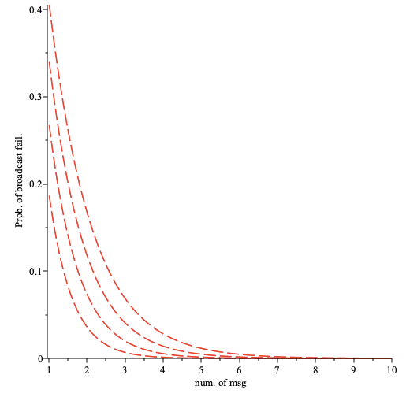

> <sub>The prob. of broadcast failure as a function of the number of sent messages plotted for the number of nodes per path $`L\in\{2,\ldots,5\}`$ (bottom to top). Here the fraction of faulty nodes is $`q_F=0.1`$.</sub>

We note that the [probability of adversarial broadcast-failure](#communication-on-linear-trees) behaves in a similar way as can be seen in the figure below

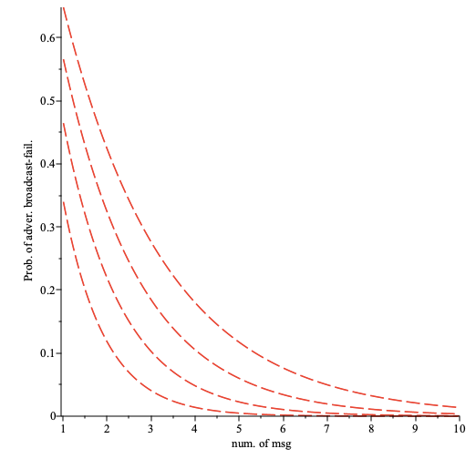

> <sub>The prob. of adversarial broadcast-failure as a function of the number of sent messages plotted for the number of nodes per path $`L\in\{2,\ldots,5\}`$ (bottom to top). Here the fraction of faulty nodes is $`q_F=0.1`$ and the fraction of adversarial nodes is $`q_A=0.1`$.</sub>

The number of nodes used for broadcasting of $`n_m`$ messages is $`n_mL`$, i.e. grows linearly with the number of messages $`n_m`$.

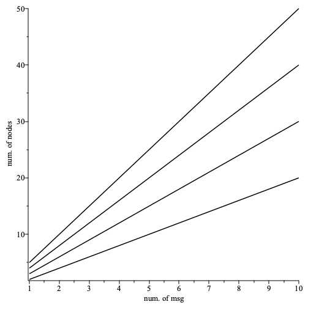

> <sub>The number of nodes used in broadcasting as a function of the number of sent messages plotted for the number of nodes per path $`L\in\{2,\ldots,5\}`$ (bottom to top).</sub>

We note that

$$
\left[\prod_{i=1}^{t-1}\mathrm{P}_b(i,L,q_F)\right]\left[1-\mathrm{P}_b(t,L,q_F)\right]
$$

is the probability that the first occurrence of a successful broadcast requires sending $t$ messages. We note that above is generalisation of the [Geometric prob. distribution](https://en.wikipedia.org/wiki/Geometric_distribution).

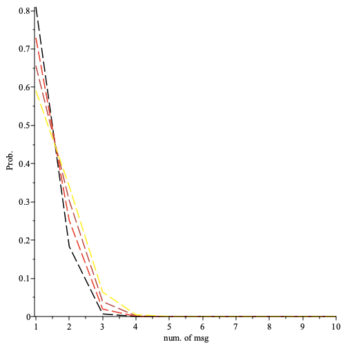

> <sub>The probability that the first occurrence of a successful broadcast requires sending number of messages ($`\mathrm{num.\, of\, msg}`$) plotted for the number of nodes per path $`L\in\{2,\ldots,5\}`$ (black, red, orange,yellow). Here the fraction of faulty nodes is $`q_F=0.1`$.</sub>

From the above, it follows that

$$
1-\sum_{t=1}^n\left[\prod_{i=1}^{t-1}\mathrm{P}_b(i,L,q_F)\right]\left[1-\mathrm{P}_b(t,L,q_F)\right]
$$

is the prob. that the first occurrence of a successful broadcast requires sending more than $n$ messages.

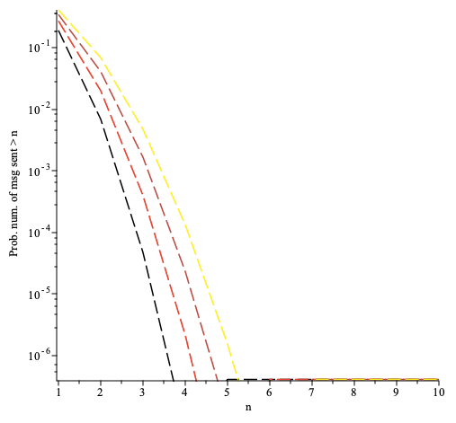

> <sub>The prob. that the first occurrence of broadcast requires sending more than $`n`$ messages as a function of $`n`$ plotted for the number of nodes per path $`L\in\{2,\ldots,5\}`$ (bottom to top). Here the fraction of faulty nodes is $`q_F=0.1`$.</sub>

In a similar manner, we obtain the probability

$$
\left[\prod_{i=1}^{t-1}\left[1-\mathrm{P}_a(i,L,q_F,q_A)\right]\right]\mathrm{P}_a(t,L,q_F,q_A)
$$

that the first occurrence of anonymity failure requires sending $t$ messages.

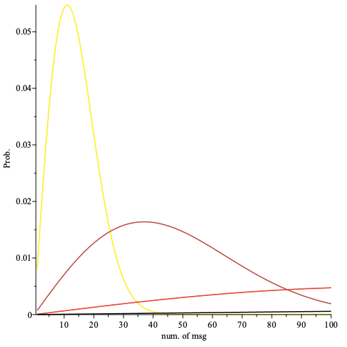

> <sub>The prob. that the first occurrence of anonymity failure requires sending number of messages ($`\mathrm{num.\, of\, msg}`$) plotted for the number of nodes per path $`L\in\{2,\ldots,5\}`$ (yellow, orange, red, black). Here the fraction of faulty nodes is $`q_F=0.1`$ and the fraction of adversarial nodes is $`q_A=0.1`$.</sub>

From the above, it follows that

$$
\sum_{t=1}^{n-1}\left[\prod_{i=1}^{t-1}\left[1-\mathrm{P}_a(i,L,q_F,q_A)\right]\right]\mathrm{P}_a(t,L,q_F,q_A)
$$

is the prob. that the first occurrence of anonymity failure requires sending less than $n$ messages.

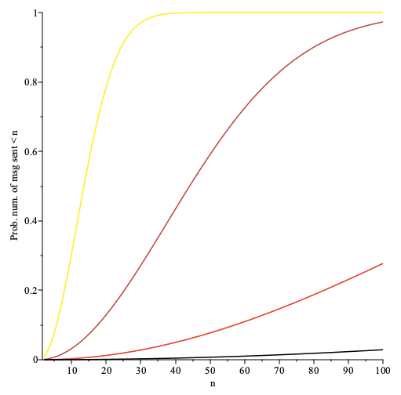

> <sub>The prob. that the first occurrence of anonymity failure requires sending less than $`n`$ messages as a function of $`n`$ plotted for the number of nodes per path $`L\in\{2,\ldots,5\}`$ (top to bottom). Here the fraction of faulty nodes is $`q_F=0.1`$ and the fraction of adversarial nodes is $`q_A=0.1`$.</sub>

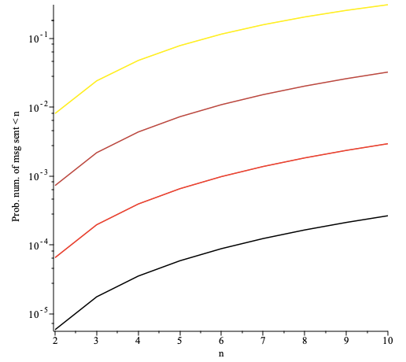

> <sub>The prob. that the first occurrence of anonymity failure requires sending less than $`n`$ messages as a function of $`n`$ plotted for the number of nodes per path $`L\in\{2,\ldots,5\}`$ (top to bottom). Here the fraction of faulty nodes is $`q_F=0.1`$ and the fraction of adversarial nodes is $`q_A=0.1`$.</sub>

### Analysis of Latency

We consider a network $`\mathcal{N}`$ constructed from $`N=\vert\mathcal{N} \vert`$ nodes. We assume that a message sent from node $`0\in \mathcal{N}`$, via $L$ nodes of $`\mathcal{N}`$, to the network $`\mathcal{N}`$using the broadcast method of communication. The message is delayed at the node $0$ by the $`\Delta_0`$ amount of time, at the node $1$ by the $`\Delta_1`$ amount of time, etc. Furthermore, a message traveling between the nodes $i$ and $i+1$ is delayed by $`d_{i\,i+1}`$ due to the latency of broadcast on $`\mathcal{N}`$ used for communication.

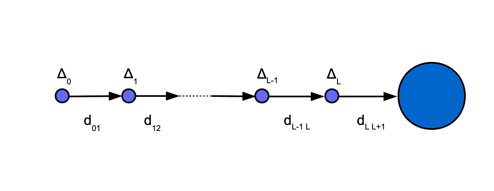

> <sub>A message is sent by node $`0`$ to the network $`\mathcal{N}`$ via $`L`$ nodes using the broadcast mode of communication. Here nodes are represented by blue circles and $`\mathcal{N}`$ is represented by large blue circle.</sub>

Assuming that the message was successfully broadcasted by the last node $L$ to the network $`\mathcal{N}`$, the total delay is given by $`\sum_{i=0}^L\left[\Delta_i+ d_{i\,i+1}\right]`$. We note that for $`\Delta=\max_{i}\Delta_i`$ and $`d=\max_{i}d_{i\,i+1}`$ we have a simple upper bound

$$
\sum_{i=0}^L\left[\Delta_i+ d_{i\,i+1}\right]\leq [L+1](\Delta + d)
$$

We note that we have equality in the above when $`\Delta=\Delta_i`$ and $`d=d_{i\,i+1}`$, i.e. all delays are the same.

Assuming that sender node monitors, via observation of broadcasts on $`\mathcal{N}`$, how a message is propagated along the [path](analysis-resilience-and-anonymity.md), the sender node sends first messages and if this message is not broadcasted to $`\mathcal{N}`$ after some time, for example after time $`\sum_{i=0}^1\left[\Delta_{i}(1)+ d_{i\,i+1}(1)\right]`$, it will send a second message and if this message is not broadcasted it send a third message, etc. We note that a worst case scenario of above strategy is when the 1st message “travels” to the last node $L$, but is not broadcasted to the network $`\mathcal{N}`$. Then nodes send a 2nd message and again this message is not broadcasted by the last node, etc. Assuming that the $K$-th message is broadcasted by the last node to $`\mathcal{N}`$, gives us that the total delay in the [sequential scenario](#strategies-to-reduce-anonymity-failure) is at most

$$
\sum_{\ell=1}^K\sum_{i=0}^L\left[\Delta_{i}(\ell)+ d_{i\,i+1}(\ell)\right]
$$

if the delay on each $\ell$-th path, i.e. the value of $`\sum_{i=0}^L\left[\Delta_{i}(\ell)+ d_{i\,i+1}(\ell)\right]`$, is known exactly.

Furthermore, we have the following inequality

$$
\sum_{\ell=1}^K\sum_{i=0}^L\left[\Delta_{i}(\ell)+ d_{i\,i+1}(\ell)\right]\leq K[L+1](\Delta + d)
$$

where $`\Delta=\max_{i,\ell}\Delta_i(\ell)`$ and $`d=\max_{i,\ell}d_{i\,i+1}(\ell)`$. We can assume that $\Delta=10s$ and $d=5s$.

We note that when $K$ messages are sent [simultaneously](analysis-resilience-and-anonymity.md) and if at least one of them is successfully broadcasted by a last node to the network $`\mathcal{N}`$, then the total delay is at most

$$
\max_{\ell\in[K]}\sum_{i=0}^L\left[\Delta_{i}(\ell)+ d_{i\,i+1}(\ell)\right]
$$

if the delay on each $\ell$-th path, i.e. the value of $`\sum_{i=0}^L\left[\Delta_{i}(\ell)+ d_{i\,i+1}(\ell)\right]`$, is known exactly. Furthermore, for $`\Delta=\max_{i,\ell}\Delta_i(\ell)`$ and $`d=\max_{i,\ell}d_{i\,i+1}(\ell)`$ we have the following inequality

$$
\max_{\ell\in[K]}\sum_{i=0}^L\left[\Delta_{i}(\ell)+ d_{i\,i+1}(\ell)\right]\leq [L+1](\Delta + d)
$$

From the above, it follows that in the worst case the latency of [sequential](#strategies-to-reduce-anonymity-failure) communication is $K$ times the latency of [synchronous](#communication-on-linear-trees) communication.

Let us assume that $\Delta=10s$, $d=5s$ and sender node is not delaying messages. The latter gives us the upper bound $\Delta L+ d(L+1)= 15\times L+5\,s$ on latency in [synchronous](#sampling-of-linear-trees) communication and $K[\Delta L+ d(L+1)]= K[15\times L+5]\,s$ for the upper bound on latency of [sequential](#strategies-to-reduce-anonymity-failure) communication.

## The Number of Time-Slots Between Two Consecutive Blocks

In the [leader election process](#leader-election-process) the probability of winning a slot is $f=1/30$ and the number of time-slots per epoch is $T=648000$. Assuming that winning a slots results in generation of a valid block, the number of time-slots between two consecutive blocks, $`n_0`$, follow the [geometric distribution](https://en.wikipedia.org/wiki/Geometric_distribution)

$$
\mathrm{P}(n_0)=(1-f)^{n_0}f
$$

where $`n_0\in\mathbb{N}\cup\{0\}`$. Follows from above that the average of $`n_0`$ is $`\langle n_0\rangle=(1-f)/f\approx0.967/0.033=29`$, i.e. on average we expected to see a next block after $29$ time-slots. The probability that $`n_0`$ is greater than the average $`\langle n_0\rangle`$ is given by

$$
\mathrm{P}(n_0> \langle n_0\rangle)=(1-f)^{\langle n_0\rangle+1}
$$

For $f=1/30$, the above gives us $`\mathrm{P}(n_0 \gt 29)=(1-1/30)^{30}\approx0.362`$. Furthermore, the maximum of $`n_0`$ observed in $T$ time-slots (approximately) follows the [distribution](#bibliography)

$$
\mathrm{P}\left(x\right)=\int_{-\infty}^{\infty} \mathrm{e}^{-t-\mathrm{e}^{-t}}\delta\left(x-\frac{t+\log(T(1-p))}{\log(1/p)}\right)\mathrm{d} t\\\quad =\vert\log(p)\vert\, \mathrm{e}^{-\left[x\log(p)+\log(T(1-p))\right]-\mathrm{e}^{-\left[x\log(p)+\log(T(1-p))\right]}}
$$

where $p=1-f$.

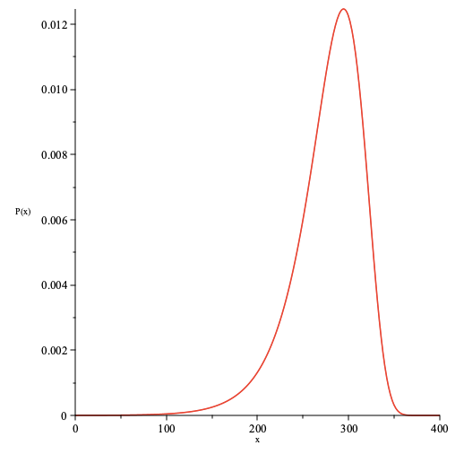

> <sub>The probability distribution $`\mathrm{P}(x)`$ as a function of $`x`$ plotted for $`T= 648000`$ and $`f=1/30`$.</sub>

We note that the mode of $`\mathrm{P}\left(x\right)`$ is at $`x=\frac{\log(T(1-p))}{\log(1/p)}`$ and hence the typical value of the maximum of $`n_0`$ observed in $T=648000$ time-slots for $f=1/30$ is $\approx 295$. The prob. that the maximum of $`n_0`$ observed in $T=648000$ time-slots for $f=1/30$ is greater than $295$ can be computed with high accuracy from simulations and is $\approx 0.62$ as suggested by the simulation data tabulated below.

| Num. of samples | Prob. $`n_0 \gt 295`$​ |
| --- | --- |
| $`10^3`$​ | $0.612$​ |
| $`10^4`$​ | $0.617$​ |
| $`10^5`$​ | $0.62379$​ |
| $`10^6`$​ | $0.624018$​ |

The histogram of the maximum of $`n_0`$ obtained in one such simulation is presented below

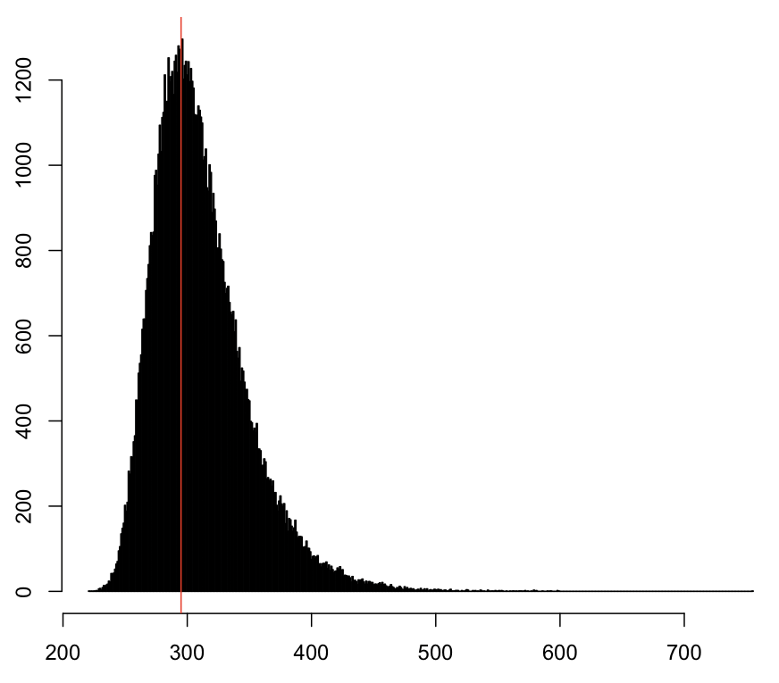

> <sub>This histogram of the maximum number of time-slots between two consecutive blocks, $`n_0`$, obtained in $`10^6`$ simulations of one epoch with $`T=648000`$ and $`f=1/30`$. The red vertical line corresponds to the typical value of $`295`$. Here estimating the prob. that $`n_0 \gt 295`$ gives us the value of $`0.624018`$.</sub>

# Bibliography

Svante Janson. (2009). On percolation in random graphs with given vertex degrees. Electron. J. Probab. 14: 86 - 118. [https://doi.org/10.1214/EJP.v14-603](https://doi.org/10.1214/EJP.v14-603)

Gordon, L., Schilling, M. F. and Waterman, M. S. (1986). An extreme value theory for long head runs.  Probability Theory and Related Fields  72: 279-287. [https://doi.org/10.1007/BF00699107](https://doi.org/10.1007/BF00699107)
