# Analysis of Rewarding in DA Network

**Owner:** Alexander Mozeika
**Reviewers:** Marcin Pawlowski, Marvin Jones, Mehmet, Alvaro Castro-Castilla

## Introduction

This document examines the conditions required for *fair* and *reliable* distribution of [rewards](../../../deprecated/da-rewarding.md) in a decentralised data availability (DA) [network](../../../deprecated/da-network.md), where $`N`$ nodes independently sample peers to judge their performance. Our focus is on three core properties:
1. **Ensuring coverage.** We show that even when each node samples only a small number of peers per round, across $`T`$ rounds, the probability that every node gets observed is very high when $`N \lt T`$.
2. **Stability of peer sampling.** By treating the collection of all peer samples as a random graph, we demonstrate that each node's number of observations remains tightly clustered around the average. This ensures the mechanism stays predictable and robust.
3. **Robust opinion aggregation.** We consider a simple majority-vote rule for combining all (binary) reports of nodes into a single consensus judgment and prove that this rule tolerates the maximum number of inconsistent or malicious reports without breaking.
Throughout, we support our theoretical claims with simulations and numerical experiments, showing that the proposed sampling rates, observation windows, and voting thresholds create an efficient, scalable reward system that is both reliable and resilient against failures or adversarial behaviour.
### Key Findings

- Small sampling rates achieve network coverage exponentially fast when the block count exceeds some fraction of the network size as can be seen in the figure below:
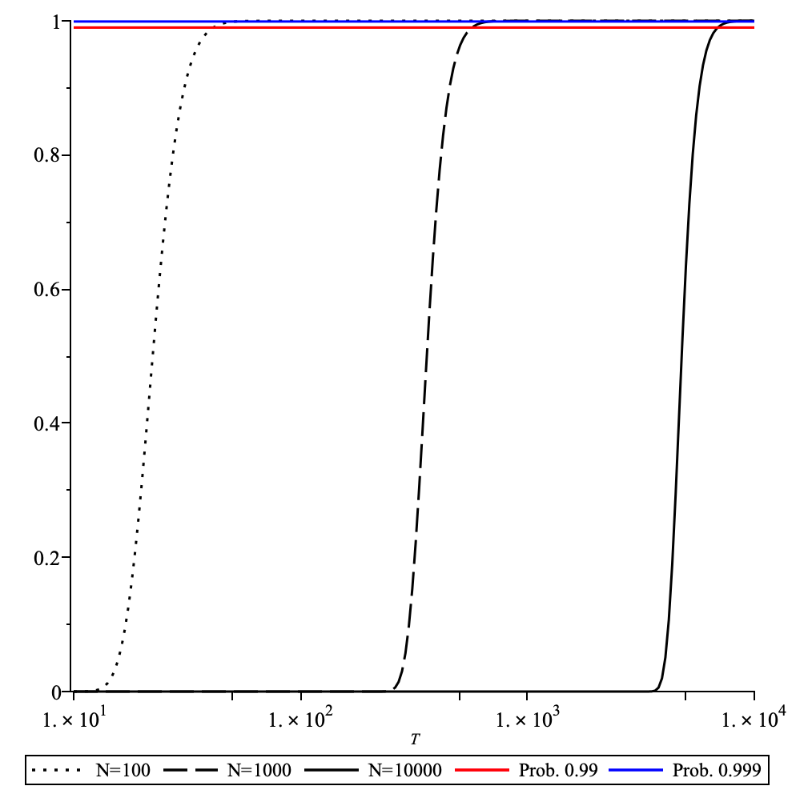

> The probability to achieve full coverage plotted as function of the number of blocks $`T`$ for the network size $`N\in\{10^2,10^3,10^4\}`$. Here it assumed that a node samples $`K=20`$ nodes per block.

- The number of blocks $`T`$ needed to achieve full coverage (with high prob. ) is *less* than the network size $`N`$ as can be seen in the figure below:
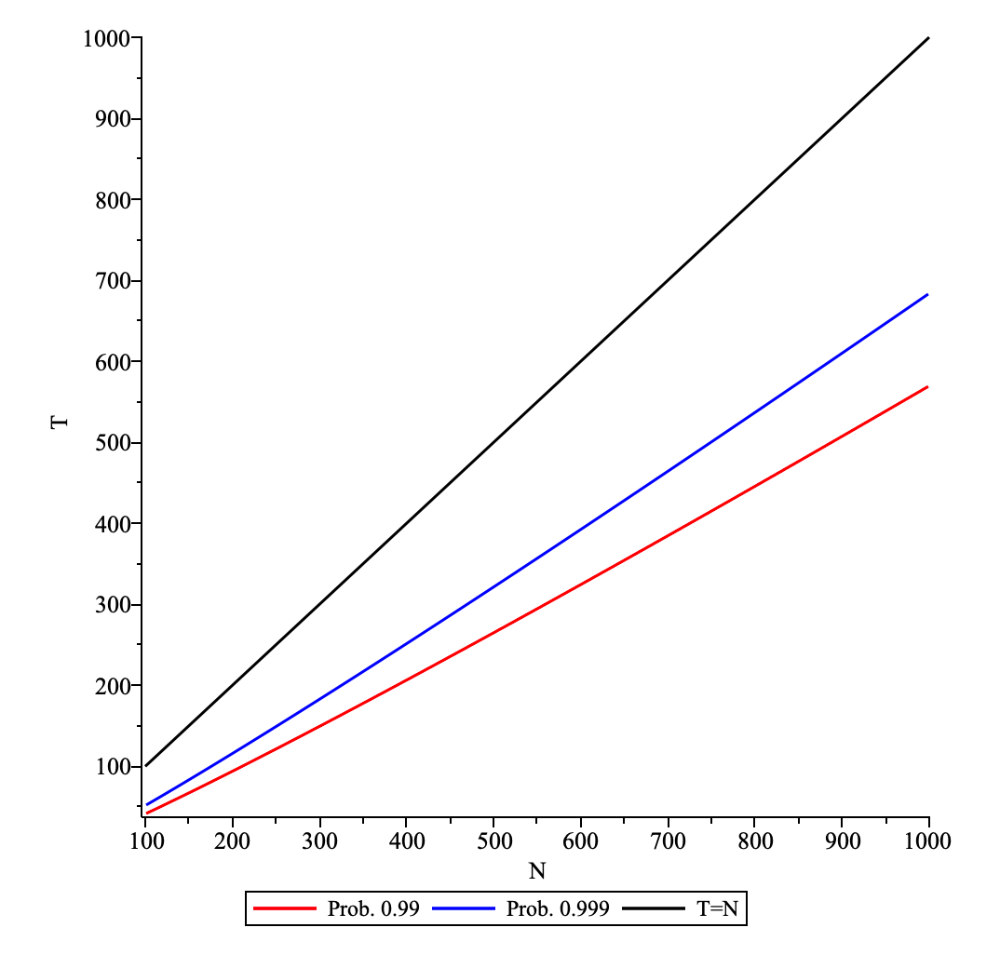

> The number of blocks $`T`$, which is needed to achieve full coverage (with prob. $`0.99`$ and $`0.999`$), is plotted as function of the network size $`N`$. Here it assumed that a node samples $`K=20`$ nodes per block.

- Node connectivity follows a predictable binomial distribution.
- The $`N/2`$ threshold maximises disagreement tolerance while recovering true opinions.
- The system tolerates up to $`\lfloor N/2 \rfloor`$ disagreements in odd-sized networks and $`N/2 -1`$ disagreements in even-sized networks.
This analysis provides theoretical foundations for a robust decentralised reward system resistant to failures and adversarial behaviour.
## Overview

This document examines conditions for *fair* and *reliable* reward distribution in a decentralized data availability network with independent peer sampling.
We present a comprehensive mathematical model and theoretical framework supporting the reward distribution system. The framework consists of:
- Assumptions: Exploration of network structure, participant interaction patterns, and underlying sampling mechanisms.
- Efficiency of Sampling: Probability analysis backed by simulations and statistical validation.
- Analysis of DA Sampling: Protocol specifications, implementation considerations, and network connectivity assessment.
- Fault Tolerant Properties: System resilience against failure modes and mathematical approach to threshold optimization.
## Analysis

### Assumptions

We consider $`N`$ nodes participating in the data availability (DA) [network](../../../deprecated/da-network.md). Each node provides his opinion about *all* $`N`$ nodes. This opinion is about the performance of a node and is modelled by a binary variable $`0/1`$ (don’t know/good performance). Node $`i`$ submits a vector of opinions $`\underline{x}_i=(x_{1i}, x_{2i},\ldots,x_{Ni} )`$, where $`x_{ji}\in \{0,1\}`$ is the opinion of a node $`i`$ about the node $`j`$. Each node samples $`K`$ nodes *per block* in DA, so a node could have $`K`$ opinions per block. DA works in sessions and the length of the latter is measured in the number of blocks $`T`$.
### Efficiency of Sampling

The set of nodes sampled by node $`i`$ in one session of DA is $`S_T=\cup_{\mu=1}^TS_\mu`$, where $`S_\mu`$ is the set of nodes sampled randomly (*without* replacement) by node $`i`$ from the set of all nodes $`[N]`$ for block $`\mu`$. We note that $`\vert S_\mu\vert=K`$ with $`K\ll N`$. The probability that an element of $`[N]`$ is not in any of the $`T`$ subsets is $`\left(1-\frac{K}{N}\right)^T`$. From the latter follows that the probability that an element of $`[N]`$ is in at least one subset is given by $`1-\left(1-\frac{K}{N}\right)^T`$. Hence the probability that $`\vert S_T\vert=N`$, i.e. a node sampled all elements of $`[N]`$, is given by
$$
\mathrm{P}(\vert S_T\vert=N)=\left[1-\left(1-\frac{K}{N}\right)^T\right]^N
$$

Note that while $`\mathrm{P}(j \in S_T)=1-\left(1-\frac{K}{N}\right)^T`$ measures “observability” of a specific node, the expression $`\mathrm{P}(\vert S_T\vert=N)`$ ensures that *all* nodes are observed at least *once*. To achieve, e.g.  $`0.999`$, probability of full observability, it suffices to sample $`K`$ nodes per block for the number of blocks $`T`$ dependent on $`N`$.
Furthermore, the prob. $`\mathrm{P}(\vert S_T\vert \lt N)=\mathrm{P}(\vert S_T\vert\neq N)`$ since $`\vert S_T\vert\leq N`$. The latter is given by
$$
\mathrm{P}(\vert S_T\vert\neq N)=1-\left[1-\left(1-\frac{K}{N}\right)^T\right]^N
$$

Hence for $`T\rightarrow\infty`$ the prob. $`\mathrm{P}(\vert S_T\vert\neq N)\rightarrow 0`$. The latter happens *exponentially* fast with $`T`$ as can be seen in the plot below:
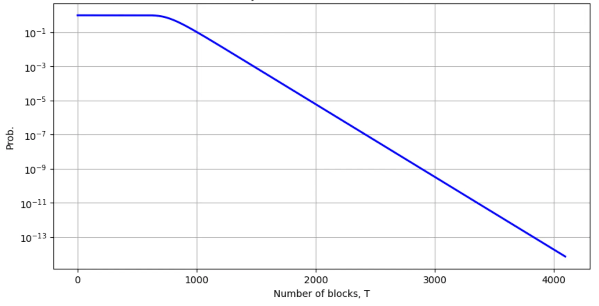

> The probability $`\mathrm{P}(\vert S_T\vert\neq N)`$ as a function of the number of blocks $`T`$ plotted for $`N=2048`$ and $`K=20`$.

The speed of approach to $`0`$ in above is controlled by $`K`$ and for *larger* $`K`$ the same probability can be attained with a *smaller* number of blocks. The probability matches simulations to a high degree of accuracy as can be seen in the figure below:
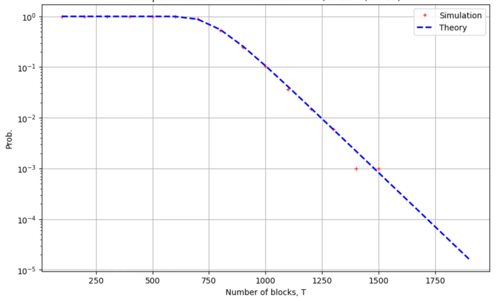

> Comparing the empirical version of the probability $`\mathrm{P}(\vert S_T\vert\neq N)`$, obtained from $`M=10^3`$ samples of simulation, with the analytic expression. The probability $`\mathrm{P}(\vert S_T\vert\neq N)`$ is plotted as a function of the number of blocks $`T`$ for $`N=2048`$ and $`K=20`$.

Furthermore, the probability $`\mathrm{P}(\vert S_T\vert\neq N)`$ is a monotonically *increasing* function of $`N`$, as can be seen in the figure below:
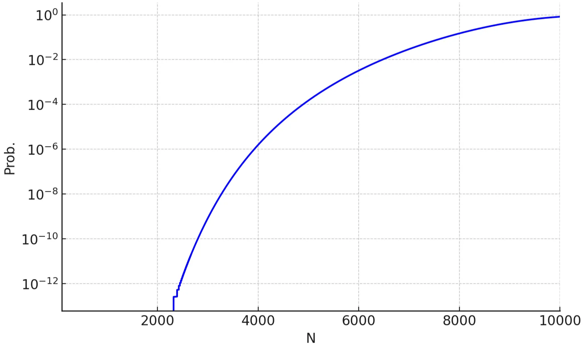

> The probability $`\mathrm{P}(\vert S_T\vert\neq N)`$ as plotted a function of the number of nodes $`N\in\{10^2,\ldots,10^4\}`$ for $`T=4320`$ blocks and $`K=20`$. For $`N=10^2`$ the prob. is (approx.) $`10^{-417}`$ and for $`N=10^3`$ the prob. is (approx.) $`10^{-35}`$.

### Analysis of DA Sampling

#### Details of DA Sampling

The set of nodes $`[N]`$ participating in the DA network is divided (almost) equally into $`N_{S}=2048`$ subnetworks. In each subnetwork there is at least *one* node from $`[N]`$. Each node in $`[N]`$ first samples randomly (*without* replacement) $`K=20`$ subnetworks from the $`N_{S}`$ subnetworks. Then, in each of the sampled subnetworks, a *single* node is sampled. If $`N\geq N_{S}`$, then the above is *equivalent* to random sampling (*without* replacement) of $`K`$ nodes from $`[N]`$.
#### Analysis of Connectivity

We consider the case of $`N\geq N_{S}`$. We assume that each node $`i\in[N]`$ samples randomly $`K`$ nodes from $`[N]\setminus\{i\}`$ exactly $`T`$ times, where $`T\geq1`$. The result of sampling is that we have $`M=N\times T`$ subsets of $`K`$ nodes ($`K`$-subsets). We would like to know in *how many* subsets of $`K`$ nodes node $`i`$ is a *member*, i.e. how many times node $`i`$ was sampled by other nodes. We note that the result of sampling can be represented as a random factor-graph:
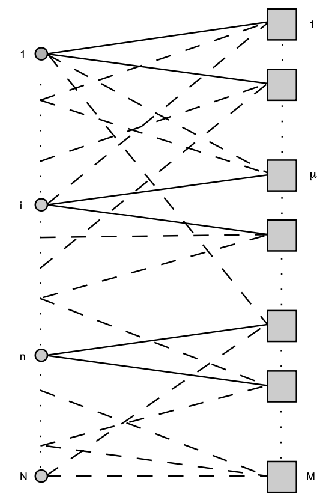

> The random factor-graph generated by sampling of $`M`$ subsets of $`K`$ nodes ($`K`$-subsets), represented by factors (squares), from the set of all nodes $`[N]`$ represented by (filled) circles. If node is member of a subset then this is represented by an edge on this graph; for $`K=3`$.

The *connectivity* of a node in this factor graph counts the number of $`K`$-subsets in which this node is a member. The connectivity of a node is a random variable from the binomial distribution $`\mathrm{P}(c\vert M,K/N)`$ with the parameters $`M`$ and $`K/N`$. Thus using $`M=N\,T`$, the *average* connectivity of a node is $`MK/N=TK`$. We note that the *typical*, i.e. most probable, connectivity is also *approx*. $`TK`$.
The probability that connectivity of node $`i\in[N]`$ is $`0`$ is given by $`(1-K/N)^M\leq\mathrm{e}^{-KM/N}=\mathrm{e}^{-TK}`$, i.e the probability is *small* when the average connectivity $`TK`$ is *large*. We note that for $`K=20`$ the prob. is bounded above by $`\mathrm{e}^{-20 T}=2.061154^T\times 10^{-9T}`$. For $`\epsilon \gt 0`$ the probability that node connectivity is less than average, $`c\leq TK-\epsilon`$, is bounded from above by $`\mathrm{e}^{-2\epsilon^2/M}`$. The latter follows from
$$
\mathrm{P}(c\leq TK-\epsilon)\leq\mathrm{e}^{-M\mathrm{D}\left(TK/N-\epsilon/M\vert\vert TK/N\right)}\\\leq \mathrm{e}^{-2M(\epsilon/M)^2}=\mathrm{e}^{-2\epsilon^2/M},
$$

where the first line in above is the binomial (Chernoff) [tail bound](https://en.wikipedia.org/wiki/Binomial_distribution#Tail_bounds) and the second line is obtained by application of [Pinsker’s inequality](https://en.wikipedia.org/wiki/Pinsker%27s_inequality).  The latter is also upper bound on the prob. of the event $`c\geq TK+\epsilon`$. Let $`\epsilon = \gamma TK`$ for some $`\gamma \in (0,1)`$. From the above, the probability of $`c \leq (1-\gamma)TK`$ has an upper bound of $`\mathrm{e}^{-2\gamma^2 TK^2/N}`$. We note that for $`N\rightarrow\infty`$ we have that $`\mathrm{e}^{-2\gamma^2TK^2/N}\rightarrow1`$ if $`TK^2\ll N`$ in this limit, but for $`T=\alpha N`$ we have the upper bound $`\mathrm{e}^{-2\gamma^2\alpha K^2}`$ independent on the number of nodes $`N`$. For $`T=\alpha N`$, we have:
$$
\mathrm{P}\left(\{c\leq(1-\gamma)\,TK\}\cup \{c\geq(1+\gamma)\,TK\}\right)\leq 2\,\mathrm{e}^{-2\gamma^2\alpha K^2}.
$$

For $`K=20`$ the probability that $`c\leq (1-\gamma)TK`$ or $`c\geq (1+\gamma)TK`$ for $`\gamma=1/10`$, i.e. 10% deviation from the average, is bounded from above by $`2\,\mathrm{e}^{-8\alpha}`$ ($`\approx 7\times10^{-4}`$ for $`\alpha=1`$) and for $`\gamma=2/10`$, i.e. 20% deviation from the average, the upper bound is $`2\,\mathrm{e}^{-32\alpha}`$ ($`\approx 2.5\times10^{-14}`$ for $`\alpha=1`$).
A much tighter upper bound is given by
$$
\mathrm{P}\left(c\geq(1+\gamma)\,TK\right)\leq\frac{\mathrm{e}^{-M\mathrm{D}\left(A_+\vert\vert K/N\right)}}{(1-R_+)\sqrt{2\pi MA_+(1-A_+)}},
$$

where $`A_+=\lceil (1+\gamma)\,TK\rceil/M`$ and $`R_+=\frac{K/N(1-A_+)}{A_+(1-K/N)}`$. In a similar manner, we have
$$
\mathrm{P}(c\leq(1-\gamma)\,TK)\leq\frac{\mathrm{e}^{-M\mathrm{D}\left(A_-\vert\vert K/N\right)}}{(1-1/R_-)\sqrt{2\pi MA_-(1-A_-)}},
$$

where $`A_-=\lceil (1-\gamma)\,TK\rceil/M`$. From the above, it follows that
$$
\mathrm{P}\left(\{c\leq(1-\gamma)\,TK\}\cup \{c\geq(1+\gamma)\,TK\}\right)\\=\mathrm{P}(c\leq(1-\gamma)\,TK)+\mathrm{P}\left(c\geq(1+\gamma)\,TK\right)\\\leq\frac{\mathrm{e}^{-M\mathrm{D}\left(A_-\vert\vert K/N\right)}}{(1-1/R_-)\sqrt{2\pi MA_-(1-A_-)}}+\frac{\mathrm{e}^{-M\mathrm{D}\left(A_+\vert\vert K/N\right)}}{(1-R_+)\sqrt{2\pi MA_+(1-A_+)}}.
$$

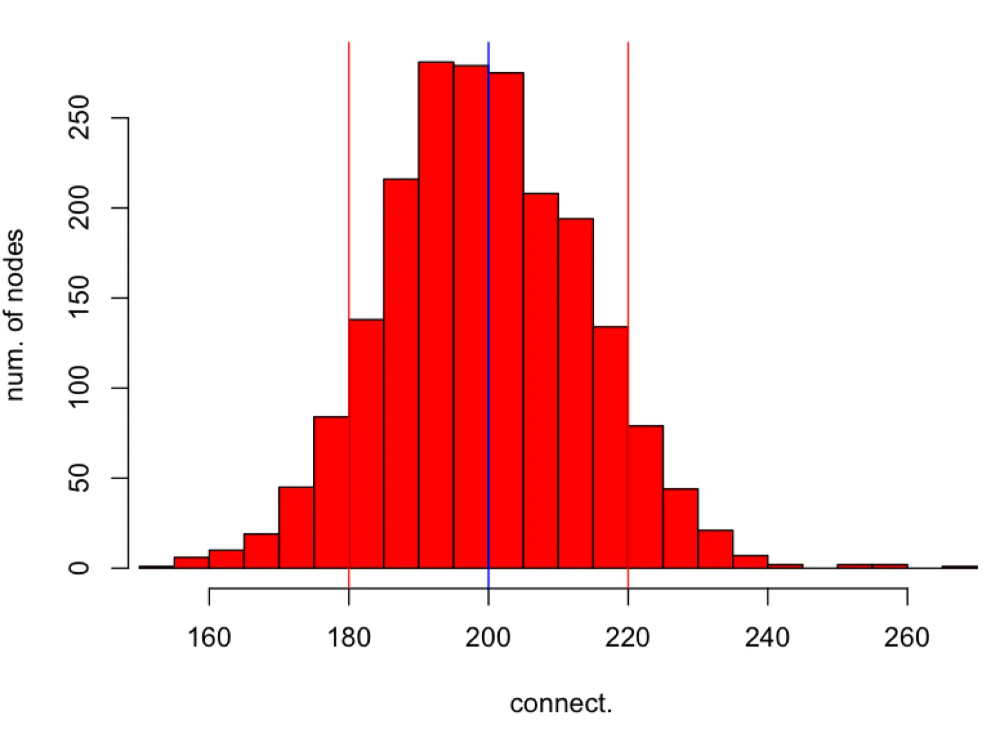

> The histogram of connectivities of nodes in $`[N]`$ obtained in simulation (red colour). Each node in $`[N]`$ is sampling $`T`$ subsets of $`K`$ nodes from $`[N]`$. The average connectivity $`TK`$ is represented by the (blue) vertical line in the middle and deviations from the average $`(1\pm\gamma)TK`$ are represented by two (red) vertical lines. The parameters of simulation are $`N=2048`$, $`K=20`$, $`T=10`$ and $`\gamma=1/10`$. The probability that the connectivity is outside the interval $`[(1-\gamma)TK,(1+\gamma)TK]`$ is at most $`0.214`$ follows from the upper bound.

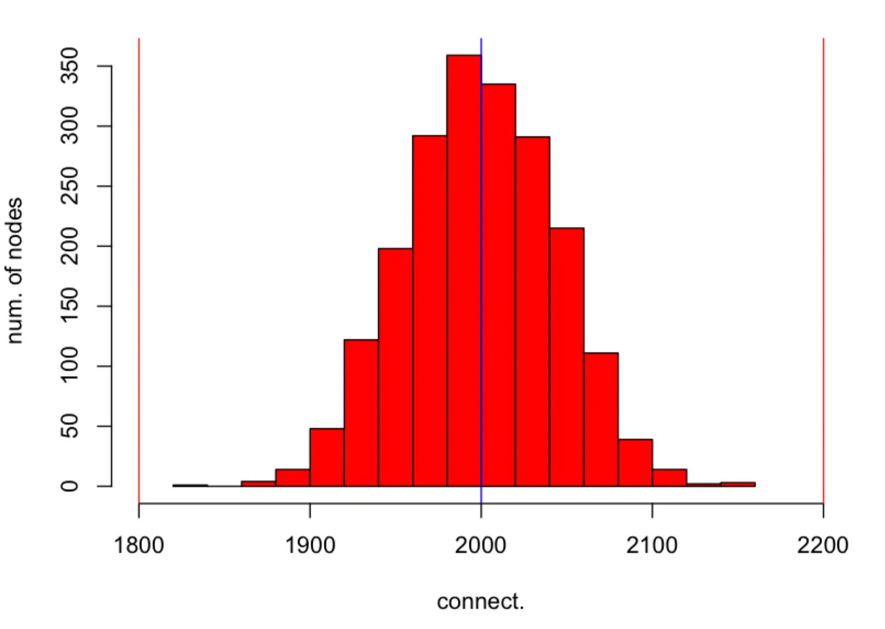

> The histogram of connectivities of nodes in $`[N]`$ obtained in simulation (red colour). Each node in $`[N]`$ is sampling $`T`$ subsets of $`K`$ nodes from $`[N]`$. The average connectivity $`TK`$ is represented by the (blue) vertical line in the middle and deviations from the average $`(1\pm\gamma)TK`$ are represented by two (red) vertical lines. The parameters of simulation are $`N=2048`$, $`K=20`$, $`T=100`$ and $`\gamma=1/10`$. The probability that the connectivity is outside the interval $`[(1-\gamma)TK,(1+\gamma)TK]`$ is at most $`7.935\times10^{-6}`$ follows from the upper bound.

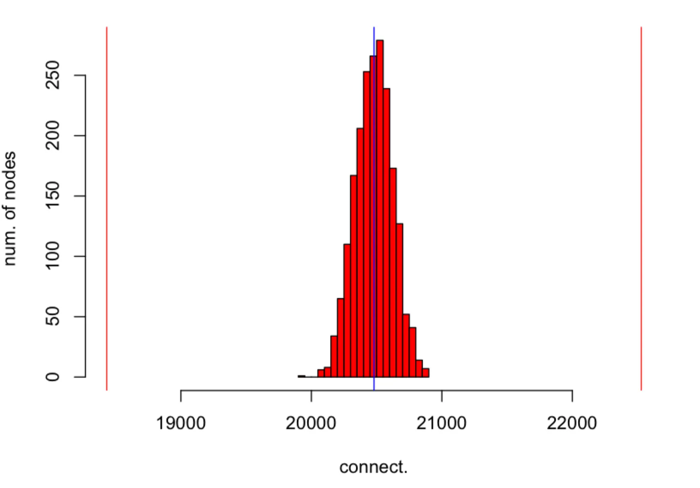

> The histogram of connectivities of nodes in $`[N]`$ obtained in simulation (red colour). Each node in $`[N]`$ is sampling $`T`$ subsets of $`K`$ nodes from $`[N]`$. The average connectivity $`TK`$ is represented by the (blue) vertical line in the middle and deviations from the average $`(1\pm\gamma)TK`$ are represented by two (red) vertical lines. The parameters of simulation are $`N=2048`$, $`K=20`$, $`T=N/2`$ and $`\gamma=1/10`$. The probability that the connectivity is outside the interval $`[(1-\gamma)TK,(1+\gamma)TK]`$ is at most $`9.2\times10^{-46}`$ follows from the upper bound.

### Fault Tolerant Properties of Rewarding and Optimal Threshold

The *true* opinion $`x^0_i\in \{0,1\}`$ is the opinion about node $`i`$ based on some objective criteria independent from other nodes. We assume that there exists a vector of “*true”* opinions $`\underline{x}^0=(x_{1}^0, x_{2}^0\ldots,x_{N}^0 )`$, where $`x_i^0\in \{0,1\}`$, about *all* nodes in $`[N]`$. Node $`i`$ submits the vector of opinions $`\underline{x}_i=(x_{i1}, x_{i2},\ldots,x_{iN} )`$ about other nodes in DA. Here $`x_{ij}\in \{0,1\}`$ is the opinion of node $`i`$ about the node $`j`$.
The sum $`\sum_{i=1}^Nx_{ij}`$ is the *sum* of *opinions* about node $`j`$. Performance of node $`j`$ is considered to be “good” if $`\sum_{i=1}^Nx_{ij}\geq\theta`$, where $`\theta`$ is some threshold, e.g. $`\theta=N/2`$. We assume that $`x_{ij}=x_{j}^0\oplus\xi_{ij}`$, where $`\xi_{ij}\in \{0,1\}`$. Here for $`x,y\in\{0,1\}`$ we use $`\oplus`$ for $`x\oplus y=(x+y)\mod2`$. We note that for $`\xi_{ij}=0`$ we have $`x_{ij}=x_{j}^0`$ and for $`\xi_{ij}=1`$ we have $`x_{ij}=x_{j}^0\oplus1`$, i.e. the opinion of a node $`i`$ about the node $`j`$ is either the *true* opinion $`x_{j}^0`$ or the *opposite* of true opinion $`x_{j}^0\oplus1`$. We note that $`x_{ij}`$ gives rise to the following $`N\times N`$ “opinion” matrix
$$
\underline{\underline{X}} = \begin{pmatrix}x_{11}      & x_{12} & \cdots & x_{1N} \\x_{21} & x_{22}      & \cdots & x_{2N} \\\vdots & \vdots & \ddots & \vdots \\x_{N1} & x_{N2} & \cdots & x_{NN}\end{pmatrix},
$$

where the $`i`$-th row is the vector of opinions submitted by node $`i`$ about *all* $`N`$nodes and the $`j`$-th column is the vector of opinions of *all* N nodes about the node $`j`$.
Let us consider the sum of opinions about the node $`j`$ as follows
$$
\sum_{i=1}^Nx_{ij}=\sum_{i=1}^Nx_{j}^0\oplus\xi_{ij}=\sum_{i=1}^N\sum_{\xi=0}^1\delta_{\xi;\xi_{ij}}(x_{j}^0\oplus\xi)\\
%
=x_{j}^0\sum_{i=1}^N\delta_{0;\xi_{ij}}+(x_{j}^0\oplus1)\sum_{i=1}^N\delta_{1;\xi_{ij}}\\
%
=x_{j}^0\left[N-\sum_{i=1}^N\delta_{1;\xi_{ij}}\right]+(x_{j}^0\oplus1)\sum_{i=1}^N\delta_{1;\xi_{ij}}.
$$

In the above expression, if $`x_j^0 = 0`$, then the first term evaluates to zero; and if $`x_j^0 = 1`$, then the second term evaluates to zero. Thus, only the correct specific to $`x_j^0`$  term remains active in each scenario. Hence from above follows that
$$
\sum_{i=1}^Nx_{ij}=
\left\{
  \begin{array}{c}
    N-n_j\text{, if } x_{j}^0=1 \\
    n_j \text{, if } x_{j}^0=0
  \end{array}
\right\}
$$

where $`n_j=\sum_{i=1}^N\delta_{1;\xi_{ij}}`$ is the number of nodes *disagreeing* with the *true* opinion $`x_j^0`$. We note that
$$
x_j^*=\mathbf{1}\left[\sum_{i=1}^Nx_{ij}\geq\theta\right]
$$

where $`\mathbf{1}\left[x\right]`$ is the [indicator function](https://en.wikipedia.org/wiki/Indicator_function), is the opinion about the node $`j`$ computed from the “opinion” matrix $`\underline{\underline{X}}`$.
If $`x_j^*\oplus x_j^0=0`$ for *all* $`j\in [N]`$ then all true and inferred opinions are in *agreement*, i.e. true opinions are recovered from opinion vectors submitted by nodes. Let us assume that $`x_1^0=1`$ and $`x_2^0=0`$. For $`x_1^0`$ to agree with $`x_1^*=\mathbf{1}\left[N-n_1\geq\theta\right]`$ and for $`x_2^0`$ to agree with $`x_2^*=\mathbf{1}\left[n_2\geq\theta\right]`$ the following two inequalities
$$
n_1\leq N-\theta\\n_2<\theta
$$

have to be satisfied. Let us assume that the threshold $`\theta=N/2`$ then this gives us $`n_1\leq N/2`$ and $`n_2 \lt N/2`$. If $`N`$ is *even* then the upper bound on $`n_1`$ and $`n_2`$ are, respectively, $`N/2`$ and $`N/2 -1`$. The minimum from the latter two, i.e. $`N/2 -1`$, satisfies both inequalities. Hence $`N/2 -1`$ is the *maximum* number of *disagreements* which allow us to recover the *true* opinions $`x_1^0`$ and $`x_2^0`$ from the computed opinions $`x_1^*`$ and $`x_2^*`$. For $`\theta=N/2`$ and $`N`$ *odd*, a similar argument gives us $`\lfloor N/2\rfloor`$ for the *maximum* number of *disagreements* under which the *true* opinions $`x_1^0`$ and $`x_2^0`$ can be recovered.
We note that for *any* vector of true opinions $`\underline{x}^0`$ the condition to recover these true opinions from the opinion matrix $`\underline{\underline{X}}`$ is given by the system of inequalities
$$
n_i\leq N-\theta\\n_j<\theta,
$$

where $`i\in\{k\in[N]\,\vert\, x_k^0=1\}`$ and $`j\in\{k\in[N]\,\vert\, x_k^0=0\}`$. For $`\theta=N/2`$ the above system is satisfied by
$$
n_i=n_j=\frac{N-2}{2}\mathbf{1}\!\left[N \text{ is even}\right]+\lfloor N/2\rfloor\mathbf{1}\!\left[N \text{ is odd}\right]
$$

which is the *maximum* number of *disagreements* under which the true opinions vector $`\underline{x}^0`$ can be recovered *exactly*. We note that above is true for *any* distribution of $`\xi_{ij}`$.
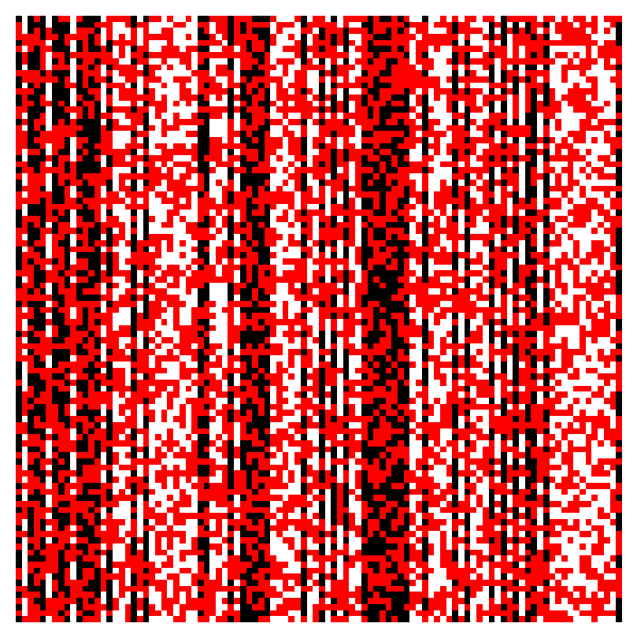

> Image representation of the opinion matrix $`\underline{\underline{X}}\in\{0,1\}^{N\times N}`$ for $`N=100`$. The vector of true opinions $`\underline{x}^0\in\{0,1\}^{1\times N}`$ is represented by the black and white pixels corresponding, respectively, to $`1`$s and $`0`$s. The red pixels indicate disagreements with true opinions in the opinion (row) vectors submitted by nodes. Here less than $`1/2`$ of pixels in column vectors, used to compute opinions about nodes, are red and hence true opinion about each node can be recovered exactly.

The threshold $`\theta=N/2`$ is *optimal* as it allows the *maximum* number of *disagreements* with the *true* opinion about a node but still allows to recover the true opinion about *each* node *exactly*.
#### Proof that the Threshold $`\theta=N/2`$ is Optimal

1. It is sufficient to consider only two inequalities from the system. In particular we consider
$$
n_1\leq N-\theta\\n_2<\theta
$$

1. We want to find $`\theta`$ such that $`\min(N-\theta,\theta)`$ is *maximised*.**The latter is given by the solution of $`N-\theta=\theta`$ (see figure below) which is $`\theta=N/2`$.

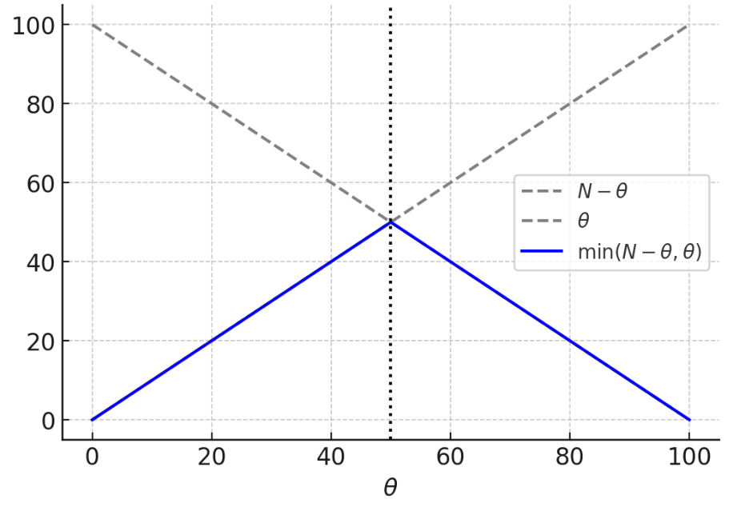

> $`N-\theta`$ and $`\theta`$ plotted as a function of $`\theta`$ for $`N=100`$.

1. If $`N`$ is *even*, then
$$
n_1,n_2\leq N/2-1
$$

to satisfy the system of inequalities and hence $`n_1=n_2=N/2-1`$ is the *maximum* which saturates above.
1. If $`N`$ is *odd*, then
$$
n_1,n_2\leq \lfloor N/2\rfloor
$$

then $`n_1=n_2=\lfloor N/2\rfloor`$ is the *maximum.*
## Conclusion

This document provides a comprehensive theoretical and empirical evaluation of the reward distribution mechanism in the DA network based on independent peer sampling. Through probabilistic modelling and simulations, we demonstrate that:
- **High coverage** of peer observations is achieved exponentially fast with respect to the number of blocks, even with modest per-block sampling rates.
- **Connectivity** across the network remains tightly concentrated around the average number of observations per node, enabling predictable and equitable participation.
- A **majority voting rule** with a threshold of $`\theta = N/2`$ is proven to be optimal, allowing the maximum possible number of disagreements while still correctly recovering the true underlying performance vector.
These findings validate the soundness and scalability of the DA Network rewarding protocol. The analysis guarantees both **robustness to adversarial behavior** and **fairness across the participant set**, laying a strong foundation for deploying this mechanism in a decentralized setting. Future work may consider adaptive sampling strategies or reputation-weighted voting to further enhance the system’s resilience under dynamic network conditions.
## Appendix

### Statistical Properties of Node Connectivities

Let us define the random (”connectivity”) variable $`c_{i\mu}\in\{0,1\}`$, where $`i\in[N]`$ and $`\mu\in[M]`$, which is $`1`$ with prob. $`1/N`$ when node $`i`$ is in the $`k`$-subset $`\mu`$ and $`0`$ with prob. $`1-1/N`$ otherwise.  Given that $`c_{i\mu}`$ variables are sampled randomly, but subject to the constraint $`\sum_{i=1}^N c_{i\mu}=k`$ for all $`\mu\in [M]`$, the joint prob. distribution of all $`c_{i\mu}`$’s, i.e. the set $`\{c_{i\mu}\}`$, is given  by
$$
\mathrm{P}(\{c_{i\mu}\})=\frac{1}{Z}\left\{\prod_{i=1}^N\prod_{\mu=1}^M(1/N)^{c_{i\mu}}(1-1/N)^{1-c_{i\mu}}\right\}\prod_{\mu=1}^M\mathbf{1}\left[\sum_{i=1}^Nc_{i\mu}=k\right]
$$

where $`Z=\left[{N\choose k} (1/N)^k(1-1/N)^{N-k}\right]^M`$is the *normalisation* constant.
We are interested in the random variable $`c_i=\sum_{\mu=1}^M c_{i\mu}`$, i.e. the “connectivity” of node $`i`$. In particular we consider the distribution $`\mathrm{P}(c)=\frac{1}{N}\sum_{i=1}^N\sum_{\{c_{j\mu}\}} \mathrm{P}(\{c_{i\mu}\})\delta_{c;\sum_{\mu=1}^M c_{i\mu}}`$.  We note that, without loss of generality, we have $`\mathrm{P}(c)=\sum_{\{c_{i\mu}\}} \mathrm{P}(\{c_{i\mu}\})\delta_{c;\sum_{\mu=1}^M c_{1\mu}}`$ and for some $`\lambda \gt 0`$ the moment generating function (MGF) of the latter is given by $`\left[(1-k/N)+\mathrm{e}^{\lambda}k/N\right]^M`$and hence $`\mathrm{P}(c)={M\choose c}(k/N)^c(1-k/N)^{M-c}`$, i.e. $`\mathrm{P}(c)`$ is the *binomial* distribution with parameters $`M`$ and $`k/N`$.
## Bibliography

Ferrante, Guido Carlo. "Bounds on binomial tails with applications." *IEEE Transactions on Information Theory* 67, no. 12 (2021): 8273-8279.
