# ANALYSIS-TOTAL-STAKE-INFERENCE

| Field | Value |
| --- | --- |
| Name | [Analysis] Total Stake Inference |
| Slug | 198 |
| Status | raw |
| Category | Informational |
| Editor | David Rusu <davidrusu@logos.co> |
| Contributors | Alexander Mozeika <alexander.mozeika@logos.co>, Daniel Kashepava <danielkashepava@logos.co>, Filip Dimitrijevic <filip@logos.co> |

<!-- timeline:start -->

## Timeline

- **2026-05-27** — [`b7602ed`](https://github.com/logos-co/logos-lips/blob/b7602ed8a225d41ca0bfaaa432524dc84d2ded7e/docs/blockchain/raw/analysis-total-stake-inference.md) — chore: move blockchain specs from notion to github

<!-- timeline:end -->

# Revision History

| Version | Changes | Date |
| --- | --- | --- |
| 1.0.0 | Initial revision. | 2026-04-09 |

# Introduction

Cryptarchia consensus leadership is determined by a lottery in which the chances of winning are higher for eligible nodes with a greater stake relative to the total active stake. At the same time, the true total active stake cannot be known by participants due to the privacy properties of Logos Blockchain notes. This tension is resolved in Cryptarchia by having the network estimate the total active stake based on the observed activity of the network.

## Goals

The Cryptarchia total stake inference algorithm must satisfy the following criteria:

1. The inference process converges quickly, yielding a mean estimate that closely matches the true total stake. However, mean accuracy alone is not sufficient—if the estimator’s variance remains high at steady state, block production rates may fluctuate significantly. Thus, effective total stake inference requires both rapid, accurate mean convergence and low variance to ensure stable, predictable block production throughout the protocol.
1. The process can be approximated well enough with the information we have in Cryptarchia.

# Overview

This document provides an analysis of the Cryptarchia total stake inference algorithm based on the following criteria:

- Accuracy: The closeness of the mean inferred total stake to the true total stake; it measures systematic bias in the estimator.
- Precision: The degree to which repeated inferences yield similar results at equilibrium; it is quantified by the variance of the estimator and reflects how tightly values cluster around the mean, independent of accuracy.
- Stability Conditions: The range of possible values for the learning rate $\beta$ that result in the stake inference values converging to the true total stake under stable conditions.
- Convergence Speed: The bounds under which the total stake inference values converge exponentially to the true total stake under stable conditions. This analysis also includes an optimal value for $\beta$.

## Total Stake Inference Process

The inference algorithm is described in [🔀\[1.0.0\] Total Stake Inference - Algorithm](cryptarchia-total-stake-inference.md). In order to analyze the properties of this algorithm, we model it analytically as the following sequence $`\{D_\ell\}_{\ell=0}^\infty`$. We then verify that this model aligns with the algorithm to ensure that the analysis accurately reflects the actual process.

$$
D_{\ell+1}=D_{\ell}-\frac{\beta}{f}D_\ell\left[f-\frac{\sum_{t=1}^T \mathbf{1}\left[\sum_{i=1}^N s^\ell_i(t)\geq1\right] - n(\ell)}{T}\right]
$$

where,

- $`D_{\ell}`$ is the inferred total stake at epoch $\ell$;
- $\beta$ is the learning rate which governs how quickly we adjust our estimate to new information;
- $f$ is the target slot occupancy rate;
- $T$ is the observation period in which we observe the slot occupancy rate;
- $`\mathbf{1}[p]`$ is the indicator function resolving to $1$ if $p$ is true, $0$ otherwise;
- $N$ is the number of nodes in the system;
- $`s^\ell_i(t)\in \{0,1\}`$ is the lottery result of node $i$ at slot $t$, in epoch $\ell$; here, 1 signals a win, and 0 signals a loss;
- $`n(\ell) \in \lbrace 0,1,...,\sum_{t=1}^T \mathbf{1}\left[\left(\sum_{i=1}^N s^\ell_i(t)\right)\geq1\right] \rbrace`$ is the number of slots in epoch $\ell$ that could have extended the honest chain but instead were wasted on orphaned blocks.

We note that the form above captures how the protocol updates its estimate of the total active stake based on observed network activity, and the actual inference process is described at: [🔀\[1.0.0\] Total Stake Inference - Algorithm](cryptarchia-total-stake-inference.md). Specifically, at each epoch $\ell$, the estimate $`D_\ell`$ is adjusted according to the difference between the target slot occupancy rate $f$ and the observed average fraction of slots with at least one block extending the honest chain (after accounting for wasted slots, $n(\ell)$). The learning rate $\beta$ and normalization by $f$ control how aggressively the estimate is updated.

# Analysis

## Accuracy

The process converges to the following value:

$$
\mathbb{E}\left[ D_{\infty}\right] = \frac{\log(1-f)}{\log(1-f/q)}\cdot D_{\mathrm{TRUE}}
$$

where,

- $`\mathbb{E}\left[D_\infty\right]`$ is the mean fixed point of the inference process;
- $`D_{\mathrm{TRUE}}`$ is the true total stake active during the consensus protocol execution;
- $q\in(f,1]$ is the honest slot utilization rate representing the rate of occupied slots contributing to the honest chain growth.

We note that for $q\in(f,1]$, we have that $\log(1-f)/\log(1-f/q)\leq1$. This suggests that increased network delay, which reduces the honest slot utilization rate through wasted blocks results in a systematic underestimate of true total stake.

For a derivation of this result, please see [Accuracy Derivation](#accuracy-derivation).

### Measuring $q$ from simulations

In simulation, we can derive the value $q$ by measuring how many of the active slots contributed towards the honest chain with this formula:

$$
q = \frac{\text{total honest chain slots}}{\text{total active slots}}
$$

Since $q$ varies by epoch and is impacted by the total stake inference process, measurements should be taken after the system converges to a steady state. From simulations, this tends to be after 5 epochs.

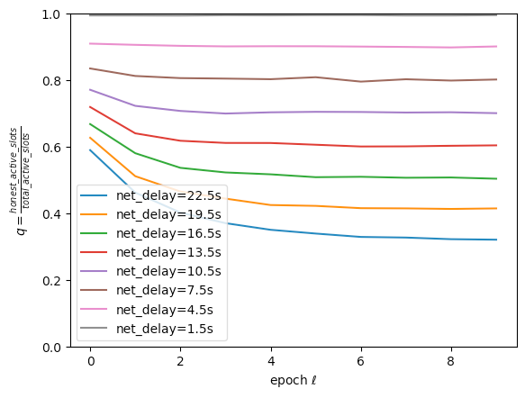

> Measured $`q`$ value for each epoch under different network delays. $`q`$ typically converges after a few epochs for reasonable networks. $`f=1/30,T=6k/f,N=100,\beta=1`$

### Simulation Results

This result predicts that we consistently underestimate true stake by a factor of $`\frac{\log(1-f)}{\log(1-f/q)}`$. We verified this prediction in simulations and saw a strong correlation between this prediction and the stake we inferred in simulation:

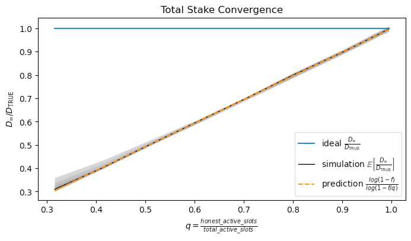

> The percent of total stake that we converged to under varying honest slot utilization rates $`q`$. The model provides a very accurate prediction of the behaviour in simulation. Here, $`f=1/30,T=6k/f,k=2160,\beta=1`$.

### Connecting Simulation to Logos Blockchain

With our choice of Blend Network parameters, we measured a $q$ value of 0.85 in simulation, plugging that into our model gives $`\frac{\log(1-f)}{\log(1-f/q)}\approx 0.847`$. That is, if the Blend Network behaves like our simulation, we expect to infer a total stake that is ~84.7% of the true total stake, or ~15% below true total stake. This loss in accuracy is due to not being able to count blocks off the honest branch.

## Precision

The variance at equilibrium is given by

$$
\mathrm{Var}\left[\frac{D_{\infty}}{D_{\mathrm{TRUE}}}\right]=\left(\frac{\beta}{f}\right)^2\frac{q}{T}\left(\frac{\log(1-f)}{\log(1-f/q)}\right)^2(1-f)f
$$

Furthermore, because of $q\in(f,1]$ and  $\log (1-f) / \log (1-f/q) \leq1$, the variance is bounded above by:

$$
\mathrm{Var}\left[\frac{D_{\infty}}{D_{\mathrm{TRUE}}}\right]\leq \frac{(\beta/f)^2}{T}(1-f)f
$$

The implication is that wasted blocks caused by network delays have a stabilizing effect on the inference process. As the network delay grows, the variance in our estimate decreases.

For a derivation of this result, see [Precision Derivation](#precision-derivation).

### Simulation Results

Checking these predictions in simulations shows very good agreement with analysis:

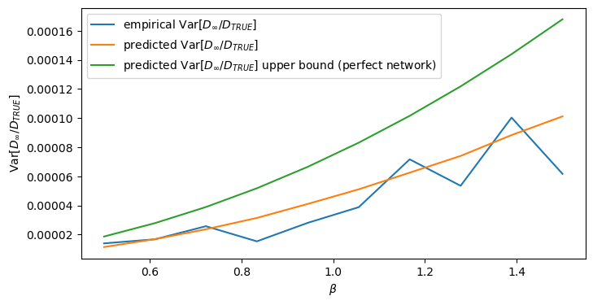

> Here we measure the variance of the inferred total stake after the process has converged. We observe low variance across a wide spectrum of $`\beta`$ values suggesting that our epoch lengths are long enough to give us a sufficiently precise measurement of total stake for any reasonable learning rate. We see strong agreement with predictions from analysis. We note that $`f=1/30,T=6k/f,k=2160`$ and $`q`$ is measured as described in [Measuring $`q`$ from simulations](#measuring-q-from-simulations).

## Stability Condition

The inference process is stable for $\beta$ values that satisfy the following condition

$$
\beta \lt \frac{2f}{\left(q -f \right) \log \left(\frac{1}{1-f/q}\right)}
$$

where $q$ is the honest slot utilization rate as mentioned above.

Note that for $q=1$ (perfect network, all active slots are used by the honest chain), we have a lower bound on the stability condition, meaning we can tolerate a higher learning rate $\beta$ and converge faster when the network is inefficient:

$$
\frac{2f}{\left(1 -f \right) \log \left(\frac{1}{1-f}\right)} \le  \frac{2f}{\left(q -f \right) \log \left(\frac{1}{1-f/q}\right)}
$$

For a derivation of this result, see [Stability Condition Derivation](#stability-condition-derivation).

### Simulation Results

In simulations, we see that when we exceed the condition, the spread in $`D_\infty`$ values explodes for $`\beta \ge \frac{2f}{\left(q -f \right) \log \left(\frac{1}{1-f/q}\right)}`$.

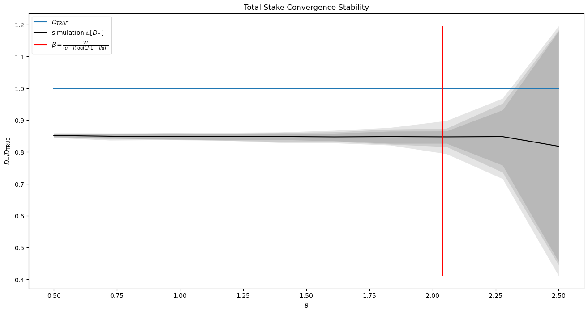

> The plot shows the spread of values observed over 45 epochs after the process has been given sufficient time to converge. We observe that we have high precision when $`\beta`$ is comfortably within the stability condition range and grows rapidly outside of the range. Red line signals the boundary of the convergence condition ($`\beta = \frac{2f}{\left(q -f \right) \log \left(\frac{1}{1-f/q}\right)}`$). Here, $`f=1/30,T=6k/f,k=2160`$ and $`q`$ is measured as described in [Measuring $`q`$ from simulations](#measuring-q-from-simulations).

## Convergence Speed and Optimal Learning Rate

The process converges exponentially with the following bound:

$$
\left| \frac{\mathbb{E}\left[ D_\ell\right] - \mathbb{E}\left[ D_\infty \right]}{D_{\mathrm{TRUE}}} \right|
\leq A\, \left|\frac{D_0 - \mathbb{E}\left[ D_\infty \right]}{D_{\mathrm{TRUE}}} \right| \times \left\vert1-\frac{\beta}{f} \left(q -f \right) \log \left(\frac{1}{1-f/q}\right)\right\vert^\ell
$$

That is, for some constant $`A \gt 0`$, at epoch $\ell$, the distance between the value for the total stake $`D_\ell`$ and the equilibrium estimate $`D_\infty`$ falls exponentially. Moreover, this result predicts an optimal convergence rate

$$
\beta=\frac{f}{\left(q -f \right)\log \left(\frac{1}{1-\frac{f}{q}}\right) }
$$

For reasonable $q$ values, this gives us a $\beta$ slightly higher than 1. Choosing a smaller $\beta$ can only improve the stability of the inference algorithm. This fact, combined with the uncertainty in selecting a $q$ value suggests that we should just select $\beta=1$ as our learning rate.

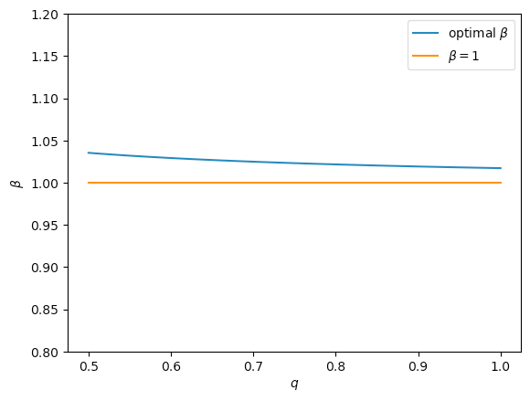

> Plotting optimal $`\beta`$ under varying $`q`$ values shows that $`\beta=1`$ is a close enough approximation to the optimal learning rate. Here $`f=1/30`$.

For a derivation of this result, see [Convergence Speed and Optimal Learning Rate Derivation](#convergence-speed-and-optimal-learning-rate-derivation).

### Simulation Results

We verified these results in simulations, showing that the bound holds for varying $\beta$’s.

The plots show the measured normalized error $`\left|\frac{\langle D_\ell\rangle - \langle D_\infty \rangle}{D_{\mathrm{TRUE}}} \right|`$ decreasing as epoch $\ell$ increases. Cryptarchia parameters for all plots were $f=1/30,T=6k/f,k=2160,q=0.85$.

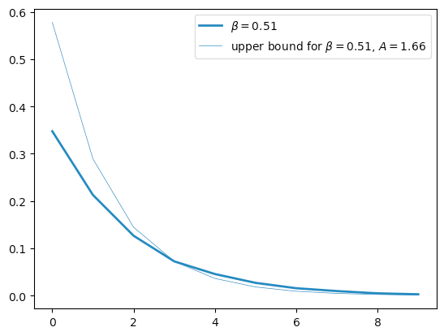

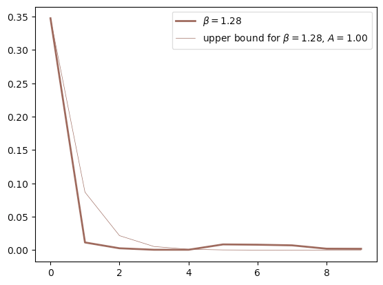

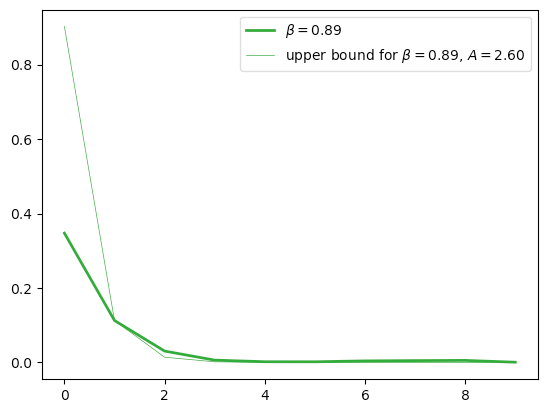

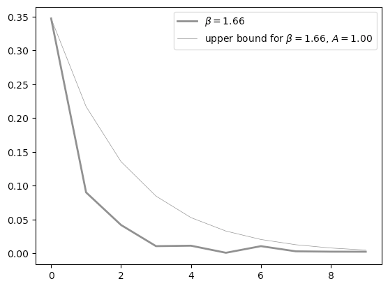

Optimal convergence was checked as well showing that with [optimal](#convergence-speed-and-optimal-learning-rate)[#convergence-speed-and-optimal-learning-rate)$\beta$, even with massive shocks to total stake, we can converge within 2 epochs.

Plots show the distribution of normalized error $`\left|\frac{\langle D_\ell\rangle - \langle D_\infty \rangle}{D_{\mathrm{TRUE}}} \right|`$ at each epoch $\ell$ for the optimal $\beta$ parameter under different initial conditions. Cryptarchia parameters for all plots were $f=1/30,T=6k/f,k=2160,q=0.85,\beta=1$.

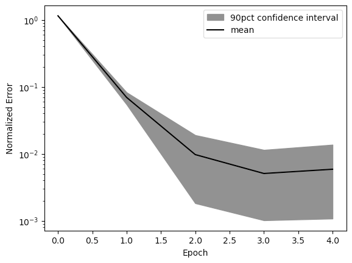

> Converging to new equilibrium after losing half active stake.

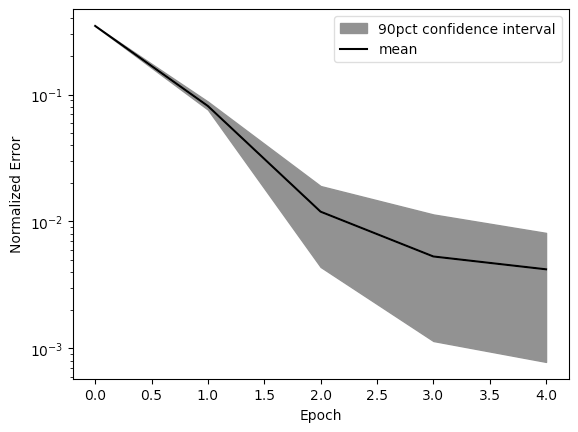

> Converging to new equilibrium after doubling active stake.

# Details

## Accuracy Derivation

The following is the derivation for the property described in [Accuracy](#accuracy).

- The total stake inference equation is given by

$$
D_{\ell+1}=D_{\ell}-h(\ell)\left[f-\frac{1}{T}\sum_{t=1}^T \mathbf{1}\bigg[\bigg(\sum_{i=1}^N s_i(t)\vert D_\ell\bigg)\geq1\bigg]\right],
$$

where  $`h(\ell) \gt 0`$ is the learning rate. In the above, we write $`s_i(t)\vert D_\ell`$ to emphasise that the random variable $`s_i(t)`$ is conditional on $`D_\ell`$.

- In the [equation used in inference of total stake](#total-stake-inference-process), we take $`h(\ell) = \frac{\beta}{f} D_\ell`$ but the starting point of our analysis uses a more general learning rate $h(\ell)$.
- We note that $`\sum_{t=1}^T \mathbf{1}\big[\big(\sum_{i=1}^N s_i(t)\vert D_\ell\big)\geq1\big]`$ is the number of active slots, i.e. slots with at least one winner, in the $\ell$-th epoch.
- For the outcome of leader election process $`\mathbf{s}(t)=(s_1(t),\ldots,s_N(t))`$ at the time-slot $t$, the probability of outcomes $`\left(\mathbf{s}(1),\ldots,\mathbf{s}(T)\right)`$ at times $t\in[T]$ is given by

$$
\mathrm{P}[\mathbf{s}(1),\ldots,\mathbf{s}(T)\vert D_{\ell}]=\prod_{t=1}^T\prod_{i=1}^N \left[\phi_f(w_i/D_{\ell})\,\delta_{1;s_i(t)}+(1-\phi_f(w_i/D_{\ell}))\,\delta_{0;s_i(t)}\right],
$$

where

$$
\phi_f(\alpha)=1-(1-f)^{\alpha}
$$

is the probability of winning and $`w_i`$ is the stake of node $i$.

- We note that $`D_\ell`$ is a random variable.
- Node $i$ uses its (local) copy of the blockchain in the inference of the total stake and the latter can give a different count for the number of active slots  because of a number of slots being “wasted”.
- To model this scenario, we introduce variable $`n(\ell)\vert \sum_{t=1}^T \mathbf{1}\big[\big(\sum_{i=1}^N s_i(t)\vert D_\ell\big)\geq1\big]\in\lbrace 0,1,\ldots,\sum_{t=1}^T \mathbf{1}\big[\big(\sum_{i=1}^N s_i(t)\vert D_\ell\big)\geq1\big]\rbrace`$, i.e. $n(\ell)$ is conditional on $`\sum_{t=1}^T \mathbf{1}\big[\left(\sum_{i=1}^N s_i(t)\vert D_\ell \right)\geq1\big]`$, such that

$$
\sum_{t=1}^T \mathbf{1}\big[\big(\sum_{i=1}^N s_i(t)\vert D_\ell\big)\geq1\big]-n(\ell)\bigg\vert \sum_{t=1}^T \mathbf{1}\big[\big(\sum_{i=1}^N s_i(t)\vert D_\ell\big)\geq1\big]
$$

is the number of blocks on the chain of an honest node, i.e. the number of “honest” slots. The latter will be used for inference by an honest node as follows

$$
D_{\ell+1}=D_{\ell}-h(\ell)\left[f-\frac{1}{T}\lbrace \sum_{t=1}^T \mathbf{1}\bigg[\bigg(\sum_{i=1}^N s_i(t)\vert D_\ell\bigg)\geq1\bigg]-n(\ell)\rbrace\right],
$$

where in above $`n(\ell)\equiv n(\ell)\vert \sum_{t=1}^T \mathbf{1}\big[\big(\sum_{i=1}^N s_i(t)\vert D_\ell\big)\geq1\big]`$.

- We note that

$$
\begin{aligned}
D_{\ell+1} &= D_{\ell}-h(\ell)\left[f-\frac{1}{T}\lbrace \sum_{t=1}^T \mathbf{1}\bigg[\bigg(\sum_{i=1}^N s_i(t)\vert D_\ell\bigg)\geq1\bigg]-n(\ell)\rbrace\right] \\
  &\leq D_{\ell}-h(\ell)\left[f-\frac{1}{T}\sum_{t=1}^T \mathbf{1}\bigg[\bigg(\sum_{i=1}^N s_i(t)\vert D_\ell\bigg)\geq1\bigg]\right]
\end{aligned}
$$

i.e. for the same $`D_\ell`$, the $`D_{\ell+1}`$ of the honest node’s [equation](#accuracy-derivation) is bounded above by the $`D_{\ell+1}`$ of the idealised [equation](#accuracy-derivation).

- Let us assume that $n(\ell)$ is a random variable from the binomial distribution with the parameters $p(\ell)$ and $`\sum_{t=1}^T \mathbf{1}\big[\big(\sum_{i=1}^N s_i(t)\vert D_\ell\big)\geq1\big]`$.
- Here $p(\ell)$ is the probability that a slot is “wasted” in epoch $\ell$ and hence there are (on average) $`p(\ell) \sum_{t=1}^T \mathbf{1}\big[\big(\sum_{i=1}^N s_i(t)\vert D_\ell\big)\geq1\big]`$ number of slots wasted in epoch $\ell$.
- We note that the above assumption about $n(\ell)$ is mathematically convenient but not necessary true. However it is the simplest non-trivial assumption, and its validity can be tested in simulations.
- We first consider the equation

$$
D_{1}=D_0-h(0)\left[f-\frac{1}{T}\lbrace \sum_{t=1}^T \mathbf{1}\bigg[\bigg(\sum_{i=1}^N s_i(t)\vert D_0\bigg)\geq1\bigg]-n(0)\rbrace\right]
$$

- Averaging above over the random variable $n(0)$ gives us the equation

$$
D_{1}=D_0-h(0)\left[f-\frac{1-p(0)}{T}\sum_{t=1}^T \mathbf{1}\bigg[\bigg(\sum_{i=1}^N s_i(t)\vert D_0\bigg)\geq1\bigg]\right]
$$

- Now, let us assume that $`D_0`$ is deterministic and consider the average of $`D_1`$, $`\langle D_1\rangle_0`$, with respect to the [distribution](#accuracy-derivation) as follows

$$
\langle D_1\rangle_0=D_{0}-h(0)\left[f-\frac{1-p(0)}{T}\sum_{t=1}^T \left\langle \mathbf{1}\bigg[\bigg(\sum_{i=1}^N s_i(t)\vert D_0\bigg)\geq1\bigg]\right\rangle_0\right]\\
=D_{0}-h(0)\left[f-\frac{1-p(0)}{T}\sum_{t=1}^T \left\langle \left[1-\mathbf{1}\!\bigg[\bigg(\sum_{i=1}^N s_i(t)\vert D_0\bigg)=0\bigg]\right]\right\rangle_0\right]\\
%=D_{0}-h(0)\left[f-\frac{1}{T}\sum_{t=1}^T \eta_i(t)\, \lbrace 1-\left\langle\mathbf{1}\!\bigg[\sum_{i=1}^N s_i(t)=0\bigg]\right\rangle_0\rbrace\right]\\
=D_{0}-h(0)\left[f-  [1-p(0)]\left[1-(1-f)^{D^0[\mathbf{w}]/D_0}\right]\right]
$$

- Thus using in above the [definition](#accuracy-derivation) we obtain the following equation

$$
\langle D_1\rangle_0
=D_{0}-h(0)\left[f- [1-p(0)]\phi_f(D^0[\mathbf{w}]/D_0)\right],
$$

where in above $`D^0[\mathbf{w}]`$ is the true total stake.

- We note that for $p(0)=0$ we recover the following equation

$$
\langle D_{1}\rangle_0=D_{0}-h(0)\left[f- \phi_f(D^0[\mathbf{w}]/D_0)\right]
$$

- Next, we define the normalised inferred stake $`\overline{D}_{\ell+1}=\frac{ D_{\ell+1}}{D^0[\mathbf{w}]}`$, and the average $`\langle \overline{D}_{\ell+1}\rangle=\langle \overline{D}_{\ell+1}\rangle_\ell`$, and postulate that the latter satisfies the equation

$$
\langle \overline{D}_{\ell+1}\rangle
=\langle \overline{D}_{\ell}\rangle-\tilde{h}(\ell)\left[f-q(\ell)\,\phi_f(1/\langle \overline{D}_{\ell}\rangle)\right],
$$

where $q(\ell)=1-p(\ell)$, i.e. the probability that a slot is not wasted in epoch $\ell$.

- We note that $`q(\ell)\,\phi_f(1/\langle \overline{D}_{\ell}\rangle)\,T`$ is the average number of slots not wasted in epoch $\ell$.
- Let us assume that $q(\ell)=q$, i.e. the probability $p(\ell)$ is the same in all epochs, and consider the equation

$$
\langle \overline{D}_{\ell+1}\rangle
=\langle \overline{D}_{\ell}\rangle-\tilde{h}(\ell)\left[f-q\, \phi_f(1/\langle \overline{D}_{\ell}\rangle)\right]
$$

- Then $`\langle \overline{D}_{\ell}\rangle`$ such that $`f=q\, \phi_f(1/\langle \overline{D}_{\ell}\rangle)`$ is the fixed point of the above equation. Solving the latter gives us

$$
\boxed{\langle \overline{D}_{\ell}\rangle =\frac{\log(1-f)}{\log(1-f/q)}}
$$

- We note that above solution exists for $q\in (f,1]$. The function $`\frac{\log(1-f)}{\log(1-f/q)}`$ is monotonic increasing function of $q$ on the interval $(f,1]$ and hence

$$
\boxed{\frac{\log(1-f)}{\log(1-f/q)}\leq1}.
$$

## Precision Derivation

The following is a derivation for the property described in [Precision](#precision).

- We consider the equation

$$
D_{1}=D_{0}-h(0)\left[f-\frac{1}{T}\lbrace \sum_{t=1}^T \mathbf{1}\bigg[\bigg(\sum_{i=1}^N s_i(t)\vert D_0\bigg)\geq1\bigg]-n(0)\bigg\vert\sum_{t=1}^T \mathbf{1}\bigg[\bigg(\sum_{i=1}^N s_i(t)\vert D_0\bigg)\geq1\bigg]\rbrace\right]
$$

where $n(0)$ is random variable from the binomial distribution with the parameters $p(0)$ and $`\sum_{t=1}^T \mathbf{1}\bigg[\bigg(\sum_{i=1}^N s_i(t)\vert D_0\bigg)\geq1\bigg]`$.

- The variance of $`D_1`$ is given by

$$
\mathrm{Var}[D_{1}]=~~\frac{h^2(0)}{T^2}\mathrm{Var}\left[\sum_{t=1}^T \mathbf{1}\bigg[\bigg(\sum_{i=1}^N s_i(t)\vert D_0\bigg)\geq1\bigg]-n(0)\bigg\vert\sum_{t=1}^T \mathbf{1}\bigg[\bigg(\sum_{i=1}^N s_i(t)\vert D_0\bigg)\geq1\bigg]\right]
$$

- We note that

$$
\mathrm{Var}\left[{\sum_{t=1}^T \mathbf{1}\bigg[\bigg(\sum_{i=1}^N s_i(t)\vert D_0\bigg)\geq1\bigg]}-n(0)\bigg\vert {\sum_{t=1}^T \mathbf{1}\bigg[\bigg(\sum_{i=1}^N s_i(t)\vert D_0\bigg)\geq1\bigg]}\right]\\
=\mathrm{Var}\left[{\sum_{t=1}^T \mathbf{1}\bigg[\bigg(\sum_{i=1}^N s_i(t)\vert D_0\bigg)\geq1\bigg]}\right]-2\,\mathrm{Cov}\left[{\sum_{t=1}^T \mathbf{1}\bigg[\bigg(\sum_{i=1}^N s_i(t)\vert D_0\bigg)\geq1\bigg]},n(0)\bigg\vert {\sum_{t=1}^T \mathbf{1}\bigg[\bigg(\sum_{i=1}^N s_i(t)\vert D_0\bigg)\geq1\bigg]}\right]+\mathrm{Var}\left[n(0)\bigg\vert {\sum_{t=1}^T \mathbf{1}\bigg[\bigg(\sum_{i=1}^N s_i(t)\vert D_0\bigg)\geq1\bigg]}\right]
$$

by the [identity](#covariance-identities).

- First, we consider

$$
\mathrm{Var}\left[{\sum_{t=1}^T \mathbf{1}\bigg[\bigg(\sum_{i=1}^N s_i(t)\vert D_0\bigg)\geq1\bigg]}\right]= T(1-f)f
$$

- Second, we consider

$$
\mathrm{Cov}\left[{\sum_{t=1}^T \mathbf{1}\bigg[\bigg(\sum_{i=1}^N s_i(t)\vert D_0\bigg)\geq1\bigg]},n(0)\bigg\vert {\sum_{t=1}^T \mathbf{1}\bigg[\bigg(\sum_{i=1}^N s_i(t)\vert D_0\bigg)\geq1\bigg]}\right]\\
\quad =\left\langle{\sum_{t=1}^T \mathbf{1}\bigg[\bigg(\sum_{i=1}^N s_i(t)\vert D_0\bigg)\geq1\bigg]}\,n(0)\bigg\vert {\sum_{t=1}^T \mathbf{1}\bigg[\bigg(\sum_{i=1}^N s_i(t)\vert D_0\bigg)\geq1\bigg]}\right\rangle-\left\langle{\sum_{t=1}^T \mathbf{1}\bigg[\bigg(\sum_{i=1}^N s_i(t)\vert D_0\bigg)\geq1\bigg]}\right\rangle \left\langle n(0)\bigg\vert {\sum_{t=1}^T \mathbf{1}\bigg[\bigg(\sum_{i=1}^N s_i(t)\vert D_0\bigg)\geq1\bigg]}\right\rangle\\
=p(0)\left\langle\lbrace {\sum_{t=1}^T \mathbf{1}\bigg[\bigg(\sum_{i=1}^N s_i(t)\vert D_0\bigg)\geq1\bigg]}\rbrace^2\right\rangle-p(0)(Tf)^2\\
=p(0)\left[T(1-f)f+(Tf)^2\right]-p(0)(Tf)^2\\
=p(0)T(1-f)f
$$

- Hence

$$
\mathrm{Cov}\left[{\sum_{t=1}^T \mathbf{1}\bigg[\bigg(\sum_{i=1}^N s_i(t)\vert D_0\bigg)\geq1\bigg]},n(0)\bigg\vert {\sum_{t=1}^T \mathbf{1}\bigg[\bigg(\sum_{i=1}^N s_i(t)\vert D_0\bigg)\geq1\bigg]}\right]\\
\quad =p(0)T(1-f)f
$$

- Third, we consider the variance

$$
\begin{aligned}
\mathrm{Var}\left[n(0)\bigg\vert {\sum_{t=1}^T \mathbf{1}\bigg[\bigg(\sum_{i=1}^N s_i(t)\vert D_0\bigg)\geq1\bigg]}\right]
&=\left\langle \lbrace n(0)\bigg\vert {\sum_{t=1}^T \mathbf{1}\bigg[\bigg(\sum_{i=1}^N s_i(t)\vert D_0\bigg)\geq1\bigg]}\rbrace^2\right\rangle \\
&\quad -\left\langle n(0)\bigg\vert {\sum_{t=1}^T \mathbf{1}\bigg[\bigg(\sum_{i=1}^N s_i(t)\vert D_0\bigg)\geq1\bigg]}\right\rangle^2 \\
&=(1-p(0))\,p(0) \left\langle{\sum_{t=1}^T \mathbf{1}\bigg[\bigg(\sum_{i=1}^N s_i(t)\vert D_0\bigg)\geq1\bigg]}\right\rangle \\
&\quad +p^2(0) \left\langle\lbrace {\sum_{t=1}^T \mathbf{1}\bigg[\bigg(\sum_{i=1}^N s_i(t)\vert D_0\bigg)\geq1\bigg]}\rbrace^2\right\rangle \\
&\quad -p^2(0)(Tf)^2 \\
&=(1-p(0))\,p(0)Tf+p^2(0)\left[T(1-f)f+(Tf)^2\right]-p^2(0)(Tf)^2 \\
&=(1-p(0))\,p(0)Tf+p^2(0)T(1-f)f \\
&=p(0)Tf[1-p(0)+p(0)(1-f)]
\end{aligned}
$$

- Hence

$$
\mathrm{Var}\left[n(0)\bigg\vert {\sum_{t=1}^T \mathbf{1}\bigg[\bigg(\sum_{i=1}^N s_i(t)\vert D_0\bigg)\geq1\bigg]}\right]\\
\quad =p(0)T(1-f)f
$$

- To obtain above, we used identities described in the [Annex](analysis-total-stake-inference.md) and the following results

$$
\left\langle{\sum_{t=1}^T \mathbf{1}\bigg[\bigg(\sum_{i=1}^N s_i(t)\vert D_0\bigg)\geq1\bigg]}\right\rangle= Tf\\
\mathrm{Var}\left[{\sum_{t=1}^T \mathbf{1}\bigg[\bigg(\sum_{i=1}^N s_i(t)\vert D_0\bigg)\geq1\bigg]}\right]= T(1-f)f\\
\left\langle n(0)\bigg\vert {\sum_{t=1}^T \mathbf{1}\bigg[\bigg(\sum_{i=1}^N s_i(t)\vert D_0\bigg)\geq1\bigg]}\right\rangle\bigg\vert_{{\sum_{t=1}^T \mathbf{1}\bigg[\bigg(\sum_{i=1}^N s_i(t)\vert D_0\bigg)\geq1\bigg]}}\\\quad =p(0){\sum_{t=1}^T \mathbf{1}\bigg[\bigg(\sum_{i=1}^N s_i(t)\vert D_0\bigg)\geq1\bigg]}
$$

- Finally, combining all of the above we obtain the following result

$$
\mathrm{Var}\left[{\sum_{t=1}^T \mathbf{1}\bigg[\bigg(\sum_{i=1}^N s_i(t)\vert D_0\bigg)\geq1\bigg]}-n(0)\bigg\vert {\sum_{t=1}^T \mathbf{1}\bigg[\bigg(\sum_{i=1}^N s_i(t)\vert D_0\bigg)\geq1\bigg]}\right]\\
=T(1-f)f\\\quad -2 \,p(0)T(1-f)f\\\quad +p(0)T(1-f)f\\
\quad \quad =q(0)\,T(1-f)f,
$$

where $q(0)=1-p(0)$.

- Thus we obtain

$$
\mathrm{Var}[D_{1}]=~~\frac{h^2(0)}{T}q(0)\,(1-f)f.
$$

- Based on the above, the variance of the normalised total stake $`\overline{D}_1=D_1/D^0[\mathbf{w}]`$ is given by

$$
\mathrm{Var}[\overline{D}_{1}]=\frac{h^2(0)}{T(D^0[\mathbf{w}])^2}q(0)(1-f)f.
$$

- Now, for $`h(0)=h\, D_0`$, where $`h \gt 0`$,  we obtain

$$
\mathrm{Var}[\overline{D}_{1}]=\frac{h^2\,\overline{D}^2_0}{T}q(0)(1-f)f.
$$

- Furthermore, if we assume that above is true for all $\ell$, i.e.

$$
\mathrm{Var}[\overline{D}_{\ell+1}]=\frac{h^2q(\ell)}{T}\langle \overline{D}_{\ell}\rangle^2(1-f)f,
$$

where $q(\ell)=1-p(\ell)$.  For $q(\ell)=q$ and $\ell\rightarrow\infty$ we have $`\langle \overline{D}_{\infty}\rangle =\frac{\log(1-f)}{\log(1-f/q)}`$ and hence

$$
\boxed{\mathrm{Var}[\overline{D}_{\infty}]=\frac{h^2q}{T}\left(\frac{\log(1-f)}{\log(1-f/q)}\right)^2(1-f)f}
$$

- We note that for $q\in(f,1]$ we have $`\frac{\log(1-f)}{\log(1-f/q)}\leq1`$ and from the latter follows

$$
\frac{h^2q}{T}\left(\frac{\log(1-f)}{\log(1-f/q)}\right)^2(1-f)f\leq \frac{h^2}{T}(1-f)f.
$$

- Thus assuming that the [equation](#precision-derivation) is correct, we have shown that

$$
\boxed{\mathrm{Var}[\overline{D}_{\infty}]\leq \frac{h^2}{T}(1-f)f},
$$

i.e. the variance for $q\leq1$ is bounded from above by the variance for $q=1$.

## Stability Condition Derivation

The following is a derivation for the property described in [Stability Condition](#stability-condition).

- Let us assume that $`\tilde{h}(\ell)=h\langle \overline{D}_{\ell}\rangle`$ and consider the [equation](#accuracy-derivation) for $`\langle \overline{D}_{\ell}\rangle=\frac{\log(1-f)}{\log(1-f/q)}+\epsilon(\ell)`$, where $\vert\epsilon(\ell)\vert\ll1$, as follows

$$
\begin{aligned}
\epsilon(\ell+1)
&=\epsilon(\ell)-h\left[\frac{\log(1-f)}{\log(1-f/q)}+\epsilon(\ell)\right]\left[f-q \left[1-(1-f)^{\frac{1}{\frac{\log(1-f)}{\log(1-f/q)}+\epsilon(\ell)}}\right]\right]\\
&=\left[1-h \left(f -q \right) \log \left(\frac{q -f}{q}\right)\right]\epsilon(\ell)+O(\epsilon^2(\ell)).
\end{aligned}
$$

- The above suggests that the solution $`\langle \overline{D}_{\ell}\rangle =\frac{\log(1-f)}{\log(1-f/q)}`$is stable when

$$
\left\vert1-h \left(q -f \right) \log \left(\frac{1}{1-f/q}\right)\right\vert<1.
$$

- We note that above is equivalent to

$$
0<h \left(q -f \right) \log \left(\frac{1}{1-f/q}\right)  <2.
$$

- Thus the solution $`\langle \overline{D}_{\ell}\rangle =\frac{\log(1-f)}{\log(1-f/q)}`$ is stable for

$$
\boxed{h   <\frac{2}{\left(q -f \right) \log \left(\frac{1}{1-f/q}\right)}}.
$$

- Furthermore, $`\frac{2}{\left(q -f \right) \log \left(\frac{1}{1-f/q}\right)}`$ is a monotonic decreasing function of $q\in(0,1]$ and hence

$$
\frac{2}{\left(1 -f \right) \log \left(\frac{1}{1-f}\right)}   \leq\frac{2}{\left(q -f \right) \log \left(\frac{1}{1-f/q}\right)},
$$

i.e. the [equation](#accuracy-derivation) is stable for larger values of the learning rate $h$ when $`q \lt 1`$.

## Convergence Speed and Optimal Learning Rate Derivation

The following is a derivation for the properties described in [Convergence Speed and Optimal Learning Rate](#convergence-speed-and-optimal-learning-rate).

- Applying [Corollary 2.1](#bibliography) to the [equation](#accuracy-derivation) with $`\tilde{h}(\ell)=h\langle \overline{D}_{\ell}\rangle`$ we obtain

$$
\boxed{\vert \langle \overline{D}_{\ell}\rangle-\langle \overline{D}_{\infty}\rangle\vert\leq A\,\vert \overline{D}_0-\langle \overline{D}_{\infty}\rangle\vert\times\left\vert1-h \left(q -f \right) \log \left(\frac{1}{1-f/q}\right)\right\vert^\ell}
$$

where $`\langle \overline{D}_{\infty}\rangle =\frac{\log(1-f)}{\log(1-f/q)}`$, for some constant $`A \gt 0`$.

- We note that for the learning rate  $`h=h_0`$, where

$$
h_0=\frac{1}{\left(q -f \right)\log \left(\frac{1}{1-\frac{f}{q}}\right) }
$$

the base function $`\left\vert1-h \left(q -f \right) \log \left(\frac{1}{1-f/q}\right)\right\vert`$ is exactly zero suggesting that $`\vert \langle \overline{D}_{\ell}\rangle-\langle \overline{D}_{\infty}\rangle\vert=0`$ for any $\ell$  at $`h=h_0`$.  The latter is not possible and hence the [bound](#convergence-speed-and-optimal-learning-rate-derivation), which assumes that the first order derivative of the [map](#accuracy-derivation) exists, can not be applied when $`h=h_0`$.

- However, for any $`\vert\delta\vert \gt 0`$ and learning rate $`h=h_0(1+\delta)`$ the [bound](#convergence-speed-and-optimal-learning-rate-derivation) can be used and the speed of convergence is $`\propto \vert\delta\vert^\ell`$.
- What happens when $`h=h_0`$? Considering the [equation](#stability-condition-derivation) for $`h=h_0`$, the latter gives us

$$
\epsilon(\ell+1)
=\frac{\log \left(1-\frac{f}{q}\right)^{2}}{2 \log \left(1-f \right)}\epsilon^2(\ell)+O(\epsilon^3(\ell)).
$$

- Ignoring the higher order terms in above and solving $\epsilon(\ell+1)
=A(q,f)\epsilon^2(\ell)$, where $A(q,f)=\frac{\log \left(1-\frac{f}{q}\right)^{2}}{2 \log \left(1-f \right)}$, for some initial $\epsilon(0)$  gives us the equation

$$
\boxed{\epsilon(\ell)
=\frac{1}{A(q,f)}[A(q,f)\,\epsilon(0)]^{2^\ell}}
$$

- We note that for $`\vert A(q,f)\,\epsilon(0)\vert \lt 1`$ the  $`\epsilon(\ell)\rightarrow0^{-}`$ is doubly-exponential  as $\ell\rightarrow\infty$.
- Thus locally, i.e. for  $`\langle \overline{D}_{\ell}\rangle=\frac{\log(1-f)}{\log(1-f/q)}+\epsilon(\ell)`$ with $\vert\epsilon(\ell)\vert\ll1$, the speed of convergence to $`\langle\overline{D}_{\infty}\rangle=\frac{\log(1-f)}{\log(1-f/q)}`$ is doubly-exponential. The latter suggests that for $q\in(f,1]$ the learning rate

$$
\boxed{h=\frac{1}{\left(q -f \right)\log \left(\frac{1}{1-\frac{f}{q}}\right) }}
$$

is optimal.

- The [double exponential](#convergence-speed-and-optimal-learning-rate-derivation) form dominates convergence to the fixed point $`\langle \overline{D}_{\infty}\rangle`$ for small $`\epsilon(0)= \overline{D}_{0} -\langle\overline{D}_{\infty}\rangle`$ as can be seen in the figures below

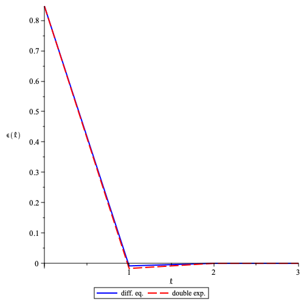

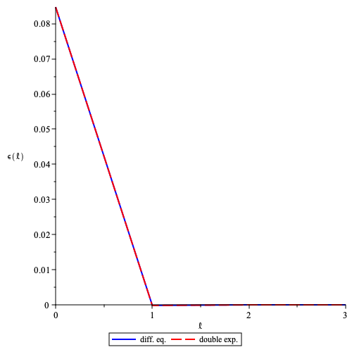

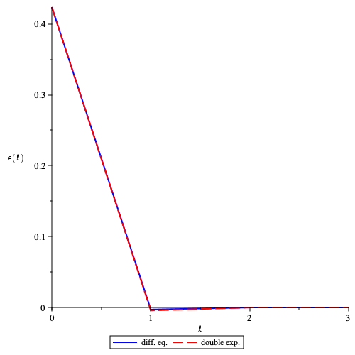

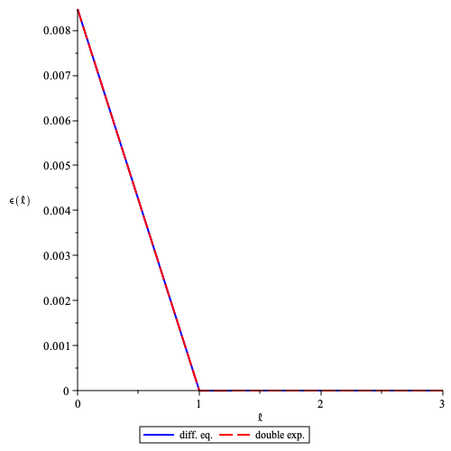

The difference between average (normalised) stake at epoch $\ell$ and its equilibrium value $`\epsilon(\ell)=\langle \overline{D}_{\ell}\rangle-\frac{\log(1-f)}{\log(1-f/q)}`$ plotted as a function of $\ell$ for $f=1/30$ and $q=0.85$. The solid (red) line is  the solution of the [difference equation](#stability-condition-derivation) using [optimal learning rate](#convergence-speed-and-optimal-learning-rate-derivation) and the dashed (blue) line is the [double exponential](#convergence-speed-and-optimal-learning-rate-derivation). Here for $\log(1-f)/\log(1-f/q)\approx0.847$ and  $`\epsilon(0)\in \{2\times0.847,0.847/2,0.847/10,0.847/100\}`$ (top left, top right, bottom left, bottom right) the $\epsilon(1)$ is, respectively, of order $`\{10^{-2} , 10^{-3}, 10^{-4} , 10^{-6}\}`$.

# Annex

## Why Use Total Active Stake instead of Total Supply

Rather than inferring total stake participating in consensus, we could conceivably relativize stake values for the leadership election by dividing by total supply. A good way to analyze this possibility is by using metrics from Cardano. As of January 23, 2023, there are **22.81B** ADA staked vs. a total supply of **36.56B**, meaning that ~62% of ADA is staked.

For a sense of how using total supply would affect block proposal rates in Cardano, consider the simple case where one validator controls all the stake. In this scenario, the ratio of the probability of producing a block when relativized with total supply compared to with total stake is

$$
\frac{\phi_f\left(\frac{22.81}{36.56}\right)}{\phi_f\left(\frac{22.81}{22.81}\right)} \simeq \frac{\phi_f(0.62)}{\phi_f(1)} \simeq \frac{\phi_f(0.62)}{f}\simeq0.62 \quad \text{for } f = 1/30
$$

In other words, roughly a 40% suppression in occupied slots. This goes against Cryptarchia’s target of maintaining an average of $`f`$ occupied slots (i.e. roughly $`\frac{1}{f}`$ seconds between blocks).

Additionally, since we do not adjust our block production rate to compensate for variable participation, we can expect to see fluctuations in block production rates as the percentage of participation changes. This can lead to uncertain finality times, making it difficult to maintain the epoch schedule.

## Prior Work

### DarkFi

An earlier version of DarkFi also implemented Crypsinous and ran into the same problem. Their solution was to use a Proportional-Integral-Derivative (PID) controller to control the block rate:

> A discrete PID controller has been implemented to stabilize the leader selection frequency. In simple terms, the controller is auto-tuning to produce a single leader per slot as often as possible. [DarkFi Testnet v0.1 alpha](https://dark.fi/insights/testnet-v1a.html)

This has several problems:

- Ouroboros Praos and its successors, including Crypsinous and Cryptarchia, deliberately select a small active slot coefficient $`f`$ to ensure there is sufficient time for blocks to propagate across the network before the next slot is activated. If $`f`$ were set higher—such that nearly every slot was expected to be filled—there would be insufficient time for block dissemination, leading to a significant increase in blockchain forks. This design choice is fundamental to maintaining network stability and minimizing chain splits in these protocols.

- The PID controller in the earlier DarkFi implementation was used to dynamically adjust the active slot coefficient $`f`$ in an attempt to regulate block production rates. However, in protocols like Praos, Genesis, and Crypsinous, $`f`$ is a critical security parameter that must remain fixed for the underlying security proofs to hold. Dynamically changing $`f`$ undermines these proofs and could compromise protocol guarantees. Therefore, $`f`$ should be held constant rather than tuned by a PID controller *during protocol execution*.

- PID is a heavy tool for the job. It requires careful tuning to system dynamics in order for the PID to behave optimally and modelling the system well enough is difficult.

## Bibliography

1. Ortega JM. [Stability of difference equations and convergence of iterative processes](https://epubs.siam.org/doi/abs/10.1137/0710026). SIAM Journal on Numerical Analysis. 1973 Apr; 10(2): 268-82.

1. DarkFi: anonymous, uncensored, sovereign. 2021 [cited 2025 Aug 9]. Available from: [https://dark.fi/](https://dark.fi/)

1. David B, Gaži P, Kiayias A, Russell A. [Ouroboros Praos: An adaptively-secure, semi-synchronous proof-of-stake protocol](https://eprint.iacr.org/2017/573). EUROCRYPT 2018.

1. Kerber T, Kohlweiss M, Kiayias A, Zikas V. [Ouroboros Crypsinous: Privacy-preserving proof-of-stake.](https://eprint.iacr.org/2018/1132) IEEE Symposium on Security and Privacy 2019 .

## Covariance Identities

- Let us consider $`\mathrm{Var}[Y-X\vert Y]`$, where $`Y`$ is a random variable and $`X\vert Y`$ is a random variable conditional on $`Y`$, as follows

$$
\mathrm{Var}[Y-X\vert Y]=\langle(Y-X\vert Y)^2\rangle-\langle(Y-X\vert Y)\rangle^2\\\quad =\langle Y^2\rangle-2\langle YX\vert Y\rangle+\langle(X\vert Y)^2\rangle\\\quad -\left(\langle Y\rangle^2-2\langle Y\rangle \langle X\vert Y\rangle+\langle X\vert Y\rangle^2\right)\\\quad =\mathrm{Var}[Y]-2\,\mathrm{Cov}[Y,X\vert Y]+\mathrm{Var}[X\vert Y]
$$

- Hence

$$
\boxed{\mathrm{Var}[Y-X\vert Y]=\mathrm{Var}[Y]-2\,\mathrm{Cov}[Y,X\vert Y]+\mathrm{Var}[X\vert Y]}
$$

- The covariance $`\mathrm{Cov}[Y,X\vert Y]`$ can be computed as follows

$$
\mathrm{Cov}[Y,X\vert Y]=\langle YX\vert Y\rangle-\langle Y\rangle \langle X\vert Y\rangle\\\quad =\sum_{y,x}\mathrm{P}(y,x)\,y\,x\vert y-\langle Y\rangle\sum_{y,x}\mathrm{P}(y,x)x\vert y\\\quad =\sum_{y}\mathrm{P}(y)\,y\,\sum_{x}\mathrm{P}(x\vert y)\,x\vert y\\\quad -\langle Y\rangle\sum_{y}\mathrm{P}(y)\,\sum_{x}\mathrm{P}(x\vert y)\,x\vert y
$$

and hence

$$
\boxed{\mathrm{Cov}[Y,X\vert Y]=\sum_{y}\mathrm{P}(y)\,y\,\sum_{x}\mathrm{P}(x\vert y)\,x\vert y-\langle Y\rangle\sum_{y}\mathrm{P}(y)\,\sum_{x}\mathrm{P}(x\vert y)\,x\vert y}
$$

- The variance $`\mathrm{Var}[X\vert Y]`$ can be computed as follows

$$
\mathrm{Var}[X\vert Y]=\langle (X\vert Y)^2\rangle- \langle X\vert Y\rangle^2\\\quad =\sum_{y,x}\mathrm{P}(y,x)\,(x\vert y)^2-\left(\sum_{y,x}\mathrm{P}(y,x)x\vert y\right)^2\\\quad =\sum_{y}\mathrm{P}(y)\,\sum_{x}\mathrm{P}(x\vert y)\,(x\vert y)^2\\\quad -\left(\sum_{y}\mathrm{P}(y)\,\sum_{x}\mathrm{P}(x\vert y)\,x\vert y\right)^2
$$

and hence

$$
\boxed{\mathrm{Var}[X\vert Y]=\sum_{y}\mathrm{P}(y)\,\sum_{x}\mathrm{P}(x\vert y)\,(x\vert y)^2-\left(\sum_{y}\mathrm{P}(y)\,\sum_{x}\mathrm{P}(x\vert y)\,x\vert y\right)^2}
$$

## Cryptarchia Metrics

The following plot shows various metrics from Cryptarchia as we run the total stake inference protocol. We can see that the total stake inference protocol is able to control the honest chain growth to maintain a growth rate of $`f`$ blocks/slot, the side-effect of this is an increased block production rate, more active slots and an underestimation of total stake.

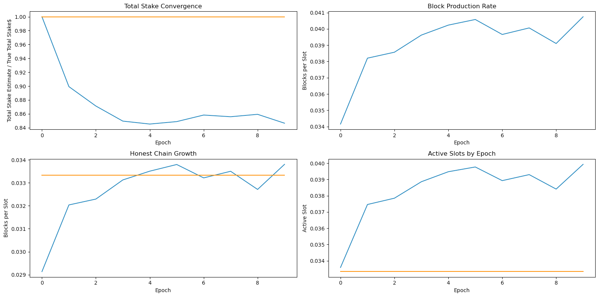

> Parameters: $`f=1/30`$, and $`\beta=0.8`$; Logos Blockchain blend network: 3 hops, 2-second per‑hop delay, 6-second mean end‑to‑end network delay. The yellow horizontal lines show the ideal values for each metric given a perfect network (no block delay).

## Simulation Code

[cryptarchia-with-total-stake-inference.ipynb](https://github.com/logos-co/nomos-pocs/blob/master/cryptarchia/cryptarchia-with-total-stake-inference.ipynb)
