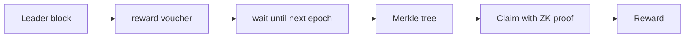

# ANONYMOUS-LEADERS-REWARD-PROTOCOL

| Field | Value |
| --- | --- |
| Name | Anonymous Leaders Reward Protocol |
| Slug | 85 |
| Status | raw |
| Category | Standards Track |
| Editor | Thomas Lavaur <thomaslavaur@logos.co> |
| Contributors | David Rusu <davidrusu@logos.co>, Mehmet Gonen <mehmet@logos.co>, Álvaro Castro-Castilla <alvaro@logos.co>, Frederico Teixeira <frederico@logos.co>, Filip Dimitrijevic <filip@logos.co> |

<!-- timeline:start -->

## Timeline

- **2026-05-27** — [`b7602ed`](https://github.com/logos-co/logos-lips/blob/b7602ed8a225d41ca0bfaaa432524dc84d2ded7e/docs/blockchain/raw/bedrock-anonymous-leaders-reward.md) — chore: move blockchain specs from notion to github
- **2026-05-18** — [`58b5698`](https://github.com/logos-co/logos-lips/blob/58b56988429f4d69a9e10a9fc118725e229e37c5/docs/blockchain/raw/bedrock-anonymous-leaders-reward.md) — chore(blockchain): migrate contributor emails to @logos.co (#338)
- **2026-01-19** — [`f24e567`](https://github.com/logos-co/logos-lips/blob/f24e567d0b1e10c178bfa0c133495fe83b969b76/docs/blockchain/raw/bedrock-anonymous-leaders-reward.md) — Chore/updates mdbook (#262)
- **2026-01-16** — [`89f2ea8`](https://github.com/logos-co/logos-lips/blob/89f2ea89fc1d69ab238b63c7e6fb9e4203fd8529/docs/blockchain/raw/bedrock-anonymous-leaders-reward.md) — Chore/mdbook updates (#258)

<!-- timeline:end -->

# Revision History

| **Version** | **Changes** | **Date** |
| --- | --- | --- |
| 1.0.0 | Initial revision. | 2026-03-30 |
| 1.1.0 | Round the leader share downwards and align the voucher commitment and nullifier domain separation tags with Mantle | 2026-08-05 |
| 1.1.1 | State the leader share of the epoch settlement, plus the epoch's Execution priority fees. | 2026-08-27 |

# Introduction

In many blockchain designs, leaders receive rewards for producing valid blocks. Traditionally, this reward is linked directly to the block or its producer, potentially opening the door to manipulation or self-censorship, where leaders may avoid including certain transactions or messages out of fear of retaliation or reputational harm. As the Logos Blockchain must protect its nodes and ensure that they do not need to engage in self-censorship, we must design a reward mechanism that preserves the anonymity of block leaders while maintaining correctness and preventing double rewards.

This document specifies the mechanism for anonymous reward distribution based on voucher commitments, nullifiers, and zero-knowledge (ZK) proofs. The goal is to ensure that block leaders can claim their rewards without linking them to specific blocks and without revealing their identities.

# Overview

The protocol introduces a concept of *vouchers* to unlink the block reward claim from the block itself. Instead of directly crediting themselves in the block, leaders include a commitment (a zkhash in this protocol) to a secret voucher. These commitments are gathered into a Merkle tree. In the first block of an epoch, we add all vouchers from the previous epoch to the voucher Merkle tree, accumulating the vouchers together in a set and guaranteeing a minimal anonymity set. Leaders may anonymously claim their reward using a ZK proof later, proving the ownership of their voucher. This is summarized in the following diagram:



By anonymizing the identity of block leaders at the time of reward claiming, the protocol removes any direct link between block production and the recipient of the reward. This is essential to prevent self-censorship behaviors. With anonymous claiming, leaders are free to act honestly according to protocol rules without concern for external consequences, thus improving the overall neutrality and robustness of the network.

Key properties of the protocol:

- **Anonymity**: Block rewards are unlinkable to the blocks they originate from (avoiding deanonymization).
- **Soundness**: No reward can be claimed twice.

In parallel, the blockchain maintains the value `leaders_rewards` accumulating the rewards for leaders over time. Two streams credit it, both epoch by epoch: the leader share $`\Pi^{leader}_e`$ of the epoch settlement defined in [Block Rewards](block-rewards.md), which is 40% of the pooled Execution base fees, Permanent Storage fees and reserve release; and the Execution priority fees of the epoch in full, which take no Blend share (cf. [Execution Market](execution-market.md)). Each voucher included in the Merkle tree represents the same share of `leaders_rewards`. Just like for voucher inclusion, more rewards are added to this variable on an epoch-by-epoch basis, which guarantees a stable and equal claimable reward for leaders over an epoch.

# Protocol

## Voucher creation and inclusion

When producing a block, a leader performs the following:

1. Generate a one-time random secret $`voucher \overset{\$}{\leftarrow} \mathbb F_p`$.
2. Compute the commitment:
```python
voucher_cm = zkhash(
    FiniteField(b"REWARD_VOUCHER", byte_order="little", modulus= p),
    voucher)
```
3. Include the `voucher_cm` in the block header.

Each `voucher_cm` is added to a Merkle tree of voucher commitments by validators during the execution of the first block of the following epoch, maintained throughout the entire blockchain history by everyone.

## Claiming the reward

### Protocol

Each leader may submit a [LEADER_CLAIM](bedrock-v1.1-mantle-specification.md#leader_claim) Operation to claim their reward. This Operation includes:

- The Merkle root of the global voucher set when the Mantle Transaction containing the claim is submitted.
- A [Proof of Claim](bedrock-v1.1-mantle-specification.md#proof-of-claim).

This Operation increases the balance of a Mantle Transaction by the leader reward amount, letting the leader move the funds as desired through the Ledger transaction or another Operation.

  This means that a leader may use their funds directly, getting their reward and using them atomically.

Note that every leader will receive a reward that is independent of the block content to avoid de-anonymization. This means that the fees of the block cannot be collected by the leader directly, and are pooled for all the leaders instead. This applies to the priority fee as much as to the base fee: paying a tip to the proposer in its own block would tie the amount received to that block's contents and defeat the unlinkability this protocol provides.

### Leaders Reward

At the start of epoch **N+1**, validators aggregate the leaders rewards of epoch **N**, that is $`\Pi^{leader}_N`$ together with the Execution priority fees of that epoch, into the leader rewards variable. The amount of the reward claimable with a voucher corresponds to a share of the `leaders_rewards`. This share is equal to the total value of rewards divided by the size of the anonymity set of leaders, rounded down, that is:

$$
share = \begin{cases}
  0 &\textbf{if } |voucher\_cm|=|voucher\_nf| \\
\left\lfloor\frac{leader\_rewards}{|voucher\_cm| - |voucher\_nf|}\right\rfloor &\textbf{if } |voucher\_cm| \neq |voucher\_nf|
\end{cases}
$$

The division is the integer division over `TokenValue`, so the share is a whole number of tokens and its computation is deterministic for every node. Rounding down guarantees that $`share \times (|voucher\_cm| - |voucher\_nf|) \leq leader\_rewards`$, an inequality that every claim preserves since it decreases both sides by one share and one voucher respectively. The pool can therefore never be overdrawn and every unclaimed voucher remains payable.

This amount is almost stable through an epoch because when a leader withdraws, both the pool value and the number of unclaimed vouchers decrease proportionally, so the exact price per share remains unchanged and only its rounding may move. Writing $`leader\_rewards = q \times n + r`$ at the start of the epoch, where $`n`$ is the number of unclaimed vouchers and $`r < n`$ the remainder of the division, the first $`n-r`$ leaders to claim receive $`q`$ and the last $`r`$ receive $`q+1`$. Two leaders claiming during the same epoch therefore never differ by more than one token, which is small enough not to justify freezing the share for the duration of the epoch. Nothing is lost to the rounding either: the remainder stays in `leader_rewards` until it is claimed or aggregated with the rewards of the next epoch. The marginally larger reward of the late claimants also mildly encourages leaders to spread their claims over time, which keeps the set of unclaimed vouchers large. However, the share value will vary across epochs if the leader rewards are variable.

## Validation

Nodes validate a `LEADER_CLAIM` Operation by:

1. Verifying the ZK proof.
2. Checking that `voucher_nf` is not already in the voucher nullifier set.
3. Executing the reward logic:
  - Add the `voucher_nf` to the voucher nullifier set to prevent claiming the same reward more than once.
  - Increase the balance of the Mantle Transaction by the share amount.
  - Decrease the value of the `leaders_rewards` by the same amount.

# Details

## Unlinking Block Rewards from Proposals

Each reward voucher is a cryptographic commitment derived from a voucher secret. This commitment, when included in the block header, reveals no information about the block producer's identity or the actual secret voucher. It is computationally infeasible to reverse the commitment to retrieve the voucher secret.

Crucially, when the leader reward is claimed and the voucher nullifier revealed, a third party cannot link this nullifier to the initial voucher commitment. A reward is claimable if its reward voucher is in the reward voucher set and its voucher nullifier is not in the voucher nullifier set.

The reward voucher set will be maintained as a Merkle tree of depth 32, and validators will be required to hold the frontier of the MMR in memory to continue appending to the set. The voucher nullifier set will be maintained as a searchable database.

## ZK Proof of Membership

When claiming a reward, the leader provides a ZK proof that they know a leaf in the global Merkle tree of reward vouchers and the preimage of that leaf. Crucially, the ZK proof does not reveal which leaf is being proven. The verifier only learns that *some* valid leaf exists in the tree for which the prover knows the secret voucher. This property ensures that the claim cannot be linked to any specific block header or reward voucher commitment.

## Preventing Double Claims Without Breaking Privacy

To prevent double claiming, the leader derives a voucher nullifier from the same secret voucher:

```python
voucher_nf = zkhash(
    FiniteField(b"VOUCHER_NF", byte_order="little", modulus= p),
    voucher)
```

This nullifier is unique to the voucher but reveals nothing about the original reward voucher or block. It acts as a one-way identifier that allows nodes to track whether a voucher has already been claimed, without compromising the anonymity of the claim.
