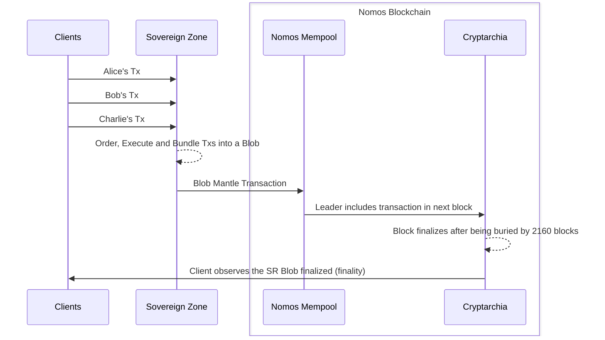

# BEDROCK-ARCHITECTURE-OVERVIEW

| Field | Value |
| --- | --- |
| Name | Bedrock Architecture Overview |
| Slug | |
| Status | raw |
| Category | Informational |
| Editor | David Rusu <davidrusu@status.im> |
| Contributors | Álvaro Castro-Castilla <alvaro@status.im>, Daniel Kashepava <danielkashepava@status.im>, Filip Dimitrijevic <filip@status.im> |

## Abstract

Bedrock enables high-performance Sovereign Rollups
to leverage the security guarantees of Nomos.
Sovereign Rollups build on Nomos through Bedrock Mantle,
Bedrock's minimal execution layer which in turn runs on Cryptarchia,
the Nomos consensus protocol.
Taken together, Bedrock provides a private, highly scalable,
and resilient substrate for high-performance decentralized applications.

**Keywords:** Bedrock, Sovereign Rollups, Mantle, Cryptarchia, channels,
NomosDA, Blend Network, consensus, privacy

## Semantics

The keywords "MUST", "MUST NOT", "REQUIRED", "SHALL", "SHALL NOT",
"SHOULD", "SHOULD NOT", "RECOMMENDED", "MAY", and "OPTIONAL"
in this document are to be interpreted as described in [RFC 2119][rfc-2119].

### Definitions

| Terminology | Description |
| ----------- | ----------- |
| Bedrock | The foundational layer of Nomos composed of Cryptarchia and Bedrock Mantle. |
| Mantle | The minimal execution layer of Nomos for Sovereign Rollups. |
| Cryptarchia | The Nomos consensus protocol, a Private Proof of Stake (PPoS) protocol. |
| Sovereign Rollup | A virtual chain overlaid on top of the Nomos blockchain. |
| Channel | A permissioned, ordered log of messages forming a virtual chain. |
| Inscription | A channel message stored permanently in the ledger. |
| Blob | A channel message with only a commitment stored on-chain; data stored in NomosDA. |
| NomosDA | The Data Availability layer providing temporary storage for Blob data. |
| Blend Network | A privacy-preserving network layer for routing block proposals. |

## Background

Bedrock is composed of Cryptarchia and Bedrock Mantle.
Bedrock is in turn supported by the Bedrock Services: Blend Network and NomosDA.
Together they provide an interface for building high-performance Sovereign Rollups
that leverage the security and resilience of Nomos.

```text
┌─────────────┐   ┌──────────────────────┐   ┌─────────────────────────────────────────┐
│   Clients   │   │    Sovereign Zone    │   │            Nomos Blockchain             │
├─────────────┤   ├──────────────────────┤   ├───────────────────┬─────────────────────┤
│             │   │                      │   │      Bedrock      │      Services       │
│   Alice   ──┼──>│   DeFi Exchange SZ   │   │    ┌─────────┐    │  ┌───────────────┐  │
│             │   │                      │   │    │ Mantle  │<───┼──│ Blend Network │  │
│   Bob     ──┼──>│   Land Registry SZ   │──>│    └────┬────┘    │  └───────────────┘  │
│             │   │                      │   │         │         │                     │
│   Charlie ──┼──>│ Prediction Market SZ │   │         v         │                     │
│             │   │                      │   │  ┌─────────────┐  │                     │
└─────────────┘   └──────────────────────┘   │  │ Cryptarchia │  │                     │
                                             │  └──────┬──────┘  │                     │
                                             └─────────┼─────────┴─────────────────────┘
                                                       │
                                          ┌────────────┼────────────┐
                                          │            │            │
                                          v            v            v
                                     ┌────────┐  ┌────────┐  ┌────────┐
                                     │ Node_1 │  │ Node_2 │  │ Node_3 │
                                     └────────┘  └────────┘  └────────┘
```

## Bedrock Mantle

Mantle forms the minimal execution layer of Nomos.
Mantle Transactions consist of a sequence of Operations
together with a Ledger Transaction used for paying fees and transferring funds.

```text
┌─────────────────────────────────┐
│       Mantle Transaction        │
├─────────────────────────────────┤
│  Operations                     │
│  ┌───────────────────────────┐  │
│  │   CHANNEL_DEPOSIT(...)    │  │
│  ├───────────────────────────┤  │
│  │   CHANNEL_INSCRIBE(...)   │  │
│  ├───────────────────────────┤  │
│  │          ...              │  │
│  └───────────────────────────┘  │
├─────────────────────────────────┤
│       Ledger Transaction        │
└─────────────────────────────────┘
```

Sovereign Rollups make use of Mantle Transactions
when posting their updates to Nomos.
This is done through the use of Mantle Channels and Channel Operations.

### Mantle Channels

Mantle Channels are lightweight virtual chains
overlaid on top of the Nomos blockchain.
Sovereign Rollups are built on top of these channels,
allowing them to outsource the hard parts of running a decentralized service to Nomos,
namely ordering and replicating state updates.

Channels are permissioned, ordered logs of messages.
These messages are signed by the Channel owner
and come in two types: Inscriptions or Blobs.
Inscriptions store the message data permanently in-ledger,
while Blobs store only a commitment to the message data permanently.
The actual message data is stored temporarily in NomosDA,
just long enough for interested parties to fetch a copy for themselves.

```text
┌───────────┐   ┌──────────────────┐   ┌───────────┐
│ Channel A │   │ Nomos Blockchain │   │ Channel B │
├───────────┤   ├──────────────────┤   ├───────────┤
│    A_3    │   │     Block_6    <─┼───│    B_4    │
│     │     │   │       │          │   │     │     │
│     v     │   │       v          │   │     v     │
│    A_2    │   │     Block_5      │   │    B_3    │
│     │     │   │       │          │   │     │     │
│     v     │──>│       v          │   │     v     │
│    A_1    │   │     Block_4    <─┼───│    B_2    │
│           │   │       │          │   │     │     │
│           │   │       v          │   │     v     │
│           │   │     Block_3      │   │    B_1    │
│           │   │       │          │   │           │
│           │   │       v          │   │           │
│           │   │     Block_2      │   │           │
│           │   │       │          │   │           │
│           │   │       v          │   │           │
│           │   │     Block_1      │   │           │
└───────────┘   └──────────────────┘   └───────────┘
```

Channels A and B form virtual chains on top of the Nomos blockchain.
Channel messages are included in blocks on the Nomos blockchain
in such a way that they respect the ordering of channel messages.
For example, $B_4$ MUST come after $B_3$ in the Nomos blockchain.

### Transient Blobs

The fact that Blobs are stored only temporarily in NomosDA
allows Nomos to provide cheap, temporary storage for Sovereign Rollups
without incurring long-term scalability concerns.
The network can serve a large amount of data
without the risk of bloating with obsolete data after years of operations.

At the same time, the transient nature of Blobs
shifts the burden of long-term replication from the Nomos Network
to the parties interested in that Blob data—
that is, the Sovereign Rollup operators, their clients,
and other interested parties (archival nodes, block explorers, etc.).
So long as at least one party holds a copy of a Blob
and is willing to provide it to the network,
the Sovereign Rollup can continue to be verified
by checking provided Blobs against their corresponding on-chain Blob commitments,
which are stored permanently on the Nomos blockchain.

## Cryptarchia

Bedrock Mantle is powered by [Cryptarchia][cryptarchia],
a highly scalable, permissionless consensus protocol
optimized for privacy and resilience.
Cryptarchia is a Private Proof of Stake (PPoS) consensus protocol
with properties very similar to Bitcoin.
Just like in Bitcoin, where a miner's hashing power is not revealed when they win a block,
Cryptarchia ensures privacy for block proposers
by breaking the link between a proposal and its proposer.
Unlike Bitcoin, Nomos extends block proposer confidentiality to the network layer
by routing proposals through the Blend Network,
making network analysis attacks prohibitively expensive.

## Sovereign Rollups

Sovereign Rollups bridge the gap between traditional server-based applications
and decentralized, permissionless applications.

Sovereign Rollups alleviate the contention
caused by decentralized applications competing
for the limited resources of a single-threaded VM (e.g., EVM in Ethereum)
while still remaining auditable and fault tolerant.
This is achieved through shifting transaction ordering and execution
off of the main chain into Sovereign Rollup nodes,
with Sovereign Rollup nodes posting only a state diff or batch of transactions
to Nomos as an opaque data Blob.

### Transaction Flow

```text
┌─────────────┐   ┌─────────────────────────────────────────────┐   ┌──────────────────┐
│   Clients   │   │              Sovereign Zone                 │   │ Nomos Blockchain │
├─────────────┤   ├──────────────┬──────────────────────────────┤   ├──────────────────┤
│             │   │  Sequencer   │        Inscription           │   │                  │
│   Alice   ──┼──>│              │   ┌──────────────────────┐   │   │                  │
│             │   │  Orders Txs  │   │      tx_Alice        │   │   │                  │
│   Bob     ──┼──>│      │       │   ├──────────────────────┤   │   │  Bedrock Mantle  │
│             │   │      v       │   │      tx_Bob          │──>│──>│                  │
│   Charlie ──┼──>│  Bundle Txs  │   ├──────────────────────┤   │   │                  │
│             │   │              │   │      tx_Charlie      │   │   │                  │
│             │   │              │   └──────────────────────┘   │   │                  │
└─────────────┘   └──────────────┴──────────────────────────────┘   └──────────────────┘
```

The following sequence describes the flow of transactions
from clients through a Sovereign Rollup to finality on Nomos:

1. Clients submit transactions to the Sovereign Rollup.

1. The Sovereign Rollup orders, executes,
   and bundles the transactions into a Blob.

1. The Sovereign Rollup submits the Blob Mantle Transaction
   along with DA Shares to NomosDA.

1. NomosDA begins replicating the Blob
   and forwards the Blob Mantle Transaction to the Nomos Mempool.

1. A leader includes the transaction in the next block via Cryptarchia.

1. NomosDA observes the Blob inclusion on-chain (Blob confirmed).

1. The client observes their transaction
   in a Sovereign Rollup Blob included in Nomos (weak confirmation).

1. The block finalizes after being buried by 2160 blocks.

1. The client observes the Sovereign Rollup Blob finalized (finality).



### Architecture Benefits

Sovereign Rollups form a virtual chain overlaid on top of the Nomos blockchain.
This architecture allows application developers
to easily spin up high-performance applications
while taking advantage of the security of Nomos
to distribute the application state widely for auditing and resilience purposes.

## References

### Normative

- [NOMOS-CRYPTARCHIA-V1-PROTOCOL][cryptarchia] - Cryptarchia consensus protocol specification
- [BEDROCK-V1.1-MANTLE-SPECIFICATION][mantle] - Mantle Transaction and Operation specification

### Informative

- [Bedrock Architecture Overview][origin-ref] - Original architecture overview document

[rfc-2119]: https://www.ietf.org/rfc/rfc2119.txt
[cryptarchia]: ../raw/nomos-cryptarchia-v1-protocol.md
[mantle]: ../raw/bedrock-v1.1-mantle-specification.md
[origin-ref]: https://nomos-tech.notion.site/Bedrock-Architecture-Overview-1fd261aa09df8112918df709898a8fa3

## Copyright

Copyright and related rights waived via [CC0](https://creativecommons.org/publicdomain/zero/1.0/).
