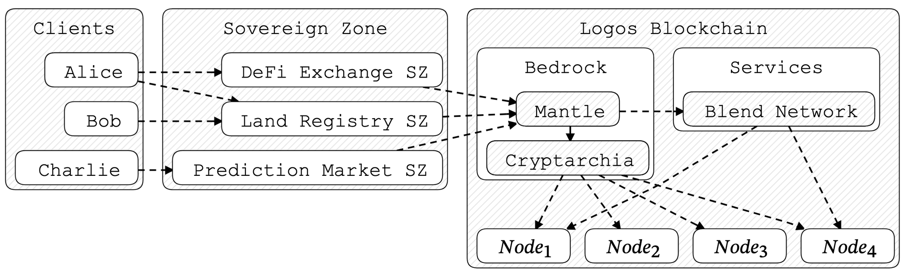
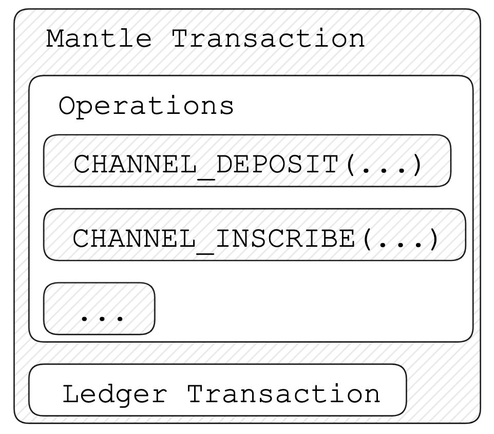
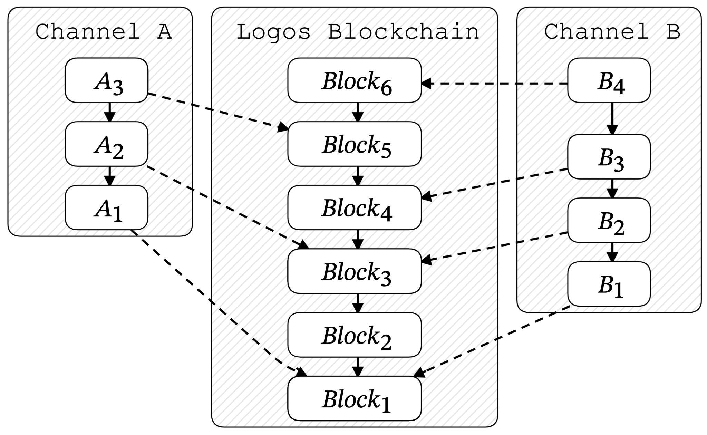
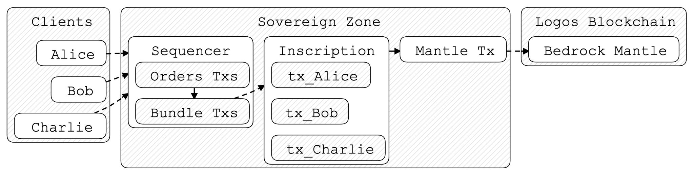
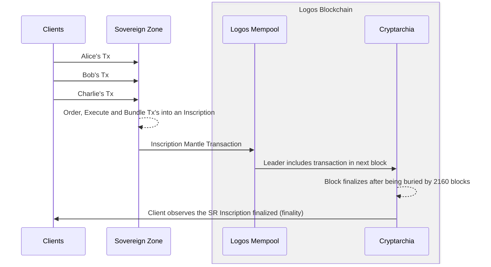

# OVERVIEW-BEDROCK-ARCHITECTURE

| Field | Value |
| --- | --- |
| Name | [Overview] Bedrock Architecture |
| Slug | 146 |
| Status | raw |
| Category | Informational |
| Editor | David Rusu <davidrusu@logos.co> |
| Contributors | Álvaro Castro-Castilla <alvaro@logos.co>, Daniel Kashepava <danielkashepava@logos.co>, Filip Dimitrijevic <filip@logos.co> |

<!-- timeline:start -->

## Timeline

- **2026-05-27** — [`b7602ed`](https://github.com/logos-co/logos-lips/blob/b7602ed8a225d41ca0bfaaa432524dc84d2ded7e/docs/blockchain/raw/bedrock-architecture-overview.md) — chore: move blockchain specs from notion to github
- **2026-05-18** — [`58b5698`](https://github.com/logos-co/logos-lips/blob/58b56988429f4d69a9e10a9fc118725e229e37c5/docs/blockchain/raw/bedrock-architecture-overview.md) — chore(blockchain): migrate contributor emails to @logos.co (#338)
- **2026-01-30** — [`0ef87b1`](https://github.com/logos-co/logos-lips/blob/0ef87b1ba9491c854e48c8dfd7574d34ec69c704/docs/blockchain/raw/bedrock-architecture-overview.md) — New RFC: CODEX-MANIFEST (#191)
- **2026-01-30** — [`5c123d6`](https://github.com/logos-co/logos-lips/blob/5c123d6b676be36053d5d9b9d67bb757138c2ace/docs/blockchain/raw/bedrock-architecture-overview.md) — Nomos/raw/bedrock architecture overview raw (#257)

<!-- timeline:end -->

# Revision History

| **Version** | **Changes** | **Date** |
| --- | --- | --- |
| 1.0.0 | Initial revision. | 2025-08-22 |
| 1.1.0 | Remove references to DA Replace Nomos with Logos Blockchain | 2026-01-14 |

# Introduction

Bedrock enables high-performance Sovereign Zones to leverage the security guarantees of Logos. Sovereign Zones build on the Logos Blockchain through Mantle, Bedrock’s minimal execution layer which in turn runs on Cryptarchia, Logos' consensus protocol. Taken together, Bedrock provides a private, highly scalable and resilient substrate for high-performance decentralized applications.

# Overview

Bedrock is composed of Cryptarchia and Bedrock Mantle. Bedrock is in turn supported by the Bedrock Services such as the Blend Network. Together, they provide an interface for building high performance Sovereign Zones that leverage the security and resilience of Logos.

## Bedrock Mantle

    Mantle forms the minimal execution layer of the Logos Blockchain. Mantle Transactions consist of a sequence of Operations together with a Ledger Transaction used for paying fees and transferring funds.

    Sovereign Zones make use of Mantle Transactions when posting their updates to Bedrock. This is done through the use of Mantle channels and channel Operations.

### Mantle Channels

    Mantle channels are lightweight virtual chains overlaid on top of the Logos Blockchain. Sovereign Zones are built on top of these channels, allowing them to outsource the hard parts of running a decentralized application to Logos, namely ordering and replicating state updates.

    Channels are permissioned, ordered logs of messages. These messages, known as Inscriptions, are signed by an authorized party known as the sequencer,  storing the message data permanently in-ledger. A Mantle channel can support several authorized sequencers, who share the right to post messages to that channel. In this case, the parties take turns acting as sequencers in a round-robin fashion.

> Channels A and B form virtual chains on top of the Logos Blockchain. Channel messages are included in blocks on the Logos Blockchain in such a way that they respect the ordering of channel messages e.g. $B_4$ must come after $B_3$ in the Logos Blockchain.

Channel messages can be used by Sovereign Zone sequencers to asynchronously communicate and coordinate actions amongst themselves. This could include planning cross-Zone transactions that affect the state of several Zones, or agreeing to modify a channel's properties.

Every Mantle channel also has an associated token balance. This balance allows users to bridge tokens from Bedrock to Sovereign Zones and vice versa. Channel balances also facilitate atomic token transfers between several Sovereign Zones.

## Cryptarchia

Bedrock Mantle is powered by the [[1.0.2] Cryptarchia Protocol](cryptarchia-v1-protocol.md), a highly scalable, permisionless consensus protocol optimized for privacy and resilience. Cryptarchia is a Private Proof of Stake (PPoS) consensus protocol with properties very similar to Bitcoin. Just like in Bitcoin, where a miner’s hashing power is not revealed when they win a block, we ensure privacy for block proposers by breaking the link between a proposal and its proposer. Unlike Bitcoin, the Logos Blockchain extends block proposer confidentiality to the network layer by routing proposals through the Blend Network, making network analysis attacks prohibitively expensive.

## Sovereign Zones

Sovereign Zones bridge the gap between traditional server-based applications and decentralized, permissionless applications.

Sovereign Zones alleviate the contention caused by decentralized applications competing for the limited resources of a single threaded VM (e.g. EVM in Ethereum) while still remaining auditable and fault tolerant. This is achieved through shifting transaction ordering and execution off of the main chain into SZ sequencer nodes, with SZ sequencers posting only a state diff or batch of transactions to Bedrock as an Inscription.

```mermaid
sequenceDiagram
    participant C as Clients

    participant SZ as Sovereign Zone

        box rgba(255,255,255,0.3) Logos Blockchain
            participant Mempool as Logos Mempool
            participant Cryptarchia
        end

    C->>SZ: Alice's Tx
    C->>SZ: Bob's Tx
    C->>SZ: Charlie's Tx
    SZ-->>SZ: Order, Execute and Bundle Tx's into an Inscription
    SZ ->> Mempool: Inscription Mantle Transaction
    Mempool ->> Cryptarchia: Leader includes transaction in next block
    Cryptarchia -->> Cryptarchia: Block finalizes after being buried by 2160 blocks
    Cryptarchia ->> C: Client observes the SR Inscription finalized (finality)
```

Sovereign Zones form a virtual chain overlaid on top of the Logos Blockchain. This architecture allows application developers to easily spin up high performance applications while taking advantage of the security of Logos to distribute the application state widely for auditing and resilience purposes.
