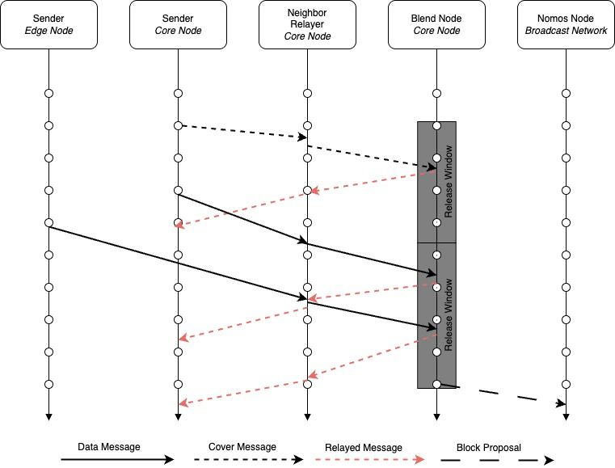
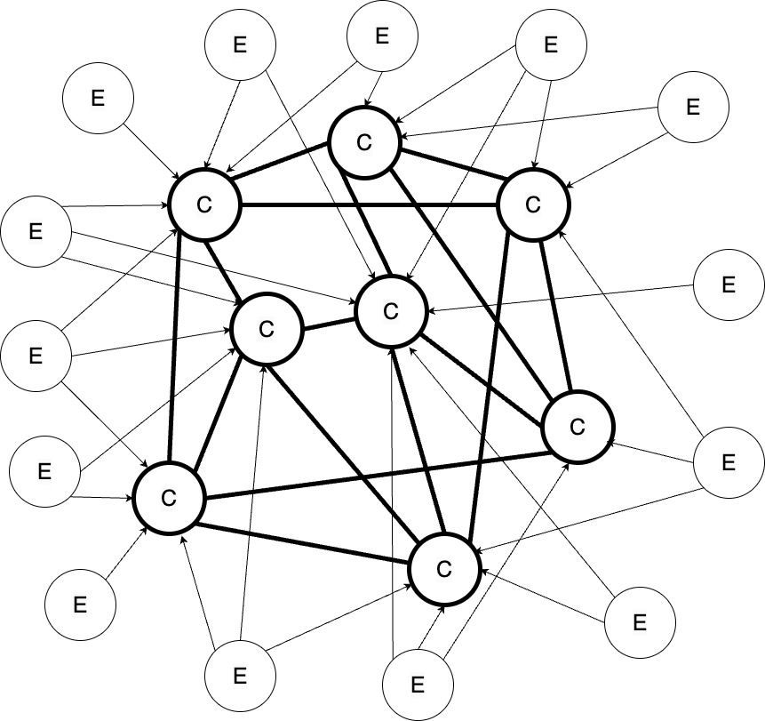
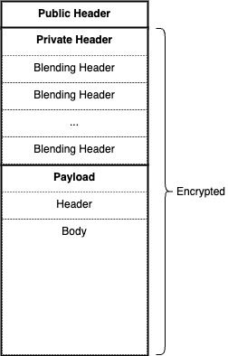

# BLEND-PROTOCOL

| Field | Value |
| --- | --- |
| Name | Blend Protocol |
| Slug | 95 |
| Status | raw |
| Category | Standards Track |
| Editor | Marcin Pawlowski <marcin@logos.co> |
| Contributors | Alexander Mozeika <alexander.mozeika@logos.co>, Youngjoon Lee <youngjoon@logos.co>, Frederico Teixeira <frederico@logos.co>, Mehmet Gonen <mehmet@logos.co>, Daniel Sanchez Quiros <danielsq@logos.co>, Álvaro Castro-Castilla <alvaro@logos.co>, Daniel Kashepava <danielkashepava@logos.co>, Thomas Lavaur <thomas@logos.co>, Antonio Antonino <antonio@logos.co>, Filip Dimitrijevic <filip@logos.co> |

<!-- timeline:start -->

## Timeline

- **2026-05-27** — [`b7602ed`](https://github.com/logos-co/logos-lips/blob/b7602ed8a225d41ca0bfaaa432524dc84d2ded7e/docs/blockchain/raw/blend-protocol.md) — chore: move blockchain specs from notion to github
- **2026-05-18** — [`58b5698`](https://github.com/logos-co/logos-lips/blob/58b56988429f4d69a9e10a9fc118725e229e37c5/docs/blockchain/raw/blend-protocol.md) — chore(blockchain): migrate contributor emails to @logos.co (#338)
- **2026-01-19** — [`f24e567`](https://github.com/logos-co/logos-lips/blob/f24e567d0b1e10c178bfa0c133495fe83b969b76/docs/blockchain/raw/blend-protocol.md) — Chore/updates mdbook (#262)
- **2026-01-16** — [`89f2ea8`](https://github.com/logos-co/logos-lips/blob/89f2ea89fc1d69ab238b63c7e6fb9e4203fd8529/docs/blockchain/raw/blend-protocol.md) — Chore/mdbook updates (#258)

<!-- timeline:end -->

# Revision History

| **Version** | **Changes** | **Date** |
| --- | --- | --- |
| 1.0.0 | Initial revision. | 2026-04-09 |
| 1.1.0 | [RFC] Remove Concept of a Session | 2026-06-22 |
| 1.1.1 | Updated the block proposal message size to 34574 bytes in the encapsulation-overhead calculation, following the addition of carried uncle headers in [Block Construction, Validation and Execution](bedrock-v1.1-block-construction.md). | 2026-08-06 |
| 1.1.2 | Denominated the encapsulation-overhead calculation against `Max_Payload_Length` (18195 bytes), the payload that is actually encapsulated, rather than the body it contains, following the compression of transaction references (see [Block Construction, Validation and Execution](bedrock-v1.1-block-construction.md)). | 2026-08-18 |
| 1.2.0 | Define the token evaluation under a low core quota, and specify the Active Message metadata layout. | 2026-08-19 |
| 1.2.1 | Pointed the `EpochNumber` of the activity proof at its definition in [Epoch](cryptarchia-v1-protocol.md#epoch) | 2026-08-25 |
| 1.3.0 | [RFC] Replace the BLAKE2b-Based PRNG with ChaCha20 (ChaCha20Rng) | 2026-08-28 |
| 1.3.1 | An Active Message points to a declaration by `zk_id` | 2026-09-01 |

# Introduction

The privacy of a Proof-of-Stake (PoS) system is defined by the inability of an adversary to learn:

1. Which node proposed a given block. This property is known as *unlinkability*.
2. How much stake a node has. This property is known as *stake* *privacy*.

While a node can be de-anonymized based on the content of its block proposals, this angle of attack is mitigated by Private Proof of Stake systems. However, a node can also be de-anonymized based on its network activity. An adversary can observe the node’s network behavior and link the node to the proposal it sends. Because a node’s relative stake correlates with its network activity in all PoS systems, observing a node’s behavior for some time enables the adversary to estimate the node’s stake. It is this network-based de-anonymization that is addressed by the Blend Protocol, allowing Logos Blockchain to achieve a truly Private PoS system.

The Blend Protocol is designed as **a way to allow nodes to send block proposals that cannot be linked back to them**. The idea is to make it very difficult and costly for someone trying to figure out who sent a proposal and what stake they hold. Because the protocol spreads messages out over many nodes, it becomes even harder to attack, which enhances network privacy. The Blend Protocol increases the time to link the sender to the proposal by at least $`300`$ times, which **makes the stake inference highly impractical** ([Impact of the Blend Protocol on the Time to Link and Time to Infer the Stake](#impact-of-the-blend-protocol-on-the-time-to-link-and-time-to-infer-the-stake)).

The Blend Protocol targets a specific set of requirements that differentiate it from mixnets and other general-purpose anonymous communication systems. It achieves probabilistic unlinkability in a highly decentralized environment with low bandwidth cost but high latency. It hides the sender of a block proposal, making it costly for an adversary to learn its origin with high confidence. The cost of attacking the network is high due to decentralization and the economic value of stake needed to add a single node. The protocol works well even when many nodes are involved and not much data is being sent, but it may take longer for proposals to be delivered.

In this document, we present a succinct description of the Blend protocol, which is responsible for providing censorship resistance and network-level privacy for the block producers of the Logos Blockchain Bedrock ([\[Overview\] Bedrock Architecture](bedrock-architecture-overview.md)), the foundational layer of Logos Blockchain.

## Privacy of Proof of Stake Systems

All Proof of Stake (PoS) systems have an inherent privacy problem — the stake of the node determines the node’s behavior. That is, by observing the node’s behavior (or impact of the node on the system), one can infer the node’s stake. More precisely, the stake that is discovered is relative to the stake involved in the PoS — stake that is used for the PoS purposes by the adversary. There are two things that can be observed:

- The content of the blocks.
- The network activity of the node.

Observing the content of the blocks makes it possible to execute a tagging attack. The consequence of a successful attack is that the stake of a node can be learned by controlling which transactions are included in the proposals built by the node. This is achieved by submitting a transaction only to the mempool of a targeted node — thus creating a difference in the transactions seen by this node compared to the other nodes — and observing the time when this transaction is included in the block.

The tagging attack can be addressed by designing a mempool in such a way that the node has an attestation that the transaction was seen by the majority of the network, which makes the adversary’s ability to manipulate the view of the node severely limited.

Observing the network activity of the node leads to an easier but still powerful attack that can also disclose the node stake even after the tagging attack is mitigated. That is, a node’s stake can be inferred by observing the frequency of the messages node emits during a particular portion of time — this attack is addressed by the Blend protocol.

The Blend protocol achieves network-level leader-proposal unlinkability with statistical indistinguishability. That is, a leader cannot be linked back to its proposal and cannot be distinguished from its peers based on its network behavior. This property translates into an increased difficulty of learning the node’s stake through the node’s network behavior.

To have a **truly privacy-preserving system, we need to apply both techniques simultaneously**. Solving one without the other will not suffice.

# Terminology

## Message Types

- *Data message* is a message generated by a node (consensus leader), whose payload contains a block proposal. Any data message is indistinguishable from any other message until it is fully processed by the network. The privacy of the sender of a data message is what the protocol aims to protect.
- *Cover message* is a message that contains meaningless content, and its goal is to create noise (anonymity pool) in which data messages can hide. The cover message is indistinguishable, from the network perspective, from a data message.

## Protocol Actors

- *Logos Blockchain node* is a node that is part of the Logos Blockchain network.
- *Core node* is a Logos Blockchain node that declared its willingness to participate in the Blend Network Service through the Service Declaration Protocol (SDP — [Service Declaration Protocol](bedrock-service-declaration-protocol.md)). The core node is responsible for core protocol functions such as cover message generation, message relaying, message processing, and message broadcasting. Additionally, the core node generates data messages that are *blended* with the rest of the messages generated by the network.
- *Edge node* is a Logos Blockchain node that is not a core node. Edge nodes connect to core nodes through which they send messages (block proposals).
- *Block proposer node* is a core or edge node that is generating a new data message.
- *Blend node* is a core node that processes a data or cover message.

## Node Types

- *Honest node* is a node that follows the protocol fully.
- *Lazy node* is a node that does not follow the protocol due to a lack of incentives and only takes part in the protocol when it is directly beneficial to the node.
- *Spammy node* is a node that does not follow the protocol and emits more messages than the protocol expects. In other words, it is a spamming node.
- *Unhealthy node* is a node that emits fewer messages than the protocol expects. We cannot assume that this node is misbehaving deliberately, as it can be under an attack.
- *Malicious node* is a node that does not follow the protocol regardless of incentives.
- *Unresponsive node* is a node that does not follow the protocol due to technical reasons, such as a lack of connectivity or malfunction.

## Adversary Types

- *Passive adversary* is an adversary that cannot modify the behavior of a node, but can only observe.
- *Active adversary* is an adversary that can modify the behavior of a node in addition to observing the network.
- *Local observer* is an passive adversary with a limited view of the network and with the ability to observe the internals of a limited number of nodes.

## Networking

- *Blending* is an operation of cryptographically transforming and randomly delaying messages. This shuffles the temporal order of incoming and outgoing messages so that they cannot be linked back to the sender based on the network statistical analysis or message content inspection. The key difference between blending and mixing (as defined in mixnets) is in the source of the anonymity. In mixing, the anonymity comes from processing multiple messages by the same node, while in blending the anonymity comes from processing the same message by multiple nodes.
- *Broadcasting* is the process of sending a data message payload (block proposal) to all Logos Blockchain nodes.
- *Disseminating* is the process of relaying messages by core nodes through the network to edge and core nodes.
- *Communication failure* is an event when a message that is disseminated through the network is not finally broadcast. The communication failure might be due to lazy, malicious, or unresponsive nodes.
- *Anonymity failure* is an event when an adversary can link the sender to the broadcast message.

## Time

- *Epoch* is a period that is defined by the consensus. It lasts for $`648,000`$ slots, each slot lasting 1 second. A new block is proposed for each slot with a probability of $`1/30`$, which translates to $`21,600`$ blocks, as on average, every $`30`$ slots a single block is proposed.
- *Round* is the primitive measure of time in the protocol. It defines a period during which a node can emit a new message. The definition of a round is also important for defining the message releasing logic, which handles the randomized emission delay for processed messages. In this version of the protocol, the length of the round is 1 second (an equivalent of a single slot).

# Overview

The Blend Protocol is a peer-to-peer anonymous broadcasting protocol with cryptographic and timing obfuscation capabilities. **The main purpose of the Blend protocol is to increase the difficulty of linking any block proposal to the node that proposed it, maintaining privacy before and after the election, which increases the censorship resistance and privacy of the Logos Blockchain Bedrock**. More precisely, the Blend protocol attempts to hide that the consensus leader is sending a leader message (a block proposal) by unlinking the sender from the message through cryptographic and timing patterns obfuscation mechanisms.

The Blend Protocol is one of the Logos Blockchain Bedrock Services. It consists of nodes that declare their intention to serve as core nodes through the Service Declaration Protocol (SDP, [Service Declaration Protocol](bedrock-service-declaration-protocol.md)).

The protocol works as follows:

1. Core nodes form a network by establishing encrypted connections with other core nodes at random.
2. A block proposer node selects several core nodes and creates a data message (containing a block proposal) that can be processed only by the set of selected core nodes (according to the order given by the block proposer node).
3. The block proposer node sends the data message to its neighbors (core nodes). If the block proposer is an edge node, it connects to randomly selected core nodes to send the data message.
4. Core nodes disseminate (relay) the message to the rest of the network.
5. Core nodes generate new cover messages every round, which are *blended* with other messages.
6. When the data message reaches a blend node (designated core node), then it is processed by the node, that is:
    1. It is cryptographically transformed, so the incoming and outgoing messages cannot be linked together based on the content of the message.
    2. It is randomly delayed, so the outgoing message cannot be linked to the incoming message based on the timing observation of the message.
7. The blend node disseminates the processed message to the network so that the next selected blend node can process the message.
8. When the message reaches the last blend node, then:
    1. The blend node processes the message.
        1. Decrypts the message.
        2. Delays the message.
    2. It extracts the message payload (the block proposal).
    3. It broadcasts the block proposal to the Logos Blockchain network.

Below we present a simplified diagram of the protocol, which depicts how the protocol is evolving in time.



> <sub>The sender is an edge node or a core node. The sender sends a data message to its neighbor (a core node). In addition to data message, core nodes send cover messages. The neighbor/relayer relays messages to other core nodes. The blend node relays all received messages immediately, but it also relays messages that it processed once every release window. There is no delay when disseminating/relaying a message due to the processing of messages.</sub>

The current version of the protocol is optimized for the privacy of core nodes. The level of privacy that edge nodes gain is not as high as core nodes. The problem with maintaining a high level of privacy for edge nodes is that it would require increasing the delay of the network significantly (which is bad for the resilience of the consensus) or increasing the number of messages that an edge node emits (which is bad for the core nodes’ bandwidth). This is acceptable as we assume that edge nodes are mobile and do not have any static long-term network identifier. Therefore, they cannot be tracked easily. Moreover, edge nodes should have lower stake than the core nodes so they will connect to the network sporadically, which makes identifying them even harder.

## Network

In this section, we briefly discuss the way the network is created and maintained.

### Bootstrapping

The process of creating a network is called bootstrapping.

At the beginning of an epoch, all core nodes retrieve a fresh set of core nodes’ connectivity information from the SDP protocol. Then each core node selects at random a set of other core nodes and connects to them through fully encrypted connections. After some time, when all core nodes connect to other core nodes, a new network is formed.

### Minimal Network Size

The minimal network size is $`32`$. This is the minimum number of nodes (unique `ProviderId`s from declarations) that must be retrieved from the SDP to consider the Blend protocol safe to use.

This minimal size of $`32`$ nodes allows the network to release, on average, a single message per round under the assumption of $`50\%`$ unresponsive nodes. With fewer nodes, the network would need to either release more messages per round or queue them. This would increase the time messages take to traverse the network, potentially compromising the safety of the consensus.

The calculations supporting this requirement are provided in the [Releasing](#releasing) section, where the number of $`16`$ nodes has been estimated without assuming any unresponsive nodes. Therefore, we have doubled that value to accommodate the potential $`50\%`$ unresponsive nodes.

### Fallback

If the minimal network size is not reached, nodes must not use the Blend protocol. In such cases, nodes must broadcast data messages directly, bypassing the Blend network.

### Maintenance

To maintain an adequate quality of the network, all connections must be monitored by the nodes.

Nodes monitor connections with their neighbors by verifying the correctness of messages and the number of messages they receive.

1. If the messages are badly constructed or the number of messages is above a certain acceptable level, then:
1. The connection with that neighbor must be closed.
2. Then a new connection with a randomly selected core node must be established.

2. If the number of messages is below a certain acceptable level, then a new connection with a random core node must be established.

The above logic enables a node to maintain the quality of the network by closing connections with abusive, malicious, lazy, and unresponsive nodes. All honest nodes, by following this mechanism in the long run, will isolate themselves from other nodes, which will increase the overall performance of the network.

## Messages

The protocol defines two types of messages: data, and cover.

- Data messages contain a meaningful payload, which is used by the Logos Blockchain network to advance the Bedrock consensus. The mechanism that triggers data message generation is external to the Blend Protocol and is defined by the leader election process of the Bedrock consensus.
- Cover messages do not contain any meaningful payload and are generated by nodes to increase network noise and to *blend* with data messages. Cover messages mimic the behavior of data messages, meaning that they are disseminated and processed by core nodes in the same manner as data messages. Data and cover messages are indistinguishable, which means that a local observer cannot tell the difference between the data and cover message by looking at it.

  Cover messages make learning the communication patterns of core nodes harder, even from the perspective of a local observer.

### Generation

A message is generated according to the following logic:

1. The node generates a message payload $`p`$:
1. The payload is a block proposal, then a data message is generated.
2. The payload is a random number, then a cover message is generated.

  Both types of messages are created at random by independent processes.

2. The payload $`p`$ is cryptographically processed as follows:
1. $`k`$ core nodes are selected at random from the set retrieved by SDP,
2. The message $`m^k = E_k(...(E_2(E_1(p)))...)`$ is generated, which encapsulates the payload $`p`$ in $`k`$ layers of encryption. Each $`i`$’th layer can be decrypted by the $`i`$’th node from the selected set.

3. The message $`m^k`$ is relayed.

### Relaying

A message is relayed according to the following logic.

- If the message is the outcome of the generation logic, then the message is sent to all neighbors (core nodes) of the node.
- If the message is the outcome of the processing logic, then:
  1. If the message is not unique, then the message is dropped;
  2. The message is randomly delayed;
  3. Then the message is sent to all neighbors (core nodes) of the node.

- If the message is received from the neighbor:
  1. If the message is not unique, then the message is dropped;
  2. Else, the message is sent out to the rest of the node's neighbors (core nodes) and concurrently is processed by the node.

### Processing

1. A message $`m^k`$ is received by a node.
2. **If** the node is the $`k`$’th node, **then**:
1. The $`m^{k-1}`$ message is decapsulated from the $`m^k`$ message;
2. The $`m^{k-1}`$ message is relayed.

3. **Else,** the message is discarded as the node cannot process the message. Note that the message was previously relayed according to the [Relaying](#relaying) logic.
4. After $`k-1`$ decryptions, the last node can determine the type of the message by examining the payload $`p`$:
1. If the payload contains a block proposal, then it is broadcast to the entire Logos Blockchain network;
2. Otherwise, the message is discarded.

### Broadcasting

Broadcasting is a process of delivering a block proposal extracted from a data message to the entire Logos Blockchain network by the core node that received it. Only block proposals that are constructed correctly can be broadcast. Any badly constructed block proposal must be rejected. The logic behind the verification of the block proposal is out of the scope of the Blend protocol. It is defined by the Logos Blockchain Bedrock ([\[Overview\] Bedrock Architecture](bedrock-architecture-overview.md)).

## Rewarding

A node must be encouraged to follow the protocol, which means that it must be rewarded for the contribution it is making. Otherwise, honest nodes might become lazy nodes, nodes that are not motivated to follow the protocol due to a lack of incentives. In simple terms, a lazy node will not work until it gets paid. Therefore, we motivate the following set of protocol actions:

1. **Message generation**: a node must be motivated to generate messages according to the protocol, where generation means that a new message is created that is not the outcome of the processing. This is especially important for cover messages. Data messages already incentivize the node that is generating them, since they include a block proposal, and it rewards the sender of the message directly through the consensus-defined rewarding mechanism ([Anonymous Leaders Reward Protocol](bedrock-anonymous-leaders-reward.md)).
2. **Message relaying**: a node must be motivated to relay every received message, where relaying means that a node forwards all messages it received to its neighbors to deliver messages to their next destinations (blend nodes).
3. **Message processing**: a node must be motivated to process every received message, where processing means that a node has decapsulated and delayed the message.
4. **Message broadcasting**: a node must be motivated to broadcast any data message it processed, where broadcasting means that a node sends the processed message to the Logos Blockchain network broadcasting channel.

### Motivations

We address the above motivations in the following manner:

1. Cover message **generation** is motivated by the node’s individual need for privacy.
  - The node must generate and emit cover messages to keep itself private. Otherwise, it will lose the protection given by the protocol.
  - The node must also limit the number of cover messages to generate to be indistinguishable from all other nodes. That is, for every data message a node generates it must generate one less cover message; otherwise the node could be distinguished from other nodes based on the number of emitted messages.

2. Message **relaying** is motivated by monitoring the connection quality with the node by its neighbors.
  - The node must relay messages according to a network-defined limit. Otherwise, the neighbors will close the connection with the node. This will lead to a network-level isolation of that node, and if the node is isolated, it will not receive any messages to process, so it will earn no rewards.
  - The node must relay processed messages. If it does not, the node that generated the message will learn this fact and might stop addressing messages to the relaying node. This is possible because a node can select the recipients of the messages freely but from a random subset of all nodes.

3. Message **processing** is motivated by calculating a reward as a node’s activity function.
  - The node collects message-unique information (**blending tokens**); the number of tokens collected increases the chances for a reward. The node receives a base reward after showing that it performed a minimal amount of work, which is verified by [the step 3 of the Rewarding Mechanics.](blend-protocol.md#mechanics)
  - The node that collects **more tokens** increases its chances of winning a premium reward through a lottery mechanism. The node receives a premium reward after showing that it performed extra work, which is verified by [the step 4 of the Rewarding Mechanics](blend-protocol.md#mechanics).
  - The distinction between the base and premium reward is necessary to reward nodes for the work they perform and to continue to motivate them. The base reward provides a level of fairness, meaning every node should receive it if they were active enough. However, a lazy node might stop providing service after collecting just enough tokens to get the reward, which might be less than what an honest node collects. Therefore, the premium reward continues to motivate the lazy node to work more and collect more tokens. The premium reward is paid on a randomized competition basis, which cannot be biased by the node.

4. Message **broadcasting** is motivated by increasing the base reward.
  - The node is motivated to broadcast the block proposal message as each block proposal that extends the chain directly increases the Blend Network Service income pool. That is, the block rewards and/or fees for each block are summed up and form the service income pool, which is then shared with active core nodes.

  There is a subtle distinction between the broadcasting and relaying motivation logic:

  - The broadcasting action is motivated by the fact that each broadcast block is contributing to the service income pool $`\mathbf I`$.
  - The relaying action is motivated by a fear of losing a reward, which impacts the chances for winning a reward (node’s activity $`\mathcal A`$).
  - The reward is calculated as a multiplication of both $`\mathcal R=\mathcal A⋅\mathbf I`$.

  Therefore, the nuance between such a distinction is with the “direction” of the motivation. For broadcasting, it is positive (earning), and for relaying, it is negative (losing).

1. Messaging **abuse** is limited by a quota construction.
  - The quota limits message generation, which helps maintain network health and enables fair reward calculation.
  - This is achieved by limiting the number of unique encryption keys that can be used for message generation. That is, processing a single message consumes a number of keys, which effectively limits the number of messages that can be processed by the network.

### Mechanics

1. Every node during the epoch of the protocol collects some bits of information, which are called blending tokens, from processed messages.
2. After the epoch, every node selects a single blending token that has a certain property: it is most similar to the next [Epoch Randomness](#epoch-randomness). This token is registered on the ledger.
3. Every node that submitted a token receives a **base** reward if the token’s similarity to the next epoch randomness is above a certain (predefined) threshold (called the activity threshold).
4. Every node that submitted a token receives a **premium** reward if the token is in the set of the most similar tokens (as defined below) to the next epoch randomness.

# Protocol

## Network Maintenance

In this section, we present the part of the protocol responsible for maintaining the network connectivity.



> <sub>A simple diagram representing the Blend Network, where core nodes (denoted as C) form a Core Network (bold connections) and edge nodes (denoted as E) form an Edge Network (thin connections).</sub>

Since the network is built based on two types of nodes, we define two network types. The Core Network is built with core nodes, while the Edge Network is built with edge nodes that connect to the core nodes. This distinction is necessary as the process of bootstrapping and maintaining each network is different.

### Core Network

**Bootstrapping**

The bootstrapping defines the process of creating the network, which happens at the beginning of each epoch.

1. A core node at the beginning of an epoch retrieves a set of core nodes’ information from the SDP protocol ([Service Declaration Protocol](bedrock-service-declaration-protocol.md)).
2. If the number of core nodes is below the minimum number of nodes ([Minimal Network Size](#minimal-network-size)), then stop and use regular broadcasting.
3. It starts opening new connections.
    1. It selects at random (without replacement) a node from the set of core nodes.
    2. It establishes a secure connection with the selected node, that is:
        1. It opens a TLS connection using ephemeral keys to the node according to the [Connection Details](#connection-details).
        2. It identifies its neighbor using the [Neighbor Distinction Process](#neighbor-distinction-process) (NDP).
            1. The node learns that the neighbor is a core or an edge node.
            2. The neighbor learns that the node is a core node.
            3. The node stops connecting to selected peer after reaching the maximum number of tries ($`\Omega_C`$ parameter: [Core Node Parameters](#core-node-parameters)). Then a new random peer is selected.

    3. It repeats the above steps until it connects to the minimal core peering degree of nodes. That is, 4 according to the $`\Phi_{CC}^{Min}`$ parameter: [Core Node Parameters](#core-node-parameters). Both incoming and outgoing connections count toward this minimal degree.
4. It starts accepting incoming connections and maintaining all connections as defined in **Maintenance**.
    1. It can maintain up to the maximum number of connections with core nodes ($`\Phi_{CC}^{Max}`$ parameter: [Core Node Parameters](#core-node-parameters)).  For example, a node initiates $`\Phi_{CC}^{Min}=4`$ connections and $`\Phi_{CC}^{Max}=8`$ , then it can still accept $`\Phi_{CC}^{Max} - \Phi_{CC}^{Min} = 4`$ connections from core nodes.
    2. It can receive up to the maximum number of connections with edge nodes. For example, 300 or according to the $`\Phi_{CE}^{Max}`$ parameter: [Core Node Parameters](#core-node-parameters).
5. If two nodes open two connections with each other, so that both have incoming and outgoing connections to the same neighbor (core node), then:
    1. The node with the lower public key value (`provider_id` from SDP) must close the outgoing connection to the node with the higher public key value.
    2. The node with the higher public key value (`provider_id` from SDP) must close the incoming connection from the node with the lower public key value.

Public key values are compared lexicographically. Specifically, we use the libp2p [`peer_id`](https://docs.libp2p.io/concepts/fundamentals/peers/#peer-id) format of the `provider_id` and apply standard Base58 encoding ([`to_base58()`](https://docs.rs/libp2p/latest/libp2p/struct.PeerId.html#method.to_base58) libp2p function) for the comparison.

**Maintenance**

This process defines the way the network connections are maintained during the epoch.

A core node monitors the connection quality of each connection with its neighbors, according to the [Connectivity Maintenance](#connectivity-maintenance):

- It monitors the transmission rate of each neighbor’s connection.
  1. If the transmission rate drops below a certain threshold, then the neighbor is marked unhealthy.
  2. If the transmission rate goes above a threshold, then the neighbor is marked spammy.
- A connection with a spammy neighbor is dropped, and a new one (with another randomly selected core node) must be established to maintain the minimum peering degree.
- A connection with an unhealthy core node neighbor is maintained, but an additional connection is established.
  1. The number of open connections must be below the maximum core connections.
  2. If the maximum core connections is exceeded, then:
      1. A message is added to the logs informing about this situation;
      2. Possibility to establish new connections is paused until the maximum number of established connections goes down.
- A connection with an unhealthy edge node is closed.

### Edge Network

**Bootstrapping**

The edge network is maintained by core nodes because edge nodes can only establish connections with core nodes.

Each core node defines individually the maximum number of edge connections allowed. Therefore, every core node is a potential entry point to the network, but not every node is connectable.

The bootstrapping logic of an edge node:

1. At the beginning of an epoch, the edge node retrieves a set of core nodes’ information from the SDP protocol.
2. If the number of core nodes is below the minimum number of nodes ([Minimal Network Size](#minimal-network-size)), then stop and use regular broadcasting.
3. Whenever an edge node needs to send a message, it selects at random (without replacement) a node from that set.
4. It establishes a secure connection with the selected node.
    1. It opens a TLS connection using ephemeral keys to the node according to the [Connection Details](#connection-details).
    2. It identifies itself and authenticates using the [Neighbor Distinction Process](#neighbor-distinction-process).
        1. A core node learns that the neighbor is an edge node.
        2. An edge node confirms that the neighbor is a core node.
        3. A core node might drop the connection if the maximum number of edge connections, defined by the core node, is reached.
        4. An edge node must drop the connection if the neighbor is not the intended core node. Please note that technically it is done during TLS handshake, where the handshake will fail if the core node is using a different key than provided in the SDP declaration.
5. When the connection is established, it sends the message and closes the connection.
6. Concurrently to the above, it repeats steps 4 and 5 until it is sends the message to a number of nodes equal to the communication redundancy number defined by the edge node. It stops connecting to each node after a certain number of tries, which is defined by the edge node.

## Message Lifecycle

### Generation

Generation of a message is triggered by any of the following events:

1. A core or edge node won a consensus lottery and has a proof of leadership, which entitles the node to emit a data message. The payload of the message is a block proposal.
2. A cover message is released at random by the core node, as described in [Cover Message Schedule](#cover-message-schedule) section. The payload of the message contains random data.

When this happens, a number of messages (limited by the [Quota](#quota)) are generated as follows:

1. A number of keys are generated according to the [Key Types and Generation](key-types-and-generation.md).
    1. Each key uses a message-type-specific allowance as described in the [Quota](#quota).
    2. The correct usage of the allowance is proven by [Proof of Quota](#proof-of-quota).
2. The payload of the message is formatted according to the [Payload Formatting](payload-formatting.md).
3. The above set of keys is used to encapsulate the payload of a message according to the [Message Encapsulation Mechanism](message-encapsulation.md).
    1. Each key is used for a single encapsulation of a message, which can be processed (decapsulated) by a single node.
    2. The node selection is random and deterministic, and is provable by [Proof of Selection](#proof-of-selection). This restricts the possibility of targeting a specific node by an adversary. The adversary is limited only to a subset of keys that can be used to generate a message to a particular node.
    4. The message is formatted according to the [Message Formatting](message-formatting.md).
    5. The message is released by the node to the Blend network according to the [Releasing](#releasing) logic.
        1. Core nodes send the message to their neighbors.
        2. Edge nodes send the message to randomly selected core nodes.

For a complete description of the generation logic, refer to [Generation](#generation).

### Relaying

When a node receives a message from one of its neighbors, it does the following:

1. Checks the public header of the message, that is:
    1. The version of the message must be equal to `0x01`; if not, then discard the message.
    2. The proof of quota nullifier must be unique; if not, then discard the message.
    3. The signature must be valid; if not, then discard the message.
2. The message is released to the network as defined in the [Releasing](#releasing) section.
3. Concurrently to the above, the message is handled by the processing logic as defined in the [Processing](#processing) section.

For a complete description of the relaying logic, refer to [Relaying](#relaying).

### Processing

Every message that passes Relaying verification is processed as follows:

1. The message is decapsulated as defined in the decapsulation section of the [Message Encapsulation Mechanism](message-encapsulation.md). This means the node successfully decrypted the *blending header* and can now read and process it.
2. If decapsulation succeeds, the decrypted *blending header* is processed:
    1. If the proof of selection is invalid, discard the message.
    2. Information is extracted from the message and saved as proof of processing a blending token and is used to claim rewards.
    3. If the *last flag* of the decrypted *blending header* is turned on, **the message is completely decapsulated.** The *payload* can then be processed according to the [Payload Formatting](payload-formatting.md):
        1. If the type is a data message, add the payload to the broadcasting queue.
        2. If the type is a cover message, discard the payload.
    4. Otherwise, examine the decapsulated header:
        1. Verify the proof of quota is valid; if not, discard the message.
        2. Verify the signature is valid; if not, discard the message.
        3. Verify the public key is unique; if not, discard the message.
        4. Format the message according to the [Message Formatting](message-formatting.md).
        5. Attempt a subsequent decapsulation to validate whether the node is the recipient (return to step 1). This must be done recursively to remove all consecutive encapsulation layers where the node is the intended recipient.
        6. If the decapsulation fails (meaning no more layers remain), randomly delay the message and release it to all neighbors.
3. If decapsulation fails, return the appropriate decapsulation failure message.

For a complete description of the processing logic, refer to [Processing](#processing).

### Broadcasting

Every payload that is added to the broadcasting queue is processed as follows:

1. The correctness of the payload content is verified; that is, the payload must contain a valid block proposal structure — the block proposal is not validated; otherwise, it is discarded.
2. The block proposal is extracted from the payload and is broadcasted to the Logos Blockchain broadcasting channel after a random delay.

For a complete description of the processing logic, refer to [Broadcasting](#broadcasting).

## Rewarding

Every active core node receives a reward. The activity of a node is verified in a probabilistic manner, where a more active node has higher chances of getting a reward and a premium reward. To claim a reward, the node must do the following:

1. Generate a proof of its activity for a specific epoch as defined in [Activity Proof](#activity-proof). The proof confirms that the node was processing messages during the epoch. The node activity confirmation is probabilistic, and the odds increase with the number of collected blending tokens.
2. Use SDP active functionality ([Active](bedrock-service-declaration-protocol.md#active)) to request a reward as described in [Rewarding Distribution Logic](#rewarding-distribution-logic), that is:
    1. Create an [Active Message](#active-message).
    2. Send it as a part of the reward message ([Active Message](bedrock-service-declaration-protocol.md#active-message)).
3. The reward is calculated as defined in [Reward Calculation](#reward-calculation), that is:
    1. The number of correct activity messages is calculated.
    2. The number of correct and winning messages is calculated, where a winning message is defined by a lottery mechanism.
    3. Every node that sends a correct activity message receives a base reward.
    4. Every node that sends a correct and winning message receives a premium reward.
4. The rewards are distributed by the mechanisms provided by the [Service Reward Distribution Protocol](bedrock-service-reward-distribution.md).

# Details

## Notation

- $`\Phi_{CC}`$ denotes the actual number of established connections of the core node with other core nodes;
- $`\Phi_{CE}`$ denotes the actual number of connections of the core node with edge nodes;
- $`\Phi_{EC}`$ denotes the actual number of connections of the edge node with core nodes;
- $`h(x)`$ denotes a function that returns the number of healthy connections of a given type, where type is: $`x \in \{ \Phi_{CC}, \Phi_{CE}, \Phi_{EC} \}`$;
- $`\Delta_{max}`$ denotes a maximal delay time between two release rounds;
- $`\beta_{max}`$ denotes a maximum number of processing rounds for a single message;
- $`\mu`$ denotes the upper bound on the number of messages to be released during a single release round;
- $`E`$ denotes a number of rounds in an epoch;
- $`W`$ denote the observation window expressed in the number of rounds;
- $`F_1^W`$ denote a frequency at which messages are observed during an observation window $`W`$;
- $`\lceil F_1 \rceil^W`$ denote the maximal frequency at which messages can be generated during an observation window $`W`$;
- $`\lfloor F_1 \rfloor^W`$ denote the minimal frequency at which messages must be generated during an observation window $`W`$;
- $`F_C`$ denote a frequency at which cover messages are generated per round;
- $`F_D`$ denote a frequency at which data messages are generated per round;
- $`C = S \cdot F_C`$ denote the expected number of cover messages that are generated during an epoch by the core nodes;
- $`H_C`$ denote the expected number of blending operations for each cover message;
- $`H_D`$ denote the expected number of blending operations for each data message;
- $`R_C`$ denote a redundancy parameter for cover messages, defining the number of “replications” of the same message;
- $`R_D`$ denote a redundancy parameter for data messages, defining the number of “replications” of the same message;
- $`\mathcal{N} = \text{SDP}(s)`$ denote a set of core nodes providing the Blend service for the epoch $`e`$ returned by the SDP protocol ([Service Declaration Protocol](bedrock-service-declaration-protocol.md));
- $`N = |\mathcal N|`$ denote a number of core nodes providing the Blend service;
- $`\text {CSPRNG}()`$ is a cryptographically secure pseudo-random number generator, implemented as a [ChaCha20-Based PRNG Construction](common-cryptographic-components.md#chacha20-based-prng-construction);

## Global Parameters

- $`\Delta_{max}=3`$, as defined in the [Delaying](#delaying) section below.
- $E=648000$, the number of rounds per epoch.
- $`\beta_{max} = 3`$, the maximum number of blending operations of a single message.
- $`\beta_C=3`$, the expected number of blending operations for each cover message;
- $`\beta_D=3`$, the expected number of blending operations for each data message;
- $`W=10 \cdot \Delta_{max}=30`$, the observation window is $`30`$ rounds.
- $`\lceil F_1 \rceil^W = W \cdot \mu=30 \cdot \mu`$, the maximum number of messages per-connection during the observation window is a function of the $`\mu`$, which is defined in the [Releasing](#releasing)  section.
- $`\lfloor F_1 \rfloor^W = 3 \cdot \mu`$, the minimum number of messages per-connection during observation is a function of the $`\mu`$, which is defined in the [Releasing](#releasing) section.

### Core Node Parameters

A core node maintains the following set of parameters:

- $`\Phi_{CC}^{Max}`$ denotes the maximal peering degree a core node can maintain with other core nodes. It is set by a core node individually.
- $`\Phi_{CC}^{Min}`$ denotes the minimal peering degree a core node must maintain with other core nodes. It is set by a core node individually.
- $`\Phi_{CE}^{Max}`$ denotes the maximum number of connections with edge nodes. It is set by the core node individually.
- $`\Omega_C`$ denotes the maximum number of retries a core node will do to connect with another core node.

Implementations should choose a default based on the deployment they operate in, and users can override these defaults before joining.

### Edge Node Parameters

An edge node maintains the following parameters:

- $`\Phi_{EC}`$ denotes the connection redundancy number for the edge node. A node must send a single message that needs to be blended to this number of core nodes.
- $`\Omega_E`$ denotes the maximum number of retries an edge node will do to establish a connection with a core node.

Implementations should choose a default based on the deployment they operate in, and users can override these defaults before joining.

## Network Maintenance

### Connection Details

The connections are established using libp2p with TLS version 1.3 (not older). The cryptographic scheme is Ed25519 with ephemeral keys**.** The libp2p protocol name is `/logos-blockchain/blend/1.0.0` for mainnet and `/logos-blockchain-testnet/blend/1.0.0` for testnet.

### Neighbor Distinction Process

The Neighbor Distinction Process (NDP) enables the core node to distinguish between node types (core, edge) of its neighbors in the Blend Network. The process is straightforward:

1. A node extracts `peer_id` from the TLS metadata of the accepted connection.
2. If the `peer_id` is found in the set of `provider_id`s, then the neighbor is a core node; otherwise, the peer is an edge node.

### Connectivity Maintenance

The core node is responsible for maintaining the level of connectivity and monitoring the state of connection with its neighbors. The neighbors must comply with the maximum and minimum frequencies of emitting messages. Otherwise, the connection with that node may be dropped.

The monitoring logic is defined as follows:

1. The messages are counted after successful connection-level decryption of the message for each neighbor.
2. The node counts the number of messages during a window of observation $`W`$. The frequency of observed messages $`F_1^W`$is calculated as the number of messages recorded during the observation time divided by the length of the observation window (denoted in rounds).
3. If the measured message frequency is higher than maximal ($`F_1^W \gt \lceil F_1 \rceil^W`$), then the node marks the neighbor as *spammy,* and the connection with that node must be closed.
    1. The node can mark the neighbor as spammy with high confidence, as the neighbor is the true source of messages due to the usage of the TLS protocol, which eliminates the possibility of executing replay attacks by the adversary.
    2. To maintain the minimal number of connections, a new one must be established when a connection with an abusive node is closed.
    3. The neighbor is added to a black list, and its selection must be avoided.
4. If the measured frequency is lower than the minimum ($`F_1^W \lt \lfloor F_1 \rfloor^W`$), then the connection is marked *unhealthy*.
5. If the number of healthy connections is below the minimum number of connections ($`h(\Phi_{CC}) \lt \Phi_{CC}^{Min}`$ for core-to-core connections), then another connection must be opened with a new randomly selected core node. We cannot assume that the neighbor is spammy, as it might be under a denial-of-service attack or other censoring attack.
6. An unhealthy connection is monitored continuously. If the message frequency goes above the minimal value during the next observation window, then the connection must be treated as healthy, and the node must remove the unhealthy marking for that connection.
7. If the number of open connections is above the maximum ($`\Phi_{CC} \ge \Phi_{CC}^{Max}`$) then:
    1. Add an entry to the log that the maximum number of connections has been reached*.*
    2. Pause the ability to establish new connections until the number of open connections drops below the maximum.
8. If the neighbor is an edge node, then the edge node must send a message immediately after establishing the connection with the core node and then close the connection. Otherwise, the connection must be closed by the core node.
9. If the node receives a message that has been discarded during the relaying process due to invalidity of the signature ([Relaying](#relaying)), then:
    1. If the sender is a core node, then it must be marked as malicious, and the connection with that node must be closed.
    2. If the sender is an edge node, then do nothing as the connection must already be closed with that node.
10. If a node **receives** **a second message from its neighbor** (core node) that is using an already seen message identifier, then the connection with that neighbor must be closed.

The **message identifier** is the message proof of quota nullifier embedded in the public header of the message. It is used for signing the message and must be unique; otherwise, the message must be discarded.

We do not force any action when the measured transmission rate is below the thresholds defined above, which means that the sender is not emitting enough messages. The primary reason is security; a node might be under an attack, and an adversary is trying to exploit the node and force the node to connect to a different peer (who might be malicious). The severity of that attack is high, as it is not attributable to the adversary. That is, the adversary can execute this attack without disclosing its identity even if it is not controlling the other end of the connection. Therefore, it is better not to close the connection immediately but to establish another one with a randomly selected node from the list.

However, this must also be carefully engineered as the number of connections must not rise above the maximal connection values. The reaction of the node operator to the situation when the number of connections reached maximum is a complex matter, which needs to be handled according to the privacy requirements of the operator. For example, it might be a sign that the node is under attack. Therefore, we have decided to define a privacy-first strategy that is to inform the operator about the potential problem (through logs) and pause the ability to establish new connections until the number of open connections goes below the maximum.

### Transition Period

When a new epoch begins, the set of public information checked against proofs embedded in messages changes, which renders some messages invalid. However, these messages may still contain valid payloads that must reach their destination. Therefore, we implement a Transition Period (TP, $`T`$) during which the network can gracefully react to the change and allow these messages to safely exit the network.

The duration of the TP is calculated as follows:

$$
T = (\Delta_{max} +d)\cdot \beta_{max} +d
$$

where:

- $`\Delta_{max} = 3`$ defines the maximal blending delay;
- $`d`$ defines the network dissemination delay;
- $`\beta_{max}=3`$ defines maximum number of blending operations of a single message.

We assume that $`d=0.5`$ is an average message dissemination delay, then:

$$
T = (3 + 0.5)\cdot 3 + 0.5= 11
$$

That means that after $`11`$ rounds, all messages for the past epoch should have been processed and disseminated.

However, to provide an additional safety buffer, we round up the transition period to $`T=30`$ rounds. After this period, all old connections can be safely terminated, and messages for the past epoch must not be processed anymore.

When a new **epoch** begins:

- The node validates message proofs against both new and past epoch-related public input for the duration of TP. This allows past-epoch messages to safely transit through the network, as their validity is bound to the epoch in which they were generated.
- The node must open new connections to process new messages for the new epoch.
- The node needs to maintain old connections and process all messages received from these connections for the duration of TP.

## Quota

The quota limits the number of messages that can be generated during an epoch. This bound is necessary for the health of the network as it decreases the bandwidth usage and enables us to calculate rewards fairly.

### Core Quota

The core quota ($`Q_C`$) defines the messaging allowance that can be used by a core node during a single epoch. **The purpose of** $`Q_C`$ **is to limit the number of cover messages and the number of blending operations that can be used for a single message.** We assume that the core quota is used for generating cover messages, but the core node is not limited by this assumption. We define it as follows:

$$
Q_C = \left\lceil \dfrac{C \cdot (\beta_C+R_C \cdot \beta_C)}{N} \right\rceil
$$

Where:

- $`C = E \cdot F_C`$ denotes an expected number of cover messages that are generated during an epoch by the core nodes;
- $`\beta_C`$ denotes the expected number of blending operations for each cover message;
- $`R_C`$ denotes a redundancy parameter for cover messages, increasing the number of core node messages a node can send;
- $`N`$ denote a number of core nodes providing the Blend service for the epoch returned by the SDP protocol ([Service Declaration Protocol](bedrock-service-declaration-protocol.md)).

The division must be rounded **up**. Rounding down would collapse $`Q_C`$ to $`0`$ as soon as $`N > C \cdot (\beta_C + R_C \cdot \beta_C)`$ — that is, as soon as the network outgrows the expected number of blending operations for cover messages. Every core node would then be issued an empty key pool and cover traffic would stop entirely, removing the protocol's anonymity guarantee exactly when the network is largest. Rounding up costs at most $`N-1`$ additional messages network-wide per epoch.

The parameters must additionally satisfy $`C \cdot \beta_C > 0`$. Together with rounding up, this guarantees $`Q_C \geq 1`$ for every epoch.

Additionally, we introduce the total core quota, which defines the total number of generated cover messages that the whole network can emit (independently of the number of nodes):

$$
Q^{Total}_C = N \cdot Q_C \geq C \cdot (\beta_C+R_C \cdot \beta_C)
$$

The equality holds only when $`N`$ divides $`C \cdot (\beta_C + R_C \cdot \beta_C)`$; otherwise rounding up makes the total larger by at most $`N-1`$ messages. From $`Q_C \geq 1`$ it also follows that $`Q^{Total}_C \geq N`$, which is relied upon by the [Activity Proof](#activity-proof) and the [Activity Threshold](#activity-threshold).

### Leadership Quota

**The leadership quota (**$`Q_L`$**) defines the number of blending operations a block proposer (consensus leader) node can perform within the network.** A single quota is used per single proof of leadership. Therefore, a single node can use multiple leadership quotas during a single epoch. We assume that the leader is interested in using most of its quota to generate data messages; however, the leader is not limited by this assumption. We define the leadership quota as follows:

$$
Q_L = \beta_D + \beta_D \cdot R_D
$$

where:

- $`\beta_D`$ denotes the expected number of blending operations for each data message;
- $`R_D`$ denotes a redundancy parameter for data messages, defining the number of “replications” of the same message.

We can calculate an average data message number ($`D_{Avg}`$) which informs us about the average number of data messages generated per epoch:

$$
D_{Avg} = L_{Avg} \cdot Q_L
$$

where $`L_{Avg}`$ is the average number of leaders per epoch.

The $`L_{Avg}`$ depends on the consensus leader election algorithm, which at the time of writing can be estimated as follows:

$$
L_{Avg} = E \cdot F_D = \dfrac{648000}{30} = 21600,
$$

where $`E=648000`$ and $`F_D=1/30`$ are taken from the [Cryptarchia Protocol](cryptarchia-v1-protocol.md). This is equivalent to the average rate of a slot having an elected leader.

Finally, let us define the leadership quota for node $`n`$ ($`Q^{n}_L`$), which can **only** be calculated by the node $`n`$:

$$
Q^{n}_L = x \cdot (\beta_D + \beta_D \cdot R_D)
$$

where $`x`$ is the exact number of leader elections won by the node $`n`$ in an epoch. The value of $`x`$ is known only to the node because its value is a function of the stake of a node $`n`$, which is kept private.

### Quota Application

We define a mechanism that applies the quota to the protocol and makes the messaging restriction effective. We start by modifying the mechanism that governs message generation, processing, and relaying. That is:

1. We require every message introduced to the network to be identified by a unique (ephemeral) key.
2. We restrict the number of messages a node can generate to the value of the quota.

For this to happen, a node creates a pool of keys that can be used for message generation and processing (the pool is epoch-specific):

$$
\mathbf K^{n,e}_q = \lbrace(K^{n}_{0}, k^{n}_{0}, \pi_{Q}^{K_{0}^{n}}),...,(K^{n}_{q-1}, k^{n}_{q-1}, \pi_{Q}^{K_{q-1}^{n}}) \rbrace,
$$

which describes a collection of $`q`$ key pairs for a node $`n`$ with proofs of quota for the epoch $`e`$, where $`K_{i}^{n}`$ is the $`i`$-th public key, $`k_{i}^{n}`$ is its corresponding private key, and $`\pi_{Q}^{K_{i}^{n}}`$ is its proof of quota. Additionally:

- $`q=Q_C + Q_L^n`$ is the sum of core quota and leadership quota for the node $`n`$.
- $`\pi_{Q}^{K_{i}^{n}}`$ is a proof of quota which confirms that $`i \lt h`$ for every key $`K^{n}_{i}`$ from the key pool $`\mathbf K^{n,e}_h`$ of a node, without disclosing the identity of the node $`n`$.

### Keys Generation

This protocol uses multiple types of keys that are described in the following specification: [Key Types and Generation](key-types-and-generation.md)

### Proof of Quota

One of the key ideas behind the Proof of Quota (PoQ — [[Proof of Quota](proof-of-quota.md)) is to guarantee that honestly generated messages are relayed and will be disseminated to the entire network. This is because an honestly generated message uses a unique identifier; otherwise, the network will eventually flag the message as duplicated and halt its dissemination.

If two messages use the same identifier, then the network does not guarantee that the message will be relayed. In such a case, any node that observes the second message with the same identifier will drop it.

This might lead to a situation where part of the network will see the first message and another part of the network will see the second. In this scenario, both messages are not disseminated to the whole network, as expected, due to spam limits in the network. However, this does not mean that either message has not reached its destination and was not processed.

The PoQ is constructed from two parts.

The first part of the PoQ is dedicated to the core quota. We define the proof of core quota ($`\pi^{K_{a}^{n}}_{Q_C}`$) as true when all of the following conditions are met:

- $`n \in \mathcal{N} = \text{SDP}(e)`$: there exists a node $`n`$ that is part of the set of registered nodes $`\mathcal{N}`$, which is retrieved from the SDP protocol for the epoch $`e`$. The value identifying the node $`n`$ must be hidden.
- $`K_{a}^{n} \in \mathbf K^{n,e}_h`$: the public key $`K_{a}^{n}`$ is generated by the node $`n`$ for the epoch $`e`$.
- $`a \lt Q_C`$: the number (index) $`a`$ of proof nullifiers that limits the number of proof of quotas a core node can generate in one epoch.

The proof of the core quota assumes:

- Public input: $`e`$, $`K_{a}^{n}`$, $`Q_C`$.
- Private input: $`n`$, $`a`$.
- Public output: $`\nu_e`$.

Where $`\nu_e`$ is a PoQ nullifier and uniquely identifies the PoQ.

The second part of the PoQ is dedicated to the leadership quota. The proof of the leadership quota ($`\pi^{K_{b}^{n}}_{Q_L}`$) is true when all of the following conditions are met:

- $`\exists~\pi^{n,e}_{L}`$: there exists a valid proof of leadership for node $`n`$ valid for epoch $`e`$.
- $`K_{b}^{n} \in \mathbf K^{n,e}_h`$: the key $`K_{b}^{n}`$ is generated by the node $`n`$ for the epoch $`e`$.
- $`b \lt Q_L^n`$: the number $`b`$ of key nullifiers that limits the number of proof of quotas a leader can generate per won slot.

The proof of the leadership quota assumes:

- Public input: $`e`$, $`K_{b}^{n}`$, $`Q_L^n`$.
- Private input: $`\pi^{n,e}_{L}`$, $`n`$, $`b`$.
- Public output: $`\nu_e`$.

Where $`\nu_e`$ is a PoQ nullifier and uniquely identifies the PoQ.

Finally, we use both constrains and create a single proof of quota ($`\pi^{K_{i}^{n}}_{Q}`$). That is, the proof is true when ***any*** of the following conditions are met:

- $`\pi^{K_{i}^{n}}_{Q_C}`$ constraints are true.
- $`\pi^{K_{i}^{n}}_{Q_L^{n}}`$ constraints are true.

This means that the proof of quota is a logical sum of the proof of core quota and the proof of leadership quota, $`\pi_{Q}^{K_{i}^{n}} = \pi_{Q_C}^{K_{i}^{n}} \lor \pi_{Q_L^{n}}^{K_{i}^{n}}`$.

Please refer to the document below for more details.

The set of PoQ for leaders must be precomputed for each epoch to minimize the impact of proof generation on the proposal broadcast delay.

For more details see [Proof of Quota](proof-of-quota.md).

## Message Lifecycle

### Proof of Selection

The proof of selection (PoSel, $`\pi^{K^{n}_{i},m_{i}}_{S}`$) is a construction that makes the selection of nodes for message processing a random and verifiable process. The reasons behind such restrictions are:

- Due to random (unbiased) sampling of blend nodes, messages are distributed uniformly across the whole set of nodes. Therefore, we avoid creating communication hotspots, and through this, we make the rewarding process fair.
- The restriction on the selection of the blend node limits the possibility of targeting a specific node by an adversary. **The adversary is limited only to a subset of keys that can be used to generate a message to a particular node.**
- It limits the possibility of selfish behavior where a node “consumes” all of its keys and “sends” all messages to itself to increase its reward.

Note that the Proof of Selection alongside the Proof of Quota restricts the set of nodes that can be used for blending path construction. However, the selection of blend nodes from the set and the particular order they are used for path construction is not restricted. Therefore, a node can freely select nodes from the set of blending nodes defined by the PoSel and PoQ mechanisms to construct blending paths for any of the messages it wants to send.

The PoSel assumes:

- Public input: $`\pi_{Q}^{K_{i}^{n}}`$.
- Shared secret: $`\rho`$.
- Public output: $`m_i`$.

Where $`\rho`$ is the secret selection randomness generated by the $`\pi_{Q}^{K_{i}^{n}}`$ and shared only with the recipient (node $`i`$), and $`m_i`$ is an index of the node $`i`$ on the list of core nodes.

The PoSel ($`\pi^{K^{n}_{i},m_{i}}_{S}`$) is true when all of the following conditions are met:

- $`m_i = \text{CSPRNG(}H_{\mathbf N}(\rho))_{8} \mod N`$, where:
  - $`\rho`$ is secret selection randomness that is encoded using little-endian,
  - $`m_i`$ is the index of the recipient node (from the SDP list of core nodes) encoded as little-endian,
  - $`\text {CSPRNG}()_{8}`$ is the cryptographically secure pseudo-random number generator defined in [Notation](#notation), whose output is restricted to $`8`$ bytes which is encoded using little-endian,
  - $`H_{\mathbf N}()`$ is a domain separated `blake2b` hash function,
  - and $`N`$ is the number of core nodes.

  This operation is statistically secure for relatively small $`N`$ that we assume to have in our system as analyzed in [Statistical Analysis of Selection Bias of Modulo Operation](#statistical-analysis-of-selection-bias-of-modulo-operation).

- $`v==v'`$, where $`v`$ is the PoQ nullifier of the $`\pi_{Q}^{K_{i}^{n}}`$ and  $`v'=H_{\Psi}(b\text{"KEY\_NULLIFIER\_V1"}, \rho)`$ is the PoQ nullifier derived from the secret $`\rho`$ and $`H_{\Psi}()`$ is the Posiedon2 hash function.

The PoSel must be used alongside the PoQ, as the PoSel is tightly coupled with the PoQ.

When performing modulo operation on the hash we do the following:

```python
def modular_bytes(data: bytes, modulus: int) -> int:
    # Convert data into an unsigned big integer using little-endian.
    return int.from_bytes(data, byteorder='little') % modulus
```

### Cover Message Schedule

Generation of cover messages is handled by each core node individually. The only protocol-enforced limitation is through the [Core Quota](#core-quota) ($`Q_C`$), which limits the number of messages a node can generate.

To protect its own privacy, a core node should emit cover messages in a fully random manner to ensure that the cover messages are evenly distributed across the duration of an epoch.

### **Message Structure**

For this document, we present a definition of the message structure as defined in the [Message Encapsulation Mechanism](message-encapsulation.md). For simplicity, we omit the versioning of the message as defined in [Message Formatting](message-formatting.md).

A node $`n`$ constructs a message $`\mathbf M = (\mathbf H, \mathbf h, \mathbf P)`$ according to the format presented below.



1. $`\mathbf H`$ is a public header:
    1. $`K^{n}_i`$, a public key from the set $`\mathbf K^n_h`$.
    2. $`\pi^{K^{n}_i}_{Q}`$, a corresponding proof of quota for the key $`K^{n}_i`$ from the $`\mathbf K^n_h`$ and contains its PoQ nullifier $`\nu_i`$.
    3. $`\sigma_{K^{n}_{i}}(\mathbf P_i)`$, a signature of the $`i`$-th encapsulation of the payload $`\mathbf P`$, that can be verified by the public key $`K^{n}_{i}`$.

2. $`\mathbf h = (\mathbf b_1,...,\mathbf b_{\beta_{max}})`$ is an encrypted private header $`\mathbf b_l`$, which contains:
    1. $`K^{n}_{l}`$, a public key from the set $`\mathbf K^n_h`$.
    2. $`\pi^{K^{n}_{l}}_{Q}`$, a corresponding proof of quota for the key $`K^{n}_l`$ from the $`\mathbf K^n_h`$ and contains its PoQ nullifier $`\nu_l`$.
    3. $`\sigma_{K^{n}_{l}}(\mathbf P_l)`$, a signature of the $`l`$-th encapsulation of the payload $`\mathbf P`$, that can be verified by the public key $`K^{n}_{l}`$.
    4. $`\pi^{K^{n}_{l+1},m_{l+1}}_{S}`$, a proof of selection of the node index $`m_{l+1}`$ assuming a public key $`K^{n}_{l+1}`$.
    5. $`\Omega`$, a flag that indicates that this is the last blending header.

3. $`\mathbf P`$ is a payload.

>**Encapsulation Overhead Calculation:** Assuming that we use Groth16 SNARKs as a proving system, we need $`160`$ bytes per PoQ ($`128`$ for proof and $`32`$ for nullifier) quota. Which gives us $`289`$ bytes per hop (proof of quota $`160`$ bytes + proof of selection $`32`$ bytes + public key $`32`$ bytes + signature $`64`$ bytes + last flag $`1`$ byte) plus $`256`$ bytes for the public header. Which for $`3`$ hops gives us $`1123`$ bytes in total. That is added to the payload being encapsulated, which is `Max_Payload_Length` = $`18195`$ bytes ([Message Formatting](message-formatting.md)): the padded `Max_Body_Length` of [Payload Formatting](payload-formatting.md), set from the maximum size of the block proposal defined in [Block Construction, Validation and Execution](bedrock-v1.1-block-construction.md), plus the 3-byte payload header. The encapsulation therefore adds $`\approx 6.2\%`$.

### Formatting

The payload of the message must be formatted according to the following document: [Message Formatting](message-formatting.md)

The payload must be encapsulated according to the following document: [Payload Formatting](payload-formatting.md)

Every encapsulated message must be formatted according to the following document: [Message Encapsulation Mechanism](message-encapsulation.md)

### Generation

Generation of a message is triggered by any of the following events:

1. A core or edge node won a consensus lottery and has a proof of leadership, which entails a node to emit a data message. The payload of the message is a block proposal.
2. A [Cover Message Schedule](#cover-message-schedule). The payload of the message contains random data.

When this happens, a number of messages (limited by the [Quota](#quota)) are generated as follows:

1. A number of keys are generated according to the [Key Types and Generation](key-types-and-generation.md).
    1. Each key uses a message-type-specific allowance as described in the [Quota](#quota).
    2. The correct usage of the allowance is proven by [Proof of Quota](#proof-of-quota).
2. The payload of the message is formatted according to the [Payload Formatting](payload-formatting.md).
3. The above set of keys is used to encapsulate the payload of a message according to the [Message Encapsulation Mechanism](message-encapsulation.md).
    1. Each key is used for a single encapsulation of a message, which can be processed (decapsulated) by a single node.
    2. The node selection is random and deterministic, and is provable by [Proof of Selection](#proof-of-selection).
4. The message is formatted according to the [Message Formatting](message-formatting.md).
5. The message is released according to the [Releasing](#releasing) logic.

### Relaying

The relaying logic is defined as follows:

1. The node checks the header of the message that was received from its neighbor, according to the [Message Formatting](message-formatting.md).
    1. If the neighbor is a core node, then update the message counter for the neighbor.
    2. If the neighbor is an edge node, then close the connection with the neighbor.
    3. If the header of the message is incorrect, then discard the message and mark the neighbor as malicious and close the connection. We assume that an adversary cannot inject any spoofed message to the connection.
    4. If the PoQ nullifier $`\nu_i \in \mathbf H`$ from the public header of the message was already seen, then the message is a duplicate and must be discarded. The PoQ nullifiers are valid during a single epoch, therefore, they need to be stored for the duration of the current epoch and during the  [Transition Period](#transition-period).
    5. If the signature $`\sigma_{K^{n}_{i}}(\mathbf P_i) \in \mathbf H`$ from the public header of the message is invalid, then the message must be discarded, and the neighbor must be marked malicious.
2. Release the message according to the [Releasing](#releasing) logic.
3. Concurrently to the above step, add the message to the processing queue, where it is handled by the [Processing](#processing) logic.

The node must cache the PoQ nullifiers ($`\nu_i`$) for every message it relays for a duration of a single epoch plus the [Transition Period](#transition-period) (TP). Then the node can clear the cache.  That means that the size of the cache must be at least:

$$
\begin{aligned}
(E + \mathrm{TP})\cdot (F_C +F_D) \cdot \beta_{max} \cdot |\nu_i|
&=(648000 + 30) \cdot \left(1+\dfrac{1}{30}\right) \cdot 3 \cdot 32 \\
&= 64284576 \approx 65\,\mathrm{MB}
\end{aligned}
$$

### Processing

When a message $`\mathbf M`$ is received by the node, then it is processed by this logic:

1. If the proof $`\pi^{K^{n}_i}_{Q} \in \mathbf H`$ from the public header of the message is not correct, then the message must be discarded.
2. Decapsulate the message as defined in the decapsulation section of the [Message Encapsulation Mechanism](message-encapsulation.md).
3. If the decapsulation is successful, then:
    1. If the proof of selection ($`\pi^{K^{n}_l,l}_{S} \in \mathbf b_1`$) is invalid, then the message is discarded. A valid proof of selection points to the index of the node $`l`$ in the list of nodes returned from the SDP.
    2. Store the blending token which is the collection of the proof of quota from the header ($`\pi^{K^{n}_l}_{Q} \in \mathbf H`$), and the proof of selection from the private header ($`\pi^{K^{n}_l,l}_{S} \in \mathbf b_1 \in \mathbf h`$):
    $$
    t = ( \pi^{K^{n}_l}_{Q} \in \mathbf H, \pi^{K^{n}_l,l}_{S} \in \mathbf b_1 \in \mathbf h).
    $$

    3. If the last flag is set ($`\Omega == 1`$) then examine the header type of the payload as defined in the [Payload Formatting](payload-formatting.md), then:
        1. If the payload is a block proposal, then the payload structure is verified and broadcast, as defined in the [Broadcasting](#broadcasting) section.
        2. If the payload is a cover message, then the payload is discarded.

    4. Else:
        1. Examine the decapsulated public header:
            1. If the PoQ nullifier $`\nu_i \in \mathbf H`$ from the public header of the message was already seen, then the node was not allowed to use the same PoQ nullifier and the message must be discarded. The PoQ nullifiers are valid during a single epoch, so they do not need to be stored for more than a single epoch.
            2. If the signature $`\sigma_{K^{n}_{i}}(\mathbf P_i) \in \mathbf H`$ from the public header of the message is invalid, then the message must be discarded.
            3. If the proof of quota $`\pi^{K^{n}_i}_{Q} \in \mathbf H`$ from the public header of the message is not correct, then the message must be discarded.
        2. Format the message according to the [Message Formatting](message-formatting.md).
        3. Attempt a subsequent decapsulation to validate whether the node is the recipient (return to step 1). This must be done recursively to remove all consecutive encapsulation layers where the node is the intended recipient.
        4. If the decapsulation fails (meaning no more layers remain), randomly delay the message and release the formatted message according to the [Releasing](#releasing) logic.

  4. If decapsulation fails, return the appropriate decapsulation failure message.

Blending tokens are stored by the node for rewarding purposes, as they prove that the node processed the message. The blending tokens are stored alongside context information such as the epoch number. We denote the set of blending tokens from an epoch $`e`$ stored by a node $`l`$ as $`\mathcal{T}^{l,e}`$.

### Delaying

The purpose of message delaying is to hide timing correlations between incoming and outgoing messages from a node. That is, a message is delayed in a random manner, which makes it harder to link the incoming and outgoing messages based on the network timing observation.

The message anonymity pool is the total number of messages that have been seen by the node between two subsequent message release events. The set of seen messages does not necessarily include a message that the node is the recipient of.

**The key design objective is to release messages with an upper bound on the delay.** Therefore, the design assumes that there is a $`\Delta_{max}`$ maximum delay between two subsequent message release attempts that define the longest waiting time for message release. This also defines the maximal message anonymity pool (assuming a single message is released in a round by the network).

Now we can define the delaying logic:

1. Select at random a delay: $`\delta \in (1, \Delta_{max})`$.
2. Start counting rounds: $`s`$ is the starting round.
3. Every round check if the current round ($`c`$) is the delayed one $`c == s+\delta`$, then:
    1. Release messages from the queue according to the [Releasing](#releasing) logic.
    2. Select at random a delay: $`\delta \in (1, \Delta_{max})`$.
    3. Start counting rounds: $`s`$ is the starting round.

If the queue is empty, then we do not release any message.

However, the release round selection must work independently of the queue state. Otherwise, the maximal anonymity set is going to be $`\Delta_{max} \over 2`$, which must be scaled by the number of messages that are released in a single round.

### Releasing

The process of releasing messages involves the following steps:

- Upon **receiving** a message, it is immediately released to all neighboring.
- All **processed** messages are queued and released at the next release round determined by the [Delaying](#delaying) logic.
- Every **generated** message is released at the beginning of the next round after its generation.
- As soon as a **data** message is generated, one random unreleased (future) **cover** message must be removed from the release schedule to maintain the node’s statistical indistinguishability.
- If more than one message needs to be released for the same round, they must be randomly shuffled before release.

The cover and data message generation processes are **independent**, and there is a non-zero probability that more than one message will be scheduled for the same round. Therefore, the number of messages that can be released during a single round is **not restricted**.

However, a node can calculate the expected number of messages to be released per release round. This depends on the value of $`\Delta_{max}`$, the network size (number of core nodes), and the generation quota. This number can be used to detect spammy nodes as part of the [Connectivity Maintenance](#connectivity-maintenance) logic.

For sufficiently large networks, the number of processed messages queued in a node will be smaller than $`1`$ on average.

However, in **smaller networks**, the number of messages queued in a node will be **larger than** $`1`$. **We must avoid this property because the additional delay negatively impacts the consensus protocol's safety. Therefore, we need to determine the network size threshold where the number of messages to be released exceeds** $`1`$**.**

The expected number of messages to be released during a single release round for a single node is:

$$
\mu = \left\lceil{\Delta_{max} \cdot \beta_C \cdot \alpha \over {N }}\right\rceil
$$

Where:

- $`\Delta_{max}`$ is the maximal delay time between two release rounds;
- $`\beta_C`$ denotes an expected number of blending operations for each cover message;
- $`\alpha`$ is a message number normalization constant;
- $`N`$ is the number of core nodes in the network.

Let us assume:

- $`\Delta_{max}=3`$ is our target value, as defined in the [Delaying](#delaying) section above;
- $`\beta_C=3`$, which means that every round, $`3`$ nodes are going to be processing messages generated by the network, which is a reasonable assumption as it defines the maximum number that the protocol can tolerate due to the quota limitations;
- $`\alpha \approx 1.03`$, corrects the number of new messages emitted by the network per round to include data messages, where $1$ is the number of cover messages, and $0.03$ is the number of data messages per round.

This gives us:

- For $`N=16`$ core nodes; $`\mu=1`$ message per release round on average.
- For $`N=8`$ core nodes;  $`\mu=2`$ messages per release round on average.
- For $`N=4`$ core nodes; $`\mu=3`$ messages per release round on average.

We use the $`\mu`$ estimator for calculating the maximum and minimum number of messages that can be received by a node, as listed in the [Global Parameters](#global-parameters) section.

### Broadcasting

Every payload that is added to the broadcasting queue is processed as follows:

1. The block proposal is extracted from the payload.
2. The block proposal is sent to a Logos Blockchain broadcasting channel after a random delay, as defined in the [Releasing](#releasing) section.

The broadcasting happens through an independent protocol. All Logos Blockchain nodes form the broadcasting network, which means that it is larger than the blend network.

## Rewarding

To better understand the context of the constructions defined in this section refer to the overview of the [Mechanics](#mechanics), and for the motivation of the processing of messages in [Motivations](#motivations).

### Epoch Randomness

The rewarding protocol requires a common and unbiased randomness. We assume that it is provided by the consensus once per epoch.

### Activity Proof

The node activity proof ($`\pi_{A}^{l,t,e}`$) is a construction that attests in a probabilistic manner that a node $`l`$ was active during the epoch $`e`$, by presenting a blending token $`t`$.

In other words, the activity proof is $`\text{true}`$ when:

- A node $`l`$ has a [blending token](blend-protocol.md#activity-proof) $`t \in \mathcal{T}^{l,s}`$ collected during epoch $`e`$, and that:
  - [Proof of Quota](#proof-of-quota) $`\pi^{K^{n}_l}_{Q} \in t`$ is true assuming epoch $`e`$.
  - [Proof of Selection](#proof-of-selection) $`\pi^{K^{n}_l,l}_{S} \in t`$ is true assuming epoch $`e`$.
  - $`K^{n}_l`$, a public key from the set $`\mathbf K^n_h`$, that is used to verify the above proofs.

- The Hamming distance ($`\Delta_{\mathcal H}(a,b)`$ — returns the number of different bits between $`a`$ and $`b`$ binary strings) between the blending token $`t`$ and the next epoch randomness $`R_{e+1}`$ is not greater than the node activity threshold $`\mathcal A _{\epsilon}`$. That is:
$$
\Delta_{\mathcal H}(H(t)_{\epsilon},H(R_{e+1})_{\epsilon}) \leq {\mathcal A}_{\epsilon}
$$

  Where:

  - $`H()`$ is a hash function (the implementation of the hash function is `blake2b` returning $`\epsilon`$ bits).
  - $`\epsilon`$ is a number of bits that can represent an expected number of blending tokens generated during an epoch. The number is rounded up to full bytes as required by the `blake2b` hash algorithm:

$$
\epsilon = \left\lceil \log_2(Q_C^{Total}+1) \over 8\right\rceil\cdot8
$$

  The comparison is inclusive: a token whose distance equals $`{\mathcal A}_{\epsilon}`$ satisfies the proof. The difficulty of the lottery is tuned through the sensitivity parameter $`\theta`$ of the [Activity Threshold](#activity-threshold), not through the choice of comparison operator.

  The requirement $`C \cdot \beta_C > 0`$ (see [Core Quota](#core-quota)) guarantees $`Q_C \geq 1`$ and therefore $`Q^{Total}_C \geq N \geq 1`$. It follows that $`\log_2(Q^{Total}_C+1) \geq 1`$ and hence $`\epsilon \geq 8`$: the digest is always at least one byte wide, which the `blake2b` algorithm requires.

The Hamming distance verification prevents nodes from the grinding or pre-computation attacks due to the unpredictability of the randomness of the next epoch. Even if a node knows the value of the randomness in advance, it will not increase its chance for getting a reward as the node does not control the process of generating blending tokens. However, a dishonest node could use that knowledge to refrain from sending a message with a token that has a potential (probabilistic, not deterministic) of granting a premium reward for the recipient blend node.

The node activity proof construction is:

```python
class ActivityProof:
    epoch_number: EpochNumber
    signing_key: SigningKey
    proof_of_quota: ProofOfQuota
    proof_of_selection: ProofOfSelection
```

Where:

- `EpochNumber` is the number of the epoch for which the activity proof is generated, as defined in [Epoch](cryptarchia-v1-protocol.md#epoch).
- `ProofOfQuota` is defined as in [Proof of Quota](proof-of-quota.md).
- `ProofOfSelection` is defined in [Proof of Selection](#proof-of-selection).
- `SigningKey` is the key used to sign the `ProofOfQuota`.

The serialized form of these fields, together with the two header bytes that precede them, is defined in [Active Message](#active-message).

### Activity Threshold

The activity threshold $`{\mathcal A}_{\epsilon}`$ defines the expected maximal Hamming distance from the epoch randomness to the blending token expressed as a non-negative integer smaller or equal $`\epsilon`$.

We define the activity threshold as follows:

$$
{\mathcal A}_{\epsilon} = \max(0, \chi - \nu - \theta)
$$

Where:

- $`\nu=\left\lceil \log_2(N + 1) \right\rceil`$ represents the number of bits that are needed to express the number of nodes in the network $`N`$, it makes the lottery difficulty a function of the network size;
- $`\chi=\left\lceil\log_2(Q_C^{Total}+1)\right\rceil`$ represents the number of bits needed to express all blending tokens generated during an epoch, where $`Q_C^{Total}`$ is the total number of cover messages generated by the network during an epoch (as defined [here](#core-quota));
- $`\theta=1`$ represents a sensitivity parameter that controls the winning conditions of the lottery.

We assume that setting $`\theta = 1`$ is enough to eliminate nodes that have not been active enough without too aggressively eliminating nodes that worked but had less luck with the lottery. However, we are going to revise this parameter in the future version of the protocol.

The difference $`\chi - \nu - \theta`$ is negative whenever $`\chi \leq \nu + \theta`$, which happens when the total number of blending tokens is small relative to the network size. Because $`\chi \approx \log_2(Q^{Total}_C)`$ and $`\nu \approx \log_2(N)`$, this regime is reached when the per-node quota $`Q_C`$ is of the order of $`2^{\theta}`$ or smaller. A negative value is not a meaningful Hamming distance, so the threshold is clamped at $`0`$: the lottery becomes maximally difficult instead of undefined. At $`{\mathcal A}_{\epsilon} = 0`$ an activity proof is still attainable, but only for a blending token whose $`\epsilon`$-bit digest matches the digest of the epoch randomness exactly.

The clamped regime is a degenerate operating point rather than a target: it makes rewards nearly unreachable for honest nodes and, in the limit, admits every node at once. Parameters should therefore be chosen so that $`\chi > \nu + \theta`$, which holds comfortably for the expected deployment values.

### Active Message

A node $`l`$ for every epoch must construct an active message, which must follow the [Active Message](bedrock-service-declaration-protocol.md#active-message) and is carried on the wire by the `SDP_ACTIVE` operation ([Mantle Transaction Encoding](mantle-transaction-encoding.md)). The envelope fields (`zk_id`, `nonce`) and their encoding are defined by those documents and are not restated here. This section defines only the service-specific `metadata` payload for the Blend service, which carries the [Activity Proof](#activity-proof) $`\pi_{A}^{l,t,e}`$ for a blending token $`t`$ and an epoch $`e`$.

The `metadata` field is the concatenation of the following fields, in order:

| Field | Size (bytes) | Value |
| --- | --- | --- |
| `metadata_type` | 1 | `0x01`, identifying the payload as Blend service activity metadata |
| `version` | 1 | `0x01`, the version of the Blend [Activity Proof](#activity-proof) format |
| `epoch_number` | 4 | the epoch $`e`$ the proof attests to, encoded as little-endian |
| `signing_key` | 32 | the public key $`K^{n}_{l}`$ used to verify the two proofs below |
| `proof_of_quota` | 160 | $`\pi_{Q}^{K^{n}_{l}}`$, serialized as defined in [Proof of Quota](proof-of-quota.md) |
| `proof_of_selection` | 32 | $`\pi_{S}^{K^{n}_{l},l}`$ |

The total size of the `metadata` field is therefore $`230`$ bytes.

The two leading bytes serve distinct purposes and must not be conflated. The `metadata_type` byte selects how the service-specific `metadata` field is interpreted, so that the SDP active message can carry activity metadata for services other than Blend. The `version` byte versions the Blend Activity Proof format itself, independently of that selector.

The `metadata_type` must be equal to `0x01`; if not, then discard the message. The `version` must be equal to `0x01`; if not, then discard the message.

The active message is stored on the ledger.

The active message is used for calculating the node reward.

The active message is constructed after the current epoch, when the next epoch randomness is known.

The active message for epoch $`e`$ must only be sent during epoch $`e+1`$; otherwise, it must be rejected.

The node $`l`$ selects the activity proof to include in the active message such that the Hamming distance between the proof and the new randomness is minimal.

$$
\pi_{A}^{l,t,e} = \min_{\Delta_{\mathcal H}}(\mathrm{true}(\pi_{A}^{i,t,e}))
$$

The ledger must only accept a single active message per-node per-epoch. Any duplicate must be rejected.

### Reward Calculation

The node rewards for epoch $`s`$ are calculated according to the following schema:

1. Rewards are not calculated if the number of nodes (unique `ProviderId`s from declarations) retrieved from the SDP protocol is lower than the [Minimal Network Size](#minimal-network-size).

2. Count the number of true activity proofs registered on the ledger:
    $$B = \sum_{i=1}^{N}\mathrm{true}(\pi_{A}^{i,t,e})$$
    This value is used for calculating the base reward paid for all active nodes.

3. Count the number of true activity proofs registered on the ledger with the smallest Hamming distance—that is, calculate the number of nodes with the minimal distance among all submitted active messages:
    $$P = \sum_{i=1}^{N}\min_{\Delta_{\mathcal H}}(\mathrm{true}(\pi_{A}^{i,t,e}))$$
    This value is used for calculating the premium reward, which is paid for all active nodes that have their activity proofs closest to the epoch randomness.

4. Calculate the base reward:
    $$R = {I \over B + P}$$
    where $`I`$ is the value of income for the Blend Network service for the epoch $`s`$.  For more details about the income calculation, refer to linked reference.

5. Calculate the reward of the node $`n`$:
    $$R(n) = R \cdot [\mathrm{true}(\pi_{A}^{i,t,e}) + \min_{\Delta_{\mathcal H}}(\mathrm{true}(\pi_{A}^{i,t,e}))]$$
    That is, a base reward ($`R`$) is paid out to all nodes who have submitted a true activity proof, and the reward is doubled for nodes that submitted a true proof with a minimal Hamming distance.

### Rewarding Distribution Logic

The reward is paid out to the node $`n`$ based on the node's activity declaration and the above reward calculation.

The rewards are distributed according to [Service Reward Distribution Protocol](bedrock-service-reward-distribution.md). Here we are briefly sketching the main idea of the reward distribution protocol. For more details refer to the above document.

1. To receive a reward, a node must send an Active Message as described in the [Active Message](bedrock-service-declaration-protocol.md#active-message), where the `metadata` field is encoded as defined in [Active Message](#active-message). The node must point to a single declaration (`zk_id`) and use a single provider identity (`provider_id`) for constructing the Active Message. Any reuse of the `provider_id` must make the Active Message invalid.
2. The Active Message must be sent after the end of an epoch ($`e`$), that is, during the next epoch ($`e+1`$), and after the epoch transition period as defined in the [Transition Period](#transition-period) section. The delay allows nodes to include blending tokens collected during the epoch transition period for rewarding purposes.
3. When the following epoch begins ($`e+2`$) Mantle distributes rewards ([Service Reward Distribution Protocol](bedrock-service-reward-distribution.md)). This delay is required to calculate the partition of rewards as defined in the above section.
4. If a node does not send the Active Message on time, then it will not receive a reward.

# Analysis

## Impact of the Blend Protocol on the Time to Link and Time to Infer the Stake

The main objective of the Blend protocol is to reduce the probability of linking a sender with the proposal, which also translates to increasing the time of learning the node’s (relative) stake.

The average latency penalty does not include the network delay.

The Blend Protocol increases the Time to Infer (TTI — [Inference of relative stake](analysis-resilience-and-anonymity.md#inference-of-relative-stake)) the stake $`300`$ times (assuming a network of a peering degree 4) in comparison to not using the Blend Protocol. This TTI increases $`10`$ times for every additional Blend node used, reaching more than $`10`$ years ($`487`$ epochs) to infer a node stake.

When the peering degree is increased to 6 the time to infer the stake increases $`200`$ times that means that higher peering degree decreases the time as an adversary has more chances to observe traffic.

(*) Our TTI calculations are capped at *more than* $`487`$ *epochs*, which can be interpreted as more than $`10`$ years — a relatively safe threshold.

The time to infer the node stake depends on the confidence of the adversary. The confidence increases as the network observation time increases. Assuming $`10\%`$ node adversaries in the network and stake inference confidence of $`60\%`$ (which tells us about the confidence of the adversary when learning the node stake), we obtain the following values.

TTI — peering degree 4:

|  | 1% node stake | 0.1% node stake | 0.01% node stake | Average latency increase |
| --- | --- | --- | --- | --- |
| No Blend | 0.32 epochs | 3.2 epochs | 32.2 epochs | 0 |
| 1-hop Blend | 94 epochs | more than 487 epochs (*) | more than 487 epochs (*) | 1.5s |
| 2-hop Blend | more than 487 epochs (*) | more than 487 epochs (*) | more than 487 epochs (*) | 3s |
| 3-hop Blend | more than 487 epochs (*) | more than 487 epochs (*) | more than 487 epochs (*) | 4.5s |

TTI — peering degree 6:

|  | 1% node stake | 0.1% node stake | 0.01% node stake | Average latency increase |
| --- | --- | --- | --- | --- |
| No Blend | 0.32 epochs | 3.2 epochs | 32.2 epochs | 0 |
| 1-hop Blend | 68 epochs | more than 487 epochs (*) | more than 487 epochs (*) | 1.5s |
| 2-hop Blend | more than 487 epochs (*) | more than 487 epochs (*) | more than 487 epochs (*) | 3s |
| 3-hop Blend | more than 487 epochs (*) | more than 487 epochs (*) | more than 487 epochs (*) | 4.5s |

When the Blend protocol is applied, then the the Time to Link (TTL — [The Unlinkability of Block Proposers](analysis-resilience-and-anonymity.md#the-unlinkability-of-block-proposers)) is non-instant, and it increases with the number of blend nodes used. For each additional blend used, the time increases $`10`$ times and the cost is of additional $`1.5`$ seconds of average latency.

Without the Blend protocol, the TTL is instant as the proposal is directly broadcast by the sender. Below we present a table where we show how long it takes to link a node to a single message with more than $`50\%`$ probability.

TTL — peering degree 4:

|  | 1% node stake | 0.1% node stake | 0.01% node stake | Average latency increase |
| --- | --- | --- | --- | --- |
| No Blend | instant | instant | instant | 0 |
| 1-hop Blend | 0.9 epochs | 9 epochs | 91 epochs | 1.5s |
| 2-hop Blend | 9 epochs | 91 epochs | 917 epochs | 3s |
| 3-hop Blend | 91 epochs | 917 epochs | 9175 epochs | 4.5s |

TTL — peering degree 6:

|  | 1% node stake | 0.1% node stake | 0.01% node stake | Average latency increase |
| --- | --- | --- | --- | --- |
| No Blend | instant | instant | instant | 0 |
| 1-hop Blend | 0.7 epochs | 6.7 epochs | 67.3 epochs | 1.5s |
| 2-hop Blend | 6.7 epochs | 67.3 epochs | 673.4 epochs | 3s |
| 3-hop Blend | 67.4 epochs | 673.4 epochs | 6734 epochs | 4.5s |

## Statistical Analysis of Selection Bias of Modulo Operation

Applying a modulo $`N`$ operation to the output of a pseudorandom number generator (here the ChaCha20 keystream) with a large range (here from $`0`$ to $`2^{64}-1`$, since the selection draws $`8`$ bytes), introduces a statistical bias when mapping to the smaller domain $`\{0,1,\ldots,N-1\}`$. This bias arises because $`2^{64}`$ is typically not divisible by $`N`$, meaning that some residues modulo $`N`$ will occur slightly more often than others. Specifically, let $`R:=2^{64}`$, then $`R=q\cdot N+r`$ with $`0 \leq r \lt N`$. The first $`r`$ values modulo $`N`$ will appear $`q+1`$ times, while the remaining $`N-r`$ values will appear $`q`$ times. Thus, the maximum bias between two values $`a\leq r`$ and $`b \gt r`$ in $`\{0,1,\ldots,N-1\}`$ is:

$$
|Pr[a]-Pr[b]| \leq \left| \frac{q+1}{R} - \frac{q}{R} \right| = \frac{1}{R}
$$

Where $`Pr[a]`$ is the probability that $`a`$ is the result of the modulo $`N`$ operation and $`Pr[b]`$ the probability that $`b`$ is the result of the modulo $`N`$ operation.

The maximum per-value bias is exactly $`\frac{1}{R}`$, regardless of $`N`$, as long as $`N \lt R`$. That means no single output differs from uniform by more than $`2^{-64}`$.

But now we consider total variation distance, a better global metric of distinguishability between the true distribution and uniform. This is:

$$
TV := \frac{1}{2}\sum_{x=0}^{N-1}\left| Pr[x] - \frac{1}{N} \right| = \frac{1}{2} \left( r \cdot \left| \frac{q+1}{R} - \frac{1}{N}\right| + (N-r) \cdot \left| \frac{q}{R} - \frac{1}{N} \right|\right)
$$

We know then:

$$
\begin{align}
&R=q\cdot N+r \implies \frac{1}{N} = \frac{R}{NR} = \frac{qN+r}{RN} = \frac{q}{R}+\frac{r}{NR}\\
&\frac{q+1}{R}-\frac{1}{N} = \frac{q+1}{R} - \frac{q}{R} - \frac{r}{NR} = \frac{1}{R} - \frac{r}{NR} > 0 \; \text{because} \; \frac{r}{N} < 1 \\
&\frac{1}{N} - \frac{q}{R} = \frac{q}{R} + \frac{r}{NR} - \frac{q}{R} = \frac{r}{NR} > 0
\end{align}
$$

Reinjecting in the formula of $`TV`$:

$$
\begin{aligned}
TV&=\frac{1}{2} \left( r \cdot \left( \frac{1}{R} - \frac{r}{NR} \right) + (N-r) \cdot \frac{r}{NR} \right)\\
&=\frac{1}{2} \left( \frac{r}{R} - \frac{r^2}{NR} + \frac{Nr}{NR} - \frac{r^2}{NR} \right)\\
&= \frac{r}{R} - \frac{r^2}{NR}\leq \frac{r}{R} \leq \frac{N}{R}
\end{aligned}
$$

So the distribution deviation is less than $`\frac{N}{R}`$. Since the number of nodes participating in Blend is expected to be less than 10 million (less than $`N=2^{24}`$), the total variation distance is at most $`\frac{2^{24}}{2^{64}} = 2^{-40}`$. Distinguishing the selection distribution from uniform then requires on the order of $`2^{40}`$ observed selections, far beyond what any observer collects in practice, so we can safely skip the rejection process necessary to draw random numbers uniformly in $`\{0,1,\ldots,N-1\}`$.
