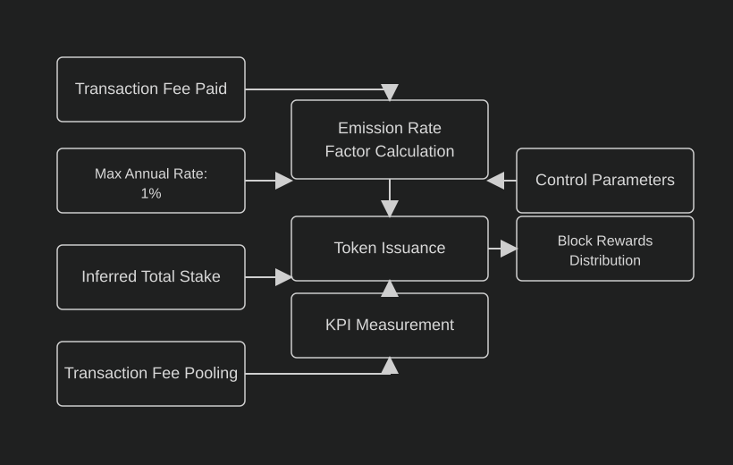
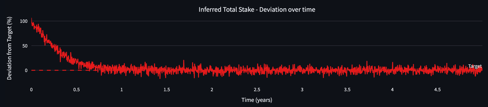

# BLOCK-REWARDS

| Field | Value |
| --- | --- |
| Name | Block Rewards |
| Slug | 199 |
| Status | raw |
| Category | Standards Track |
| Editor | Frederico Teixeira <frederico@logos.co> |
| Contributors | Filip Dimitrijevic <filip@logos.co> |

<!-- timeline:start -->

## Timeline

- **2026-05-27** — [`b7602ed`](https://github.com/logos-co/logos-lips/blob/b7602ed8a225d41ca0bfaaa432524dc84d2ded7e/docs/blockchain/raw/block-rewards.md) — chore: move blockchain specs from notion to github

<!-- timeline:end -->

# Revisions History

| Version | Changes | Date |
| --- | --- | --- |
| 1.0.0 | Initial revision. | 2026-04-24 |
| 1.1.0 | Changing from burning/minting to pooling/distributing/releasing, removing $S_{tge}$ | 2026-06-22 |

> Disclaimer:
> This material, including any linked pages or documents, is provided for informational purposes only. It does not constitute investment advice, a solicitation, or an offer to buy or sell any securities, tokens, or other financial instruments, nor should it be construed as legal, financial, or tax advice.
>
> All information regarding project details, token design, distribution mechanisms, technical parameters, and any forward-looking statements is preliminary and subject to change without notice. No representations or warranties are made as to the completeness or accuracy of the information herein. 
>
> Nothing in this material should be relied upon for investment or business decisions. Recipients of this information assume all risks associated with its use and are responsible for seeking independent professional advice regarding any actions based on it.

# Introduction

This document outlines the specifications for Logos Blockchain's block rewards mechanism, a critical component of the network's economic model. The mechanism is designed to create a sustainable economic framework that incentivizes network participation while maintaining long-term stability.

The objective is to develop a block rewards system that addresses key challenges specific to Logos Blockchain's architecture, including the unlinkability between block proposal and reward collection, and the inability to directly allocate transaction fees to specific block proposers. These constraints necessitate a carefully designed economic incentive structure.

Building on previous work in blockchain economics, this specification proposes a dynamic token emission system that calibrates the release of the LGO genesis minted reserve according to network Key Performance Indicators (KPIs). The system uses two primary metrics: inferred total stake (as a security indicator) and average pooling rate (to maintain supply equilibrium).

The document references internal mathematical models and simulations that demonstrate how the proposed mechanism would behave under various conditions. Key parameters include maximum annual emission rate ($1\%$), control responsiveness factors, and target metrics for network security.

The conclusion of our analysis indicates that this KPI-based emission model should achieve several important outcomes:

- Initially higher emission rates (capped at $1\%$ of the max supply annually) to bootstrap network participation.
- Gradual stabilization of token supply as the system matures, with our baseline simulation showing just $1.33\%$ total inflation after $10$ years.
- Self-regulating mechanism where the reserve release naturally adjusts to complement pooled transaction fees.
- Built-in safeguards against manipulation through moving averages and bounded functions.

This specification represents a comprehensive approach to creating a robust economic foundation for the Logos Blockchain network that balances security requirements with long-term economic sustainability.

# Overview

The Logos Blockchain block rewards mechanism is a KPI-based dynamic token emission system designed to create a sustainable economic framework that incentivizes network participation while maintaining long-term stability. This section provides a high-level understanding of how the system works and its key components.

## Key Principles

The design of the rewards system reflects three architectural constraints unique to Logos Blockchain:

- Unlinkability: Block proposal and reward collection are intentionally decoupled for privacy, meaning rewards cannot be assigned to a single proposer.
- Fee pooling: All transaction fees (execution base fees and permanent storage fees) are collected into a pending rewards pool, rather than directly given to block proposers.
- Global metrics over local signals: Rewards are computed from network-wide KPIs at block production time, rather than from easily manipulated per-block data.

These principles ensure that the system is censorship-resistant, manipulation-resistant, and aligned with long-term network incentives.

## Requirements

Building upon the requirements for Logos Blockchain's block rewards system, the implementation will establish that all transaction fees are pooled while block rewards are tied to measurable global metrics that reflect network health and security. This mechanism ensures that if network activity surges substantially, the accelerated pooling of tokens will be balanced by complementary distribution from the reserve over time.

For optimal functionality, block rewards should be anchored to specific observable metrics rather than arbitrary values. Block numbers simply track time passage without indicating chain state. Transaction counts per block are vulnerable to manipulation. On the other hand, tracking the number of Blend nodes or inferring total stake provide more robust information about the chain state, specially when they can be compared with targets that are considered “healthy”.

Crucially, any metric-pegged reward system should aim toward a target value or equilibrium point, creating predictability and stability in the token economics.

## High-level System Design

The system dynamically adjusts token emission based on two primary KPIs:

- Inferred Total Stake: Measures network security by tracking the total amount staked against a target threshold (e.g., $30\%$ of the maximum supply).
- Average Pooling Rate: Tracks transaction fees (both Execution base fees and Permanent Storage) routed to the pending reward pool to maintain supply equilibrium.

A control function combines these KPIs to determine the emission rate factor, bounded between a minimum and maximum annual reserve release. This ensures that:

- When security participation is below target, a higher reserve release attracts more validators.
- As usage increases and fees are pooled, the reserve release adjusts downward and distribution from the pool rises to stabilize circulating supply.



The equation that defines the amount of block rewards is given by:

$$
A_t \cdot \dfrac{I_{max} \cdot S_{cap} \cdot \Delta_t}{f} + (1-A_t) \cdot \bar{R}_t
$$

where:

- $`A_t`$ is the emission rate factor on a per year basis.
- $`I_{max}`$ is the maximum emission rate per year.
- $`S_{cap}`$ denotes the maximum allowable token supply (hard cap).
- $`\Delta_t`$ denotes the fraction of year in one time step per e.g., epoch, block, or day.
- $f$ be the average number of block proposal within $`\Delta_{t}`$ units.
- $`R_\text{block}`$ denotes the total amount of Execution base fees and Permanent Storage fees that are routed to the pending reward pool when the block is proposed.
- $`\bar{R}_t`$ denotes the average pooled reward: the moving average of $`R_\text{block}`$ over the look-back window $`T`$.

## Lifecycle Phases

The system is designed to evolve through different phases:

- Bootstrap Phase: Initially higher emission rates (up to $1\%$ annually) to incentivize network participation when stake is below target. As it is explained below, this is viable even when Logos Blockchain experiences low activity because the level of activity only plays a role when the network participation gets close to the predefined target.
- Stabilization Phase: As Proof-of-Stake (PoS) participation approaches target levels, emission becomes primarily driven by the fee pooling rate.
- Equilibrium Phase: Circulating supply stabilizes as distribution from the pool matches pooled fees and the reserve release approaches zero.
- High-Adoption Phase: If the fee pooling rate exceeds the maximum reserve release rate, circulating supply contracts as the pool accumulates faster than tokens are released. Total supply is unchanged.

## Benefits

This KPI-based approach delivers several advantages:

- Self-regulating mechanism that automatically adjusts to network conditions.
- Long-term sustainability with projected net circulating-supply growth of just $1.33\%$ after $10$ years (assuming constant pooling rate of $0.5\%$ per year).
- Built-in safeguards against manipulation through moving averages and bounded functions.
- Predictable economic model that balances security incentives with controlled supply.

The overall design creates a robust economic foundation for the Logos Blockchain blockchain that effectively balances the need for strong security incentives with long-term token supply stability.

# Construction

The proposed mechanism implements a dynamic token emission system that precisely calibrates the LGO reserve release according to network performance metrics (KPIs). This adaptive model adjusts release rates based on how KPIs perform relative to their predetermined targets, while maintaining strict adherence to supply parameters and economic boundaries.

## Core Variables

The following variables are input to the model:

- $`S_{cap}`$ denotes the maximum allowable token supply (hard cap).
- $`\Delta_t`$ denotes the fraction of year in one time step per e.g., epoch, block, or day:
    - if the time step is 1 day, then $`\Delta_t = 1/365`$.
    - if the time step is 1 block every $30$ seconds, then $`\Delta_t = 1/(365 \times 2880)`$.
    - if the time step is 1 epoch, which lasts 7.5 days, then $`\Delta_t = 1/(365/7.5) = 1/48.667`$.
- $f$ be the average number of block proposal within $`\Delta_{t}`$ units:
    - if the time step is 1 day and blocks are proposed every 30 seconds, then $f=2880$ (the number of 30 seconds intervals in 1 day).
    - if the time step is 1 epoch, which lasts 7.5 days, and blocks are processed every 30 seconds, then $f = 7.5 \times 2880 = 21600$ (the number of 30 seconds intervals in 7.5 day).
- $`I_{min}`$ is the minimum emission rate per year ($`I_{min} = 0\%`$ of $`S_{cap}`$).
- $`I_{max}`$ is the maximum emission rate per year ($`I_{min} = 1\%`$ of $`S_{cap}`$).
- $`Y`$ denotes the lifetime, in years, of the rewards reserve at the maximum release rate $`I_{max}`$ of $`S_{cap}`$ per year ($`Y = 10`$ years).
- $`D_{i,target}`$ denotes the target value for the $i$-th KPI.
- $`w_i`$ denotes the weight of the $i$-th KPI in the normalized deviation from target or in the normalized average; it satisfies $`\sum_i w_i = 1`$.
- $`\alpha_d \gt 0`$ denotes the control responsiveness to KPI deviation metrics.
- $`\alpha_a \gt 0`$ denotes the control responsiveness to KPI average metrics.
- $T$ be the number of periods in the look-back window for the moving average.

Let us define the following variables:

- $`S_t`$ denotes the token circulating supply at time $t$.
- $`P_t`$ denotes the pending rewards pool balance at time $t$. It collects the pooled fees and funds the distributed portion of the reward.
- $`B_t`$ denotes the rewards reserve balance at time $t$. It holds the pre-allocated tokens drawn down by the reserve release $`\iota_t`$, with initial size $`B_0 = I_{max} \cdot S_{cap} \cdot Y`$.
- $`A_t \in [0,1]`$ denotes the emission rate factor on a per year basis.
    - This implies that $`A_t \cdot I_{max} \cdot \Delta_t`$ denotes the emission within the time-step.
- $`D_{i,t}`$ denotes the $i$-th key performance indicator at time $t$ (e.g., TVL, staked amount, active users).
- $`R_\text{block}`$ denotes the total amount of Execution Gas and Permanent Storage fees routed to the rewards pool in a block. Refer to [Execution Market](execution-market.md) and [Storage Markets](storage-markets.md) for how to compute $`R_{block}`$.
- $`\bar{R}_t = \dfrac{1}{T} \sum_{\tau=t-T+1}^{t} D_{1,\tau}`$ denotes the average pooled reward: the moving average of $`R_\text{block}`$ over the look-back window $`T`$. It is the base distributed each block, topped up by the reserve release.

## Parametrization

| Symbol | Definition | Default Value | Explanation |
| --- | --- | --- | --- |
| $`S_{cap}`$​ | Maximum token supply (hard cap) | 10 billion LGO | N.A. |
| $T$​ | The number of periods in the look-back window for the moving average. | $120$​ | As the system is expected to produce 1 block every 30 seconds, this look-back window defines that the reward averages the fees pooled in the last hour. |
| $`\alpha_a`$​ | Denotes the control responsiveness to KPI average metrics. | $1$​ | This parameter scales the reserve-release response to the pooling rate. It must be one-to-one. |
| $`\alpha_d`$​ | Denotes the control responsiveness to KPI deviation metrics. | $1/4$​ | See [\[Analysis\] Block Reward Parameter Calibration](analysis-block-reward-parameter-calibration.md), for details. |
| $`w_i`$​ | Denotes the weight of the $i$-th KPI in the normalized deviation from target | $1$​ | There's only one KPI of this type in our system. |
| $`D_{0,target}`$​ | Denotes the target value for the first KPI based on stake. | 3 billion LOGOS | $30\%$ of the maximum supply. |
| $`D_{1,target}`$​ | Denotes the target value for the second KPI based on fees. | $10$ billon LOGOS | In the context of this KPI, this value behaves as a normalizer |
| $`I_{max}`$​ | The maximum emission rate per year | $1\%$​ | This value guarantees that, when the total inferred stake reaches $`D_{0,target}`$, then the APY for validation is ~3.33%. |
| $`Y`$ | Lifetime of the rewards reserve at the maximum release rate ($`I_{max}`$ of $`S_{cap}`$ per year) | $10$ years | Sets the reserve size $`B_0 = I_{max} \cdot S_{cap} \cdot Y = 10^9`$ LGO ($10\%$ of $`S_{cap}`$). |
| $`I_{min}`$​ | The minimum emission rate per year | $0\%$​ | This avoids inflationary token emissions. |
| $f$​ | The average number of block proposal within $`\Delta_{t}`$ units | $1$​ | The time step $`\Delta_t`$ was chosen so that $f$ equals to $1$. |
| $`\Delta_t`$​ | Time step, the fraction of year in one time step (per e.g., epoch, block, or day) | $1/(365 \times 2880)$​ | The time step is 1 block every $30$ seconds; there are 2880 blocks of 30 seconds in a day. |

The calibration of these parameters can be found in [\[Analysis\] Block Reward Parameter Calibration](analysis-block-reward-parameter-calibration.md).

## Block Rewards

The amount of tokens rewarded in a block is anchored on the average pooled fees and topped up by the reserve release. The emission rate factor $`A_t`$ sets the size of the top-up: it controls how much of the reward is newly released and how much is the recycled average of pooled fees. The following behavior is expected:

- When the aggregate KPI is far from the target, $`A_t \rightarrow 1`$, the reserve release is maximized: it tops up the average pooled reward $`\bar{R}_t`$, raising the reward toward the per-block release cap $`\frac{I_{max} \cdot S_{cap} \cdot \Delta_t}{f}`$.
- When the aggregate KPI is close to the target, $`A_t \rightarrow 0`$, the top-up vanishes and the reward settles at the average pooled fees $`\bar{R}_t`$, funded by recycling the pooled fees to leaders and Blend nodes.

The reserve release within the time step $`\Delta_t`$ is given by

$$
A_t \cdot I_{max} \cdot S_{cap} \cdot \Delta_t.
$$

The actual amount of tokens released per block also depends on how many blocks are expected to be proposed between $`\Delta_{t-1}`$ and $`\Delta_{t}`$. This is expressed by the factor $f$, as defined [above](#core-variables).

The equation that implements the behavior above in terms of $`A_t`$ is given by:

$$
\begin{equation}
R_t = A_t \cdot \dfrac{I_{max} \cdot S_{cap} \cdot \Delta_t}{f} + (1-A_t) \cdot \bar{R}_t
\end{equation}
$$

where:

- $`A_t`$ is the emission rate factor on a per year basis.
- $`I_{max}`$ is the maximum emission rate per year.
- $`S_{cap}`$ denotes the maximum allowable token supply (hard cap).
- $`\Delta_t`$ denotes the fraction of year in one time step per e.g., epoch, block, or day.
- $f$ be the average number of block proposal within $`\Delta_{t}`$ units.
- $`R_\text{block} = D_{1,t}`$ denotes the per-block Execution base fees and Storage fees routed to the pool when the block is proposed.
- $`\bar{R}_t = \dfrac{1}{T} \sum_{\tau=t-T+1}^{t} D_{1,\tau}`$ denotes the average pooled reward: the moving average of $`R_\text{block}`$ over the look-back window $`T`$.

The recycled component distributes the average pooled reward $`\bar{R}_t`$, rather than the single-block fee $`R_\text{block}`$, which smooths it across the window $`T`$. Rearranging equation (1) isolates the role of the reserve release:

$$
\bar{R}_t + A_t \cdot \left( \dfrac{I_{max} \cdot S_{cap} \cdot \Delta_t}{f} - \bar{R}_t \right).
$$

The base distributed every block is the average pooled reward $`\bar{R}_t`$. The second term is the reserve release: when the aggregate KPI is far from the target, $`A_t \rightarrow 1`$ and the reserve release tops up the reward from $`\bar{R}_t`$ toward the per-block release cap $`\frac{I_{max} \cdot S_{cap} \cdot \Delta_t}{f}`$. In the bootstrap regime, where activity is low and $`\bar{R}_t < \frac{I_{max} \cdot S_{cap} \cdot \Delta_t}{f}`$, the top-up is positive, so the reserve release raises the reward above the average pooled reward. If the average pooled reward already exceeds the release cap, the second term is non-positive, and therefore less tokens are released as rewards.

```python
def block_rewards(
    S_cap: float,
    emission_rate_factor: float,
    I_max: float,
    Delta_t: float,
    f: float,
    R_bar_t: float,
) -> float:
    """
    Calculate the rewards distributed per block.
    It implements equation (1). R_bar_t is the average pooled reward:
    the moving average of the per-block pooled fees over the look-back window T.
    """
    reserve_release = emission_rate_factor * I_max * S_cap * Delta_t / f
    pool_distribution = (1.0 - emission_rate_factor) * R_bar_t
    return reserve_release + pool_distribution
```

## Pool Accounting and Supply Dynamics

The mechanism routes all transaction fees into a rewards pool. Let $`P_t`$ denote the pool balance at time $t$ and $`\bar{R}_t = \frac{1}{T}\sum_{\tau=t-T+1}^{t} D_{1,\tau}`$ the average pooled reward over the look-back window. Each block routes its fees into the pool and distributes the average pooled reward, recycled in proportion $`(1 - A_t)`$. The distribution is topped up by a release from a rewards reserve, not by minting: the reserve holds tokens pre-allocated from the fixed cap $`S_{cap}`$ at genesis. It is sized so that releasing at the maximum rate $`I_{max}`$ of $`S_{cap}`$ per year lasts $`Y`$ years, giving an initial balance $`B_0 = I_{max} \cdot S_{cap} \cdot Y`$.

The inflows and the outflow at step $t$ are:

- Fee inflow: $`R_\text{block} = D_{1,t}`$.
- Reserve release (top-up): $`\iota_t = \min \lbrace A_t \cdot \dfrac{I_{max} \cdot S_{cap} \cdot \Delta_t}{f}, \; B_{t-1} \rbrace`$, drawn from the reserve and added to the payout.
- Distribution outflow, equal to the block reward: $`R_t = (1 - A_t) \cdot \bar{R}_t + \iota_t`$.

The reserve funds the release and is monotonically non-increasing, bounded below by zero:

$$
B_t = B_{t-1} - \iota_t, \qquad B_t \geq 0.
$$

Once the reserve is depleted, $`\iota_t = 0`$ and the reward reduces to the recycled component $`(1 - A_t) \cdot \bar{R}_t`$, funded entirely by pooled fees. The cap on $`\iota_t`$ makes the reserve last $`Y`$ years at the maximum release rate, and longer whenever $`A_t < 1`$.

The pool collects every fee and pays out only the recycled component, so its balance evolves as

$$
P_t = P_{t-1} + R_\text{block} - (1 - A_t) \cdot \bar{R}_t.
$$

The increment $`R_\text{block} - (1 - A_t)\bar{R}_t`$ can take either sign. Near target ($`A_t \rightarrow 0`$) the pool pays the average and banks the difference $`D_{1,t} - \bar{R}_t`$, acting as a buffer that smooths fee fluctuations; far from target ($`A_t \rightarrow 1`$) it retains the full fee while the reserve release carries the reward. The pool is redistributable, subject to $`P_t \geq 0`$.

The mechanism conserves tokens across the three stocks it controls. Let the controlled total be $`S_t^{tot} = S_t + P_t + B_t`$, with $`S_t`$ the circulating supply. Per step:

$$
\Delta S_t = R_t - R_\text{block} = (1 - A_t) \cdot \bar{R}_t + \iota_t - D_{1,t},
$$

$$
\Delta P_t = R_\text{block} - (1 - A_t) \cdot \bar{R}_t, \qquad \Delta B_t = -\iota_t,
$$

$$
\Delta S_t^{tot} = \Delta S_t + \Delta P_t + \Delta B_t = 0.
$$

The controlled total is constant: the mechanism never mints tokens. A reserve release moves tokens from $`B_t`$ into circulation, routing a fee moves tokens from circulation into $`P_t`$, and recycling moves them back. Circulating supply $`S_t`$ rises as the reserve drains, and contracts whenever the fee inflow exceeds the distributed reward, $`D_{1,t} > R_t`$, when tokens accumulate in the pool faster than they are paid out. This removes tokens from circulation, not from existence, and reverses if the pool is later released. Net circulating growth over the reserve's life is bounded by $`B_0 = I_{max} \cdot S_{cap} \cdot Y`$.

## Emission Rate Factor Function

The emission rate factor $`A_t \in [0,1]`$ determines the portion of $`I_{max}`$ that should be emitted based on current values of $`\delta_t`$ and $`\gamma_t`$:

$$
A_t = \min \lbrace 1, \max \lbrace 0, \dfrac{ \alpha_d \cdot \delta_t + \alpha_a \cdot \gamma_t + I_{min}}{I_{max}} \rbrace \rbrace.
$$

where

- $`\alpha_d`$ controls the responsiveness to KPI deviation metrics.
- $`\delta_t`$ is measuring the KPI deviation from targets.
- $`\alpha_a`$ controls the responsiveness to KPI average metrics.
- $`\gamma_t`$ is measuring the KPI average values of over the last $T$ steps.
- $`I_{min}`$ is the minimum emission rate per year.
- $`I_{max}`$ is the maximum emission rate per year.

All terms are displayed in annualized form to ease comparison.

```python
def calculate_emission_rate_factor(
    alpha_dev:float,
    weighted_target_deviation: float,
    alpha_avg:float,
    weighted_avg: float,
    i_min: float = 0.0,
    i_max: float = 0.01
) -> float:
    """It calculates the current emission rate factor"""
    emission_rate:float = alpha_dev * weighted_target_deviation + alpha_avg * weighted_avg + i_min
    emission_rate_factor:float = emission_rate / i_max
    emission_rate_factor = min(1.0, max(emission_rate_factor, 0.0))
    return emission_rate_factor
```

### KPI Deviation from Target

The weighted deviation from target

$$
\delta_t = \sum_i w_i \times 
\dfrac{D_{i,target} - D_{i,t}}{D_{i,target}}.
$$

```python
def weighted_deviation_from_target(
    kpi_weights: List[float],
    kpi_deviations: List[float]
) -> float:
    """
    Calculate the normalized deviation (delta_t).
    Inputs:
    * kpi_weights: constant list of floats
    * kpi_deviations: for each KPI, it contains the results of "deviation_from_target"
    Returns:
    * a normalized annualized KPI in units of %.
    """
    assert len(kpi_weights) == len(kpi_deviations)

    weighted_target_deviation:float = 0.0
    for deviation, weight in zip(kpi_deviations, kpi_weights):
        weighted_target_deviation += weight * deviation value

    return weighted_target_deviation
```

It implies that:

- $`\delta_t \gt 0`$ → KPI below target → should increase the token emission by a factor of $`\alpha_d \cdot \delta_t`$.
- $`\delta_t = 0`$ → KPI at target → should not change the token emission.
- $`\delta_t \lt 0`$ → KPI above target → should reduce the token emission by a factor of $`\alpha_d \cdot \delta_t`$.

> To measure the deviation, only the total estimated stake KPI is used in this part of the computation

### KPI Average

The weighted average metric is defined as

$$
\gamma_t = \dfrac{1}{\Delta_t} \sum_i w_i \cdot \Bigl(\dfrac{1}{T}  \sum_{\tau=t-T+1}^t \dfrac{ D_{i,\tau}}{D_{i,target}} \Bigr).
$$

where:

- The value $`D_{j,target}`$ can be any number with the same units of $`D_{j,i}`$.
- The factor $`\dfrac{1}{\Delta_t}`$ turns $`\gamma_t`$ into an annualized quantity. This depends on the specific KPI.

```python
def weighted_average(
    kpi_weights: List[float],
    kpi_average: List[float]
) -> float:
    """
    Calculate the weighted average metric (gamma_t)
    * kpi_weights: constant list of floats
    * kpi_average: for each KPI, it contains the results of "average_kpi"
    """
    assert len(kpi_weights) == len(kpi_deviations)

    weighted_avg:float = 0.0
    for avg, weight in zip(kpi_average, kpi_weights):
        weighted_avg += weight * avg

    return weighted_avg
```

The weighted average metric features:

- $`\gamma_t \gt 0`$ → should increase the token emission by a factor of $`\alpha_a \gamma_t`$.
- $`\gamma_t = 0`$ → should not change the token emission.
- $`\gamma_t \lt 0`$ → should reduce the token emission by a factor of $`\alpha_a \gamma_t`$.

> To measure the average, only the average pooling rate KPI is used in this part of the computation

## Key Performance Indicator(s)

### KPI 1 - The Inferred Total Stake

Given the privacy features of Logos Blockchain and the fact that the token's maximum supply is known, the inferred total stake is the most appropriate indicator of the system's security.

Let:

- $`D_{0,t}`$ denotes the evolution of the inferred total stake.
- $`D_{0,target}`$ denotes the total stake that is considered secure. For the blockchain to be secure, we aim for $30\%$ of the maximum supply.

The inferred total stake affects the emission rate through the "normalized deviation from target." The deviation implied by this KPI is characterized by the plot below.



> <sub>Figure 1</sub>

This happens because, when the blockchain starts, $`D_{0,t} \vert_{t=0}`$ is very likely a small number compared to the target. Therefore, the equation [above](#kpi-deviation-from-target) tilts towards $1$ (or $100\%$) at that moment. As time passes and more stake participates in the PoS, the difference between the current total stake and the target diminishes. The equation [above](#kpi-deviation-from-target) oscillates around 0 (or $0\%$) when $`D_{0,t}`$ oscillates around $`D_{0,target}`$.

Let the Logos Blockchain’s security level be defined by:

$$
\text{Security Level} = \dfrac{D_{0,target}}{S_{cap}}.
$$

### KPI 2 - The Average Pooling Rate

In the long run, Logos Blockchain should release only enough tokens to complement the pooled transaction fees, so that block rewards are funded primarily by distribution from the pool.

Let

- $`D_{1,t}`$ denote the amount of Storage fees and Execution base fees pooled since $t-1$.
- $`D_{1,target}=S_{cap}`$ denote the "normalizing factor" (it is the maximum supply, in this case).

This choice of "target" implies that $`\gamma_t`$ evaluates the annualized average pooling rate with respect to the maximum supply. This makes the equation [above](#emission-rate-factor-function) consistent.

# Float Precision for Implementation

Because block rewards affect consensus state, the implementation must be fully deterministic across all nodes. For that reason, the normative implementation of the reward function should not rely on floating-point arithmetic, machine-dependent rounding behavior, or comparisons against machine epsilon. Earlier sections use real-valued formulas to explain the mechanism and its economic meaning, but the consensus rule itself should be defined only in terms of integer arithmetic. This is especially important because the current document already notes floating-point concerns in the KPI helper functions and then introduces a final integer rewrite for the reward computation. The issue is therefore not whether integers should be used, but how to present that integer formulation in a way that remains auditable and clearly derived from the protocol parameters.

The goal of this section is not to change the reward mechanism. It is only to restate the already-specified mechanism in a canonical deterministic form with explicit named constants. In particular, the reward logic remains driven by the same two KPI components described previously: the inferred total stake relative to its target, and the moving average of pooled fees over the look-back window. Likewise, the reward still interpolates between the reserve release and distribution from the pool through the emission factor $`A_t`$.

> Rederivation required: the integer steps below were written for the earlier reward equation, whose recycled term used the single-block pooled fee $`R_\text{block} = D_{1,t}`$. Equation (1) now distributes the average pooled reward $`\bar{R}_t = \frac{1}{T}\sum_{\tau=t-T+1}^{t} D_{1,\tau}`$ in the recycled term. To match the current model, replace $`(1-A_t)\cdot D_{1,t}`$ by $`(1-A_t)\cdot \bar{R}_t`$, reusing the window sum already maintained for $`\gamma_t`$ (the Rust reference already accumulates it as the fee window, so $`\bar{R}_t`$ is that sum divided by $`T`$). The derivation of $`A_t`$ and of the reserve-release term is unaffected.

$$
A_t = \min \lbrace 1, \max \lbrace 0, \dfrac{ \alpha_d \cdot \delta_t + \alpha_a \cdot \gamma_t + I_{min}}{I_{max}} \rbrace \rbrace.
$$

Because we have

$$
\alpha_d=\frac{1}{4},\quad
\alpha_a=1,\quad
I_{\max}=10^{-2},\qquad
T=120,\quad
f=1,\quad R_\text{block} = D_{1,t}\\
D_{0,\mathrm{target}}=3\cdot 10^9,\qquad
D_{1,\mathrm{target}}=S_{\mathrm{cap}}=10^{10},\qquad
\Delta_t=\frac{1}{365\cdot 2880},
$$

$$
\delta_t = \sum_i w_i \times 
\dfrac{D_{i,target} - D_{i,t}}{D_{i,target}},
$$

$$
\gamma_t = \dfrac{1}{\Delta_t} \sum_i w_i \cdot \Bigl(\dfrac{1}{T}  \sum_{\tau=t-T+1}^t \dfrac{ D_{i,\tau}}{D_{i,target}} \Bigr),
$$

and $`w_i`$ denotes the weight of the $i$-th KPI in the normalized deviation from target or in the normalized average; it satisfies $`\sum_i w_i = 1`$.

Therefore,

$$
\begin{aligned}
\frac{\alpha_d}{I_{\max}}\delta_t
&=
\frac{1/4}{10^{-2}}\cdot \frac{D_{0,\mathrm{target}}-D_{0,t}}{D_{0,\mathrm{target}}}
\\
&=
25\cdot \frac{3\cdot 10^9-D_{0,t}}{3\cdot 10^9}
\\
&=
\frac{3\cdot 10^9-D_{0,t}}{12\cdot 10^7}.
\end{aligned}
$$

and

$$
\frac{\alpha_a}{I_{\max}}\gamma_t=\frac{1}{10^{-2}}\cdot \frac{1}{\Delta_t}\cdot \frac{1}{T}\sum_{\tau=t-T+1}^{t}\frac{D_{1,\tau}}{D_{1,\mathrm{target}}}=\\\frac{1}{10^{-2}}\cdot \frac{1}{\Delta_t}\cdot \frac{1}{T}\cdot\frac{1}{{D_{1,\mathrm{target}}}}\sum_{\tau=t-T+1}^{t}{D_{1,\tau}}=\\
\\100\cdot \frac{1}{\frac{1}{365\cdot 2880}}\cdot \frac{1}{120}\cdot\frac{1}{10^{10}}\sum_{\tau=t-120+1}^{t}{D_{1,\tau}}=\\
100\cdot \frac{365\cdot 2880}{120\cdot 10^{10}}\sum_{\tau=t-120+1}^{t} D_{1,\tau}=\\
\frac{10512}{12\cdot 10^7}\sum_{\tau=t-120+1}^{t} D_{1,\tau}.
$$

So we rewrite $`A_t`$ by

$$
A_t=\min\!\lbrace1,\max\!\lbrace0,\quad \frac{3\cdot 10^9-D_{0,t}+10512\sum_{\tau=t-120+1}^{t}D_{1,\tau}}{12\cdot 10^7}\rbrace\rbrace.
$$

And by denoting

$$
\begin{aligned}
A_t'
&=
\min\!\lbrace12\cdot 10^7,\max\!\lbrace0,\quad3\cdot 10^9-D_{0,t}+10512\sum_{\tau=t-120+1}^{t}D_{1,\tau}\rbrace\rbrace,
\\
A_t&=\frac{A_t'}{12\cdot 10^7}.
\end{aligned}
$$

We can compute the block reward using only integers:

$$
\text{Rewards}_t= A_t \cdot \dfrac{I_{max} \cdot S_{cap} \cdot \Delta_t}{f} + (1-A_t) \cdot R_\text{block} =\\
\frac{A_t'}{12\cdot 10^7} \cdot \dfrac{I_{max} \cdot S_{cap} \cdot \Delta_t}{f} + (1-\frac{A_t'}{12\cdot 10^7}) \cdot D_{1,t}
$$

and

$$
\frac{I_{\max} \cdot S_{\mathrm{cap}}\cdot \Delta_t}{f}=\frac{10^{-2}\cdot 10^{10}}{365\cdot 2880}=\frac{10^8}{1051200}=\frac{62500}{657}.
$$

So:

$$
\text{Rewards}_t=
\frac{A_t'}{12\cdot 10^7} \cdot \frac{62500}{657} + (1-\frac{A_t'}{12\cdot 10^7})\cdot D_{1,t} =\\
\frac{62500\cdot A_t' + 657\cdot(12\cdot 10^7-A_t')\cdot D_{1,t}}{657\cdot 12\cdot 10^7}
.
$$

So we propose a reference implementation that uses integers:

```rust
const A_SCALE: u128 = 120_000_000; // denominator of 1/(I_max * D1_target * Delta_t * T) 
const INFLATION_NUM: u128 = 62_500; // numerator of I_max * S_CAP * DELTA_t / f
const INFLATION_DEN: u128 = 657; // denominator of I_max * S_CAP * DELTA_t / f
const FEE_AVG_NUM: u128 = 10_512; // numerator of 1/(I_max * D1_target * Delta_t * T) 
const STAKE_TARGET: u128 = 3e9;
fn block_reward(total_stake: u64, pooled_fees_window: [u64; 120]) -> (u64, u64) {
    let sum_fees: u128 = pooled_fees_window.iter().map(|x| *x as u128).sum();
    let last_pooled_fee: u128 = *pooled_fees_window.last().unwrap() as u128;
    let a_num = STAKE_TARGET
        .saturating_add(FEE_AVG_NUM.saturating_mul(sum_fees))
        .saturating_sub(total_stake as u128)
        .min(A_SCALE);
    let reward_num =
        INFLATION_NUM * a_num
        + INFLATION_DEN * (A_SCALE - a_num) * last_pooled_fee;
    let reward_den = INFLATION_DEN * A_SCALE;
    // 60% Blend, 40% leader, with truncation applied only once per share
    let blend_reward = (reward_num * 6 / (reward_den * 10)) as u64;
    let leader_reward = (reward_num * 4 / (reward_den * 10)) as u64;
    (blend_reward, leader_reward)
}
```
