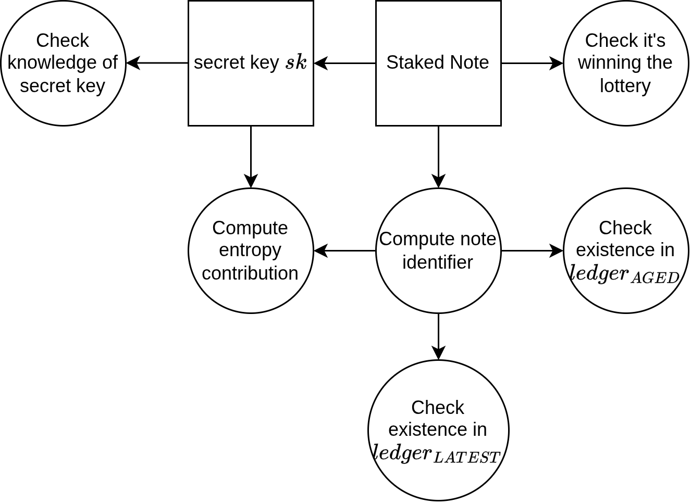
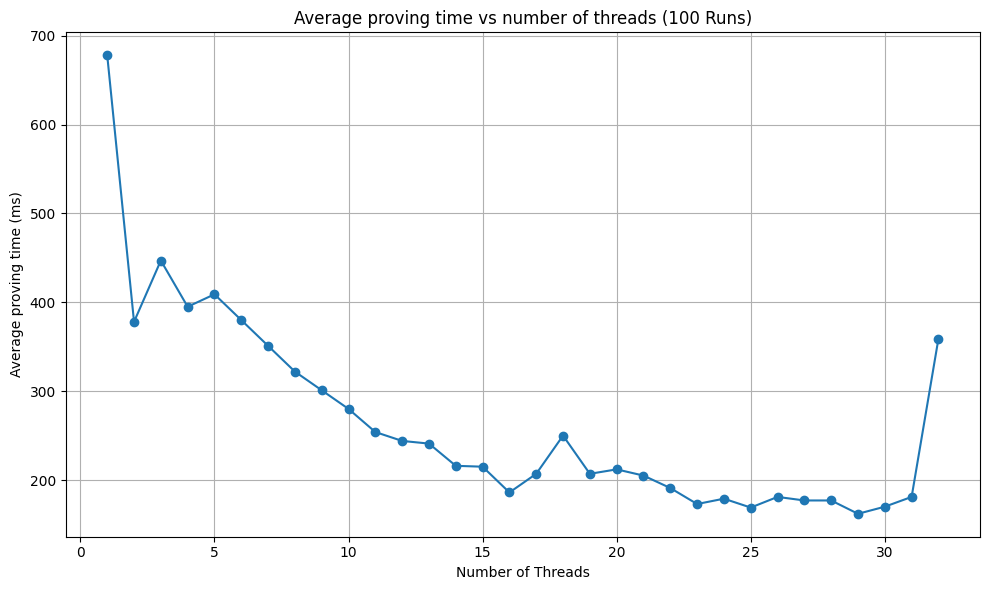

# PROOF-OF-LEADERSHIP

| Field | Value |
| --- | --- |
| Name | Proof of Leadership |
| Slug | 83 |
| Status | raw |
| Category | Standards Track |
| Editor | Thomas Lavaur <thomas@logos.co> |
| Contributors | Mehmet <mehmet@logos.co>, Giacomo Pasini <giacomo@logos.co>, Daniel Sanchez Quiros <daniel@logos.co>, Álvaro Castro-Castilla <alvaro@logos.co>, David Rusu <david@logos.co>, Filip Dimitrijevic <filip@logos.co> |

<!-- timeline:start -->

## Timeline

- **2026-05-27** — [`b7602ed`](https://github.com/logos-co/logos-lips/blob/b7602ed8a225d41ca0bfaaa432524dc84d2ded7e/docs/blockchain/raw/cryptarchia-proof-of-leadership.md) — chore: move blockchain specs from notion to github
- **2026-05-18** — [`58b5698`](https://github.com/logos-co/logos-lips/blob/58b56988429f4d69a9e10a9fc118725e229e37c5/docs/blockchain/raw/cryptarchia-proof-of-leadership.md) — chore(blockchain): migrate contributor emails to @logos.co (#338)
- **2026-01-19** — [`f24e567`](https://github.com/logos-co/logos-lips/blob/f24e567d0b1e10c178bfa0c133495fe83b969b76/docs/blockchain/raw/cryptarchia-proof-of-leadership.md) — Chore/updates mdbook (#262)
- **2026-01-16** — [`89f2ea8`](https://github.com/logos-co/logos-lips/blob/89f2ea89fc1d69ab238b63c7e6fb9e4203fd8529/docs/blockchain/raw/cryptarchia-proof-of-leadership.md) — Chore/mdbook updates (#258)

<!-- timeline:end -->

# Revision History

| **Version** | **Changes** | **Date** |
| --- | --- | --- |
| 1.0.0 | Initial revision. | 2026-12-09 |
| 1.1.0 | Remove the protection against adaptive adversary from PoL removing a non-enforced feature, simplifying work for engineers, improving UX and performances of PoL and PoQ. Update the performance according to the new circuit. Remove the notion of NOMOS in DSTs | 2026-01-29 |
| 1.1.1 | Introduced a discussion for when the value of a participating note is way higher than the total estimated stake | 2026-06-24 |

| 1.2.0 | [RFC] Dual-key notes: the note's STARK-field public key is a private input and enters the note identifier derivation | 2026-09-07 |
# Introduction

The Proof of Leadership enables a leader to produce a zero-knowledge proof attesting to the fact that they have an eligible note that has won the leadership lottery. This proof must be as lightweight as possible to generate and verify, due to the following reasons:

- Impose minimal restrictions on access to the role of leader and thus maximize the decentralization of that role.
- Similarly, the proof and its context must be efficiently verifiable for validators

This document extends the work presented in the [Ouroboros Crypsinous paper](https://eprint.iacr.org/2018/1132.pdf) with recent cryptographic developments.

## References

- [Cryptarchia Protocol](cryptarchia-v1-protocol.md).

# Overview

## Overview of the Protocol

The PoL mechanism ensures that a note has legitimately won the leadership election while protecting the leader’s privacy. The protocol is:

- Setup: The note becomes eligible for PoS when it has aged sufficiently.
- PoL generation:
  1. First, check if the note is winning by simulating the lottery
  2. Prove the membership of the note identifier in an old snapshot of the Mantle Ledger, proving its age and its existence.
  3. Prove the membership of the note identifier in the most recent Mantle ledger, proving it’s unspent.
  4. Prove that the note won the PoS lottery.
  5. The proof is bound to a cryptographic public key used for signing the leader’s proposed blocks.

## Comparison with Original Crypsinous PoL

Our description differs from the original paper proposition, proving that a note is unspent directly instead of delegating the verification to validators. Moreover, we don't include the protection against adaptive adversaries that cannot be enforced by the chain or incentivized. This design choice brings the following tradeoffs:

### Advantages

1. The ledger isn’t required to be private using shielded notes.
	- Validators don’t need to maintain a nullifier list.
	- Leaders keep their privacy unlinking their stake, block and PoL.

2. There is no leader note evolution mechanism anymore ([see the paper](https://eprint.iacr.org/2018/1132.pdf) for details)
	- There are no orphan proofs anymore, removing the need to include valid PoL proofs from abandoned forks.
	- Crypsinous forced us to maintain a parallel note commitment set integrating evolving notes over time. This requirement is removed now

### Disadvantages

1. We cannot compute the PoL far in advance because the leader must know the latest ledger state of Mantle.

# Protocol

## Ledger Root

In order to prove that the winning note exists in the ledger and existed at the start of the previous epoch, every node must compute two ledger commitments. These commitments $`ledger_{AGED}`$ and $`ledger_{LATEST}`$ are Merkle roots constructed over the Note IDs. The trees have a depth of $`32`$ (32 layers without counting the root) and are populated with note IDs, that is, the tree has a maximal capacity of $`2^{32}`$ note IDs. The value $`0`$ represents an empty leaf. When the set is updated, during insertion, the first empty leaf is replaced with the new note ID, and during deletion, the leaf containing the deleted note ID is replaced with $`0`$. The following pseudo-code shows how the tree is managed:

```python
def insert_new_note(note_set: list[NoteId], new_note: NoteId):
    i = 0
    while i < len(note_set) and note_set[i] != 0:
        i += 1
    if i < len(note_set):
        note_set[i] = new_note
    else:
        note_set.append(new_note)
    return note_set

def delete_note(note_set: list[NodeId], note: NoteId):
    i = 0
    while i < len(note_set) and note_set[i] != note:
        i += 1

    if i == len(note_set):
        # note not in the set
        return note_set

    note_set[i] = 0
    return note_set

def empty_tree_root(depth: int):
    root = 0
    for i in range(depth):
        h = hasher()   # zk hash
        h.update(root)
        h.update(root)
        root = h.digest()
    return root

def get_ledger_root(note_set: list[NoteId]):
    assert(len(note_set) < 2**32)
    ledger_root = get_merkle_root(note_set)  # return the Merkle root of the set
                                             # padded with 0 to next power of 2
    ledger_root_height = len(note_set).bit_length()
    for height in range(ledger_root_height, 32):
        h= Hasher()    # zk hash
        h.update(ledger_root)
        h.update(empty_tree_root(height))
        ledger_root = h.digest()
    return ledger_root
```

  The ledger root may not be unique because the note Ids set can cycle. Indeed, even if it’s not possible to insert the same note Id twice, it’s possible to cycle on a previous set state by removing notes. However, note Ids uniqueness guarantees protection against attacks on note aging.

## Zero-knowledge Proof Statement



### Circuit Public Inputs

The prover (the leader) and the verifiers (nodes of the chain) must agree on these values:

1. The slot number: $`sl`$.
2. The epoch nonce: $`\eta`$.
	- For details see [Epoch Nonce](cryptarchia-v1-protocol.md#epoch-nonce).

3. The lottery function constants: $`t_0 = -\frac{\text{VRF}\_order \ln(1-f)}{\text{inferred\_total\_stake}}`$ and $`t_1=- \frac{\text{VRF}\_order\ln^2(1-f)}{2 \cdot \text{inferred\_total\_stake}^2}`$.
	- For details see [Lottery Approximation](#lottery-approximation).
	- These numbers must be computed with high precision outside the proof.

4. The root of the note Merkle tree when the stake distribution was frozen $`ledger_\text{AGED}`$.
	- For details see [Epoch State Pseudocode](cryptarchia-v1-protocol.md#epoch-state-pseudocode).

5. The latest root of the note Merkle tree: $`ledger_\text{LATEST}`$.
	- Used to ensure the leadership note has not been spent.

6. The leader's one-time public key $`P_\text{LEAD}`$ represented by 2 public inputs, each of 16 bytes in little endian. This key is needed to sign the proposed block.
	- For details see [Linking the Proof of Leadership to a Block](#linking-the-proof-of-leadership-to-a-block).

7. The entropy contribution $`\rho_{LEAD}`$ verified to be correctly derived.
	- This is the epoch nonce entropy contribution. See [Epoch Nonce](cryptarchia-v1-protocol.md#epoch-nonce).

### Circuit Private Inputs

The prover has to provide these values, but they remain secret:

1. The eligible note and its related information used to derive the [Note Id](bedrock-v1.1-mantle-specification.md#note-id):
	- The note secret key: $`sk`$.
	- The note value: $`v`$.
	- The note transaction zk hash: $`note\_tx\_hash`$.
	- The note outputs number: $`note\_output\_number`$.
	- The note STARK-field public key $`stark\_pk`$, packed into two field elements as in [Note Id](bedrock-v1.1-mantle-specification.md#note-id). It is only hashed into the note identifier; the circuit proves nothing about it.

2. The proof of membership of the note identifier in the zone ledgers $`ledger_{AGED}`$ and $`ledger_{LATEST}`$. This is done by providing the complementary Merkle nodes and indicating whether they are left (0) or right (1) through boolean selectors:
	- The aged ledger complementary nodes: $`noteid\_aged\_path`$.
	- The aged ledger complementary node selectors: $`note\_id\_aged\_selectors`$.
	- The latest ledger complementary nodes: $`noteid\_latest\_path`$.
	- The latest ledger complementary node selectors: $`note\_id\_latest\_selectors`$.

### Circuit Constraints

The proof confirms the following relations:

1. The derivation of the public key.
2. The computation of the note identifier, over both public keys of the note ([Note Id](bedrock-v1.1-mantle-specification.md#note-id)).
3. The note identifier is in $`ledger_{AGED}`$ and $`ledger_{LATEST}`$.
4. The computation of the lottery ticket: $`ticket := \text{hash}(\text{LEAD\_V1}||\eta||sl||noteID||sk)`$ using [Poseidon2](common-cryptographic-components.md).
5. The computation of the threshold: $`t:= v(t_0+t_1\cdot v)`$.
  The ticket must be lower than this threshold to win the lottery.

6. The check that indeed $`ticket \lt t`$.
7. Compute and output the entropy contribution $`\rho_{LEAD} := \text{hash}(\text{NONCE\_CONTRIB\_V1} || sl||noteID||sk)`$

After the proof-system transition ([Mantle - Proof-System Transition](bedrock-v1.1-mantle-specification.md#proof-system-transition)) the same statement is proven in the STARK-based system with the STARK-field objects: the secret is $`sk_{stark}`$, the public key derivation and the note identifier (constraints 1 and 2) are the `starkhash` derivations of that section, the Merkle trees use `starkhash_compress`, and the ticket and entropy hashes (constraints 4 and 7) move to `starkhash` with `STARK_LEAD_V1` and `STARK_NONCE_CONTRIB_V1` tags. The aged and latest roots a post-transition proof refers to are the re-keyed roots, so eligibility is unchanged across the transition.

# Linking the Proof of Leadership to a Block

The PoL is bound to a public key from an asymmetric signature scheme. This public key $`P_\text{LEAD}`$ is given as two public inputs during the PoL proof generation, binding the proof to the key.

- The public key is represented by two public inputs of 16 bytes to guarantee the support of every possible Eddsa25519 public key.
- This public key is later used to verify the signature $`\sigma`$ of a block when it is dispersed. This ensures that the PoL is tied to a specific block, and only the entity creating the proof can perform this binding.
- The key is single-use, as reusing the same one could allow multiple PoLs to be linked to the same identity. An observer could then infer the stake of that identity by observing the frequency at which it emits a PoL.

# Appendix

## Lottery Approximation

- The $`\phi_f(\alpha)=1 - (1-f)^\alpha`$ function of [Ouroboros Crypsinous](https://eprint.iacr.org/2018/1132.pdf) cannot be computed in a hand-written circuit as it can only operates on elements of $`\mathbb{F}_p`$ for a certain prime number $`p`$.
- Managing floating point numbers and mathematical functions involving floating points like exponentiations or logarithms in circuits is very inefficient.
- We compared the Taylor expansion of order 1 and 2 and used the Taylor expansion of order 2 method to approximate the Ouroboros Genesis (and Crypsinous) function by the following linear function
  - $`\underset{0}{\sim}`$ means nearly equal in the neighborhood of 0
  - $`f`$ is the probability that at least one leader wins the lottery on each slot
  - $`x`$ is the stake of the proven note

$$
\begin{align*}1-(1-f)^x &= 1-e^{x\ln(1-f)} \\ 1-e^{x\ln(1-f)} &\underset{0}{\sim}x(-\ln(1-f)-0.5\ln²(1-f)x)\end{align*}
$$

Then the threshold is $`stake(t_0+t_1\cdot stake)`$ with $`t_0 := -\frac{\text{VRF}\_order \ln(1-f)}{\text{inferred\_total\_stake}}`$ and

$`t_1:=- \frac{\text{VRF}\_order\ln^2(1-f)}{2\cdot \text{inferred\_total\_stake}^2}`$. Since everything is known by every node except the value of the staked note, we pre-compute $`t_0`$ and $`t_1`$ outside of the circuit.

- The Hash functions used to derive the lottery ticket is Poseidon2 so the $`\text{VRF}\_order`$ is $`p`$ the order of the scalar field of the BN254 elliptic curve.
- To compute $`t_0`$ and $`t_1`$, we precomputed the constant parts using sagemath and real number of 512 bits precision. In the implementation, $`t_0`$ and $`t_1`$ should then be derived using 256-bit precision integers following:

| Variable | Formula |
| --- | --- |
| $`p`$ | 0x30644e72e131a029b85045b68181585d2833e84879b9709143e1f593f0000001 |
| $`t_0\_constant`$ | 0x1a3fb997fd5838f2a1585ee090a95c88129ab25cc4d2e2d28f1a95f81d85465 |
| $`t_1\_constant`$ | 0x71e790b4199113a9a00298d823c5716ddac764a110a45fe3b770bbb3e8a57 |
| $`t_0`$ | $`\frac{t_0\_constant}{inferred\_total\_stake}`$ |
| $`t_1`$ | $`p-\left\lfloor\frac{t_1\_constant}{inferred\_total\_stake^2}\right\rfloor`$ |

<details><summary>**Python code to derive constants**</summary>

```python
from sage.all import RealField


FIELD_ORDER = 0x30644E72E131A029B85045B68181585D2833E84879B9709143E1F593F0000001
R = RealField(512)
F = R(1) / R(30)

t_0_constant = int(-R(FIELD_ORDER) * (R(1) - F).log())
t_1_constant = int(R(FIELD_ORDER) * (R(1) - F).log() ** 2 / R(2))


def lottery_constants(inferred_total_stake: int) -> tuple[int, int]:
    t_0 = t_0_constant // inferred_total_stake
    t_1 = FIELD_ORDER - (t_1_constant // inferred_total_stake**2)
    return t_0, t_1


print(f"p = {FIELD_ORDER:#x}")
print(f"t_0_constant = {t_0_constant:#x}")
print(f"t_1_constant = {t_1_constant:#x}")
```

</details>

### Error Analysis

- For $`f = \frac{1}{30}`$. The error percentage is computed with $`100 \cdot \frac{estimation - real\_value}{real\_value}`$
- We will consider that $`inferred\_total\_stake`$ is 23.5B as in Cardano
- Original function: $`1-(1-f)^\frac{stake}{inferred\_total\_stake}`$
- Taylor expansion of order 1: $`- \frac{stake}{inferred\_total\_stake}\ln(1-f) := stake \cdot t_0`$
- Taylor expansion of order 2: $`\frac{stake}{inferred\_total\_stake}(-\ln(1-f)-0.5\ln^2(1-f)(\frac{stake}{inferred\_total\_stake})) := stake(t_0+stake \cdot t_1)`$

| stake (%) | order 1 error | order 2 error |
| --- | --- | --- |
| 5% | 0.13% | -0.0001% |
| 10% | 0.26% | -0.0004% |
| 15% | 0.39% | -0.0010% |
| 20% | 0.51% | -0.0018% |
| 25% | 0.64% | -0.0027% |
| 30% | 0.77% | -0.0040% |
| 35% | 0.90% | -0.0054% |
| 40% | 1.03% | -0.0071% |
| 45% | 1.16% | -0.0089% |
| 50% | 1.29% | -0.0110% |
| 55% | 1.42% | -0.0134% |
| 60% | 1.55% | -0.0159% |
| 65% | 1.68% | -0.0187% |
| 70% | 1.81% | -0.0217% |
| 75% | 1.94% | -0.0249% |
| 80% | 2.07% | -0.0284% |
| 85% | 2.20% | -0.0320% |
| 90% | 2.33% | -0.0359% |
| 95% | 2.46% | -0.0406% |
| 100% | 2.59% | -0.0444% |

### Corner Case: Note Value Exceeding Inferred Total Stake
The lottery threshold approximation relies on a second-order Taylor expansion of $`\phi_f(α)=1−(1−f)^\alpha`$, 
which is only accurate when $`\alpha=v/\text{inferred\_total\_stake}≪1`$.
Under normal operation this holds trivially, since no single note can hold a significant fraction of the total stake.
However, a pathological regime exists where this assumption breaks down.

#### Scenario

Suppose the chain halts and only a small fraction of the original stakers come back online to restart it. 
The `inferred_total_stake` parameter, which is derived from recent epoch snapshots, may lag far behind the actual participating stake. 
A note with value $v$ could then satisfy $`v≫\text{inferred\_total\_stake}`$, placing it well outside the valid domain of the approximation.

#### What happens
The threshold $`t:=v(t0+t1⋅v)t := v(t_0 + t_1 \cdot v)`$ is a downward-opening parabola in the reals.
It peaks near $`v \approx 29 \cdot \text{inferred\_total\_stake}`$ and crosses zero again near 
$`v \approx 58 \cdot \text{inferred\_total\_stake}`$.
Past the peak, the real-valued threshold becomes negative.
In $`\mathbb{F}_p`$ this wraps to a large value close to $`p`$, meaning the lottery ticket is almost certain to be below the threshold.
The note wins nearly every slot.
Past the second zero crossing, the threshold wraps back toward zero and the behavior becomes an oscillation between near-certain win and near-certain loss depending on the exact ratio $`v/\text{inferred\_total\_stake}`$

#### Severity

This cannot be triggered by a rational adversary under normal conditions, since it requires `inferred_total_stake` to be severely underestimated relative to individual note values. 
Several scenarios can produce this regime:
- Chain halt and partial restart: only a fraction of original stakers come back online, so `inferred_total_stake` lags the actual participating stake by a large factor.
- Mass unstaking: a large coordinated withdrawal in a short period (confidence crisis, protocol migration) deflates `inferred_total_stake` while large notes remain in circulation.
- Early bootstrap: at genesis or in the first epochs, total stake has not built up yet but individual notes may already carry significant value.
- Estimation failure: a bug or manipulation in the `inferred_total_stake` derivation mechanism produces a value far below reality.

In all these cases the effect on liveness is arguably beneficial: large-stake notes winning aggressively helps the chain find leaders and recover from the depressed-stake regime.
Once epochs progress and `inferred_total_stake` converges back toward reality, the lottery returns to its normal operating range.
No circuit-level mitigation is strictly necessary given the above.

## Benchmarks

The material used for the benchmarks is the following:

- CPU       : 13th Gen Intel(R) Core(TM) i9-13980HX (24 cores / 32 threads)
- RAM       : 32GB - Speed: 5600 MT/s
- Motherboard: Micro-Star International Co., Ltd. MS-17S1
- OS        : Ubuntu 22.04.5 LTS
- Kernel    : 6.8.0-59-generic


