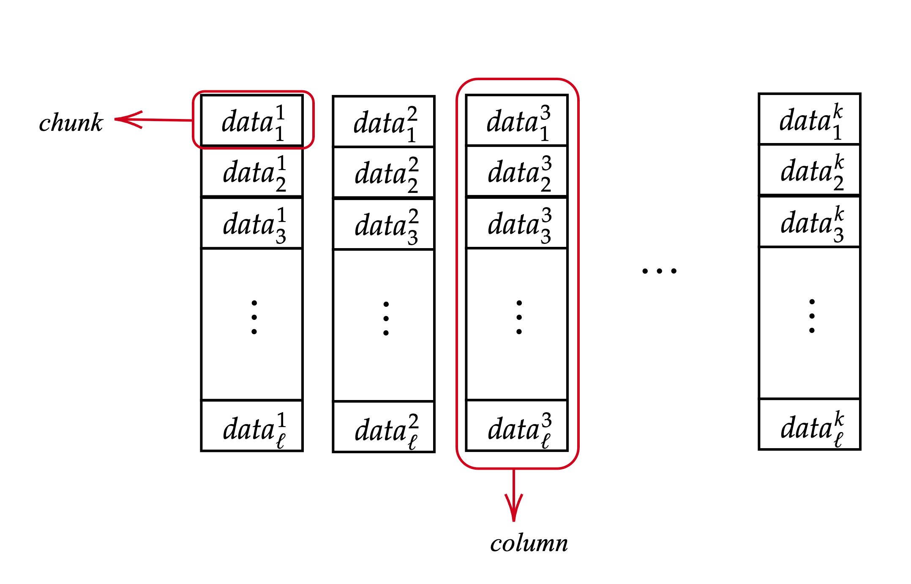
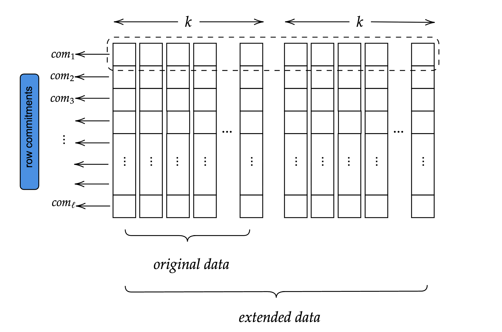
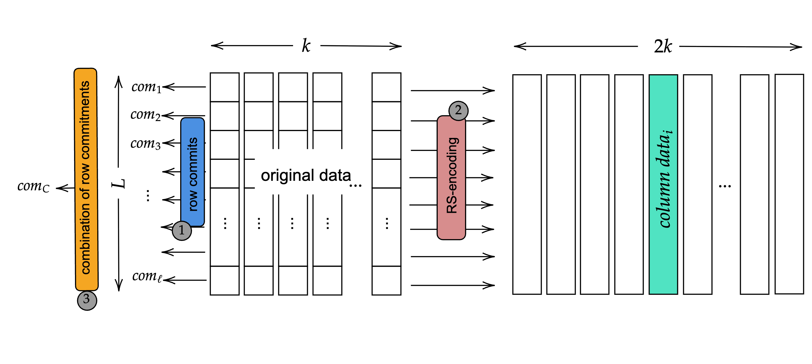
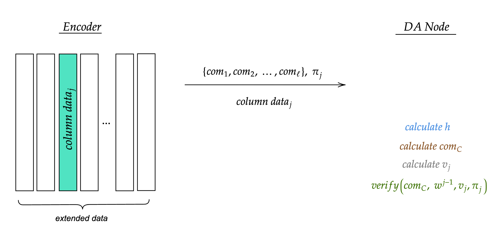
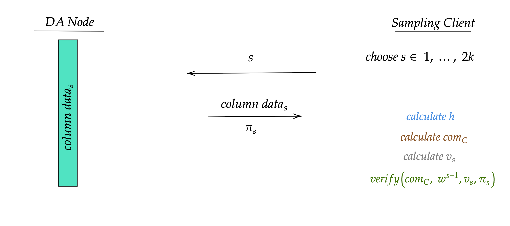

# NOMOSDA-CRYPTOGRAPHIC-PROTOCOL

| Field | Value |
| --- | --- |
| Name | NomosDA Cryptographic Protocol |
| Slug | |
| Status | raw |
| Category | Standards Track |
| Editor | Mehmet Gonen <mehmet@status.im> |
| Contributors | Álvaro Castro-Castilla <alvaro@status.im>, Thomas Lavaur <thomaslavaur@status.im>, Daniel Kashepava <danielkashepava@status.im>, Marcin Pawlowski <marcin@status.im>, Daniel Sanchez Quiros <danielsq@status.im>, Filip Dimitrijevic <filip@status.im> |

## Abstract

This document describes the cryptographic protocol underlying NomosDA,
the data availability (DA) layer for the Nomos blockchain.
NomosDA ensures that all blob data submitted is made available and verifiable
by all network participants, including sampling clients and validators.
The protocol uses Reed–Solomon erasure coding for data redundancy
and KZG polynomial commitments for cryptographic verification,
enabling efficient and scalable data availability sampling.

**Keywords:** NomosDA, data availability, KZG, polynomial commitment,
erasure coding, Reed-Solomon, sampling, BLS12-381

## Semantics

The keywords "MUST", "MUST NOT", "REQUIRED", "SHALL", "SHALL NOT",
"SHOULD", "SHOULD NOT", "RECOMMENDED", "MAY", and "OPTIONAL"
in this document are to be interpreted as described in [RFC 2119][rfc-2119].

### Definitions

| Terminology | Description |
| ----------- | ----------- |
| Blob | A unit of data submitted to NomosDA for availability guarantees. |
| Chunk | A 31-byte field element in the BLS12-381 scalar field. |
| DA Node | A node responsible for storing and serving column data. |
| Encoder | The entity that transforms blob data into encoded form with proofs. |
| Sampling Client | A client (e.g., light node) that verifies availability by sampling columns. |
| KZG Commitment | A polynomial commitment using the Kate-Zaverucha-Goldberg scheme. |
| Reed-Solomon Coding | An erasure coding scheme used for data redundancy. |
| Row Polynomial | A polynomial interpolated from chunks in a single row. |
| Combined Polynomial | A random linear combination of all row polynomials. |

### Notations

| Symbol | Description |
| ------ | ----------- |
| $f_i(x)$ | Polynomial interpolated from the chunks in row $i$. |
| $com_i$ | KZG commitment of the row polynomial $f_i(x)$. |
| $f_C(x)$ | Combined polynomial formed as a random linear combination of all row polynomials. |
| $com_C$ | KZG commitment of the combined polynomial $f_C(x)$. |
| $w$ | Primitive $n$-th root of unity in the finite field. In this protocol, $n = 2k$. |
| $h$ | Random scalar generated using the Fiat–Shamir heuristic from row commitments. |
| $\pi_j$ | KZG evaluation proof for column $j$ of the combined polynomial. |
| $v_j$ | Combined evaluation of column $j$ (i.e., $f_C(w^{j-1})$). |
| $k$ | Number of columns in the original data matrix. |
| $\ell$ | Number of rows in the data matrix. |

## Background

To achieve data availability,
the blob data is first encoded using Reed–Solomon erasure coding
and arranged in a matrix format.
Each row of the matrix is interpreted as a polynomial
and then committed using a KZG polynomial commitment.
The columns of this matrix are then distributed across a set of decentralized DA nodes.

Rather than requiring individual proofs for each chunk,
NomosDA uses a random linear combination of all row polynomials
to construct a single combined polynomial.
This allows for generating one proof per column,
which enables efficient and scalable verification without sacrificing soundness.
Sampling clients verify availability by selecting random columns
and checking that the data and proof they receive
are consistent with the committed structure.
Because each column intersects all rows,
even a small number of sampled columns provides strong confidence
that the entire blob is available.

### Protocol Stages

The protocol is structured around three key stages:

1. **Encoding**: Transform blob data into a matrix with commitments and proofs.
1. **Dispersal**: Distribute columns to DA nodes for storage.
1. **Sampling**: Verify data availability by sampling random columns.

### Design Principles

The reason for expanding the original data row-wise
is to ensure data availability by sending a column to each DA node
and obtaining a sufficient number of responses from different DA nodes for sampling.
Three core commitment types are used, and verification is done via column sampling:

- **Row commitment**: Ensures the integrity of the original and RS-encoded data
  and binds the order of chunks within each row.

- **Combined commitment**: Constructed by the verifier
  using a random linear combination of the row commitments.
  Used to verify the encoder's single proof per column
  and ensures that the column data is consistent with the committed row structure.
  Even if a single chunk is invalid,
  the combined evaluation will likely fail
  due to the unpredictability of the random coefficients.

- **Column sampling**: Allows sampling clients to verify data availability efficiently
  by checking a small number of columns.
  With the combined commitment and a single proof,
  the sampling client can validate that an entire column
  is consistent with the committed data.

## Protocol Specification

### Encoding

In the NomosDA protocol, encoders perform the encoding process
by dividing the blob data into chunks.
Each chunk represents a 31-byte element
in the scalar finite field used for the BLS12-381 elliptic curve.
31 bytes are chosen instead of 32 bytes
because some 32-byte elements will exceed the BLS12-381 modulus,
making it impossible to recover the data later.

The matrix representation has $k$ columns which include $\ell$ chunks each.
The row and column numbers used in the representation are decided
based on the size of the block data and the number of DA nodes.

*Figure 1: Data matrix structure showing chunks and columns.
Each chunk is a 31-byte element, and each column contains $\ell$ chunks.*

The encoding process consists of three steps:

1. Calculating row commitments.
1. Expanding the original data using RS coding.
1. Computing the combined row polynomial and the combined column proofs.

#### Row Commitments

The original data chunks are considered in the evaluation form,
and unique polynomials are interpolated for each row.
For every row $i$, the encoder interpolates a unique degree $k - 1$ polynomial $f_i$
such that $data^{j}_{i} = f_i(w^{j-1})$ for $i = 1, ..., \ell$ row indices
and $j = 1, ..., k$ column indices.
Recall that $w$ is a primitive element of the field.

Subsequently, 48-byte row commitment values $com_i = com(f_i)$
for these polynomials are computed by the encoder.
These commitments ensure the correct ordering of chunks within each row.

> **Note**: In this protocol, elliptic curves are used as a group,
> thus the entries of $com_i$'s are also elliptic curve points.
> Let the $x$-coordinate of $com_i$ be represented as $com^{x}_{i}$
> and the $y$-coordinate of $com_i$ as $com^{y}_{j}$.
> If you have just $com^{x}_{i}$ and one bit of $com^{y}_{i}$,
> then you can construct $com_i$.
> Therefore, there is no need to use both coordinates of $com_i$.
> However, for the sake of simplicity in this document, the value $com_i$ is used.

#### Reed-Solomon Expansion

Using RS coding, the encoder extends the original data row-wise
to obtain the expanded data matrix.
The expansion is calculated by evaluating the row polynomials $f_i$
at the new points $w^{j}$ where $j = k + 1, k + 2, \ldots, 2k$.
The current design of NomosDA uses an expansion factor of 2,
but it can also work with different factors.
This expanded data matrix has rows of length $2k$.

*Figure 2: Extended data matrix showing original data ($k$ columns)
and extended data ($2k$ columns total) after Reed-Solomon expansion.*

Due to the homomorphic property of KZG,
the row commitment values calculated in the previous step
are also valid for the row polynomials of the extended data.

#### Combined Row Commitment and Column Proofs

To eliminate the need for generating one proof per chunk,
a more efficient technique using random linear combinations of row polynomials is used,
allowing only one proof to be generated per column
while still ensuring the validity of all underlying row data.

*Figure 3: Complete encoding pipeline showing row commitments (step 1),
RS-encoding (step 2), and combined row commitment with column data (step 3).*

This process consists of the following steps:

##### Compute the Random Linear Combination Polynomial

Let each row $i \in \{1, \ldots, \ell\}$ have an associated polynomial $f_i(x)$
and commitment $com_i = com(f_i)$.

The encoder computes random scalar $h \in \mathbb{F}$ using the Fiat–Shamir heuristic,
applying the BLAKE2b hash function with a 31-byte output,
over the row commitments with a domain separation tag `DA_V1`
to ensure uniqueness and prevent cross-protocol collisions:

$$h = \text{Hash}(\text{'DA\_V1'} \| com_1 \| \ldots \| com_{\ell})$$

The resulting digest is interpreted as a field element
in the scalar field of BLS12-381.

Then, the encoder computes the combined polynomial $f_C(x)$, defined as:

$$f_C(x) = f_1(x) + h \cdot f_2(x) + h^{2} \cdot f_3(x) + \cdots + h^{\ell-1} \cdot f_{\ell}(x)$$

The corresponding commitment to this polynomial is $com(f_C)$.
This value does not need to be computed by the encoder,
since the verifier can derive it directly from the row commitments
using the same random scalar $h$.

##### Compute Combined Evaluation Points per Column

For each column $j \in \{1, \ldots, 2k\}$, the encoder has the set of column values
$\{data^{j}_{1}, data^{j}_{2}, \ldots, data^{j}_{\ell}\}$,
where each value corresponds to $f_i(w^{j-1})$.

The encoder computes the combined evaluation value at column position $j$ directly:

$$v_j = f_C(w^{j-1})$$

##### Generate One Proof per Column

For each column index $j$, the encoder computes a single KZG evaluation proof
$\pi_j$ for the combined polynomial $f_C(x)$ at the evaluation point $w^{j-1}$:

$$eval(f_C, w^{j-1}) \rightarrow (v_j, \pi_j)$$

The result is a set of $2k$ evaluation proofs,
one for each column, derived from the combined row structure.

### Dispersal

The encoder sends the following information to a DA node
in the subnet corresponding to the expanded column number $j$:

- The row commitments $\{com_1, com_2, \ldots, com_{\ell}\}$.
- The column chunks $\{data^{j}_{1}, data^{j}_{2}, \ldots, data^{j}_{\ell}\}$.
- The combined proof of the column chunks $\pi_j$.

This information is also replicated by the receiving node
to every other node in the subnet.

### Verification

A DA node that receives the column information described above
performs the following checks:

*Figure 4: Dispersal and verification flow from Encoder to DA Node.
The DA Node receives row commitments, column data, and combined proof,
then verifies by calculating $h$, $com_C$, and $v_j$.*

1. The DA node computes the scalar challenge $h \in \mathbb{F}$
   using a Fiat–Shamir hash over the row commitments with a domain separation tag:

   $$h = \text{Hash}(\text{'DA\_V1'} \| com_1 \| com_2 \| \ldots \| com_{\ell})$$

1. The DA node computes the combined commitment $com_C$:

   $$com_C = com_1 + h \cdot com_2 + h^{2} \cdot com_3 + \cdots + h^{\ell-1} \cdot com_{\ell}$$

   This is the commitment of the following polynomial:

   $$f_C(x) = f_1(x) + h \cdot f_2(x) + h^{2} \cdot f_3(x) + \cdots + h^{\ell-1} \cdot f_{\ell}(x)$$

1. The DA node computes:

   $$v_j = data^{j}_{1} + h \cdot data^{j}_{2} + h^{2} \cdot data^{j}_{3} + \cdots + h^{\ell-1} \cdot data^{j}_{\ell}$$

   This represents $f_C(w^{j-1})$, the evaluation of the combined polynomial
   at the corresponding column index.

1. The DA node verifies that $\pi_j$ is a valid proof:

   $$\text{Verify}(com_C, w^{j-1}, v_j, \pi_j) \rightarrow \text{true/false}$$

### Sampling

A sampling client, such as a light node, selects a random column index $s \in \{1, \ldots, 2k\}$.
It sends a request for column $s$ to a DA node hosting that column's data.
The DA node sends the client the column data $data^{s}_{i}$ and the combined proof $\pi_s$.

*Figure 5: Sampling flow between DA Node and Sampling Client.
The client requests a random column index $s$, receives the column data and proof,
then verifies by calculating $h$, $com_C$, and $v_s$.*

> **Note**: The row commitments $\{com_1, \ldots, com_{\ell}\}$ for a given blob are public
> and remain unchanged across multiple queries to that blob.
> If a sampling client has already obtained them,
> it does not need to request them again.

The verification process run by the sampling client proceeds as follows:

1. Compute the scalar $h \in \mathbb{F}$ using the domain-separated Fiat–Shamir hash:

   $$h = \text{Hash}(\text{'DA\_V1'} \| com_1 \| com_2 \| \ldots \| com_{\ell})$$

1. Compute the combined commitment $com_C$:

   $$com_C = com_1 + h \cdot com_2 + h^{2} \cdot com_3 + \cdots + h^{\ell-1} \cdot com_{\ell}$$

1. Compute the combined evaluation value $v_s$ using the received column data:

   $$v_s = data^{s}_{1} + h \cdot data^{s}_{2} + h^{2} \cdot data^{s}_{3} + \cdots + h^{\ell-1} \cdot data^{s}_{\ell}$$

1. Verify the evaluation proof:

   $$\text{Verify}(com_C, w^{s-1}, v_s, \pi_s) \rightarrow \text{true/false}$$

If these checks succeed, then this proves to the sampling client
that the column $s$ is correctly encoded and matches the committed data.
The sampling client can query several columns
to reach a local opinion on the availability of the entire data.

## Security Considerations

### Fiat–Shamir Security

The random scalar $h$ MUST be computed using the Fiat–Shamir heuristic
with the domain separation tag `DA_V1` to prevent cross-protocol attacks.
The hash function MUST be BLAKE2b with a 31-byte output.

### Chunk Size

Chunks MUST be 31 bytes to ensure they fit within the BLS12-381 scalar field modulus.
Using 32-byte chunks would cause some values to exceed the modulus,
making data recovery impossible.

### Column Sampling Confidence

The more columns a sampling client verifies,
the higher confidence it has in the availability of the entire blob.
Implementations SHOULD sample a sufficient number of columns
to achieve the desired confidence level.

### Proof Validity

If a single chunk is invalid,
the combined evaluation will likely fail verification
due to the unpredictability of the random coefficients.
This provides strong guarantees against malicious encoders
attempting to hide invalid data.

---

## Part II: Implementation Considerations

> **IMPORTANT**: The sections above define the normative protocol requirements.
> All implementations MUST comply with those requirements.
>
> **The sections below are non-normative**.
> They provide mathematical background for implementers
> unfamiliar with the underlying cryptographic concepts.

### Mathematical Background

#### Polynomial Interpolation

Polynomial interpolation is the process of creating a unique polynomial from a set of data.
In NomosDA, univariate interpolation is used,
where each polynomial is defined over a single variable.
There are two main ways to represent polynomials:

**Coefficient form:**
Given a set of coefficients $a_0, a_1, \ldots, a_k \in \mathbb{F}$,
a unique polynomial $f(x)$ of degree at most $k$ in coefficient form is:

$$f(x) = a_0 + a_1 x + a_2 x^{2} + \cdots + a_k x^{k}$$

If $a_k \neq 0$, then the degree of $f$ is exactly $k$.

**Evaluation form:**
Let $w \in \mathbb{F}$ be a primitive $k$-th root of unity in the field,
i.e., $w^{k} = 1$ and $w^{i} \neq 1$ for all $1 \leq i < k$.
Given a dataset $a_0, a_1, \ldots, a_{k-1}$,
there exists a unique polynomial $f$ in $\mathbb{F}[X]$ of degree less than $k$ such that:

$$f(w^{i}) = a_i \quad \text{for all } i = 0, 1, \ldots, k - 1$$

This representation of a polynomial using its values at $k$ distinct points
is called the evaluation form.

#### KZG Polynomial Commitment

The KZG polynomial commitment scheme provides a way
to commit to a polynomial and provide a proof for an evaluation of this polynomial.
This scheme has 4 steps: setup, polynomial commitment, proof evaluation, and proof verification.

The setup phase generates a structured reference string (SRS)
and is required only once for all future uses of the scheme.
The prover performs the polynomial commitment and proof generation steps,
while the verifier checks the validity of the proof
against the commitment and the evaluation point.

**Setup:**

1. Choose a generator $g$ of a pairing-friendly elliptic curve group $G$.
1. Select the maximum degree $d$ of the polynomials to be committed to.
1. Choose a secret parameter $\tau$ and compute global parameters
   $gp = (g, g^{\tau}, g^{\tau^{2}}, \ldots, g^{\tau^{d}})$.
   Delete $\tau$ and release the parameters publicly.

> **Note**: The expression $g^{a}$ refers to elliptic curve point addition, i.e.,
> $g^{a} = a * g = g + g + \cdots + g$
> where $g$ is the generator point of the group $G$.
> This is known as multiplicative notation.

**Polynomial Commitment:**
Given a polynomial $f(x) = \sum_{i=0}^{d} a_i x^{i}$, compute the commitment of $f$ as follows:

$$com(f) = g^{f(\tau)} = (g)^{a_0} (g^{\tau})^{a_1} (g^{\tau^{2}})^{a_2} \cdots (g^{\tau^{d}})^{a_d}$$

**Proof Evaluation:**
Given an evaluation $f(u) = v$, compute the proof $\pi = g^{q(\tau)}$,
where $q(x) = \frac{f(x) - v}{x - u}$ is called the quotient polynomial
and it is a polynomial if and only if $f(u) = v$.

**Proof Verification:**
Given commitment $C = com(f)$, the evaluation point $u$, the evaluation $f(u) = v$,
and proof $\pi = g^{q(\tau)}$, verify that:

$$e\left(\frac{C}{g^{v}}, g\right) = e\left(\pi, \frac{g^{\tau}}{g^{u}}\right)$$

where $e$ is a non-trivial bilinear pairing.

> **Note**: The evaluation of the polynomial commitment to the function $f$
> at the point $u$, yielding the result $v$ and evaluation proof $\pi$,
> is represented as: $eval(f, u) \rightarrow v, \pi$.
> The verification function is defined as: $verify(com(f), u, v, \pi) \rightarrow \text{true/false}$.

#### Random Linear Combination of Commitments and Evaluations

When multiple committed polynomials are evaluated at the same point,
it's possible to verify all evaluations using a single combined proof,
thanks to the homomorphic properties of KZG commitments.
This technique improves efficiency by reducing multiple evaluation proofs to just one.

Suppose there are $\ell$ polynomials $f_1(x), f_2(x), \ldots, f_{\ell}(x)$
with corresponding commitments $C_i = com(f_i)$,
and the goal is to verify that each $f_i(u) = v_i$.

Instead of generating $\ell$ separate proofs and performing $\ell$ pairing checks:

1. Use the Fiat–Shamir heuristic to derive deterministic random scalars
   $h_1, h_2, \ldots, h_{\ell}$ from the commitments $C_1, \ldots, C_{\ell}$:

   $$(h_1, \ldots, h_{\ell}) = \text{Hash}(C_1 \| \ldots \| C_{\ell})$$

1. Form the combined polynomial:

   $$f_C(x) = \sum_{i=1}^{\ell} h_i \cdot f_i(x)$$

1. Compute the combined evaluation:

   $$v = f_C(u) = \sum_{i=1}^{\ell} h_i \cdot v_i$$

1. Compute the proof $\pi$ for $f_C(u) = v$ using the standard KZG method:

   $$\pi = g^{q(\tau)} \quad \text{where} \quad q(x) = \frac{f_C(x) - v}{x - u}$$

**Verification:**
Given commitments $C_1, \ldots, C_{\ell}$, evaluation point $u$ and value $v = f_C(u)$,
and proof $\pi = g^{q(\tau)}$:

The verifier calculates the combined commitment $C = com(f_C)$
using random scalars $h_1, h_2, \ldots, h_{\ell}$:

$$(h_1, \ldots, h_{\ell}) = \text{Hash}(C_1 \| \ldots \| C_{\ell})$$

$$C = h_1 \cdot com_1 + h_2 \cdot com_2 + \cdots + h_{\ell} \cdot com_{\ell}$$

and checks:

$$e\left(\frac{C}{g^{v}}, g\right) \stackrel{?}{=} e\left(\pi, \frac{g^{\tau}}{g^{u}}\right)$$

This ensures that all original evaluations $f_i(u) = v_i$ are correct
with a single proof and a single pairing check.
Since the random scalars $h_i$ are generated via Fiat–Shamir,
any incorrect $v_i$ will almost certainly cause the combined evaluation to fail verification.

#### Reed-Solomon Erasure Coding

Reed-Solomon coding, also known as RS coding, is an error-correcting code
based on the fact that any $n$-degree polynomial
can be uniquely determined by $n + 1$ points satisfying the polynomial equation.
It uses the interpreted polynomial over the data set
to produce more points in a process called expansion or encoding.
Once the data is expanded, any $n$ elements of the total set of points
can be used to reconstruct the original data.

#### Pairing Details

Let $(G_1, .)$, $(G_2, .)$, and $(G_T, .)$ be three cyclic groups of large prime order.
A map $e : G_1 \times G_2 \rightarrow G_T$ is a pairing map such that:

$$e(g^{x}, g^{y}) = e(g, g)^{xy} = e(g, g^{xy})$$

Given $g^{x}$ and $g^{y}$, a pairing can check that some element $h = g^{xy}$
without knowing $x$ and $y$.

For the KZG commitment scheme to work, a so-called trusted setup is needed,
consisting of a structured reference string (SRS).
This is a set of curve points in $G_1$ and $G_2$.
For a field element $u \in \mathbb{F}_q$, define $u * g_i = g^{u}_{i}$.
The SRS consists of two sequences of group elements:

$$g^{0}_{1}, g^{\tau}_{1}, g^{\tau^{2}}_{1}, g^{\tau^{3}}_{1}, \ldots, g^{\tau^{D}}_{1} \in G_1$$

$$g^{0}_{2}, g^{\tau}_{2}, g^{\tau^{2}}_{2}, g^{\tau^{3}}_{2}, \ldots, g^{\tau^{K}}_{2} \in G_2$$

where $\tau \in \mathbb{F}_q$ is a secret field element, not known by either participant.
$g_1$ is the generator point of $G_1$ and $g_2$ is the generator point of $G_2$.
$D$ is the upper bound for the degree of the polynomials that can be committed to,
and $K$ is the maximum number of evaluations to be proven using a batched proof.

**Verify Operation:**
To verify an evaluation proof, the verifier checks the following equation:

$$q(x)(x - u) = f(x) - f(u) = f(x) - v$$

As the verifier does not have access to the actual polynomials $f$ and $q$,
the next best thing would be to check that:

$$com(q) \cdot (x - u) = com(f - v)$$

Expanding the definition of $com$:

$$g^{q(\tau)(\tau - u)}_{1} = g^{f(\tau) - v}_{1}$$

For elliptic curve additive notation this is equivalent to:

$$q(\tau)(\tau - u) * g_1 = f(\tau) * g_1 - v * g_1$$

Now there is a problem, namely, the multiplication on the left-hand side.
Pairings allow us to get away with one multiplication.
So the verifier actually checks:

$$e(com(q), (\tau * g_2 - u * g_2)) = e(com(f) - v * g_1, g_2)$$

i.e.,

$$e(q(\tau) * g_1, (\tau * g_2 - u * g_2)) = e(f(\tau) * g_1 - v * g_1, g_2)$$

This works because of the bilinearity property of elliptic curve pairings:

$$e(a * g_1, b * g_2) = e(g_1, g_2)^{ab}$$

## References

### Normative

- [BLS12-381][bls12-381] - BLS12-381 elliptic curve specification

### Informative

- [NomosDA Cryptographic Protocol][origin-ref] - Original specification document
- [Elliptic Curve Pairings][ec-pairings] - Background on elliptic curve pairings

[rfc-2119]: https://www.ietf.org/rfc/rfc2119.txt
[origin-ref]: https://nomos-tech.notion.site/NomosDA-Cryptographic-Protocol-1fd261aa09df816fa97ac81304732e77
[bls12-381]: https://hackmd.io/@benjaminion/bls12-381
[ec-pairings]: https://vitalik.ca/general/2017/01/14/exploring_ecp.html

## Copyright

Copyright and related rights waived via [CC0](https://creativecommons.org/publicdomain/zero/1.0/).
