# EXECUTION-MARKET

| Field | Value |
| --- | --- |
| Name | Execution Market |
| Slug | 201 |
| Status | raw |
| Category | Standards Track |
| Editor | Juan Pablo Madrigal-Cianci <jp@logos.co> |
| Contributors | Filip Dimitrijevic <filip@logos.co> |

<!-- timeline:start -->

## Timeline

- **2026-05-27** — [`b7602ed`](https://github.com/logos-co/logos-lips/blob/b7602ed8a225d41ca0bfaaa432524dc84d2ded7e/docs/blockchain/raw/execution-market.md) — chore: move blockchain specs from notion to github

<!-- timeline:end -->

# Revisions History

| Version | Changes | Date |
| --- | --- | --- |
| 1.0.0 | Initial revision | 2026-04-24 |
| 1.0.1 | Fix base fee constants in pseudocode based on the correct $`G_{\mathrm{target}}`$ | 2026-07-27 |
| 1.1.0 | Round the base fee update upwards | 2026-07-28 |
| 1.2.0 | Cap the base fee at MAX_PRICE and require widened arithmetic for the update product | 2026-08-04 |

> Disclaimer:
> This material, including any linked pages or documents, is provided for informational purposes only. It does not constitute investment advice, a solicitation, or an offer to buy or sell any securities, tokens, or other financial instruments, nor should it be construed as legal, financial, or tax advice.
>
> All information regarding project details, token design, distribution mechanisms, technical parameters, and any forward-looking statements is preliminary and subject to change without notice. No representations or warranties are made as to the completeness or accuracy of the information herein. 
>
> Nothing in this material should be relied upon for investment or business decisions. Recipients of this information assume all risks associated with its use and are responsible for seeking independent professional advice regarding any actions based on it.

# Introduction

## Objectives

This specification details the transaction fee mechanism (TFM) for the Logos Blockchain Execution Market, which encompasses the finite resources of on-chain computation. The design is engineered to achieve four primary, interconnected objectives:

1. To implement a market that allocates execution resources to transactions that derive the highest economic value from it, ensuring the network's limited capacity is used to maximize total utility.
1. To create an environment where the process of bidding for execution is intuitive and the transaction costs are predictable. This is paramount for fostering a healthy developer ecosystem and serving the professional entities that are the intended primary users of the Logos Blockchain network.
1. To design a system of rules where the dominant, profit-maximizing strategy for all participants (users and block builders) is to behave honestly and in accordance with the protocol's intended function. This minimizes the potential for manipulative behaviors like transaction censorship or mempool gaming.
1. To ensure that network usage contributes directly to the economic value of the native Logos Blockchain token, creating a positive feedback loop between network adoption and the health of its underlying asset.

## Design Rationale

The design is founded on a target-based mechanism, philosophically aligned with Ethereum's EIP-1559. This model is crucial for long-term network health and security, as it actively steers execution utilization around a predefined target. This ensures the network remains performant and accessible for nodes with minimal hardware specifications, thereby promoting decentralization.

To further enhance security, this specification addresses a known vulnerability in the classic EIP-1559 design. As demonstrated by recent research ([Cachin et al., 2023](https://arxiv.org/pdf/2304.11478)), EIP-1559 is susceptible to base fee manipulation by rational, non-myopic block builders. Our design incorporates a direct mitigation for this threat, as proposed in [Cachin et al., 2023](https://arxiv.org/pdf/2304.11478): an Exponential Moving Average (EMA) based update rule for the base fee. Given the EMA nature of this update, these enhancements smooth fluctuations in execution gas consumption, making the protocol significantly more resilient to strategic manipulation without compromising its core benefits of responsiveness and predictability

Furthermore, as opposed to the standard EIP-1559 mechanism, where base fee is burned and tips are immediately given to miners, in our setting we burn fees, and later, we mint rewards to which we add tips which are given to the block builders at a later block through the [Anonymous Leaders Reward Protocol](bedrock-anonymous-leaders-reward.md), for privacy preservation.

# Overview

Our fee mechanism adapts Ethereum's EIP-1559 to the specific economic and security goals of the Logos Blockchain network. It provides predictable execution gas costs for users while creating a robust incentive structure for block builders and Blend nodes that minimizes harmful emergent strategies.

The mechanism operates on four core principles:

- Dynamic Base Fee: A protocol-defined base_fee for Execution Gas must be paid for a transaction to be included in a block. This fee adjusts automatically based on a smoothed average of recent network demand relative to a predefined capacity target, ensuring sustainable network load. This base_fee is the minimal threshold to be paid for the transaction to be accepted by the block builder.
- Priority Fee (Tip): To incentivize faster inclusion by block builders, users add a priority_fee on top of the base fee. This creates a simple and transparent auction for block space during periods of high demand. The proceeds of this goes to the block builder.
- Fee Splitting and Deflation: The two fee components are treated differently. The entire base_fee is burned, permanently removing it from the supply. This creates a direct link between network activity and the economic value of the native token, applying deflationary pressure as usage grows. The priority_fee is not immediately distributed to the block builder (to preserve privacy), but instead it is directed into the block builders reward stream. 40% of the rewards will be allocated to block builders and the remaining 60% to Blend nodes. Rewards are privacy-preserving via [Anonymous Leaders Reward Protocol](bedrock-anonymous-leaders-reward.md).

The entire lifecycle can be visualized in the following flow:



## Incentive Analysis

- User Strategy: The mechanism promotes a straightforward bidding strategy. A rational user should set their execution_gas_price ($`c_t`$) to their true maximum willingness to pay. Setting it higher provides no advantage and risks overpayment, while setting it lower risks the transaction being delayed if the base_fee rises. The priority_fee acts as a simple tip to gauge the market rate for priority inclusion during congestion.
- Block Builder Strategy: The dominant strategy for a rational, profit-maximizing block builder is to follow the prescribed block construction algorithm honestly. The block builder's revenue is derived from (a) priority fees and (b) block rewards in accordance with network Key Performance Indicators (KPIs) as described in [Block Rewards](block-rewards.md), which incentivize them to include the transactions that maximize their revenue. Because the base_fee is determined algorithmically based on historical data, a block builder cannot manipulate it for their own immediate gain.

## Economic Properties

- Sustainable Resource Management: The TFM automatically steers network usage toward the target ($`G_\text{target}`$). By increasing the cost of Execution Gas during high demand, the protocol prevents network overload. This protects the ability of nodes with modest hardware to participate, safeguarding decentralization.
- Deflationary Pressure: Burning the base_fee (and minting later a proportion of it back as rewards, cf [Block Rewards](block-rewards.md)) establishes a direct link between network activity and the intrinsic economic utility of the Logos Blockchain token. As usage grows, the rate of token burn increases, applying deflationary pressure on the total supply and creating a sustainable economic flywheel.

## Security Properties: Mitigation of Base Fee Manipulation

A critical feature of this design is its resilience to the base fee manipulation attack identified in classic EIP-1559. Our EMA-based update rule directly mitigates this vulnerability in two ways:

1. Impact Dampening: The influence of any single block's Execution Gas consumption (e.g., an empty block) on the fee update is dampened by a factor of ($1q$), preventing sharp, manipulative drops in the base_fee.
1. Exponential Decay: The effect of a manipulative block on subsequent base_fee calculations decays exponentially, making it economically infeasible for an attacker to sustain the attack.

# Construction

## Notation

| Symbol | Name | Value | Description |
| --- | --- | --- | --- |
| $s$ | Block Number | - | The index of a block in the chain. |
| $t$ | Transaction | - | A single transaction submitted by a user. |
| $`g_t`$ | Execution Gas Consumed | - | The actual amount of Execution Gas consumed by transaction $t$ upon execution. |
| $`c_t`$ | Execution Gas Price | - | The user-specified price per unit of execution gas they will pay. |
| $`b_{\mathrm{exec}}[s]`$ | Base Fee | - | The protocol-defined Execution Gas price for inclusion in block $s$. This is initialized at 1 for the first block. |
| $`p_t`$ | Priority Fee | - | The portion of the Execution Gas price that serves as a tip to the block builder ($`p_t = c_t - b_{\mathrm{exec}}[s]`$). |
| $G[s]$ | Total Execution Gas Used | - | The sum of Execution Gas consumed by all transactions in block $s$. |
| $`G_{\mathrm{avg}}[s]`$ | Smoothed Average Execution Gas | - | The Exponential Moving Average (EMA) of Execution Gas used up to block $s$. |
| $`G_{\max}`$ | Max Execution Gas Per Block | 3,193,460 | A protocol constant defining the hard limit on $G[s]$. |
| $`G_{\mathrm{target}}`$ | Target Execution Gas Per Block | 1,596,730 | A protocol constant for the ideal Execution Gas usage. The TFM steers usage towards this target. This is set to half of $`G_{max}`$ execution gas units. |
| $\phi$ | Fee Adjustment Rate | 1/8 | A protocol constant controlling how quickly the base fee adjusts to demand. |
| $q$ | EMA Smoothing Factor | 9/10 | A protocol constant defining the weight of historical average in the EMA update rule. |
| $`F_t`$ | Total fee | - | $`F_t = g_t \,\cdot\bigl(b_{\mathrm{exec}}[s] + p_t\bigr)= g_t\cdot c_t`$ |
| $`\hat{R}_{\mathrm{burned}}[s]`$ | Amount of base fees burnt | - | This is used as an input to compute the block rewards |

### Parameter Justification

We set $\phi=1/8$, which results in up to a $\pm$12.5% increase or decrease in the fee at every block. This choice of parameter is made following empirical evidence on other protocols where it has worked sufficiently well, such as Ethereum (cf. [EIP 1559: A transaction fee market proposal](https://ethereum.github.io/abm1559/notebooks/eip1559.html)).

We set a value of $q=0.9$ as it robustly achieves the primary security goal of mitigating base fee manipulation while retaining sufficient market responsiveness. This setting heavily dampens the influence of any single block's gas usage on the new smoothed average to a mere 10%, making manipulation attacks prohibitively expensive for their limited impact. This is economically equivalent to a lookback period of approximately 19 blocks.

Furthermore, we set $`G_\text{max} = 3,193,460`$ Execution Gas units (cf as explained in [\[Overview\] Cryptoeconomics](overview-cryptoeconomics.md)), and $`G_\text{target} = 1,596,730`$ Execution Gas units. The 50% target creates a perfectly symmetrical buffer, giving the network equal capacity to elastically expand block sizes to absorb demand spikes or contract them during lulls. Any other value would create an asymmetric system, making it either too volatile and over-reactive to demand increases (e.g., a 75% target) or too sluggish to respond to periods of low activity. This rationale is also borrowed from Ethereums EIP-1559 (cf [EIP 1559: A transaction fee market proposal](https://ethereum.github.io/abm1559/notebooks/eip1559.html)) and is also used in ([Base Fee Manipulation In Ethereums EIP-1559 Transaction Fee Mechanism](https://arxiv.org/pdf/2304.11478)).

## Block Builder Mechanism: Block Construction

A rational, profit-maximizing block builder must follow this algorithm to construct a valid and optimal block $s$.

Algorithm Steps:

1. Fetch State: Retrieve the current base fee for the block to be built, $`b_{\mathrm{exec}}[s]`$.
1. Filter Mempool: From the set of all available transactions $`\mathcal{M}`$, create a candidate set $`\mathcal{M}'`$ containing only valid transactions where the user's Execution Gas price cap is sufficient to pay the base fee.

$$
\mathcal{M}' = \{\,t \in \mathcal{M} \mid c_t \ge b_{\mathrm{exec}}[s] \,\}
$$

1. Sort Candidates: Sort the valid transactions in $`\mathcal{M}'`$ in descending order of revenue
1. Greedy Inclusion: Initialize an empty block and a running total for Execution Gas used, current_block_gas = 0. Iterate through the sorted transactions and add them to the block one by one, as long as the block's total Execution Gas does not exceed the $`G_{\max}`$ limit.

Pseudocode for Block Construction:

```python
def construct_block(mempool, base_fee, gt, G_max):
    # Step 2: Filter Mempool
    valid_txs = [tx for tx in mempool if tx.execution_gas_price >= base_fee]
    # Step 3: Sort Candidates by priority fee (descending)
    valid_txs.sort(key=lambda tx: tx.revenue, reverse=True)
    # Step 4: Greedy Inclusion
    block_txs = []
    current_block_gas = 0
    for tx in valid_txs:
        if current_block_gas + tx.gas_limit <= G_max:
            block_txs.append(tx)
            current_block_gas += tx.gas_limit # Using gas_limit for packing
    return block_txs
```

## On-Chain Rules: Fee Update and Revenue

After a block $s$ is executed and its total Execution Gas usage $G[s]$ is known, the protocol deterministically applies the following rules.

### Base Fee Update Rule

The base fee for the next block, $s+1$, is calculated based on the state of block $s$.

1. Total Execution Gas Used: First, sum the actual Execution Gas consumed, $`g_t`$, for all transactions $t$ in the block $`\mathcal{B}_s`$: $`G[s] = \sum_{t \in \mathcal{B}_s} g_t`$.
1. Smoothed Average Update: Update the EMA of Execution Gas usage: $`G_{\mathrm{avg}}[s] = (1 - q) \cdot G[s] + q \cdot G_{\mathrm{avg}}[s-1]`$.
1. Next Base Fee Calculation: Update the base fee for block $s+1$: $`b_{\mathrm{exec}}[s+1] = b_{\mathrm{exec}}[s] \cdot \left(1 + \phi \cdot \frac{G_{\mathrm{avg}}[s] - G_{\mathrm{target}}}{G_{\mathrm{target}}}\right)`$.

Pseudocode for Base Fee Update:

Because base fee computation affects consensus state, the implementation must be fully deterministic across all nodes. For that reason, the normative implementation of the reward function should not rely on floating-point arithmetic, machine-dependent rounding behavior, or comparisons against machine epsilon. Earlier sections use real-valued formulas to explain the mechanism and its economic meaning, but the consensus rule itself should be defined only in terms of integer arithmetic.

The goal of this section is not to change the execution mechanism. It is only to restate the already-specified mechanism in a canonical deterministic form with explicit named constants. Therefore we provide here a reference implementation that uses unsigned integers to have a common reference.

First we rewrite

$$
\begin{align*}
G_{\mathrm{avg}}[s] &= (1 - 0.9) \cdot G[s] + 0.9 \cdot G_{\mathrm{avg}}[s-1]= \frac{G[s] + 9 \cdot G_\text{avg}[s-1]}{10}
\end{align*}
$$

$$
\begin{align*} b_\text{exec}[s+1] &= b_\text{exec}[s]\cdot \left( 1 + \frac{1}{8} \cdot \frac{G_\text{avg}[s] - G_\text{target}}{G_\text{target}} \right)\\
&=b_\text{exec}[s] \cdot \frac{7 \cdot G_\text{target} + G_\text{avg}[s]}{8 \cdot G_\text{target}}
\end{align*}
$$

The integer base fee is obtained by rounding this quantity upwards, while the smoothed average $`G_\text{avg}[s]`$ is rounded downwards:

$$
b_\text{exec}[s+1] = \min\!\left(\mathrm{MAX\_PRICE},\ \left\lceil b_\text{exec}[s] \cdot \frac{7 \cdot G_\text{target} + G_\text{avg}[s]}{8 \cdot G_\text{target}} \right\rceil\right),\qquad G_\text{avg}[s] = \left\lfloor \frac{G[s] + 9 \cdot G_\text{avg}[s-1]}{10} \right\rfloor
$$

with $`\mathrm{MAX\_PRICE} = \left\lfloor (2^{64}-1)/G_\text{max} \right\rfloor = 5{,}776{,}413{,}067{,}240`$, justified in [Range Limits](#range-limits) below.

And so we propose the following code reference:

```python
EMA_DENOMINATOR = 10  # from q = 9/10
EMA_PREV_WEIGHT = 9  # from q = 9/10
BASE_FEE_NUMERATOR = 11_177_110  # = 7 * G_target
BASE_FEE_DENOMINATOR = 12_773_840  # = 8 * G_target
MAX_PRICE = 5_776_413_067_240  # = (2^64 - 1) // G_max

def ceil_div(numerator: int, denominator: int) -> int:
    return (numerator + denominator - 1) // denominator

# All arguments and return values are uint64. The numerator is bounded by
# 10 * G_max and stays in uint64.
def update_g_avg(prev_g_avg: int, block_gas_used: int) -> int:
    numerator = block_gas_used + EMA_PREV_WEIGHT * prev_g_avg
    return numerator // EMA_DENOMINATOR

# All arguments and return values are uint64. The numerator MUST be computed
# in uint128: it exceeds 2^64 for base_fee > 1_283_647_348_274 (see Range
# Limits).
def update_base_fee(base_fee: int, g_avg: int) -> int:
    numerator = base_fee * (BASE_FEE_NUMERATOR + g_avg)
    return min(MAX_PRICE, ceil_div(numerator, BASE_FEE_DENOMINATOR))
```

The two rounding directions are not interchangeable. The base fee is multiplied by a factor smaller than one whenever the smoothed average is below the target, so rounding it downwards would make 0 an absorbing state: a base fee of 1 would be mapped to 0 by the first downward update, and every subsequent update would keep it at 0, making execution permanently free. A downward-rounded rule would reach 0 *even under full congestion*: the smoothed average is seeded at 0 and needs approximately 7 full blocks to cross $`G_\text{target}`$, so the first updates of a fresh chain are downward whatever the load, and $`\lfloor 1 \cdot x \rfloor = 0`$ for every $x \lt 1$.

Rounding upwards makes 1 the effective floor of the base fee: whenever $`G_\text{avg}[s] \lt G_\text{target}`$, the update satisfies $`\lceil b \cdot (7 G_\text{target} + G_\text{avg}) / (8 G_\text{target}) \rceil = b`$ exactly for $`b \lt 8 G_\text{target} / (G_\text{target} - G_\text{avg})`$, so no price $\geq 1$ can ever reach 0. Three qualifications apply:

1. Decay from above comes to rest at 7 on an idle network ($`G_\text{avg} = 0`$, where the bound above equals 8), and slightly higher under residual background load, rather than returning to the genesis price of 1. At every higher price level the mechanism is unchanged, as the rounding error is at most one unit against an adjustment of up to $\pm 12.5\%$, though every rounding error is upward, giving the rule a small upward bias relative to the real-valued mechanism.
2. $\lceil 0 \cdot x \rceil = 0$: zero remains an absorbing state in principle. Rounding upwards makes it unreachable from any positive price, not harmless — the genesis price and any future minimum must stay $\geq 1$.
3. The EMA warm-up is unaffected by the rounding direction: the base fee cannot rise during the first $\approx 7$ blocks of a fresh chain even under sustained maximum congestion, because the update factor only exceeds 1 once $`G_\text{avg}[s] \gt G_\text{target}`$. Congestion-response tests must sustain above-target load across multiple blocks to observe any upward movement.

The smoothed average is a measurement rather than a price and is not subject to this failure mode, as it is additive and recovers from 0 as soon as demand resumes. Rounding it upwards would instead pin it at 1 once it has been positive, reporting residual demand on an idle network.

### Range Limits

Every quantity in the fee mechanism is an unsigned 64-bit integer, but the update itself is multiplicative and unbounded above: under sustained full blocks the base fee grows by a factor approaching $9/8$ per block. Two rules keep the base fee and every intermediate product inside their declared ranges:

1. The numerator $`b_\text{exec}[s] \cdot (7 G_\text{target} + G_\text{avg}[s]) + 8 G_\text{target} - 1`$ is computed in uint128, and only the quotient is stored back into a uint64. It exceeds $`2^{64}`$ for a base fee above $`1{,}283{,}647{,}348{,}274`$, so it does not fit in the width that holds the base fee itself.
2. The quotient is clamped to $`\mathrm{MAX\_PRICE} = \lfloor (2^{64}-1)/G_\text{max} \rfloor = 5{,}776{,}413{,}067{,}240`$, the largest base fee for which a full block's fee $`G_\text{max} \cdot b_\text{exec}[s]`$ still fits in uint64.

Neither bound is reachable in practice, because raising the base fee means burning fees at every step of the climb: reaching a base fee $b$ along the $9/8$ ramp burns $`\sum_i G_\text{max} \cdot b \cdot (8/9)^i \approx 9 \cdot G_\text{max} \cdot b`$, so burning a whole $`2^{64}`$ supply reaches only $`\mathrm{MAX\_PRICE}/9`$. The two rules are specified so that the absence of overflow follows from the update function alone, and does not have to be re-derived from the supply cap whenever the gas constants or the token denomination change.

### Fee Distribution

For every transaction t, the effective priority fee is

$$
p_t = c_t - b_{\mathrm{exec}}[s].
$$

The final fee $`F_t`$ paid by the transaction $t$ is:

$$
F_t = g_t \,\cdot\bigl(b_{\mathrm{exec}}[s] + p_t\bigr)= g_t\cdot c_t
$$

Let the amount of Execution fee burnt in a block be:

$$
\hat{R}_{\mathrm{burned}}(s)
= \sum_{t \in \mathcal{B}_s} \bigl(g_t \cdot b_{\mathrm{exec}}[s]\bigr).
$$

This burned quantity is then used as a input for the computation of the block rewards, as described in  [Block Rewards](block-rewards.md).
