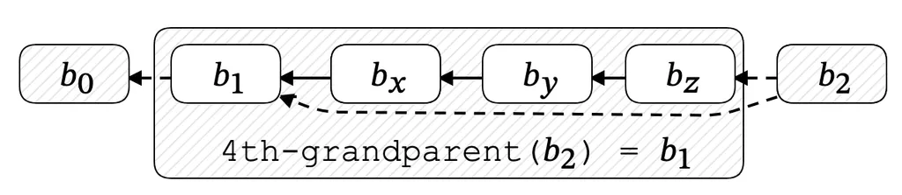

## Abstract

This document describes the consensus mechanism of the fork choice rule,
followed by nodes in the Cryptarchia protocol.
Cryptarchia implements two fork choice rules,
one during node bootstrapping
and the second fork choice once a node is connected to the network.

**Keywords:** fork choice, Cryptarchia, Ouroboros Genesis, Ouroboros Praos,
bootstrapping, long-range attack, consensus

## Semantics

The keywords "MUST", "MUST NOT", "REQUIRED", "SHALL", "SHALL NOT",
"SHOULD", "SHOULD NOT", "RECOMMENDED", "MAY", and "OPTIONAL"
in this document are to be interpreted as described in [RFC 2119][rfc-2119].

### Definitions

| Term | Description |
| ---- | ----------- |
| $k$ | Safety parameter, the depth at which a block is considered immutable. |
| $s_{gen}$ | Sufficient time measured in slots to measure the density of block production with enough statistical significance. In practice, $s_{gen} = \frac{k}{4f}$, where $f$ is the active slot coefficient from the leader lottery. See [Theorem 2 of Badertscher et al., 2018][ouroboros-genesis] for more information. |
| CommonPrefixDepth | A function $\textbf{CommonPrefixDepth}(b_1, b_2) \rightarrow (\mathbb{N}, \mathbb{N})$ that returns the minimum block depth at which the two branches converge to a common chain. |
| density | A function $\textbf{density}(b_i, d, s_{gen})$ that returns the number of blocks produced in the $s_{gen}$ slots following block $b_{i-d}$. |

## Background

In blockchain networks,
the consensus process may encounter multiple competing branches (forks) of the blockchain state.
A Nomos node maintains a local copy of the blockchain state and
connects to a set of peers to download new blocks.

During bootstrapping, Cryptarchia v1 implements [Ouroboros Genesis][ouroboros-genesis] and
[Ouroboros Praos][ouroboros-praos] for the fork choice mechanism.
These translate to two fork choice rules,
the bootstrap rule and the online rule.
This approach is meant to help nodes defend against malicious peers feeding false chains to download.
This calls for a more expensive fork choice rule that can differentiate between malicious long-range attacks and
the honest chain.

### The Long Range Attack

The protocol has a time window for a node, which is the **lottery** leader winner,
to complete a new block.
Nodes with more stake have a higher probability of being selected through the **lottery**.
The **lottery difficulty** is determined by protocol parameters and the node's stake.
The leadership lottery difficulty will adjust dynamically
based on the total stake that is participating in the consensus at the time.
The scenario, which this fork choice rule solves,
is when an adversary forks the chain and
generates a very sparse branch where he is the only winner for an epoch.
This fork would be very sparse
since the attacker does not control a large amount of stake initially.

Each epoch,
the lottery difficulty is adjusted
based on participation in the previous epoch to maintain a target block rate.
When this happens on the adversary's chain,
the lottery difficulty will plummet and
he will be able to produce a chain that has a similar growth rate to the main chain.
The advantage is that his chain is more efficient.
Unlike the honest chain,
which needs to deal with unintentional forks caused by network delays,
the adversary's branch has no wasted blocks.

With this advantage,
the adversary can eventually make up for that sparse initial period and
extend his fork until it's longer than the honest chain.
He can then convince bootstrapping nodes to join his fork,
where he has had a monopoly on block rewards.

#### Genesis Fork Choice Rule Mitigation

When the honest branch and the adversary branch are in the period immediately following the fork,
the honest chain is dense and
the adversary's fork will be quite sparse.
If an honest node had seen the adversary's fork in that period,
it would not have followed this fork since the honest chain would be longer,
so selecting the fork using the longest chain rule is fine for a short-range fork.

If an honest node sees the adversary's fork after he's completed the attack,
the longest chain rule is no longer enough to protect them.
Instead, the node can look at the density of both chains in that short period after they diverge and
select the chain with the higher density of blocks.

#### Praos Fork Choice Rule Mitigation

Under two assumptions:

1. A node has successfully bootstrapped and found the honest chain.
1. Nodes see honest blocks reasonably quickly.

Nodes will remain on the honest chain if they reject forks that diverge further back than $k$ blocks,
without further inspection.
In order for an adversary to succeed,
they would need to build a $k$-deep chain faster than the time it takes the honest nodes to grow the honest chain by $k$ blocks.
The adversary must build this chain live,
alongside the honest chain.
They cannot build this chain after-the-fact,
since online nodes will be rejecting any fork that diverges before their $k$-deep block.

## Protocol Specification

### CommonPrefixDepth Examples

1. $\textbf{CommonPrefixDepth}(b_1, b_2) = (0, 4)$
   implies that $b_2$ is ahead of $b_1$ by 4 blocks.



1. $\textbf{CommonPrefixDepth}(b_2, b_5) = (2, 3)$
   would represent a forking tree like the one illustrated below:


1. $\textbf{density}(b_i, d, s_{gen})$
   returns the number of blocks produced in the $s_{gen}$ slots following block $b_{i-d}$.
   For example, in the following diagram,
   count the number of blocks produced in the $s_{gen}$ slots of the highlighted area.


### Bootstrap Fork Choice Rule

During bootstrapping, the Ouroboros Genesis fork choice rule (`maxvalid-bg`) is used.

```python
def bootstrap_fork_choice(c_local, forks, k, s_gen):
    c_max = c_local
    for c_fork in forks:
        depth_max, depth_fork = common_prefix_depth(c_max, c_fork)
        if depth_max <= k:
            # the fork depth is less than our safety parameter `k`. It's safe
            # to use longest chain to decide the fork choice.
            if depth_max < depth_fork:
                # strict inequality to ensure to choose first-seen chain as the tie break
                c_max = c_fork
        else:
            # here the fork depth is larger than our safety parameter `k`.
            # It's unsafe to use the longest chain here, instead check the density
            # of blocks immediately after the divergence.
            if density(c_max, depth_max, s_gen) < density(c_fork, depth_fork, s_gen):
                # The denser chain immediately after the divergence wins.
                c_max = c_fork
    return c_max
```

### Online Fork Choice Rule

When `bootstrap-rule` is complete,
a node SHOULD switch to the `online-rule`.
See [CRYPTARCHIA-V1-BOOTSTRAPPING-SYNCHRONIZATION][bootstrap] for more information on bootstrapping.
With the `online-rule` flag,
the node SHOULD now reject any forks that diverge further back than $k$ blocks.

```python
def online_fork_choice(c_local, forks, k):
    c_max = c_local
    for c_fork in forks:
        depth_max, depth_fork = common_prefix_depth(c_max, c_fork)
        if depth_max <= k:
            # the fork depth is less than our safety parameter `k`. It's safe
            # to use the longest chain to decide the fork choice.
            if depth_max < depth_fork:
                # strict inequality to ensure to choose the first-seen chain as our tie break
                c_max = c_fork
        else:
            # The fork depth is larger than our safety parameter `k`.
            # Ignore this fork.
            continue
    return c_max
```

## Security Considerations

### Long-Range Attack Resistance

The bootstrap fork choice rule provides resistance against long-range attacks
by comparing chain density in the period immediately following divergence.
Implementations MUST use the Genesis fork choice rule during bootstrapping
to protect against adversaries who have built alternative chains over extended periods.

### Safety Parameter Selection

The safety parameter $k$ determines the depth at which blocks are considered immutable.
Implementations SHOULD choose $k$ based on the expected network conditions and
the desired security guarantees.
A larger $k$ provides stronger security but requires longer confirmation times.

### Online Rule Assumptions

The online fork choice rule assumes that nodes have successfully bootstrapped
and are receiving honest blocks in a timely manner.
If these assumptions are violated,
nodes MAY be vulnerable to attacks and
SHOULD fall back to the bootstrap rule.

## References

### Normative

- [CRYPTARCHIA-V1-BOOTSTRAPPING-SYNCHRONIZATION][bootstrap] - Bootstrapping and synchronization protocol

### Informative

- [Ouroboros Genesis][ouroboros-genesis] - Composable Proof-of-Stake Blockchains with Dynamic Availability
- [Ouroboros Praos][ouroboros-praos] - An adaptively-secure, semi-synchronous proof-of-stake blockchain
- [Cryptarchia Fork Choice Rule][origin-ref] - Original specification

[rfc-2119]: https://www.ietf.org/rfc/rfc2119.txt
[bootstrap]: ./bootstrap.md
[ouroboros-genesis]: https://eprint.iacr.org/2018/378.pdf
[ouroboros-praos]: https://eprint.iacr.org/2017/573.pdf
[origin-ref]: https://nomos-tech.notion.site/Cryptarchia-Fork-Choice-Rule-21b261aa09df811584dfd362abb26627

## Copyright

Copyright and related rights waived via [CC0](https://creativecommons.org/publicdomain/zero/1.0/).
