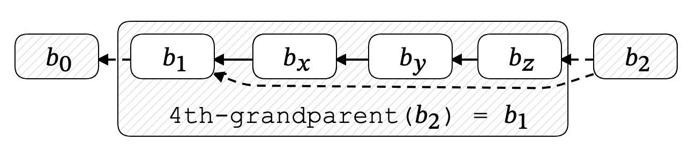
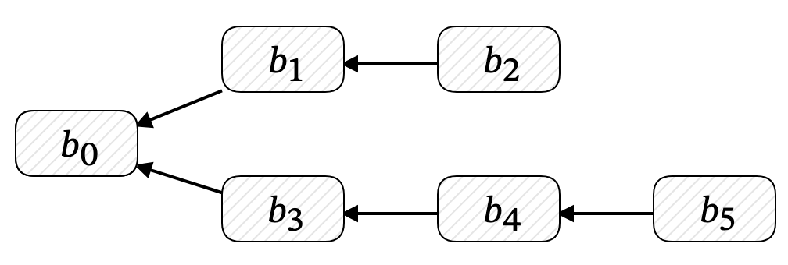
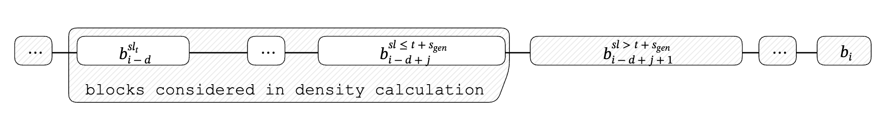

# CRYPTARCHIA-FORK-CHOICE-RULE

| Field | Value |
| --- | --- |
| Name | Cryptarchia Fork Choice Rule |
| Slug | 147 |
| Status | raw |
| Category | Standards Track |
| Editor | David Rusu <davidrusu@logos.co> |
| Contributors | Jimmy Debe <jimmy@logos.co>, Filip Dimitrijevic <filip@logos.co> |

<!-- timeline:start -->

## Timeline

- **2026-05-27** — [`b7602ed`](https://github.com/logos-co/logos-lips/blob/b7602ed8a225d41ca0bfaaa432524dc84d2ded7e/docs/blockchain/raw/fork-choice.md) — chore: move blockchain specs from notion to github
- **2026-05-18** — [`58b5698`](https://github.com/logos-co/logos-lips/blob/58b56988429f4d69a9e10a9fc118725e229e37c5/docs/blockchain/raw/fork-choice.md) — chore(blockchain): migrate contributor emails to @logos.co (#338)
- **2026-05-11** — [`1ac7689`](https://github.com/logos-co/logos-lips/blob/1ac7689ee3fe1665d5d5d1bf9c180ed951cc660d/docs/blockchain/raw/fork-choice.md) — chore: split ift ts specs (#334)
- **2026-01-30** — [`0ef87b1`](https://github.com/logos-co/logos-lips/blob/0ef87b1ba9491c854e48c8dfd7574d34ec69c704/docs/blockchain/raw/fork-choice.md) — New RFC: CODEX-MANIFEST (#191)
- **2026-01-29** — [`a428c03`](https://github.com/logos-co/logos-lips/blob/a428c0370733bdeadc019952a49264443d27edd0/docs/blockchain/raw/fork-choice.md) — New RFC: NOMOS-FORK-CHOICE (#247)

<!-- timeline:end -->

# Revision History

| **Version** | **Changes** | **Date** |
| --- | --- | --- |
| 1.0.0 | Initial revision. | 2026-02-17 |

# Introduction

Cryptarchia makes use of two fork choice rules, one during bootstrapping and a second once a node completes bootstrapping and comes online.

During bootstrapping, we must be resilient to malicious peers feeding us false chains. This calls for a more expensive fork choice rule that can differentiate between malicious long-range attacks and the honest chain.

Once bootstrapping completes, the node commits to the best chain it has seen so far and switches to a different fork choice rule that rejects forks that diverge too much.

# Overview

During bootstrapping, we use the [Ouroboros Genesis](fork-choice.md#bootstrap-fork-choice-rule) fork choice rule, after bootstrapping, we switch to the [Ouroboros Praos](fork-choice.md#online-fork-choice-rule) fork choice rule.

To understand why we use the Genesis rule during bootstrapping, it’s useful to consider the long range attack.

## The Long Range Attack

The leadership lottery difficulty adjusts dynamically based on how much stake is participating in consensus.

The scenario we are worried about is where an attacker forks the chain and generates a very sparse branch where he is the only winner for an epoch. This fork would be very sparse since the attacker does not control a large amount of stake initially.

Each epoch, the lottery difficulty is adjusted based on participation in the previous epoch to maintain a target block rate. When this happens on the adversary’s chain, the lottery difficulty will plummet and he will be able to produce a chain that has similar growth rate to the main chain with the advantage that his chain is very efficient. Unlike the honest chain, which needs to deal with unintentional forks caused by network delays, the attacker’s branch has no wasted blocks.

With this advantage, the adversary can eventually make up for that sparse initial period and extend his fork until it’s longer than the honest chain. He can then convince bootstrapping nodes to join his fork where he has had a monopoly on block rewards.

### How This Attack is Mitigated by the Genesis Fork Choice Rule

If we look at the honest branch and the adversary branch in the period immediately following the fork, we can see that the honest chain is dense and the adversary’s fork will be quite sparse.

If an honest node had seen the adversary’s fork in that period, it would not have followed this fork since the honest chain would be longer, so selecting the fork using the longest chain rule is fine for a short range fork.

If an honest node sees the adversary’s fork after he’s completed the attack, the longest chain rule is no longer enough to protect them. Instead, the node can look at the density of both chains in that short period after they diverge and select the chain with the higher density of blocks.

### How This Attack is Mitigated by the Praos Fork Choice Rule

Under two assumptions:

1. A node has successfully bootstrapped and found the honest chain.
2. Nodes see honest blocks reasonably quickly.

Nodes will remain on the honest chain if they reject forks that diverge further back than $k$ blocks without further inspection. In order for an adversary to succeed, they would need to build a $k$-deep chain faster than the time it takes the honest nodes to grow the honest chain by $k$ blocks. The adversary must build this chain live, alongside the honest chain. They cannot build this chain after-the-fact since online nodes will be rejecting any fork that diverges before their $k$-deep block.

# Protocol

## Definitions

- $k$ : safety parameter, i.e. the depth at which a block is considered immutable
- $s_{gen}$ : sufficient time measured in slots to measure the density of block production with enough statistical significance.
  *In practice, we say* $s_{gen} = \lfloor\frac{k}{4f}\rfloor$*, where* $f$ *is the active slot coefficient from the leader lottery. (see* [Theorem 2 of Badertscher et al., 2018 “Ouroboros Genesis”](https://eprint.iacr.org/2018/378.pdf)*)*

- $\textbf{common\_prefix\_depth}(b_1, b_2) \to (\mathbb{N},\mathbb{N})$
  *Returns the minimum block depth at which the two branches converge to a common chain.*

  Examples:

    1. $\textbf{common\_prefix\_depth}(b_1, b_2) = (0, 4)$ implies that $b_2$ is ahead of $b_1$ by 4 blocks
      i.e. $4^{th}\text{-grandparent}(b_2)=b_1$

  
    
    2. $\textbf{common\_prefix\_depth}(b_2, b_5) = (2, 3)$ would represent a forking tree like the one illustrated below
  $$
  2^{nd}\text{-grandparent}(b_2)=3^{rd}\text{-grandparent}(b_5)
  $$

  

- $\textbf{density}(b_i, d, s_{gen})$
  *Returns the number of blocks produced in the* $s$ slots following block $b_{i-d}$.

  For example, in the following diagram, count the number of blocks produced in the $s_{gen}$ slots of the highlighted area.



> <sub>We look backwards starting from $b_i$, looking at the $d^{th}$ grandparent of $b_i$. We denote this block $b_{i-d}^{sl_t}$ and note that it was created in slot $sl_t$. The density calculation considers the number of blocks created in the next $s_{gen}$ slots. The last block in this interval is $b_{i-d+j}^{sl\le t+s_{gen}}$, that is, its the last block who’s slot number is less than or equal to $s$ slots after $sl_t$.</sub>

## Bootstrap Fork Choice Rule

During bootstrapping, we use the Ouroboros Genesis fork choice rule (`maxvalid-bg`)

```python
def bootstrap_fork_choice(c_local, forks, k, s_gen):
    c_max = c_local
    for c_fork in forks:
        depth_max, depth_fork = common_prefix_depth(c_max, c_fork):
        if depth_max <= k:
            # the fork depth is less than our safety parameter `k`. It's safe
            # to use longest chain to decide the fork choice.
            if depth_max < depth_fork
                # strict inequality to ensure we choose first-seen chain as our tie break
                c_max = c_fork
        else:
            # here the fork depth is larger than our safety parameter `k`.
            # It's unsafe to use longest chain here, instead we check the density
            # of blocks immediately after the divergence.
            if density(c_max, depth_max, s_gen) < density(c_fork, depth_fork, s_gen):
                # The denser chain immediately after the divergence wins.
                c_max = c_fork
```

## Online Fork Choice Rule

During normal operations, we use the Ouroboros Praos fork choice rule (`maxvalid-mc`). Here we reject any forks that diverge further back than $k$ blocks.

```python
def online_fork_choice(c_local, forks, k):
    c_max = c_local
    for c_fork in forks:
        depth_max, depth_fork = common_prefix_depth(c_max, c_fork):
        if depth_max <= k:
            # the fork depth is less than our safety parameter `k`. It's safe
            # to use longest chain to decide the fork choice.
            if depth_max < depth_fork
                # strict inequality to ensure we choose first-seen chain as our tie break
                c_max = c_fork
        else:
            # The fork depth is larger than our safety parameter `k`.
            # Ignore this fork.
            continue
```

# References

1. Ouroboros Genesis: Composable Proof-of-Stake Blockchains with Dynamic Availability [eprint.iacr.org](https://eprint.iacr.org/2018/378.pdf)
2. Ouroboros Praos: An adaptively-secure, semi-synchronous proof-of-stake blockchain [eprint.iacr.org](https://eprint.iacr.org/2017/573.pdf)
