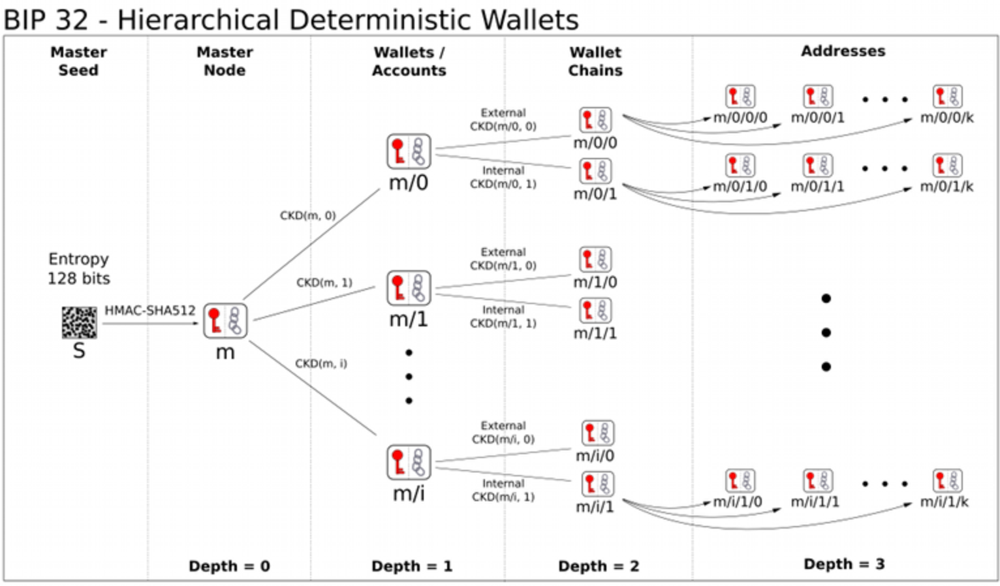

# NOMOS-WALLET-TECHNICAL-STANDARD

| Field | Value |
| --- | --- |
| Name | Nomos Wallet Technical Standard |
| Slug | 154 |
| Status | raw |
| Category | Standards Track |
| Tags | wallet, key derivation, HD wallet, mnemonic, BIP-32, BIP-39, Poseidon2 |
| Editor | Giacomo Pasini <giacomo@status.im> |
| Contributors | Thomas Lavaur <thomas@status.im>, Mehmet Gonen <mehmet@status.im>, Daniel Sanchez Quiros <daniel@status.im>, Alvaro Castro-Castilla <alvaro@status.im>, Filip Dimitrijevic <filip@status.im> |

## Abstract

This specification defines the wallet technical standard for Nomos,
covering key generation, hierarchical deterministic (HD) wallet derivation,
and zero-knowledge (ZK) compatible secret key derivation.
The primary motivation is avoiding lock-in to a specific wallet software
by specifying the algorithms used to derive keys,
allowing users to migrate between implementations.
The specification adapts pre-existing Bitcoin standards
([BIP-39][bip-39] and [BIP-32][bip-32]) to Nomos,
with modifications necessitated by the use of hash-based secret/public key pairs
and zero-knowledge proof requirements.

**Keywords:** wallet, key derivation, hierarchical deterministic,
mnemonic codes, BIP-32, BIP-39, BLAKE2b, Poseidon2, extended keys, ZK-compatible

## Semantics

The keywords "MUST", "MUST NOT", "REQUIRED", "SHALL", "SHALL NOT",
"SHOULD", "SHOULD NOT", "RECOMMENDED", "MAY", and "OPTIONAL"
in this document are to be interpreted as described in [RFC 2119][rfc-2119].

### Definitions

| Terminology | Description |
| ----------- | ----------- |
| HD Wallet | Hierarchical Deterministic wallet. A wallet that uses a single source of entropy to generate many different addresses. |
| Mnemonic Code | A human-readable representation of entropy used for key generation, as defined in [BIP-39][bip-39]. |
| Extended Key | A key extended with an additional 256 bits of entropy (chain code) to prevent child keys from depending solely on the parent key. |
| Chain Code | A 32-byte extension added to both private and public keys, identical for corresponding key pairs. |
| Hardened Child Key | A child key derived using the parent private key, with indices from $2^{31}$ through $2^{32} - 1$. |
| Normal Child Key | A child key derivable from a parent public key alone. Not available in Nomos due to the absence of elliptic curve homomorphic properties. |
| Poseidon2 | A ZK-optimized hash function that operates on field elements rather than raw bytes. |
| BN254 | A Barreto-Naehrig elliptic curve used in ZK proof systems. $\mathbb{F}_{r}$ denotes its scalar field. |
| `zkhash` | A ZK-friendly hash function used for public key derivation from a secret key. |

## Background

This specification mostly follows pre-existing standards in Bitcoin
and adapts them to Nomos when necessary.
This is also the choice of other Bitcoin-inspired projects
like [Cardano][cardano-cip-0003] or [Zcash][zcash-zip-0032].
For this reason, this document does not go over the entire specification,
and highlights only the differences with existing standards.

## Protocol Specification

### Mnemonic Codes for Key Generation

Mnemonic codes are far easier to interact with as humans
than raw binary or hex strings
and are the standard for wallets.
The mnemonic code generation process
MUST follow [BIP-39][bip-39] entirely,
as it involves only operations on strings and bytes.

### Hierarchical Deterministic Wallet

Hierarchical Deterministic (HD) wallets are the standard approach.
Using a single source of entropy
(usually obtained through the mnemonic process above),
it is possible to generate many different addresses
and share all or part of the key hierarchy.

The industry standard is [BIP-32][bip-32].
However, Nomos cannot use it as-is,
because Nomos uses different keys and cryptographic components.
In addition, some [BIP-32][bip-32] features
are only possible thanks to homomorphic properties
of elliptic curve cryptography (ECC),
which are not available in Nomos since it uses hash-based secret/public keys.

[BIP-32][bip-32] specifies two kinds of child keys:

- **Normal**: a child public key can be derived from the parent public key.
- **Hardened**: the parent private key is needed
  to derive a child private and public key.

Normal children are possible thanks to specific properties
of the keys used in Bitcoin that are not available in Nomos
(namely, homomorphism).
To maintain compatibility,
the same structure is used
but non-hardened children are not available.

The following diagram illustrates the [BIP-32][bip-32] HD wallet structure:

### Extended Keys

> In what follows, a function is defined that derives a number of child keys
> from a parent key.
> In order to prevent these from depending solely on the key itself,
> both private and public keys are first extended
> with an extra 256 bits of entropy.
> This extension, called the chain code,
> is identical for corresponding private and public keys,
> and consists of 32 bytes.
>
> An extended private key is represented as $(k, c)$,
> with $k$ the normal private key, and $c$ the chain code.
> An extended public key is represented as $(K, c)$,
> with $K = zkhash(\text{"KDF\_V1"}, k)$ the public key and $c$ the chain code.
>
> Each extended key has $2^{31}$ hardened children keys.
> Each of these child keys has an index.
> The hardened child keys use indices from $2^{31}$ through $2^{32} - 1$.

### Notation

- $(k_{par}, c_{par})$: the parent extended key,
  composed of the private key $k_{par}$ and the chain code $c_{par}$.
- $ser_{32}(i)$: serialize a 32-bit unsigned integer $i$
  as a 4-byte sequence, most significant byte first.
- $Blake2b\_512(p, x)$: refers to unkeyed BLAKE2b-512 in sequential mode,
  with an output digest length of 64 bytes,
  16-byte personalization string $p$, and input $x$.
- $PRF^{expand}(x, y) : Blake2b\_512(\text{"Nomos\_ExpandSeed"}, x \| y)$,
  a pseudo-random function.

### Child Key Derivation

$CDKpriv((k_{par}, c_{par}), i) \rightarrow (k_{i}, c_{i})$:

1. Check whether $i \geq 2^{31}$ (whether the child is a hardened key).

   - If so (hardened child):
     let $I = PRF^{expand}(c_{par}, 0x00 \| k_{par} \| ser_{32}(i))$.
   - If not (normal child): failure.

1. Split $I$ into two 32-byte sequences, $I_{L}$, $I_{R}$.

1. The returned child key $k_{i}$ is $I_{L}$.

1. The returned chain code $c_{i}$ is $I_{R}$.

### Master Key Generation

1. Generate a seed byte sequence $S$ of a chosen length
   (e.g. with [BIP-39][bip-39]).

1. Calculate $I = Blake2b\_512(\text{"Nomos\_MasterKGen"}, S)$.

1. Split $I$ into two 32-byte sequences, $I_{L}$ and $I_{R}$.

1. Use $I_{L}$ as master secret key, and $I_{R}$ as master chain code.

### ZK-Compatible Secret Key Derivation

Since Nomos makes extensive use of ZK proofs,
the secret-to-public key derivation needs to be efficient.
For this purpose, a ZK-optimized hash function is used: Poseidon2.

However, Poseidon2 operates on field elements rather than raw bytes,
so $k_{i}$ as specified above cannot be simply input directly.
Instead, these bytes need to be encoded into field elements.
Two field elements are needed to encode 32 bytes (the size of $k_{i}$).
This creates inefficiency because although a single field element
provides adequate security,
twice as many are needed,
increasing computation costs to accommodate the entire key.

To reduce this additional cost inside the proof,
one final hash function is applied
that compresses these two field elements into a single one,
which becomes the actual key used in the Nomos network:

1. Let $k_{L}$, $k_{R}$ be 16-byte sequences
   such that $k_{i} = k_{L} \| k_{R}$
   and $n_{L}$, $n_{R}$ be their values
   when interpreted as little-endian unsigned integers.

1. Let $e_{L}$, $e_{R}$ be scalar field elements in BN254
   such that $e_{L} := n_{L} \in \mathbb{F}_{r}$,
   $e_{R} := n_{R} \in \mathbb{F}_{r}$.

1. The Nomos key can be obtained as
   $k_{\text{nomos}} = Poseidon2(e_{L}, e_{R})$,
   where $Poseidon2$ outputs a single field element.

> **Note: Why not use Poseidon2 for the full derivation?**
>
> While Poseidon2 is optimized for ZK circuits,
> its long-term stability and parameterization are still evolving.
> General-purpose hash functions like Blake2b
> offer a more stable and audited base layer.
> By introducing Poseidon2 only at the last compression step,
> ZK dependencies are isolated from the rest of the key derivation path.
> This ensures the wallet hierarchy remains valid
> even if Poseidon2 parameters are updated.

## Security Considerations

### Key Derivation Security

- Implementations MUST only support hardened child key derivation.
  Non-hardened (normal) child keys are not available in Nomos
  due to the absence of elliptic curve homomorphic properties.
- The master secret key MUST be generated from a seed
  of sufficient entropy (at least 128 bits).

### ZK Key Compression

- The final Poseidon2 compression step isolates ZK dependencies
  from the rest of the key derivation path,
  ensuring that the wallet hierarchy remains valid
  even if Poseidon2 parameters are updated.
- Implementations SHOULD ensure that field element encoding
  is performed correctly using little-endian unsigned integer interpretation.

## References

### Normative

- [BIP-39][bip-39] - Mnemonic code for generating deterministic keys
- [BIP-32][bip-32] - Hierarchical Deterministic Wallets

### Informative

- [Zcash ZIP-0032][zcash-zip-0032] - Shielded Hierarchical Deterministic Wallets
- [Cardano CIP-0003][cardano-cip-0003] - Wallet Key Generation
- [SLIP-0023][slip-0023] - Cardano HD Key Derivation
- [Wallet Technical Standard (Notion)][source] - Origin reference

[rfc-2119]: https://www.ietf.org/rfc/rfc2119.txt
[bip-39]: https://github.com/bitcoin/bips/blob/master/bip-0039.mediawiki
[bip-32]: https://github.com/bitcoin/bips/blob/master/bip-0032.mediawiki
[zcash-zip-0032]: https://zips.z.cash/zip-0032
[cardano-cip-0003]: https://github.com/cardano-foundation/CIPs/blob/master/CIP-0003/README.md
[slip-0023]: https://github.com/satoshilabs/slips/blob/master/slip-0023.md
[source]: https://www.notion.so/nomos-tech/Wallet-Technical-Standard-215261aa09df80e9884ad7cf039e2c57

## Copyright

Copyright and related rights waived via [CC0](https://creativecommons.org/publicdomain/zero/1.0/).
