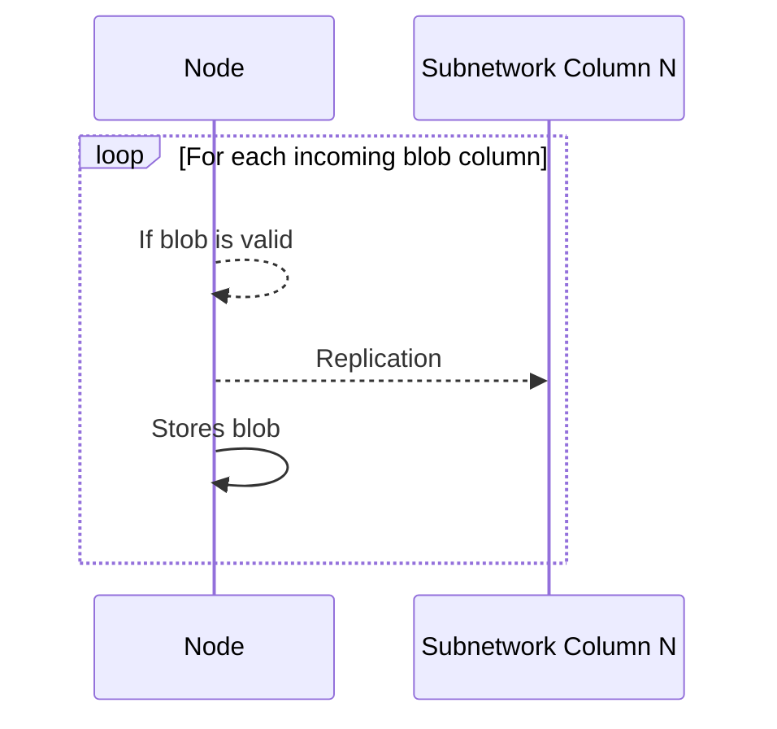

# NOMOSDA-ENCODING

| Field | Value |
| --- | --- |
| Name | NomosDA Encoding Protocol |
| Status | raw |
| Editor | Daniel Sanchez-Quiros <danielsq@status.im> |
| Contributors | Daniel Kashepava <danielkashepava@status.im>, Álvaro Castro-Castilla <alvaro@status.im>, Filip Dimitrijevic <filip@status.im>, Thomas Lavaur <thomaslavaur@status.im>, Mehmet Gonen <mehmet@status.im> |

## Introduction

This document describes the encoding and verification processes of NomosDA, which is the data availability (DA) solution used by the Nomos blockchain. NomosDA provides an assurance that all data from Nomos blobs are accessible and verifiable by every network participant.

This document presents an implementation specification describing how:

- Encoders encode blobs they want to upload to the Data Availability layer.
- Other nodes implement the verification of blobs that were already uploaded to DA.

## Definitions

- **Encoder**: An encoder is any actor who performs the encoding process described in this document. This involves committing to the data, generating proofs, and submitting the result to the DA layer.

    In the Nomos architecture, the rollup sequencer typically acts as the encoder, but the role is not exclusive and any actor in the DA layer can also act as encoders.
- **Verifier**: Verifies its portion of the distributed blob data as per the verification protocol. In the Nomos architecture, the DA nodes act as the verifiers.

## Overview

In the encoding stage, the encoder takes the DA parameters and the padded blob data and creates an initial matrix of data chunks. This matrix is expanded using Reed-Solomon coding and various commitments and proofs are created for the data.

When a verifier receives a sample, it verifies the data it receives from the encoder and broadcasts the information if the data is verified. Finally, the verifier stores the sample data for the required length of time.

## Construction

The encoder and verifier use the [NomosDA cryptographic protocol](https://www.notion.so/NomosDA-Cryptographic-Protocol-1fd261aa09df816fa97ac81304732e77?pvs=21) to carry out their respective functions. These functions are implemented as abstracted and configurable software entities that allow the original data to be encoded and verified via high-level operations.

### Glossary

| Name | Description | Representation |
| --- | --- | --- |
| `Commitment` | Commitment as per the [NomosDA Cryptographic Protocol](https://www.notion.so/NomosDA-Cryptographic-Protocol-1fd261aa09df816fa97ac81304732e77?pvs=21) | `bytes` |
| `Proof` | Proof as per the [NomosDA Cryptographic Protocol](https://www.notion.so/NomosDA-Cryptographic-Protocol-1fd261aa09df816fa97ac81304732e77?pvs=21) | `bytes` |
| `ChunksMatrix` | Matrix of chunked data. Each chunk is **31 bytes.** Row and Column sizes depend on the encoding necessities. | `List[List[bytes]]` |

### Encoder

An encoder takes a set of parameters and the blob data, and creates a matrix of chunks that it uses to compute the necessary cryptographic data. It produces the set of Reed-Solomon (RS) encoded data, the commitments, and the proofs that are needed prior to [dispersal](https://www.notion.so/NomosDA-Dispersal-1fd261aa09df815288c9caf45ed72c95?pvs=21).

```mermaid
flowchart LR
    A[DaEncoderParams] -->|Input| B(Encoder)
    I[31bytes-padded-input] -->|Input| B
    B -->|Creates| D[Chunks matrix]
    D --> |Input| C[NomosDA encoding]
    C --> E{Encoded data📄}
```



#### Encoding Process

The encoder executes the encoding process as follows:

1. The encoder takes the following input parameters:

    ```python
    class DAEncoderParams:
        column_count: usize
        bytes_per_field_element: usize
    ```

    | Name | Description | Representation |
    | --- | --- | --- |
    | `column_count` | The number of subnets available for dispersal in the system | `usize`, `int` in Python |
    | `bytes_per_field_element` | The amount of bytes per data chunk. This is set to 31 bytes. Each chunk has 31 bytes rather than 32 to ensure that the chunk value does not exceed the maximum value on the [BLS12-381 elliptic curve](https://electriccoin.co/blog/new-snark-curve/). | `usize`, `int` in Python |

2. The encoder also includes the blob data to be encoded, which must be of a size that is a multiple of `bytes_per_field_element` bytes. Clients are responsible for padding the data so it fits this constraint.
3. The encoder splits the data into `bytes_per_field_element`-sized chunks. It also arranges these chunks into rows and columns, creating a matrix.
    a. The amount of columns of the matrix needs to fit with the `column_count` parameter, taking into account the `rs_expansion_factor` (currently fixed to 2).
        i. This means that the size of each row in this matrix is `(bytes_per_field_element*column_count)/rs_expansion_factor`.
    b. The amount of rows depends on the size of the data.
4. The data is encoded as per [the cryptographic details](https://www.notion.so/NomosDA-Cryptographic-Protocol-1fd261aa09df816fa97ac81304732e77?pvs=21).
5. The encoder provides the encoded data set:

    | Name | Description | Representation |
    | --- | --- | --- |
    | `data` | Original data | `bytes` |
    | `chunked_data` | Matrix before RS expansion | `ChunksMatrix` |
    | `extended_matrix` | Matrix after RS expansion | `ChunksMatrix` |
    | `row_commitments` | Commitments for each matrix row | `List[Commitment]` |
    | `combined_column_proofs` | Proofs for each matrix column | `List[Proof]` |

    ```python
    class EncodedData:
        data: bytes
        chunked_data: ChunksMatrix
        extended_matrix: ChunksMatrix
        row_commitments: List[Commitment]
        combined_column_proofs: List[Proof]
    ```

#### Encoder Limits

NomosDA does not impose a fixed limit on blob size at the encoding level. However, protocols that involve resource-intensive operations must include upper bounds to prevent abuse. In the case of NomosDA, blob size limits are expected to be enforced, as part of the protocol's broader responsibility for resource management and fairness.

Larger blobs naturally result in higher computational and bandwidth costs, particularly for the encoder, who must compute a proof for each column. Without size limits, malicious clients could exploit the system by attempting to stream unbounded data to DA nodes. Since payment is provided before blob dispersal, DA nodes are protected from performing unnecessary work. This enables the protocol to safely accept very large blobs, as the primary computational cost falls on the encoder. The protocol can accommodate generous blob sizes in practice, while rejecting only absurdly large blobs, such as those exceeding 1 GB, to prevent denial-of-service attacks and ensure network stability.

To mitigate this, the protocol define acceptable blob size limits, and DA implementations enforce local mitigation strategies, such as flagging or blacklisting clients that violate these constraints.

### Verifier

A verifier checks the proper encoding of data blobs it receives. A verifier executes the verification process as follows:

1. The verifier receives a `DAShare` with the required verification data:

    | Name | Description | Representation |
    | --- | --- | --- |
    | `column` | Column chunks (31 bytes) from the encoded matrix | `List[bytes]` |
    | `column_idx` | Column id (`0..2047`). It is directly related to the `subnetworks` in the [network specification](https://www.notion.so/NomosDA-Network-Specification-1fd261aa09df81188e76cb083791252d?pvs=21). | `u16`, unsigned int of 16 bits. `int` in Python |
    | `combined_column_proof` | Proof of the random linear combination of the column elements. | `Proof` |
    | `row_commitments` | Commitments for each matrix row | `List[Commitment]` |
    | `blob_id` | This is computed as the hash (**blake2b**) of `row_commitments` | `bytes` |

2. Upon receiving the above data it verifies the column data as per the [cryptographic details](https://www.notion.so/NomosDA-Cryptographic-Protocol-1fd261aa09df816fa97ac81304732e77?pvs=21). If the verification is successful, the node triggers the [replication protocol](https://www.notion.so/NomosDA-Subnetwork-Replication-1fd261aa09df811d93f8c6280136bfbb?pvs=21) and stores the blob.

    ```python
    class DAShare:
        column: Column
        column_idx: u16
        combined_column_proof: Proof
        row_commitments: List[Commitment]

        def blob_id(self) -> BlobId:
            hasher = blake2b(digest_size=32)
            for c in self.row_commitments:
                hasher.update(bytes(c))
            return hasher.digest()
    ```

### Verification Logic



## Details

The encoder and verifier processes described above make use of a variety of cryptographic functions to facilitate the correct verification of column data by verifiers. These functions rely on primitives such as polynomial commitments and Reed-Solomon erasure codes, the details of which are outside the scope of this document. These details, as well as introductions to the cryptographic primitives being used, can be found in the NomosDA Cryptographic Protocol:

[NomosDA Cryptographic Protocol](https://www.notion.so/NomosDA-Cryptographic-Protocol-1fd261aa09df816fa97ac81304732e77?pvs=21)

## References

- Encoder Specification: [GitHub/encoder.py](https://github.com/logos-co/nomos-specs/blob/master/da/encoder.py)
- Verifier Specification: [GitHub/verifier.py](https://github.com/logos-co/nomos-specs/blob/master/da/verifier.py)
- Cryptographic protocol: [NomosDA Cryptographic Protocol](https://www.notion.so/NomosDA-Cryptographic-Protocol-1fd261aa09df816fa97ac81304732e77?pvs=21)

## Copyright

Copyright and related rights waived via [CC0](https://creativecommons.org/publicdomain/zero/1.0/).
