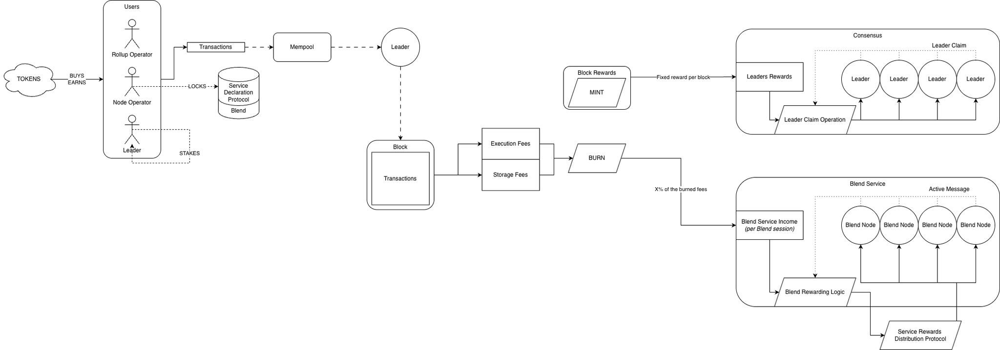

# OVERVIEW-CRYPTOECONOMICS

| Field | Value |
| --- | --- |
| Name | [Overview] Cryptoeconomics |
| Slug | 204 |
| Status | raw |
| Category | Informational |
| Editor | Thomas Lavaur <thomas@logos.co> |
| Contributors | Marcin Pawlowski <marcin@logos.co>, Filip Dimitrijevic <filip@logos.co> |

<!-- timeline:start -->

## Timeline

- **2026-05-27** — [`b7602ed`](https://github.com/logos-co/logos-lips/blob/b7602ed8a225d41ca0bfaaa432524dc84d2ded7e/docs/blockchain/raw/overview-cryptoeconomics.md) — chore: move blockchain specs from notion to github

<!-- timeline:end -->

# Revisions History

| Version | Changes | Date |
| --- | --- | --- |
| 1.0.0 | Initial revision. | 2026-04-25 |
| 1.0.1 | [RFC] Remove Concept of a Session | 2026-06-22 |
| 1.1.0 | Reflect the upward rounding of the fee market price updates | 2026-07-28 |
| 1.2.0 | Reflect the downward rounding of the leader share | 2026-08-05 |
| 1.2.1 | Changing from burning/minting to pooling/distributing/releasing | 2026-08-25 |
| 1.2.2 | Stated that the minimum stake of a service is locked in a service note | 2026-08-27 |

> **Disclaimer**:
> This material, including any linked pages or documents, is provided for informational purposes only. It does not constitute investment advice, a solicitation, or an offer to buy or sell any securities, tokens, or other financial instruments, nor should it be construed as legal, financial, or tax advice.
>
> All information regarding project details, token design, distribution mechanisms, technical parameters, and any forward-looking statements is preliminary and subject to change without notice. No representations or warranties are made as to the completeness or accuracy of the information herein. 
>
> Nothing in this material should be relied upon for investment or business decisions. Recipients of this information assume all risks associated with its use and are responsible for seeking independent professional advice regarding any actions based on it.

# Introduction

This document outlines the cryptoeconomic model for the Logos Blockchain protocol. The network features a balanced set of economic incentives designed to ensure security, optimize resources, and support sustainable growth.

The Logos Blockchain framework rests on three core mechanisms: a cryptoeconomic model that manages supply and distribution across actors, a fee market system that efficiently allocates network resources and regulates demand, and a rewards structure that incentivizes participation from various network contributors.

Logos Blockchain implements a three-part fee structure covering execution and  permanent storage, each addressing specific aspects of network resource consumption. The reward system distinguishes between block-proposing leaders and service providers (like Blend), with mechanisms that preserve leaders privacy while maintaining economic efficiency.

In this document, we detail the mathematical models underlying these systems, explain the rationale for key parameter choices, and describe the participant behaviors these mechanisms are designed to encourage.

# Overview

In this section we present an overview of the cryptoeconomical aspects of the Logos Blockchain protocol.



- Users (rollup sequencers, node operators, or leaders) acquire tokens through purchase or by earning them as rewards.
- Tokens serve three main purposes:
    - Paying for transaction processing resources used: [Fee Markets](#fee-markets).
    - Declaring service participation: node operators lock a [Minimum Stake](#minimum-stake) through the [Service Declaration Protocol](bedrock-service-declaration-protocol.md) to become Blend Service providers.
    - PoS Participation: leaders can propose (build) blocks by [participating in a lottery](cryptarchia-v1-protocol.md) where their chances of winning are proportional to their number of owned and unmoved tokens (aged tokens).
- Transactions may incur up to two types of fees:
    - Execution fee: covers the computational resources consumed by the transaction.
    - Permanent Storage fee: covers the permanent Ledger storage resources consumed by the transaction.
- Execution base fees and storage fees are routed into the rewards pool for each block, removing them from circulation.
- Rewards are distributed on an epoch basis:
    - Leaders (block proposers) include Mantle Transactions in every block. Each transaction pays Permanent Storage and Execution fees, which are routed into the rewards pool. For each block, a reward is calculated following the [Block Rewards](block-rewards.md). Additionally, a portion of the Execution fees is distributed back to leaders from the pool according to the [Execution Market](execution-market.md). These two sources determine the total rewards allocated to leaders, as explained in [Blend Service and Consensus Leaders](#blend-service-and-consensus-leaders), which correspond to tips from the Execution market and 40% of block rewards. For anonymity reasons, block proposers don't receive rewards directly. Instead, leader rewards accumulate in a single pool that increases on an epoch basis rather than per block (see [Anonymous Leaders Reward Protocol](bedrock-anonymous-leaders-reward.md)). When a new epoch begins, the pool increases by the total leader rewards from all blocks in the previous epoch. Simultaneously, leaders from the previous epoch can start claiming their rewards, with each unclaimed reward (since genesis) representing one equal share of the pool.
    - Blend nodes provide Blend service to the network for at least one epoch. Using the same [Block Rewards](block-rewards.md), the protocol determines the total rewards allocated to the Blend network, as explained in [Blend Service and Consensus Leaders](#blend-service-and-consensus-leaders) which correspond to 60% of the block rewards. 
    When an epoch $`e`$  ends, Blend validators have one additional epoch $`e+1`$  to send an active message used by the [Reward Distribution Protocols](#reward-distribution-protocols) to determine reward distribution among validators. During the first block of epoch $`e+2$, Blend validators from epoch $`e`$ receive their portion of [Blend Service and Consensus Leaders](#blend-service-and-consensus-leaders) rewards, with proportions determined by the [Reward Distribution Protocols](#reward-distribution-protocols). These rewards are distributed at the start of the next epoch.
- The [Service Rewards Distribution Protocol](#service-rewards-distribution-protocol) handles payments of rewards for Blend Services to individual nodes.
- Individual leaders claim their rewards through a [Leader Claim Operation](bedrock-v1.1-mantle-specification.md) (on-chain transaction) that preserves privacy by separating the leader reward from the proposed block.

# Constructions

## Minimum Stake

To provide a service, a node must lock in a service note a minimum number of tokens to be considered valid. This stake is locked through the [Service Declaration Protocol](bedrock-service-declaration-protocol.md) and can be withdrawn after the node stops providing the service. The minimum stake enhances economic security by increasing the cost of connecting to the network, which makes Sybil attacks more expensive. While the stake value must be sufficiently high for security, it also raises the barrier to network participation, potentially reducing decentralization. We therefore aim to balance security needs with decentralization goals. The [\[Analysis\] Static Minimum Stake Estimation for Service Declaration Protocol](analysis-static-minimum-stake-estimation-for-service-declaration-protocol.md) defines the methodology on how to calculate the minimum stake value.

## Gas

Mantle Transactions (see [Mantle - Mantle Transaction](bedrock-v1.1-mantle-specification.md)) consume different types of Gas related to the various fee markets. Gas serves as a unit of measurement to quantify the computational or storage effort required to process a Ledger Transaction or an Operation. Gas is a unit of account that was introduced to normalize and facilitate the pricing of resources. Through the gas, the protocol is defining a way to measure computational demand for Operations and Ledge Transactions. The costs for these computational resources are defined by the leaders/nodes.

The two types of Gas are:

- Execution Gas (corresponding to 1,000 CPU cycles).
- Permanent Storage Gas (corresponding to 1 permanently stored byte).

In Logos Blockchain, Permanent Storage Gas is determined for an entire encoded Mantle Transaction. Execution Gas, however, is determined differently for each Operation and Ledger Transaction. For more details on how the Gas amounts were determined for each Operation, we invite the reader to read [\[Analysis\] Gas Cost Determination](analysis-gas-cost-determination.md).

## Fee Markets

Users (rollup sequencers, node operators, or leaders) pay [fees in Logos Blockchain for their Mantle Transactions](bedrock-v1.1-mantle-specification.md) to compensate for service usage. Logos Blockchain operates with two distinct fee markets. The goal of each market is to ensure fair compensation, sustainability, and proper incentives. However each market has its own unique characteristics:

- The Execution fee market covers the validation and execution of Mantle Transactions. The consensus does not directly limit the number of CPU cycles or Execution Gas per block but a fee regulating mechanism is necessary to be compliant with minimum hardware requirements of a node. The fees must regulate the use of CPU cycles for validation and execution of the blockchain.
- The Permanent Storage fee market covers the permanent storage of encoded Mantle Transactions. Blocks are limited to 1MiB with a maximum of 1024 Mantle Transactions per block. However, the fees must reduce the maximum amount of Storage to meet the minimum hardware requirements.

Both markets recompute their price with integer arithmetic, so that the result is identical on every node, and both round the updated price upwards. Each update multiplies the current price by an adjustment factor, so a price rounded downwards would reach 0 at the bottom of its range and remain there, leaving the resource permanently free. Rounding upwards keeps one unit as the effective floor of each price. The usage signals driving these updates measure consumption rather than price and are rounded downwards.

All fee markets aim to ensure fair compensation, sustainability, proper incentives, and to address specific market needs. Because every Operation (except the Channel Inscribe and the Channel Config Operations), whether it involves computation, or permanent storage, requires some execution to be validated and processed, reaching the execution limit effectively constrains the Permanent Storage market (except for Channel Inscribe and Channel Config). In practice, this means that the Permanent Storage market is limited in the number of transactions it can process per block except for Channel Inscribe and Channel Config Operations.

### Execution Fee Market

Execution fees cover the validation and execution of Mantle Transactions. The protocol does not directly cap the number of CPU cycles per block, but fees must enforce an Execution Gas limit to ensure compliance with the minimum hardware requirements of a node. The execution limit ( $`\text{limit}_{\text{Ex}}`$ ) represents the maximum acceptable number of Execution Gas per block that a node with the minimum-specification CPU can process to validate and execute the block in a reasonable time.

We define "reasonable" as limiting the Execution Gas such that a potential leader can verify and execute it in 1 second using 80% (arbitrary) of its CPU (based on minimum CPU specifications in [Hardware Requirements - Basic Bedrock Node (Validator)](../deprecated/p2p-hardware-requirements.md)). This corresponds to a maximum of 3,200,000,000 CPU cycles for a leader, which converts to 3,200,000 Execution Gas. We require this 1-second verification for leaders to ensure they can quickly identify the correct chain and extend it with their own produced block in time when they are close to proposing a new block.

Consensus nodes must validate and execute a block using a small percentage of their CPU but during a longer period than the 1 second period for leaders, as they don't have the strict timing constraints that affect consensus and would increase forking. Using only 20% of their CPU, consensus nodes can validate and execute such blocks in approximately 4 seconds.

We will also assume that block verification requires an initial and fixed amount of Execution Gas for different ZK proofs. According to [Block Construction, Validation and Execution](bedrock-v1.1-block-construction.md), we will reduce the Execution Gas limit by 6,540 which is dedicated to initializing batch verification for [ZkSignature](bedrock-v1.1-block-construction.md) and [Proof of Claim](bedrock-v1.1-block-construction.md).

Therefore, $`\text{limit}_{\text{Ex}} := 3,193,460`$ Execution Gas. This limit is also important to guarantee a rapid syncing of the chain.

Node CPU consumption is managed by the per-block Execution Gas limit. The Execution fee market dynamically adjusts fees based on usage relative to this limit: as consumption approaches the limit, fees rise to dampen demand; when consumption drops, fees decrease to encourage additional throughput. Since execution is the bottleneck, these adjustments indirectly bound the Permanent Storage market.

More details on the execution fee calculations can be found in [Execution Market](execution-market.md).

### Permanent Storage Fee Market

Permanent Storage fees cover the permanent storage of Mantle Transactions. This market is subject to a strict maximum block size limit of 1MiB with a maximum of 1024 Mantle Transactions per block. While stored transactions consume execution resources, certain operations, such as Channel Inscribe or Channel Config, can consume only a limited amount of Execution Gas with no restriction on Permanent Storage consumption. This creates a corner case where a block could, in principle, be filled entirely with such Operations until the limit is reached. To prevent extensive usage of block space and to maintain predictability, [Cryptarchia](cryptarchia-v1-protocol.md) imposes a maximum block size limit of 1 MiB. This cap is a protocol parameter and is chosen such that it remains compatible with the storage limit defined below.

In the storage context, the minimum hardware requirement is expressed as the amount of data to be stored per year. Assuming ideal operation the network generates roughly 1 Terabyte of data per year, which can be seen as a technical limit.

The Permanent Storage fee market manages node storage resource consumption through the maximum block size limit. Fees are adjusted based on block space usage: when Permanent Storage Gas consumption rises, fees increase to discourage excessive usage; when Permanent Storage Gas usage drops, fees decrease to encourage more transactions. This dynamic pricing mechanism ensures efficient use of available block space.

More details on the Permanent Storage fee calculations can be found in [Storage Markets](storage-markets.md).

## Rewards Determination

The Logos Blockchain rewards structure is built on key principles that create a balanced and sustainable economic framework while ensuring network security and encouraging participation.

Our rewards system is guided by three core principles:

- Alignment of incentives: Rewards align all network participants' interests with the protocol's long-term health and success.
- Proportional compensation: Contributors earn rewards proportional to their resource contributions and risks.
- Sustainable economics: The model maintains economic sustainability without excessive inflation or security compromises.

The following sections explain how these principles apply to different roles in the Logos Blockchain ecosystem.

### Blend Service and Consensus Leaders

The Blend service and the leaders proposing the blocks share a same block reward that is calculated for each block based on a KPI function. This KPI function takes as input the inferred total stake and the amount of Execution and Permanent Storage fees of the block. How the KPI function calculates each block reward is explained in [Block Rewards](block-rewards.md).

- Blend rewards are distributed among all active Blend Nodes. Blend rewards are composed of a fraction of the block rewards. These rewards of epoch $`e`$ are defined when a new Blend epoch $`e+1`$ starts (a defined number of blocks) and are allocated to nodes based on their reported Active Messages and the [Reward Distribution Protocols](#reward-distribution-protocols) during epoch $`e+2`$ . The [Service Reward Distribution Protocol](bedrock-service-reward-distribution.md) manages the direct payment to nodes.
- Leaders get a voucher for each included block in epoch $`e`$ . Vouchers represent an equal share of the leader reward pool. At the start of epoch $`e+1`$ , the leaders rewards of epoch $`e`$ are added to the pool (represented by a variable) and the voucher of epoch $`e`$ can start being used. The amount added to the pool is composed of a fraction of the block rewards and a portion of the Execution fees distributed back according to the [Execution Market](execution-market.md) from all blocks of epoch $`e`$ . Vouchers can be exchanged with a reward through a [Leader Claim Operation](bedrock-v1.1-mantle-specification.md) (on-chain transaction) that preserves privacy by decoupling the leader reward from the proposed block. The reward amount, represented by a share of the pool, is computed when the claim Operation is executed (c.f. [Anonymous Leaders Reward Protocol](bedrock-anonymous-leaders-reward.md)).

Each block reward of each block is split as follows between the Blend service and the leader:

- 40% for the leader.
- 60% for the Blend service.

The reasons for this split ratio are:

- Blend nodes must stake a minimum amount while leaders have no such requirement, making Blend nodes more exposed to risks.
- Blend nodes, having met the minimum stake requirement, are incentivized to run the validator protocol to earn greater rewards.
- Leaders who can afford the minimum stake are incentivized to lock it and run a Blend node to earn more rewards.
- Leaders who cannot afford the minimum stake can still earn enough to eventually reach it.

At the start of each Blend epoch, a Blend reward variable is computed. Its amount equals 60% of the total block rewards of the previous epoch:

```python
def get_blend_reward(e: epoch): # rewards for the epoch e
    blend_rewards = 0
    for b in e.blocks: # for each block of the previous epoch
        blend_rewards += 0.6 * get_block_rewards(b) # get 60% of the rewards
    return blend_rewards
```

At the start of each epoch, the rewards are added to the leader rewards. Its amount is increased by 40% of the total block rewards of the previous epoch. The blocks from the previous epoch are denoted by B in the pseudocode below:

```python
def update_leader_rewards(e: epoch, # rewards for the epoch e
    leader_rewards: int): # added to the leader reward pool
    for b in e.blocks: # for each block of the previous epoch
        leader_rewards += 0.4 * get_block_rewards(b) # get 40% of the rewards
        leader_rewards += get_execution_market_tips(b) # get Execution market tips
    return leader_rewards
```

## Reward Distribution Protocols

### Anonymous Leaders Reward Protocol

To protect leaders' privacy, we must not link leaders to their blocks and rewards. Therefore, we designed a mechanism for anonymous reward claiming. A key design decision in this mechanism is that the amount of rewards a leader receives cannot be associated with or calculated based on the block they proposed. Without this approach, leaders could be linked back to their proposed blocks based on the value of their claimed rewards. This mechanism creates an anonymity pool where all leaders contribute, turning the leader-to-block assignment into a guessing game.

The [Anonymous Leaders Reward Protocol](bedrock-anonymous-leaders-reward.md) defines how leader rewards are maintained in the ledger and how leaders can claim them. Leader rewards follow a two-step procedure:

1. When a new epoch $`e`$ starts, the unique reward pool variable for leaders is updated, increasing by the reward amount for the previous epoch $`e-1`$. This reward amount is calculated as the sum of leader block rewards from epoch $`e-1`$. Simultaneously, consensus nodes update the voucher set, adding vouchers of leaders from epoch $`e-1`$ to the global voucher set.
1. From epoch $`e`$ onward, leaders can exchange their vouchers for shares of the rewards pool, as their vouchers are now in the set. Each unclaimed voucher represents an equal share of the leader rewards pool.

Claimable rewards remain stable during an epoch because the reward pool decreases proportionally to the number of unclaimed vouchers, and the pool is neither increased nor are new vouchers added to the set during an epoch. The share being a whole number of tokens, it is rounded down, so two leaders claiming during the same epoch may still differ by one token, the last claimants of the epoch being the ones receiving the extra token. The remainder of the division is left in the pool and redistributed at the next epoch.

### Blend Service

The [Blend Protocol - Rewarding](blend-protocol.md) mechanism determines how Blend nodes receive compensation. Only active nodes qualify for rewards, with activity verification conducted through a probabilistic system that works as follows:

1. During an epoch $`e`$, nodes collect blending tokens embedded in processed messages.
1. When epoch $`e+1`$ begins, the system generates a random target token. Nodes must submit their single blending token closest to this target as proof of activity.
1. In epoch $`e+2`$, rewards are distributed to all nodes whose tokens fall sufficiently close to the target, with additional bonuses for those achieving the closest matches.

The rewards for Blend are given to nodes on the basis of a lottery system where the winning chances are proportional to the work performed by the node. The Blend node receives a base reward for providing the basic service and a bonus reward for an extra work. Both are identical for all qualifying nodes in an epoch and are calculated by the Blend rewarding logic on the basis of the block rewards. For more details on block reward calculations, see [Blend Service and Consensus Leaders](#blend-service-and-consensus-leaders).

### Service Rewards Distribution Protocol

The [Service Reward Distribution Protocol](bedrock-service-reward-distribution.md) defines how service rewards are distributed from the pending rewards pool and inserted in the Ledger and how active service nodes receive their rewards. When a new service epoch $`e`$ starts, rewards for the previous epoch $`e-1`$ are calculated and directly inserted in the ledger. The reward amount is calculated as the sum of service block rewards from the previous epoch $`e-1`$.

# Further Details

In this section we provide references to the core specifications that define the mechanisms introduced throughout this document. Together, these specifications form the foundation of the Logos Blockchain cryptoeconomic model by detailing how fees are collected, how rewards are determined, and how incentives align across different roles in the network. Below is a short overview of each:

- [Block Rewards](block-rewards.md). Outlines the KPI-based reward emission model that governs leader and Blend rewards. It details how emission from the reserve rewards pool adapts to network conditions using inferred stake and fee-inflow rates, ensuring sustainability, security, and downward pressure on circulating supply when demand is high.
- [Execution Market](execution-market.md). Describes the fee mechanism for execution resources, including the use of a dynamic base fee and priority tips. It explains how execution demand is smoothed over time, how fees are routed into the rewards pool and later distributed as rewards, and how the system mitigates manipulation risks while maintaining predictable costs.
- [Storage Markets](storage-markets.md). Defines the transaction fee mechanism for the Permanent Storage market. It introduces a timeframe-based model where prices are fixed during an epoch and adjusted smoothly between them, ensuring predictability for users while allowing the market to adapt to long-term trends.

These documents serve as complementary technical references, offering the deeper mathematical and procedural foundations that support the economic model described here.

## On Execution vs Storage Markets

As a general overview, and to prepare the reader before embarking in the study of these documents, we will highlight here the conceptual differences between the Execution Market and the Storage Market, since they operate under distinct economic logics even though both rely on fee mechanisms:

- Execution Market  Pricing is more reactive and adaptive, with the base fee updated every block using a smoothed demand signal. The system uses a dual-component fee structure: a protocol-defined base_fee and a priority_fee (tip) defined by the user setting the transaction's gas price. It is explicitly anchored to a target utilization (50% of gas limit, similar to EIP-1559) and a hard maximum gas per block, ensuring the network remains operable on minimal hardware. Both base and priority fees are initially routed into the rewards pool, but the priority fee is later distributed back as part of leader rewards, providing a clear, strategy-aligned mechanism for transaction inclusion and incentivization.
- Storage Markets  Pricing is designed to be predictable and stable over a timeframe. Fees remain fixed within an epoch and are updated only at the transition to the next timeframe. This creates a single-component fee that is straightforward for users. While the mechanism has an anchoring point $`T_\text{base}`$ , it is not built around strict capacity limitsunlike execution. Instead, it prioritizes robustness and predictability, with parameters (such as the clipping factor) chosen to filter out volatility and keep pricing agnostic to short-term demand spikes.

Taken together, these distinctions show how the storage market emphasizes stability and medium-term predictability, while the execution market emphasizes responsiveness and short-term allocation efficiency, each addressing the unique constraints of their underlying resources.