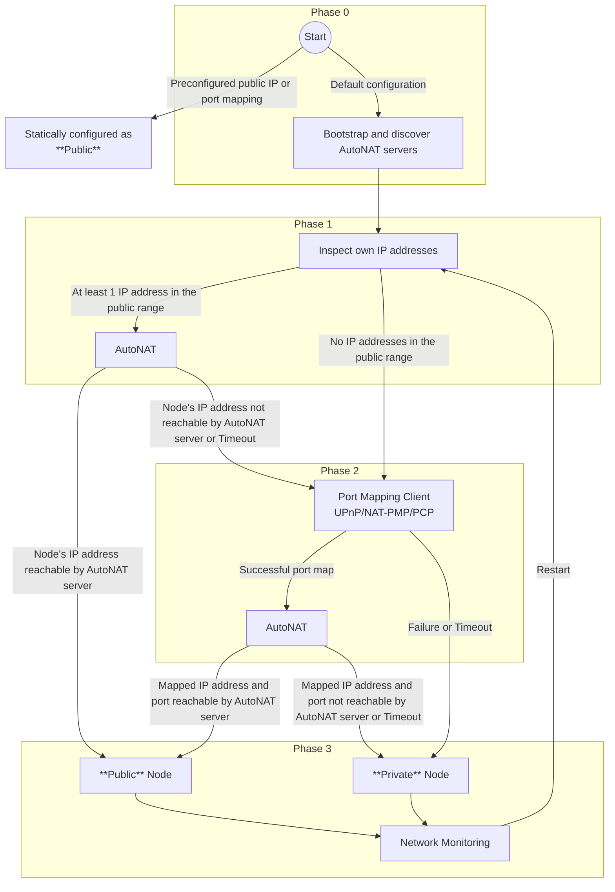
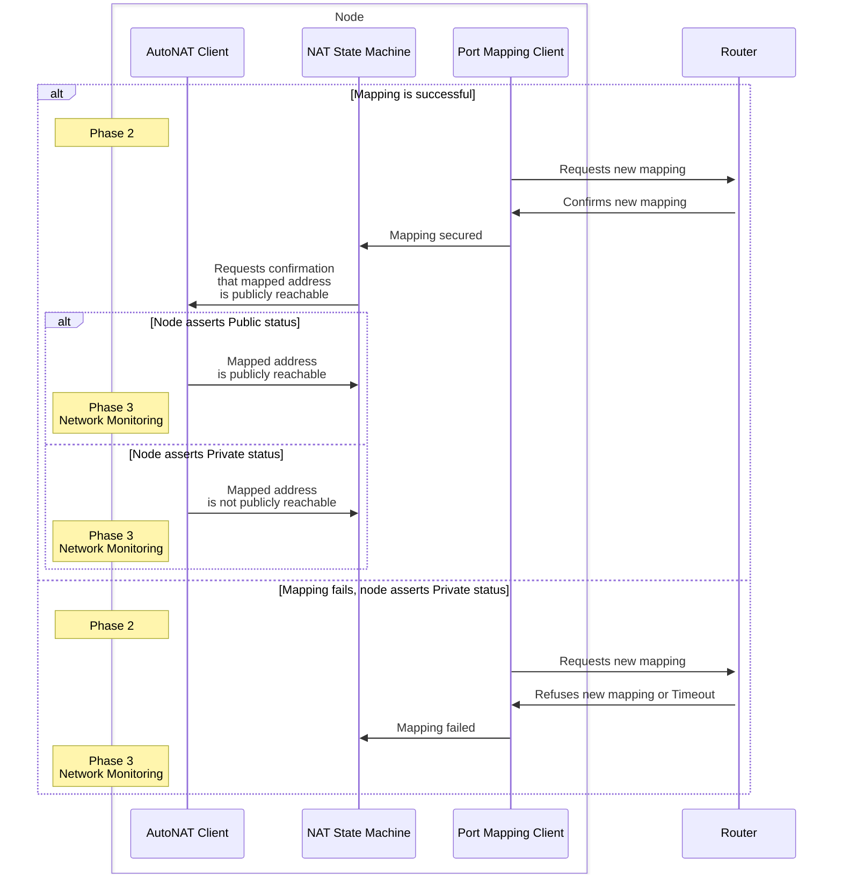
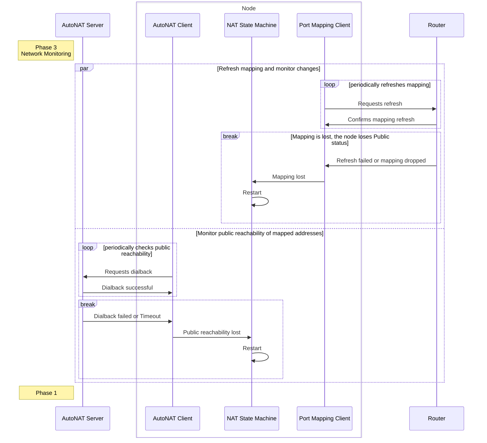

# P2P-NAT-SOLUTION

| Field | Value |
| --- | --- |
| Name | P2P Nat Solution |
| Slug | 138 |
| Status | raw |
| Category | networking |
| Editor | Antonio Antonino <antonio@logos.co> |
| Contributors | Álvaro Castro-Castilla <alvaro@logos.co>, Daniel Sanchez-Quiros <danielsq@logos.co>, Petar Radovic <petar@logos.co>, Gusto Bacvinka <augustinas@logos.co>, Youngjoon Lee <youngjoon@logos.co>, Filip Dimitrijevic <filip@logos.co> |

<!-- timeline:start -->

## Timeline

- **2026-05-27** — [`b7602ed`](https://github.com/logos-co/logos-lips/blob/b7602ed8a225d41ca0bfaaa432524dc84d2ded7e/docs/blockchain/raw/p2p-nat-solution.md) — chore: move blockchain specs from notion to github
- **2026-05-18** — [`58b5698`](https://github.com/logos-co/logos-lips/blob/58b56988429f4d69a9e10a9fc118725e229e37c5/docs/blockchain/raw/p2p-nat-solution.md) — chore(blockchain): migrate contributor emails to @logos.co (#338)
- **2026-01-19** — [`f24e567`](https://github.com/logos-co/logos-lips/blob/f24e567d0b1e10c178bfa0c133495fe83b969b76/docs/blockchain/raw/p2p-nat-solution.md) — Chore/updates mdbook (#262)
- **2026-01-16** — [`89f2ea8`](https://github.com/logos-co/logos-lips/blob/89f2ea89fc1d69ab238b63c7e6fb9e4203fd8529/docs/blockchain/raw/p2p-nat-solution.md) — Chore/mdbook updates (#258)
- **2025-12-22** — [`0f1855e`](https://github.com/logos-co/logos-lips/blob/0f1855edcf68ef982c4ce478b67d660809aa9830/docs/nomos/raw/p2p-nat-solution.md) — Chore/fix headers (#239)
- **2025-12-22** — [`b1a5783`](https://github.com/logos-co/logos-lips/blob/b1a578393edf8487ccc97a5f25b25af9bf41efb3/docs/nomos/raw/p2p-nat-solution.md) — Chore/mdbook updates (#237)
- **2025-12-18** — [`d03e699`](https://github.com/logos-co/logos-lips/blob/d03e699084774ebecef9c6d4662498907c5e2080/docs/nomos/raw/p2p-nat-solution.md) — ci: add mdBook configuration (#233)
- **2025-09-25** — [`cfb3b78`](https://github.com/logos-co/logos-lips/blob/cfb3b78c71ed75f7859299c38704b809f3e33613/nomos/raw/p2p-nat-solution.md) — Created nomos/raw/p2p-nat-solution.md draft (#174)

<!-- timeline:end -->

# Revision History

| **Version** | **Changes** | Date |
| --- | --- | --- |
| 1.0.0 | Initial revision. | 2025-08-22 |
| 1.0.1 | Renamed Nomos to Logos Blockchain | 2026-04-17 |

# Introduction

Network Address Translation ([NAT](https://en.wikipedia.org/wiki/Network_address_translation)) is a critical challenge that Logos Blockchain participants must address to the largest extent possible. Logos Blockchain is designed to operate on modern laptops for a significant subset of users, many of whom may lack the technical expertise to troubleshoot NAT-related issues. Therefore, the Logos Blockchain aims to resolve these challenges automatically.

The Logos Blockchain NAT traversal strategy is the process by which a node:

- Determines its *NAT status*, i.e., whether it is publicly reachable (via a public IP address or valid port mapping on a router), or hidden behind a NAT/firewall without a valid port mapping.
- Must be able to both establish outbound connections and accept inbound connections from other nodes regardless of their *NAT status*.

In this document, **Public** denotes a publicly reachable node, as described above. A node that does not have those properties is considered **Private**. **Dialing** refers to the process of establishing an outbound connection using the libp2p stack, where the dialing peer is the initiator of the connection.

This document defines a phased strategy for enabling and maintaining public reachability in libp2p nodes. By combining AutoNAT, dynamic port mapping, and continuous verification, the protocol aims to maximize the likelihood that a node can be contacted from the public Internet - even in the presence of different types of NATs and firewalls.

# **Overview**

## Key design principles

### **Optional Configuration**

The NAT traversal strategy must work out-of-the-box whenever possible. On one hand, users who do not want to engage in any configuration should not be required to do more than install the node software package. On the other hand, users that want to be in full control of the node must be able to configure every aspect of the strategy.

### **Decentralized**

Leverage the existing Logos Blockchain P2P network for coordination rather than relying on centralized third-party services.

### **Progressive Fallback**

Begin with lightweight checks, escalating through more complex and resource-hungry protocols. A failure at any step moves the protocol to the next stage in the strategy.

### **Changing Network Environment**

It is assumed that unless explicitly specified (which is the case for non-consumer grade hardware and specialized node operators with statically configured addresses), each node’s private or public status is prone to change (i.e., a once publicly-reachable node can become unreachable and vice versa).

## Node discovery considerations

Unlike other networks, the Logos Blockchain public network encourages a large number of participants, many of whom are expected to be deployed with a simple installation procedure (i.e., a package manager on a laptop). Some of these nodes will not achieve Public node status. Nevertheless, the discovery protocol must also track these peers and allow other nodes to discover them. Otherwise, the network would effectively become quasi-partitioned, with Private nodes being unavailable to the rest of the participants.

# Protocol

**Each node must**

- Run an [AutoNAT](https://github.com/libp2p/specs/blob/master/autonat/autonat-v2.md) client, except for nodes statically configured as Public.
- Use the Identify protocol to advertise support for the following protocols:
  - `/libp2p/autonat/2/dial-request` for client requests
  - `/libp2p/autonat/2/dial-back` for server responses

In the future the NAT traversal protocol will most likely be using its own stream protocol.

**NAT State Machine**



## Phases

**Phase 0: Bootstrapping and identifying Public nodes**

If the node is statically configured by the operator to be Public, the procedure is stopped.

The node utilizes bootstrapping (see [P2P Network Bootstrapping](p2p-network-bootstrapping.md)) and discovery (see [P2P Network](../draft/p2p-network.md)) to find other Public nodes. The [Identify](https://github.com/libp2p/specs/blob/master/identify/README.md) protocol is used to confirm which of the detected Public nodes support [AutoNAT v2](https://github.com/libp2p/specs/blob/master/autonat/autonat-v2.md).

The node then moves to the next phase.

<a id="phase-1-nat-detection"></a>

**Phase 1: NAT Detection**

The node starts an AutoNAT client and inspects its own addresses. Using the AutoNAT client, for each of its own addresses, the node checks that the address is indeed publicly reachable. If any of the IP addresses are confirmed to be public via AutoNAT, the node assumes Public status and the procedure moves to [Phase 3: Network Monitoring](p2p-nat-solution.md#phase-3-network-monitoring). Otherwise, the node continues to the next phase.

**Phase 2: Automated Port Mapping**

The node attempts to secure a port mapping on the default gateway using one of the following protocols: [PCP](https://datatracker.ietf.org/doc/html/rfc6887), [NAT-PMP](https://datatracker.ietf.org/doc/html/rfc6886), or [UPnP-IGD](https://datatracker.ietf.org/doc/html/rfc6970). PCP is the successor of NAT-PMP and is the most reliable protocol of the three. UPnP-IGD is the most widely deployed protocol, but the least reliable. The port mapping procedure takes this into account and proceeds as follows:

```python
def try_port_mapping():
    # Step 1: Get the local IPv4 address
    local_ip = get_local_ipv4_address()

    # Step 2: Get the default gateway IPv4 address
    gateway_ip = get_default_gateway_address()

    # Step 3: Abort if local or gateway IP could not be determined
    if not local_ip or not gateway_ip:
        return "Mapping failed: Unable to get local or gateway IPv4"

    # Step 4: Try mapping with PCP first, because it's the most reliable
    mapping = try_pcp_mapping(local_ip, gateway_ip)
    if mapping:
        return mapping

    # Step 5: Try NAT-PMP if PCP failed, because it's the second most reliable
    mapping = try_nat_pmp_mapping(local_ip, gateway_ip)
    if mapping:
        return mapping

    # Step 6: Try UPnP as the last resort
    mapping = try_upnp_mapping(local_ip, gateway_ip)
    if mapping:
        return mapping

    # Step 7: All mapping attempts failed
    return "Mapping failed: No protocol succeeded"
```

If the mapping is successful, the node uses an AutoNAT client to confirm that Public nodes can reach it. Upon successful confirmation the node assumes Public status. If the confirmation fails or the mapping is unsuccessful, the node assumes Private status.

A Public node must ensure that the port mapping is periodically renewed according to the policy recommended by the port mapping protocol in use.

Finally, the node continues to the next phase.



<a id="phase-3-network-monitoring"></a>

**Phase 3: Network Monitoring**

Unless explicitly configured by the operator, it is assumed the node can leave and rejoin the network at any time. The node must monitor its network status, and restart the procedure from [Phase 1](p2p-nat-solution.md#phase-1-nat-detection) if any change is detected.

A Public node must do this when:

- AutoNAT client no longer confirms that at least one of the node’s addresses is publicly reachable.
- A previously successful port mapping has been lost or refreshing of the mapping failed.



A Private node must do this when:

- It has gained a new, public IP address.
- A port mapping attempt is likely to succeed (e.g. default gateway has changed, sufficient time has passed after mapping was refused or dropped).

## Node duties once Public status is assumed

**A Public node must**

- Run an AutoNAT server.
- Listen on and advertise via the Identify protocol its publicly reachable [multiaddresses](https://github.com/libp2p/specs/blob/master/addressing/README.md) in the form: `/{public_peer_ip}/udp/{port}/quic-v1/p2p/{peer_id}`

# Annex

## References

1. [Multiaddress spec](https://github.com/libp2p/specs/blob/master/addressing/README.md)
2. [Identify v1 protocol spec](https://github.com/libp2p/specs/blob/master/identify/README.md)
3. [AutoNAT v2 protocol spec](https://github.com/libp2p/specs/blob/master/autonat/autonat-v2.md)
4. [RFC 6887 – PCP](https://datatracker.ietf.org/doc/html/rfc6887)
5. [RFC 6886 – NAT-PMP](https://datatracker.ietf.org/doc/html/rfc6886)
6. [RFC 6970 – UPnP IGD](https://datatracker.ietf.org/doc/html/rfc6970)
