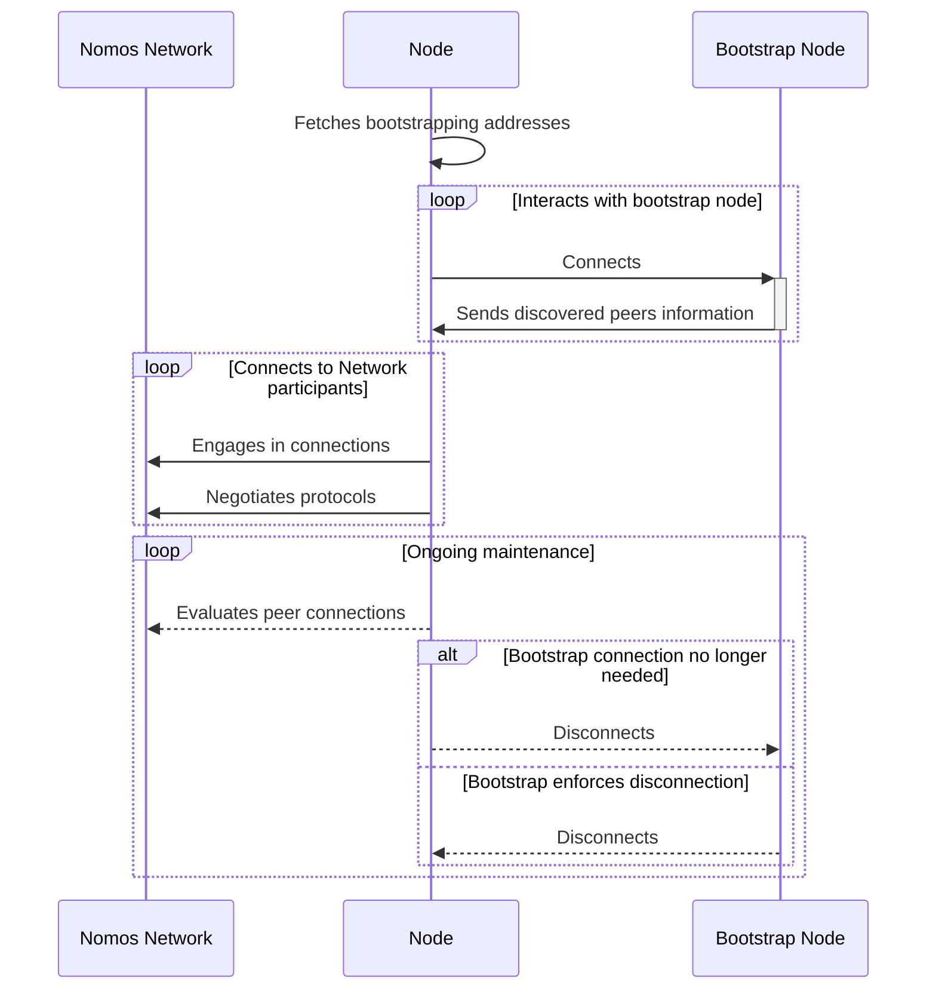

# P2P-NETWORK-BOOTSTRAPPING

| Field | Value |
| --- | --- |
| Name | Nomos P2P Network Bootstrapping Specification |
| Slug | 134 |
| Status | raw |
| Category | networking |
| Editor | Daniel Sanchez-Quiros <danielsq@status.im> |
| Contributors | Álvaro Castro-Castilla <alvaro@status.im>, Petar Radovic <petar@status.im>, Gusto Bacvinka <augustinas@status.im>, Antonio Antonino <antonio@status.im>, Youngjoon Lee <youngjoon@status.im>, Filip Dimitrijevic <filip@status.im> |

<!-- timeline:start -->

## Timeline

- **2026-01-19** — [`f24e567`](https://github.com/vacp2p/rfc-index/blob/f24e567d0b1e10c178bfa0c133495fe83b969b76/docs/blockchain/raw/p2p-network-bootstrapping.md) — Chore/updates mdbook (#262)
- **2026-01-16** — [`89f2ea8`](https://github.com/vacp2p/rfc-index/blob/89f2ea89fc1d69ab238b63c7e6fb9e4203fd8529/docs/blockchain/raw/p2p-network-bootstrapping.md) — Chore/mdbook updates (#258)
- **2025-12-22** — [`0f1855e`](https://github.com/vacp2p/rfc-index/blob/0f1855edcf68ef982c4ce478b67d660809aa9830/docs/nomos/raw/p2p-network-bootstrapping.md) — Chore/fix headers (#239)
- **2025-12-22** — [`b1a5783`](https://github.com/vacp2p/rfc-index/blob/b1a578393edf8487ccc97a5f25b25af9bf41efb3/docs/nomos/raw/p2p-network-bootstrapping.md) — Chore/mdbook updates (#237)
- **2025-12-18** — [`d03e699`](https://github.com/vacp2p/rfc-index/blob/d03e699084774ebecef9c6d4662498907c5e2080/docs/nomos/raw/p2p-network-bootstrapping.md) — ci: add mdBook configuration (#233)
- **2025-09-25** — [`aa8a3b0`](https://github.com/vacp2p/rfc-index/blob/aa8a3b0c65470b97f5aeee85a8444c7d22dcafc8/nomos/raw/p2p-network-bootstrapping.md) — Created nomos/raw/p2p-network-bootstrapping.md draft (#175)

<!-- timeline:end -->

## Introduction

Nomos network bootstrapping is the process by which a new node discovers peers and synchronizes with the existing decentralized network. It ensures that a node can:

1. **Discover Peers** – Find other active nodes in the network.
2. **Establish Connections** – Securely connect to trusted peers.
3. **Negotiate (libp2p) Protocols** - Ensure that other peers operate in the same protocols as the node needs.

## Overview

The Nomos P2P network bootstrapping strategy relies on a designated subset of **bootstrap nodes** to facilitate secure and efficient node onboarding. These nodes serve as the initial entry points for new network participants.

### Key Design Principles

#### Trusted Bootstrap Nodes

A curated set of publicly announced and highly available nodes ensures reliability during initial peer discovery. These nodes are configured with elevated connection limits to handle a high volume of incoming bootstrapping requests from new participants.

#### Node Configuration & Onboarding

New node operators must explicitly configure their instances with the addresses of bootstrap nodes. This configuration may be preloaded or dynamically fetched from a trusted source to minimize manual setup.

#### Network Integration

Upon initialization, the node establishes connections with the bootstrap nodes and begins participating in Nomos networking protocols. Through these connections, the node discovers additional peers, synchronizes with the network state, and engages in protocol-specific communication (e.g., consensus, block propagation).

### Security & Decentralization Considerations

**Trust Minimization**: While bootstrap nodes provide initial connectivity, the network rapidly transitions to decentralized peer discovery to prevent over-reliance on any single entity.

**Authenticated Announcements**: The identities and addresses of bootstrap nodes are publicly verifiable to mitigate impersonation attacks. From [libp2p documentation](https://docs.libp2p.io/concepts/transports/quic/#quic-in-libp2p):

> To authenticate each others' peer IDs, peers encode their peer ID into a self-signed certificate, which they sign using their host's private key.

**Dynamic Peer Management**: After bootstrapping, nodes continuously refine their peer lists to maintain a resilient and distributed network topology.

This approach ensures **rapid, secure, and scalable** network participation while preserving the decentralized ethos of the Nomos protocol.

## Protocol

### Protocol Overview

The bootstrapping protocol follows libp2p conventions for peer discovery and connection establishment. Implementation details are handled by the underlying libp2p stack with Nomos-specific configuration parameters.

### Bootstrapping Process

#### Step-by-Step bootstrapping process

1. **Node Initial Configuration**: New nodes load pre-configured bootstrap node addresses. Addresses may be `IP` or `DNS` embedded in a compatible [libp2p PeerId multiaddress](https://docs.libp2p.io/concepts/fundamentals/peers/#peer-ids-in-multiaddrs). Node operators may chose to advertise more than one address. This is out of the scope of this protocol. For example:

    `/ip4/198.51.100.0/udp/4242/p2p/QmYyQSo1c1Ym7orWxLYvCrM2EmxFTANf8wXmmE7DWjhx5N` or

    `/dns/foo.bar.net/udp/4242/p2p/QmYyQSo1c1Ym7orWxLYvCrM2EmxFTANf8wXmmE7DWjhx5N`

2. **Secure Connection**: Nodes establish connections to bootstrap nodes announced addresses. Verifies network identity and protocol compatibility.

3. **Peer Discovery**: Requests and receives validated peer lists from bootstrap nodes. Each entry includes connectivity details as per the peer discovery protocol engaging after the initial connection.

4. **Network Integration**: Iteratively connects to discovered peers. Gradually build peer connections.

5. **Protocol Engagement**: Establishes required protocol channels (gossip/consensus/sync). Begins participating in network operations.

6. **Ongoing Maintenance**: Continuously evaluates and refreshes peer connections. Ideally removes the connection to the bootstrap node itself. Bootstrap nodes may chose to remove the connection on their side to keep high availability for other nodes.

## Implementation Details

The bootstrapping process for the Nomos p2p network uses the **QUIC** transport as specified in the Nomos network specification.

Bootstrapping is separated from the network's peer discovery protocol. It assumes that there is one protocol that would engage as soon as the connection with the bootstrapping node triggers. Currently Nomos network uses `kademlia` as the current first approach for the Nomos p2p network, this comes granted.

### Bootstrap Node Requirements

Bootstrap nodes MUST fulfill the following requirements:

- **High Availability**: Maintain uptime of 99.5% or higher
- **Connection Capacity**: Support minimum 1000 concurrent connections
- **Geographic Distribution**: Deploy across multiple regions
- **Protocol Compatibility**: Support all required Nomos network protocols
- **Security**: Implement proper authentication and rate limiting

### Network Configuration

Bootstrap node addresses are distributed through:

- **Hardcoded addresses** in node software releases
- **DNS seeds** for dynamic address resolution
- **Community-maintained lists** with cryptographic verification

## Security Considerations

### Trust Model

Bootstrap nodes operate under a **minimal trust model**:

- Nodes verify peer identities through cryptographic authentication
- Bootstrap connections are temporary and replaced by organic peer discovery
- No single bootstrap node can control network participation

### Attack Mitigation

**Sybil Attack Protection**: Bootstrap nodes implement connection limits and peer verification to prevent malicious flooding.

**Eclipse Attack Prevention**: Nodes connect to multiple bootstrap nodes and rapidly diversify their peer connections.

**Denial of Service Resistance**: Rate limiting and connection throttling protect bootstrap nodes from resource exhaustion attacks.

## Performance Characteristics

### Bootstrapping Metrics

- **Initial Connection Time**: Target < 30 seconds to first bootstrap node
- **Peer Discovery Duration**: Discover minimum viable peer set within 2 minutes
- **Network Integration**: Full protocol engagement within 5 minutes

### Resource Requirements

#### Bootstrap Nodes

- Memory: Minimum 4GB RAM
- Bandwidth: 100 Mbps sustained
- Storage: 50GB available space

#### Regular Nodes

- Memory: 512MB for bootstrapping process
- Bandwidth: 10 Mbps during initial sync
- Storage: Minimal requirements

## References

- P2P Network Specification (internal document)
- [libp2p QUIC Transport](https://docs.libp2p.io/concepts/transports/quic/)
- [libp2p Peer IDs and Addressing](https://docs.libp2p.io/concepts/fundamentals/peers/)
- [Ethereum bootnodes](https://ethereum.org/en/developers/docs/nodes-and-clients/bootnodes/)
- [Bitcoin peer discovery](https://developer.bitcoin.org/devguide/p2p_network.html#peer-discovery)
- [Cardano nodes connectivity](https://docs.cardano.org/stake-pool-operators/node-connectivity)
- [Cardano peer sharing](https://www.coincashew.com/coins/overview-ada/guide-how-to-build-a-haskell-stakepool-node/part-v-tips/implementing-peer-sharing)

## Copyright

Copyright and related rights waived via [CC0](https://creativecommons.org/publicdomain/zero/1.0/).
