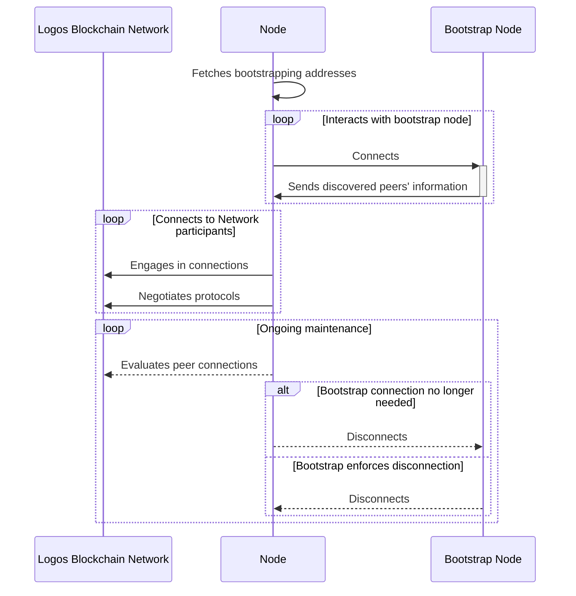

# P2P-NETWORK-BOOTSTRAPPING

| Field | Value |
| --- | --- |
| Name | P2P Network Bootstrapping |
| Slug | 134 |
| Status | raw |
| Category | networking |
| Editor | Daniel Sanchez-Quiros <danielsq@logos.co> |
| Contributors | Álvaro Castro-Castilla <alvaro@logos.co>, Petar Radovic <petar@logos.co>, Gusto Bacvinka <augustinas@logos.co>, Antonio Antonino <antonio@logos.co>, Youngjoon Lee <youngjoon@logos.co>, Filip Dimitrijevic <filip@logos.co> |

<!-- timeline:start -->

## Timeline

- **2026-05-27** — [`b7602ed`](https://github.com/logos-co/logos-lips/blob/b7602ed8a225d41ca0bfaaa432524dc84d2ded7e/docs/blockchain/raw/p2p-network-bootstrapping.md) — chore: move blockchain specs from notion to github
- **2026-05-18** — [`58b5698`](https://github.com/logos-co/logos-lips/blob/58b56988429f4d69a9e10a9fc118725e229e37c5/docs/blockchain/raw/p2p-network-bootstrapping.md) — chore(blockchain): migrate contributor emails to @logos.co (#338)
- **2026-01-19** — [`f24e567`](https://github.com/logos-co/logos-lips/blob/f24e567d0b1e10c178bfa0c133495fe83b969b76/docs/blockchain/raw/p2p-network-bootstrapping.md) — Chore/updates mdbook (#262)
- **2026-01-16** — [`89f2ea8`](https://github.com/logos-co/logos-lips/blob/89f2ea89fc1d69ab238b63c7e6fb9e4203fd8529/docs/blockchain/raw/p2p-network-bootstrapping.md) — Chore/mdbook updates (#258)
- **2025-12-22** — [`0f1855e`](https://github.com/logos-co/logos-lips/blob/0f1855edcf68ef982c4ce478b67d660809aa9830/docs/nomos/raw/p2p-network-bootstrapping.md) — Chore/fix headers (#239)
- **2025-12-22** — [`b1a5783`](https://github.com/logos-co/logos-lips/blob/b1a578393edf8487ccc97a5f25b25af9bf41efb3/docs/nomos/raw/p2p-network-bootstrapping.md) — Chore/mdbook updates (#237)
- **2025-12-18** — [`d03e699`](https://github.com/logos-co/logos-lips/blob/d03e699084774ebecef9c6d4662498907c5e2080/docs/nomos/raw/p2p-network-bootstrapping.md) — ci: add mdBook configuration (#233)
- **2025-09-25** — [`aa8a3b0`](https://github.com/logos-co/logos-lips/blob/aa8a3b0c65470b97f5aeee85a8444c7d22dcafc8/nomos/raw/p2p-network-bootstrapping.md) — Created nomos/raw/p2p-network-bootstrapping.md draft (#175)

<!-- timeline:end -->

# Revision History

| **Version** | **Changes** | Date |
| --- | --- | --- |
| 1.0.0 | Initial revision. | 2025-08-25 |
| 1.0.1 | Renamed Nomos to Logos Blockchain | 2026-04-17 |

# Introduction

Logos Blockchain network bootstrapping is the process by which a new node discovers peers and synchronizes with the existing decentralized network. It ensures that a node can:

1. **Discover Peers** – Find other active nodes in the network.
2. **Establish Connections** – Securely connect to trusted peers.
3. **Negotiate (libp2p) Protocols** - Ensure that other peers operate in the same protocols as the node needs.

# Overview

The Logos Blockchain P2P network bootstrapping strategy relies on a designated subset of **bootstrap nodes** to facilitate secure and efficient node onboarding. These nodes serve as the initial entry points for new network participants.

## Key Design Principles

**Trusted Bootstrap Nodes**

  A curated set of publicly announced and highly available nodes ensures reliability during initial peer discovery. These nodes are configured with elevated connection limits to handle a high volume of incoming bootstrapping requests from new participants.

**Node Configuration & Onboarding**

  New node operators must explicitly configure their instances with the addresses of bootstrap nodes. This configuration may be preloaded or dynamically fetched from a trusted source to minimize manual setup.

**Network Integration**

  Upon initialization, the node establishes connections with the bootstrap nodes and begins participating in Logos Blockchain networking protocols. Through these connections, the node discovers additional peers, synchronizes with the network state, and engages in protocol-specific communication (e.g., consensus, block propagation).

### **Security & Decentralization Considerations**

*Trust Minimization*: While bootstrap nodes provide initial connectivity, the network rapidly transitions to decentralized peer discovery to prevent over-reliance on any single entity.

*Authenticated Announcements*: The identities and addresses of bootstrap nodes are publicly verifiable to mitigate impersonation attacks. From the [libp2p documentation](https://docs.libp2p.io/concepts/transports/quic/#quic-in-libp2p):

  To authenticate each others’ peer IDs, peers encode their peer ID into a self-signed certificate, which they sign using their host’s private key.

*Dynamic Peer Management*: After bootstrapping, nodes continuously refine their peer lists to maintain a resilient and distributed network topology.

This approach ensures **rapid, secure, and scalable** network participation while preserving the decentralized ethos of the Logos Blockchain.

# Protocol

## **Step-by-Step bootstrapping process**

1. Node Initial Configuration: New nodes load pre-configured bootstrap node addresses. Addresses may be `IP` or `DNS` embedded in a compatible [libp2p PeerId multiaddress](https://docs.libp2p.io/concepts/fundamentals/peers/#peer-ids-in-multiaddrs). Node operators may chose to advertise more than one address. This is out of the scope of this protocol. For example:
  `/ip4/198.51.100.0/udp/4242/p2p/QmYyQSo1c1Ym7orWxLYvCrM2EmxFTANf8wXmmE7DWjhx5N` or

  `/dns/foo.bar.net/udp/4242/p2p/QmYyQSo1c1Ym7orWxLYvCrM2EmxFTANf8wXmmE7DWjhx5N`

2. Secure Connection: Nodes establish connections to bootstrap nodes announced addresses and verify network identity and protocol compatibility.
3. Peer Discovery: Requests and receive validated peer lists from bootstrap nodes. Each entry includes connectivity details as per the [Peer Discovery](../draft/p2p-network.md#peer-discovery) protocol engaging after the initial connection.
4. Network Integration: Iteratively connects to discovered peers. Gradually build peer connections.
5. Protocol Engagement: Establishes required protocol channels (gossip/consensus/sync). Begins participating in network operations.
6. Ongoing Maintenance: Continuously evaluates and refreshes peer connections. Ideally removes the connection to the bootstrap node itself. Bootstrap nodes may chose to remove the connection on their side to keep high availability for other nodes.

```mermaid
sequenceDiagram
    participant Logos Blockchain Network
    participant Node
    participant Bootstrap Node

    Node->>Node: Fetches bootstrapping addresses

    loop Interacts with bootstrap node
        Node->>+Bootstrap Node: Connects
        Bootstrap Node->>-Node: Sends discovered peers' information
    end

    loop Connects to Network participants
        Node->>Logos Blockchain Network: Engages in connections
        Node->>Logos Blockchain Network: Negotiates protocols
    end

    loop Ongoing maintenance
        Node-->>Logos Blockchain Network: Evaluates peer connections
        alt Bootstrap connection no longer needed
            Node-->>Bootstrap Node: Disconnects
        else Bootstrap enforces disconnection
            Bootstrap Node-->>Node: Disconnects
        end
    end
```

# Details

The bootstrapping process for the Logos Blockchain p2p network uses the **QUIC** transport as specified in the [Transport](../draft/p2p-network.md#transport).

Bootstrapping is separated from the network’s peer discovery protocol. It assumes that there is one protocol that would engage as soon as the connection with the bootstrapping node triggers. Currently, the Logos Blockchain network uses `kademlia` as the current first approach for the Logos Blockchain p2p network (see [Peer Discovery](../draft/p2p-network.md#peer-discovery)), which comes built-in.

# Annex

- [Ethereum bootnodes](https://ethereum.org/en/developers/docs/nodes-and-clients/bootnodes/)
- [Bitcoin peer discovery](https://developer.bitcoin.org/devguide/p2p_network.html#peer-discovery)
- [Cardano nodes connectivity](https://docs.cardano.org/stake-pool-operators/node-connectivity) & [peer sharing](https://www.coincashew.com/coins/overview-ada/guide-how-to-build-a-haskell-stakepool-node/part-v-tips/implementing-peer-sharing)
