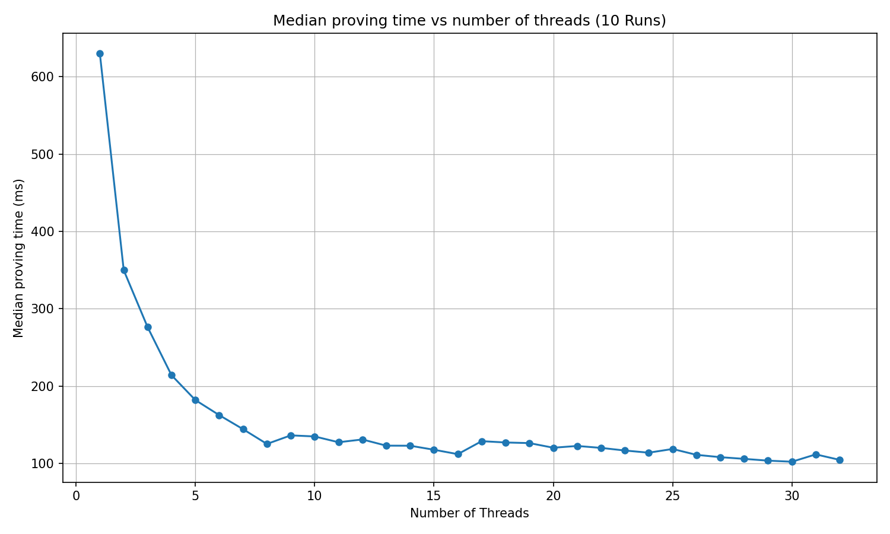

# PROOF-OF-QUOTA

| Field | Value |
| --- | --- |
| Name | Proof of Quota |
| Slug | 88 |
| Status | raw |
| Category | Standards Track |
| Editor | Mehmet Gonen <mehmet@logos.co> |
| Contributors | Marcin Pawlowski <marcin@logos.co>, Thomas Lavaur <thomaslavaur@logos.co>, Youngjoon Lee <youngjoon@logos.co>, David Rusu <davidrusu@logos.co>, Álvaro Castro-Castilla <alvaro@logos.co>, Filip Dimitrijevic <filip@logos.co> |

<!-- timeline:start -->

## Timeline

- **2026-05-27** — [`b7602ed`](https://github.com/logos-co/logos-lips/blob/b7602ed8a225d41ca0bfaaa432524dc84d2ded7e/docs/blockchain/raw/proof-of-quota.md) — chore: move blockchain specs from notion to github
- **2026-05-18** — [`58b5698`](https://github.com/logos-co/logos-lips/blob/58b56988429f4d69a9e10a9fc118725e229e37c5/docs/blockchain/raw/proof-of-quota.md) — chore(blockchain): migrate contributor emails to @logos.co (#338)
- **2026-01-19** — [`f24e567`](https://github.com/logos-co/logos-lips/blob/f24e567d0b1e10c178bfa0c133495fe83b969b76/docs/blockchain/raw/proof-of-quota.md) — Chore/updates mdbook (#262)
- **2026-01-16** — [`89f2ea8`](https://github.com/logos-co/logos-lips/blob/89f2ea89fc1d69ab238b63c7e6fb9e4203fd8529/docs/blockchain/raw/proof-of-quota.md) — Chore/mdbook updates (#258)

<!-- timeline:end -->

# Revisions History

| **Version** | **Changes** | **Date** |
| --- | --- | --- |
| 1.0.0 | Initial revision. | 2026-04-09 |
| 1.0.1 | Remove the protection against adaptive adversary from PoL. It impacts the PoL section of PoQ. Update the performance according to the new circuit. Remove old project name from DSTs | 2026-04-09 |
| 1.1.0 | [RFC] Remove Concept of a Session | 2026-06-22 |
| 1.2.0 | Add the proof of work branch: third selector value, `pow_quota` and `pow_blend_difficulty` public inputs, a private `pow_nonce` witness, and Lagrange branch selection; benchmark the three branch circuit | 2026-09-08 |


# Introduction

This document defines an implementation-friendly specification of the Proof of Quota (PoQ), which is introduced in [Proof of Quota](blend-protocol.md#proof-of-quota).

# Overview

The PoQ ensures that there is a limited number of message encapsulations that a node can perform. This constrains the number of messages a node can introduce to the Blend network. The mechanism regulating these messages is similar to [rate-limiting nullifiers](https://rate-limiting-nullifier.github.io/rln-docs/rln.html).

# Construction

The Proof of Quota (PoQ) verifies that a node's public key is within a limit for a core node, a leader node, or a proof of work solution. It consists of three parts:

1. Proof of Core Quota (`PoQ_C`): Ensures that the core node is declared and hasn’t already produced more keys than the core quota `Q_C`.
2. Proof of Leadership Quota (`PoQ_L`): Ensures that the leader node would win the proof of stake for **current Cryptarchia epoch** and hasn’t already produced more keys than the leadership quota `Q_L`. That doesn’t guarantee that the node is indeed winning because the PoQ doesn’t check if the note is unspent enabling generation of the proof ahead of time preventing extreme delays.
3. Proof of Work Quota (`PoQ_W`): Ensures that the prover holds a puzzle solution below the Blend threshold `pow_blend_difficulty` and hasn’t already produced more keys than the proof of work quota `Q_W` for that solution. Unlike the other two, this branch requires no stake and no declaration, so it admits provers that hold neither.

The final proof `PoQ` is valid if any of `PoQ_C`, `PoQ_L` or `PoQ_W` holds. Which of them held is not revealed: the selector is a private witness.

## Zero-Knowledge Proof Statement

### Public values

A proof attesting that for the following public values derived from blockchain parameters:

```python
class ProofOfQuotaPublic:
    # Output:
    key_nullifier: zkhash   # derived from epoch, private index and the private branch secret
    # Public inputs:
    core_quota: int       # Allowed blending operations per epoch for core nodes (20 bits)
    leader_quota: int     # Allowed blending operations per election win (20 bits)
    pow_quota: int        # Allowed blending operations per proof of work solution (20 bits)
    core_root: zkhash     # Merkle root of zk_id of the core nodes
    K_part_one: int       # First part of the signature public key (16 bytes)
    K_part_two: int       # Second part of the signature public key (16 bytes)
    pol_epoch_nonce: int  # PoL Epoch nonce
    pol_t0: int           # PoL constant t0
    pol_t1: int           # PoL constant t1
    pol_ledger_aged: zkhash # Merkle root of the PoL eligible notes
    pow_blend_difficulty: zkhash # Blend threshold a PoW ticket must be below
```

The proof's public signal vector is fixed by the circuit: the output first, then the public inputs in the order listed above.

`pow_blend_difficulty` is $`d_{blend}`$ for the epoch, derived in [Blend Difficulty](proof-of-work.md#blend-difficulty).

### Witness

The prover knows a witness:

```python
class ProofOfQuotaWitness:
    index: int                            # This is the index of the generated key. Limiting this index limits the maximum number of key generated. (20 bits)
    selector: int                         # Indicates a core node (=0), a leader (=1) or a proof of work solution (=2)
    # This part is filled randomly by potential leaders and by proof of work provers
    core_sk: zkhash                       # sk corresponding to the zk_id of the core node
    core_path: list[zkhash]               # Merkle path proving zk_id membership (len = 20)
    core_path_selectors: list[bool]       # Indicates how to read the core_path (if Merkle nodes are left or right in the path)
    # This part is filled randomly by core nodes and by proof of work provers
    pol_sl: int                           # PoL slot
    pol_secret_key: int                   # PoL note secret key
    pol_note_value: int                   # PoL note value
    pol_note_tx_hash: zkhash              # PoL note transaction
    pol_note_output_number: int           # PoL note transaction output number
    pol_noteid_path: list[zkhash]         # PoL Merkle path proving noteID membership in ledger aged (len = 32)
    pol_noteid_path_selectors: list[bool] # Indicates how to read the note_path (if Merkle nodes are left or right in the path)
    # This part is filled randomly by core nodes and by potential leaders
    pow_nonce: zkhash                     # Private nonce the prover ground to solve the puzzle
```

Note that every inputs and outputs of zero-knowledge proofs are all scalar field elements.

### Constraints

Such that the following constraints hold:

**Step 1**: The prover selects an `index` for the chosen key. This index must be lower than the allowed quota and not already used. This index is used to derive the key nullifier in step 5. Limiting the possible values of this index also limit the possible nullifier created which produce the desired effect: limiting the generation of keys to a certain quota. `index` is on 20 bits, so a quota may be at most $`2^{20} - 1`$.

**Step 2:**  If the prover indicated that the node is a core node for the proof, the proof checks that:

  1. The core node is registered in the set `N = SDP(epoch)`. This is proven by demonstrating knowledge of a `core_sk` that corresponds to a declared `zk_id`, which is a valid SDP registry for the current `epoch`. The `zk_id` values are stored in a Merkle tree with a fixed depth of 20, with the root provided as a public input. To build the Merkle tree, `zk_id` are ordered from the smallest to the biggest (when seen as natural numbers between 0 and $`p`$) and remaining empty leaves are represented by the `0` after the sorting (appended at the end of the vector). This structure supports up to 1M validators.
  2. The index is valid: `index < core_quota`.

**Step 3:** If the prover indicated that the node is a potential leader node for the proof, the proof checks that:

  1. The leader node possesses a note that would win a slot in the consensus lottery. Unlike leadership conditions, the proof of quota doesn't verify that the note is unspent. This enables potential provers to generate the PoQ well in advance. All other lottery constraints are the same as in [Circuit Constraints](cryptarchia-proof-of-leadership.md#circuit-constraints).
  2. The index is valid: `index < leader_quota`.

**Step 4:** If the prover indicated that the proof is backed by proof of work, the proof checks that:

  1. The prover knows a `pow_nonce` whose puzzle ticket, derived from the nonce and the epoch nonce as given in [Pseudocode](#pseudocode), is strictly below `pow_blend_difficulty`.
  2. The index is valid: `index < pow_quota`.

**Step 5:** The prover derives a `key_nullifier` maintained by blend nodes during the epoch for message deduplication purpose.

```python
selection_randomness = zkhash(b"SELECTION_RANDOMNESS_V1", sk, index, period_nonce)
key_nullifier = zkhash(b"KEY_NULLIFIER_V1", selection_randomness)
```

  Where `sk` is:

  - The `core_sk` as defined in the [Mantle specification](bedrock-v1.1-mantle-specification.md) if the node is a core node.
  - The secret key of the PoL note if it’s a leader node.
  - The `pow_nonce` if the proof is backed by proof of work.

  and `period_nonce` is:

  - The `pol_epoch_nonce` if the node is a core node.
  - The winning slot of the PoL if it’s a leader node.
  - The `pol_epoch_nonce` if the proof is backed by proof of work.

  Here we use two hashes because the selection randomness is used in the Proof of Selection in order to prove the ownership of a valid PoQ (see [Proof of Selection](blend-protocol.md#proof-of-selection)).

**Step 6**: The prover attaches a one-time signature key used in the blend protocol. This public key is split into two 16-byte parts: `K_part_one` and `K_part_two`. When written in little-endian byte order, the complete public key equals the concatenation `K_part_one||K_part_two`.

### Pseudocode

```python
# Verify selector is 0, 1 or 2. Note that a width check alone is insufficient:
# two bits would also admit 3, so the domain is constrained explicitly.
selector_squared = selector * selector
(selector_squared - selector) * (selector - 2) == 0

# Lagrange basis for the three branches.
# L1 == 1 iff selector == 1, L2 == 1 iff selector == 2, and the core branch is
# the base term carried by (1 - L1 - L2).
L1 = -selector_squared + 2 * selector
L2 = (selector_squared - selector) * inv_2   # inv_2 is the inverse of 2 in the scalar field

# Verify index is lower than the quota of the selected branch. It is exactly like
# saying index < core_quota if selector == 0, index < leader_quota if selector == 1,
# or index < pow_quota if selector == 2.
index < core_quota + (leader_quota - core_quota) * L1 + (pow_quota - core_quota) * L2

# Check if it's a registered core node
zk_id = zkhash(b"KDF", core_sk)
is_registered = merkle_verify(core_root, core_path, core_path_selectors, zk_id)

# Check if it's a potential leader
is_leader = would_win_leadership(pol_epoch_nonce,
        pol_t0,
        pol_t1,
        pol_ledger_aged,
        pol_sl,
        pol_secret_key,
        pol_note_value,
        pol_note_tx_hash,
        pol_note_output_number,
        pol_noteid_path,
        pol_noteid_path_selectors)

# Check if it's a valid proof of work solution. The ticket is derived directly
# from the private nonce and the epoch nonce, and the comparison
# is over the whole scalar field rather than a truncation of it.
pow_ticket = zkhash(pow_nonce, pol_epoch_nonce)
is_winning_pow = pow_ticket < pow_blend_difficulty

# Verify that it's a core node, a leader, or a valid proof of work solution.
# Every branch predicate is evaluated for every proof; only the selected one is
# required to hold.
assert( is_registered
        + (is_leader - is_registered) * L1
        + (is_winning_pow - is_registered) * L2 == 1)

# Derive nullifier. The period nonce has no L2 term because the proof of work
# branch reuses pol_epoch_nonce, so that term would be zero by construction.
selection_randomness = zkhash(
        b"SELECTION_RANDOMNESS_V1",
        core_sk + (pol_secret_key - core_sk) * L1 + (pow_nonce - core_sk) * L2,
        index,
        pol_epoch_nonce + (pol_sl - pol_epoch_nonce) * L1)
key_nullifier = zkhash(b"KEY_NULLIFIER_V1", selection_randomness)
```

## Proof Compression

The proof confirming that the PoQ is correct must be compressed to a size of 128 bytes, where the `UncompressedProof` is comprising of 2  $`\mathbb{G}_1`$ and 1  $`\mathbb{G}_2`$ BN256 elements as presented below.

```python
class UncompressedProof:
    pi_a: G1 # BN256 element
    pi_b: G2 # BN256 element
    pi_c: G1 # BN256 element
```

## Proof Serialization

The `ProofOfQuota` structure contains `key_nullifier` and the compressed `proof` transformed in bytes according [**Use in the Logos Blockchain:**](common-cryptographic-components.md). The `key_nullifier` must be transformed into bytes. The bytes of the compressed proof are then concatenated together with the bytes representing the `key_nullifier`, with the encoded `key_nullifier` preceding the encoded compressed `proof`. Reconstruction of a serialized `ProofOfQuota` interpreting the bytes as the concatenation of the `key_nullifier` and of the compressed `proof` following the same rule of conversion.

```python
class ProofOfQuota:
    key_nullifier: zkhash # 32 bytes
    proof: bytes # 128 bytes
```

# Appendix

## Benchmarks

The material used for the benchmarks is the following:

- CPU: 13th Gen Intel(R) Core(TM) i9-13980HX (24 cores / 32 threads)
- RAM: 32GB - Speed: 5600 MT/s
- Motherboard: Micro-Star International Co., Ltd. MS-17S1
- OS: Ubuntu 22.04.5 LTS
- Kernel: 6.8.0-59-generic



