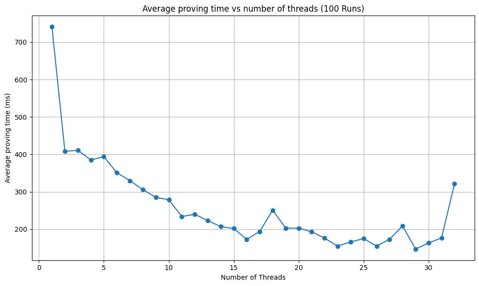

# PROOF-OF-QUOTA

| Field | Value |
| --- | --- |
| Name | Proof of Quota |
| Slug | 88 |
| Status | raw |
| Category | Standards Track |
| Editor | Mehmet Gonen <mehmet@logos.co> |
| Contributors | Marcin Pawlowski <marcin@logos.co>, Thomas Lavaur <thomaslavaur@logos.co>, Youngjoon Lee <youngjoon@logos.co>, David Rusu <davidrusu@logos.co>, Álvaro Castro-Castilla <alvaro@logos.co>, Filip Dimitrijevic <filip@logos.co> |

<!-- timeline:start -->

## Timeline

- **2026-05-27** — [`b7602ed`](https://github.com/logos-co/logos-lips/blob/b7602ed8a225d41ca0bfaaa432524dc84d2ded7e/docs/blockchain/raw/proof-of-quota.md) — chore: move blockchain specs from notion to github
- **2026-05-18** — [`58b5698`](https://github.com/logos-co/logos-lips/blob/58b56988429f4d69a9e10a9fc118725e229e37c5/docs/blockchain/raw/proof-of-quota.md) — chore(blockchain): migrate contributor emails to @logos.co (#338)
- **2026-01-19** — [`f24e567`](https://github.com/logos-co/logos-lips/blob/f24e567d0b1e10c178bfa0c133495fe83b969b76/docs/blockchain/raw/proof-of-quota.md) — Chore/updates mdbook (#262)
- **2026-01-16** — [`89f2ea8`](https://github.com/logos-co/logos-lips/blob/89f2ea89fc1d69ab238b63c7e6fb9e4203fd8529/docs/blockchain/raw/proof-of-quota.md) — Chore/mdbook updates (#258)

<!-- timeline:end -->

# Revisions History

| **Version** | **Changes** | **Date** |
| --- | --- | --- |
| 1.0.0 | Initial revision. | 2026-04-09 |
| 1.0.1 | Remove the protection against adaptive adversary from PoL. It impacts the PoL section of PoQ. Update the performance according to the new circuit. Remove old project name from DSTs | 2026-04-09 |
| 1.1.0 | [RFC] Remove Concept of a Session | 2026-06-22 |
| 1.2.0 | Add the proof of work branch: third selector value, `pow_quota` and `pow_blend_difficulty` public inputs, `pow_sk` witness, Lagrange branch selection, and the binding and precomputation properties | 2026-08-11 |
| 1.3.0 | Replace the proof of work secret key and its key derivation with a single private nonce, and give the puzzle ticket a domain separation tag | 2026-08-12 |


# Introduction

This document defines an implementation-friendly specification of the Proof of Quota (PoQ), which is introduced in [Proof of Quota](blend-protocol.md#proof-of-quota).

# Overview

The PoQ ensures that there is a limited number of message encapsulations that a node can perform. This constrains the number of messages a node can introduce to the Blend network. The mechanism regulating these messages is similar to [rate-limiting nullifiers](https://rate-limiting-nullifier.github.io/rln-docs/rln.html).

# Construction

The Proof of Quota (PoQ) verifies that a node's public key is within a limit for a core node, a leader node, or a proof of work solution. It consists of three parts:

1. Proof of Core Quota (`PoQ_C`): Ensures that the core node is declared and hasn’t already produced more keys than the core quota `Q_C`.
2. Proof of Leadership Quota (`PoQ_L`): Ensures that the leader node would win the proof of stake for **current Cryptarchia epoch** and hasn’t already produced more keys than the leadership quota `Q_L`. That doesn’t guarantee that the node is indeed winning because the PoQ doesn’t check if the note is unspent enabling generation of the proof ahead of time preventing extreme delays.
3. Proof of Work Quota (`PoQ_W`): Ensures that the prover holds a puzzle solution below the Blend threshold `pow_blend_difficulty` and hasn’t already produced more keys than the proof of work quota `Q_W` for that solution. Unlike the other two, this branch requires no stake and no declaration, so it admits provers that hold neither.

The final proof `PoQ` is valid if any of `PoQ_C`, `PoQ_L` or `PoQ_W` holds. Which of them held is not revealed: the selector is a private witness, so a proof of work backed message is indistinguishable from a core node's or a leader's.

## Zero-Knowledge Proof Statement

### Public values

A proof attesting that for the following public values derived from blockchain parameters:

```python
class ProofOfQuotaPublic:
    # Output (the first public signal):
    key_nullifier: zkhash   # derived from epoch, private index and the private branch secret
    # Public inputs, in signal order:
    core_quota: int       # Allowed blending operations per epoch for core nodes (20 bits)
    leader_quota: int     # Allowed blending operations per election win (20 bits)
    core_root: zkhash     # Merkle root of zk_id of the core nodes
    pow_quota: int        # Allowed blending operations per proof of work solution (20 bits)
    pol_ledger_aged: zkhash # Merkle root of the PoL eligible notes
    K_part_one: int       # First part of the signature public key (16 bytes)
    K_part_two: int       # Second part of the signature public key (16 bytes)
    pow_blend_difficulty: zkhash # Blend threshold a PoW ticket must be below
    pol_epoch_nonce: int  # PoL Epoch nonce
    pol_t0: int           # PoL constant t0
    pol_t1: int           # PoL constant t1
```

The declaration order above is normative and is exactly the proof's public signal vector: the output `key_nullifier` first, followed by the eleven public inputs. A verifier that assembles them in any other order rejects valid proofs.

`pow_blend_difficulty` is a per-epoch protocol value, identical for every proof produced in that epoch, so it carries no branch-specific signal and a verifier cannot infer from it which branch a given proof used. How its value is set for each epoch is not defined here; it is a consensus quantity supplied to the circuit, and its derivation is specified alongside the other Blend parameters.

### Witness

The prover knows a witness:

```python
class ProofOfQuotaWitness:
    index: int                            # This is the index of the generated key. Limiting this index limits the maximum number of key generated. (20 bits)
    selector: int                         # Indicates a core node (=0), a leader (=1) or a proof of work solution (=2)
    # This part is filled randomly by potential leaders and by proof of work provers
    core_sk: zkhash                       # sk corresponding to the zk_id of the core node
    core_path: list[zkhash]               # Merkle path proving zk_id membership (len = 20)
    core_path_selectors: list[bool]       # Indicates how to read the core_path (if Merkle nodes are left or right in the path)
    # This part is filled randomly by core nodes and by proof of work provers
    pol_sl: int                           # PoL slot
    pol_secret_key: int                   # PoL note secret key
    pol_note_value: int                   # PoL note value
    pol_note_tx_hash: zkhash              # PoL note transaction
    pol_note_output_number: int           # PoL note transaction output number
    pol_noteid_path: list[zkhash]         # PoL Merkle path proving noteID membership in ledger aged (len = 32)
    pol_noteid_path_selectors: list[bool] # Indicates how to read the note_path (if Merkle nodes are left or right in the path)
    # This part is filled randomly by core nodes and by potential leaders
    pow_nonce: zkhash                     # Private nonce the prover ground to solve the puzzle
```

`selector` is private, so a verifier learns that *some* branch held without learning which. This is what makes a proof of work backed message indistinguishable from a core node's, and it is the property the whole construction exists to provide.

The puzzle for this branch takes no block reference. A block hash could only serve as a recency anchor, and it cannot serve as one here: the circuit has no means to establish that a given value is the hash of a real block, let alone a recent or canonical one, so any field element would be accepted and the prover would simply choose whichever suited it. Including it would add an input that constrains nothing while suggesting to a reader that solutions are anchored in time. What does bind a solution to a period is `pol_epoch_nonce`, and its limits are set out in [Precomputation of proof of work solutions](#precomputation-of-proof-of-work-solutions).

This differs from the proof of work credential used to claim a token reward, which does carry a block reference. That reference is meaningful there because it is checked against the canonical chain outside any circuit, where the chain is available to check against.

Note that every inputs and outputs of zero-knowledge proofs are all scalar field elements.

### Constraints

Such that the following constraints hold:

**Step 1**: The prover selects an `index` for the chosen key. This index must be lower than the allowed quota and not already used. This index is used to derive the key nullifier in step 5. Limiting the possible values of this index also limit the possible nullifier created which produce the desired effect: limiting the generation of keys to a certain quota. `index` is on 20 bits, so a quota may be at most $`2^{20}`$.

What the quota bounds differs by branch, because what the nullifier is derived from differs by branch. For the core and leadership branches the secret key is a long lived identity — an SDP declared `zk_id` and a note key respectively — so the bound is per node per `epoch`. For the proof of work branch the secret key is ground afresh for every solution, so **the bound is per solution, not per node**: a prover holding $`n`$ solutions may derive $`n \cdot`$ `pow_quota` distinct nullifiers, and nothing ties those solutions to a single identity.

`pow_quota` therefore sets how much one unit of work buys. It is set to the number of blending operations in a single message, so that one solution buys exactly one message; see [Proof of Work Quota](blend-protocol.md#proof-of-work-quota). A quota unit is one encapsulation rather than one message, so this is a multiple of the per message blending count and not the value `1`.

**Step 2:**  If the prover indicated that the node is a core node for the proof, the proof checks that:

  1. The core node is registered in the set `N = SDP(epoch)`. This is proven by demonstrating knowledge of a `core_sk` that corresponds to a declared `zk_id`, which is a valid SDP registry for the current `epoch`. The `zk_id` values are stored in a Merkle tree with a fixed depth of 20, with the root provided as a public input. To build the Merkle tree, `zk_id` are ordered from the smallest to the biggest (when seen as natural numbers between 0 and $`p`$) and remaining empty leaves are represented by the `0` after the sorting (appended at the end of the vector). This structure supports up to 1M validators.
  2. The index is valid: `index < core_quota`.

**Step 3:** If the prover indicated that the node is a potential leader node for the proof, the proof checks that:

  1. The leader node possesses a note that would win a slot in the consensus lottery. Unlike leadership conditions, the proof of quota doesn't verify that the note is unspent. This enables potential provers to generate the PoQ well in advance. All other lottery constraints are the same as in [Circuit Constraints](cryptarchia-proof-of-leadership.md#circuit-constraints).
  2. The index is valid: `index < leader_quota`.

**Step 4:** If the prover indicated that the proof is backed by proof of work, the proof checks that:

  1. The prover knows a `pow_nonce` whose puzzle ticket satisfies the Blend threshold. The ticket is derived directly from the nonce together with the epoch nonce, and must be strictly below `pow_blend_difficulty`. Because a smaller threshold admits fewer tickets, a smaller `pow_blend_difficulty` makes the puzzle harder.
  2. The index is valid: `index < pow_quota`.

  There is no key here, and deliberately so: nothing about this branch requires proving knowledge of a secret with key structure, only that the preimage of a winning ticket is known and never revealed. The nonce is that preimage. The ticket derivation carries its own domain separation tag, so the puzzle occupies a hash domain of its own and a preimage found for it is meaningless anywhere else.

**Step 5:** The prover derives a `key_nullifier` maintained by blend nodes during the epoch for message deduplication purpose.

```python
selection_randomness = zkhash(b"SELECTION_RANDOMNESS_V1", sk, index, period_nonce)
key_nullifier = zkhash(b"KEY_NULLIFIER_V1", selection_randomness)
```

  Where `sk` is:

  - The `core_sk` as defined in the [Mantle specification](bedrock-v1.1-mantle-specification.md) if the node is a core node.
  - The secret key of the PoL note if it’s a leader node.
  - The `pow_nonce` if the proof is backed by proof of work. The nonce stands in the secret key position: what the nullifier needs from this slot is an input that is secret and bound to the branch's admission right, and for this branch that is the nonce itself.

  and `period_nonce` is:

  - The `pol_epoch_nonce` if the node is a core node.
  - The winning slot of the PoL if it’s a leader node.
  - The `pol_epoch_nonce` if the proof is backed by proof of work, the same value the core branch uses.

  Here we use two hashes because the selection randomness is used in the Proof of Selection in order to prove the ownership of a valid PoQ (see [Proof of Selection](blend-protocol.md#proof-of-selection)).

  The proof of work branch reusing the core branch's period nonce is deliberate: it makes the third term of the `period_nonce` selection vanish identically, saving the constraints that term would cost. The consequence is that the core and proof of work branches share a nonce domain and their nullifiers are separated only by the secret key, which is sufficient because the two secrets are drawn from disjoint sources — an SDP declared identity in one case, a freshly ground nonce in the other.

**Step 6**: The prover attaches a one-time signature key used in the blend protocol. This public key is split into two 16-byte parts: `K_part_one` and `K_part_two`. When written in little-endian byte order, the complete public key equals the concatenation `K_part_one||K_part_two`.

### Pseudocode

The circuit selects between the three branches with Lagrange basis polynomials evaluated at the selector. `L1` is one when `selector == 1` and zero otherwise, `L2` is one when `selector == 2` and zero otherwise, and the core branch is the base case carried by the remaining term. Every value that differs by branch is then written as `base + (leader_value - base) * L1 + (pow_value - base) * L2`, which evaluates to the correct branch's value and stays linear in each multiplication.

```python
# Verify selector is 0, 1 or 2. Note that a width check alone is insufficient:
# two bits would also admit 3, so the domain is constrained explicitly.
selector_squared = selector * selector
(selector_squared - selector) * (selector - 2) == 0

# Lagrange basis for the three branches.
# L1 == 1 iff selector == 1, L2 == 1 iff selector == 2, and the core branch is
# the base term carried by (1 - L1 - L2).
L1 = -selector_squared + 2 * selector
L2 = (selector_squared - selector) * inv_2   # inv_2 is the inverse of 2 in the scalar field

# Verify index is lower than the quota of the selected branch. It is exactly like
# saying index < core_quota if selector == 0, index < leader_quota if selector == 1,
# or index < pow_quota if selector == 2.
index < core_quota + (leader_quota - core_quota) * L1 + (pow_quota - core_quota) * L2

# Check if it's a registered core node
zk_id = zkhash(b"KDF", core_sk)
is_registered = merkle_verify(core_root, core_path, core_path_selectors, zk_id)

# Check if it's a potential leader
is_leader = would_win_leadership(pol_epoch_nonce,
        pol_t0,
        pol_t1,
        pol_ledger_aged,
        pol_sl,
        pol_secret_key,
        pol_sk_secrets_root,
        pol_note_value,
        pol_note_tx_hash,
        pol_note_output_number,
        pol_noteid_path,
        pol_noteid_path_selectors)

# Check if it's a valid proof of work solution. The ticket is derived directly
# from the private nonce under its own domain separation tag, and the comparison
# is over the whole scalar field rather than a truncation of it.
pow_ticket = zkhash(b"BLEND_POW_V1", pol_epoch_nonce, pow_nonce)
is_winning_pow = pow_ticket < pow_blend_difficulty

# Verify that it's a core node, a leader, or a valid proof of work solution.
# Every branch predicate is evaluated for every proof; only the selected one is
# required to hold.
assert( is_registered
        + (is_leader - is_registered) * L1
        + (is_winning_pow - is_registered) * L2 == 1)

# Derive nullifier. The period nonce has no L2 term because the proof of work
# branch reuses pol_epoch_nonce, so that term would be zero by construction.
selection_randomness = zkhash(
        b"SELECTION_RANDOMNESS_V1",
        core_sk + (pol_secret_key - core_sk) * L1 + (pow_nonce - core_sk) * L2,
        index,
        pol_epoch_nonce + (pol_sl - pol_epoch_nonce) * L1)
key_nullifier = zkhash(b"KEY_NULLIFIER_V1", selection_randomness)
```

Because the proving system fixes the circuit ahead of time, the selector cannot switch constraints off. All three branch predicates are evaluated for every proof, whichever branch is in use, and a prover using one branch fills the other branches' witness fields with arbitrary values. Every prover therefore pays the cost of all three branches.

## Binding a proof to its message

The circuit does not constrain any relation between a branch's secret and the one-time signature key $`K_{\text{part\_one}} \| K_{\text{part\_two}}`$ attached in step 6. In particular, `pow_nonce` flows only into the puzzle ticket and the nullifier, and nothing derived from it is ever compared against $`K`$. Binding a proof to the message it accompanies comes from two properties outside the circuit instead.

The first is that $`K`$ is a public input. The proving system binds a proof to the exact public inputs it was generated against, so a proof observed on one message cannot be reattached to a message carrying a different key: doing so requires generating a new proof, which requires the witness. The second is that the message header is signed under $`K`$, so a relayer that verifies the signature knows the sender holds the corresponding private key.

Together these give the property the Blend network needs, which is that a valid proof cannot be lifted from someone else's message and reused. What they do not give is any guarantee that the branch secret was held by the same party that sent the message. A prover that deliberately shares a winning `pow_nonce` lets the recipient produce proofs against their own $`K`$, up to the shared solution's remaining quota. This is a voluntary act with the same consequence as sharing a `core_sk`, and it is not defended against.

## Precomputation of proof of work solutions

The proof of work branch places no bound on how old a solution may be. The only time dependent input to the puzzle is `pol_epoch_nonce`, so a solution is bound to an epoch and to nothing finer.

That value does not become known when its epoch starts. It is fixed at the beginning of the lottery constants finalization phase of the *preceding* epoch, as specified in [Epoch](cryptarchia-v1-protocol.md#epoch), and is public from that moment. An epoch is $`10\lfloor k/f \rfloor`$ slots and the nonce is fixed $`6\lfloor k/f \rfloor`$ slots into the preceding epoch, so it is known for the final $`4\lfloor k/f \rfloor`$ slots of that epoch — with the parameters in [Cryptarchia](cryptarchia-v1-protocol.md#constants), roughly three days of a seven and a half day epoch.

`pow_blend_difficulty` for the epoch is fixed at the same snapshot as the nonce, as specified in [Blend Difficulty](bedrock-v1.1-mantle-specification.md#blend-difficulty), so the whole window has every public input of the proof available, and complete proofs — not only solutions — may be prepared ahead of the epoch. Binding solutions to anything finer than an epoch, such as a recent block hash, would close exactly this window, and for the core and leadership branches would forfeit the ahead-of-time proving they rely on; the absence of a sub-epoch bound here is deliberate, and the reward path's freshness is enforced independently by its own acceptance window. A prover may therefore mine solutions for an epoch throughout that window and hold them until the epoch opens. Admission to the Blend network over the proof of work branch is consequently limited by the total work a prover can perform in that window and by `pow_quota`, rather than by any rate at which solutions may be presented. Setting `pow_blend_difficulty` for an epoch has to account for this, since the work available to a prover before the epoch begins is not observable when the threshold is chosen.

## Proof Compression

The proof confirming that the PoQ is correct must be compressed to a size of 128 bytes, where the `UncompressedProof` is comprising of 2  $`\mathbb{G}_1`$ and 1  $`\mathbb{G}_2`$ BN256 elements as presented below.

```python
class UncompressedProof:
    pi_a: G1 # BN256 element
    pi_b: G2 # BN256 element
    pi_c: G1 # BN256 element
```

## Proof Serialization

The `ProofOfQuota` structure contains `key_nullifier` and the compressed `proof` transformed in bytes according [**Use in the Logos Blockchain:**](common-cryptographic-components.md). The `key_nullifier` must be transformed into bytes. The bytes of the compressed proof are then concatenated together with the bytes representing the `key_nullifier`, with the encoded `key_nullifier` preceding the encoded compressed `proof`. Reconstruction of a serialized `ProofOfQuota` interpreting the bytes as the concatenation of the `key_nullifier` and of the compressed `proof` following the same rule of conversion.

```python
class ProofOfQuota:
    key_nullifier: zkhash # 32 bytes
    proof: bytes # 128 bytes
```

# Appendix

## Benchmarks

The material used for the benchmarks is the following:

- CPU: 13th Gen Intel(R) Core(TM) i9-13980HX (24 cores / 32 threads)
- RAM: 32GB - Speed: 5600 MT/s
- Motherboard: Micro-Star International Co., Ltd. MS-17S1
- OS: Ubuntu 22.04.5 LTS
- Kernel: 6.8.0-59-generic



The figure above measures the two branch circuit. The three branch circuit in its earlier, key-based form compiled to 20 590 R1CS constraints. The nonce form removes the branch's key derivation and adds a domain separation constant, so its count is lower; it has not been re-measured, and the published figure should be read as an upper bound for the current circuit.

A like for like proving time comparison against the figure above has not been produced: the measurements taken of the three branch circuit used a different statistic, sample count and thread range, so the two are not comparable and no conclusion about the change in proving time should be drawn from placing them side by side. The proof of work branch also has no benchmark of its own — the published measurements exercise the core and leadership branches only. Since all three branches are evaluated for every proof regardless of which one is selected, per proof cost is not expected to differ by branch, but this has not been measured.
