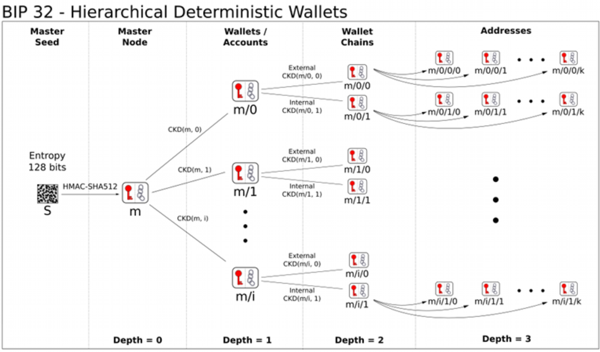

# WALLET-TECHNICAL-STANDARD

| Field | Value |
| --- | --- |
| Name | Wallet Technical Standard |
| Slug | 154 |
| Status | raw |
| Category | Standards Track |
| Tags | wallet, key derivation, HD wallet, mnemonic, BIP-32, BIP-39, Poseidon2 |
| Editor | Giacomo Pasini <giacomo@logos.co> |
| Contributors | Thomas Lavaur <thomas@logos.co>, Mehmet Gonen <mehmet@logos.co>, Daniel Sanchez Quiros <daniel@logos.co>, Alvaro Castro-Castilla <alvaro@logos.co>, Filip Dimitrijevic <filip@logos.co> |

<!-- timeline:start -->

## Timeline

- **2026-05-27** — [`b7602ed`](https://github.com/logos-co/logos-lips/blob/b7602ed8a225d41ca0bfaaa432524dc84d2ded7e/docs/blockchain/raw/wallet-technical-standard.md) — chore: move blockchain specs from notion to github
- **2026-05-18** — [`58b5698`](https://github.com/logos-co/logos-lips/blob/58b56988429f4d69a9e10a9fc118725e229e37c5/docs/blockchain/raw/wallet-technical-standard.md) — chore(blockchain): migrate contributor emails to @logos.co (#338)
- **2026-02-13** — [`b7813dc`](https://github.com/logos-co/logos-lips/blob/b7813dce5a7413f7d7c430d9f2c2bbee367fbeef/docs/blockchain/raw/wallet-technical-standard.md) — feat: add Logos Blockchain Wallet Technical Standard specification (#292)

<!-- timeline:end -->

# Revision History

| **Version** | **Changes** | **Date** |
| --- | --- | --- |
| 1.0.0 | Initial revision. | 2026-02-05 |
| 1.0.1 | Updated project references to Logos Blockchain | 2026-04-17 |

# Introduction

The main motivation behind this spec is avoiding being locked into a wallet software. By specifying the algorithms used to derive keys, we allow users to easily migrate from one implementation to the other.

# Overview

This document mostly follows pre-existing standards in Bitcoin and adapts it to Logos’ needs when necessary. This is also the choice of other Bitcoin-inspired projects like Cardano or Zcash. For this reason, this document will not go over the entire spec itself, and just highlight differences with existing standards.

## Mnemonic codes for key generation

Mnemonic codes are far easier to interact with as humans than raw binary or hex strings and are the standard for wallets. In this regard we can reuse [BIP-39](https://github.com/bitcoin/bips/blob/master/bip-0039.mediawiki) entirely, as it’s just operations on strings and bytes.

## Hierarchical Deterministic wallet

Hierarchical Deterministic (HD) wallets are nowadays the standard. Using a single source of entropy (usually obtained through the process above), it’s possible to generate many different addresses and share all or part of it.

The industry standard is [BIP32](https://github.com/bitcoin/bips/blob/master/bip-0032.mediawiki). However, we can’t use it as it is, as we use different keys and cryptographic components. In addition, some of the BIP32 features are only possible thanks to homomorphic properties of ECC, which we don’t have in the Logos Blockchain since we use hash-based sk/pk.

BIP-32 specifies two kinds of child keys:

- Normal: you can derive a child public key from the parent public key
- Hardened: you need the parent private key to derive a child private and public key

Unfortunately, ‘normal’ children are possible thanks to specific properties of the keys used in Bitcoin that we don’t have in the Logos Blockchain (namely, homomorphism).

To maintain compatibility, we will still use the same structure but non-hardened children will not be available.

  **Extended Keys (from BIP32)**

  In what follows, we will define a function that derives a number of child keys from a parent key. In order to prevent these from depending solely on the key itself, we extend both private and public keys first with an extra 256 bits of entropy. This extension, called the chain code, is identical for corresponding private and public keys, and consists of 32 bytes.

  We represent an extended private key as (k, c), with k the normal private key, and c the chain code. An extended public key is represented as $`(K, c)`$, with $`K = zkhash("KDF\_V1", k)`$ the public key and $`c`$ the chain code.

  Each extended key has $`2^{31}`$ hardened children keys. Each of these child key has an index. The hardened child keys use indices from $`2^{31}`$ through $`2^{32} -1`$.

# Details

The main novelty with respect to the aforementioned protocols is one last additional step before obtaining a secret key that can be used in the Logos Blockchain network, described in [ZK-Compatible Secret Key Derivation in the Logos Blockchain](#zk-compatible-secret-key-derivation-in-the-logos-blockchain).

For the remaining procedures, we only highlight the differences instead of going over all the details again as they’re already covered extensively elsewhere.

## **Notation:**

- $`(k_{par}, c_{par})`$: the parent extended key, composed of the private key $`k_{par}`$ and the chain code $`c_{par}`$.
- $`ser_{32}(i)`$: serialize a 32-bit unsigned integer i as a 4-byte sequence, most significant byte first.
- $`Blake2b\_512(p, x)`$: refers to unkeyed BLAKE2b-512 in sequential mode, with an output digest length of 64 bytes, 16-byte personalization string *p*, and input *x.*
- $`PRF^{expand}(x, y): Blake2b\_512("Logos\_ExpandSeed", x || y)`$, a pseudo-random function.

## Child Key Derivation

$`CDKpriv((k_{par}, c_{par}), i) \rightarrow (k_i, c_i):`$

  - Check whether $`i \geq 2^{31}`$ (whether the child is a hardened key).
    - If so (hardened child): let $`I = PRF^{expand}(c_{par}, 0x00 ||k_{par} || ser_{32}(i))`$.
    - If not (normal child): failure.

  - Split $`I`$ into two 32-byte sequences, $`I_L, I_R`$.
  - The returned child key $`k_i`$ is $`I_L`$.
  - The returned chain code $`c_i`$ is $`I_R`$.

## Master Key Generation

- Generate a seed byte sequence $`S`$ of a chosen length (e.g. with BIP0039)
- Calculate $`I = Blake2b\_512("Logos Blockchain\_MasterKGen", S)`$
- Split $`I`$ into two 32-byte sequences, $`I_L`$ and $`I_R`$.
- Use $`I_L`$ as master secret key, and $`I_R`$ as master chain code.

## ZK-Compatible Secret Key Derivation in the Logos Blockchain

Since we make extensive use of ZK proofs, we need our secret → public derivation to be efficient. For this purpose, we use a ZK-optimized hash function: Poseidon2.

However, Poseidon2 operates on field elements rather than raw bytes, so we cannot simply input $`k_i`$ as specified above. Instead, we must encode these bytes into field elements. Using the parameters described in [**Use in the Logos Blockchain:**](common-cryptographic-components.md), we need two field elements to encode 32 bytes (the size of $`k_i`$). This creates inefficiency because although a single field element provides adequate security, we must use twice as many, increasing computation costs to accommodate the entire key.

To reduce this additional cost inside the proof, we apply one final hash function that compresses these two field elements into a single one, which becomes the actual key used in the Logos Blockchain network:

Let $`k_L, k_R`$ be 16-byte sequences such that $`k_i = k_L || k_R`$ and $`n_L, n_R`$ be their values when interpreted as little-endian unsigned integers. Let $`e_L, e_R`$ be scalar field elements in BN254 such that $`e_L := n_L \in \mathbb F_r, e_R := n_R \in \mathbb F_r`$. The Logos key can be obtained as $`k_{\text{logos}} = \text{Poseidon2}(e_L, e_R)`$, where $`\text{Poseidon2}`$ outputs a single field element.

  **Why not use Poseidon2 for the full derivation?** While Poseidon2 is optimized for ZK circuits, its long-term stability and parameterization are still evolving. General-purpose hash functions like Blake2b offer a more stable and audited base layer. By introducing Poseidon2 only at the last compression step we isolate ZK-dependencies from the rest of the key derivation path. This ensures the wallet hierarchy remains valid even if Poseidon2 parameters are updated.

# References

[ZIP 32: Shielded Hierarchical Deterministic Wallets](https://zips.z.cash/zip-0032)

[CIP-0003](https://github.com/cardano-foundation/CIPs/blob/master/CIP-0003/README.md)

[slip-0023](https://github.com/satoshilabs/slips/blob/master/slip-0023.md)

[bip-0039](https://github.com/bitcoin/bips/blob/master/bip-0039.mediawiki)

[bip-0032](https://github.com/bitcoin/bips/blob/master/bip-0032.mediawiki)
