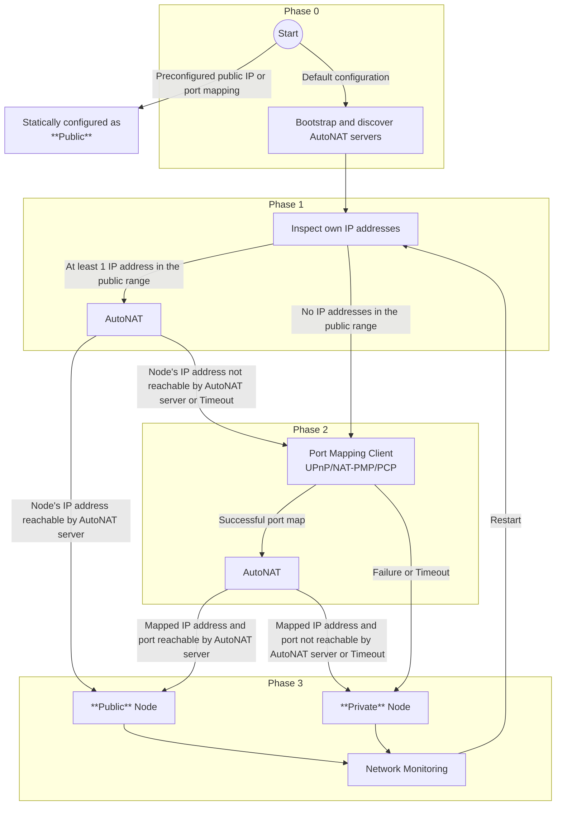
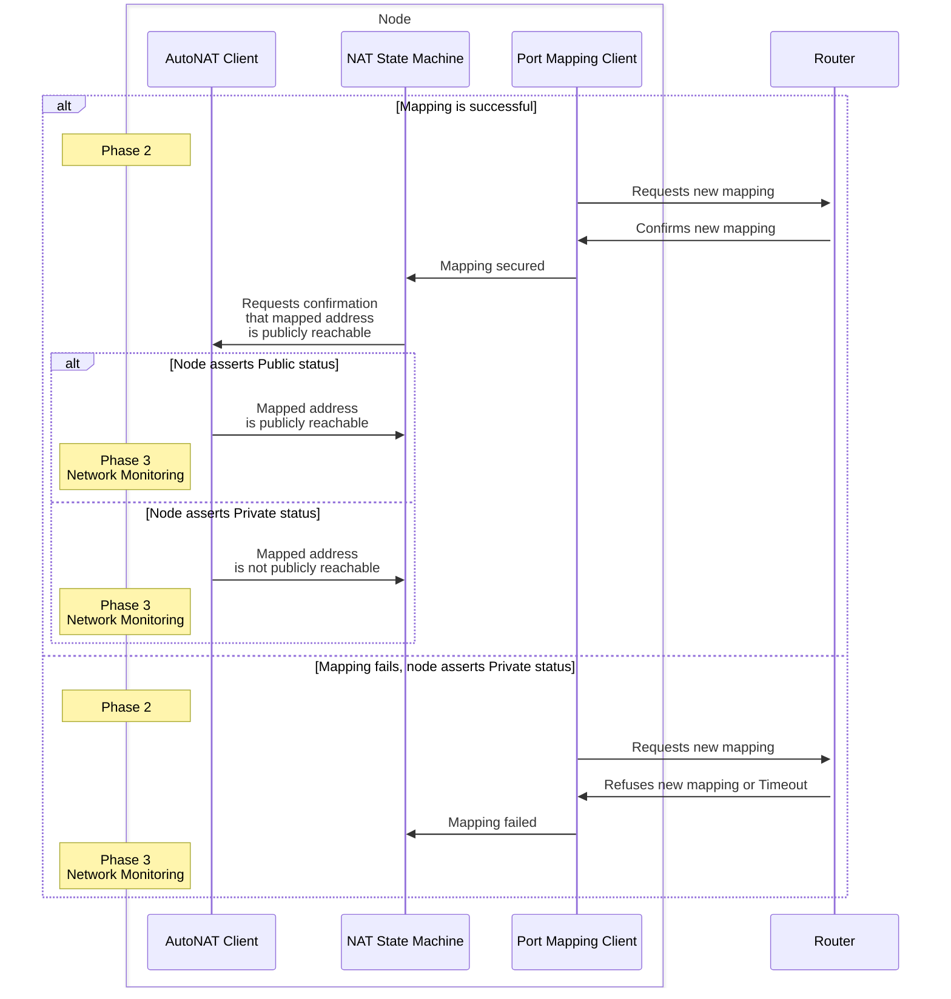
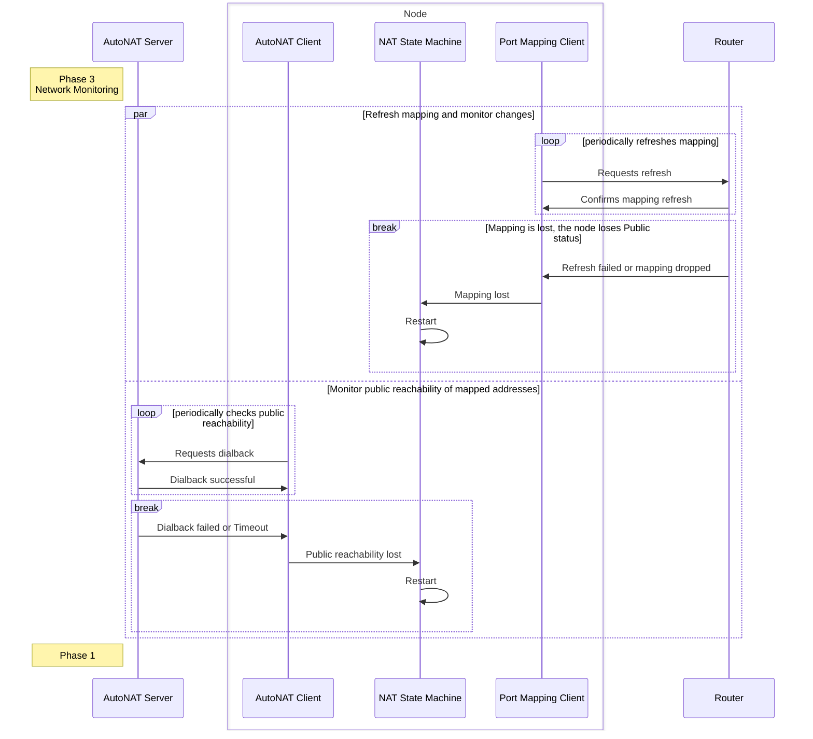

# P2P-NAT-SOLUTION

| Field | Value |
| --- | --- |
| Name | Nomos P2P Network NAT Solution Specification |
| Status | raw |
| Category | networking |
| Editor | Antonio Antonino <antonio@status.im> |
| Contributors | Álvaro Castro-Castilla <alvaro@status.im>, Daniel Sanchez-Quiros <danielsq@status.im>, Petar Radovic <petar@status.im>, Gusto Bacvinka <augustinas@status.im>, Youngjoon Lee <youngjoon@status.im>, Filip Dimitrijevic <filip@status.im> |

## Abstract

This specification defines a comprehensive NAT (Network Address Translation) traversal solution for the Nomos P2P network. The solution enables nodes to automatically determine their NAT status and establish both outbound and inbound connections regardless of network configuration. The strategy combines [AutoNAT](https://github.com/libp2p/specs/blob/master/autonat/autonat-v2.md), dynamic port mapping protocols, and continuous verification to maximize public reachability while maintaining decentralized operation.

## Motivation

Network Address Translation presents a critical challenge for Nomos participants, particularly those operating on consumer hardware without technical expertise. The Nomos network requires a NAT traversal solution that:

1. **Automatic Operation**: Works out-of-the-box without user configuration
2. **Inclusive Participation**: Enables nodes on consumer hardware to participate effectively
3. **Decentralized Approach**: Leverages the existing Nomos P2P network rather than centralized services
4. **Progressive Fallback**: Escalates through increasingly complex protocols as needed
5. **Dynamic Adaptation**: Handles changing network environments and configurations

The solution must ensure that nodes can both establish outbound connections and accept inbound connections from other peers, maintaining network connectivity across diverse NAT configurations.

## Specification

### Terminology

- **Public Node**: A node that is publicly reachable via a public IP address or valid port mapping
- **Private Node**: A node that is not publicly reachable due to NAT/firewall restrictions
- **Dialing**: The process of establishing a connection using the [libp2p protocol](https://docs.libp2p.io/) stack
- **NAT Status**: Whether a node is publicly reachable or hidden behind NAT

### Key Design Principles

#### Optional Configuration

The NAT traversal strategy must work out-of-the-box whenever possible. Users who do not want to engage in configuration should only need to install the node software package. However, users requiring full control must be able to configure every aspect of the strategy.

#### Decentralized Operation

The solution leverages the existing Nomos P2P network for coordination rather than relying on centralized third-party services. This maintains the decentralized nature of the network while providing necessary NAT traversal capabilities.

#### Progressive Fallback

The protocol begins with lightweight checks and escalates through more complex and resource-intensive protocols. Failure at any step moves the protocol to the next stage in the strategy, ensuring maximum compatibility across network configurations.

#### Dynamic Network Environment

Unless explicitly configured for static addresses, each node's public or private status is assumed to be dynamic. A once publicly-reachable node can become unreachable and vice versa, requiring continuous monitoring and adaptation.

### Node Discovery Considerations

The Nomos public network encourages participation from a large number of nodes, many deployed through simple installation procedures. Some nodes will not achieve Public status, but the discovery protocol must track these peers and allow other nodes to discover them. This prevents network partitioning and ensures Private nodes remain accessible to other participants.

### NAT Traversal Protocol

#### Protocol Requirements

**Each node MUST:**

- Run an [AutoNAT](https://github.com/libp2p/specs/blob/master/autonat/autonat-v2.md) client, except for nodes statically configured as Public
- Use the [Identify protocol](https://github.com/libp2p/specs/blob/master/identify/README.md) to advertise support for:
  - `/nomos/autonat/2/dial-request` for main network
  - `/nomos-testnet/autonat/2/dial-request` for public testnet
  - `/nomos/autonat/2/dial-back` and `/nomos-testnet/autonat/2/dial-back` respectively

#### NAT State Machine

The NAT traversal process follows a multi-phase state machine:



### Phase Implementation

#### Phase 0: Bootstrapping and Identifying Public Nodes

If the node is statically configured by the operator to be Public, the procedure stops here.

The node utilizes bootstrapping and discovery mechanisms to find other Public nodes. The [Identify protocol](https://github.com/libp2p/specs/blob/master/identify/README.md) confirms which detected Public nodes support [AutoNAT v2](https://github.com/libp2p/specs/blob/master/autonat/autonat-v2.md).

#### Phase 1: NAT Detection

The node starts an [AutoNAT](https://github.com/libp2p/specs/blob/master/autonat/autonat-v2.md) client and inspects its own addresses. For each public IP address, the node verifies public reachability via [AutoNAT](https://github.com/libp2p/specs/blob/master/autonat/autonat-v2.md). If any public IP addresses are confirmed, the node assumes Public status and moves to Phase 3. Otherwise, it continues to Phase 2.

#### Phase 2: Automated Port Mapping

The node attempts to secure port mapping on the default gateway using:

- **[PCP](https://datatracker.ietf.org/doc/html/rfc6887)** (Port Control Protocol) - Most reliable
- **[NAT-PMP](https://datatracker.ietf.org/doc/html/rfc6886)** (NAT Port Mapping Protocol) - Second most reliable  
- **[UPnP-IGD](https://datatracker.ietf.org/doc/html/rfc6970)** (Universal Plug and Play Internet Gateway Device) - Most widely deployed

**Port Mapping Algorithm:**

```python
def try_port_mapping():
    # Step 1: Get the local IPv4 address
    local_ip = get_local_ipv4_address()
    
    # Step 2: Get the default gateway IPv4 address
    gateway_ip = get_default_gateway_address()
    
    # Step 3: Abort if local or gateway IP could not be determined
    if not local_ip or not gateway_ip:
        return "Mapping failed: Unable to get local or gateway IPv4"

    # Step 4: Probe the gateway for protocol support
    supports_pcp = probe_pcp(gateway_ip)
    supports_nat_pmp = probe_nat_pmp(gateway_ip)
    supports_upnp = probe_upnp(gateway_ip)  # Optional for logging

    # Step 5-9: Try protocols in order of reliability
    # PCP (most reliable) -> NAT-PMP -> UPnP -> fallback attempts
    
    protocols = [
        (supports_pcp, try_pcp_mapping),
        (supports_nat_pmp, try_nat_pmp_mapping),
        (True, try_upnp_mapping),  # Always try UPnP
        (not supports_pcp, try_pcp_mapping),  # Fallback
        (not supports_nat_pmp, try_nat_pmp_mapping)  # Last resort
    ]
    
    for supported, mapping_func in protocols:
        if supported:
            mapping = mapping_func(local_ip, gateway_ip)
            if mapping:
                return mapping
    
    return "Mapping failed: No protocol succeeded"
```

If mapping succeeds, the node uses [AutoNAT](https://github.com/libp2p/specs/blob/master/autonat/autonat-v2.md) to confirm public reachability. Upon confirmation, the node assumes Public status. Otherwise, it assumes Private status.

**Port Mapping Sequence:**



#### Phase 3: Network Monitoring

Unless explicitly configured, nodes must monitor their network status and restart from Phase 1 when changes are detected.

**Public Node Monitoring:**

A Public node must restart when:

- [AutoNAT](https://github.com/libp2p/specs/blob/master/autonat/autonat-v2.md) client no longer confirms public reachability
- A previously successful port mapping is lost or refresh fails

**Private Node Monitoring:**

A Private node must restart when:

- It gains a new public IP address
- Port mapping is likely to succeed (gateway change, sufficient time passed)

**Network Monitoring Sequence:**



### Public Node Responsibilities

**A Public node MUST:**

- Run an [AutoNAT](https://github.com/libp2p/specs/blob/master/autonat/autonat-v2.md) server
- Listen on and advertise via [Identify protocol](https://github.com/libp2p/specs/blob/master/identify/README.md) its publicly reachable [multiaddresses](https://github.com/libp2p/specs/blob/master/addressing/README.md):
  
  `/{public_peer_ip}/udp/{port}/quic-v1/p2p/{public_peer_id}`

- Periodically renew port mappings according to protocol recommendations
- Maintain high availability for [AutoNAT](https://github.com/libp2p/specs/blob/master/autonat/autonat-v2.md) services

### Peer Dialing

Other peers can always dial a Public peer using its publicly reachable [multiaddresses](https://github.com/libp2p/specs/blob/master/addressing/README.md):

`/{public_peer_ip}/udp/{port}/quic-v1/p2p/{public_peer_id}`

## Implementation Requirements

### Mandatory Components

All Nomos nodes MUST implement:

1. **[AutoNAT](https://github.com/libp2p/specs/blob/master/autonat/autonat-v2.md) client** for NAT status detection
2. **Port mapping clients** for [PCP](https://datatracker.ietf.org/doc/html/rfc6887), [NAT-PMP](https://datatracker.ietf.org/doc/html/rfc6886), and [UPnP-IGD](https://datatracker.ietf.org/doc/html/rfc6970)
3. **[Identify protocol](https://github.com/libp2p/specs/blob/master/identify/README.md)** for capability advertisement
4. **Network monitoring** for status change detection

### Optional Enhancements

Nodes MAY implement:

- Custom port mapping retry strategies
- Enhanced network change detection
- Advanced [AutoNAT](https://github.com/libp2p/specs/blob/master/autonat/autonat-v2.md) server load balancing
- Backup connectivity mechanisms

### Configuration Parameters

#### [AutoNAT](https://github.com/libp2p/specs/blob/master/autonat/autonat-v2.md) Configuration

```yaml
autonat:
  client:
    dial_timeout: 15s
    max_peer_addresses: 16
    throttle_global_limit: 30
    throttle_peer_limit: 3
  server:
    dial_timeout: 30s
    max_peer_addresses: 16
    throttle_global_limit: 30
    throttle_peer_limit: 3
```

#### Port Mapping Configuration

```yaml
port_mapping:
  pcp:
    timeout: 30s
    lifetime: 7200s  # 2 hours
    retry_interval: 300s
  nat_pmp:
    timeout: 30s
    lifetime: 7200s
    retry_interval: 300s
  upnp:
    timeout: 30s
    lease_duration: 7200s
    retry_interval: 300s
```

## Security Considerations

### NAT Traversal Security

1. **Port Mapping Validation**: Verify that requested port mappings are actually created
2. **[AutoNAT](https://github.com/libp2p/specs/blob/master/autonat/autonat-v2.md) Server Trust**: Implement peer reputation for [AutoNAT](https://github.com/libp2p/specs/blob/master/autonat/autonat-v2.md) servers
3. **Gateway Communication**: Secure communication with NAT devices
4. **Address Validation**: Validate public addresses before advertisement

### Privacy Considerations

1. **IP Address Exposure**: Public nodes necessarily expose IP addresses
2. **Traffic Analysis**: Monitor for patterns that could reveal node behavior
3. **Gateway Information**: Minimize exposure of internal network topology

### Denial of Service Protection

1. **[AutoNAT](https://github.com/libp2p/specs/blob/master/autonat/autonat-v2.md) Rate Limiting**: Implement request throttling for [AutoNAT](https://github.com/libp2p/specs/blob/master/autonat/autonat-v2.md) services
2. **Port Mapping Abuse**: Prevent excessive port mapping requests
3. **Resource Exhaustion**: Limit concurrent NAT traversal attempts

## Performance Characteristics

### Scalability

- **[AutoNAT](https://github.com/libp2p/specs/blob/master/autonat/autonat-v2.md) Server Load**: Distributed across Public nodes
- **Port Mapping Overhead**: Minimal ongoing resource usage
- **Network Monitoring**: Efficient periodic checks

### Reliability

- **Fallback Mechanisms**: Multiple protocols ensure high success rates
- **Continuous Monitoring**: Automatic recovery from connectivity loss
- **Protocol Redundancy**: Multiple port mapping protocols increase reliability

## References

1. [Multiaddress spec](https://github.com/libp2p/specs/blob/master/addressing/README.md)
2. [Identify protocol spec](https://github.com/libp2p/specs/blob/master/identify/README.md)
3. [AutoNAT v2 protocol spec](https://github.com/libp2p/specs/blob/master/autonat/autonat-v2.md)
4. [Circuit Relay v2 protocol spec](https://github.com/libp2p/specs/blob/master/relay/circuit-v2.md)
5. [PCP - RFC 6887](https://datatracker.ietf.org/doc/html/rfc6887)
6. [NAT-PMP - RFC 6886](https://datatracker.ietf.org/doc/html/rfc6886)
7. [UPnP IGD - RFC 6970](https://datatracker.ietf.org/doc/html/rfc6970)

## Copyright

Copyright and related rights waived via [CC0](https://creativecommons.org/publicdomain/zero/1.0/).
