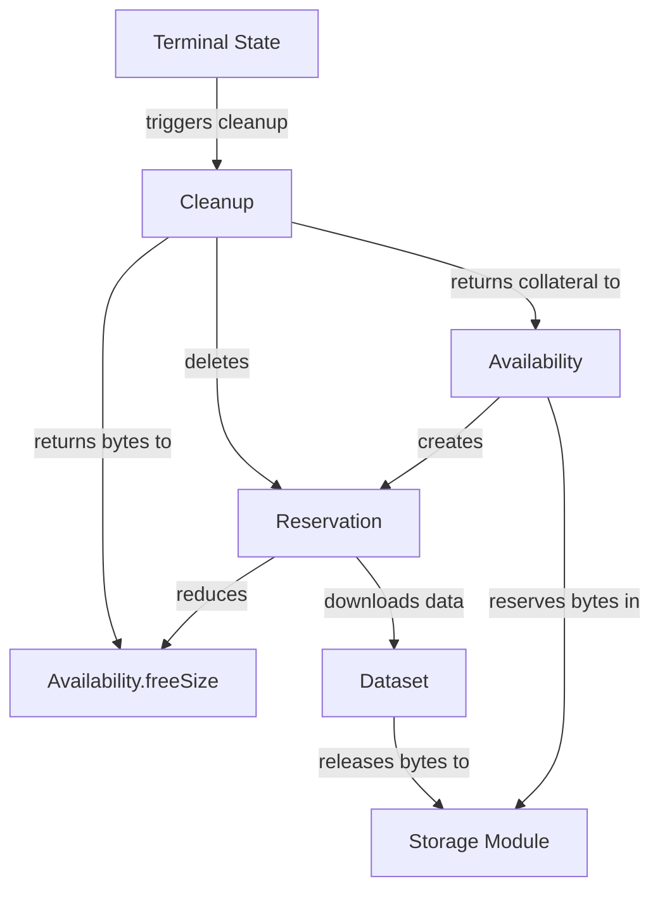

# CODEX-MARKETPLACE

| Field | Value |
| --- | --- |
| Name | Codex Storage Marketplace |
| Slug | 77 |
| Status | deprecated |
| Category | Standards Track |
| Editor | Codex Team and Dmitriy Ryajov <dryajov@status.im> |
| Contributors | Mark Spanbroek <mark@codex.storage>, Adam Uhlíř <adam@codex.storage>, Eric Mastro <eric@codex.storage>, Jimmy Debe <jimmy@status.im>, Filip Dimitrijevic <filip@status.im> |

<!-- timeline:start -->

## Timeline

- **2026-01-22** — [`af45aae`](https://github.com/vacp2p/rfc-index/blob/af45aae01271637142fa931e673dc7c8627f480e/docs/storage/deprecated/codex-marketplace.md) — chore: deprecate Marketplace-related specs (#268)
- **2026-01-19** — [`f24e567`](https://github.com/vacp2p/rfc-index/blob/f24e567d0b1e10c178bfa0c133495fe83b969b76/docs/storage/raw/codex-marketplace.md) — Chore/updates mdbook (#262)
- **2026-01-16** — [`89f2ea8`](https://github.com/vacp2p/rfc-index/blob/89f2ea89fc1d69ab238b63c7e6fb9e4203fd8529/docs/storage/raw/codex-marketplace.md) — Chore/mdbook updates (#258)
- **2025-12-22** — [`0f1855e`](https://github.com/vacp2p/rfc-index/blob/0f1855edcf68ef982c4ce478b67d660809aa9830/docs/codex/raw/codex-marketplace.md) — Chore/fix headers (#239)
- **2025-12-22** — [`b1a5783`](https://github.com/vacp2p/rfc-index/blob/b1a578393edf8487ccc97a5f25b25af9bf41efb3/docs/codex/raw/codex-marketplace.md) — Chore/mdbook updates (#237)
- **2025-12-18** — [`d03e699`](https://github.com/vacp2p/rfc-index/blob/d03e699084774ebecef9c6d4662498907c5e2080/docs/codex/raw/codex-marketplace.md) — ci: add mdBook configuration (#233)
- **2025-11-19** — [`d2df7e0`](https://github.com/vacp2p/rfc-index/blob/d2df7e0c2dbb38d5b01a504f0b8ccbaea95fe821/codex/raw/codex-marketplace.md) — Created codex/raw/codex-marketplace.md file, without integration of Sales a… (#208)

<!-- timeline:end -->


## Abstract

Codex Marketplace and its interactions are defined by a smart contract deployed on an EVM-compatible blockchain. This specification describes these interactions for the various roles within the network.

The document is intended for implementors of Codex nodes.

## Semantics

The keywords "MUST", "MUST NOT", "REQUIRED", "SHALL", "SHALL NOT", "SHOULD", "SHOULD NOT", "RECOMMENDED", "MAY", and "OPTIONAL" in this document are to be interpreted as described in [2119](https://www.ietf.org/rfc/rfc2119.txt).

### Definitions

| Terminology               | Description                                                                                                               |
|---------------------------|---------------------------------------------------------------------------------------------------------------------------|
| Storage Provider (SP)      | A node in the Codex network that provides storage services to the marketplace.                                             |
| Validator                  | A node that assists in identifying missing storage proofs.                                                                |
| Client                     | A node that interacts with other nodes in the Codex network to store, locate, and retrieve data.                           |
| Storage Request or Request | A request created by a client node to persist data on the Codex network.                                                  |
| Slot or Storage Slot       | A space allocated by the storage request to store a piece of the request's dataset.              |
| Smart Contract             | A smart contract implementing the marketplace functionality.                                                               |
| Token               | The ERC20-based token used within the Codex network.     |

## Motivation

The Codex network aims to create a peer-to-peer storage engine with robust data durability, data persistence guarantees, and a comprehensive incentive structure.

The marketplace is a critical component of the Codex network, serving as a platform where all involved parties interact to ensure data persistence. It provides mechanisms to enforce agreements and facilitate data repair when SPs fail to fulfill their duties.

Implemented as a smart contract on an EVM-compatible blockchain, the marketplace enables various scenarios where nodes assume one or more roles to maintain a reliable persistence layer for users. This specification details these interactions.

The marketplace contract manages storage requests, maintains the state of allocated storage slots, and orchestrates SP rewards, collaterals, and storage proofs.

A node that wishes to participate in the Codex persistence layer MUST implement one or more roles described in this document.

### Roles

A node can assume one of the three main roles in the network: the client, SP, and validator.

A client is a potentially short-lived node in the network with the purpose of persisting its data in the Codex persistence layer.

An SP is a long-lived node providing storage for clients in exchange for profit. To ensure a reliable, robust service for clients, SPs are required to periodically provide proofs that they are persisting the data.

A validator ensures that SPs have submitted valid proofs each period where the smart contract required a proof to be submitted for slots filled by the SP.

---

## Part I: Protocol Specification

This part defines the **normative requirements** for the Codex Marketplace protocol. All implementations MUST comply with these requirements to participate in the Codex network. The protocol is defined by smart contract interactions on an EVM-compatible blockchain.

## Storage Request Lifecycle

The diagram below depicts the lifecycle of a storage request:

```text
                      ┌───────────┐
                      │ Cancelled │
                      └───────────┘
                            ▲
                            │ Not all
                            │ Slots filled
                            │
    ┌───────────┐    ┌──────┴─────────────┐           ┌─────────┐
    │ Submitted ├───►│ Slots Being Filled ├──────────►│ Started │
    └───────────┘    └────────────────────┘ All Slots └────┬────┘
                                            Filled         │
                                                           │
                                   ┌───────────────────────┘
                           Proving ▼
    ┌────────────────────────────────────────────────────────────┐
    │                                                            │
    │                 Proof submitted                            │
    │       ┌─────────────────────────► All good                 │
    │       │                                                    │
    │ Proof required                                             │
    │       │                                                    │
    │       │         Proof missed                               │
    │       └─────────────────────────► After some time slashed  │
    │                                   eventually Slot freed    │
    │                                                            │
    └────────┬─┬─────────────────────────────────────────────────┘
             │ │                                      ▲
             │ │                                      │
             │ │ SP kicked out and Slot freed ┌───────┴────────┐
All good     │ ├─────────────────────────────►│ Repair process │
Time ran out │ │                              └────────────────┘
             │ │
             │ │ Too many Slots freed         ┌────────┐
             │ └─────────────────────────────►│ Failed │
             ▼                                └────────┘
       ┌──────────┐
       │ Finished │
       └──────────┘
```

## Client Role

A node implementing the client role mediates the persistence of data within the Codex network.

A client has two primary responsibilities:

- Requesting storage from the network by sending a storage request to the smart contract.
- Withdrawing funds from the storage requests previously created by the client.

### Creating Storage Requests

When a user prompts the client node to create a storage request, the client node SHOULD receive the input parameters for the storage request from the user.

To create a request to persist a dataset on the Codex network, client nodes MUST split the dataset into data chunks, $(c_1, c_2, c_3, \ldots, c_{n})$. Using the erasure coding method and the provided input parameters, the data chunks are encoded and distributed over a number of slots. The applied erasure coding method MUST use the [Reed-Solomon algorithm](https://hackmd.io/FB58eZQoTNm-dnhu0Y1XnA). The final slot roots and other metadata MUST be placed into a `Manifest` (TODO: Manifest RFC). The CID for the `Manifest` MUST then be used as the `cid` for the stored dataset.

After the dataset is prepared, a client node MUST call the smart contract function `requestStorage(request)`, providing the desired request parameters in the `request` parameter. The `request` parameter is of type `Request`:

```solidity
struct Request {
  address client;
  Ask ask;
  Content content;
  uint64 expiry;
  bytes32 nonce;
}

struct Ask {
  uint256 proofProbability;
  uint256 pricePerBytePerSecond;
  uint256 collateralPerByte;
  uint64 slots;
  uint64 slotSize;
  uint64 duration;
  uint64 maxSlotLoss;
}

struct Content {
  bytes cid;
  bytes32 merkleRoot;
}
```

The table below provides the description of the `Request` and the associated types attributes:

| attribute | type | description |
|-----------|------|-------------|
| `client` | `address` | The Codex node requesting storage. |
| `ask` | `Ask` | Parameters of Request. |
| `content` | `Content` | The dataset that will be hosted with the storage request. |
| `expiry` | `uint64` | Timeout in seconds during which all the slots have to be filled, otherwise Request will get cancelled. The final deadline timestamp is calculated at the moment the transaction is mined. |
| `nonce` | `bytes32` | Random value to differentiate from other requests of same parameters. It SHOULD be a random byte array. |
| `pricePerBytePerSecond` | `uint256` | Amount of tokens that will be awarded to SPs for finishing the storage request. It MUST be an amount of tokens offered per slot per second per byte. The Ethereum address that submits the `requestStorage()` transaction MUST have [approval](https://docs.openzeppelin.com/contracts/2.x/api/token/erc20#IERC20-approve-address-uint256-) for the transfer of at least an equivalent amount of full reward (`pricePerBytePerSecond * duration * slots * slotSize`) in tokens. |
| `collateralPerByte` | `uint256` | The amount of tokens per byte of slot's size that SPs submit when they fill slots. Collateral is then slashed or forfeited if SPs fail to provide the service requested by the storage request (more information in the [Slashing](#### Slashing) section). |
| `proofProbability` | `uint256` | Determines the average frequency that a proof is required within a period: $\frac{1}{proofProbability}$. SPs are required to provide proofs of storage to the marketplace contract when challenged. To prevent hosts from only coming online when proofs are required, the frequency at which proofs are requested from SPs is stochastic and is influenced by the `proofProbability` parameter. |
| `duration` | `uint64` | Total duration of the storage request in seconds. It MUST NOT exceed the limit specified in the configuration `config.requestDurationLimit`. |
| `slots` | `uint64` | The number of requested slots. The slots will all have the same size. |
| `slotSize` | `uint64` | Amount of storage per slot in bytes. |
| `maxSlotLoss` | `uint64` |  Max slots that can be lost without data considered to be lost. |
| `cid`     | `bytes` | An identifier used to locate the Manifest representing the dataset. It MUST be a [CIDv1](https://github.com/multiformats/cid#cidv1), SHA-256 [multihash](https://github.com/multiformats/multihash) and the data it represents SHOULD be discoverable in the network, otherwise the request will be eventually canceled. |
| `merkleRoot` | `bytes32` | Merkle root of the dataset, used to verify storage proofs |

#### Renewal of Storage Requests

It should be noted that the marketplace does not support extending requests. It is REQUIRED that if the user wants to extend the duration of a request, a new request with the same CID must be [created](### Creating Storage Requests) **before the original request completes**.

This ensures that the data will continue to persist in the network at the time when the new (or existing) SPs need to retrieve the complete dataset to fill the slots of the new request.

### Monitoring and State Management

Client nodes MUST implement the following smart contract interactions for monitoring and state management:

- **getRequest(requestId)**: Retrieve the full `StorageRequest` data from the marketplace. This function is used for recovery and state verification after restarts or failures.

- **requestState(requestId)**: Query the current state of a storage request. Used for monitoring request progress and determining the appropriate client actions.

- **requestExpiresAt(requestId)**: Query when the request will expire if not fulfilled.

- **getRequestEnd(requestId)**: Query when a fulfilled request will end (used to determine when to call `freeSlot` or `withdrawFunds`).

Client nodes MUST subscribe to the following marketplace events:

- **RequestFulfilled(requestId)**: Emitted when a storage request has enough filled slots to start. Clients monitor this event to determine when their request becomes active and transitions from the submission phase to the active phase.

- **RequestFailed(requestId)**: Emitted when a storage request fails due to proof failures or other reasons. Clients observe this event to detect failed requests and initiate fund withdrawal.

### Withdrawing Funds

The client node MUST monitor the status of the requests it created. When a storage request enters the `Cancelled`, `Failed`, or `Finished` state, the client node MUST initiate the withdrawal of the remaining or refunded funds from the smart contract using the `withdrawFunds(requestId)` function.

Request states are determined as follows:

- The request is considered `Cancelled` if no `RequestFulfilled(requestId)` event is observed during the timeout specified by the value returned from the `requestExpiresAt(requestId)` function.
- The request is considered `Failed` when the `RequestFailed(requestId)` event is observed.
- The request is considered `Finished` after the interval specified by the value returned from the `getRequestEnd(requestId)` function has elapsed.

## Storage Provider Role

A Codex node acting as an SP persists data across the network by hosting slots requested by clients in their storage requests.

The following tasks need to be considered when hosting a slot:

- Filling a slot
- Proving
- Repairing a slot
- Collecting request reward and collateral

### Filling Slots

When a new request is created, the `StorageRequested(requestId, ask, expiry)` event is emitted with the following properties:

- `requestId` - the ID of the request.
- `ask` - the specification of the request parameters. For details, see the definition of the `Request` type in the [Creating Storage Requests](### Creating Storage Requests) section above.
- `expiry` - a Unix timestamp specifying when the request will be canceled if all slots are not filled by then.

It is then up to the SP node to decide, based on the emitted parameters and node's operator configuration, whether it wants to participate in the request and attempt to fill its slot(s) (note that one SP can fill more than one slot). If the SP node decides to ignore the request, no further action is required. However, if the SP decides to fill a slot, it MUST follow the remaining steps described below.

The node acting as an SP MUST decide which slot, specified by the slot index, it wants to fill. The SP MAY attempt to fill more than one slot. To fill a slot, the SP MUST first reserve the slot in the smart contract using `reserveSlot(requestId, slotIndex)`. If reservations for this slot are full, or if the SP has already reserved the slot, the transaction will revert. If the reservation was unsuccessful, then the SP is not allowed to fill the slot. If the reservation was successful, the node MUST then download the slot data using the CID of the manifest (**TODO: Manifest RFC**) and the slot index. The CID is specified in `request.content.cid`, which can be retrieved from the smart contract using `getRequest(requestId)`. Then, the node MUST generate a proof over the downloaded data (**TODO: Proving RFC**).

When the proof is ready, the SP MUST call `fillSlot()` on the smart contract with the following REQUIRED parameters:

- `requestId` - the ID of the request.
- `slotIndex` - the slot index that the node wants to fill.
- `proof` - the `Groth16Proof` proof structure, generated over the slot data.

The Ethereum address of the SP node from which the transaction originates MUST have [approval](https://docs.openzeppelin.com/contracts/2.x/api/token/erc20#IERC20-approve-address-uint256-) for the transfer of at least the amount of tokens required as collateral for the slot (`collateralPerByte * slotSize`).

If the proof delivered by the SP is invalid or the slot was already filled by another SP, then the transaction will revert. Otherwise, a `SlotFilled(requestId, slotIndex)` event is emitted. If the transaction is successful, the SP SHOULD transition into the **proving** state, where it will need to submit proof of data possession when challenged by the smart contract.

It should be noted that if the SP node observes a `SlotFilled` event for the slot it is currently downloading the dataset for or generating the proof for, it means that the slot has been filled by another node in the meantime. In response, the SP SHOULD stop its current operation and attempt to fill a different, unfilled slot.

### Proving

Once an SP fills a slot, it MUST submit proofs to the marketplace contract when a challenge is issued by the contract. SPs SHOULD detect that a proof is required for the current period using the `isProofRequired(slotId)` function, or that it will be required using the `willProofBeRequired(slotId)` function in the case that the [proving clock pointer is in downtime](https://github.com/codex-storage/codex-research/blob/41c4b4409d2092d0a5475aca0f28995034e58d14/design/storage-proof-timing.md).

Once an SP knows it has to provide a proof it MUST get the proof challenge using `getChallenge(slotId)`, which then
MUST be incorporated into the proof generation as described in Proving RFC (**TODO: Proving RFC**).

When the proof is generated, it MUST be submitted by calling the `submitProof(slotId, proof)` smart contract function.

#### Slashing

There is a slashing scheme orchestrated by the smart contract to incentivize correct behavior and proper proof submissions by SPs. This scheme is configured at the smart contract level and applies uniformly to all participants in the network. The configuration of the slashing scheme can be obtained via the `configuration()` contract call.

The slashing works as follows:

- When SP misses a proof and a validator trigger detection of this event using the `markProofAsMissing()` call, the SP is slashed by `config.collateral.slashPercentage` **of the originally required collateral** (hence the slashing amount is always the same for a given request).
- If the number of slashes exceeds `config.collateral.maxNumberOfSlashes`, the slot is freed, the remaining collateral is burned, and the slot is offered to other nodes for repair. The smart contract also emits the `SlotFreed(requestId, slotIndex)` event.

If, at any time, the number of freed slots exceeds the value specified by the `request.ask.maxSlotLoss` parameter, the dataset is considered lost, and the request is deemed _failed_. The collateral of all SPs that hosted the slots associated with the storage request is burned, and the `RequestFailed(requestId)` event is emitted.

### Repair

When a slot is freed due to too many missed proofs, which SHOULD be detected by listening to the `SlotFreed(requestId, slotIndex)` event, an SP node can decide whether to participate in repairing the slot. Similar to filling a slot, the node SHOULD consider the operator's configuration when making this decision. The SP that originally hosted the slot but failed to comply with proving requirements MAY also participate in the repair. However, by refilling the slot, the SP **will not** recover its original collateral and must submit new collateral using the `fillSlot()` call.

The repair process is similar to filling slots. If the original slot dataset is no longer present in the network, the SP MAY use erasure coding to reconstruct the dataset. Reconstructing the original slot dataset requires retrieving other pieces of the dataset stored in other slots belonging to the request. For this reason, the node that successfully repairs a slot is entitled to an additional reward. (**TODO: Implementation**)

The repair process proceeds as follows:

1. The SP observes the `SlotFreed` event and decides to repair the slot.
2. The SP MUST reserve the slot with the `reserveSlot(requestId, slotIndex)` call. For more information see the [Filling Slots](###filling slots) section.
3. The SP MUST download the chunks of data required to reconstruct the freed slot's data. The node MUST use the [Reed-Solomon algorithm](https://hackmd.io/FB58eZQoTNm-dnhu0Y1XnA) to reconstruct the missing data.
4. The SP MUST generate proof over the reconstructed data.
5. The SP MUST call the `fillSlot()` smart contract function with the same parameters and collateral allowance as described in the [Filling Slots](###filling slots) section.

### Collecting Funds

An SP node SHOULD monitor the requests and the associated slots it hosts.

When a storage request enters the `Cancelled`, `Finished`, or `Failed` state, the SP node SHOULD call the `freeSlot(slotId)` smart contract function.

The aforementioned storage request states (`Cancelled`, `Finished`, and `Failed`) can be detected as follows:

- A storage request is considered `Cancelled` if no `RequestFulfilled(requestId)` event is observed within the time indicated by the `expiry` request parameter. Note that a `RequestCancelled` event may also be emitted, but the node SHOULD NOT rely on this event to assert the request expiration, as the `RequestCancelled` event is not guaranteed to be emitted at the time of expiry.
- A storage request is considered `Finished` when the time indicated by the value returned from the `getRequestEnd(requestId)` function has elapsed.
- A node concludes that a storage request has `Failed` upon observing the `RequestFailed(requestId)` event.

For each of the states listed above, different funds are handled as follows:

- In the `Cancelled` state, the collateral is returned along with a proportional payout based on the time the node actually hosted the dataset before the expiry was reached.
- In the `Finished` state, the full reward for hosting the slot, along with the collateral, is collected.
- In the `Failed` state, no funds are collected. The reward is returned to the client, and the collateral is burned. The slot is removed from the list of slots and is no longer included in the list of slots returned by the `mySlots()` function.

## Validator Role

In a blockchain, a contract cannot change its state without a transaction and gas initiating the state change. Therefore, our smart contract requires an external trigger to periodically check and confirm that a storage proof has been delivered by the SP. This is where the validator role is essential.

The validator role is fulfilled by nodes that help to verify that SPs have submitted the required storage proofs.

It is the smart contract that checks if the proof requested from an SP has been delivered. The validator only triggers the decision-making function in the smart contract. To incentivize validators, they receive a reward each time they correctly mark a proof as missing corresponding to the percentage of the slashed collateral defined by `config.collateral.validatorRewardPercentage`.

Each time a validator observes the `SlotFilled` event, it SHOULD add the slot reported in the `SlotFilled` event to the validator's list of watched slots. Then, after the end of each period, a validator has up to `config.proofs.timeout` seconds (a configuration parameter retrievable with `configuration()`) to validate all the slots. If a slot lacks the required proof, the validator SHOULD call the `markProofAsMissing(slotId, period)` function on the smart contract. This function validates the correctness of the claim, and if right, will send a reward to the validator.

If validating all the slots observed by the validator is not feasible within the specified `timeout`, the validator MAY choose to validate only a subset of the observed slots.

---

## Part II: Implementation Suggestions

> **IMPORTANT**: The sections above (Abstract through Validator Role) define the normative Codex Marketplace protocol requirements. All implementations MUST comply with those protocol requirements to participate in the Codex network.
>
> **The sections below are non-normative**. They document implementation approaches used in the nim-codex reference implementation. These are suggestions to guide implementors but are NOT required by the protocol. Alternative implementations MAY use different approaches as long as they satisfy the protocol requirements defined in Part I.

## Implementation Suggestions

This section describes implementation approaches used in reference implementations. These are **suggestions and not normative requirements**. Implementations are free to use different internal architectures, state machines, and data structures as long as they correctly implement the protocol requirements defined above.

### Storage Provider Implementation

The nim-codex reference implementation provides a complete Storage Provider implementation with state machine management, slot queueing, and resource management. This section documents the nim-codex approach.

#### State Machine

The Sales module implements a deterministic state machine for each slot, progressing through the following states:

1. **SalePreparing** - Find a matching availability and create a reservation
2. **SaleSlotReserving** - Reserve the slot on the marketplace
3. **SaleDownloading** - Stream and persist the slot's data
4. **SaleInitialProving** - Wait for stable challenge and generate initial proof
5. **SaleFilling** - Compute collateral and fill the slot
6. **SaleFilled** - Post-filling operations and expiry updates
7. **SaleProving** - Generate and submit proofs periodically
8. **SalePayout** - Free slot and calculate collateral
9. **SaleFinished** - Terminal success state
10. **SaleFailed** - Free slot on market and transition to error
11. **SaleCancelled** - Cancellation path
12. **SaleIgnored** - Sale ignored (no matching availability or other conditions)
13. **SaleErrored** - Terminal error state
14. **SaleUnknown** - Recovery state for crash recovery
15. **SaleProvingSimulated** - Proving with injected failures for testing

All states move to `SaleErrored` if an error is raised.

##### SalePreparing

- Find a matching availability based on the following criteria: `freeSize`, `duration`, `collateralPerByte`, `minPricePerBytePerSecond` and `until`
- Create a reservation
- Move to `SaleSlotReserving` if successful
- Move to `SaleIgnored` if no availability is found or if `BytesOutOfBoundsError` is raised because of no space available.
- Move to `SaleFailed` on `RequestFailed` event from the `marketplace`
- Move to `SaleCancelled` on cancelled timer elapsed, set to storage contract expiry

##### SaleSlotReserving

- Check if the slot can be reserved
- Move to `SaleDownloading` if successful
- Move to `SaleIgnored` if `SlotReservationNotAllowedError` is raised or the slot cannot be reserved. The collateral is returned.
- Move to `SaleFailed` on `RequestFailed` event from the `marketplace`
- Move to `SaleCancelled` on cancelled timer elapsed, set to storage contract expiry

##### SaleDownloading

- Select the correct data expiry:
  - When the request is started, the request end date is used
  - Otherwise the expiry date is used
- Stream and persist data via `onStore`
- For each written batch, release bytes from the reservation
- Move to `SaleInitialProving` if successful
- Move to `SaleFailed` on `RequestFailed` event from the `marketplace`
- Move to `SaleCancelled` on cancelled timer elapsed, set to storage contract expiry
- Move to `SaleFilled` on `SlotFilled` event from the `marketplace`

##### SaleInitialProving

- Wait for a stable initial challenge
- Produce the initial proof via `onProve`
- Move to `SaleFilling` if successful
- Move to `SaleFailed` on `RequestFailed` event from the `marketplace`
- Move to `SaleCancelled` on cancelled timer elapsed, set to storage contract expiry

##### SaleFilling

- Get the slot collateral
- Fill the slot
- Move to `SaleFilled` if successful
- Move to `SaleIgnored` on `SlotStateMismatchError`. The collateral is returned.
- Move to `SaleFailed` on `RequestFailed` event from the `marketplace`
- Move to `SaleCancelled` on cancelled timer elapsed, set to storage contract expiry

##### SaleFilled

- Ensure that the current host has filled the slot by checking the signer address
- Notify by calling `onFilled` hook
- Call `onExpiryUpdate` to change the data expiry from expiry date to request end date
- Move to `SaleProving` (or `SaleProvingSimulated` for simulated mode)
- Move to `SaleFailed` on `RequestFailed` event from the `marketplace`
- Move to `SaleCancelled` on cancelled timer elapsed, set to storage contract expiry

##### SaleProving

- For each period: fetch challenge, call `onProve`, and submit proof
- Move to `SalePayout` when the slot request ends
- Re-raise `SlotFreedError` when the slot is freed
- Raise `SlotNotFilledError` when the slot is not filled
- Move to `SaleFailed` on `RequestFailed` event from the `marketplace`
- Move to `SaleCancelled` on cancelled timer elapsed, set to storage contract expiry

##### SaleProvingSimulated

- Submit invalid proofs every `N` periods (`failEveryNProofs` in configuration) to test failure scenarios

##### SalePayout

- Get the current collateral and try to free the slot to ensure that the slot is freed after payout.
- Forward the returned collateral to cleanup
- Move to `SaleFinished` if successful
- Move to `SaleFailed` on `RequestFailed` event from the `marketplace`
- Move to `SaleCancelled` on cancelled timer elapsed, set to storage contract expiry

##### SaleFinished

- Call `onClear` hook
- Call `onCleanUp` hook

##### SaleFailed

- Free the slot
- Move to `SaleErrored` with the failure message

##### SaleCancelled

- Ensure that the node hosting the slot frees the slot
- Call `onClear` hook
- Call `onCleanUp` hook with the current collateral

##### SaleIgnored

- Call `onCleanUp` hook with the current collateral

##### SaleErrored

- Call `onClear` hook
- Call `onCleanUp` hook

##### SaleUnknown

- Recovery entry: get the `on-chain` state and jump to the appropriate state

#### Slot Queue

Slot queue schedules slot work and instantiates one `SalesAgent` per item with bounded concurrency.

- Accepts `(requestId, slotIndex, …)` items and orders them by priority
- Spawns one `SalesAgent` for each dequeued item, in other words, one item for one agent
- Caps concurrent agents to `maxWorkers`
- Supports pause/resume
- Allows controlled requeue when an agent finishes with `reprocessSlot`

##### Slot Ordering

The criteria are in the following order:

1) **Unseen before seen** - Items that have not been seen are dequeued first.
2) **More profitable first** - Higher `profitability` wins. `profitability` is `duration * pricePerSlotPerSecond`.
3) **Less collateral first** - The item with the smaller `collateral` wins.
4) **Later expiry first** - If both items carry an `expiry`, the one with the greater timestamp wins.

Within a single request, per-slot items are shuffled before enqueuing so the default slot-index order does not influence priority.

##### Pause / Resume

When the Slot queue processes an item with `seen = true`, it means that the item was already evaluated against the current availabilities and did not match.
To avoid draining the queue with untenable requests (due to insufficient availability), the queue pauses itself.

The queue resumes when:

- `OnAvailabilitySaved` fires after an availability update that increases one of: `freeSize`, `duration`, `minPricePerBytePerSecond`, or `totalRemainingCollateral`.
- A new unseen item (`seen = false`) is pushed.
- `unpause()` is called explicitly.

##### Reprocess

Availability matching occurs in `SalePreparing`.
If no availability fits at that time, the sale is ignored with `reprocessSlot` to true, meaning that the slot is added back to the queue with the flag `seen` to true.

##### Startup

On `SlotQueue.start()`, the sales module first deletes reservations associated with inactive storage requests, then starts a new `SalesAgent` for each active storage request:

- Fetch the active `on-chain` active slots.
- Delete the local reservations for slots that are not in the active list.
- Create a new agent for each slot and assign the `onCleanUp` callback.
- Start the agent in the `SaleUnknown` state.

#### Main Behaviour

When a new slot request is received, the sales module extracts the pair `(requestId, slotIndex, …)` from the request.
A `SlotQueueItem` is then created with metadata such as `profitability`, `collateral`, `expiry`, and the `seen` flag set to `false`.
This item is pushed into the `SlotQueue`, where it will be prioritised according to the ordering rules.

#### SalesAgent

SalesAgent is the instance that executes the state machine for a single slot.

- Executes the sale state machine across the slot lifecycle
- Holds a `SalesContext` with dependencies and host hooks
- Supports crash recovery via the `SaleUnknown` state
- Handles errors by entering `SaleErrored`, which runs cleanup routines

#### SalesContext

SalesContext is a container for dependencies used by all sales.

- Provides external interfaces: `Market` (marketplace) and `Clock`
- Provides access to `Reservations`
- Provides host hooks: `onStore`, `onProve`, `onExpiryUpdate`, `onClear`, `onSale`
- Shares the `SlotQueue` handle for scheduling work
- Provides configuration such as `simulateProofFailures`
- Passed to each `SalesAgent`

#### Marketplace Subscriptions

The sales module subscribes to on-chain events to keep the queue and agents consistent.

##### StorageRequested

When the marketplace signals a new request, the sales module:

- Computes collateral for free slots.
- Creates per-slot `SlotQueueItem` entries (one per `slotIndex`) with `seen = false`.
- Pushes the items into the `SlotQueue`.

##### SlotFreed

When the marketplace signals a freed slot (needs repair), the sales module:

- Retrieves the request data for the `requestId`.
- Computes collateral for repair.
- Creates a `SlotQueueItem`.
- Pushes the item into the `SlotQueue`.

##### RequestCancelled

When a request is cancelled, the sales module removes all queue items for that `requestId`.

##### RequestFulfilled

When a request is fulfilled, the sales module removes all queue items for that `requestId` and notifies active agents bound to the request.

##### RequestFailed

When a request fails, the sales module removes all queue items for that `requestId` and notifies active agents bound to the request.

##### SlotFilled

When a slot is filled, the sales module removes the queue item for that specific `(requestId, slotIndex)` and notifies the active agent for that slot.

##### SlotReservationsFull

When the marketplace signals that reservations are full, the sales module removes the queue item for that specific `(requestId, slotIndex)`.

#### Reservations

The Reservations module manages both Availabilities and Reservations.
When an Availability is created, it reserves bytes in the storage module so no other modules can use those bytes.
Before a dataset for a slot is downloaded, a Reservation is created, and the freeSize of the Availability is reduced.
When bytes are downloaded, the reservation of those bytes in the storage module is released.
Accounting of both reserved bytes in the storage module and freeSize in the Availability are cleaned up upon completion of the state machine.



#### Hooks

- **onStore**: streams data into the node's storage
- **onProve**: produces proofs for initial and periodic proving
- **onExpiryUpdate**: notifies the client node of a change in the expiry data
- **onSale**: notifies that the host is now responsible for the slot
- **onClear**: notification emitted once the state machine has concluded; used to reconcile Availability bytes and reserved bytes in the storage module
- **onCleanUp**: cleanup hook called in terminal states to release resources, delete reservations, and return collateral to availabilities

#### Error Handling

- Always catch `CancelledError` from `nim-chronos` and log a trace, exiting gracefully
- Catch `CatchableError`, log it, and route to `SaleErrored`

#### Cleanup

Cleanup releases resources held by a sales agent and optionally requeues the slot.

- Return reserved bytes to the availability if a reservation exists
- Delete the reservation and return any remaining collateral
- If `reprocessSlot` is true, push the slot back into the queue marked as seen
- Remove the agent from the sales set and track the removal future

#### Resource Management Approach

The nim-codex implementation uses Availabilities and Reservations to manage local storage resources:

##### Reservation Management

- Maintain `Availability` and `Reservation` records locally
- Match incoming slot requests to available capacity using prioritisation rules
- Lock capacity and collateral when creating a reservation
- Release reserved bytes progressively during download and free all remaining resources in terminal states

**Note:** Availabilities and Reservations are completely local to the Storage Provider implementation and are not visible at the protocol level. They provide one approach to managing storage capacity, but other implementations may use different resource management strategies.

---

> **Protocol Compliance Note**: The Storage Provider implementation described above is specific to nim-codex. The only normative requirements for Storage Providers are defined in the [Storage Provider Role](#storage-provider-role) section of Part I. Implementations must satisfy those protocol requirements but may use completely different internal designs.

### Client Implementation

The nim-codex reference implementation provides a complete Client implementation with state machine management for storage request lifecycles. This section documents the nim-codex approach.

The nim-codex implementation uses a state machine pattern to manage purchase lifecycles, providing deterministic state transitions, explicit terminal states, and recovery support. The state machine definitions (state identifiers, transitions, state descriptions, requirements, data models, and interfaces) are documented in the subsections below.

> **Note**: The Purchase module terminology and state machine design are specific to the nim-codex implementation. The protocol only requires that clients interact with the marketplace smart contract as specified in the Client Role section.

#### State Identifiers

- PurchasePending: `pending`
- PurchaseSubmitted: `submitted`
- PurchaseStarted: `started`
- PurchaseFinished: `finished`
- PurchaseErrored: `errored`
- PurchaseCancelled: `cancelled`
- PurchaseFailed: `failed`
- PurchaseUnknown: `unknown`

#### General Rules for All States

- If a `CancelledError` is raised, the state machine logs the cancellation message and takes no further action.
- If a `CatchableError` is raised, the state machine moves to `errored` with the error message.

#### State Transitions

```text
                                                                      |
                                                                      v
                                         ------------------------- unknown
        |                               /                             /
        v                              v                             /
     pending ----> submitted ----> started ---------> finished <----/
                        \              \                           /
                         \              ------------> failed <----/
                          \                                      /
                           --> cancelled <-----------------------
```

**Note:**

Any state can transition to errored upon a `CatchableError`.
`failed` is an intermediate state before `errored`.
`finished`, `cancelled`, and `errored` are terminal states.

#### State Descriptions

**Pending State (`pending`)**

A storage request is being created by making a call `on-chain`. If the storage request creation fails, the state machine moves to the `errored` state with the corresponding error.

**Submitted State (`submitted`)**

The storage request has been created and the purchase waits for the request to start. When it starts, an `on-chain` event `RequestFulfilled` is emitted, triggering the subscription callback, and the state machine moves to the `started` state. If the expiry is reached before the callback is called, the state machine moves to the `cancelled` state.

**Started State (`started`)**

The purchase is active and waits until the end of the request, defined by the storage request parameters, before moving to the `finished` state. A subscription is made to the marketplace to be notified about request failure. If a request failure is notified, the state machine moves to `failed`.

Marketplace subscription signature:

```nim
method subscribeRequestFailed*(market: Market, requestId: RequestId, callback: OnRequestFailed): Future[Subscription] {.base, async.}
```

**Finished State (`finished`)**

The purchase is considered successful and cleanup routines are called. The purchase module calls `marketplace.withdrawFunds` to release the funds locked by the marketplace:

```nim
method withdrawFunds*(market: Market, requestId: RequestId) {.base, async: (raises: [CancelledError, MarketError]).}
```

After that, the purchase is done; no more states are called and the state machine stops successfully.

**Failed State (`failed`)**

If the marketplace emits a `RequestFailed` event, the state machine moves to the `failed` state and the purchase module calls `marketplace.withdrawFunds` (same signature as above) to release the funds locked by the marketplace. After that, the state machine moves to `errored`.

**Cancelled State (`cancelled`)**

The purchase is cancelled and the purchase module calls `marketplace.withdrawFunds` to release the funds locked by the marketplace (same signature as above). After that, the purchase is terminated; no more states are called and the state machine stops with the reason of failure as error.

**Errored State (`errored`)**

The purchase is terminated; no more states are called and the state machine stops with the reason of failure as error.

**Unknown State (`unknown`)**

The purchase is in recovery mode, meaning that the state has to be determined. The purchase module calls the marketplace to get the request data (`getRequest`) and the request state (`requestState`):

```nim
method getRequest*(market: Market, id: RequestId): Future[?StorageRequest] {.base, async: (raises: [CancelledError]).}

method requestState*(market: Market, requestId: RequestId): Future[?RequestState] {.base, async.}
```

Based on this information, it moves to the corresponding next state.

> **Note**: Functional and non-functional requirements for the client role are summarized in the [Codex Marketplace Specification](https://github.com/codex-storage/codex-spec/blob/master/specs/marketplace.md). The requirements listed below are specific to the nim-codex Purchase module implementation.

#### Functional Requirements

##### Purchase Definition

- Every purchase MUST represent exactly one `StorageRequest`
- The purchase MUST have a unique, deterministic identifier `PurchaseId` derived from `requestId`
- It MUST be possible to restore any purchase from its `requestId` after a restart
- A purchase is considered expired when the expiry timestamp in its `StorageRequest` is reached before the request start, i.e, an event `RequestFulfilled` is emitted by the `marketplace`

##### State Machine Progression

- New purchases MUST start in the `pending` state (submission flow)
- Recovered purchases MUST start in the `unknown` state (recovery flow)
- The state machine MUST progress step-by-step until a deterministic terminal state is reached
- The choice of terminal state MUST be based on the `RequestState` returned by the `marketplace`

##### Failure Handling

- On marketplace failure events, the purchase MUST immediately transition to `errored` without retries
- If a `CancelledError` is raised, the state machine MUST log the cancellation and stop further processing
- If a `CatchableError` is raised, the state machine MUST transition to `errored` and record the error

#### Non-Functional Requirements

##### Execution Model

A purchase MUST be handled by a single thread; only one worker SHOULD process a given purchase instance at a time.

##### Reliability

`load` supports recovery after process restarts.

##### Performance

State transitions should be non-blocking; all I/O is async.

##### Logging

All state transitions and errors should be clearly logged for traceability.

##### Safety

- Avoid side effects during `new` other than initialising internal fields; `on-chain` interactions are delegated to states using `marketplace` dependency.
- Retry policy for external calls.

##### Testing

- Unit tests check that each state handles success and error properly.
- Integration tests check that a full purchase flows correctly through states.

---

> **Protocol Compliance Note**: The Client implementation described above is specific to nim-codex. The only normative requirements for Clients are defined in the [Client Role](#client-role) section of Part I. Implementations must satisfy those protocol requirements but may use completely different internal designs.

---

## Copyright

Copyright and related rights waived via [CC0](https://creativecommons.org/publicdomain/zero/1.0/).

## References

### Normative

- [RFC 2119](https://www.ietf.org/rfc/rfc2119.txt) - Key words for use in LIPs to Indicate Requirement Levels
- [Reed-Solomon algorithm](https://hackmd.io/FB58eZQoTNm-dnhu0Y1XnA) - Erasure coding algorithm used for data encoding
- [CIDv1](https://github.com/multiformats/cid#cidv1) - Content Identifier specification
- [multihash](https://github.com/multiformats/multihash) - Self-describing hashes
- [Proof-of-Data-Possession](https://hackmd.io/2uRBltuIT7yX0CyczJevYg?view) - Zero-knowledge proof system for storage verification
- [Original Codex Marketplace Spec](https://github.com/codex-storage/codex-spec/blob/master/specs/marketplace.md) - Source specification for this document

### Informative

- [Codex Implementation](https://github.com/codex-storage/nim-codex) - Reference implementation in Nim
- [Codex market implementation](https://github.com/codex-storage/nim-codex/blob/master/codex/market.nim) - Marketplace module implementation
- [Codex Sales Component Spec](https://github.com/codex-storage/codex-docs-obsidian/blob/main/10%20Notes/Specs/Component%20Specification%20-%20Sales.md) - Storage Provider implementation details
- [Codex Purchase Component Spec](https://github.com/codex-storage/codex-docs-obsidian/blob/main/10%20Notes/Specs/Component%20Specification%20-%20Purchase.md) - Client implementation details
- [Nim Chronos](https://github.com/status-im/nim-chronos) - Async/await framework for Nim
- [Storage proof timing design](https://github.com/codex-storage/codex-research/blob/41c4b4409d2092d0a5475aca0f28995034e58d14/design/storage-proof-timing.md) - Proof timing mechanism
