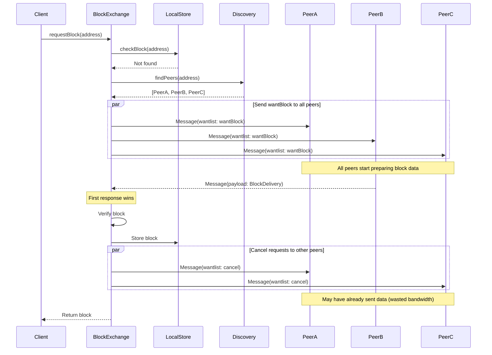
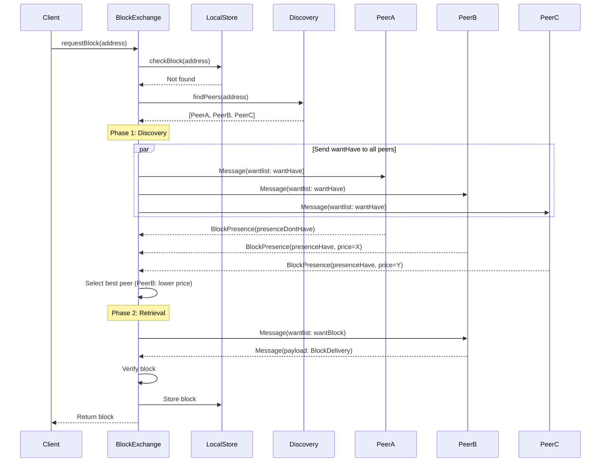
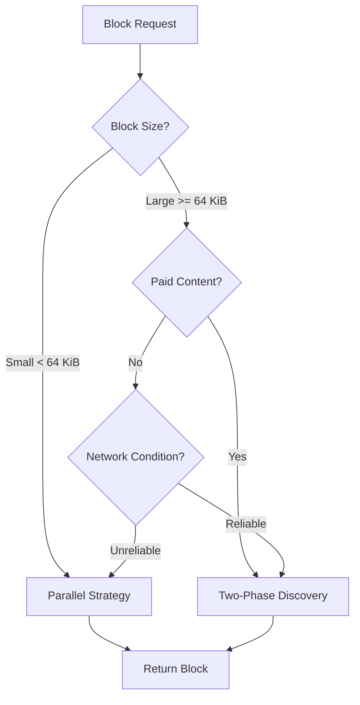
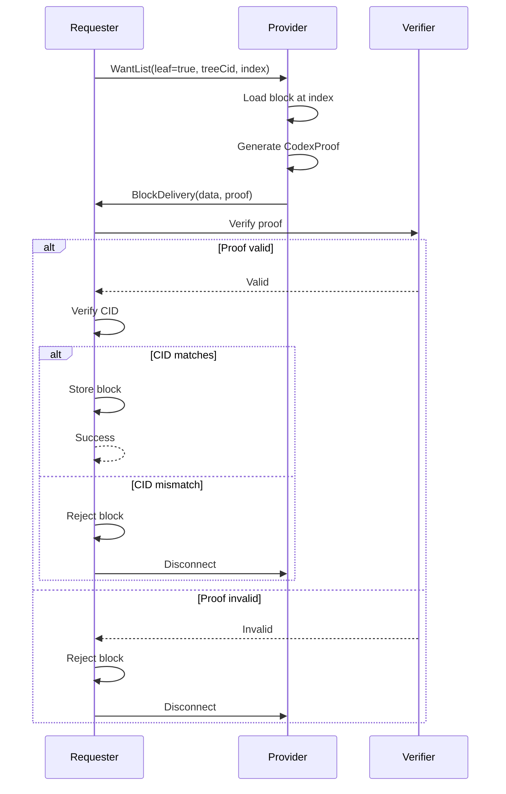
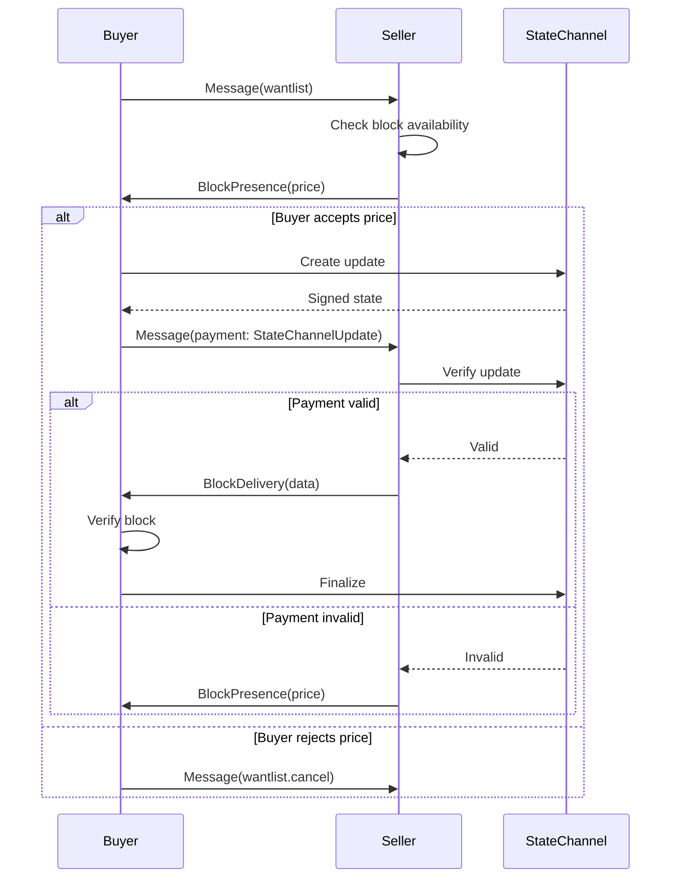
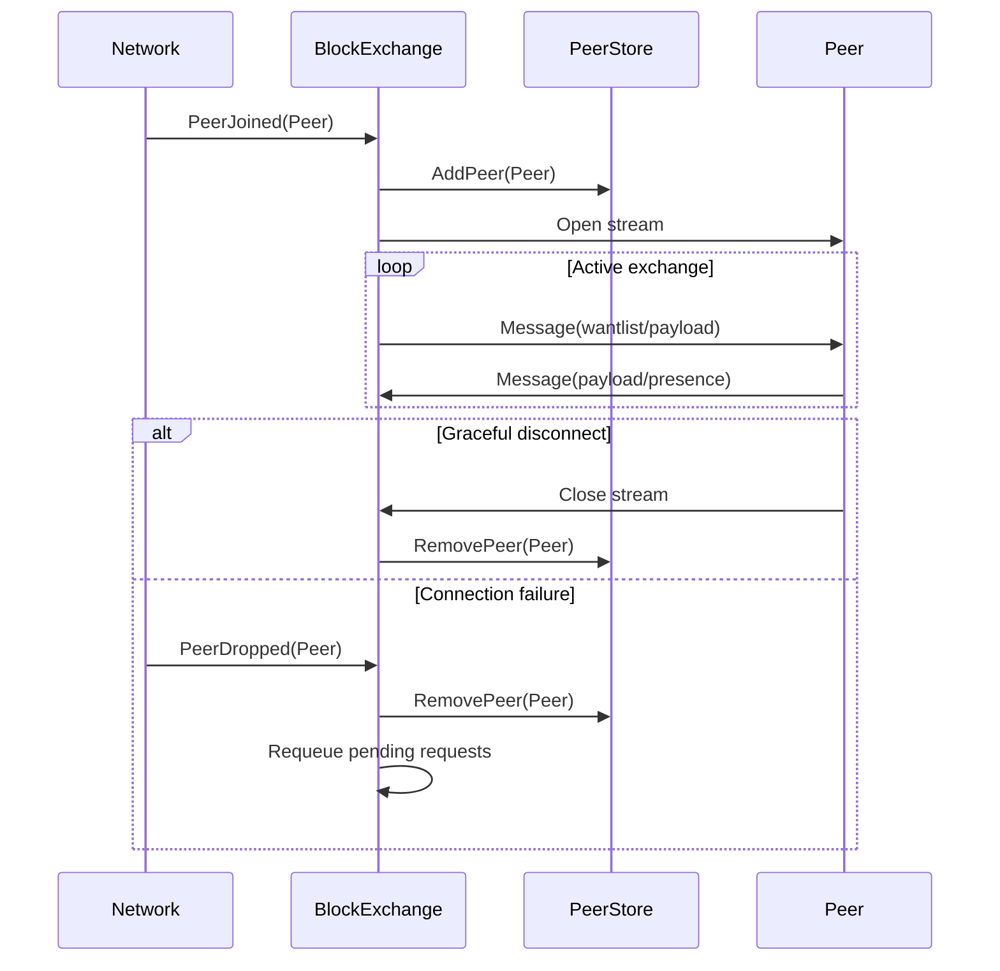

# CODEX-BLOCK-EXCHANGE

| Field | Value |
| --- | --- |
| Name | Codex Block Exchange Protocol |
| Status | raw |
| Category | Standards Track |
| Editor | Codex Team |
| Contributors | Filip Dimitrijevic <filip@status.im> |

## Specification Status

This specification contains a mix of:

- **Verified protocol elements**: Core message formats, protobuf structures, and addressing modes confirmed from implementation
- **Design specifications**: Payment flows, state machines, and negotiation strategies representing intended behavior
- **Recommended values**: Protocol limits and timeouts that serve as guidelines (actual implementations may vary)
- **Pending verification**: Some technical details (e.g., multicodec 0xCD02) require further validation

Sections marked with notes indicate areas where implementation details may differ from this specification.

## Abstract

The Block Exchange (BE) is a core Codex component responsible for
peer-to-peer content distribution across the network.
It manages the sending and receiving of data blocks between nodes,
enabling efficient data sharing and retrieval.
This specification defines both an internal service interface and a
network protocol for referring to and providing data blocks.
Blocks are uniquely identifiable by means of an address and represent
fixed-length chunks of arbitrary data.

## Semantics

The keywords "MUST", "MUST NOT", "REQUIRED", "SHALL", "SHALL NOT",
"SHOULD", "SHOULD NOT", "RECOMMENDED", "MAY", and "OPTIONAL" in this
document are to be interpreted as described in
[RFC 2119](https://www.ietf.org/rfc/rfc2119.txt).

### Definitions

| Term | Description |
|------|-------------|
| **Block** | Fixed-length chunk of arbitrary data, uniquely identifiable |
| **Standalone Block** | Self-contained block addressed by SHA256 hash (CID) |
| **Dataset Block** | Block in ordered set, addressed by dataset CID + index |
| **Block Address** | Unique identifier for standalone/dataset addressing |
| **WantList** | List of block requests sent by a peer |
| **Block Delivery** | Transmission of block data from one peer to another |
| **Block Presence** | Indicator of whether peer has requested block |
| **Merkle Proof** | Proof verifying dataset block position correctness |
| **CodexProof** | Codex-specific Merkle proof format verifying a block's position within a dataset tree |
| **Stream** | Bidirectional libp2p communication channel between two peers for exchanging messages |
| **Peer Context Store** | Internal data structure tracking active peer connections, their WantLists, and exchange state |
| **CID** | Content Identifier - hash-based identifier for content |
| **Multicodec** | Self-describing format identifier for data encoding |
| **Multihash** | Self-describing hash format |

## Motivation

The Block Exchange module serves as the fundamental layer for content
distribution in the Codex network.
It provides primitives for requesting and delivering blocks of data
between peers, supporting both standalone blocks and blocks that are
part of larger datasets.
The protocol is designed to work over libp2p streams and integrates
with Codex's discovery, storage, and payment systems.

When a peer wishes to obtain a block, it registers its unique address
with the Block Exchange, and the Block Exchange will then be in charge
of procuring it by finding a peer that has the block, if any, and then
downloading it.
The Block Exchange will also accept requests from peers which might
want blocks that the node has, and provide them.

**Discovery Separation:** Throughout this specification we assume that
if a peer wants a block, then the peer has the means to locate and
connect to peers which either: (1) have the block; or (2) are
reasonably expected to obtain the block in the future.
In practical implementations, the Block Exchange will typically require
the support of an underlying discovery service, e.g., the Codex DHT,
to look up such peers, but this is beyond the scope of this document.

The protocol supports two distinct block types to accommodate different
use cases: standalone blocks for independent data chunks and dataset
blocks for ordered collections of data that form larger structures.

## Block Format

The Block Exchange protocol supports two types of blocks:

### Standalone Blocks

Standalone blocks are self-contained pieces of data addressed by their
SHA256 content identifier (CID).
These blocks are independent and do not reference any larger structure.

**Properties:**

- Addressed by content hash (SHA256)
- Default size: 64 KiB
- Self-contained and independently verifiable

### Dataset Blocks

Dataset blocks are part of ordered sets and are addressed by a
`(datasetCID, index)` tuple.
The datasetCID refers to the Merkle tree root of the entire dataset,
and the index indicates the block's position within that dataset.

Formally, we can define a block as a tuple consisting of raw data and
its content identifier: `(data: seq[byte], cid: Cid)`, where standalone
blocks are addressed by `cid`, and dataset blocks can be addressed
either by `cid` or a `(datasetCID, index)` tuple.

**Properties:**

- Addressed by `(treeCID, index)` tuple
- Part of a Merkle tree structure
- Require Merkle proof for verification
- Must be uniformly sized within a dataset
- Final blocks MUST be zero-padded if incomplete

### Block Specifications

All blocks in the Codex Block Exchange protocol adhere to the
following specifications:

| Property | Value | Description |
|----------|-------|-------------|
| Default Block Size | 64 KiB | Standard size for data blocks |
| Maximum Block Size | 100 MiB | Upper limit for block data field |
| Multicodec | `codex-block` (0xCD02)* | Format identifier |
| Multihash | `sha2-256` (0x12) | Hash algorithm for addressing |
| Padding Requirement | Zero-padding | Incomplete final blocks padded |

**Note:** *The multicodec value 0xCD02 is not currently registered in the official [multiformats multicodec table](https://github.com/multiformats/multicodec/blob/master/table.csv). This may be a reserved/private code pending official registration.

### Protocol Limits

To ensure network stability and prevent resource exhaustion, implementations
SHOULD enforce reasonable limits. The following are **recommended values**
(actual implementation limits may vary):

| Limit | Recommended Value | Description |
|-------|-------------------|-------------|
| **Maximum Block Size** | 100 MiB | Maximum size of block data in BlockDelivery |
| **Maximum WantList Size** | 1000 entries | Maximum entries per WantList message |
| **Maximum Concurrent Requests** | 256 per peer | Maximum simultaneous block requests per peer |
| **Stream Timeout** | 60 seconds | Idle stream closure timeout |
| **Request Timeout** | 300 seconds | Maximum time to fulfill a block request |
| **Maximum Message Size** | 105 MiB | Maximum total message size (protobuf) |
| **Maximum Pending Bytes** | 10 GiB | Maximum pending data per peer connection |

**Note:** These values are **not verified from implementation** and serve as
reasonable guidelines. Actual implementations MAY use different limits based
on their resource constraints and deployment requirements.

**Enforcement:**

- Implementations MUST reject messages exceeding their configured size limits
- Implementations SHOULD track per-peer request counts
- Implementations SHOULD close streams exceeding configured timeout limits
- Implementations MAY implement stricter or more lenient limits based on local resources

## Service Interface

The Block Exchange module exposes two core primitives for
block management:

### `requestBlock`

```python
async def requestBlock(address: BlockAddress) -> Block
```

Registers a block address for retrieval and returns the block data
when available.
This function can be awaited by the caller until the block is retrieved
from the network or local storage.

**Parameters:**

- `address`: BlockAddress - The unique address identifying the block
  to retrieve

**Returns:**

- `Block` - The retrieved block data

### `cancelRequest`

```python
async def cancelRequest(address: BlockAddress) -> bool
```

Cancels a previously registered block request.

**Parameters:**

- `address`: BlockAddress - The address of the block request to cancel

**Returns:**

- `bool` - True if the cancellation was successful, False otherwise

## Dependencies

The Block Exchange module depends on and interacts with several other
Codex components:

| Component | Purpose |
|-----------|---------|
| **Discovery Module** | DHT-based peer discovery for locating nodes |
| **Local Store (Repo)** | Persistent block storage for local blocks |
| **Advertiser** | Announces block availability to the network |
| **Network Layer** | libp2p connections and stream management |

## Protocol Specification

### Protocol Identifier

The Block Exchange protocol uses the following libp2p protocol
identifier:

```text
/codex/blockexc/1.0.0
```

### Version Negotiation

The protocol version is negotiated through libp2p's multistream-select
protocol during connection establishment. The following describes standard
libp2p version negotiation behavior; actual Codex implementation details
may vary.

#### Protocol Versioning

**Version Format**: `/codex/blockexc/<major>.<minor>.<patch>`

- **Major version**: Incompatible protocol changes
- **Minor version**: Backward-compatible feature additions
- **Patch version**: Backward-compatible bug fixes

**Current Version**: `1.0.0`

#### Version Negotiation Process

```text
1. Initiator opens stream
2. Initiator proposes: "/codex/blockexc/1.0.0"
3. Responder checks supported versions
4. If supported:
     Responder accepts: "/codex/blockexc/1.0.0"
     → Connection established
5. If not supported:
     Responder rejects with: "na" (not available)
     → Try fallback version or close connection
```

#### Compatibility Rules

**Major Version Compatibility:**

- Major version `1.x.x` is incompatible with `2.x.x`
- Nodes MUST support only their major version
- Cross-major-version communication requires protocol upgrade

**Minor Version Compatibility:**

- Version `1.1.0` MUST be backward compatible with `1.0.0`
- Newer minors MAY include optional features
- Older nodes ignore unknown message fields (protobuf semantics)

**Patch Version Compatibility:**

- All patches within same minor version are fully compatible
- Patches fix bugs without changing protocol behavior

#### Multi-Version Support

Implementations MAY support multiple protocol versions simultaneously:

```text
Supported protocols (in preference order):
  1. /codex/blockexc/1.2.0  (preferred, latest features)
  2. /codex/blockexc/1.1.0  (fallback, stable)
  3. /codex/blockexc/1.0.0  (legacy support)
```

**Negotiation Strategy:**

1. Propose highest supported version first
2. If rejected, try next lower version
3. If all rejected, connection fails
4. Track peer's supported version for future connections

#### Feature Detection

For optional features within same major.minor version:

```text
Method 1: Message field presence
  - Send message with optional field
  - Peer ignores if not supported (protobuf default)

Method 2: Capability exchange (future extension)
  - Exchange capability bitmask in initial message
  - Enable features only if both peers support
```

#### Version Upgrade Path

**Backward Compatibility:**

- New versions MUST handle messages from older versions
- Unknown message fields silently ignored
- Unknown WantList flags ignored
- Unknown BlockPresence types treated as DontHave

**Forward Compatibility:**

- Older versions MAY ignore new message types
- Critical features require major version bump
- Optional features use minor version bump

### Connection Model

The protocol operates over libp2p streams.
When a node wants to communicate with a peer:

1. The initiating node dials the peer using the protocol identifier
2. A bidirectional stream is established
3. Both sides can send and receive messages on this stream
4. Messages are encoded using Protocol Buffers
5. The stream remains open for the duration of the exchange session
6. Peers track active connections in a peer context store

The protocol handles peer lifecycle events:

- **Peer Joined**: When a peer connects, it is added to the active
  peer set
- **Peer Departed**: When a peer disconnects gracefully, its context
  is cleaned up
- **Peer Dropped**: When a peer connection fails, it is removed from
  the active set

### Message Flow Examples

This section illustrates typical message exchange sequences for common
block exchange scenarios.

#### Example 1: Standalone Block Request

**Scenario**: Node A requests a standalone block from Node B

```text
Node A                                    Node B
  |                                         |
  |--- Message(wantlist) ------------------>|
  |    wantlist.entries[0]:                 |
  |      address.cid = QmABC123              |
  |      wantType = wantBlock               |
  |      priority = 0                       |
  |                                         |
  |<-- Message(blockPresences, payload) ----|
  |    blockPresences[0]:                   |
  |      address.cid = QmABC123              |
  |      type = presenceHave                |
  |    payload[0]:                          |
  |      cid = QmABC123                      |
  |      data = <64 KiB block data>         |
  |      address.cid = QmABC123              |
  |                                         |
```

**Steps:**

1. Node A sends WantList requesting block with `wantType = wantBlock`
2. Node B checks local storage, finds block
3. Node B responds with BlockPresence confirming availability
4. Node B includes BlockDelivery with actual block data
5. Node A verifies CID matches SHA256(data)
6. Node A stores block locally

#### Example 2: Dataset Block Request with Merkle Proof

**Scenario**: Node A requests a dataset block from Node B

```text
Node A                                    Node B
  |                                         |
  |--- Message(wantlist) ------------------>|
  |    wantlist.entries[0]:                 |
  |      address.leaf = true                |
  |      address.treeCid = QmTree456         |
  |      address.index = 42                 |
  |      wantType = wantBlock               |
  |                                         |
  |<-- Message(payload) ---------------------|
  |    payload[0]:                          |
  |      cid = QmBlock789                    |
  |      data = <64 KiB zero-padded data>   |
  |      address.leaf = true                |
  |      address.treeCid = QmTree456         |
  |      address.index = 42                 |
  |      proof = <CodexProof bytes>         |
  |                                         |
```

**Steps:**

1. Node A sends WantList for dataset block at specific index
2. Node B locates block in dataset
3. Node B generates CodexProof for block position in Merkle tree
4. Node B delivers block with proof
5. Node A verifies proof against treeCid
6. Node A verifies block data integrity
7. Node A stores block with dataset association

#### Example 3: Block Presence Check (wantHave)

**Scenario**: Node A checks if Node B has a block without requesting full data

```text
Node A                                    Node B
  |                                         |
  |--- Message(wantlist) ------------------>|
  |    wantlist.entries[0]:                 |
  |      address.cid = QmCheck999            |
  |      wantType = wantHave                |
  |      sendDontHave = true                |
  |                                         |
  |<-- Message(blockPresences) -------------|
  |    blockPresences[0]:                   |
  |      address.cid = QmCheck999            |
  |      type = presenceHave                |
  |      price = 0x00 (free)                |
  |                                         |
```

**Steps:**

1. Node A sends WantList with `wantType = wantHave`
2. Node B checks local storage without loading block data
3. Node B responds with BlockPresence only (no payload)
4. Node A updates peer availability map
5. If Node A decides to request, sends new WantList with `wantType = wantBlock`

#### Example 4: Block Not Available

**Scenario**: Node A requests block Node B doesn't have

```text
Node A                                    Node B
  |                                         |
  |--- Message(wantlist) ------------------>|
  |    wantlist.entries[0]:                 |
  |      address.cid = QmMissing111          |
  |      wantType = wantBlock               |
  |      sendDontHave = true                |
  |                                         |
  |<-- Message(blockPresences) -------------|
  |    blockPresences[0]:                   |
  |      address.cid = QmMissing111          |
  |      type = presenceDontHave            |
  |                                         |
```

**Steps:**

1. Node A requests block with `sendDontHave = true`
2. Node B checks storage, block not found
3. Node B sends BlockPresence with `presenceDontHave`
4. Node A removes Node B from candidates for this block
5. Node A queries discovery service for alternative peers

#### Example 5: WantList Cancellation

**Scenario**: Node A cancels a previous block request

```text
Node A                                    Node B
  |                                         |
  |--- Message(wantlist) ------------------>|
  |    wantlist.entries[0]:                 |
  |      address.cid = QmCancel222           |
  |      cancel = true                      |
  |                                         |
```

**Steps:**

1. Node A sends WantList entry with `cancel = true`
2. Node B removes block request from peer's want queue
3. Node B stops any pending block transfer for this address
4. No response message required for cancellation

#### Example 6: Delta WantList Update

**Scenario**: Node A adds requests to existing WantList

```text
Node A                                    Node B
  |                                         |
  |--- Message(wantlist) ------------------>|
  |    wantlist.full = false                |
  |    wantlist.entries[0]:                 |
  |      address.cid = QmNew1                |
  |      wantType = wantBlock               |
  |    wantlist.entries[1]:                 |
  |      address.cid = QmNew2                |
  |      wantType = wantBlock               |
  |                                         |
```

**Steps:**

1. Node A sends WantList with `full = false` (delta update)
2. Node B merges entries with existing WantList for Node A
3. Node B begins processing new requests
4. Previous WantList entries remain active

### Sequence Diagrams

These diagrams illustrate the complete flow of block exchange operations
including service interface, peer discovery, and network protocol interactions.

#### Complete Block Request Flow

The protocol supports two strategies for WantBlock requests,
each with different trade-offs.
Implementations may choose the strategy based on network conditions,
peer availability, and resource constraints.

##### Strategy 1: Parallel Request (Low Latency)

In this strategy, the requester sends `wantType = wantBlock` to all
discovered peers simultaneously.
This minimizes latency as the first peer to respond with the block
data wins, but it wastes bandwidth since multiple peers may send
the same block data.

**Trade-offs:**

- **Pro**: Lowest latency - block arrives as soon as any peer can deliver it
- **Pro**: More resilient to slow or unresponsive peers
- **Con**: Bandwidth-wasteful - multiple peers may send duplicate data
- **Con**: Higher network overhead for the requester
- **Best for**: Time-critical data retrieval, unreliable networks



##### Strategy 2: Two-Phase Discovery (Bandwidth Efficient)

In this strategy, the requester first sends `wantType = wantHave` to
discover which peers have the block, then sends `wantType = wantBlock`
only to a single selected peer.
This conserves bandwidth but adds an extra round-trip of latency.

**Trade-offs:**

- **Pro**: Bandwidth-efficient - only one peer sends block data
- **Pro**: Enables price comparison before committing to a peer
- **Pro**: Allows selection based on peer reputation or proximity
- **Con**: Higher latency due to extra round-trip for presence check
- **Con**: Selected peer may become unavailable between phases
- **Best for**: Large blocks, paid content, bandwidth-constrained networks



##### Hybrid Approach

Implementations MAY combine both strategies:

1. Use two-phase discovery for large blocks or paid content
2. Use parallel requests for small blocks or time-critical data
3. Adaptively switch strategies based on network conditions



#### Dataset Block Verification Flow



#### Payment Flow with State Channels



#### Peer Lifecycle Management



### Message Format

All messages use Protocol Buffers encoding for serialization.
The main message structure supports multiple operation types in a
single message.

#### Main Message Structure

```protobuf
message Message {
  Wantlist wantlist = 1;
  // Field 2 reserved for future use
  repeated BlockDelivery payload = 3;
  repeated BlockPresence blockPresences = 4;
  int32 pendingBytes = 5;
  AccountMessage account = 6;
  StateChannelUpdate payment = 7;
}
```

**Fields:**

- `wantlist`: Block requests from the sender
- Field 2: Reserved (unused, see note below)
- `payload`: Block deliveries (actual block data)
- `blockPresences`: Availability indicators for requested blocks
- `pendingBytes`: Number of bytes pending delivery
- `account`: Account information for micropayments
- `payment`: State channel update for payment processing

**Note on Missing Field 2:**

Field number 2 is intentionally skipped in the Message protobuf definition.
This is a common protobuf practice for several reasons:

- **Protocol Evolution**: Field 2 may have been used in earlier versions and
  removed, with the field number reserved to prevent reuse
- **Forward Compatibility**: Reserving field numbers ensures old clients can
  safely ignore new fields
- **Implementation History**: May have been used during development and removed
  before final release

The gap does not affect protocol operation. Protobuf field numbers need not be
sequential, and skipping numbers is standard practice for protocol evolution.

#### Block Address

The BlockAddress structure supports both standalone and dataset
block addressing:

```protobuf
message BlockAddress {
  bool leaf = 1;
  bytes treeCid = 2;    // Present when leaf = true
  uint64 index = 3;     // Present when leaf = true
  bytes cid = 4;        // Present when leaf = false
}
```

**Fields:**

- `leaf`: Indicates if this is dataset block (true) or standalone
  (false)
- `treeCid`: Merkle tree root CID (present when `leaf = true`)
- `index`: Position of block within dataset (present when `leaf = true`)
- `cid`: Content identifier of the block (present when `leaf = false`)

**Addressing Modes:**

- **Standalone Block** (`leaf = false`): Direct CID reference to a
  standalone content block
- **Dataset Block** (`leaf = true`): Reference to a block within an
  ordered set, identified by a Merkle tree root and an index.
  The Merkle root may refer to either a regular dataset, or a dataset
  that has undergone erasure-coding

#### WantList

The WantList communicates which blocks a peer desires to receive:

```protobuf
message Wantlist {
  enum WantType {
    wantBlock = 0;
    wantHave = 1;
  }

  message Entry {
    BlockAddress address = 1;
    int32 priority = 2;
    bool cancel = 3;
    WantType wantType = 4;
    bool sendDontHave = 5;
  }

  repeated Entry entries = 1;
  bool full = 2;
}
```

**WantType Values:**

- `wantBlock (0)`: Request full block delivery
- `wantHave (1)`: Request availability information only (presence check)

**Entry Fields:**

- `address`: The block being requested
- `priority`: Request priority (currently always 0, reserved for future use)
- `cancel`: If true, cancels a previous want for this block
- `wantType`: Specifies whether full block or presence is desired
  - `wantHave (1)`: Only check if peer has the block
  - `wantBlock (0)`: Request full block data
- `sendDontHave`: If true, peer should respond even if it doesn't have
  the block

**Priority Field Clarification:**

The `priority` field is currently fixed at `0` in all implementations and is
reserved for future protocol extensions. Originally intended for request
prioritization, this feature is not yet implemented.

**Current Behavior:**

- All WantList entries use `priority = 0`
- Implementations MUST accept priority values but MAY ignore them
- Blocks are processed in order received, not by priority

**Future Extensions:**

The priority field is reserved for:

- **Bandwidth Management**: Higher priority blocks served first during congestion
- **Time-Critical Data**: Urgent blocks (e.g., recent dataset indices) prioritized
- **Fair Queueing**: Priority-based scheduling across multiple peers
- **QoS Tiers**: Different service levels based on payment/reputation

**Implementation Notes:**

- Senders SHOULD set `priority = 0` for compatibility
- Receivers MUST NOT reject messages with non-zero priority
- Future protocol versions may activate priority-based scheduling
- When activated, higher priority values = higher priority (0 = lowest)

**WantList Fields:**

- `entries`: List of block requests
- `full`: If true, replaces all previous entries; if false, delta update

**Delta Updates:**

WantLists support delta updates for efficiency.
When `full = false`, entries represent additions or modifications to
the existing WantList rather than a complete replacement.

#### Block Delivery

Block deliveries contain the actual block data along with verification
information:

```protobuf
message BlockDelivery {
  bytes cid = 1;
  bytes data = 2;
  BlockAddress address = 3;
  bytes proof = 4;
}
```

**Fields:**

- `cid`: Content identifier of the block
- `data`: Raw block data (up to 100 MiB)
- `address`: The BlockAddress identifying this block
- `proof`: Merkle proof (CodexProof) verifying block correctness
  (required for dataset blocks)

**Merkle Proof Verification:**

When delivering dataset blocks (`address.leaf = true`):

- The delivery MUST include a Merkle proof (CodexProof)
- The proof verifies that the block at the given index is correctly
  part of the Merkle tree identified by the tree CID
- This applies to all datasets, irrespective of whether they have been
  erasure-coded or not
- Recipients MUST verify the proof before accepting the block
- Invalid proofs result in block rejection

#### Block Presence

Block presence messages indicate whether a peer has or does not have a
requested block:

```protobuf
enum BlockPresenceType {
  presenceHave = 0;
  presenceDontHave = 1;
}

message BlockPresence {
  BlockAddress address = 1;
  BlockPresenceType type = 2;
  bytes price = 3;
}
```

**Fields:**

- `address`: The block address being referenced
- `type`: Whether the peer has the block or not
- `price`: Price in wei (UInt256 format, see below)

**UInt256 Price Format:**

The `price` field encodes a 256-bit unsigned integer representing the cost in
wei (the smallest Ethereum denomination, where 1 ETH = 10^18 wei).

**Encoding Specification:**

- **Format**: 32 bytes, big-endian byte order
- **Type**: Unsigned 256-bit integer
- **Range**: 0 to 2^256 - 1
- **Zero Price**: `0x0000000000000000000000000000000000000000000000000000000000000000`
  (block is free)

**Examples:**

```text
Free (0 wei):
  0x0000000000000000000000000000000000000000000000000000000000000000

1 wei:
  0x0000000000000000000000000000000000000000000000000000000000000001

1 gwei (10^9 wei):
  0x000000000000000000000000000000000000000000000000000000003b9aca00

0.001 ETH (10^15 wei):
  0x00000000000000000000000000000000000000000000000000038d7ea4c68000

1 ETH (10^18 wei):
  0x0000000000000000000000000000000000000000000000000de0b6b3a7640000

Maximum (2^256 - 1):
  0xffffffffffffffffffffffffffffffffffffffffffffffffffffffffffffffff
```

**Conversion Logic:**

```python
# Wei to bytes (big-endian)
def wei_to_bytes(amount_wei: int) -> bytes:
    return amount_wei.to_bytes(32, byteorder='big')

# Bytes to wei
def bytes_to_wei(price_bytes: bytes) -> int:
    return int.from_bytes(price_bytes, byteorder='big')

# ETH to wei to bytes
def eth_to_price_bytes(amount_eth: float) -> bytes:
    amount_wei = int(amount_eth * 10**18)
    return wei_to_bytes(amount_wei)
```

#### Payment Messages

Payment-related messages for micropayments using Nitro state channels.

**Account Message:**

```protobuf
message AccountMessage {
  bytes address = 1;  // Ethereum address to which payments should be made
}
```

**Fields:**

- `address`: Ethereum address for receiving payments

### Concrete Message Examples

This section provides real-world examples of protobuf messages for different
block exchange scenarios.

#### Example 1: Simple Standalone Block Request

**Scenario**: Request a single standalone block

**Protobuf (wire format representation):**

```protobuf
Message {
  wantlist: Wantlist {
    entries: [
      Entry {
        address: BlockAddress {
          leaf: false
          cid: 0x0155a0e40220b94d27b9934d3e08a52e52d7da7dabfac484efe37a5380ee9088f7ace2efcde9  // CID bytes
        }
        priority: 0
        cancel: false
        wantType: wantBlock  // 0
        sendDontHave: true
      }
    ]
    full: true
  }
}
```

**Hex representation (sample):**

```text
0a2e 0a2c 0a24 0001 5512 2012 20b9 4d27
b993 4d3e 08a5 2e52 d7da 7dab fac4 84ef
e37a 5380 ee90 88f7 ace2 efcd e910 0018
0020 0028 011201 01
```

#### Example 2: Dataset Block Request

**Scenario**: Request block at index 100 from dataset

**Protobuf:**

```protobuf
Message {
  wantlist: Wantlist {
    entries: [
      Entry {
        address: BlockAddress {
          leaf: true
          treeCid: 0x0155a0e40220c5d2460186f7233c927e7db2dcc703c0e500b653ca82273b7bfad8045d85a470  // Tree CID
          index: 100
        }
        priority: 0
        cancel: false
        wantType: wantBlock
        sendDontHave: true
      }
    ]
    full: false  // Delta update
  }
}
```

#### Example 3: Block Delivery with Proof

**Scenario**: Provider sends dataset block with Merkle proof

**Protobuf:**

```protobuf
Message {
  payload: [
    BlockDelivery {
      cid: 0x0155a0e40220a1b2c3d4e5f6071829...  // Block CID
      data: <65536 bytes of block data>  // 64 KiB
      address: BlockAddress {
        leaf: true
        treeCid: 0x0155a0e40220c5d2460186f7233c927e7db2dcc703c0e500b653ca82273b7bfad8045d85a470
        index: 100
      }
      proof: <CodexProof bytes>  // Merkle proof data
        // Contains: path indices, sibling hashes, tree height
        // Format: Implementation-specific (e.g., [height][index][hash1][hash2]...[hashN])
        // Size varies by tree depth (illustrative: ~1KB for depth-10 tree)
    }
  ]
}
```

#### Example 4: Block Presence Response

**Scenario**: Provider indicates block availability with price

**Protobuf:**

```protobuf
Message {
  blockPresences: [
    BlockPresence {
      address: BlockAddress {
        leaf: false
        cid: 0x0155a0e40220b94d27b9934d3e08a52e52d7da7dabfac484efe37a5380ee9088f7ace2efcde9
      }
      type: presenceHave  // 0
      price: 0x00000000000000000000000000000000000000000000000000038d7ea4c68000  // 0.001 ETH in wei
    }
  ]
}
```

#### Example 5: Payment Message

**Scenario**: Send payment via state channel update

**Protobuf:**

```protobuf
Message {
  account: AccountMessage {
    address: 0x742d35Cc6634C0532925a3b844200a717C48D6d9  // 20 bytes Ethereum address
  }
  payment: StateChannelUpdate {
    update: <JSON bytes>
      // Contains signed Nitro state as UTF-8 JSON string
      // Example: {"channelId":"0x1234...","nonce":42,...}
  }
}
```

#### Example 6: Multiple Operations in One Message

**Scenario**: Combined WantList, BlockPresence, and Delivery

**Protobuf:**

```protobuf
Message {
  wantlist: Wantlist {
    entries: [
      Entry {
        address: BlockAddress {
          leaf: false
          cid: 0x0155a0e40220...  // Requesting new block
        }
        wantType: wantBlock
        priority: 0
        cancel: false
        sendDontHave: true
      }
    ]
    full: false
  }
  blockPresences: [
    BlockPresence {
      address: BlockAddress {
        leaf: false
        cid: 0x0155a0e40220...  // Response to previous request
      }
      type: presenceHave
      price: 0x00  // Free
    }
  ]
  payload: [
    BlockDelivery {
      cid: 0x0155a0e40220...  // Delivering another block
      data: <65536 bytes>
      address: BlockAddress {
        leaf: false
        cid: 0x0155a0e40220...
      }
    }
  ]
  pendingBytes: 131072  // 128 KiB more data pending
}
```

#### Example 7: WantList Cancellation

**Scenario**: Cancel multiple pending requests

**Protobuf:**

```protobuf
Message {
  wantlist: Wantlist {
    entries: [
      Entry {
        address: BlockAddress {
          leaf: false
          cid: 0x0155a0e40220abc123...
        }
        cancel: true  // Cancellation flag
      },
      Entry {
        address: BlockAddress {
          leaf: true
          treeCid: 0x0155a0e40220def456...
          index: 50
        }
        cancel: true
      }
    ]
    full: false
  }
}
```

#### CID Format Details

**CID Structure:**

```text
CID v1 format (multibase + multicodec + multihash):
[0x01] [0x55] [0xa0] [0xe4] [0x02] [0x20] [<32 bytes SHA256 hash>]
  │      │      │      │      │      │       │
  │      │      │      │      │      │       └─ Hash digest
  │      │      │      │      │      └───────── Hash length (32)
  │      │      │      │      └──────────────── Hash algorithm (SHA2-256)
  │      │      │      └─────────────────────── Codec size
  │      │      └────────────────────────────── Codec (raw = 0x55)
  │      └───────────────────────────────────── Multicodec prefix
  └──────────────────────────────────────────── CID version (1)

Actual: 0x01 55 a0 e4 02 20 <hash bytes>
```

**Example Block CID Breakdown:**

```text
Full CID: 0x0155a0e40220b94d27b9934d3e08a52e52d7da7dabfac484efe37a5380ee9088f7ace2efcde9

Parts:
  Version:   0x01           (CID v1)
  Multicodec: 0x55          (raw)
  Codec Size: 0xa0e402      (codex-block = 0xCD02, varint encoded)*
  Hash Type:  0x20          (SHA2-256)
  Hash Len:   0x12 (20)     (32 bytes)
  Hash:       b94d27b993... (32 bytes SHA256)
```

**State Channel Update:**

```protobuf
message StateChannelUpdate {
  bytes update = 1;   // Signed Nitro state, serialized as JSON
}
```

**Fields:**

- `update`: Nitro state channel update containing payment information

### Payment Flow and Price Negotiation

The Block Exchange protocol integrates with Nitro state channels to enable
micropayments for block delivery.

#### Payment Requirements

**When Payment is Required:**

- Blocks marked as paid content by the provider
- Provider's local policy requires payment for specific blocks
- Block size exceeds free tier threshold (implementation-defined)
- Requester has insufficient credit with provider

**Free Blocks:**

- Blocks explicitly marked as free (`price = 0x00`)
- Blocks exchanged between trusted peers
- Small metadata blocks (implementation-defined)

#### Price Discovery

**Initial Price Advertisement:**

1. Requester sends WantList with `wantType = wantHave`
2. Provider responds with BlockPresence including `price` field
3. Price encoded as UInt256 in wei (smallest Ethereum unit)
4. Requester evaluates price against local policy

**Price Format:**

```text
price: bytes (32 bytes, big-endian UInt256)
Example: 0x0000000000000000000000000000000000000000000000000de0b6b3a7640000
         represents 1 ETH = 10^18 wei
```

#### Payment Negotiation Process

##### Step 1: Price Quote

```text
Requester → Provider: Message(wantlist: wantHave)
Provider → Requester: BlockPresence(type=presenceHave, price=<amount>)
```

##### Step 2: Payment Decision

Requester evaluates price:

- **Accept**: Proceed to payment
- **Reject**: Send cancellation
- **Counter**: Not supported in current protocol (future extension)

##### Step 3: State Channel Update

If accepted:

```text
Requester:
  1. Load existing state channel with Provider
  2. Create new state with updated balance
  3. Sign state update
  4. Encode as JSON

Requester → Provider: Message(payment: StateChannelUpdate(update=<signed JSON>))
```

##### Step 4: Payment Verification

```text
Provider:
  1. Decode state channel update
  2. Verify signatures
  3. Check balance increase matches price
  4. Verify state channel validity
  5. Check nonce/sequence number

If valid:
  Provider → Requester: BlockDelivery(data, proof)
Else:
  Provider → Requester: BlockPresence(price) // Retry with correct payment
```

##### Step 5: Delivery and Finalization

```text
Requester:
  1. Receive and verify block
  2. Store block locally
  3. Finalize state channel update
  4. Update peer credit balance
```

#### Payment State Machine

**Note:** The following state machine represents a **design specification** for
payment flow logic. Actual implementation may differ.

```text
State: INIT
  → Send wantHave
  → Transition to PRICE_DISCOVERY

State: PRICE_DISCOVERY
  ← Receive BlockPresence(price)
  → If price acceptable: Transition to PAYMENT_CREATION
  → If price rejected: Transition to CANCELLED

State: PAYMENT_CREATION
  → Create state channel update
  → Send payment message
  → Transition to PAYMENT_PENDING

State: PAYMENT_PENDING
  ← Receive BlockDelivery: Transition to DELIVERY_VERIFICATION
  ← Receive BlockPresence(price): Transition to PAYMENT_FAILED

State: PAYMENT_FAILED
  → Retry with corrected payment: Transition to PAYMENT_CREATION
  → Abort: Transition to CANCELLED

State: DELIVERY_VERIFICATION
  → Verify block
  → If valid: Transition to COMPLETED
  → If invalid: Transition to DISPUTE

State: COMPLETED
  → Finalize state channel
  → End

State: CANCELLED
  → Send cancellation
  → End

State: DISPUTE
  → Reject block
  → Dispute state channel update
  → End
```

#### State Channel Integration

**Account Message Usage:**

Sent early in connection to establish payment address:

```protobuf
Message {
  account: AccountMessage {
    address: 0x742d35Cc6634C0532925a3b8...  // Ethereum address
  }
}
```

**State Channel Update Format:**

```json
{
  "channelId": "0x1234...",
  "nonce": 42,
  "balances": {
    "0x742d35Cc...": "1000000000000000000",  // Seller balance
    "0x8ab5d2F3...": "500000000000000000"    // Buyer balance
  },
  "signatures": [
    "0x789abc...",  // Buyer signature
    "0x456def..."   // Seller signature
  ]
}
```

#### Error Scenarios

**Insufficient Funds:**

- State channel balance < block price
- Response: BlockPresence with price (retry after funding)

**Invalid Signature:**

- State update signature verification fails
- Response: Reject payment, close stream if repeated

**Nonce Mismatch:**

- State update nonce doesn't match expected sequence
- Response: Request state sync, retry with correct nonce

**Channel Expired:**

- State channel past expiration time
- Response: Refuse payment, request new channel creation

## Error Handling

The Block Exchange protocol defines error handling for common failure scenarios:

### Verification Failures

**Merkle Proof Verification Failure:**

- **Condition**: CodexProof validation fails for dataset block
- **Action**: Reject block delivery, do NOT store block
- **Response**: Send BlockPresence with `presenceDontHave` for the address
- **Logging**: Log verification failure with peer ID and block address
- **Peer Management**: Track repeated failures; disconnect after threshold

**CID Mismatch:**

- **Condition**: SHA256 hash of block data doesn't match provided CID
- **Action**: Reject block delivery immediately
- **Response**: Close stream and mark peer as potentially malicious
- **Logging**: Log CID mismatch with peer ID and expected/actual CIDs

### Network Failures

**Stream Disconnection:**

- **Condition**: libp2p stream closes unexpectedly during transfer
- **Action**: Cancel pending block requests for that peer
- **Recovery**: Attempt to request blocks from alternative peers
- **Timeout**: Wait for stream timeout (60s) before peer cleanup

**Missing Blocks:**

- **Condition**: Peer responds with `presenceDontHave` for requested block
- **Action**: Remove peer from candidates for this block
- **Recovery**: Query discovery service for alternative peers
- **Fallback**: If no peers have block, return error to `requestBlock` caller

**Request Timeout:**

- **Condition**: Block not received within request timeout (300s)
- **Action**: Cancel request with that peer
- **Recovery**: Retry with different peer if available
- **User Notification**: If all retry attempts exhausted, `requestBlock` returns timeout error

### Protocol Violations

**Oversized Messages:**

- **Condition**: Message exceeds maximum size limits
- **Action**: Close stream immediately
- **Peer Management**: Mark peer as non-compliant
- **No Response**: Do not send error message (message may be malicious)

**Invalid WantList:**

- **Condition**: WantList exceeds entry limit or contains malformed addresses
- **Action**: Ignore malformed entries, process valid ones
- **Response**: Continue processing stream
- **Logging**: Log validation errors for debugging

**Payment Failures:**

- **Condition**: State channel update invalid or payment insufficient
- **Action**: Do not deliver blocks requiring payment
- **Response**: Send BlockPresence with price indicating payment needed
- **Stream**: Keep stream open for payment retry

### Recovery Strategies

#### Retry Responsibility Model

The protocol defines a clear separation between system-level and caller-level
retry responsibilities:

**System-Level Retry (Automatic):**

The Block Exchange module automatically retries in these scenarios:

- **Peer failure**: If a peer disconnects or times out, the system
  transparently tries alternative peers from the discovery set
- **Transient errors**: Network glitches, temporary unavailability
- **Peer rotation**: Automatic failover to next available peer

The caller's `requestBlock` call remains pending during system-level retries.
This is transparent to the caller.

**Caller-Level Retry (Manual):**

The caller is responsible for retry decisions when:

- **All peers exhausted**: No more peers available from discovery
- **Permanent failures**: Block doesn't exist in the network
- **Timeout exceeded**: Request timeout (300s) expired
- **Verification failures**: All peers provided invalid data

In these cases, `requestBlock` returns an error and the caller decides
whether to retry, perhaps after waiting or refreshing the peer list
via discovery.

**Retry Flow:**

```text
requestBlock(address)
    │
    ├─► System tries Peer A ──► Fails
    │       │
    │       └─► System tries Peer B ──► Fails (automatic, transparent)
    │               │
    │               └─► System tries Peer C ──► Success ──► Return block
    │
    └─► All peers failed ──► Return error to caller
                                    │
                                    └─► Caller decides: retry? wait? abort?
```

**Peer Rotation:**

When a peer fails to deliver blocks:

1. Mark peer as temporarily unavailable for this block
2. Query discovery service for alternative peers
3. Send WantList to new peers
4. Implement exponential backoff before retrying failed peer

**Graceful Degradation:**

- If verification fails, request block from alternative peer
- If all peers fail, propagate error to caller
- Clean up resources (memory, pending requests) on unrecoverable failures

**Error Propagation:**

- Service interface functions (`requestBlock`, `cancelRequest`) return errors
  to callers only after system-level retries are exhausted
- Internal errors logged for debugging
- Network errors trigger automatic peer rotation before surfacing to caller
- Verification errors result in block rejection and peer reputation impact

## Security Considerations

### Block Verification

- All dataset blocks MUST include and verify Merkle proofs before acceptance
- Standalone blocks MUST verify CID matches the SHA256 hash of the data
- Peers SHOULD reject blocks that fail verification immediately

### DoS Protection

- Implementations SHOULD limit the number of concurrent block requests per peer
- Implementations SHOULD implement rate limiting for WantList updates
- Large WantLists MAY be rejected to prevent resource exhaustion

### Data Integrity

- All blocks MUST be validated before being stored or forwarded
- Zero-padding in dataset blocks MUST be verified to prevent data corruption
- Block sizes MUST be validated against protocol limits

### Privacy Considerations

- Block requests reveal information about what data a peer is seeking
- Implementations MAY implement request obfuscation strategies
- Presence information can leak storage capacity details

## Rationale

### Design Decisions

**Two-Tier Block Addressing:**
The protocol supports both standalone and dataset blocks to accommodate
different use cases.
Standalone blocks are simpler and don't require Merkle proofs, while
dataset blocks enable efficient verification of large datasets without
requiring the entire dataset.

**WantList Delta Updates:**
Supporting delta updates reduces bandwidth consumption when peers only
need to modify a small portion of their wants, which is common in
long-lived connections.

**Separate Presence Messages:**
Decoupling presence information from block delivery allows peers to
quickly assess availability without waiting for full block transfers.

**Fixed Block Size:**
The 64 KiB default block size balances efficient network transmission
with manageable memory overhead.

**Zero-Padding Requirement:**
Requiring zero-padding for incomplete dataset blocks ensures uniform
block sizes within datasets, simplifying Merkle tree construction and
verification.

**Protocol Buffers:**
Using Protocol Buffers provides efficient serialization, forward
compatibility, and wide language support.

## Copyright

Copyright and related rights waived via
[CC0](https://creativecommons.org/publicdomain/zero/1.0/).

## References

### Normative

- [RFC 2119](https://www.ietf.org/rfc/rfc2119.txt) - Key words for use
  in LIPs to Indicate Requirement Levels
- **libp2p**: <https://libp2p.io>
- **Protocol Buffers**: <https://protobuf.dev>
- **Multihash**: <https://multiformats.io/multihash/>
- **Multicodec**: <https://github.com/multiformats/multicodec>

### Informative

- **Codex Documentation**: <https://docs.codex.storage>
- **Codex Block Exchange Module Spec**:
  <https://github.com/codex-storage/codex-docs-obsidian/blob/main/10%20Notes/Specs/Block%20Exchange%20Module%20Spec.md>
- **Merkle Trees**: <https://en.wikipedia.org/wiki/Merkle_tree>
- **Content Addressing**:
  <https://en.wikipedia.org/wiki/Content-addressable_storage>
