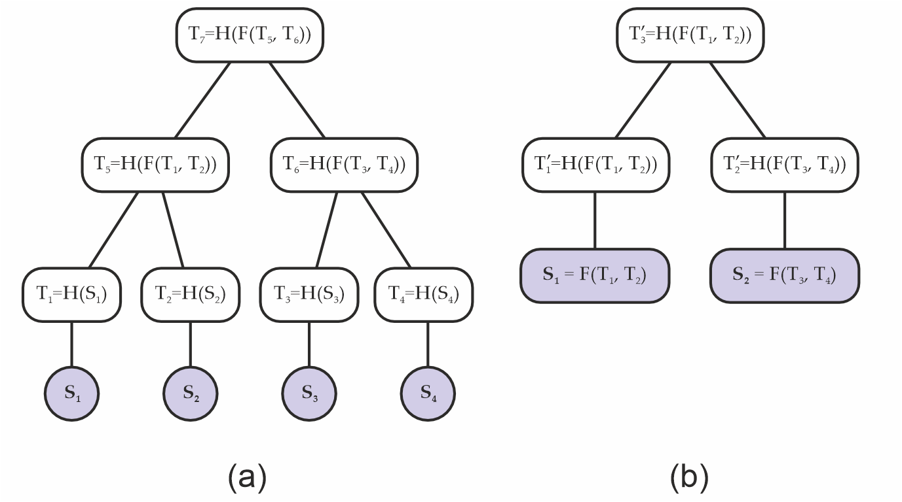
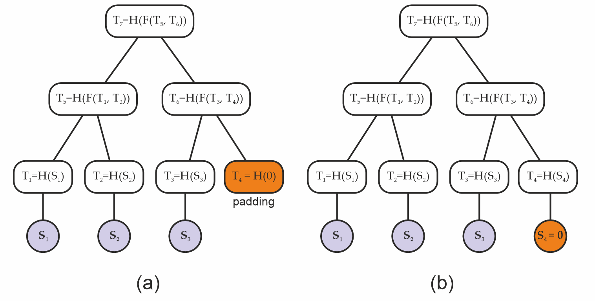
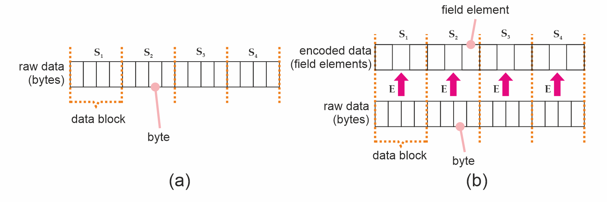

# MERKLE-TREE

| Field        | Value                                     |
| ------------ | ----------------------------------------- |
| Name         | Merkle Tree                               |
| Slug         | 153                                       |
| Status       | draft                                     |
| Category     | Standards Track                           |
| Editor       | Balázs Kőműves <balazs@status.im>         |
| Contributors | Giuliano Mega <giuliano@status.im>, Mohammed Alghazwi <mohalghazwi@status.im> |

## Abstract

This specification describes the Merkle tree construction adopted in Logos Storage. The principal consideration driving the design described below is to avoid security issues resulting from _API abuse_. Incorrectly using both low- and high-level cryptography APIs is a known source of never-ending security vulnerabilities (see eg. [arXiv:2306.08869](https://arxiv.org/abs/2306.08869v2)).

This construction relies on keyed compression, domain separation, injective encodings, and standard padding conventions to prevent a variety of possible collision attacks; and is designed to operate with a wide variety of hash functons, including both conventional ones like SHA-2, and arithmetic (ZK-friendly) hashes like the Poseidon family. In the Appendix, we specify some concrete hash function instances covering our use cases.

So while this construction may seem unnecessarily convoluted at first, it exists to avoid possibilities for one to shoot themselves in the foot.

## Merkle tree specification

A [Merkle tree](https://en.wikipedia.org/wiki/Merkle_tree) is a tree data structure (most often a binary tree), where nodes store the hash of their children. When working as intended, the root node behaves like a normal collision-resistant hash; in particular, the root is a _commitment_ for the sequence of the leaves. 

The primary advantage of Merkle trees is that there are short cryptographic proofs (called "Merkle inclusion proofs" or "Merkle paths") for a given leaf being present in the tree; and similarly, one can also update a leaf. These operations have `O(log(N))` cost.

Merkle trees are usually fixed depth (each leaf is at the same level). In the simplest possible version they are also complete binary trees (`2^n` leaves). In such a situation, where everything is fixed in advance, one can get away with much simpler constructions than the below one. However, unseen future changes in an application could then easily break any guarantees.

The cryptographic guarantees we expect from the Merkle root are the same as for normal hash functions:

- collision resistance
- preimage resistance
- second preimage resistance

In our setting, allowing arithmetic (finite field based) hash functions allow for further extra complications (eg. domain confusion, and padding problems).

### Overview

Merkle trees can be implemented in a variety of ways, and if done naively, can be also attacked in a variety of ways (e.g [BitCoinOps25](#references)). For this reason, this document focuses a _concrete implementation_ of a family of Merkle trees which helps avoiding common pitfalls.

We start by laying out some basic definitions in the [Definitions](#definitions) section, followed by our [keyed hash construction](#keyed-hash-construction), which guards the Merkle against certain padding and layer abuse attacks. We then discuss injective encodings and their role in the construction of secure Merkle trees that deal with finite field elements in the [Encoding](#encoding) section. Next, we provide some brief guidance on serialization in the [Serialization/Deserialization](#serializing--deserializing) section. Finally, we present an abstract interface for a Merkle tree module in the [Interfaces](#interfaces) section.

### Definitions

A Merkle tree, built on a hash function `H : S -> T`, produces a Merkle root; this root has essentially always the same type `T` (for "Target type") as the output of the hash function `H` (we will assume this from now on). 

Some examples of hash functions used in the wild are:

- SHA1: `T` is 160 bits
- SHA256: `T` is 256 bits
- Keccak / SHA3: `T` can be one of 224, 256, 384 or 512 bits
- the Poseidon(2) family: `T` is one or more finite field element(s), depending on the field size
- Monolith-64: `T` is a 4-tuple of Goldilocks field elements
- Monolith-31: `T` is an 8-tuple of Mersenne-31 field elements

The hash function `H : S -> T` can also have different types `S` ("Source type") of inputs. For example:

- SHA1 / SHA2 / SHA3: `S` is an arbitrary sequence of bits[^1]
- binary compression function: `S = T x T` is a pair of `T`-s
- Poseidon2 sponge: `S` is a sequence of finite field elements
- Poseidon2 compression function: `S` is at most `t-k` field elements, where `t>1` is the state size, and `k` field elements (the "capacity") should be approximately 256 bits (in our case `t=3`, `k=1` for BN254 field; or `t=12`, `k=4` for the Goldilocks field; or `t=24`, `k=8` for a ~32 bit field)
- as an alternative, the "Jive strategy" for binary compression (see [[Bouvier22](#references)]) can eliminate the "minus `k`" requirement (you can compress `t` into `t/2`)
- A naive Merkle tree implementation could for example accept only a power-of-two sized sequence of `T`-s

As an interesting example from the wild, the ZK proof library [Plonky3](https://github.com/Plonky3/Plonky3) (because of performance considerations) uses a binary compression function `T x T -> T` which is _neither collision nor preimage resistant_ (!), to a construct a Merkle tree, which at the end of the day is [still safe to use](https://eprint.iacr.org/2026/089) _in the particular situation they use it_. However, such constructions can be pretty fragile (it would be safer to use the Jive strategy mentioned above, with negligible extra cost).

Notation: Let's denote the type of a sequence of `T`-s by `[T]`.

A Merkle tree is built on an ordered sequence of leaves. The leaves contain some kind data, whose type we will denote by `D` (for data). In classical implementations, `D` is just a bytestring (a finite sequence of bytes); however, in the ZK setting, sometimes `D` can also be a field element `F`, or a sequence of field elements `[F]`. 

So the input of a Merkle tree is of type `[D]`, a sequence of things with type `D`; and using a hash function `H : S -> T`, we output a Merkle root of type `T`. We can immediately see that we will also need a transformation from `D` to `S`; more about this below.

### Keyed Hash Construction

One of the main goals of a secure Merkle tree construction is to avoid collision attacks; i.e., situations in which an attacker is able to obtain a tree with the same Merkle root as a legitimate tree, but using data that is different from the data used to construct the tree originally. In that sense, we are interested in two different types of attacks here.

A (binary) Merkle tree requires, at its minimum, two pieces of building blocks:

1. A _leaf hashing_ function `H' : D -> T`;
2. and a _binary compression_ function `C : T x T -> T`.

In the classical situation, like for example SHA2 or SHA3, the leaves are just bytestrings, and the leaf hashing is just normal hashing: `D = S` and `H = H'`. However, in the arithmetic hash (eg. the Poseidon family) context, this is more involved: There `D` can by a bytestring, but `S` a sequence of field elements, and `T` a fixed length array of field elements.

#### 1. Layer abuse attacks

Using traditional functions like SHA256, one could express the compression `C(a,b)` as `H(f(a,b))`, where `f` is just concatenation: `f(a,b) = a || b` (Fig. 1(a)). This creates a type of symmetry one can then exploit - since a naive Merkle tree root does not encode its depth, one could pretend that `f(a,b)` is actually data, and construct a shorter (that is, less deep) Merkle tree which evaluates to the same root as before (Fig. 1(b)); i.e., $T^{\prime}_3$ in the second tree is the same as $T_7$ in the original tree.



**Figure 1.** **(a)** original Merkle tree; **(b)** a different Merkle tree with the same Merkle root as the original; i.e., $T^{\prime}_3 = T_7$, constructed from a layer abuse attack.

#### 2. Padding attacks

A layer of a (binary) Merkle trees can be incomplete, when the number of leaves is odd. A common technique is then to "pad" the odd layers by adding a "synthetic" missing children, so that each layer becomes even (Fig. 2(b)). 

If done carelessly, this can potentially allow an attacker to replace the padding with some fake data below that is equivalent to such padding (Fig. 2(b)), and again generate the same Merkle root from data that is different from what had been intended.



**Figure 2.** **(a)** Original padded Merkle tree, and **(b)** a Merkle tree with the same root as the original built from a padding attack.

If this sounds hypothetical, early versions of Bitcoin padded their Merkle trees by using the existing child of a node as padding, and this led to security issues that had to be later addressed (e.g. see [[CVE-2012-2459](#references)]).

Remark: At the core, this is again an API abuse attack. Leaf data and node hashes are supposed to be two different types, so that they can be never confused. And if you add a dummy hash value as the dummy leaf (unlike in the above Bitcoin example), well, ideally the hash functions are preimage-resistant, so nobody will find neither a leaf data nor artificial children nodes which hash to a randomly chosen dummy value (for example the constant zero hash. This is more-or-less the same concept as burn addresses in blockchain).

But if you are not careful, problems can still arise! Here is a simple example of a possible issue: 

1. We want to use the Merkle tree as a normal hash function; taking a sequence of field elements `[F]` as the input, and producing a field element `F` as the output.
2. Note that this is a perfectly normal use case: For example the well known [BLAKE3](https://en.wikipedia.org/wiki/BLAKE_\(hash_function\)#BLAKE3) hash function is in fact secretly a Merkle tree!
3. We push an odd-length sequence as the input;
4. the Merkle tree implementation pads that with a zero;
5. but what if we ourselves appended the zero, before calling the Merkle tree?
6. That results in a trivial collision!

Again, this is not really an attack on the cryptography itself, but an API abuse. We just shouldn't allow the user to be in the above situation!

A simple solution would be to disallow the Merkle tree routine taking a sequence of field elements as an input (as opposed to the more usual sequence of bytestrings). Unfortunately, the real world has a say too: In the process of implementing Codex, we wanted to first hash fixed-sized network blocks (with whatever custom construction required), and then build a Merkle tree on the top of these hashes.

In code, these are two separate functions. So internally, we need to use a more abuse-prone functionality, which if naively implemented, can at the end result in _very subtle_ security bugs with potentially serious consequences...

Another simple solution would be to always hash the leaves first (and use a dummy padding value with no known hash preimage), even when they already look like hashes themselves. This however doubles the amount of hashing required, in turn doubling the time required to construct the tree. With the below construction, we can avoid this extra cost.

#### Construction

To prevent the problems described above, we adopt a _keyed compression function_ `C : K x (T x T) -> T` which also takes a _key_ of type `K` as an input, in addition to the two hash target elements it needs to compress. Our key is composed of two bits, which encode:

- whether a parent node is an _even_ or an _odd_ node; that is, whether it has 2 or 1 children, respectively;
- and whether the node belongs to the bottom layer; that is, is it the first layer of internal nodes above the leaves or not.

This information is converted to an integer `0 <= key < 4` by setting the first bit based on being the bottom layer, and the second bit based on the parity:

```haskell
data LayerFlag
  = BottomLayer   -- it's the bottom (initial, widest) layer
  | OtherLayer    -- it's not the bottom layer

data NodeParity
  = EvenNode      -- it has 2 children
  | OddNode       -- it has 1 child

-- Key based on the node type:
--
-- > bit0 := 1 if bottom layer, 0 otherwise
-- > bit1 := 1 if odd, 0 if even
--
nodeKey :: LayerFlag -> NodeParity -> Int
nodeKey OtherLayer  EvenNode = 0x00
nodeKey BottomLayer EvenNode = 0x01
nodeKey OtherLayer  OddNode  = 0x02
nodeKey BottomLayer OddNode  = 0x03
```

The number is then used to "key" the compression function, as follows:

* for hash functions like SHA256, we can simply append the key; i.e., we take `SHA256(x|y|key)` where `key` is encoded as a single byte (but see the Appendix below for a more efficient solution!).
* for finite field, permutation-based hash functions, like Poseidon2 or Monolith, we apply the permutation function to `(x,y,key) in T^3`, where the key (interpreted as a field element) is embedded in the hash target space `T = F^(t/3)` at the beginning: `(key,0,...,0)`. Then as usual, we take the first component (type `T`) of the result of the permutation.

For example, in case of BN254 and `t=3`, the input of the permutation will be `(x,y,key)`; while in case of Goldilocks and `t=12`, the input will be `(x0,x1,x2,x3, y0,y1,y2,y3, key,0,0,0)`.

This is in practice equivalent to having 4 different compression functions `C_key(x,y) := C(key; x,y)`. 

Remark: Since standard SHA256 already includes mandatory padding (to a multiple of 64 bytes), appending key byte at the end doesn't result in extra computation (it's always two internal hash calls). However, a faster (twice as fast!) alternative would be to choose 4 different random-looking initialization vectors, and not do padding at all. This would be a non-standard SHA256 invocation; but the speed advantage can be critical when proving SHA256 hashes in ZK! See the Appendix below for more details.

#### Merkle tree algorithm

Thus a Merkle tree computation is a function `merkleRoot : [D] -> T` taking a sequence of leaf data `[D]`, and producing a Merkle root `T`. In practice, we also need a version which produces the whole tree `Tree<T>` (eg. to be able to produce inclusion proofs), but that's just keeping the intermediate results.

Normally, this is done in two or three steps:

1. hash the leaf data: `hash : D -> T`
2. then build the tree: `tree : [T] -> Tree<T>`
3. finally extract the root: `root : Tree<T> -> T`

The tree building proceeds in layers: Take the previous sequence, apply the keyed compression function for each consecutive pairs `(x,y) : (T,T)` with the correct key based on whether this was the initial (bottom) layer, and whether it's a singleton "pair" `x : T`, in which case it's also padded with a zero to `(x,0)`.

Note that if the input was a singleton list `[x]`, we still apply one layer, so in that case the root will be `compress[key=3](x,0)`. 

Remark: The singleton input is another subtle corner case which can be potentially abused! While in practice it's unlikely to happen, such a bug in fact happened in the history of Codex development (happily, it was just a pathological failure case, not an actual vulnerability).

### Encoding

Our Merkle trees are created from arbitrary data, and arbitrary data can mean, depending on the usage:

- a raw bytestring (sequence of bytes), when the Merkle tree is used as a normal hash function;
- or _a sequence of_ raw bytestrings, when the Merkle tree is used as an actual tree. So in this case the leaves are bytestrings themselves.

The first case can be for example implemented by splitting the input into equally-sized blocks[^2] of length `b`, and passing those to the second version.

In that context, each such _data block_[^3] (of size `b`) then undergoes hashing under `H' : D -> T`, and the resulting hashes become the tree's leaves (Fig. 3(a)). When `D = S` (eg. with SHA256), this is very straightforward; but maybe it's a better mental model to consider the finite field situation.

For hashing functions which do not take bytestrings as input - like  Poseidon2, which operates on sequences of finite field elements - we must _encode_ our data blocks into the proper type first (Figure 3(b)).



**Figure 3.** **(a)** A byte string (raw data), split into data blocks which are also bytestrings. **(b)** Data blocks after undergoing encoding.

We define an _encoding function_ `E` to be a function which can do that for us. Formally speaking, `E` can encode an arbitrary-valued byte string of length `b` into a value of the required type `S`; that is, `E : byte[b] -> S`. Such an encoding function MUST always be _injective_; i.e., distinct bytestrings MUST map into distinct values of the type `S`. To see why, suppose `E` were not injective. This means there are two bytestrings `D_1` and `D_2` such that `E(D_1) = E(D_2) = S_1 = S_2`. We could then take the raw data used to build a Merkle tree `A`, replace all occurrences of `D_1` with `D_2`, and build an identical Merkle tree from distinct data - which is what we want to avoid.

The next section deals with injective encodings for the major types we use - including SHA256, BN254, Goldilocks. We then discuss padding in Sec. [Padding](#padding).

#### Injective Encodings

Encoding for classical hash functions like SHA256 is trivial in that they already operates on bytestrings, so there is no extra work to be done. On the other hand, for arithmetic hash functions like Poseidon(2), `S` is a sequence of finite field elements, and we therefore need to perform encoding.

In such situations, it is convenient to construct our injective encoding function `E` by chunking the input sequence of size `b` into smaller pieces of size `M`, and then applying an _element encoding function_ `E_s` function to each chunk. This function can output either a single or multiple field elements per `M`-sized chunk (Listing 1).

```python=
def E( raw: List[byte],
       E_s: List[byte] -> List[FieldElement],
       M:   uint,
     ) -> List[FieldElement]:

  # requires len(raw) to be multiple of M
  chunks = len(raw) / M
  assert chunks * M == len(raw)
  encoded = []
  for i in range(0, chunks):
    encoded.extend(E_s(raw[i*M:(i+1)*M-1]))

  return encoded
```

**Listing 1.** Constructing `E` from `E_s`.

For the BN254 field, we can construct `E_s` by taking `M = 31`, and having the 31 bytes interpreted as a _little-endian_ integer modulo `p` (remember that `31 x 8 < log2(p) < 32 x 8`). This outputs a single field element per 31 bytes.

On the other hand, over the Goldilocks field, Poseidon2 or Monolith take multiples of four Goldilocks field elements at a time. We have some choices: We could have `M = 4*7 = 28`, as a single field element can encode 7 bytes but not 8. Or, if we want to be more efficient, we can still achieve `M = 31` by storing 62 bits in each field element. For this to work, some convention needs to be chosen; our implementation is the following:

```C
#define MASK 0x3fffffffffffffffULL

// NOTE: we assume a little-endian architecture here
void goldilocks_convert_31_bytes_to_4_field_elements(const uint8_t *ptr, uint64_t *felts) {
  const uint64_t *q0  = (const uint64_t*)(ptr   );
  const uint64_t *q7  = (const uint64_t*)(ptr+ 7);
  const uint64_t *q15 = (const uint64_t*)(ptr+15);
  const uint64_t *q23 = (const uint64_t*)(ptr+23);

  felts[0] =  (q0 [0]) & MASK;
  felts[1] = ((q7 [0]) >> 6) | ((uint64_t)(ptr[15] & 0x0f) << 58);
  felts[2] = ((q15[0]) >> 4) | ((uint64_t)(ptr[23] & 0x03) << 60);
  felts[3] = ((q23[0]) >> 2);
}
```

This simply chunks the 31 bytes = 248 bits into 62 bits chunks, and interprets them as little endian 62 bit integers.

#### Padding

The element encoding function `E_s` requires bytestrings of length `M`, but the input's length; i.e., the size `b` our data blocks, might not be a multiple of `M`. We might therefore need to _pad_ the blocks, and we need to do it in a way that avoids the usual trap: different input data resulting in the same padded representation.

We adopt a `10*` padding strategy to pad raw data blocks to a multiple of `M` bytes; i.e., we _always_ add a `0x01` byte, and then as many `0x00` bytes as required for the length to be divisible by `M`. Assuming again a data block of length `b` bytes, then the padded sequence will have `M*(floor(b/M)+1)` bytes.

Note: The `10*` padding strategy is an invertible operation, which will ensure that there is no collision between sequences of different lengths; i.e., to unpad scan from the end, drop `0x00` bytes until the first `0x01`, drop that too; reject if no `0x01` found

Once the data is padded, it can be chunked to pieces of `M` bytes (so there will be `floor(b/M)+1` chunks) and encoded by calling the element encoding function for each chunk.

Remark: We don't pad the sequence of leaf hashes (`T`-s) when constructing the Merkle tree, as the tree construction ensures that different lengths will result in different root hashes. However, when **using the sponge construction,** we need to further pad the sequence of encoded field elements to be a multiple of the sponge rate; there again we apply the `10*` strategy, but there the `1` and `0` are finite field elements.

#### Serializing / Deserializing

When using SHA256 or similar, this is trivial (use the standard, big-endian encoding).

When `T` consists of prime field elements, simply take the smallest number of bytes the field fits in (usually 256, 64 or 32 bits, that is 32, 8 or 4 bytes), and encode as a little-endian integer (modulo the prime). This is trivial to invert.

To serialize the actual tree, just add enough metadata that the size of each layer is known, then you can simply concatenate the layers, and serialize like as above. This metadata can be as small as the size of the initial layer, that is, a single integer.

Remark: we could (de)serialize in the so-called Montgomery representation instead. That would be more efficient, however, the minor efficiency gains are probably not worth the confusion and incompatibility with standard implementations.

### Reference Implementations

- in Haskell: <https://github.com/logos-storage/logos-storage-proofs-circuits/blob/master/reference/haskell/src/Poseidon2/Merkle.hs>
- in Nim: <https://github.com/codex-storage/codex-storage-proofs-circuits/blob/master/reference/nim/proof_input/src/merkle.nim>

## Interfaces

The interface for a Merkle tree typically require the following API:

- the Merkle tree construcion function takes a sequence `D`-s (typically bytestrings) of length `n` as input, and produces a Merkle tree of type `T`; that is, `mkTree: [D] -> Tree<T>`
- if we also want to use the Merkle tree as a normal hash function, then `merkleHashTree : [byte] -> Tree<T>` 
- further standard functionality are:
    - extract the tree root `root : Tree<T> -> T`
    - extract a Merkle inclusion proof
    - check a Merkle inclusion proof against a root
    - update a leaf of the tree

In practice, we split the tree construction into two parts:

- leaf encoding: `D -> S`
- tree construction: `[S] -> Tree<T>`

This split makes the API inherently less safe, but in practice is required. However, our construction is hopefully robust enough that this loss of safety cannot be easily exploited (especially accidentally).

### Interface pseudo-code

We also typically want to be able to obtain proofs for existing data blocks, and check blocks along with their proofs against a root. The interface is described in Listing 2. We avoid going into actual algorithms here as those are already specified in the reference implementations.

```python
class Encoder[S]:
  """
  Encodes sequences of bytes to S. The encoding
  produced by `Encoder` MUST be injective.
  """
  def encodeBytes(data: List[byte]) -> S:
    ...

class MerkleProof[T]:
  """
  A `MerkleProof` contains enough information to check
  a leaf against a tree root.

  The verifier MUST reconstruct node parity and
  layer keys deterministically from index and
  the `leaf_count`; these values MUST NOT be supplied
  externally.
  """
  index: uint
  leaf_count: uint
  path: List[T]

def create(data: List[S]) -> MerkleTree[T]:
  """Creates a `MerkleTree` from a sequence
  of data in the ."""
  ...

def create(
  data: List[byte],
  block_size: uint,
  encoder: Encoder[S],
) -> MerkleTree[T]:
  """Creates a `MerkleTree` from raw data by
  splitting into blocks of `block_size` size and
  encoding them.
  """
  return create(
    encoder.encodeBytes(data_block)
    for split_chunks(data_block, block_size)
  )

def get_proof(
  self: MerkleTree[T],
  i: uint,
) -> MerkleProof[T]:
  """Obtains a `MerkleProof` for the i-th leaf
  in the tree."""
  ...

def verify_proof(
  root: T,
  proof: MerkleProof[T],
) -> bool:
  """Verifies an existing `MerkleProof` against
  a tree's root.

  :return: `True` if the proof verifies, or `False`
    otherwise.
  """
  ...

```

**Listing 2.** Abstract interface for a Merkle tree.

## Copyright

Copyright and related rights waived via [CC0](https://creativecommons.org/publicdomain/zero/1.0/).

## References

[[Bouvier22](https://eprint.iacr.org/2022/840)]: Bouvier et al. "New Design Techniques for Efficient Arithmetization-Oriented Hash Functions: Anemoi Permutations and Jive Compression Mode", Cryptology ePrint Archive, 2022.

[[BitCoinOps25](https://bitcoinops.org/en/topics/merkle-tree-vulnerabilities/)]: Merkle tree vulnerabilities. <https://bitcoinops.org/en/topics/merkle-tree-vulnerabilities/>

[[CVE-2012-2459](https://bitcointalk.org/?topic=102395)]: Block Merkle Calculation Exploit. <https://bitcointalk.org/?topic=102395>

[[arXiv:2306.08869]](https://arxiv.org/abs/2306.08869v2): "Detecting Misuse of Security APIs: A Systematic Review"

[[eprint:2026/089]](https://eprint.iacr.org/2026/089): "The Billion Dollar Merkle Tree"

[^1]: Some less-conforming implementation of these could take a sequence of bytes instead.

[^2]: Data blocks might also need to be padded to a multiple of `b`, but raw data padding is beyond the scope of this document.

[^3]: The standard block size for Logos storage is (currently) `2^16 = 65536` bytes for SHA256 trees. In the "old Codex" design, we used `2^10 = 2048` bytes sized "cells" for probabilistic storage proofs, using a secondary, Poseidon2-based Merkle tree.

--------------------

## Appendix

In this Appendix we propose some concrete hash function instances to be used with the above Merkle tree specification.

These are:

- "standard" SHA256
- "optimized" SHA256
- Poseidon2 over the BN254 curve's scalar field
- Poseidon2 over the Goldilocks field
- Monolith over the Goldilocks field

These all come with some advantages and disadvantages, and are useful in different situations; hence the variety.

### Standard SHA256

A hash is 256 bits (32 bytes). The keys `0,1,2,3` are encoded as a single byte, `0x00, ..., 0x03`. The keyed compression function is defined as 

```
    compress(x,y,key) := SHA256( x || y || key )
```

(so the input of the SHA256 call is `32+32+1 = 65` bytes).

Remark: This is the version currently (January 2026) used in Logos Storage.

Hashing leaf data (that is, sequences of bytes) is normally just a standard SHA256 call. 

However, in the Logos Storage context, the leaves are often fixed size (eg. 64kb) blocks. To facilitate lightweight storage proofs, we may want to use a small (eg. depth 10) Merkle tree with say 64 byte leaves to hash these blocks.

#### Test vectors

TODO: add test vectors

### Optimized SHA256

This is a non-standard SHA256 instance, but in exchange it's twice as fast. This optimization is most important in the case where we want to use SHA256-based lightweight storage proofs, as SHA256 is very expensive to compute inside ZK proofs.

The problem: The way SHA256 hashing works is to take the input, pad it to the next multiple of 64 bytes, and consume in 64 byte (512 bit) chunks. So in the above "standard" instance, the keyed compression function invokes the internal SHA256 compression function _**twice**_. In fact even the un-keyed version would do that, as padding is mandatory (and always appends a nonempty bitstring)!

We can avoid this by encoding the key into the initialization vector (from a birds-eye point of view, this is in fact quite similar to the permutation-based keyed compression functions below: Namely, the key is encoded in the internal state), skip padding, and use the internal SHA256 compression function. This is safe to do as the input of the compression is constant length (2x32 = 64 bytes).

Standard SHA256 derives its initial state (which is 256 bits) from the square roots of the first 8 primes. This is known as a "nothing-up-to-my-sleeve" construction. But really it could be just about anything. Here we need 4 different random-looking initial states corresponding to the 4 different keys. We propose

```
IV_0 := SHA3-256("LOGOS_STORAGE|MERKLE_SHA256_INITIAL_STATE|KEY=0x00")
IV_1 := SHA3-256("LOGOS_STORAGE|MERKLE_SHA256_INITIAL_STATE|KEY=0x01")
IV_2 := SHA3-256("LOGOS_STORAGE|MERKLE_SHA256_INITIAL_STATE|KEY=0x02")
IV_3 := SHA3-256("LOGOS_STORAGE|MERKLE_SHA256_INITIAL_STATE|KEY=0x03")
```

(note: we intentially use a different hash function - namely, SHA3 - to generate these IVs here, to avoid any possible collusion with the internal structure of SHA256).

In concrete (big-endian) values, these are:

```
IV_0 = 0xc616dedc2fd8bba1e2c31efeb8555bfa37efe48c7e84c7d67cc9afa0b008b2b7
IV_1 = 0x08e555becbc79204178a3e20f689eb74552523e5d75d42e8be555a9ee671bd86
IV_2 = 0x53eabf5ee9bff4c87515e738558093128797f2015d5994443787a215875a9a27
IV_3 = 0x17c13498c9884a64005dda79b147b9a9c88588c62fb7138fb72d528c01eb8287
```

However, SHA256 initial state is represented as a length 8 array of 32-bit words. As customary, the encoding for these words is big-endian, so for example `IV_0` will become

```
    IV_0 = { 0xc616dedc, 0x2fd8bba1, 0xe2c31efe, 0xb8555bfa, 0x37efe48c, 0x7e84c7d6, 0x7cc9afa0, 0xb008b2b7 }
```

Our keyed compression function then would be:

```
    compress(x,y,key) := SHA256_COMPRESS( init = IV_key, chunk = x||y )
```

See eg. Wikipedia for the description of the [SHA256 internal compression algorithm](https://en.wikipedia.org/wiki/SHA-2#Pseudocode).

Hashing leaf data (bytes) is exactly the same as above (either standard SHA256, or a small Merkle tree for fixed-sized data blocks). 

#### Test vectors and implementation

TODO: implement this, add test vectors, and a link to the implementation.

### Poseidon2 over BN254

Poseidon2 hash function is parametrized by a prime field, and the other parameters are usually derived from this (except the round constants, which are just kind of random, but deterministically derived from some seed).

In this case, the field is the BN254 (aka. alt-bn128 or sometimes BN256 - though the latter name is also used for a different curve!) elliptic curve's scalar field:

```
    p = 21888242871839275222246405745257275088548364400416034343698204186575808495617
```

We use a state consisting of `t = 3` field elements (approx. 762 bits). A hash in this case consists of a single field element (approx. 254 bits).

We use the parameters from the `zkfriendlyhashzoo` [implementation](https://extgit.isec.tugraz.at/krypto/zkfriendlyhashzoo#bf2f8457076af63548e75ac84ecc81568fd93369).

This defines the so called "Poseidon2 permutation function":

```
    permute : F^3 -> F^3
```
    
From this, our keyed compression function is derived as:

```
    compress(x,y,key) := permute([x,y,key])[0]
```
    
That is, take the three field elements `(x,y,key) in F^3` (the keys 0,1,2,3 interpreted as field elements), permute the triple, and output the first element of the resulting triple.

#### Linear hashing of leaf data

Linear hashing of a sequence of field elements is implemented using the sponge construction, with `rate=2` and `capacity=1`. As traditional, the first 2 elements of the state corresponds to the input chunk, and the last element to the internal capacity. The `10*` padding strategy is used (always add a single `1` field element, then as many zeros as required for the length to be divisible by `r=2`). A domain separation value is used, so the initial state is `(0,0,domSep)`.

Linear hashing of bytes. First we need to pad the byte sequence to a multiple of `2 x 31 = 62` bytes (again we use the `10*` padding strategy, with bytes here), then encode each 31 byte chunk into a field element, interpreting it as a little-endian integer. The resulting field element sequence (of even length) is now hashed with the sponge (`rate=2`), _without padding_ (the byte sequence padding is enough for it to be injective). NOTE: a different domain separator value MUST be used in this case than for the public API hashing field elements!

#### Test vectors

Permutation of `(0,1,2)`:

```
x' = 0x30610a447b7dec194697fb50786aa7421494bd64c221ba4d3b1af25fb07bd103 
y' = 0x13f731d6ffbad391be22d2ac364151849e19fa38eced4e761bcd21dbdc600288 
z' = 0x1433e2c8f68382c447c5c14b8b3df7cbfd9273dd655fe52f1357c27150da786f 
```

Keyed compression:

```
compress(x=1234, y=5678, key=0) = 0x152ef46ec26a9afb6748e7fff3f75081af33f84b77d2afa05207509fb63ec4a6
compress(x=6666, y=7777, key=1) = 0x04f222443879d40e17174f08adfd76c23d515d370e351f5d5da69a41d84dc48a
compress(x=9876, y=5432, key=2) = 0x1ddd85a82b30a09cded68735a8fb9a353e6448f64f28f96a6f0e495b4e50f372
compress(x=1133, y=5577, key=3) = 0x222eda4baf17bf55f2167e6c9cd8828b8cb1762cfc61ec3195892ebc38d5d478
```

#### Implementations

- [https://github.com/logos-storage/nim-poseidon2](https://github.com/logos-storage/nim-poseidon2) (includes the full Merkle tree construction)
- [https://github.com/logos-storage/rust-poseidon-bn254-pure](https://github.com/logos-storage/rust-poseidon-bn254-pure) (permutation only)
- [https://github.com/logos-storage/rust-bn254-hash](https://github.com/logos-storage/rust-bn254-hash) (permutation only)
- [https://github.com/faulhornlabs/hash-circuits](https://github.com/faulhornlabs/hash-circuits)

### Poseidon2 over Goldilocks

The Goldilocks prime field is defined by

```
    p  =  2^64 - 2^32 + 1  =  18446744069414584321
```
    
As a Goldilocks field element contains approx. 64 bits, we use a state of `t = 12` field elements to have a comparable setting as before. A hash value consists of 4 field elements.

The parameters we use are the same as the [HorizenLabs implementation](https://github.com/HorizenLabs/poseidon2#055bde3f4782731ba5f5ce5888a440a94327eaf3). Note: At some point, HorizenLabs generated new constants (this can be seen in their github history). While all our other implementations use the old constants (which are the same as the `zkfriendlyhashzoo` ones), because of a historical accident, here we use the new ones. This doesn't matter at all apart from being consistent. It could be changed but let's not do that now...

The keyed compression function is then defined as:

```
compress( [x0,x1,x2,x3], [y0,y1,y2,y3], key) := 
  let newState = permute( [x0,x1,x2,x3, y0,y1,y2,y3, key,0,0,0] ) 
  in  newState[0..3]
```
     
that is, the resulting hash is the first four elements of the permuted state.

For the sponge construction, we use `rate=8` and `capacity=4` (with the first 8 field elements corresponding to the chunk we consume). For hashing bytes, we first convert the bytes into field elements very similarly to the BN254 case, except that we encode 31 bytes into 4 field elements (10% more efficient than 7 bytes into 1 field element, while also being a drop-in replacement for the BN254 version).

In Nim:

```nim
func decodeBytesToDigestFrom(bytes: openarray[byte], ofs: int): Digest =
  const mask : uint64 = 0x3fffffffffffffff'u64
  let p = bytesToUint64FromLE( bytes , ofs +  0 )
  let q = bytesToUint64FromLE( bytes , ofs +  7 )
  let r = bytesToUint64FromLE( bytes , ofs + 15 )
  let s = bytesToUint64FromLE( bytes , ofs + 23 )
  
  let a = bitand( p       , mask )
  let b = bitor(  q shr 6 , bitand(r , 0x0f) shl 58 )
  let c = bitor(  r shr 4 , bitand(s , 0x03) shl 60 )
  let d =         s shr 2   
  return mkDigestU64(a,b,c,d)   
```

and in C:

```C
#define MASK 0x3fffffffffffffffULL

// NOTE: we assume a little-endian architecture here
void goldilocks_convert_31_bytes_to_4_field_elements(const uint8_t *ptr, uint64_t *felts) {
  const uint64_t *q0  = (const uint64_t*)(ptr   );
  const uint64_t *q7  = (const uint64_t*)(ptr+ 7);
  const uint64_t *q15 = (const uint64_t*)(ptr+15);
  const uint64_t *q23 = (const uint64_t*)(ptr+23);
    
  felts[0] =  (q0 [0]) & MASK;
  felts[1] = ((q7 [0]) >> 6) | ((uint64_t)(ptr[15] & 0x0f) << 58);
  felts[2] = ((q15[0]) >> 4) | ((uint64_t)(ptr[23] & 0x03) << 60); 
  felts[3] = ((q23[0]) >> 2);
}
```

Again care should we taken with the padding and domain separation! By convention, the domain separation value is put in the 8th field element of the initial state:

```
    initial_state = [0,0,0,0, 0,0,0,0, domSep,0,0,0]
```

#### Test vectors

Permutation of `[0,1,2,..9,10,11]`:

```
    [ 0x01eaef96bdf1c0c1
    , 0x1f0d2cc525b2540c
    , 0x6282c1dfe1e0358d
    , 0xe780d721f698e1e6
    , 0x280c0b6f753d833b
    , 0x1b942dd5023156ab
    , 0x43f0df3fcccb8398
    , 0xe8e8190585489025
    , 0x56bdbf72f77ada22
    , 0x7911c32bf9dcd705
    , 0xec467926508fbe67
    , 0x6a50450ddf85a6ed
    ]
```

#### Implementation

- https://github.com/logos-storage/nim-goldilocks-hash (includes the Merkle tree construction)

### Monolith over Goldilocks

The is exactly the same as Poseidon2 over Goldilocks, but using the Monolith permutation instead of the Poseidon2 permutation.

Monolith is significantly faster than Poseidon2 in a CPU implementation; but less widely used, and requires lookup tables in a ZK proof implementation.

We use the parameters from the `zkfriendlyhashzoo` [implementation](https://extgit.isec.tugraz.at/krypto/zkfriendlyhashzoo#bf2f8457076af63548e75ac84ecc81568fd93369).

#### Test vectors

Permutation of `[0,1,2,..9,10,11]`:

```
    [ 0x516dd661e959f541
    , 0x082c137169707901
    , 0x53dff3fd9f0a5beb
    , 0x0b2ebaa261590650
    , 0x89aadb57e2969cb6
    , 0x5d3d6905970259bd
    , 0x6e5ac1a4c0cfa0fe
    , 0xd674b7736abfc5ce
    , 0x0d8697e1cd9a235f
    , 0x85fc4017c247136e
    , 0x572bafd76e511424
    , 0xbec1638e28eae57f
    ]
```

#### Implementation

- https://github.com/logos-storage/nim-goldilocks-hash (includes the Merkle tree construction)
