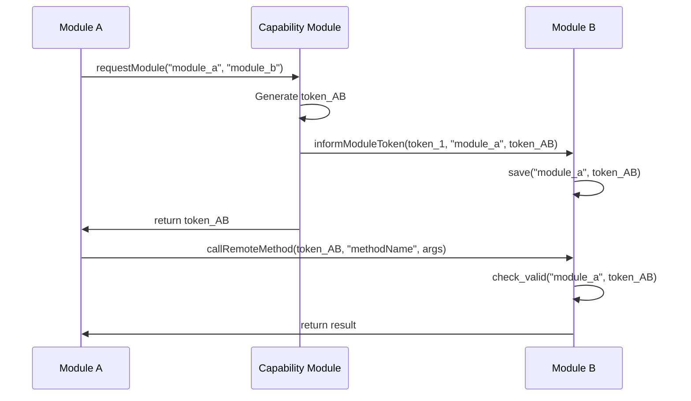

## Abstract

This RFC documents the authentication and capability system for the Logos Core Platform as specified in the current proof-of-concept implementation. The system provides token-based authentication for inter-module communication in the process-isolated architecture, using a central Capability Module for token issuance and ModuleProxy components for token validation.

## Background / Rationale / Motivation

The Logos Core Platform uses process isolation where each module runs in a separate process. To secure communication between these isolated processes, the system implements token-based authentication that:

- **Authenticates Inter-Module Communication**: Verifies that calls between modules are authorized
- **Prevents Unauthorized Access**: Ensures modules cannot communicate without proper tokens
- **Complements Process Isolation**: Adds communication-level security to OS-level process boundaries
- **Enables Controlled Access**: Allows modules to request access to other modules through a central authority

## Authentication Architecture Overview

### Token-Based Authentication Model

Based on the specifications, the system uses tokens to authenticate all inter-module communication. The authentication involves:

1. **Core-to-Module Authentication**: When the core loads a module, it generates a token for that module
2. **Module-to-Module Authentication**: When modules need to communicate, they request tokens from the Capability Module

```text
Core Process                 Module A Process            Module B Process
┌──────────────┐              ┌─────────────────┐        ┌─────────────────┐
│ Core         │              │ Module A        │        │ Module B        │
│              │              │                 │        │                 │
│ ┌─────────┐  │   core_token │ ┌─────────────┐ │        │ ┌─────────────┐ │
│ │  Token  │  ├─────────────►│ │TokenManager │ │        │ │TokenManager │ │
│ │Generator│  │              │ └─────────────┘ │        │ └─────────────┘ │
│ └─────────┘  │              │                 │        │       ▲         │
│              │              │                 │        │       │         │
│ ┌──────────┐ │              │                 │        │       │         │
│ │Capability│ │   token_AB   │                 │token_AB│       │         │
│ │ Module   │ ├──────────────┼─────────────────┼───────►│       │         │
│ └──────────┘ │              │                 │        │       │         │
└──────────────┘              └─────────────────┘        └───────┼─────────┘
                                      │                          │
                                      │   authenticated_call(    │
                                      │     token_AB,            │
                                      │     "methodName",        │
                                      │     args)                │
                                      └─────────────────────────►│
```

## Authentication Flow (From Specifications)

### Module-to-Module Authentication Process

According to the specifications, when modules need to communicate with each other, they follow this authentication flow:



**Authentication Steps (As Documented)**:

1. **Module A** requests access to **Module B** via `requestModule("module_a", "module_b")`
2. **Capability Module** generates a token for this module pair
3. **Capability Module** informs **Module B** about the new token via `informModuleToken()`
4. **Module B** saves the token associated with **Module A**
5. **Capability Module** returns the token to **Module A**
6. **Module A** can now make authenticated calls to **Module B** using the token
7. **Module B** validates the token using `check_valid()` before processing the call

## Core Components (As Specified)

### TokenManager

According to the specifications, each module maintains a thread-safe TokenManager for storing authentication tokens. The TokenManager handles:

- **Thread-safe token storage** for multi-threaded environments
- **Token validation** for incoming requests
- **Asynchronous token management** that is transparent to developers

### ModuleProxy

The specifications indicate that ModuleProxy:

- **Wraps module objects** to enforce token validation
- **Validates tokens** before dispatching method calls to the actual module
- **Supports token validation** for method calls with various argument counts
- **Returns empty results** for calls with invalid or missing tokens

Key security property from specifications: *"Tokens are checked before method dispatching"*

### Capability Module

Based on the specifications, the Capability Module:

- **Issues tokens** when modules need to communicate
- **Notifies both modules** when a token is issued
- **Acts as central authority** for inter-module communication authorization

The specifications mention two key methods:

- `requestModule()` - for requesting access to another module
- `informModuleToken()` - for notifying modules about issued tokens

## Security Properties (From Specifications)

### Token Requirements

According to the specifications:

- **Tokens are required** for all remote method calls
- **Non-empty tokens** must be provided (empty tokens are rejected)
- **Token validation** occurs before each method dispatch
- **Invalid authentication** results in empty return values

### Authentication Characteristics

The specifications indicate:

- **Process isolation** provides the first layer of security
- **Token-based authentication** secures inter-process communication
- **Centralized token issuance** through the Capability Module
- **Per-call validation** via ModuleProxy

## Implementation Status (As Documented)

### Current Capabilities

Based on the specifications, the current system provides:

- **Basic token generation and distribution**
- **Thread-safe token storage via TokenManager**
- **Token validation enforcement via ModuleProxy**
- **Centralized capability management via Capability Module**
- **Asynchronous token management transparent to developers**

### Module Integration

The specifications indicate that:

- **Token management is handled internally** and transparent to developers
- **ModuleProxy automatically wraps** module objects for security
- **Authentication is required** for all remote calls
- **Method introspection** is supported while maintaining security

## Communication Patterns (As Specified)

### Remote Method Calls

According to the specifications, remote method calls:

- **Must include valid tokens** for authentication
- **Are validated by ModuleProxy** before dispatch
- **Return empty results** if authentication fails
- **Support multiple argument patterns** (as mentioned in token validation)

### Token Distribution

The specifications describe token distribution as:

- **Core generates initial tokens** when loading modules
- **Capability Module issues tokens** for module-to-module communication
- **Both communicating modules** are notified when tokens are issued
- **Tokens are stored** in each module's TokenManager

## Limitations and Scope

### Current Implementation Scope

This RFC documents the authentication system as specified in the current proof-of-concept. The specifications describe:

- **Basic token-based authentication**
- **Core authentication infrastructure**
- **Essential security enforcement**

### Areas Not Covered in Current Specifications

The following areas are not detailed in the current specifications:

- **Token persistence mechanisms**
- **Token expiration policies**
- **Advanced security features**
- **Detailed error handling procedures**
- **Performance optimization strategies**

## Testing Considerations (Based on Specifications)

### Security Validation

Based on the authentication requirements, testing should verify:

- **Token validation** correctly rejects invalid tokens
- **Empty token rejection** functions as specified
- **Thread-safe token storage** works correctly
- **ModuleProxy enforcement** prevents unauthorized access

### Integration Testing

The specifications suggest testing:

- **Module-to-module communication flows**
- **Capability Module token issuance**
- **TokenManager thread safety**
- **Authentication failure handling**

## Future Enhancements

While not specified in the current documentation, potential areas for enhancement may include:

- **Token persistence across module restarts**
- **Token expiration and refresh mechanisms**
- **Enhanced security logging and auditing**
- **Token revocation capabilities**
- **Advanced policy frameworks**

## Conclusion

The Logos Core Authentication and Capability System, as documented in the current specifications, provides essential token-based security for the process-isolated modular architecture. The system ensures that:

- **All inter-module communication requires valid tokens**
- **Centralized token issuance** is managed by the Capability Module
- **Token validation** is enforced through ModuleProxy components
- **Thread-safe token storage** is provided by TokenManager

This authentication foundation enables secure communication between isolated module processes while maintaining the architectural benefits of process separation.

## References

- [Logos Core Architecture RFC](./logos-core-architecture.md)
- [Logos Core Proof of Concept - Specifications](https://github.com/logos-co/logos-core-poc/blob/develop/docs/specs.md)

## Copyright

Copyright and related rights waived via [CC0](https://creativecommons.org/publicdomain/zero/1.0/).
