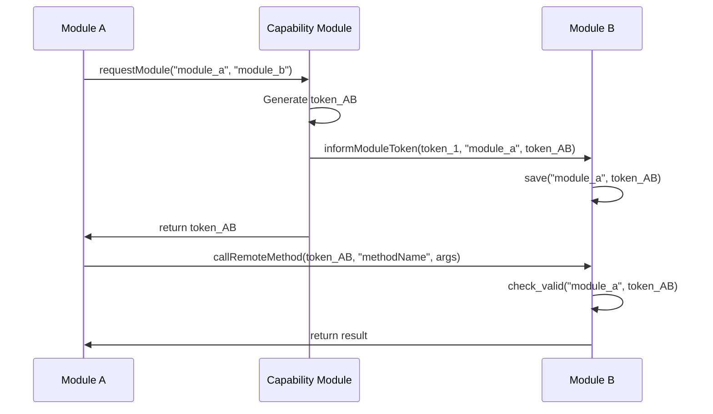

--- 
title: LOGOS-CORE-ARCHITECTURE
name: Logos Core Modular Platform Architecture
status: draft
category: Standards Track
tags: logos-core, modular-architecture, process-isolation, authentication
editor: Logos Core Team
contributors:
- Filip Dimitrijevic <filip@status.im> 
---

## Abstract

This RFC defines the foundational architecture of the Logos Core Platform, a modular runtime for decentralized applications where independently developed modules run in separate processes and communicate through authenticated channels. The platform provides a C API for core management, a C++ SDK for module development, and built-in modules for capability management and system coordination.

## Background / Rationale / Motivation

Decentralized applications require architectural patterns that support:

- **Independent Development**: Teams must develop and deploy modules without coordinating releases
- **Fault Isolation**: Module crashes should not compromise the entire system
- **Security Boundaries**: Modules should not have direct access to each other's memory or resources
- **Protocol Composition**: Different protocols (p2p, blockchain, legacy) need to interoperate seamlessly
- **Dynamic Management**: Applications should load, unload, and introspect modules at runtime

Traditional monolithic architectures fail these requirements. The Logos Core Platform addresses them through process-isolated modules with authenticated inter-process communication.

## Core Architecture

### Process Isolation Model

Each module runs in a separate process launched via `logos_host`, a lightweight executable that:

- Loads a single module as a Qt plugin
- Establishes authenticated communication with the core
- Registers the module with the remote object registry
- Provides process boundaries for security and fault tolerance

```text
Core Process              Module Process A           Module Process B
┌─────────────┐          ┌─────────────────┐       ┌─────────────────┐
│ Logos Core  │          │   logos_host    │       │   logos_host    │
│             │◄────────►│                 │       │                 │
│ ┌─────────┐ │   IPC    │ ┌─────────────┐ │  IPC  │ ┌─────────────┐ │
│ │Registry │ │          │ │   Module A  │ │◄─────►│ │   Module B  │ │
│ │  Host   │ │          │ │   Plugin    │ │       │ │   Plugin    │ │
│ └─────────┘ │          │ └─────────────┘ │       │ └─────────────┘ │
└─────────────┘          └─────────────────┘       └─────────────────┘
```

### Inter-Process Communication

Communication uses Qt Remote Objects over local sockets:

- **Registry-based discovery**: Modules register objects in `QRemoteObjectRegistryHost`
- **Asynchronous method calls**: Non-blocking invocation with callbacks
- **Event propagation**: Modules can subscribe to events from other modules
- **Automatic marshalling**: Qt handles serialization of method parameters and return values

### Authentication and Security

All inter-module communication requires authentication tokens. When a module is loaded, the core generates a token and sends it to the module process. For module-to-module communication, they request authorization from the Capability Module, which issues a token and notifies both modules.

**Authentication Flow (from specs.md Section 6)**:



Each Module stores tokens in a thread-safe `TokenManager`. `ModuleProxy` validates tokens before dispatching method calls to the underlying module implementation.

## Core API Specification

The platform exposes a C API for core management and module lifecycle:

### Initialization and Lifecycle

| Function | Purpose |
|----------|---------|
| `logos_core_initialize()` | Initializes global state and optionally sets the plugin directory. Creates a QCoreApplication if one does not exist and sets up the remote object registry host. |
| `logos_core_set_plugins_dir(const char* path)` | Specifies where to look for modules. Must be called before starting. |
| `logos_core_start()` | Scans the plugin directory, processes metadata, creates the Core Manager module, loads the built-in capability module, and starts the remote object registry. |
| `logos_core_exec()` | Runs the Qt event loop. Returns when the application exits. |
| `logos_core_cleanup()` | Unloads all modules, stops processes and cleans up global state. |

### Module Management

| Function | Purpose |
|----------|---------|
| `logos_core_get_loaded_plugins()` | Returns a list of currently loaded modules (names). |
| `logos_core_get_known_plugins()` | Returns a list of all modules discovered, even if not loaded. |
| `logos_core_load_plugin(const char* name)` | Loads a module by name. Starts a logos_host process, sends an auth token, waits for the module to register and records it as loaded. |
| `logos_core_unload_plugin(const char* name)` | Terminates the module's process and removes it from loaded modules. |
| `logos_core_process_plugin(const char* path)` | Reads a module file's metadata and adds it to the list of known modules without loading it. |
| `logos_core_get_token(const char* moduleName)` | Returns the auth token associated with a module. |

### Cross-Language Integration (Experimental)

These are experimental APIs used by NodeJS/Electron applications:

| Function | Purpose |
|----------|---------|
| `logos_core_call_plugin_method_async(const char* plugin_name, const char* method_name, const char* params_json, callback, void* user_data)` | Invokes a method on a loaded plugin asynchronously. Parses `params_json` array, connects via `LogosAPI`, calls `invokeRemoteMethod`, and returns result or error through `callback`. |
| `logos_core_register_event_listener(const char* plugin_name, const char* event_name, callback, void* user_data)` | Registers an event listener on a plugin. Stores listener, waits for plugin readiness, attaches via `LogosAPI`, and triggers `callback` with event JSON when emitted. |
| `logos_core_process_events()` | Processes Qt events without blocking, allowing integration with external event loops. |

## Plugin Interface Contract

All modules must implement `PluginInterface`:

```cpp
class PluginInterface {
public:
    virtual QString name() const = 0;
    virtual QString version() const = 0;
    
signals:
    void eventResponse(const QString& eventName, const QVariantList& data);
};
```

Modules also conventionally implement:

```cpp
virtual void initLogos(LogosAPI* api) = 0;  // Called after loading
```

**Key Requirements**:

- Methods exposed to other modules must be marked `Q_INVOKABLE`
- Module must provide `metadata.json` with dependencies and capabilities
- Build system must produce shared library (`.so`/`.dylib`/`.dll`)

## SDK Architecture Overview

The C++ SDK provides abstractions over Qt Remote Objects:

### LogosAPI (Entry Point)

- Single instance per module
- Encapsulates a provider and a cache of clients
- Provides access to clients for calling other modules
- Handles token storage and retrieval through TokenManager

```cpp
// Module initialization
LogosAPI* api = new LogosAPI("module_name");

// Call another module
QVariant result = api->getClient("target_module")
    ->invokeRemoteMethod("target_module", "methodName", args);

// Subscribe to events
api->getClient("source_module")->onEvent(remoteObject, this, "eventName", callback);
```

### Provider/Client Separation

- **LogosAPIProvider**: Exposes module's interface via `ModuleProxy` on `local:logos_<moduleName>`
- **LogosAPIClient**: Connects to other modules and invokes their methods via `LogosAPIConsumer`
- **ModuleProxy**: Validates tokens and dispatches calls to actual module implementation
- **TokenManager**: Thread-safe storage and validation of authentication tokens

The SDK abstracts away remote-object registry and token management, enabling modules to perform RPC-like calls without understanding the underlying IPC mechanism.

## Module Metadata Schema

Each module requires `metadata.json`:

```json
{
  "name": "module_name",
  "version": "1.0.0", 
  "description": "Module description",
  "author": "Author name",
  "type": "core",
  "dependencies": ["required_module_name"],
  "capabilities": ["capability_provided"],
  "include": ["external_lib.so", "resources/"]
}
```

**Field Requirements**:

- `name`: Unique module identifier
- `version`: Semantic version string  
- `description`: Human-readable description
- `author`: Module author or organization
- `type`: Module type (always "core" for this platform)
- `dependencies`: Array of required module names
- `capabilities`: Array of capabilities this module provides
- `include`: Files that must be copied when installing this module

## Built-in Core Modules

### Core Manager Module

**Purpose**: Exposes core functionality as a module  
**Key Methods**:

- `initialize(argc, argv)` - Prepare the module
- `setPluginsDirectory(directory)` - Set plugin directory
- `start()` - Start the core
- `cleanup()` - Shutdown the core
- `getLoadedPlugins()` - Return list of loaded modules
- `getKnownPlugins()` - Return JSON array of all known modules
- `loadPlugin(pluginName)` - Load a plugin by name
- `unloadPlugin(pluginName)` - Unload a plugin by name
- `processPlugin(filePath)` - Process plugin metadata
- `getPluginMethods(pluginName)` - Introspect module's methods

### Capability Module

**Purpose**: Token issuance for inter-module communication
**Key Methods**:

- `requestModule(fromModuleName, moduleName)` → Returns authentication token

**Responsibilities**:

- Generate random UUID tokens for module-to-module calls
- Inform target modules of requesting module's name and new token
- Act as capability broker and permission controller

## Communication Patterns

### Method Invocation

```cpp
// Call with automatic token attachment
QVariant result = logosAPI->getClient("waku")
    ->invokeRemoteMethod("waku", "subscribeTopic", topicName);
```

### Event Subscription

```cpp
// Subscribe to events from another module
QObject* chatObject = logosAPI->getClient("chat")->requestObject("chat");
logosAPI->getClient("chat")->onEvent(chatObject, this, "chatMessage", 
    [this](const QString &eventName, const QVariantList &data) {
        // Handle event
    });
```

### Event Publishing

```cpp
// Trigger event for subscribers
QVariantList data;
data << timestamp << nick << message;
logosAPI->getClient("chat")->onEventResponse(this, "chatMessage", data);
```

## Application Integration

### C++ Applications

```cpp
int main(int argc, char *argv[]) {
    QApplication app(argc, argv);
    
    // Set plugin directory
    QString pluginsDir = QDir::cleanPath(QCoreApplication::applicationDirPath()+"/bin/modules");
    logos_core_set_plugins_dir(pluginsDir.toUtf8().constData());   

    // Start the core
    logos_core_start();                                           

    // Load modules
    logos_core_load_plugin("package_manager");                     

    // Create LogosAPI for this app
    LogosAPI logosAPI("core");

    return app.exec();
}
```

### Cross-Language Applications

JavaScript/Electron applications use FFI bindings:

```javascript
const ffi = require('ffi-napi');
const core = ffi.Library('./liblogos_core.so', {
  logos_core_start: ['void', []],
  logos_core_load_plugin: ['int', ['string']],
  logos_core_call_plugin_method_async: ['void', ['string','string','string',callbackType,'pointer']]
});

// Initialize and use
core.logos_core_start();
core.logos_core_load_plugin('chat');
core.logos_core_call_plugin_method_async('chat', 'initialize', '[]', callback, null);
```

Applications should set `LOGOS_HOST_PATH` environment variable before initializing the core to ensure the core can locate the `logos_host` executable.

## Security Model

### Process Boundaries

- Operating system enforces memory isolation between modules
- Module crashes cannot compromise other modules or core
- Resource limits can be applied per-process

### Authentication Requirements

- All remote calls must include valid authentication tokens
- Tokens are module-pair specific and cannot be reused
- `ModuleProxy` validates tokens before dispatching calls

### Capability-based Access

- Modules must explicitly request access to other modules via Capability Module
- Future: policy enforcement and capability management

## Development Workflow

### Module Creation

- Define interface inheriting from `PluginInterface`
- Implement module class with `Q_INVOKABLE` methods
- Create `metadata.json` with dependencies
- Configure CMakeLists.txt for shared library build
- Test with core platform

### Multi-Language Support

- **C++**: Native SDK with full Qt integration
- **JavaScript**: FFI bindings with event pumping via `logos_core_process_events()`
- **Nim**: Wrapper over C API
- **Future**: Any language with Qt bindings or FFI support

## Known Limitations and Design Decisions

### logos_host Dependency

- Modules require separate `logos_host` executable for process spawning
- Alternative approaches (forking) conflict with Qt's threading model on macOS due to CoreFoundation issues
- Core provides fallback strategies for locating `logos_host`:
  - `LOGOS_HOST_PATH` environment variable
  - Application directory
  - Relative to plugins directory

### Platform Dependencies

- Platform built on Qt Remote Objects for IPC
- `QRemoteObjectRegistryHost` has no built-in security mechanisms
- Each module spawns separate process with memory overhead

### API Improvements Needed

Current `LogosAPI` shaped by authentication development. Potential improvements:

- Modules only need `LogosAPIClient`, not full `LogosAPI`
- Simplified event triggering: `logosAPI->trigger("eventName", data)`
- Simplified event listening: `logosAPI->onEvent("module", "event", callback)`
- Merge duplicate token methods (`informModuleToken` vs `informModuleToken_module`)

### Build System Complexity

Library path handling required for modules with external dependencies:

- **macOS**: Uses `install_name_tool` to set `@rpath` for portable library references
- **Linux**: Uses `patchelf --set-rpath '$ORIGIN'` for relative library paths

## Implementation Status

**Current State**: Proof of Concept

- Core architecture functional with process isolation
- Authentication system working with token validation  
- C++ SDK available for module development
- Example modules operational (Waku, Chat, IRC, Wallet)
- Experimental JavaScript and Nim bindings available

**Immediate Priorities**:

- API stabilization based on lessons learned
- Enhanced error handling and diagnostics
- Performance optimization
- Extended language binding support

## Related and Future RFCs

This RFC establishes the foundational architecture. The following RFCs will provide detailed specifications for specific subsystems:

### Planned Sub-RFCs for the LOGOS-CORE-ARCHITECTURE

**Authentication and Capability System**:

- Detailed token generation, distribution, and validation mechanisms
- ModuleProxy implementation and security enforcement
- Capability negotiation protocols and policy framework

**SDK Implementation Specification**:

- LogosAPIProvider/Client/Consumer detailed architecture
- Qt Remote Objects integration patterns
- TokenManager implementation and thread safety

**Cross-Language Integration**:

- JavaScript/Node.js FFI binding specification
- Event pumping patterns for external runtimes
- Nim SDK implementation details

**Module Development Guide**:

- Complete module creation walkthrough
- Build system patterns and cross-platform considerations
- Library dependency management (rpath, install_name_tool)

**Protocol Modules Specification**:

- Waku module implementation and libwaku integration
- Chat module architecture and message handling
- IRC bridge implementation patterns
- Wallet module and blockchain integration

**Package Management and Distribution**:

- Package Manager module detailed specification
- Module installation, dependency resolution, and versioning

**Performance and Scalability**:

- Benchmarking methodology
- Scaling considerations for large module deployments

## Conclusion

The Logos Core Platform establishes a foundation for modular decentralized applications through:

- **Process isolation** ensuring fault tolerance and security boundaries
- **Authenticated communication** providing controlled inter-module access
- **Plugin architecture** enabling independent development and deployment
- **Cross-language support** allowing diverse technology integration

This architecture enables teams to build complex decentralized systems while maintaining security, modularity, and development independence.

## References

- [Logos Core Implementation](https://github.com/logos-co/logos-core-poc)
- [Qt Remote Objects Documentation](https://doc.qt.io/qt-6/qtremoteobjects-index.html)

## Copyright

Copyright and related rights waived via [CC0](https://creativecommons.org/publicdomain/zero/1.0/).
