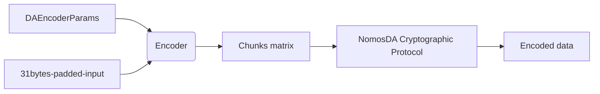
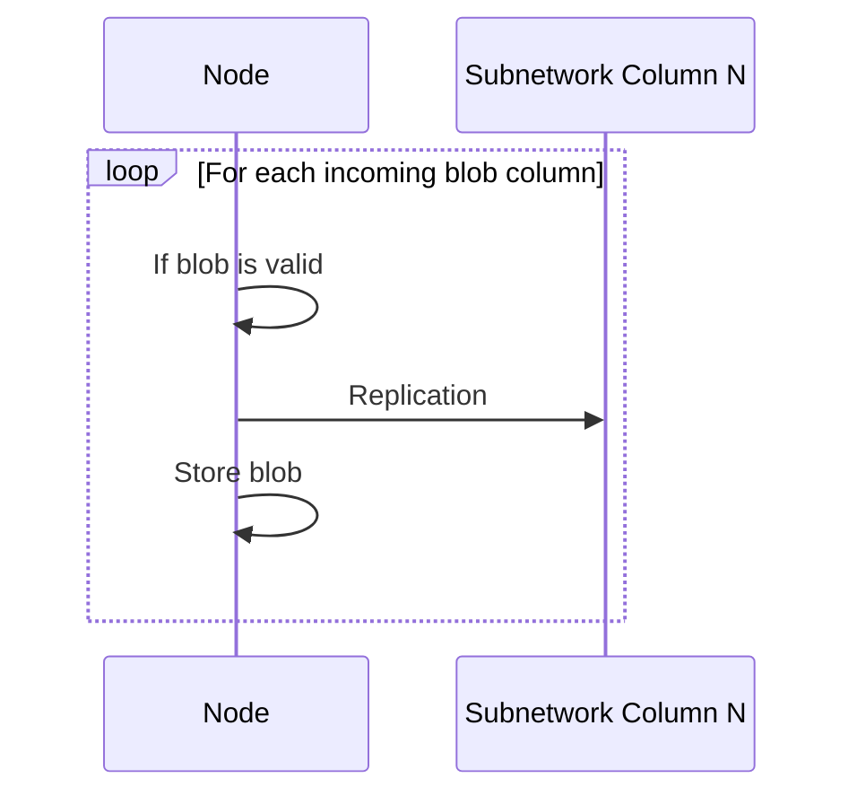

--- 
title: NOMOSDA-ENCODING
name: NomosDA Encoding Protocol 
status: raw
category: 
tags: data-availability
editor: Daniel Sanchez-Quiros <danielsq@status.im>
contributors:
- Daniel Kashepava <danielkashepava@status.im>
- Álvaro Castro-Castilla <alvaro@status.im>
- Filip Dimitrijevic <filip@status.im>
---

## Introduction

This document describes the encoding and verification processes of NomosDA,
which is the data availability (DA) solution used by the Nomos blockchain.
NomosDA provides an assurance that all data from Nomos zones, referred to as blobs,
are accessible and verifiable by every network participant.

This document presents an implementation specification describing how:

* Executors encode blobs they want to upload to the Data Availability layer
* Other nodes implement the verification of blobs that were already uploaded to DA.

## Definitions

* **Encoder**: Encodes the data as per the encoding protocol. In the Nomos architecture,
the executor of a zone acts as the encoder.
* **Verifier**: Verifies its portion of the distributed blob data as per the verification protocol.
In the Nomos architecture, the DA nodes act as the verifiers.

## Overview

In the encoding stage, the encoder takes the DA parameters and the padded blob data
and creates an initial matrix of data chunks.
This matrix is expanded using Reed-Solomon coding and various commitments
and proofs are created for the data.

When a verifier receives a sample, it verifies the data it receives from the encoder
and broadcasts the information if the data is verified. Finally,
the verifier stores the sample data for the required length of time.

## Construction

The encoder and verifier use the [NomosDA cryptographic protocol](https://www.notion.so/4bf3bb62cfb64422ab48b5b60aab6a73?pvs=25) to carry out their respective functions.
These functions are implemented as abstracted and configurable software entities
that allow the original data to be encoded and verified via high-level operations.

### Glossary

| Name         | Description                                                                                              | Representation      |
| ------------ | -------------------------------------------------------------------------------------------------------- | ------------------- |
| `Commitment`   | Commitment as per the [NomosDA Cryptographic Protocol](https://www.notion.so/NomosDA-Cryptographic-Protocol-4bf3bb62cfb64422ab48b5b60aab6a73?pvs=21)                                                     | `bytes`             |
| `Proof`        | Proof as per the [NomosDA Cryptographic Protocol](https://www.notion.so/NomosDA-Cryptographic-Protocol-4bf3bb62cfb64422ab48b5b60aab6a73?pvs=21)                                                          | `bytes`             |
| `ChunksMatrix` | Matrix of chunked data. Each chunk is 31 bytes. Row and Column sizes depend on the encoding necessities. | `List[List[bytes]]` |

### Encoder

An encoder takes a set of parameters and the blob data,
and creates a matrix of chunks that it uses to compute the necessary cryptographic data.
It produces the set of Reed-Solomon (RS) encoded data, the commitments,
and the proofs that are needed prior to [dispersal](https://www.notion.so/1818f96fb65c805ca257cb14798f24d4?pvs=25).



#### Encoding Process

The encoder executes the encoding process as follows:

1. The encoder takes the following **Input Parameters**:

    ```python
    class DAEncoderParams:
        column_count: int
        bytes_per_field_element: int
    ```

    | Name                   | Description                                                                                                                                             | Representation     |
    |------------------------|---------------------------------------------------------------------------------------------------------------------------------------------------------|--------------------|
    | `column_count`         | The number of subnets available for dispersal in the system.                                                                                            | `usize`, `int` in Python |
    | `bytes_per_field_element` | The amount of bytes per data chunk. This is set to 31 bytes. Each chunk has 31 bytes rather than 32 to ensure that the chunk value does not exceed the maximum value on the [BLS12-381 elliptic curve](https://hackmd.io/@benjaminion/bls12-381?ref=blog.nomos.tech). | `usize`, `int` in Python |

2. The encoder also includes the **blob data** to be encoded, which must be of a size that is a multiple of `bytes_per_field_element` bytes. Clients are responsible for padding the data so it fits this constraint.
3. The encoder splits the data into `bytes_per_field_element`-sized chunks. It also arranges  
   these chunks into rows and columns, creating a **matrix**.
    a. The amount of columns of the matrix needs to fit with the `column_count` parameter,  
       taking into account the `rs_expansion_factor` (currently fixed to 2).  
        i. This means that the size of each row in this matrix is:  
           (`bytes_per_field_element` * `column_count`) / `rs_expansion_factor`
    b. The amount of rows depends on the size of the data.
4. The data is encoded as per the cryptographic details.
5. The `encoder` provides the **encoded data** set:

    | Name                         | Description                                                          | Representation        |
    |------------------------------|----------------------------------------------------------------------|-----------------------|
    | `data`                       | Original data                                                        | `bytes`              |
    | `chunked_data`               | Matrix before RS expansion                                           | `ChunksMatrix`       |
    | `extended_matrix`            | Matrix after RS expansion                                            | `ChunksMatrix`       |
    | `row_commitments`            | Commitments for each matrix row                                     | `List[Commitment]`   |
    | `row_proofs`                 | Proofs for each chunk in each row                                   | `List[List[Proof]]`  |
    | `column_commitments`         | Commitments for each encoded matrix column                          | `List[Commitment]`   |
    | `aggregated_column_commitment` | Commitment over the ordered list of column commitments             | `Commitment`         |
    | `aggregated_column_proofs`   | Proofs for each column commitment hash related to the aggregate     | `List[Proof]`        |

    ```python
    class EncodedData:
        data: bytes
        chunked_data: ChunksMatrix
        extended_matrix: ChunksMatrix
        row_commitments: List[Commitment]
        row_proofs: List[List[Proof]]
        column_commitments: List[Commitment]
        aggregated_column_commitment: Commitment
        aggregated_column_proofs: List[Proof]
    ```

#### Encoder Limits

NomosDA supports blob sizes from **32 KB to 1024 KB**.
This limit is partially due to the resources executors require  
to meet the encoding and bandwidth targets of the protocol.

[In the future](https://www.notion.so/97759b55c3a148239cd562c914b6bbaa?pvs=25#b1a2ab983944405ab064ff002c0118ff), the protocol may be extended to support bigger sizes,  
or more optimal cryptographic encoding schemes may be introduced  
to reduce the stress on executors and reduce bandwidth usage.

### Verifier

A verifier checks the proper encoding of data blobs it receives. A verifier executes
the verification process as follows:

1. The verifier receives a DABlob with the required verification data:

    | Name                         | Description                                                                                          | Representation            |
    |------------------------------|------------------------------------------------------------------------------------------------------|---------------------------|
    | `column`                     | Column chunks (31 bytes) from the encoded matrix                                                     | `List[bytes]`             |
    | `column_idx`                 | Column ID (0..2047). It is directly related to the subnetworks in the network specification.         | `u16`, unsigned 16-bit int (`int` in Python) |
    | `column_commitment`          | Commitment for column                                                                                | `Commitment`             |
    | `aggregated_column_commitment` | Commitment over the ordered list of column commitments                                              | `Commitment`             |
    | `aggregated_column_proof`    | Proof of the `column_commitment` hash related to the `aggregated_column_commitment`                 | `Proof`                  |
    | `row_commitments`            | Commitments for each matrix row                                                                     | `List[Commitment]`       |
    | `row_proofs`                 | Proofs for each chunk in column corresponding to the encoded rows                                    | `List[Proofs]`           |
    | `blob_id`                    | Computed as the hash (`sha3_256`) of `aggregated_column_commitment` + `row_commitments`             | `bytes`                  |

2. Upon receiving the above data, it verifies the column data as per the
   [cryptographic details](https://www.notion.so/4bf3bb62cfb64422ab48b5b60aab6a73?pvs=25).
   If the verification is successful,
   the node triggers the [replication protocol](https://www.notion.so/1818f96fb65c80119fa0e958a087cc2b?pvs=25) and stores the blob.

    ```python
    class DAShare:
        column: List[bytes]
        column_idx: int  # u16
        column_commitment: Commitment
        aggregated_column_commitment: Commitment
        aggregated_column_proof: Proof
        row_commitments: List[Commitment]
        row_proofs: List[Proof]
        def blob_id(self) -> bytes:
            hasher = sha3_256()
            hasher.update(bytes(self.aggregated_column_commitment))
            for c in self.row_commitments:
                hasher.update(bytes(c))
            return hasher.digest()
    ```

### Verification Logic



## Details

The encoder and verifier processes described above make use of a variety of
cryptographic functions to facilitate the correct verification of column data by
verifiers. These functions rely on primitives such as **polynomial commitments** and
**Reed-Solomon erasure codes**, the details of which are outside the scope of this
document.

These details, as well as introductions to the cryptographic primitives being used,  
can be found in the NomosDA Cryptographic Protocol:

[NomosDA Cryptographic Protocol](https://www.notion.so/NomosDA-Cryptographic-Protocol-4bf3bb62cfb64422ab48b5b60aab6a73)

## References

* Encoder Specification: [GitHub/encoder.py](https://github.com/logos-co/nomos-specs/blob/master/da/encoder.py)
* Verifier Specification: [GitHub/verifier.py](https://github.com/logos-co/nomos-specs/blob/master/da/verifier.py)
* Cryptographic protocol: [Notion Link](https://www.notion.so/NomosDA-Cryptographic-Protocol-4bf3bb62cfb64422ab48b5b60aab6a73)

## Copyright

Copyright and related rights waived via [CC0](https://creativecommons.org/publicdomain/zero/1.0/).
