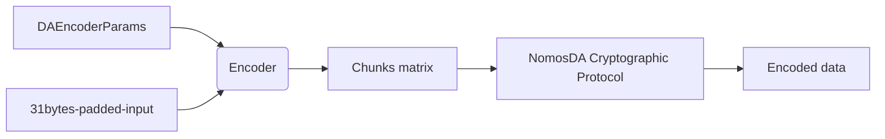
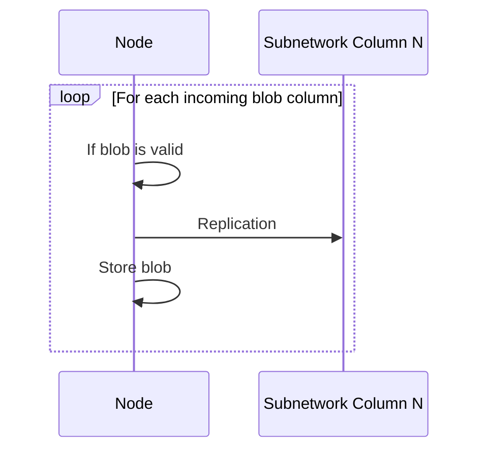

--- 
title: NOMOSDA-ENCODING
name: NomosDA Encoding Protocol 
status: raw
category: 
tags: data-availability
editor: Daniel Sanchez-Quiros <danielsq@status.im>
contributors:
- Daniel Kashepava <danielkashepava@status.im>
- Álvaro Castro-Castilla <alvaro@status.im>
- Filip Dimitrijevic <filip@status.im>
---

## Introduction

This document describes the encoding and verification processes of NomosDA, which is the data availability (DA) solution used by the Nomos blockchain. NomosDA provides an assurance that all data from Nomos zones — referred to as blobs — are accessible and verifiable by every network participant.

This document presents an implementation specification describing how:

* Executors encode blobs they want to upload to the Data Availability layer
* Other nodes implement the verification of blobs that were already uploaded to DA.

## Definitions

* **Encoder**: Encodes the data as per the encoding protocol. In the Nomos architecture, the executor of a zone acts as the encoder.
* **Verifier**: Verifies its portion of the distributed blob data as per the verification protocol. In the Nomos architecture, the DA nodes act as the verifiers.

## Overview

In the encoding stage, the encoder takes the DA parameters and the padded blob data and creates an initial matrix of data chunks. This matrix is expanded using Reed-Solomon coding and various commitments and proofs are created for the data.

When a verifier receives a sample, it verifies the data it receives from the encoder and broadcasts the information if the data is verified. Finally, the verifier stores the sample data for the required length of time.

## Construction

The encoder and verifier use the NomosDA cryptographic protocol to carry out their respective functions. These functions are implemented as abstracted and configurable software entities that allow the original data to be encoded and verified via high-level operations.

### Glossary

| Name         | Description                                                                                              | Representation      |
| ------------ | -------------------------------------------------------------------------------------------------------- | ------------------- |
| Commitment   | Commitment as per the NomosDA Cryptographic Protocol                                                     | `bytes`             |
| Proof        | Proof as per the NomosDA Cryptographic Protocol                                                          | `bytes`             |
| ChunksMatrix | Matrix of chunked data. Each chunk is 31 bytes. Row and Column sizes depend on the encoding necessities. | `List[List[bytes]]` |

### Encoder

An encoder takes a set of parameters and the blob data, and creates a matrix of chunks that it uses to compute the necessary cryptographic data. It produces the set of Reed-Solomon (RS) encoded data, the commitments, and the proofs that are needed prior to dispersal.



#### Encoding Process

1. **Input Parameters**:

    ```python
    class DAEncoderParams:
        column_count: int
        bytes_per_field_element: int
    ```

    * `column_count`: Number of subnets available for dispersal in the system.  
    * `bytes_per_field_element`: Set to 31 bytes to ensure values remain within BLS12-381 field.

2. **Input Blob Data**:

    * Must be padded to a size that is a multiple of `bytes_per_field_element`.

3. **Matrix Construction**:

    * Data is split into 31-byte chunks.  
    * Chunks are arranged into a 2D matrix (rows × columns).  
    * Row size: `(bytes_per_field_element × column_count) / rs_expansion_factor` (fixed at 2).

4. **Encoding Output**:

```python
class EncodedData:
    data: bytes
    chunked_data: ChunksMatrix
    extended_matrix: ChunksMatrix
    row_commitments: List[Commitment]
    row_proofs: List[List[Proof]]
    column_commitments: List[Commitment]
    aggregated_column_commitment: Commitment
    aggregated_column_proofs: List[Proof]
```

#### Encoder Limits

NomosDA supports blob sizes from 32 KB to 1024 KB. These limits may be adjusted in the future with better cryptographic optimizations.

## Verifier

A verifier checks the proper encoding of data blobs it receives. It verifies the column data and then triggers replication and stores the blob.

### Verification Data

```python
class DAShare:
    column: List[bytes]
    column_idx: int  # u16
    column_commitment: Commitment
    aggregated_column_commitment: Commitment
    aggregated_column_proof: Proof
    row_commitments: List[Commitment]
    row_proofs: List[Proof]
    def blob_id(self) -> bytes:
        hasher = sha3_256()
        hasher.update(bytes(self.aggregated_column_commitment))
        for c in self.row_commitments:
            hasher.update(bytes(c))
        return hasher.digest()
```

### Verification Logic



## Details

The encoder and verifier use cryptographic primitives such as polynomial commitments and Reed-Solomon erasure codes. For specifics, see the NomosDA Cryptographic Protocol.

## Annex

* Encoder spec: [GitHub/encoder.py](https://github.com/logos-co/nomos-specs/blob/master/da/encoder.py)
* Verifier spec: [GitHub/verifier.py](https://github.com/logos-co/nomos-specs/blob/master/da/verifier.py)
* Cryptographic protocol: [Notion Link](https://www.notion.so/NomosDA-Cryptographic-Protocol-4bf3bb62cfb64422ab48b5b60aab6a73)
