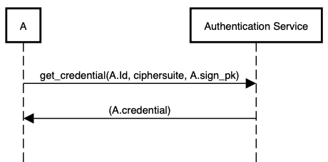
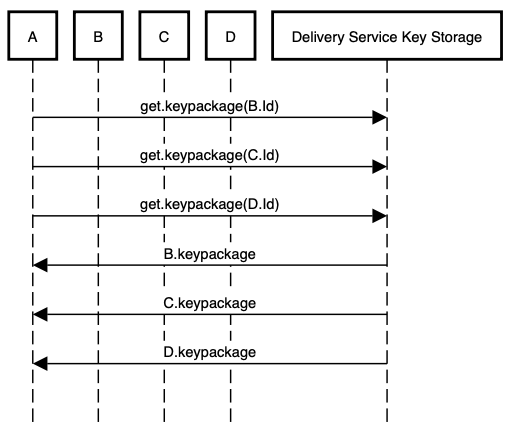
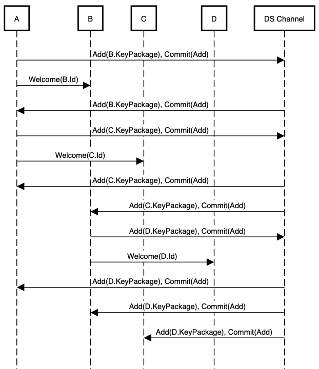
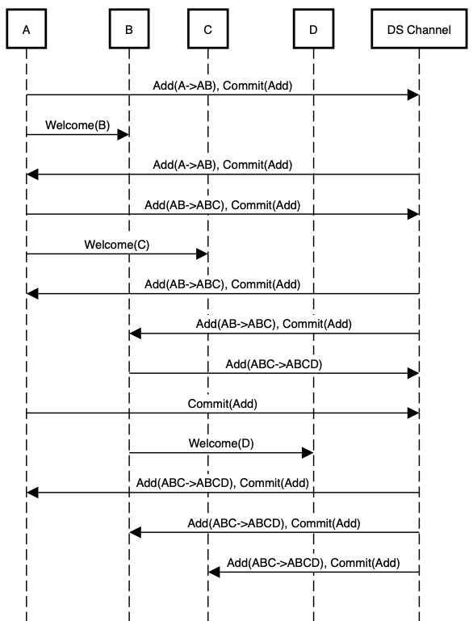
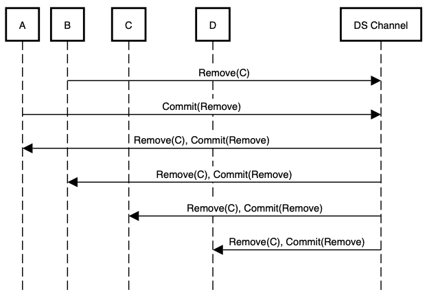
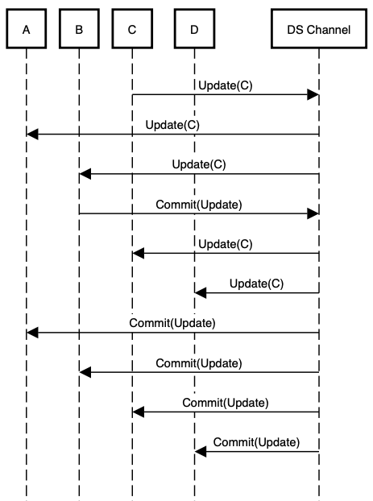
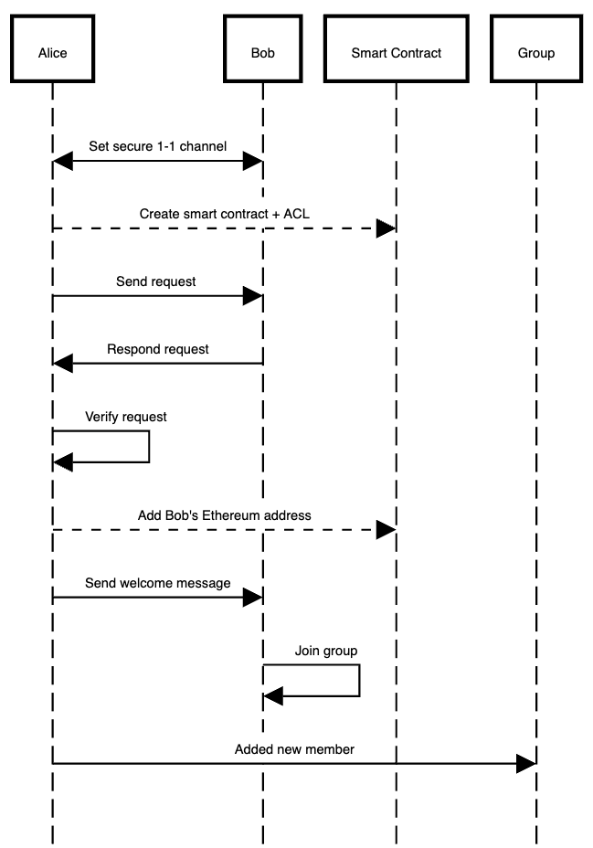
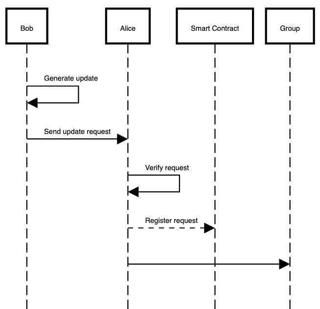

## Motivation

The need for secure communications has become paramount.  
Traditional centralized messaging protocols are susceptible to various security threats,
including unauthorized access, data breaches, and single points of failure.
Therefore a decentralized approach to secure communication becomes increasingly relevant,
offering a robust solution to address these challenges.

This document specifies a private messaging service using the
Ethereum blockchain as authentication service.
Rooted in the existing [model](../../waku/standards/application/20/toy-eth-pm.md),
this proposal addresses the deficiencies related
to forward privacy and authentication inherent
in the current framework.
The specification is divided into the following sections:

- Private group messaging protocol, based on the
[MLS protocol](https://datatracker.ietf.org/doc/rfc9420/).

## Protocol flow

The following steps outline the flow of the protocol.

### Account Registration and Key Generation

Each user starts by registering their Ethereum account.
It is used as the authentication service.
Upon registration, the user generates a ``KeyPackage``
that contains a public key
and supporting metadata required for the MLS group.

### Group Initialization and Member Management

When a new group is created, the initiating client generates a new ``GroupContext``.
It contains a unique group ID and an initial epoch.

To add members, the initiator sends an ``Add`` request,
which includes the new member’s KeyPackage.

Existing members can update their identity in the group using the ``Update`` proposal,
which replaces the sender’s LeafNode in the group’s ratchet tree.

Members can be removed from the group via a ``Remove`` proposal,
which specifies the index of the member to be removed from the tree.
Upon processing this proposal,
the group generates a new group key to ensure that removed members
no longer have access to future communications.

### Commit and Authentication

After receiving a valid list of proposals (``Add``, ``Update``, ``Remove``),
a client initiates a ``Commit`` message,
processing the pending proposals and updates the group’s state.
The ``Commit`` message includes the updated ``GroupContext``
and a ``FramedContentAuthData``,
which ensures that all group members are aware of the changes.
Each member verifies the ``FramedContentAuthData`` to ensure the changes are consistent
with the current epoch of the ``GroupContext``.

### Message Exchange

Once the group is established and all members have processed the latest ``Commit``,
messages can be securely exchanged using
the session keyderived from the group's ratchet tree.
Each message is encapsulated within a ``FramedContent`` structure
and authenticated using the ``FramedContentAuthData``,
ensuring message integrity.
Group members use the current ``GroupContext`` to validate incoming messages
and ensure they are consistent with the current group state.

## Private group messaging protocol

### Background

The [Messaging Layer Security](https://datatracker.ietf.org/doc/rfc9420/) (MLS)
protocol aims at providing a group of users with
end-to-end encryption in an authenticated and asynchronous way.
The main security characteristics of the protocol are:
Message confidentiality and authentication, sender authentication,
membership agreement, post-remove
and post-update security, and forward secrecy and
post-compromise security.
The MLS protocol achieves: low-complexity, group integrity,
synchronization and extensibility.

This document describes how the structure and methods of the
[MLS](https://datatracker.ietf.org/doc/rfc9420/) protocol
are extended for their application in decentralized environments.
The approach described in this document makes use of smart contracts.
It makes use of a smart contract to manage each group chat.
Furthermore, this document describes how to use the Sign-in With Ethereum protocol
as authentication method.

### Structure

Each MLS session uses a single cipher suite that specifies the
primitives to be used in group key computations. The cipher suite MUST
use:

- `X488` as Diffie-Hellman function.
- `SHA256` as KDF.
- `AES256-GCM` as AEAD algorithm.
- `SHA512` as hash function.
- `XEd448` for digital signatures.

Formats for public keys, signatures and public-key encryption MUST
follow Section 5.1 of
[RFC9420](https://datatracker.ietf.org/doc/rfc9420/).

### Hash-based identifiers

Some MLS messages refer to other MLS objects by hash.
These identifiers MUST be computed according to Section 5.2 of
[RFC9420](https://datatracker.ietf.org/doc/rfc9420/).

### Credentials

Each member of a group presents a credential that provides one or more
identities for the
member and associates them with the member's signing key.
The identities and signing key are verified by the Authentication
Service in use for a group.

Credentials MUST follow the specifications of section 5.3 of
[RFC9420](https://datatracker.ietf.org/doc/rfc9420/).

Below follows the flow diagram for the generation of credentials.
Users MUST generate key pairs by themselves.


### Message framing

Handshake and application messages use a common framing structure
providing encryption to ensure confidentiality within the group,
and signing to authenticate the sender.

The structure is:

- `PublicMessage`: represents a message that is only signed,
and not encrypted.
The definition and the encoding/decoding of a `PublicMessage`
MUST follow the specification in section 6.2 of
[RFC9420](https://datatracker.ietf.org/doc/rfc9420/).
- `PrivateMessage`: represents a signed and encrypted message,
with protections for both the content of the message and related metadata.

The definition, and the encoding/decoding of a `PrivateMessage`
MUST follow the specification in section 6.3 of
[RFC9420](https://datatracker.ietf.org/doc/rfc9420/).

Applications MUST use `PrivateMessage` to encrypt application messages.

Applications SHOULD use `PrivateMessage` to encode handshake messages.

Each encrypted MLS message carries a "generation" number which
is a per-sender incrementing counter.
If a group member observes a gap in the generation sequence
for a sender, then they know that they have missed
a message from that sender.

### Nodes contents

> This section makes use of sections 4 and 7 of
[RFC9420](https://datatracker.ietf.org/docrfc9420/).

The nodes of a ratchet tree
(Section 4 in [RFC9420](https://datatracker.ietf.org/docrfc9420/))
contain several types of data:

- Leaf nodes describe individual members.
- Parent nodes describe subgroups.

Contents of each kind of node, and its structure MUST follow
the indications described in sections 7.1 and 7.2 of
[RFC9420](https://datatracker.ietf.org/docrfc9420/).

### Leaf node validation

`KeyPackage` objects describe the client's capabilities and
provides keys that can be used  to add the client to a group.

The validity of a leaf node needs to be verified
at the following stages:

- When a leaf node is downloaded in a `KeyPackage`,
before it is used to add the client to the group.
- When a leaf node is received by a group member in an
Add, Update, or Commit message.
- When a client validates a ratchet tree.

A client MUST verify the validity of a leaf node following the
instructions of section 7.3 in
[RFC9420](https://datatracker.ietf.org/doc/rfc9420/).

### Ratchet tree evolution

Whenever a member initiates an epoch change, they MAY need to refresh
the key pairs of their leaf and of the nodes on their direct path.
This is done to keep forward secrecy and post-compromise security.
The member initiating the epoch change MUST follow this procedure.
A member updates the nodes along its direct path as follows:

- Blank all the nodes on the direct path from the leaf to the root.
- Generate a fresh HPKE key pair for the leaf.
- Generate a sequence of path secrets, one for each node on the leaf's
filtered direct path.

It MUST follow the procedure described in section 7.4 of
[RFC9420](https://datatracker.ietf.org/doc/rfc9420/).

- Compute the sequence of HPKE key pairs `(node_priv,node_pub)`,
one for each node on the leaf's direct path.

It MUST follow the procedure described in section 7.4 of
[RFC9420](https://datatracker.ietf.org/doc/rfc9420/).

### Views of the tree synchronization

After generating fresh key material and applying it to update
their local tree state, the generator broadcasts this update
to other members of the group.
This operation MUST be done according to section 7.5 of
[RFC9420](https://datatracker.ietf.org/doc/rfc9420/).

### Leaf synchronization

Changes to group memberships MUST be represented by
adding and removing leaves of the tree.
This corresponds to increasing or decreasing the depth of the tree,
resulting in the number of leaves being doubled or halved.
These operations MUST be done as described in section 7.7 of
[RFC9420](https://datatracker.ietf.org/doc/rfc9420/).

### Tree and parent hashing

Group members can agree on the cryptographic state of the group by
generating a hash value that represents the contents of the group
ratchet tree and the member’s credentials.
The hash of the tree is the hash of its root node,
defined recursively from the leaves.
Tree hashes summarize the state of a tree at point in time.
The hash of a leaf is the hash of the `LeafNodeHashInput` object.
At the same time the hash of a parent node, including the root,
is the hash of a `ParentNodeHashInput` object.
Parent hashes capture information about
how keys in the tree were populated.

Tree and parent hashing MUST follow the directions
in Sections 7.8 and 7.9 of
[RFC9420](https://datatracker.ietf.org/doc/rfc9420/).

### Key schedule

Group keys are derived using the `Extract` and `Expand` functions from
the KDF for the group's cipher suite,
as well as the functions defined below:

```text
ExpandWithLabel(Secret, Label, Context, Length) = KDF.Expand(Secret, KDFLabel, Length)
DeriveSecret(Secret, Label) = ExpandWithLabel(Secret, Label, "", KDF.Nh)

```

`KDFLabel` MUST be specified as:

```text
struct {
    uint16 length;
    opaque label<V>;
    opaque context<V>;
} KDFLabel;
```

The fields of `KDFLabel` MUST be:

```text
length = Length;
label = "MLS 1.0 " + Label;
context = Context;

```

Each member of the group MUST maintaint a `GroupContext` object
summarizing the state of the group.

The sturcture of such object MUST be:

```text
struct {
      ProtocolVersion version = mls10;
      CipherSuite cipher_suite;
      opaque group_id<V>;
      uint64 epoch;
      opaque tree_hash<V>;
      opaque confirmed_trasncript_hash<V>;
      Extension extension<V>;
} GroupContext;
```

The use of key scheduling MUST follow the indications
in sections 8.1 - 8.7 in
[RFC9420](https://datatracker.ietf.org/doc/rfc9420/).

### Secret trees

For the generation of encryption keys and nonces, the key schedule
begins with the `encryption_secret` at the root and derives a tree of
secrets with the same structure as the group's ratchet tree.
Each leaf in the secret tree is associated with the same group member
as the corresponding leaf in the ratchet tree.

If `N` is a parent node in the secret tree, the secrets of the children
of `N` MUST be defined following section 9 of
[RFC9420](https://datatracker.ietf.org/doc/rfc9420/).

#### Encryption keys

MLS encrypts three different types of information:

- Metadata (sender information).
- Handshake messages (Proposal and Commit).
- Application messages.

For handshake and application messages, a sequence of keys is derived
via a sender ratchet.
Each sender has their own sender ratchet, and each step along the
ratchet is called a generation. These procedures MUST follow
section 9.1 of [RFC9420](https://datatracker.ietf.org/doc/rfc9420/).

#### Deletion schedule

All security-sensitive values MUST be deleted
as soon as they are consumed.

A sensitive value S is consumed if:

- S was used to encrypt or (successfully) decrypt a message.
- A key, nonce, or secret derived from S has been consumed.

The deletion procedure MUST follow the instruction described in
section 9.2 of
[RFC9420](https://datatracker.ietf.org/doc/rfc9420/).

### Key packages

KeyPackage objects are used to ease the addition of clients
to a group asynchronously.

A KeyPackage object specifies:

- Protocol version and cipher suite supported by the client.
- Public keys that can be used to encrypt Welcome messages.
Welcome messages provide new members with
the information to initialize their state
for the epoch in which they were added
or in which they want to
add themselves to the group
- The content of the leaf node that should be added to the tree to
represent this client.

KeyPackages are intended to be used only once and SHOULD NOT be reused.

Clients MAY generate and publish multiple KeyPackages to support
multiple cipher suites.

The structure of the object MUST be:

```text
struct {
      ProtocolVersion version;
      CipherSuite cipher_suite;
      HPKEPublicKey init_key;
      LeafNode leaf_node;
      Extension extensions<V>;
      /* SignWithLabel(., "KeyPackageTBS", KeyPackageTBS) */
      opaque signature<V>;
}
```

```text
struct {
      ProtocolVersion version;
      CipheSuite cipher_suite;
      HPKEPublicKey init_key;
      LeafNode leaf_node;
      Extension extensions<V>;
}
```

`KeyPackage` object MUST be verified when:

- A `KeyPackage` is downloaded by a group member, before it is used to
add the client to the group.
- When a `KeyPackage` is received by a group member in an `Add`
message.

Verification MUST be done as follows:

- Verify that the cipher suite and protocol version of the `KeyPackage`
match those in the `GroupContext`.
- Verify that the `leaf_node` of the `KeyPackage` is valid for a
`KeyPackage`.
- Verify that the signature on the `KeyPackage` is valid.
- Verify that the value of `leaf_node.encryption_key` is different from
the value of the `init_key field`.

HPKE public keys are opaque values in a format defined by Section 4 of
[RFC9180](https://datatracker.ietf.org/doc/rfc9180/).

Signature public keys are represented as opaque values in a format
defined by the cipher suite's signature scheme.

### Group creation

A group is always created with a single member.
Other members are then added to the group using the usual
Add/Commit mechanism.
The creator of a group MUST set:

- the group ID.
- cipher suite.
- initial extensions for the group.

If the creator intends to add other members at the time of creation,
then it SHOULD fetch `KeyPackages` for those members, and select a
cipher suite and extensions according to their capabilities.

The creator MUST use the capabilities information in these
`KeyPackages` to verify that the chosen version and cipher suite is the
best option supported by all members.

Group IDs SHOULD be constructed so they are unique with
high probability.

To initialize a group, the creator of the group MUST initialize a one
member group with the following initial values:

- Ratchet tree: A tree with a single node, a leaf node containing an
HPKE public key and credential for the creator.
- Group ID: A value set by the creator.
- Epoch: `0`.
- Tree hash: The root hash of the above ratchet tree.
- Confirmed transcript hash: The zero-length octet string.
- Epoch secret: A fresh random value of size `KDF.Nh`.
- Extensions: Any values of the creator's choosing.

The creator MUST also calculate the interim transcript hash:

- Derive the `confirmation_key` for the epoch according to Section 8 of
[RFC9420](https://datatracker.ietf.org/doc/rfc9420/).
- Compute a `confirmation_tag` over the empty
`confirmed_transcript_hash` using the `confirmation_key` as described
in Section 8.1 of [RFC9420](https://datatracker.ietf.org/doc/rfc9420/).
- Compute the updated `interim_transcript_hash` from the
`confirmed_transcript_hash` and the `confirmation_tag` as described in
Section 8.2 [RFC9420](https://datatracker.ietf.org/doc/rfc9420/).

All members of a group MUST support the cipher suite and protocol
version in use. Additional requirements MAY be imposed by including a
`required_capabilities` extension in the `GroupContext`.

```text
struct {
      ExtensionType extension_types<V>;
      ProposalType proposal_types<V>;
      CredentialType credential_types<V>;
}
```

The flow diagram shows the procedure to fetch key material
from other users:



Below follows the flow diagram for the creation of a group:



### Group evolution

Group membership can change, and existing members can change their keys
in order to achieve post-compromise security.
In MLS, each such change is accomplished by a two-step process:

- A proposal to make the change is broadcast to the group in a
Proposal message.
- A member of the group or a new member broadcasts a Commit message
that causes one or more proposed changes to enter into effect.

The group evolves from one cryptographic state to another each time a
Commit message is sent and processed.
These states are called epochs and are uniquely identified among states
of the group by eight-octet epoch values.

Proposals are included in a `FramedContent` by way of a `Proposal`
structure that indicates their type:

```text
struct {
      ProposalType proposal_type;
      select (Proposal.proposal_type) {
            case add:                      Add:
            case update:                   Update;
            case remove:                   Remove;
            case psk:                      PreSharedKey;
            case reinit:                   ReInit;
            case external_init:            ExternalInit;
            case group_context_extensions: GroupContextExtensions;
      }
}
```

On receiving a `FramedContent` containing a `Proposal`, a client MUST
verify the signature inside `FramedContentAuthData` and that the epoch
field of the enclosing FramedContent is equal to the epoch field of the
current GroupContext object.
If the verification is successful, then the Proposal SHOULD be cached
in such a way that it can be retrieved by hash in a later Commit
message.

Proposals are organized as follows:

- `Add`: requests that a client with a specified KeyPackage be added to
the group.
- `Update`: similar to Add, it replaces the sender's LeafNode in the
tree instead of adding a new leaf to the tree.
- `Remove`: requests that the member with the leaf index removed be
removed from the group.
- `ReInit`: requests to reinitialize the group with different
parameters.
- `ExternalInit`: used by new members that want to join a group by
using an external commit.
- `GroupContentExtensions`: it is used to update the list of extensions
in the GroupContext for the group.

Proposals structure and semantics MUST follow sections 12.1.1 - 12.1.7
of [RFC9420](https://datatracker.ietf.org/doc/rfc9420/).

Any list of commited proposals MUST be validated either by a the group
member who created the commit, or any group member processing
such commit.
The validation MUST be done according to one of the procedures
described in Section 12.2 of
[RFC9420](https://datatracker.ietf.orgdoc/rfc9420/).

When creating or processing a Commit, a client applies a list of
proposals to the ratchet tree and `GroupContext`.
The client MUST apply the proposals in the list in the order described
in Section 12.3 of [RFC9420](https://datatracker.ietf.org/docrfc9420/).

Below follows the flow diagram for the addition of a member to a group:



The diagram below shows the procedure to remove a group member:



The flow diagram below shows an update procedure:



### Commit messages

Commit messages initiate new group epochs.
It informs group members to update their representation of the state of
the group by applying the proposals and advancing the key schedule.

Each proposal covered by the Commit is included by a
`ProposalOrRef` value.
`ProposalOrRef` identify the proposal to be applied by value
or by reference.
Commits that refer to new Proposals from the committer
can be included by value.
Commits for previously sent proposals from anyone can be sent
by reference.
Proposals sent by reference are specified by including the hash of the
`AuthenticatedContent`.

Group members that have observed one or more valid proposals within an
epoch MUST send a Commit message before sending application data.
A sender and a receiver of a Commit MUST verify that the committed list
of proposals is valid.
The sender of a Commit SHOULD include all valid proposals received
during the current epoch.

Functioning of commits MUST follow the instructions of Section 12.4 of
[RFC9420](https://datatracker.ietf.org/doc/rfc9420/).

### Application messages

Handshake messages provide an authenticated group key exchange
to clients.
To protect application messages sent among the members of a group, the
`encryption_secret` provided by the key schedule is used to derive a
sequence of nonces and keys for message encryption.

Each client MUST maintain their local copy of the key schedule for each
epoch during which they are a group member.
They derive new keys, nonces, and secrets as needed. This data MUST be
deleted as soon as they have been used.

Group members MUST use the AEAD algorithm associated with the
negotiated MLS ciphersuite to encrypt and decrypt Application messages
according to the Message Framing section.
The group identifier and epoch allow a device to know which group
secrets should be used and from which Epoch secret to start computing
other secrets and keys.
Application messages SHOULD be padded to provide resistance against
traffic analysis techniques.
This avoids additional information to be provided to an attacker in
order to guess the length of the encrypted message.
Padding SHOULD be used on messages with zero-valued bytes before
AEAD encryption.

Functioning of application messages MUST follow the instructions of
Section 15 of [RFC9420](https://datatracker.ietf.org/doc/rfc9420/).

## Implementation of the onchain component of the protocol

### Assumptions

- Users have set a secure 1-1 communication channel.
- Each group is managed by a separate smart contract.

### Addition of members to a group

1. On-chain: Alice creates a Smart Contract with ACL.
2. Off-chain: Alice sends the contract address
and an invitation message to Bob over the secure channel.
3. Off-chain: Bob sends a signed response
confirming his Ethereum address and agreement to join.
4. Off-chain: Alice verifies the signature using the public key of Bob.
5. On-chain: Alice adds Bob’s address to the ACL.
6. Off-chain: Alice sends a welcome message to Bob.
7. Off-chain: Alice sends a broadcast message to all group members,
notifying them the addition of Bob.



### Updates in groups

Removal requests and update requests are considered the same operation.
One assumes Alice is the creator of the contract.
They MUST be processed as follows:

1. Off-chain: Bob creates a new update request.
2. Off-chain: Bob sends the update request to Alice.
3. Off-chain: Alice verifies the request.
4. On-chain: If the verification is successfull,
Alice sends it to the smart contract for registration.
5. Off-chain: Alice sends a broadcast message
communicating the update to all users.



## Consideration to secure 1-to-1 channels

There are situations where users need to set one-to-one communication
channels in a secure way. One of these situations is when a user A
wants to add a new user B to an existing group.
In such situations communications between users MUST be done following
the instructions in this
[specification](https://github.com/vacp2p/rfc-index/blob/eth-secpm-splitted/vac/raw/eth-secure-channel.md)
describing the use of X3DH in combination with the double ratchet mechanism.

## Considerations with respect to decentralization

The MLS protocol assumes the existence of a (central, untrusted)
*delivery service*, whose responsabilites include:

- Acting as a directory service providing the initial
keying material for clients to use.
- Routing MLS messages among clients.

The central delivery service can be avoided in protocols using the
publish/gossip approach, such as
[gossipsub](https://github.com/libp2p/specs/tree/master/pubsub/gossipsub).

Concerning keys, each node can generate and disseminate their
encryption key among the other nodes, so they can create a local
version of the tree that allows for the generation of the group key.

Another important component is the authentication service, which is
replaced with SIWE in this specification.

## Privacy and Security Considerations

- For the information retrieval, the algorithm MUST include a access
control mechanisms to restrict who can call the set and get functions.
- One SHOULD include event logs to track changes in public keys.
- The curve vurve448 MUST be chosen due to its higher security level:
224-bit security instead of the 128-bit security provided by X25519.
- It is important that Bob MUST NOT reuse `SPK`.

## Copyright

Copyright and related rights waived via [CC0](https://creativecommons.org/publicdomain/zero/1.0/).

## References

- [Augmented BNF for Syntax Specifications](https://datatracker.ietf.org/doc/html/rfc5234)
- [Gossipsub](https://github.com/libp2p/specs/tree/master/pubsub/gossipsub)
- [HMAC-based Extract-and-Expand Key Derivation Function](https://www.ietf.org/rfc/rfc5869.txt)
- [Hybrid Public Key Encryption](https://datatracker.ietf.org/doc/rfc9180/)
- [Security Analysis and Improvements for the IETF MLS Standard for Group Messaging](https://eprint.iacr.org/2019/1189.pdf)
- [Signed Data Standard](https://eips.ethereum.org/EIPS/eip-191)
- [Standard Signature Validation Method for Contracts](https://eips.ethereum.org/EIPS/eip-1271)
- [The Messaging Layer Security Protocol](https://datatracker.ietf.org/doc/rfc9420/)
- [Toy Ethereum Private Messaging Protocol](https://rfc.vac.dev/spec/20/)
- [Uniform Resource Identifier](https://datatracker.ietf.org/doc/html/rfc3986)
- [WalletConnect URI Format](https://eips.ethereum.org/EIPS/eip-1328)
